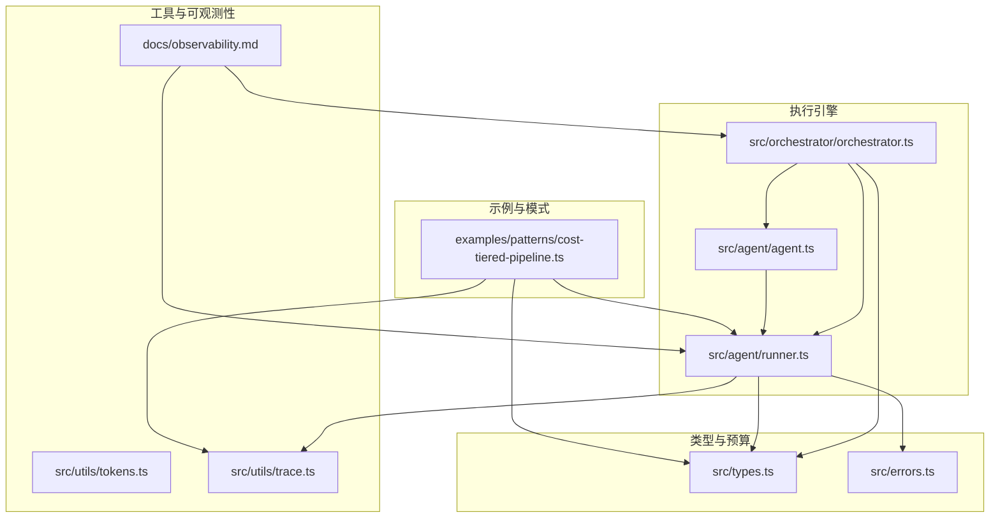
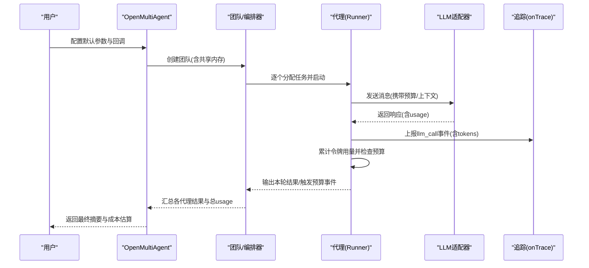
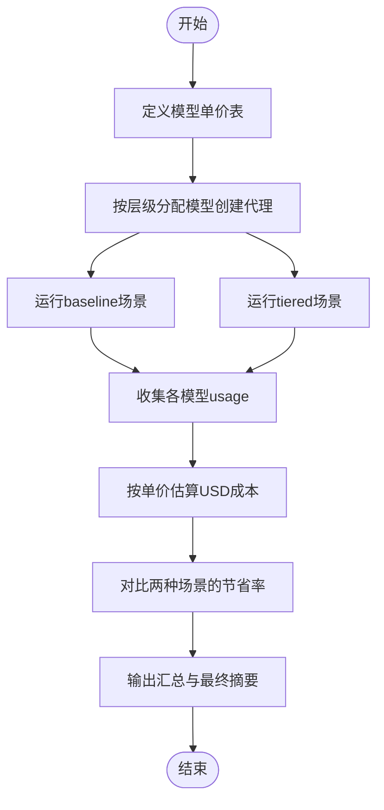
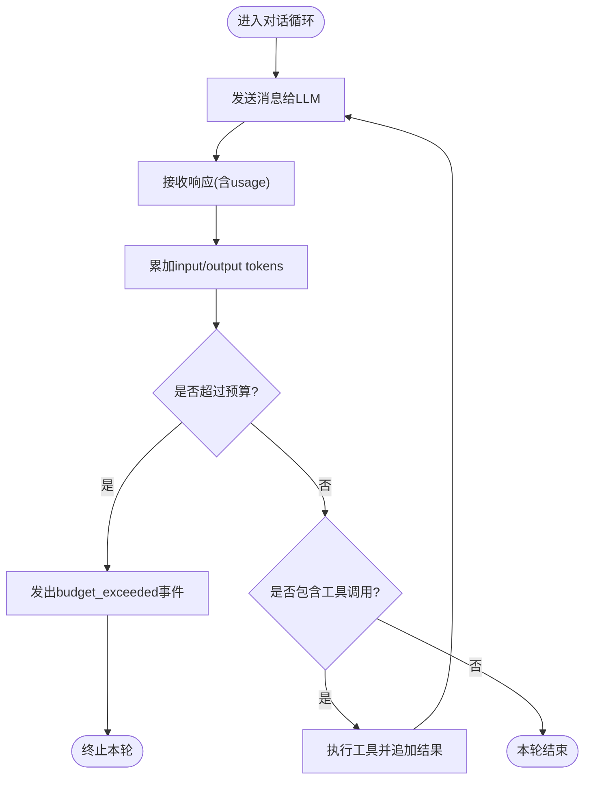
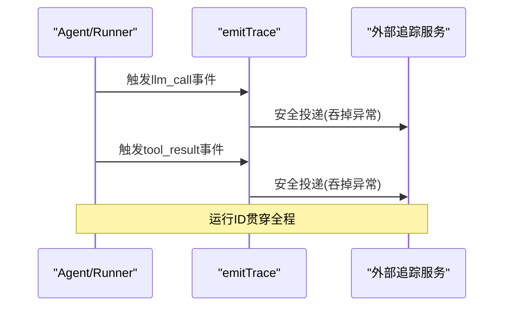
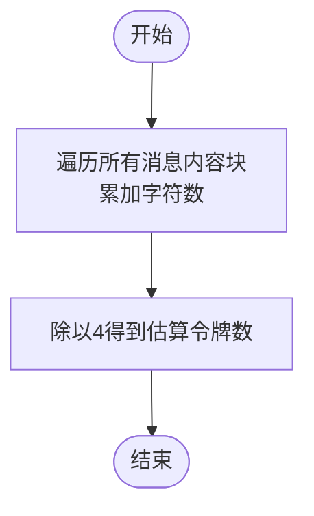
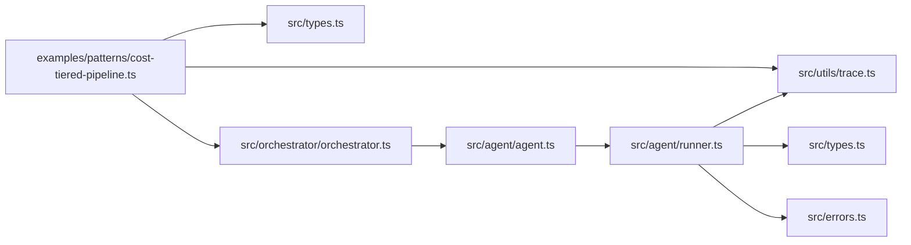

# 成本优化策略

<cite>
**本文引用的文件**
- [cost-tiered-pipeline.ts](file://examples/patterns/cost-tiered-pipeline.ts)
- [tokens.ts](file://src/utils/tokens.ts)
- [trace.ts](file://src/utils/trace.ts)
- [types.ts](file://src/types.ts)
- [orchestrator.ts](file://src/orchestrator/orchestrator.ts)
- [runner.ts](file://src/agent/runner.ts)
- [agent.ts](file://src/agent/agent.ts)
- [errors.ts](file://src/errors.ts)
- [observability.md](file://docs/observability.md)
- [token-budget.test.ts](file://tests/token-budget.test.ts)
- [delegation-budget.test.ts](file://tests/delegation-budget.test.ts)
</cite>

## 目录
1. [引言](#引言)
2. [项目结构](#项目结构)
3. [核心组件](#核心组件)
4. [架构总览](#架构总览)
5. [详细组件分析](#详细组件分析)
6. [依赖关系分析](#依赖关系分析)
7. [性能与成本权衡](#性能与成本权衡)
8. [故障排查指南](#故障排查指南)
9. [结论](#结论)
10. [附录：配置与示例路径](#附录配置与示例路径)

## 引言
本策略文档围绕 Open Multi-Agent 框架的成本优化设计，系统阐述“成本分层流水线”的理念与实现方式。该流水线通过多层级处理策略，在保证质量的前提下显著降低总体成本：以低成本模型进行快速预处理与粗粒度筛选，再用中档模型进行精细加工，最后由旗舰级模型完成最终优化与定稿。文档同时给出成本监控、预算控制与资源分配的最佳实践，并提供可直接参考的示例路径，帮助在不同预算约束下做出合理的性能-成本取舍。

## 项目结构
围绕成本优化的关键模块分布如下：
- 示例与模式：examples/patterns/cost-tiered-pipeline.ts 展示了四阶段流水线与分层定价估算
- 工具与可观测性：src/utils/tokens.ts 提供字符启发式估算；src/utils/trace.ts 提供安全的追踪事件发射；docs/observability.md 定义进度事件与追踪规范
- 类型与预算：src/types.ts 定义 TokenUsage、流式事件等；src/errors.ts 定义预算超限错误类型
- 执行引擎：src/agent/runner.ts 实现对话循环与预算检查；src/agent/agent.ts 封装运行器；src/orchestrator/orchestrator.ts 提供编排与短路判定

图表来源
- [cost-tiered-pipeline.ts:1-560](file://examples/patterns/cost-tiered-pipeline.ts#L1-L560)
- [tokens.ts:1-30](file://src/utils/tokens.ts#L1-L30)
- [trace.ts:1-35](file://src/utils/trace.ts#L1-L35)
- [types.ts:154-187](file://src/types.ts#L154-L187)
- [runner.ts:1019-1056](file://src/agent/runner.ts#L1019-L1056)
- [agent.ts:139-191](file://src/agent/agent.ts#L139-L191)
- [orchestrator.ts:1-200](file://src/orchestrator/orchestrator.ts#L1-L200)

章节来源
- [cost-tiered-pipeline.ts:1-560](file://examples/patterns/cost-tiered-pipeline.ts#L1-L560)
- [tokens.ts:1-30](file://src/utils/tokens.ts#L1-L30)
- [trace.ts:1-35](file://src/utils/trace.ts#L1-L35)
- [types.ts:154-187](file://src/types.ts#L154-L187)
- [runner.ts:1019-1056](file://src/agent/runner.ts#L1019-L1056)
- [agent.ts:139-191](file://src/agent/agent.ts#L139-L191)
- [orchestrator.ts:1-200](file://src/orchestrator/orchestrator.ts#L1-L200)

## 核心组件
- 成本分层流水线示例：定义四阶段任务流水线，分别对研究、分类、草稿与审阅四个角色分配不同成本层级的模型，并通过追踪回调统计各模型的令牌用量，进而估算美元成本。
- 预算控制与短路：在对话循环中累计输入输出令牌，一旦超过配置的 maxTokenBudget 即触发预算超限事件并终止当前轮次，确保整体成本可控。
- 可观测性与追踪：统一的追踪事件接口支持结构化记录 LLM 调用、工具执行与任务状态，便于后续成本归因与性能分析。
- 字符启发式估算：提供不依赖具体分词器的令牌估算方法，用于粗略预算评估或任务规模预估。

章节来源
- [cost-tiered-pipeline.ts:113-152](file://examples/patterns/cost-tiered-pipeline.ts#L113-L152)
- [runner.ts:1019-1056](file://src/agent/runner.ts#L1019-L1056)
- [trace.ts:12-27](file://src/utils/trace.ts#L12-L27)
- [tokens.ts:7-29](file://src/utils/tokens.ts#L7-L29)

## 架构总览
成本分层流水线的端到端流程如下：

图表来源
- [cost-tiered-pipeline.ts:401-462](file://examples/patterns/cost-tiered-pipeline.ts#L401-L462)
- [runner.ts:1019-1056](file://src/agent/runner.ts#L1019-L1056)
- [trace.ts:12-27](file://src/utils/trace.ts#L12-L27)
- [types.ts:154-187](file://src/types.ts#L154-L187)

## 详细组件分析

### 组件A：成本分层流水线（示例）
- 设计理念
  - 四阶段流水线：researcher/classifier/drafter/reviewer 分别承担“研究—分类—草稿—审阅”职责。
  - 分层模型分配：低成本模型用于预处理与分类，中档模型用于草稿，旗舰模型用于最终审阅与定稿。
  - 成本估算：基于各模型的输入/输出单价与使用令牌数，按百万分之一计算美元成本。
- 关键实现要点
  - 使用 onTrace 收集每个模型的 TokenUsage 并累加，随后调用估算函数得到总成本。
  - 通过 createProgressHandler 输出任务生命周期事件，便于观察执行进度。
  - 两种场景对比：全旗舰 baseline 与 tiered 混合方案，验证节省比例。
- 配置建议
  - 根据任务复杂度与质量要求，将“高确定性、低风险”环节下沉至低成本模型；“关键决策、一致性保障”环节上移至旗舰模型。
  - 在共享内存开启时，确保下游阶段能正确读取上游阶段的中间产物，避免重复计算。

图表来源
- [cost-tiered-pipeline.ts:33-41](file://examples/patterns/cost-tiered-pipeline.ts#L33-L41)
- [cost-tiered-pipeline.ts:401-462](file://examples/patterns/cost-tiered-pipeline.ts#L401-L462)
- [cost-tiered-pipeline.ts:142-152](file://examples/patterns/cost-tiered-pipeline.ts#L142-L152)

章节来源
- [cost-tiered-pipeline.ts:1-560](file://examples/patterns/cost-tiered-pipeline.ts#L1-L560)

### 组件B：预算控制与短路（对话循环）
- 流程要点
  - 对话循环每轮累积 input_tokens 与 output_tokens，若累计超过 maxTokenBudget，则立即发出 budget_exceeded 事件并终止当前轮次。
  - 该机制确保在工具调用或长文本生成过程中不会无限制消耗令牌，从而有效控制成本。
- 错误类型
  - TokenBudgetExceededError 提供统一的错误标识与上下文信息，便于上层编排器或监控系统识别与处理。

图表来源
- [runner.ts:1019-1056](file://src/agent/runner.ts#L1019-L1056)
- [errors.ts:8-19](file://src/errors.ts#L8-L19)
- [types.ts:184-187](file://src/types.ts#L184-L187)

章节来源
- [runner.ts:1019-1056](file://src/agent/runner.ts#L1019-L1056)
- [errors.ts:8-19](file://src/errors.ts#L8-L19)
- [types.ts:184-187](file://src/types.ts#L184-L187)

### 组件C：可观测性与追踪（onTrace）
- 事件发射
  - emitTrace 安全地触发追踪回调，吞掉同步与异步异常，确保可观测性不影响主执行流程。
  - generateRunId 生成唯一运行ID，便于跨事件关联与聚合。
- 追踪内容
  - onTrace 接收结构化 TraceEvent，可在其中携带模型名、令牌用量、工具调用等信息，用于成本归因与性能分析。
- 文档规范
  - observability.md 明确了进度事件与追踪跨度的用途与持久化建议，便于生产环境落地。

图表来源
- [trace.ts:12-27](file://src/utils/trace.ts#L12-L27)
- [trace.ts:32-34](file://src/utils/trace.ts#L32-L34)
- [observability.md:19-31](file://docs/observability.md#L19-L31)

章节来源
- [trace.ts:12-27](file://src/utils/trace.ts#L12-L27)
- [trace.ts:32-34](file://src/utils/trace.ts#L32-L34)
- [observability.md:19-31](file://docs/observability.md#L19-L31)

### 组件D：令牌估算（字符启发式）
- 估算逻辑
  - 基于消息内容块的字符长度进行保守估算（约4字符/令牌），适用于无分词器依赖的快速预算评估。
- 使用场景
  - 在任务规划阶段或批量调度前，快速评估令牌规模，辅助选择合适的模型层级与并发策略。

图表来源
- [tokens.ts:7-29](file://src/utils/tokens.ts#L7-L29)

章节来源
- [tokens.ts:7-29](file://src/utils/tokens.ts#L7-L29)

## 依赖关系分析
- 示例依赖执行引擎与类型系统
  - cost-tiered-pipeline.ts 依赖 OpenMultiAgent 编排器、Agent 配置、TokenUsage 与 TraceEvent 类型，以及 onTrace 回调。
- 执行引擎依赖可观测性与预算类型
  - Agent/Runner 依赖 TokenUsage、StreamEvent、TokenBudgetExceededError 与 emitTrace，形成从“预算控制”到“可观测性”的闭环。
- 编排器提供短路与复杂度判定
  - orchestrator.ts 中的 isSimpleGoal 与复杂度模式有助于在简单目标上跳过协调分解，减少不必要的令牌消耗。

图表来源
- [cost-tiered-pipeline.ts:24-25](file://examples/patterns/cost-tiered-pipeline.ts#L24-L25)
- [types.ts:154-187](file://src/types.ts#L154-L187)
- [runner.ts:1019-1056](file://src/agent/runner.ts#L1019-L1056)
- [errors.ts:8-19](file://src/errors.ts#L8-L19)
- [trace.ts:12-27](file://src/utils/trace.ts#L12-L27)
- [orchestrator.ts:147-150](file://src/orchestrator/orchestrator.ts#L147-L150)

章节来源
- [cost-tiered-pipeline.ts:24-25](file://examples/patterns/cost-tiered-pipeline.ts#L24-L25)
- [types.ts:154-187](file://src/types.ts#L154-L187)
- [runner.ts:1019-1056](file://src/agent/runner.ts#L1019-L1056)
- [errors.ts:8-19](file://src/errors.ts#L8-L19)
- [trace.ts:12-27](file://src/utils/trace.ts#L12-L27)
- [orchestrator.ts:147-150](file://src/orchestrator/orchestrator.ts#L147-L150)

## 性能与成本权衡
- 快速低成本预处理
  - 使用低成本模型进行初步筛选与结构化提取，降低后续阶段的输入规模与复杂度。
  - 适合：关键词抽取、粗分类、摘要生成等确定性任务。
- 精确处理与中间态优化
  - 中档模型负责结构化整合与细节完善，结合共享内存减少重复工作量。
  - 适合：跨来源信息融合、上下文压缩与初稿生成。
- 最终优化与定稿
  - 旗舰模型进行风格润色、一致性校验与最终决策，确保交付质量。
  - 适合：高层汇报、合规审查、对外发布版本。
- 预算与并发
  - 通过 maxTokenBudget 限制单轮/全局令牌消耗；通过 maxConcurrency 控制并行度，避免资源争抢导致的延迟与失败。
- 成本估算与回放
  - 基于 onTrace 的令牌用量与模型单价估算成本；保留 TeamRunResult 与 TraceSpan 以便复盘与审计。

[本节为通用指导，无需列出章节来源]

## 故障排查指南
- 预算超限
  - 现象：出现 budget_exceeded 事件且 run 结束时 budgetExceeded 标记为 true。
  - 处理：降低 maxTokenBudget 或缩短 maxTurns；检查工具输出是否过大并启用压缩；优先在工具执行后尽早截断冗余内容。
  - 参考测试：token-budget.test.ts、delegation-budget.test.ts。
- 工具调用与预算顺序
  - 确保工具结果先于预算事件被发出，避免产生孤儿 tool_use 导致后续 API 调用失败。
- 可观测性异常
  - onTrace 回调中的异常不应影响主流程；如需定位问题，临时关闭异步回调或降级日志级别。

章节来源
- [token-budget.test.ts:107-248](file://tests/token-budget.test.ts#L107-L248)
- [delegation-budget.test.ts:69-161](file://tests/delegation-budget.test.ts#L69-L161)
- [trace.ts:12-27](file://src/utils/trace.ts#L12-L27)

## 结论
通过“成本分层流水线”，Open Multi-Agent 框架能够在不同预算约束下灵活调整模型层级与处理策略，实现成本与质量的动态平衡。配合预算控制、可观测性与令牌估算，系统能够稳定地在复杂任务中控制开销并提升可运维性。建议在实际应用中：
- 以任务复杂度为依据划分层级，将“确定性工作”下沉至低成本模型；
- 严格设置 maxTokenBudget 与 maxConcurrency，避免资源浪费；
- 全面启用 onTrace 与进度事件，建立成本归因与复盘机制；
- 在关键节点引入共享内存与中间态校验，减少重复计算与返工。

[本节为总结性内容，无需列出章节来源]

## 附录：配置与示例路径
- 成本分层流水线示例
  - 示例入口：examples/patterns/cost-tiered-pipeline.ts
  - 关键步骤：定义模型单价表、创建代理与流水线、收集usage并估算成本、输出对比与总结
- 预算控制
  - 配置项：RunnerOptions.maxTokenBudget；OrchestratorConfig.defaultMaxTokenBudget
  - 事件：StreamEvent.budget_exceeded；错误类型：TokenBudgetExceededError
- 可观测性
  - 进度事件：onProgress；追踪跨度：onTrace；静态仪表盘：renderTeamRunDashboard
- 令牌估算
  - 方法：estimateTokens（字符启发式）；用于任务规划与批量调度前的粗略预算评估

章节来源
- [cost-tiered-pipeline.ts:1-560](file://examples/patterns/cost-tiered-pipeline.ts#L1-L560)
- [runner.ts:134-143](file://src/agent/runner.ts#L134-L143)
- [types.ts:184-187](file://src/types.ts#L184-L187)
- [errors.ts:8-19](file://src/errors.ts#L8-L19)
- [observability.md:1-57](file://docs/observability.md#L1-L57)
- [tokens.ts:7-29](file://src/utils/tokens.ts#L7-L29)