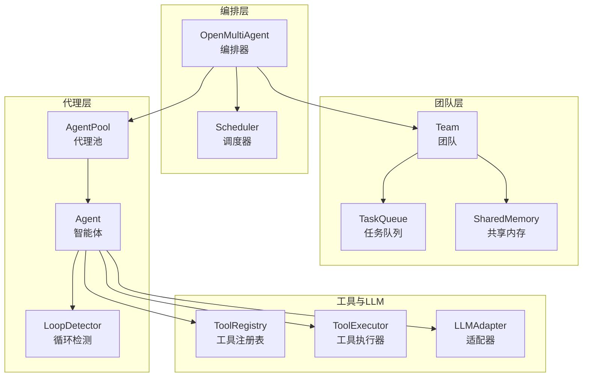
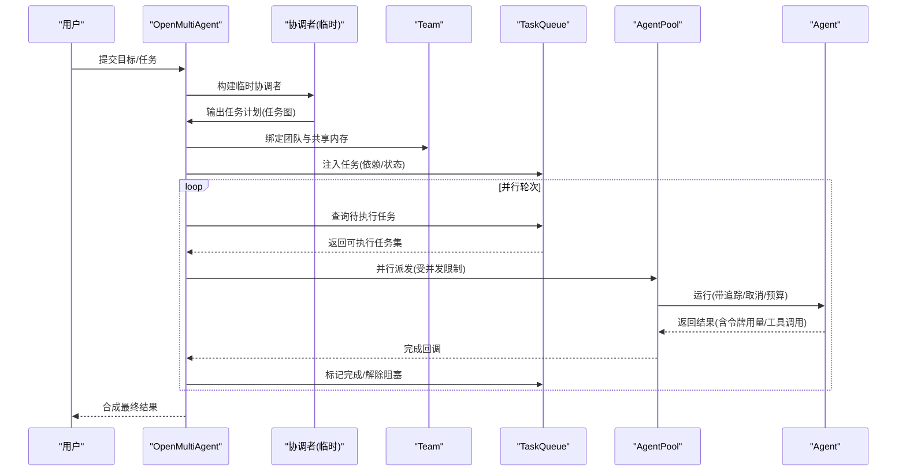
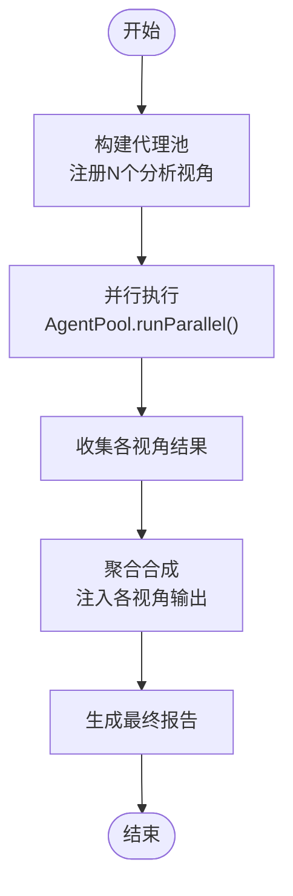
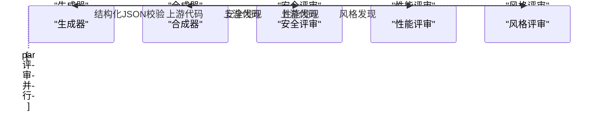
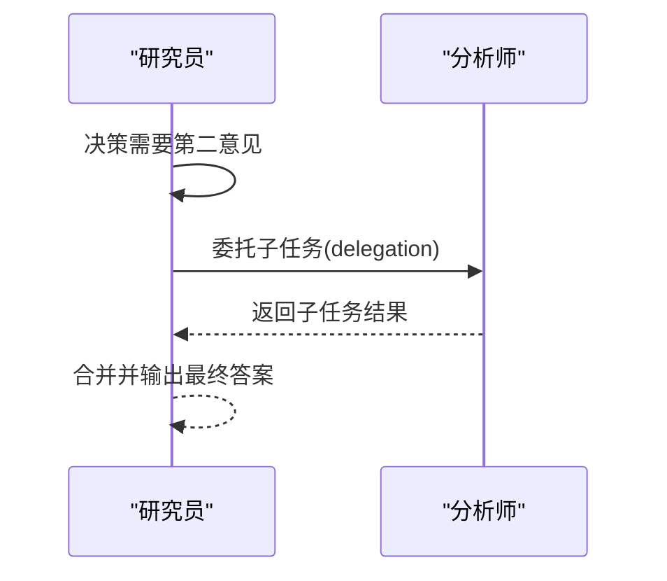
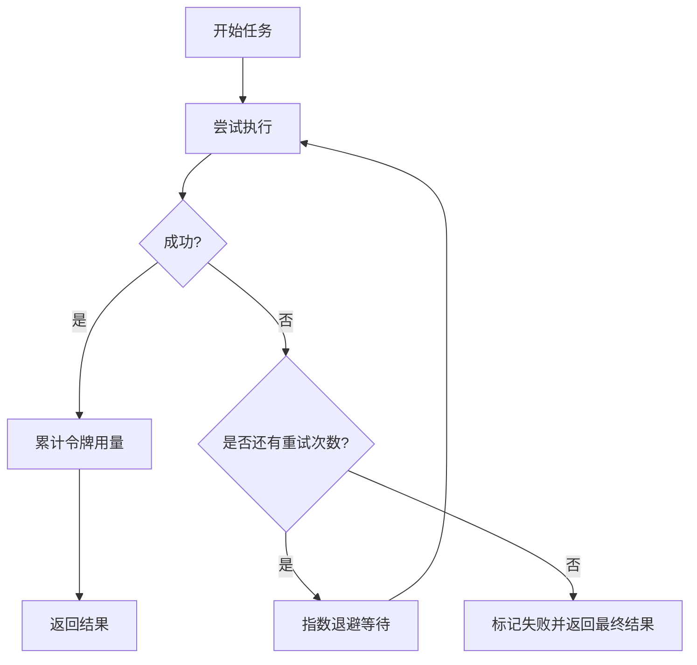
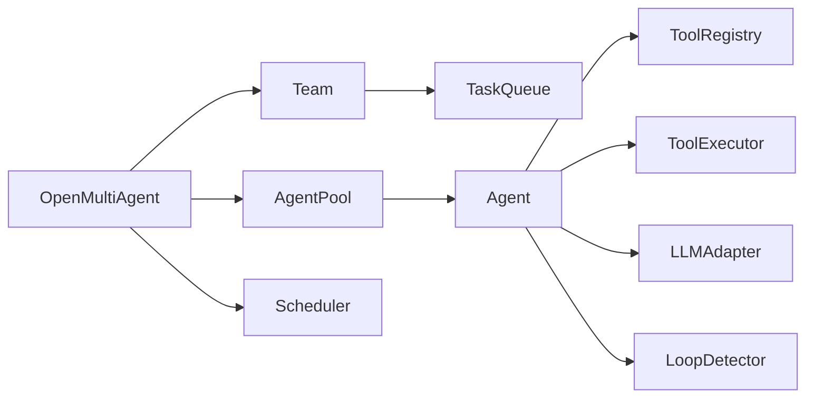

# 模式与最佳实践

<cite>
**本文引用的文件**
- [README.md](file://README.md)
- [examples/README.md](file://examples/README.md)
- [src/index.ts](file://src/index.ts)
- [src/orchestrator/orchestrator.ts](file://src/orchestrator/orchestrator.ts)
- [src/agent/pool.ts](file://src/agent/pool.ts)
- [src/task/queue.ts](file://src/task/queue.ts)
- [src/agent/loop-detector.ts](file://src/agent/loop-detector.ts)
- [src/agent/agent.ts](file://src/agent/agent.ts)
- [src/team/team.ts](file://src/team/team.ts)
- [src/types.ts](file://src/types.ts)
- [examples/patterns/fan-out-aggregate.ts](file://examples/patterns/fan-out-aggregate.ts)
- [examples/patterns/multi-perspective-code-review.ts](file://examples/patterns/multi-perspective-code-review.ts)
- [examples/patterns/research-aggregation.ts](file://examples/patterns/research-aggregation.ts)
- [examples/patterns/agent-handoff.ts](file://examples/patterns/agent-handoff.ts)
- [examples/patterns/cost-tiered-pipeline.ts](file://examples/patterns/cost-tiered-pipeline.ts)
- [examples/patterns/task-retry.ts](file://examples/patterns/task-retry.ts)
- [package.json](file://package.json)
</cite>

## 目录
1. [简介](#简介)
2. [项目结构](#项目结构)
3. [核心组件](#核心组件)
4. [架构总览](#架构总览)
5. [详细组件分析](#详细组件分析)
6. [依赖关系分析](#依赖关系分析)
7. [性能考量](#性能考量)
8. [故障排查指南](#故障排查指南)
9. [结论](#结论)
10. [附录](#附录)

## 简介
本文件面向在生产环境中构建可靠多智能体系统的工程师，系统性总结 Open Multi-Agent 框架中的协作模式与最佳实践，覆盖以下主题：
- 常见协作模式：MapReduce 风格的扇出聚合、多视角代码审查、研究聚合、代理交接（委托）等
- 成本分层流水线与任务重试机制的设计原理与实现要点
- 生产环境配置建议与安全注意事项
- 性能优化技巧、资源管理与错误处理策略
- 循环检测、超时控制与资源限制的工程化落地
- 架构决策与代码示例路径指引，帮助规避常见陷阱

## 项目结构
该仓库采用按职责分层的模块化组织方式：
- orchestrator：编排器，负责任务分解、调度与执行编排
- agent：智能体抽象与运行时，封装对话历史、工具调用与流式输出
- team：团队容器，承载代理名单、消息总线、任务队列与共享内存
- task：任务模型与依赖图管理
- tool：工具注册表、执行器与内置工具集合
- llm：适配器工厂与多提供商支持
- memory：共享内存接口与默认实现
- examples：模式、示例与集成样例
- docs：文档与最佳实践说明

图表来源
- [src/orchestrator/orchestrator.ts](file://src/orchestrator/orchestrator.ts)
- [src/team/team.ts](file://src/team/team.ts)
- [src/agent/pool.ts](file://src/agent/pool.ts)
- [src/agent/agent.ts](file://src/agent/agent.ts)
- [src/task/queue.ts](file://src/task/queue.ts)
- [src/agent/loop-detector.ts](file://src/agent/loop-detector.ts)

章节来源
- [README.md](file://README.md)
- [examples/README.md](file://examples/README.md)

## 核心组件
- 编排器 OpenMultiAgent：统一入口，负责任务分解、并发调度、事件与追踪回调、预算控制与失败恢复
- 代理池 AgentPool：并发上限控制、并行执行、轮询派发、状态快照与空闲槽位计算
- 任务队列 TaskQueue：拓扑依赖解析、阻塞/就绪切换、级联失败与跳过传播、进度统计
- 团队 Team：代理名单、消息总线、任务管理、共享内存接入
- 智能体 Agent：会话历史管理、一次性对话、流式输出、结构化输出验证、钩子函数、超时与取消信号
- 循环检测 LoopDetector：滑动窗口重复检测（工具签名与文本）
- 工具体系：注册表、执行器、内置工具与自定义工具
- 类型系统：内容块、消息、令牌用量、事件、任务、运行结果、配置等

章节来源
- [src/index.ts](file://src/index.ts)
- [src/orchestrator/orchestrator.ts](file://src/orchestrator/orchestrator.ts)
- [src/agent/pool.ts](file://src/agent/pool.ts)
- [src/task/queue.ts](file://src/task/queue.ts)
- [src/team/team.ts](file://src/team/team.ts)
- [src/agent/agent.ts](file://src/agent/agent.ts)
- [src/agent/loop-detector.ts](file://src/agent/loop-detector.ts)
- [src/types.ts](file://src/types.ts)

## 架构总览
下图展示了从“目标”到“任务图”的自动分解、并行执行与结果合成的关键流程。

图表来源
- [src/orchestrator/orchestrator.ts](file://src/orchestrator/orchestrator.ts)
- [src/team/team.ts](file://src/team/team.ts)
- [src/task/queue.ts](file://src/task/queue.ts)
- [src/agent/pool.ts](file://src/agent/pool.ts)
- [src/agent/agent.ts](file://src/agent/agent.ts)

## 详细组件分析

### MapReduce 风格扇出聚合（Fan-Out / Aggregate）
- 模式要点
  - 使用代理池并行启动多个分析视角
  - 聚合阶段读取所有分析结果并生成平衡报告
  - 无需工具，纯 LLM 推理聚焦模式本身
- 实现要点
  - 通过 AgentPool.runParallel() 并行执行
  - 聚合阶段将各视角输出注入提示词，驱动合成
  - 结果汇总与令牌统计便于对比不同视角的成本
- 示例路径
  - [examples/patterns/fan-out-aggregate.ts](file://examples/patterns/fan-out-aggregate.ts)

图表来源
- [examples/patterns/fan-out-aggregate.ts](file://examples/patterns/fan-out-aggregate.ts)
- [src/agent/pool.ts](file://src/agent/pool.ts)

章节来源
- [examples/patterns/fan-out-aggregate.ts](file://examples/patterns/fan-out-aggregate.ts)
- [src/agent/pool.ts](file://src/agent/pool.ts)

### 多视角代码审查（并行评审 + 结构化合成）
- 模式要点
  - 依赖链：生成器 → 三个并行评审器 → 合成器
  - 结构化输出：合成器使用 Zod Schema 校验 JSON 结果
  - 共享内存：下游自动注入上游上下文
- 实现要点
  - 显式任务声明与 dependsOn 依赖
  - runTasks() 执行，自动解耦依赖并行化
  - onProgress 观察任务生命周期事件
- 示例路径
  - [examples/patterns/multi-perspective-code-review.ts](file://examples/patterns/multi-perspective-code-review.ts)

图表来源
- [examples/patterns/multi-perspective-code-review.ts](file://examples/patterns/multi-perspective-code-review.ts)
- [src/orchestrator/orchestrator.ts](file://src/orchestrator/orchestrator.ts)

章节来源
- [examples/patterns/multi-perspective-code-review.ts](file://examples/patterns/multi-perspective-code-review.ts)
- [src/orchestrator/orchestrator.ts](file://src/orchestrator/orchestrator.ts)

### 研究聚合（多源信息合并）
- 模式要点
  - 三路并行研究（技术/市场/社区），随后由合成器抽取要点、识别矛盾
  - 支持结构化输出与 Zod 校验
  - 可断言并行度以确保并发收益
- 示例路径
  - [examples/patterns/research-aggregation.ts](file://examples/patterns/research-aggregation.ts)

章节来源
- [examples/patterns/research-aggregation.ts](file://examples/patterns/research-aggregation.ts)

### 代理交接（同步子代理委托）
- 模式要点
  - 在 runTeam/runTasks 中启用 delegate_to_agent 工具
  - 一个专家代理可对另一个代理发起一次性子任务并即时读取结果
  - 通过 AgentPool 的 runEphemeral 保证并发安全与死锁防护
- 示例路径
  - [examples/patterns/agent-handoff.ts](file://examples/patterns/agent-handoff.ts)
  - [src/agent/pool.ts](file://src/agent/pool.ts)

图表来源
- [examples/patterns/agent-handoff.ts](file://examples/patterns/agent-handoff.ts)
- [src/agent/pool.ts](file://src/agent/pool.ts)

章节来源
- [examples/patterns/agent-handoff.ts](file://examples/patterns/agent-handoff.ts)
- [src/agent/pool.ts](file://src/agent/pool.ts)

### 成本分层流水线（按模型分层的成本控制）
- 模式要点
  - 同一四阶段流水线分别使用旗舰/中端/低端模型组合，对比成本
  - 通过 onTrace 收集每模型令牌用量并换算美元成本
  - 对比基线与分层方案，断言节省比例
- 示例路径
  - [examples/patterns/cost-tiered-pipeline.ts](file://examples/patterns/cost-tiered-pipeline.ts)

章节来源
- [examples/patterns/cost-tiered-pipeline.ts](file://examples/patterns/cost-tiered-pipeline.ts)

### 任务重试（指数退避）
- 模式要点
  - 为任务配置 maxRetries、retryDelayMs、retryBackoff
  - 自动重试并在 onProgress 中上报 task_retry 事件
  - 依赖 executeWithRetry 将多次尝试的令牌用量累加
- 示例路径
  - [examples/patterns/task-retry.ts](file://examples/patterns/task-retry.ts)
  - [src/orchestrator/orchestrator.ts](file://src/orchestrator/orchestrator.ts)

图表来源
- [examples/patterns/task-retry.ts](file://examples/patterns/task-retry.ts)
- [src/orchestrator/orchestrator.ts](file://src/orchestrator/orchestrator.ts)

章节来源
- [examples/patterns/task-retry.ts](file://examples/patterns/task-retry.ts)
- [src/orchestrator/orchestrator.ts](file://src/orchestrator/orchestrator.ts)

## 依赖关系分析
- 组件耦合
  - OpenMultiAgent 作为中枢，依赖 Team、AgentPool、TaskQueue、Scheduler、Agent、LLMAdapter、工具体系
  - AgentPool 与 Agent 强耦合（并发锁、实例状态），但通过 runEphemeral 解耦委托场景
  - TaskQueue 与 Team 通过事件桥接，Team 作为上层协调者
- 外部依赖
  - 提供商 SDK（Anthropic、OpenAI 等）通过适配器抽象接入
  - 可选 AWS Bedrock、Google GenAI、MCP SDK、Vercel AI SDK 作为对等依赖
- 关键接口契约
  - 令牌预算、取消信号、追踪回调、结构化输出、循环检测配置等均通过类型系统约束

图表来源
- [src/orchestrator/orchestrator.ts](file://src/orchestrator/orchestrator.ts)
- [src/team/team.ts](file://src/team/team.ts)
- [src/agent/pool.ts](file://src/agent/pool.ts)
- [src/agent/agent.ts](file://src/agent/agent.ts)
- [src/task/queue.ts](file://src/task/queue.ts)
- [src/agent/loop-detector.ts](file://src/agent/loop-detector.ts)

章节来源
- [src/orchestrator/orchestrator.ts](file://src/orchestrator/orchestrator.ts)
- [src/team/team.ts](file://src/team/team.ts)
- [src/agent/pool.ts](file://src/agent/pool.ts)
- [src/agent/agent.ts](file://src/agent/agent.ts)
- [src/task/queue.ts](file://src/task/queue.ts)
- [src/agent/loop-detector.ts](file://src/agent/loop-detector.ts)
- [package.json](file://package.json)

## 性能考量
- 并发与吞吐
  - 使用 AgentPool 控制全局并发，避免过载导致延迟放大
  - 任务队列按依赖自动并行，减少串行瓶颈
- 令牌预算与成本控制
  - OrchestratorConfig.maxTokenBudget 与 AgentConfig.maxTokenBudget 双层保护
  - 成本分层流水线通过 onTrace 汇总各模型用量，结合定价表估算成本
- 上下文压缩与工具输出截断
  - ContextStrategy 支持滑动窗口、摘要、紧凑压缩与自定义压缩
  - 工具输出可按字符阈值截断，降低上下文膨胀
- 流式与可观测性
  - onAgentStream 与 onTrace 提供细粒度观测，便于定位热点与异常
- 超时与取消
  - Agent.timeoutMs 与 AbortSignal 双通道控制长尾任务

章节来源
- [src/orchestrator/orchestrator.ts](file://src/orchestrator/orchestrator.ts)
- [src/agent/agent.ts](file://src/agent/agent.ts)
- [src/types.ts](file://src/types.ts)
- [examples/patterns/cost-tiered-pipeline.ts](file://examples/patterns/cost-tiered-pipeline.ts)

## 故障排查指南
- 令牌预算耗尽
  - 触发 budget_exceeded 事件；检查 OrchestratorConfig.maxTokenBudget 与单任务令牌用量
- 任务失败与级联
  - TaskQueue.fail() 会级联失败下游任务；确认上游依赖是否稳定
  - 使用 onProgress 查看 task_retry 事件，定位不稳定环节
- 死循环与卡顿
  - 启用 LoopDetectionConfig；根据 onLoopDetected 策略选择警告或终止
  - 结合 Agent.beforeRun/afterRun 钩子进行上下文审计
- 超时与取消
  - 设置 Agent.timeoutMs 或传入 AbortSignal；注意与 run()/prompt() 生命周期绑定
- 代理池死锁
  - 委托场景使用 AgentPool.runEphemeral；避免同一 Agent 实例同时被 run() 与 runEphemeral 锁竞争

章节来源
- [src/task/queue.ts](file://src/task/queue.ts)
- [src/orchestrator/orchestrator.ts](file://src/orchestrator/orchestrator.ts)
- [src/agent/loop-detector.ts](file://src/agent/loop-detector.ts)
- [src/agent/agent.ts](file://src/agent/agent.ts)
- [examples/patterns/task-retry.ts](file://examples/patterns/task-retry.ts)

## 结论
通过将“编排—团队—代理—任务—工具—LLM”六大维度有机结合，Open Multi-Agent 框架提供了从目标到结果的自动化流水线。借助扇出聚合、多视角评审、研究聚合、代理交接等模式，以及成本分层与任务重试机制，可以在生产环境中实现高可靠、可观察、可扩展的多智能体系统。配合循环检测、超时控制与资源限制，可有效避免常见陷阱，提升整体稳定性与性价比。

## 附录

### 生产环境配置建议与安全考虑
- 配置项清单（节选）
  - OrchestratorConfig：maxConcurrency、maxTokenBudget、onProgress/onTrace、onApproval、maxDelegationDepth
  - AgentConfig：maxTurns、contextStrategy、timeoutMs、loopDetection、maxTokenBudget、beforeRun/afterRun、outputSchema
  - Task：maxRetries、retryDelayMs、retryBackoff、memoryScope
- 安全建议
  - 严格限制工具白名单与输出长度，防止上下文污染
  - 使用共享内存命名空间与 TTL 策略，避免跨任务泄露
  - 对外部 MCP 服务进行鉴权与网络隔离
  - 通过 onTrace 记录敏感操作轨迹，满足审计要求

章节来源
- [src/types.ts](file://src/types.ts)
- [README.md](file://README.md)

### 架构决策与代码示例路径
- 扇出聚合：[examples/patterns/fan-out-aggregate.ts](file://examples/patterns/fan-out-aggregate.ts)
- 多视角代码审查：[examples/patterns/multi-perspective-code-review.ts](file://examples/patterns/multi-perspective-code-review.ts)
- 研究聚合：[examples/patterns/research-aggregation.ts](file://examples/patterns/research-aggregation.ts)
- 代理交接：[examples/patterns/agent-handoff.ts](file://examples/patterns/agent-handoff.ts)
- 成本分层流水线：[examples/patterns/cost-tiered-pipeline.ts](file://examples/patterns/cost-tiered-pipeline.ts)
- 任务重试：[examples/patterns/task-retry.ts](file://examples/patterns/task-retry.ts)

章节来源
- [examples/README.md](file://examples/README.md)