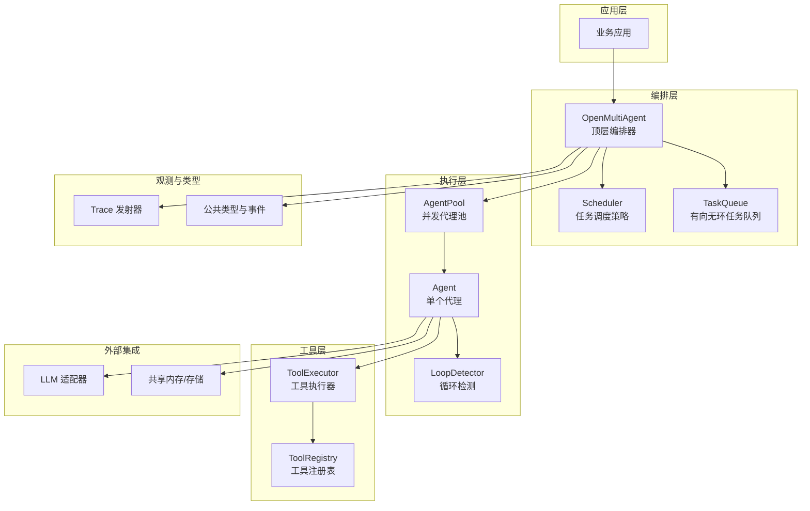
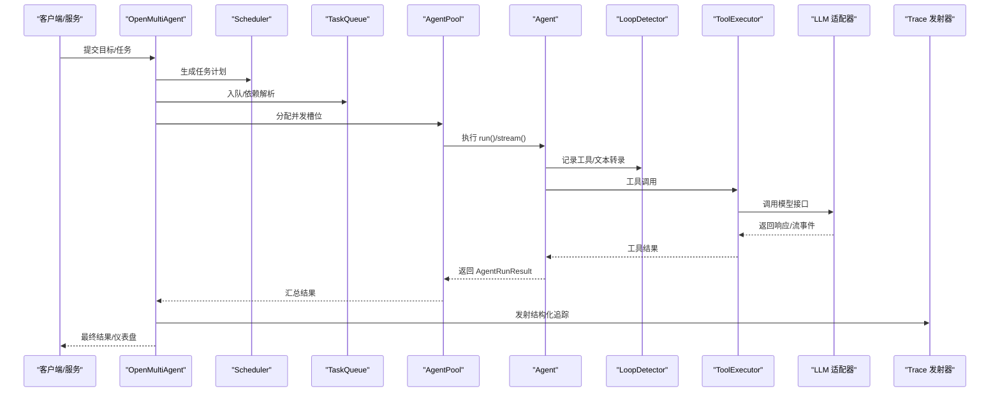
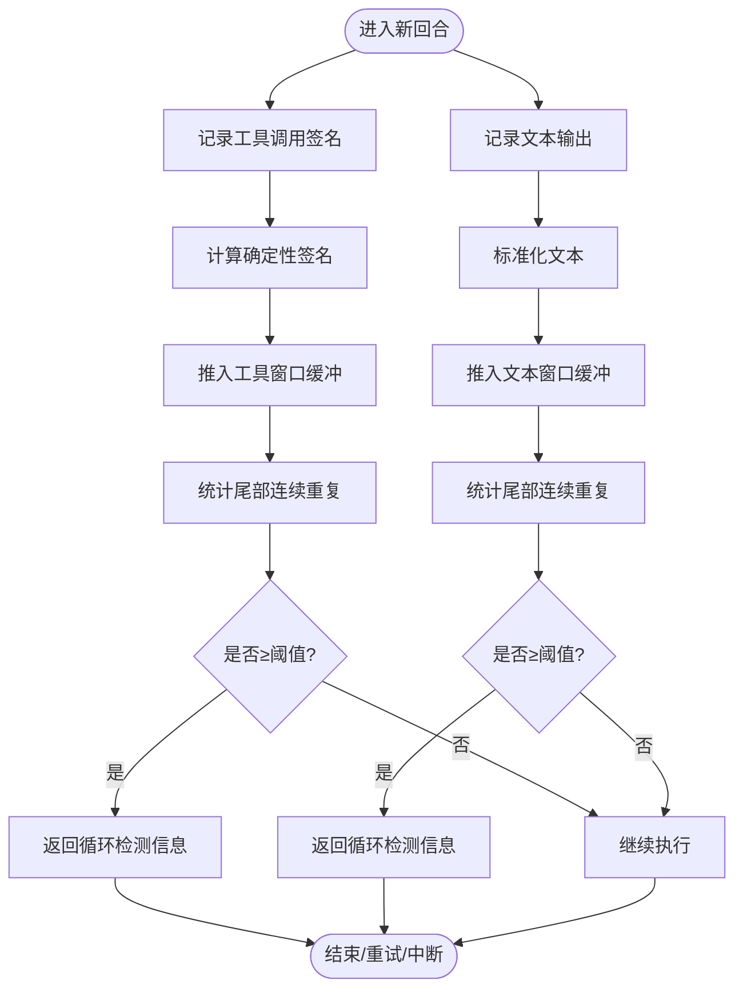
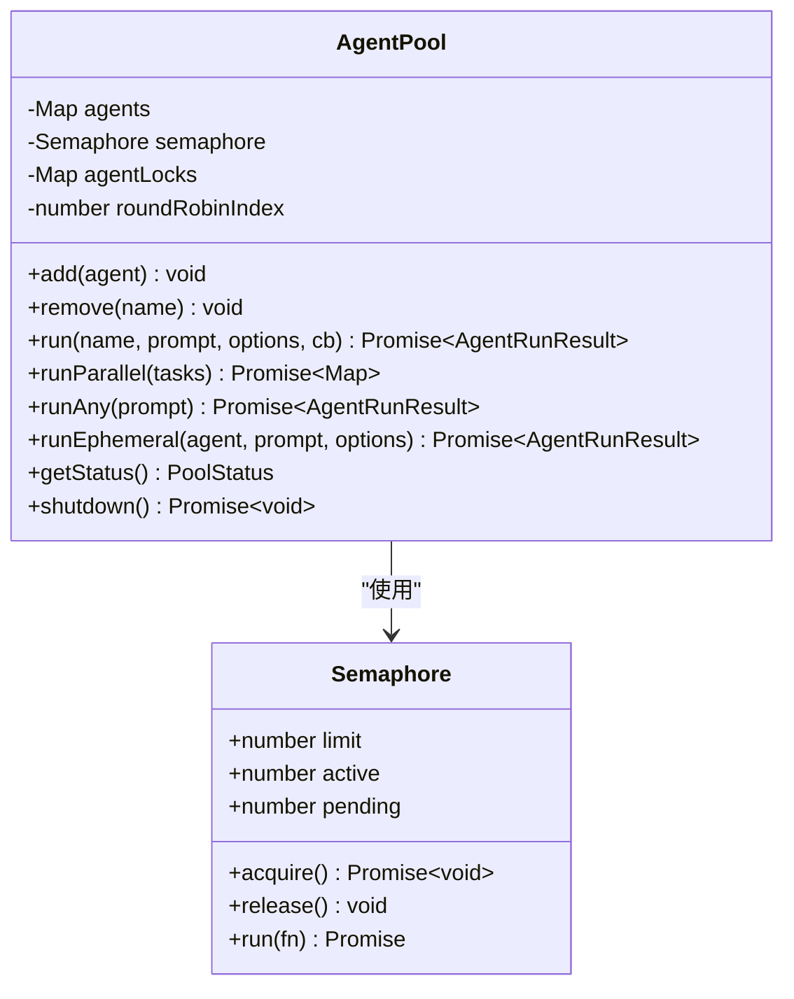
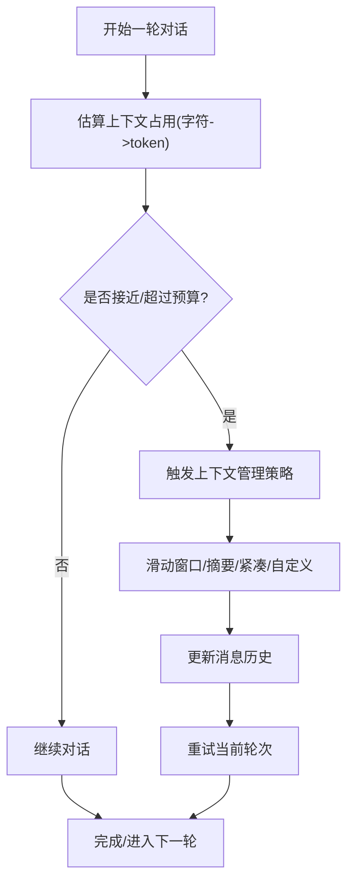
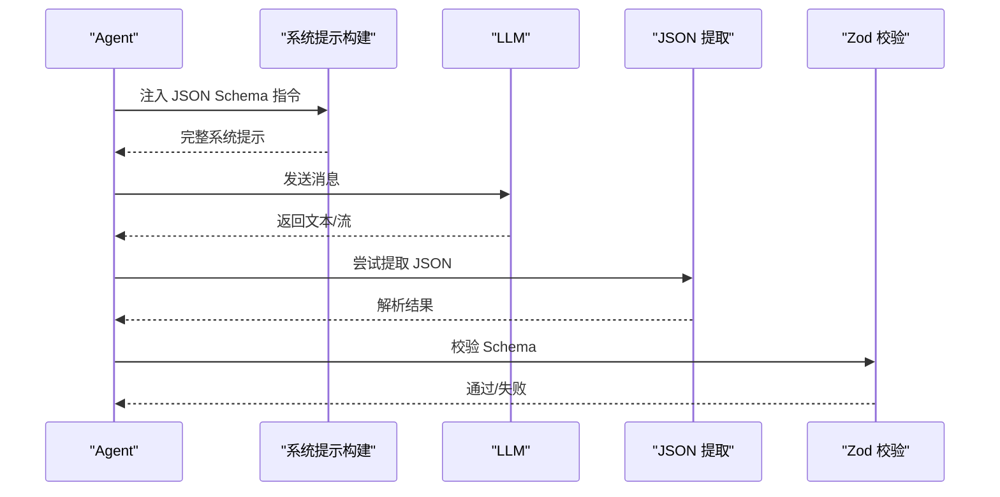
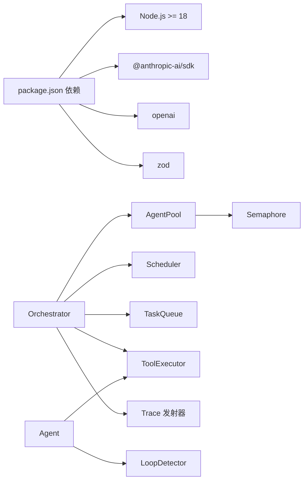

# 生产环境考虑

<cite>
**本文引用的文件**
- [src/index.ts](file://src/index.ts)
- [src/agent/loop-detector.ts](file://src/agent/loop-detector.ts)
- [src/utils/tokens.ts](file://src/utils/tokens.ts)
- [src/utils/semaphore.ts](file://src/utils/semaphore.ts)
- [src/agent/pool.ts](file://src/agent/pool.ts)
- [src/types.ts](file://src/types.ts)
- [src/utils/trace.ts](file://src/utils/trace.ts)
- [src/errors.ts](file://src/errors.ts)
- [src/orchestrator/orchestrator.ts](file://src/orchestrator/orchestrator.ts)
- [docs/observability.md](file://docs/observability.md)
- [docs/context-management.md](file://docs/context-management.md)
- [package.json](file://package.json)
- [examples/cookbook/incident-postmortem-dag.ts](file://examples/cookbook/incident-postmortem-dag.ts)
</cite>

## 目录
1. [简介](#简介)
2. [项目结构](#项目结构)
3. [核心组件](#核心组件)
4. [架构总览](#架构总览)
5. [详细组件分析](#详细组件分析)
6. [依赖关系分析](#依赖关系分析)
7. [性能考量](#性能考量)
8. [故障排查指南](#故障排查指南)
9. [结论](#结论)
10. [附录](#附录)

## 简介
本文件面向在生产环境中部署与运维 Open Multi-Agent 框架的工程团队，聚焦以下关键主题：结构化输出的配置与验证、循环检测机制的启用与调优、令牌预算管理、并发控制与资源限制、监控指标与日志记录、性能优化（缓存与连接池）、安全与合规（API 密钥与访问控制）、容量规划与故障恢复、灾难备份，以及可直接落地的配置模板与部署指南。

## 项目结构
该仓库采用按功能域分层的组织方式：
- 核心入口与类型导出：通过统一入口模块导出 Orchestrator、Agent、Team、Task、工具系统、LLM 适配器与内存等能力，并重新导出公共类型以供消费端类型检查。
- 运行时核心：Orchestrator 作为顶层编排器，协调 Team、TaskQueue、Scheduler、AgentPool、Agent 等子系统。
- 工具与执行：工具定义、注册、执行与内置工具集；支持批量工具调用与输出压缩。
- 观测性：进度事件、结构化追踪、运行后仪表盘。
- 上下文管理：滑动窗口、摘要、紧凑压缩与自定义压缩策略，降低长会话上下文成本。
- 并发与资源：计数信号量、代理池并发控制、代理级互斥锁避免竞态。
- 错误模型：令牌预算超限错误等业务异常类型。

图表来源
- [src/index.ts:57-198](file://src/index.ts#L57-L198)
- [src/orchestrator/orchestrator.ts:1-200](file://src/orchestrator/orchestrator.ts#L1-L200)
- [src/agent/pool.ts:58-370](file://src/agent/pool.ts#L58-L370)
- [src/agent/loop-detector.ts:33-138](file://src/agent/loop-detector.ts#L33-L138)
- [src/utils/trace.ts:12-35](file://src/utils/trace.ts#L12-L35)
- [src/types.ts:1-200](file://src/types.ts#L1-L200)

章节来源
- [src/index.ts:57-198](file://src/index.ts#L57-L198)
- [src/orchestrator/orchestrator.ts:1-200](file://src/orchestrator/orchestrator.ts#L1-L200)

## 核心组件
- 编排器 OpenMultiAgent：负责任务分解、调度、并发执行与结果合成，支持简单目标短路与关键词匹配选择最佳代理。
- AgentPool：集中式并发控制与代理注册，提供 run、runParallel、runAny 等执行模式，内置 per-agent 互斥锁避免竞态。
- LoopDetector：基于滑动窗口的工具调用签名与文本重复检测，防止代理陷入循环。
- Token 预算与估算：估算字符到 token 的保守启发式方法，结合上下文管理策略控制输入长度。
- 观测性：onProgress 轻量事件、onTrace 结构化追踪、渲染团队运行仪表盘。
- 工具系统：工具注册、执行、批量调用与输出压缩，支持 per-tool 输出上限与全局上限。

章节来源
- [src/orchestrator/orchestrator.ts:147-194](file://src/orchestrator/orchestrator.ts#L147-L194)
- [src/agent/pool.ts:58-370](file://src/agent/pool.ts#L58-L370)
- [src/agent/loop-detector.ts:33-138](file://src/agent/loop-detector.ts#L33-L138)
- [src/utils/tokens.ts:7-30](file://src/utils/tokens.ts#L7-L30)
- [src/utils/trace.ts:12-35](file://src/utils/trace.ts#L12-L35)
- [src/types.ts:184-187](file://src/types.ts#L184-L187)

## 架构总览
下图展示了生产部署中各组件之间的交互关系与职责边界，强调可观测性、并发控制与上下文管理对稳定性的影响。

图表来源
- [src/orchestrator/orchestrator.ts:1-200](file://src/orchestrator/orchestrator.ts#L1-L200)
- [src/agent/pool.ts:147-293](file://src/agent/pool.ts#L147-L293)
- [src/agent/loop-detector.ts:50-92](file://src/agent/loop-detector.ts#L50-L92)
- [src/utils/trace.ts:12-35](file://src/utils/trace.ts#L12-L35)

## 详细组件分析

### 循环检测机制（LoopDetector）
- 功能要点
  - 基于滑动窗口统计工具调用签名与文本输出的连续重复次数，当达到阈值时返回检测信息，触发中断或重试策略。
  - 工具签名对参数键名排序与整体排序，确保不同顺序但相同语义的调用被视为一致。
- 生产建议
  - 启用并根据模型行为调整 maxRepetitions 与窗口大小，避免过早中断有效迭代。
  - 在 onProgress 或 onTrace 中记录 loop_detected 事件，便于定位与复盘。
  - 与上下文管理策略配合，避免因历史重复被误判。

图表来源
- [src/agent/loop-detector.ts:33-138](file://src/agent/loop-detector.ts#L33-L138)

章节来源
- [src/agent/loop-detector.ts:33-138](file://src/agent/loop-detector.ts#L33-L138)

### 并发控制与资源限制（AgentPool + Semaphore）
- 功能要点
  - 全局信号量限制池内并发运行数；每个 Agent 实例内部再加一个信号量（Semaphore(1)）保证同一实例串行运行，避免状态竞态。
  - 提供 run、runParallel、runAny 等执行模式；runParallel 使用 Promise.allSettled 保证失败可见性。
  - 提供可用槽位查询，避免嵌套运行导致死锁。
- 生产建议
  - 将 maxConcurrency 与下游 LLM 速率限制、工具执行耗时与节点资源相匹配，预留安全余量。
  - 对高优先级任务使用 runEphemeral 绕过注册表与 per-agent 锁，减少相互阻塞风险。
  - 定期观察 pending/active 指标，动态调整并发度。

图表来源
- [src/utils/semaphore.ts:24-95](file://src/utils/semaphore.ts#L24-L95)
- [src/agent/pool.ts:58-370](file://src/agent/pool.ts#L58-L370)

章节来源
- [src/utils/semaphore.ts:24-95](file://src/utils/semaphore.ts#L24-L95)
- [src/agent/pool.ts:58-370](file://src/agent/pool.ts#L58-L370)

### 令牌预算管理与上下文压缩
- 估算与预算
  - 采用字符启发式估算 token 数量，保守估计约 4 字符 ≈ 1 token，覆盖文本、推理、工具结果、工具输入与图像等块类型。
  - 框架提供 TokenBudgetExceededError，用于在超出预算时中断并上报。
- 上下文管理策略
  - 滑动窗口：保留最近 N 轮对话，丢弃更早内容。
  - 摘要：将旧轮对话送入摘要模型，以摘要替代原文。
  - 紧凑压缩：规则化截断大文本与工具结果，保留近期轮次。
  - 自定义压缩：提供回调函数，按需实现复杂压缩逻辑。
- 生产建议
  - 为长会话开启上下文策略，并结合 compressToolResults 与 maxToolOutputChars 控制工具输出膨胀。
  - 在 Orchestrator 层配置全局预算与 Agent 层局部预算，形成“双轨”预算控制。
  - 通过 onProgress 订阅 budget_exceeded 事件，记录并触发降级策略（如切换摘要策略）。

图表来源
- [src/utils/tokens.ts:7-30](file://src/utils/tokens.ts#L7-L30)
- [src/errors.ts:8-19](file://src/errors.ts#L8-L19)
- [docs/context-management.md:1-65](file://docs/context-management.md#L1-L65)

章节来源
- [src/utils/tokens.ts:7-30](file://src/utils/tokens.ts#L7-L30)
- [src/errors.ts:8-19](file://src/errors.ts#L8-L19)
- [docs/context-management.md:1-65](file://docs/context-management.md#L1-L65)

### 结构化输出的配置与验证
- 系统提示注入：将 Zod Schema 转换为 JSON Schema 并注入系统提示，约束模型输出格式。
- JSON 提取：支持裸 JSON、带 fenced code 的 JSON 与首尾对象/数组范围提取。
- Zod 校验：对解析后的 JSON 进行严格校验，失败时抛出可读错误。
- 生产建议
  - 为关键任务的 Agent 显式注入结构化输出指令，确保输出可解析、可审计。
  - 在工具执行前设置 maxToolOutputChars，避免超长输出污染上下文。
  - 在 onProgress 中订阅 done/error 事件，记录最终输出与校验结果。

图表来源
- [src/agent/structured-output.ts:21-127](file://src/agent/structured-output.ts#L21-L127)

章节来源
- [src/agent/structured-output.ts:21-127](file://src/agent/structured-output.ts#L21-L127)

### 监控指标、日志记录与告警
- 进度事件（onProgress）
  - 事件类型包括 task_start、task_complete、task_retry、task_skipped、agent_start、agent_complete、budget_exceeded、error 等。
- 结构化追踪（onTrace）
  - 支持将 LLM 调用、工具执行、任务等结构化跨度写入外部系统（如 OpenTelemetry、Datadog、Honeycomb、Langfuse）。
- 运行后仪表盘
  - 渲染静态 HTML 可视化任务 DAG、时间线、令牌用量与任务详情，便于复盘。
- 生产建议
  - 将 onProgress 写入集中式日志系统，建立预算超限、错误率、延迟等告警。
  - onTrace 持久化到时序数据库或日志系统，支持跨请求关联与根因分析。
  - 仪表盘 HTML 作为归档证据，定期备份。

章节来源
- [docs/observability.md:1-57](file://docs/observability.md#L1-L57)
- [src/utils/trace.ts:12-35](file://src/utils/trace.ts#L12-L35)
- [src/types.ts:184-187](file://src/types.ts#L184-L187)

### 性能优化建议
- 缓存策略
  - 对工具输出与中间结果进行短期缓存（基于输入哈希），避免重复调用。
  - 对 LLM 响应进行内容去重与摘要缓存（适用于重复检索场景）。
- 连接池管理
  - 工具侧使用 AgentPool 的并发限制与 per-agent 锁，避免下游服务过载。
  - 对第三方 API 设置合理的超时与重试退避，结合 onProgress 记录延迟分布。
- 负载均衡
  - 多实例横向扩展，结合 runAny 的轮询分配策略，提升吞吐。
  - 将高延迟工具迁移至独立队列或异步处理，避免阻塞主流程。

章节来源
- [src/agent/pool.ts:147-293](file://src/agent/pool.ts#L147-L293)

### 安全考虑
- API 密钥管理
  - 通过环境变量注入各 Provider 的密钥，避免硬编码；在 CI/CD 中使用受控密钥管理服务。
- 访问控制
  - 对编排器与仪表盘接口增加鉴权与速率限制，防止滥用。
- 数据保护
  - 对日志与追踪中的敏感字段脱敏；对仪表盘 HTML 的网络资源进行本地化托管，避免外链泄露内网资产。
- 合规与审计
  - 保留 onTrace 与运行后报告，满足审计要求；对结构化输出进行完整性校验。

章节来源
- [docs/observability.md:31-57](file://docs/observability.md#L31-L57)

### 容量规划、故障恢复与灾难备份
- 容量规划
  - 基于历史任务规模与并发度，估算最大并发槽位与下游 LLM 限额；为峰值流量预留 20%-50% 余量。
- 故障恢复
  - 对失败任务保持 blocked 状态，非依赖任务继续执行；通过 onProgress 与 onTrace 快速定位失败点。
- 灾难备份
  - 定期备份 TeamRunResult、onTrace、仪表盘 HTML；对关键配置与密钥进行版本化管理。

章节来源
- [src/orchestrator/orchestrator.ts:1-200](file://src/orchestrator/orchestrator.ts#L1-L200)
- [docs/observability.md:49-57](file://docs/observability.md#L49-L57)

## 依赖关系分析
- 运行时依赖
  - Node.js >= 18；主要依赖 @anthropic-ai/sdk、openai、zod；部分 Provider 为 peerDependencies（可选）。
- 关键耦合点
  - Orchestrator 依赖 AgentPool、TaskQueue、Scheduler、ToolExecutor、LLM 适配器与 Trace 发射器。
  - AgentPool 依赖 Semaphore；Agent 依赖 LoopDetector 与 ToolExecutor。
- 外部集成
  - 通过 onTrace 将跨度转发至外部观测平台；CLI 可生成仪表盘 HTML。

图表来源
- [package.json:66-107](file://package.json#L66-L107)
- [src/orchestrator/orchestrator.ts:1-200](file://src/orchestrator/orchestrator.ts#L1-L200)
- [src/agent/pool.ts:58-370](file://src/agent/pool.ts#L58-L370)
- [src/agent/loop-detector.ts:33-138](file://src/agent/loop-detector.ts#L33-L138)
- [src/utils/trace.ts:12-35](file://src/utils/trace.ts#L12-L35)

章节来源
- [package.json:66-107](file://package.json#L66-L107)

## 性能考量
- 并发与队列
  - 合理设置 AgentPool 的 maxConcurrency，避免下游限流与工具执行抖动。
  - 对高延迟工具使用 runEphemeral 或独立队列，降低阻塞传播。
- 上下文与预算
  - 开启上下文策略与工具输出上限，显著降低 token 占用。
  - 通过 onProgress 订阅 budget_exceeded，及时切换策略。
- 观测与回放
  - onTrace 与仪表盘有助于识别热点路径与瓶颈环节。

章节来源
- [src/agent/pool.ts:76-88](file://src/agent/pool.ts#L76-L88)
- [docs/context-management.md:1-65](file://docs/context-management.md#L1-L65)
- [src/utils/trace.ts:12-35](file://src/utils/trace.ts#L12-L35)

## 故障排查指南
- 常见问题与定位
  - 预算超限：监听 budget_exceeded 事件，检查上下文策略与工具输出上限配置。
  - 循环卡顿：关注 loop_detected 事件，调整检测阈值或中断策略。
  - 并发阻塞：检查 AgentPool 的 pending/active 指标，必要时降低并发或拆分任务。
- 日志与追踪
  - onProgress 记录生命周期事件；onTrace 记录结构化跨度；仪表盘用于可视化复盘。
- 示例参考
  - 可参考示例中的并行性验证与日志输出模式，快速搭建生产级可观测性。

章节来源
- [src/errors.ts:8-19](file://src/errors.ts#L8-L19)
- [src/agent/loop-detector.ts:47-92](file://src/agent/loop-detector.ts#L47-L92)
- [src/agent/pool.ts:302-318](file://src/agent/pool.ts#L302-L318)
- [docs/observability.md:1-57](file://docs/observability.md#L1-L57)
- [examples/cookbook/incident-postmortem-dag.ts:223-241](file://examples/cookbook/incident-postmortem-dag.ts#L223-L241)

## 结论
生产环境下的 Open Multi-Agent 框架需要在“可观测性、并发控制、上下文与预算、结构化输出与安全”五个维度协同优化。通过启用循环检测、合理配置上下文策略与预算、精细化并发与资源限制、完善监控与告警、以及规范的安全与备份流程，可以在保证稳定性的同时最大化吞吐与成本效益。

## 附录

### 配置模板与部署指南（生产落地清单）
- 基础运行时
  - Node.js 版本：>= 18
  - 依赖安装：确保 @anthropic-ai/sdk、openai、zod 正常安装；按需安装可选 Provider 依赖
- 编排器配置
  - 并发度：根据下游 LLM 速率与工具耗时设置 maxConcurrency
  - 预算：为 Orchestrator 与 Agent 分别设置预算，启用 onProgress 订阅 budget_exceeded
  - 上下文策略：为长会话启用 sliding-window/summarize/compact/custom
  - 结构化输出：为关键 Agent 注入 JSON Schema 指令，设置 maxToolOutputChars
- 并发与资源
  - 使用 AgentPool.runEphemeral 避免相互阻塞
  - 监控 pending/active，动态调整并发
- 观测与告警
  - onProgress：接入日志系统，建立预算超限、错误率、延迟告警
  - onTrace：写入外部观测平台，保留跨度与运行后仪表盘
- 安全与合规
  - 密钥管理：通过环境变量注入，CI/CD 加密存储
  - 访问控制：鉴权与速率限制
  - 数据保护：对敏感字段脱敏，仪表盘资源本地化
- 容量与灾备
  - 容量规划：基于峰值流量预留 20%-50% 余量
  - 灾备：定期备份运行结果、追踪与仪表盘 HTML

章节来源
- [package.json:66-107](file://package.json#L66-L107)
- [src/orchestrator/orchestrator.ts:78-82](file://src/orchestrator/orchestrator.ts#L78-L82)
- [docs/context-management.md:1-65](file://docs/context-management.md#L1-L65)
- [src/agent/structured-output.ts:21-34](file://src/agent/structured-output.ts#L21-L34)
- [docs/observability.md:1-57](file://docs/observability.md#L1-L57)