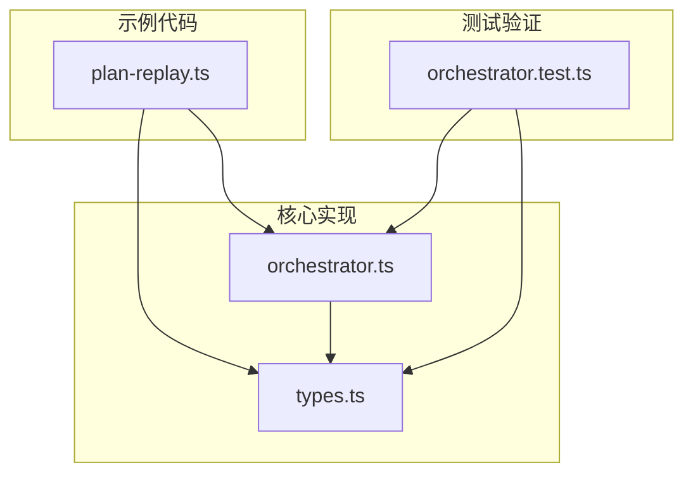
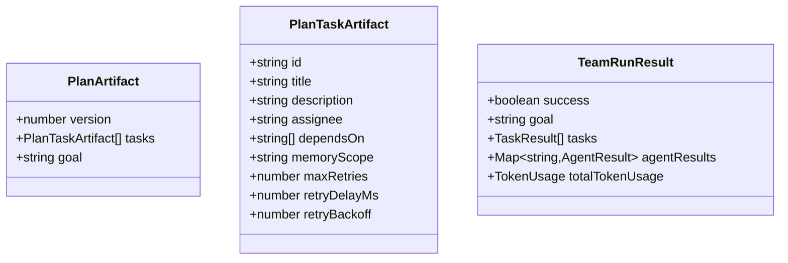
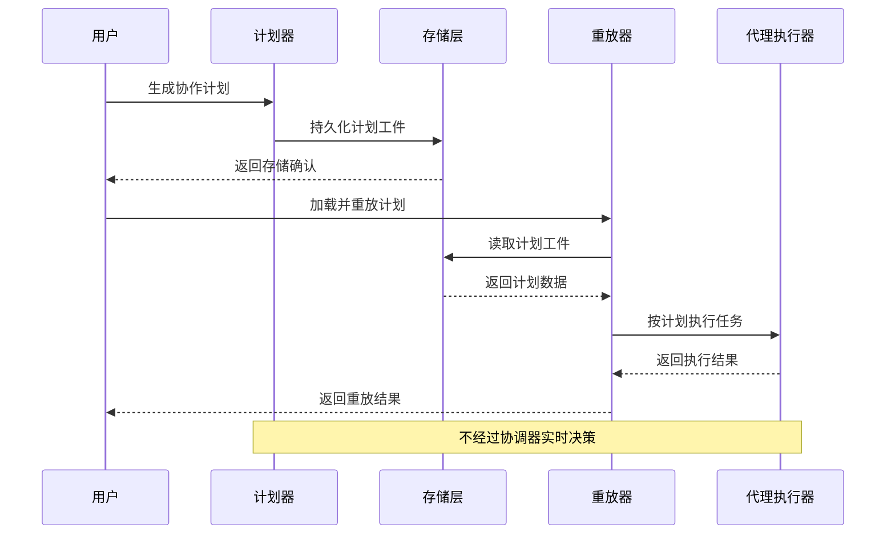
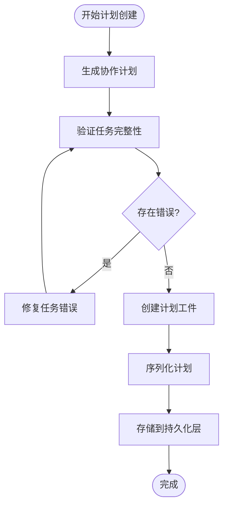
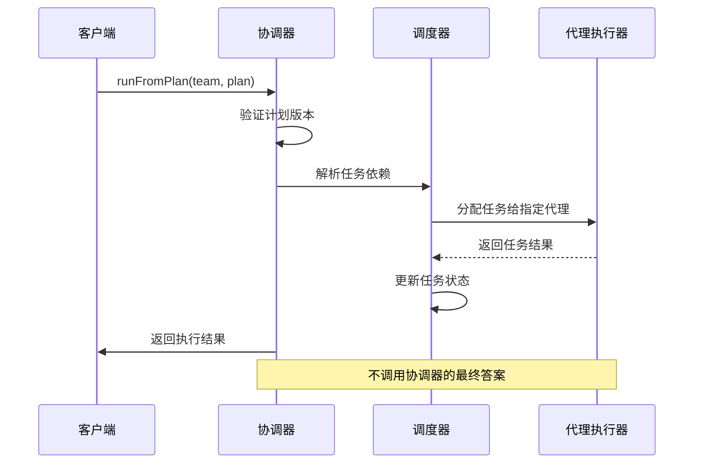
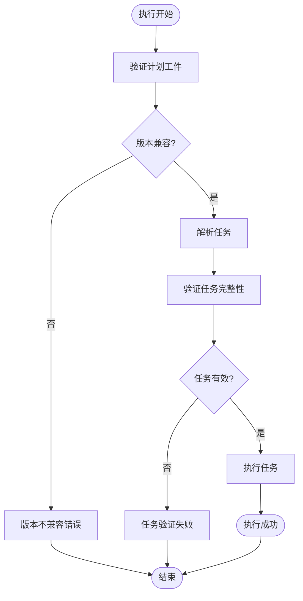
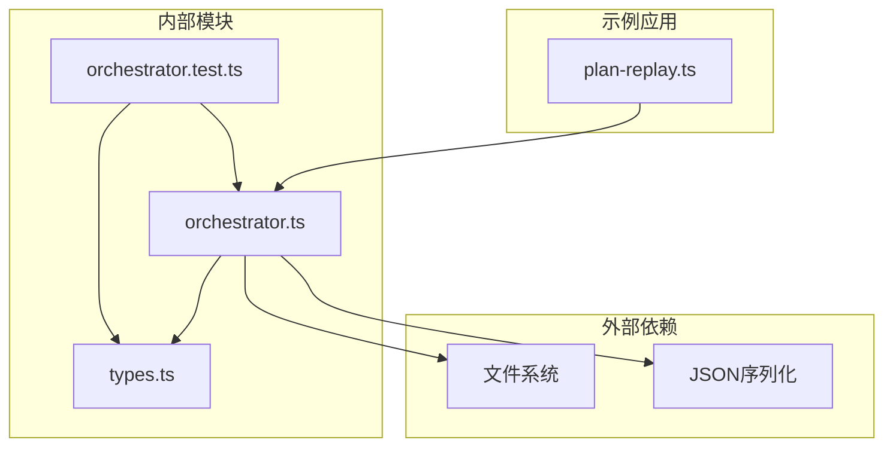

# 计划重放功能

<cite>
**本文档引用的文件**
- [plan-replay.ts](file://examples/patterns/plan-replay.ts)
- [orchestrator.ts](file://src/orchestrator/orchestrator.ts)
- [types.ts](file://src/types.ts)
- [orchestrator.test.ts](file://tests/orchestrator.test.ts)
</cite>

## 目录
1. [简介](#简介)
2. [项目结构](#项目结构)
3. [核心组件](#核心组件)
4. [架构概览](#架构概览)
5. [详细组件分析](#详细组件分析)
6. [依赖关系分析](#依赖关系分析)
7. [性能考虑](#性能考虑)
8. [故障排除指南](#故障排除指南)
9. [结论](#结论)

## 简介

计划重放功能是 Open Multi-Agent 项目中的一个关键特性，它允许用户保存和重新执行之前生成的协作计划。该功能的核心价值在于提供确定性的执行能力，确保相同的计划可以在不同时间点以完全相同的方式运行，这对于调试、审计和一致性验证至关重要。

该功能通过序列化协作器生成的计划为可持久化的计划工件，然后在需要时重新加载和执行这些工件来实现。计划重放不依赖于协调器的实时决策，而是严格按照预定义的任务分配和依赖关系执行。

## 项目结构

计划重放功能涉及以下关键文件和模块：

**图表来源**
- [plan-replay.ts](file://examples/patterns/plan-replay.ts)
- [orchestrator.ts](file://src/orchestrator/orchestrator.ts)
- [types.ts](file://src/types.ts)
- [orchestrator.test.ts](file://tests/orchestrator.test.ts)

**章节来源**
- [plan-replay.ts](file://examples/patterns/plan-replay.ts)
- [orchestrator.ts](file://src/orchestrator/orchestrator.ts)
- [types.ts](file://src/types.ts)

## 核心组件

### 计划工件（Plan Artifact）

计划工件是可序列化的计划表示，包含执行所需的所有必要信息：

- **任务元数据**：任务ID、标题、描述
- **执行配置**：负责人、依赖关系、内存作用域
- **重试配置**：最大重试次数、重试延迟、退避策略
- **版本控制**：确保向后兼容性

### 协调器重放方法

协调器提供了专门的重放方法，用于执行持久化的计划：

- `runFromPlan()`: 执行已保存的计划
- 版本验证：确保计划工件与当前实现兼容
- 直接执行：绕过协调器的实时决策过程

### 类型定义

系统定义了完整的类型层次结构来支持计划重放：

**图表来源**
- [types.ts](file://src/types.ts)

**章节来源**
- [types.ts](file://src/types.ts)
- [orchestrator.ts](file://src/orchestrator/orchestrator.ts)

## 架构概览

计划重放功能的架构设计体现了分层和解耦的原则：

**图表来源**
- [orchestrator.ts](file://src/orchestrator/orchestrator.ts)
- [plan-replay.ts](file://examples/patterns/plan-replay.ts)

## 详细组件分析

### 计划创建流程

计划创建过程涉及多个步骤，确保生成的计划既完整又可执行：

**图表来源**
- [orchestrator.ts](file://src/orchestrator/orchestrator.ts)

### 计划重放执行流程

重放执行过程严格遵循预定义的计划，不进行任何实时决策：

**图表来源**
- [orchestrator.ts](file://src/orchestrator/orchestrator.ts)

### 数据持久化机制

系统实现了完整的数据持久化机制来支持计划重放：

| 字段名称 | 类型 | 必需性 | 描述 |
|---------|------|--------|------|
| version | number | 是 | 计划工件版本号 |
| tasks | PlanTaskArtifact[] | 是 | 任务列表 |
| goal | string | 否 | 协作目标 |
| createdAt | Date | 否 | 创建时间戳 |

**章节来源**
- [orchestrator.ts](file://src/orchestrator/orchestrator.ts)
- [types.ts](file://src/types.ts)

### 错误处理机制

系统实现了多层次的错误处理机制：

**图表来源**
- [orchestrator.ts](file://src/orchestrator/orchestrator.ts)

**章节来源**
- [orchestrator.ts](file://src/orchestrator/orchestrator.ts)

## 依赖关系分析

计划重放功能的依赖关系体现了清晰的模块化设计：

**图表来源**
- [plan-replay.ts](file://examples/patterns/plan-replay.ts)
- [orchestrator.ts](file://src/orchestrator/orchestrator.ts)
- [types.ts](file://src/types.ts)
- [orchestrator.test.ts](file://tests/orchestrator.test.ts)

**章节来源**
- [orchestrator.ts](file://src/orchestrator/orchestrator.ts)
- [types.ts](file://src/types.ts)

## 性能考虑

### 内存优化

- **增量加载**：只在需要时加载任务数据
- **缓存策略**：对频繁访问的任务元数据进行缓存
- **流式处理**：支持大计划的流式执行

### 执行效率

- **并行执行**：支持独立任务的并行执行
- **依赖解析**：预先解析任务依赖关系
- **资源管理**：合理管理代理资源分配

### 存储优化

- **压缩算法**：对序列化数据进行压缩
- **增量更新**：支持部分更新而非全量替换
- **索引机制**：为快速检索建立索引

## 故障排除指南

### 常见问题及解决方案

| 问题类型 | 症状 | 可能原因 | 解决方案 |
|---------|------|----------|----------|
| 版本不兼容 | 运行时抛出版本错误 | 计划工件版本过旧 | 更新到最新版本或迁移数据 |
| 任务缺失 | 执行过程中任务不存在 | 计划工件损坏 | 重新生成计划或从备份恢复 |
| 代理不可用 | 任务分配失败 | 代理池耗尽 | 检查代理配置或增加资源 |
| 依赖循环 | 死锁或无限等待 | 循环依赖 | 重构任务依赖关系 |

### 调试技巧

1. **启用详细日志**：查看任务执行的详细信息
2. **检查序列化格式**：验证计划工件的完整性
3. **验证代理状态**：确保所有指定代理都可用
4. **监控资源使用**：观察内存和CPU使用情况

**章节来源**
- [orchestrator.test.ts](file://tests/orchestrator.test.ts)

## 结论

计划重放功能为 Open Multi-Agent 项目提供了强大的确定性执行能力。通过将协作计划序列化为可持久化的工件，系统实现了：

- **完全可重现的执行**：相同的计划在任何时间点都能产生相同的结果
- **简化的问题诊断**：便于调试和审计协作过程
- **灵活的部署选项**：支持离线执行和批量处理
- **向后兼容性**：通过版本控制确保长期可用性

该功能的成功实施展示了现代多智能体系统中可序列化状态管理和确定性执行的重要价值，为复杂协作场景提供了可靠的技术基础。