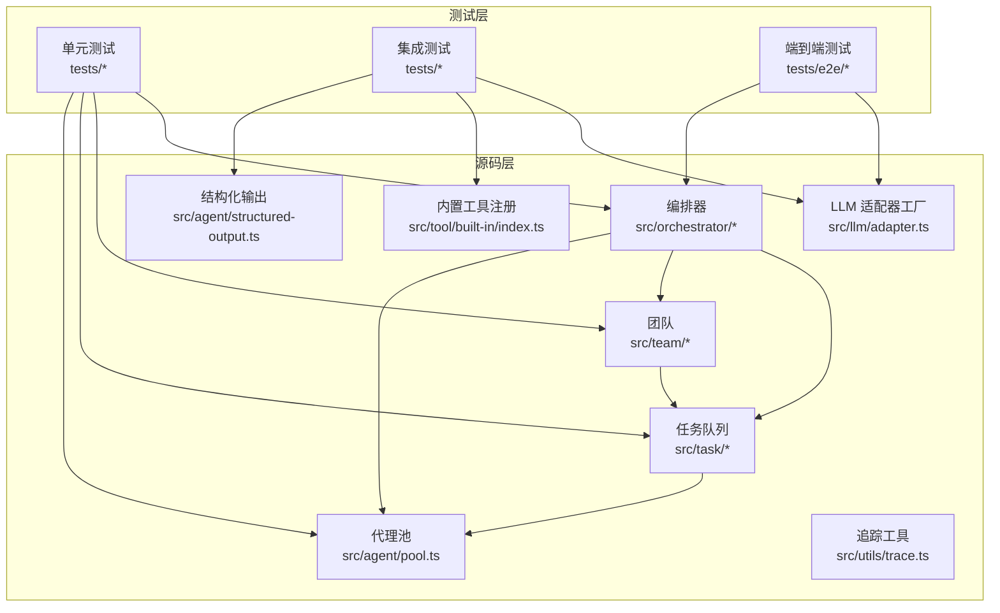
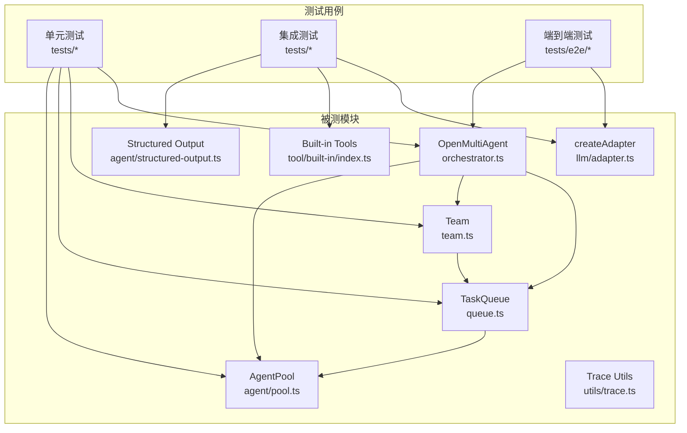
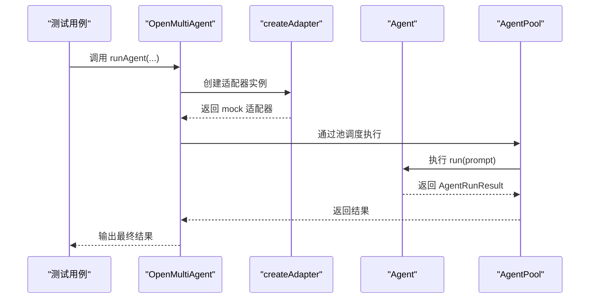
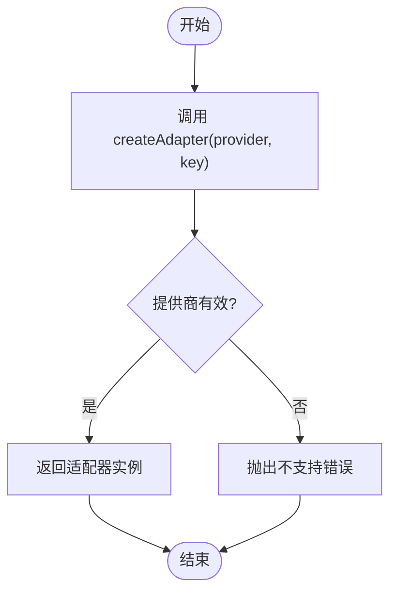
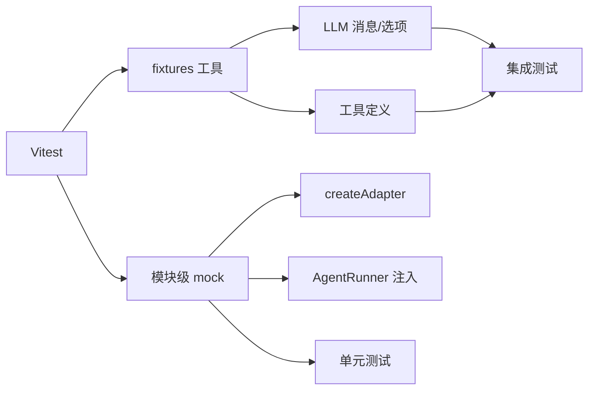

# 测试与调试

<cite>
**本文引用的文件**
- [package.json](file://package.json)
- [vitest.config.ts](file://vitest.config.ts)
- [README.md](file://README.md)
- [src/index.ts](file://src/index.ts)
- [src/orchestrator/orchestrator.ts](file://src/orchestrator/orchestrator.ts)
- [src/team/team.ts](file://src/team/team.ts)
- [src/task/queue.ts](file://src/task/queue.ts)
- [src/agent/pool.ts](file://src/agent/pool.ts)
- [src/llm/adapter.ts](file://src/llm/adapter.ts)
- [src/tool/built-in/index.ts](file://src/tool/built-in/index.ts)
- [src/utils/trace.ts](file://src/utils/trace.ts)
- [tests/helpers/llm-fixtures.ts](file://tests/helpers/llm-fixtures.ts)
- [tests/agent-pool.test.ts](file://tests/agent-pool.test.ts)
- [tests/orchestrator.test.ts](file://tests/orchestrator.test.ts)
- [tests/team-messaging.test.ts](file://tests/team-messaging.test.ts)
- [tests/task-queue.test.ts](file://tests/task-queue.test.ts)
- [tests/llm-adapters.test.ts](file://tests/llm-adapters.test.ts)
- [tests/built-in-tools.test.ts](file://tests/built-in-tools.test.ts)
- [tests/structured-output.test.ts](file://tests/structured-output.test.ts)
- [tests/trace.test.ts](file://tests/trace.test.ts)
</cite>

## 目录
1. [简介](#简介)
2. [项目结构](#项目结构)
3. [核心组件](#核心组件)
4. [架构总览](#架构总览)
5. [详细组件分析](#详细组件分析)
6. [依赖分析](#依赖分析)
7. [性能考虑](#性能考虑)
8. [故障排查指南](#故障排查指南)
9. [结论](#结论)
10. [附录](#附录)

## 简介
本指南面向 Open Multi-Agent 框架的测试与调试，覆盖单元测试、集成测试与端到端测试（E2E）策略，测试配置与模拟数据使用，调试技巧与工具推荐，常见错误诊断与修复，以及测试用例设计与覆盖率质量保障建议。文档基于仓库现有测试与实现进行总结，并提供可操作的最佳实践。

## 项目结构
- 测试组织按功能域划分：核心编排（orchestrator）、团队协作（team）、任务队列（task）、适配器（LLM）、内置工具（tool）、结构化输出（structured-output）、可观测性（trace）等。
- 测试配置通过 Vitest 提供，支持覆盖率统计与按需运行 E2E 测试。
- 示例脚本位于 examples/，可用于手工验证与回归测试。

图表来源
- [vitest.config.ts:1-16](file://vitest.config.ts#L1-L16)
- [src/orchestrator/orchestrator.ts:1-200](file://src/orchestrator/orchestrator.ts#L1-L200)
- [src/team/team.ts:1-200](file://src/team/team.ts#L1-L200)
- [src/task/queue.ts:1-200](file://src/task/queue.ts#L1-L200)
- [src/agent/pool.ts:1-200](file://src/agent/pool.ts#L1-L200)
- [src/llm/adapter.ts](file://src/llm/adapter.ts)
- [src/tool/built-in/index.ts](file://src/tool/built-in/index.ts)
- [src/utils/trace.ts](file://src/utils/trace.ts)

章节来源
- [package.json:19-27](file://package.json#L19-L27)
- [vitest.config.ts:1-16](file://vitest.config.ts#L1-L16)

## 核心组件
- 编排器（OpenMultiAgent）：统一入口，负责团队创建、任务执行与进度事件分发。
- 团队（Team）：代理编组、消息总线、任务队列与共享内存。
- 任务队列（TaskQueue）：拓扑依赖解析、阻塞/解阻、级联失败与完成事件。
- 代理池（AgentPool）：并发控制、轮询派发、健康状态统计。
- LLM 适配器工厂（createAdapter）：按提供商创建适配器实例。
- 内置工具注册（registerBuiltInTools）：注册 bash、file_*、grep 等工具。
- 结构化输出（structured-output）：构建提示、提取 JSON、校验输出。
- 追踪（trace）：生成 runId、事件发射与回调容错。

章节来源
- [src/index.ts:57-183](file://src/index.ts#L57-L183)
- [src/orchestrator/orchestrator.ts:44-194](file://src/orchestrator/orchestrator.ts#L44-L194)
- [src/team/team.ts:88-200](file://src/team/team.ts#L88-L200)
- [src/task/queue.ts:55-200](file://src/task/queue.ts#L55-L200)
- [src/agent/pool.ts:58-200](file://src/agent/pool.ts#L58-L200)
- [src/llm/adapter.ts](file://src/llm/adapter.ts)
- [src/tool/built-in/index.ts](file://src/tool/built-in/index.ts)
- [src/utils/trace.ts](file://src/utils/trace.ts)

## 架构总览
下图展示测试与被测模块之间的交互关系，强调测试中对真实依赖的替换与注入。

图表来源
- [tests/orchestrator.test.ts:18-67](file://tests/orchestrator.test.ts#L18-L67)
- [tests/llm-adapters.test.ts:21-47](file://tests/llm-adapters.test.ts#L21-L47)
- [tests/built-in-tools.test.ts:36-51](file://tests/built-in-tools.test.ts#L36-L51)
- [tests/structured-output.test.ts:18-36](file://tests/structured-output.test.ts#L18-L36)
- [tests/trace.test.ts:22-84](file://tests/trace.test.ts#L22-L84)

## 详细组件分析

### 单元测试策略与示例
- 使用 Vitest 的 mock 机制替换外部依赖，如 LLM 适配器工厂与 AgentRunner 注入，确保测试可控且稳定。
- 使用 fixtures 工具构造消息、选项与工具定义，提升测试复用性与一致性。
- 针对并发与边界条件进行断言，例如代理池并发上限、任务队列级联失败、结构化输出解析与校验。

图表来源
- [tests/orchestrator.test.ts:18-67](file://tests/orchestrator.test.ts#L18-L67)
- [tests/agent-pool.test.ts:18-35](file://tests/agent-pool.test.ts#L18-L35)

章节来源
- [tests/orchestrator.test.ts:18-67](file://tests/orchestrator.test.ts#L18-L67)
- [tests/agent-pool.test.ts:18-35](file://tests/agent-pool.test.ts#L18-L35)
- [tests/helpers/llm-fixtures.ts:20-80](file://tests/helpers/llm-fixtures.ts#L20-L80)

### 集成测试策略与示例
- LLM 适配器工厂：验证不同提供商适配器创建行为与错误处理。
- 内置工具：通过临时目录与文件系统操作，验证工具执行、错误路径与边界条件。
- 结构化输出：验证 JSON 提取、模式校验与错误信息定位。

图表来源
- [tests/llm-adapters.test.ts:21-47](file://tests/llm-adapters.test.ts#L21-L47)

章节来源
- [tests/llm-adapters.test.ts:21-47](file://tests/llm-adapters.test.ts#L21-L47)
- [tests/built-in-tools.test.ts:57-119](file://tests/built-in-tools.test.ts#L57-L119)
- [tests/structured-output.test.ts:42-78](file://tests/structured-output.test.ts#L42-L78)

### 端到端测试策略与示例
- E2E 测试通过环境变量开关控制是否包含在默认测试套件中，避免未配置密钥时误触发。
- 建议在 CI 中显式设置 RUN_E2E=1 并提供对应提供商密钥后运行。

章节来源
- [vitest.config.ts:11-12](file://vitest.config.ts#L11-L12)
- [package.json:25](file://package.json#L25)

### 组件级测试要点

#### 代理池（AgentPool）
- 注册/移除/获取/列举代理的正确性。
- 并发限制与最大并发的约束验证。
- 并行执行与失败兜底（Promise.allSettled）。
- 轮询派发与空池错误处理。

章节来源
- [tests/agent-pool.test.ts:41-213](file://tests/agent-pool.test.ts#L41-L213)
- [src/agent/pool.ts:58-200](file://src/agent/pool.ts#L58-L200)

#### 团队与消息总线（Team/Messaging）
- 点对点与广播消息传递、未读标记与订阅通知。
- 事件桥接：队列事件映射为团队事件。
- 任务增删改查、指派优先级与无依赖自动就绪。

章节来源
- [tests/team-messaging.test.ts:26-330](file://tests/team-messaging.test.ts#L26-L330)
- [src/team/team.ts:88-200](file://src/team/team.ts#L88-L200)

#### 任务队列（TaskQueue）
- 依赖阻塞与解阻、级联失败传播。
- 完成/失败/跳过语义与 all:complete 触发时机。
- 查询接口 next/nextAvailable 与进度统计。

章节来源
- [tests/task-queue.test.ts:20-245](file://tests/task-queue.test.ts#L20-L245)
- [src/task/queue.ts:55-200](file://src/task/queue.ts#L55-L200)

#### 编排器（OpenMultiAgent）
- 团队创建、关闭与状态报告。
- 单代理执行、显式任务执行与自动分解执行。
- 审批门控与任务跳过。
- 默认配置与自定义配置生效。

章节来源
- [tests/orchestrator.test.ts:94-282](file://tests/orchestrator.test.ts#L94-L282)
- [src/orchestrator/orchestrator.ts:44-194](file://src/orchestrator/orchestrator.ts#L44-L194)

#### LLM 适配器工厂
- 不同提供商适配器创建与错误处理。
- OpenAI 兼容消息转换与结束原因归一化。

章节来源
- [tests/llm-adapters.test.ts:21-73](file://tests/llm-adapters.test.ts#L21-L73)
- [src/llm/adapter.ts](file://src/llm/adapter.ts)

#### 内置工具
- 工具注册与可用性。
- 文件读写/编辑/查找等工具的执行与错误路径。

章节来源
- [tests/built-in-tools.test.ts:36-200](file://tests/built-in-tools.test.ts#L36-L200)
- [src/tool/built-in/index.ts](file://src/tool/built-in/index.ts)

#### 结构化输出
- JSON 提取（含代码块围栏）。
- Zod 模式校验与错误信息定位。
- 提示构建与严格模式行为。

章节来源
- [tests/structured-output.test.ts:42-160](file://tests/structured-output.test.ts#L42-L160)
- [src/utils/trace.ts](file://src/utils/trace.ts)

#### 追踪与可观测性
- 事件发射与回调容错。
- runId 生成与唯一性。
- AgentRunner 在每轮 LLM 调用时发出 llm_call 事件。

章节来源
- [tests/trace.test.ts:90-170](file://tests/trace.test.ts#L90-L170)
- [src/utils/trace.ts](file://src/utils/trace.ts)

## 依赖分析
- 测试对真实外部系统的依赖通过模块级 mock 替换，避免网络与密钥耦合。
- 测试夹具（fixtures）集中管理消息、选项与工具定义，减少重复与提高一致性。
- 队列与池的事件驱动模型使得测试可通过监听事件断言流程状态。

图表来源
- [tests/helpers/llm-fixtures.ts:20-80](file://tests/helpers/llm-fixtures.ts#L20-L80)
- [tests/orchestrator.test.ts:46-67](file://tests/orchestrator.test.ts#L46-L67)
- [tests/structured-output.test.ts:170-188](file://tests/structured-output.test.ts#L170-L188)

章节来源
- [tests/helpers/llm-fixtures.ts:20-80](file://tests/helpers/llm-fixtures.ts#L20-L80)
- [tests/orchestrator.test.ts:46-67](file://tests/orchestrator.test.ts#L46-L67)
- [tests/structured-output.test.ts:170-188](file://tests/structured-output.test.ts#L170-L188)

## 性能考虑
- 并发控制：代理池的最大并发限制应结合实际资源与 LLM 速率限制进行调优，避免过度并发导致超时或限流。
- 重试策略：任务重试延迟与退避参数影响整体耗时与成本，应在测试中覆盖不同参数组合。
- 事件风暴：大量任务/代理同时触发事件时，注意 onProgress/onTrace 的回调开销，必要时在测试中模拟高负载场景。

## 故障排查指南
- LLM 适配器创建失败：检查提供商名称与密钥，确认工厂函数的错误分支已被覆盖。
- 任务级联失败：核对依赖图与 fail/cascade 行为，确保下游任务被正确标记为 failed。
- 代理池并发越界：通过并发计数器与最大并发断言验证，避免超出阈值。
- 结构化输出解析失败：检查 JSON 围栏、嵌套对象提取与 Zod 错误信息定位。
- 追踪回调异常：确认回调容错逻辑，避免未捕获异常导致测试中断。

章节来源
- [tests/llm-adapters.test.ts:42-47](file://tests/llm-adapters.test.ts#L42-L47)
- [tests/task-queue.test.ts:95-131](file://tests/task-queue.test.ts#L95-L131)
- [tests/agent-pool.test.ts:182-211](file://tests/agent-pool.test.ts#L182-L211)
- [tests/structured-output.test.ts:71-78](file://tests/structured-output.test.ts#L71-L78)
- [tests/trace.test.ts:123-157](file://tests/trace.test.ts#L123-L157)

## 结论
本指南总结了 Open Multi-Agent 框架的测试与调试方法论：以模块级 mock 与 fixtures 为核心，覆盖单元、集成与端到端测试；通过事件驱动与并发控制的测试策略，确保复杂协作流程的稳定性；配合可观测性与重试机制，提升问题定位与恢复能力。建议在持续集成中启用覆盖率统计与 E2E 验证，形成闭环的质量保障体系。

## 附录

### 测试策略与最佳实践清单
- 单元测试
  - 对每个模块的边界条件与异常路径进行断言。
  - 使用模块级 mock 替换外部依赖，确保可重复性。
  - 使用 fixtures 统一构造输入数据，减少重复。
- 集成测试
  - 验证跨模块交互（如队列与池、团队与消息总线）。
  - 覆盖真实但受控的外部系统（如 LLM 适配器、内置工具）。
- 端到端测试
  - 仅在具备密钥与网络访问的环境中运行，避免默认套件污染。
  - 将 E2E 作为 CI 的可选步骤，手动触发以减少误报。
- 覆盖率与质量
  - 启用覆盖率统计，关注关键路径与异常分支。
  - 对并发、重试、失败传播等复杂流程进行专项回归测试。

### 常见错误与修复建议
- “适配器提供商未知”：确认提供商名称拼写与工厂支持列表。
- “代理未注册”：在池中添加后再执行，或在执行前检查 get 结果。
- “任务未找到”：确认任务 ID 与依赖图一致，避免重复提交。
- “并发超过限制”：降低最大并发或优化任务粒度。
- “结构化输出校验失败”：根据错误信息修正输出格式或调整 Zod 模式。

### 调试技巧与工具推荐
- 日志与追踪
  - 使用 onTrace 回调收集结构化事件，结合 runId 关联链路。
  - 在 AgentRunner 层面验证每轮 LLM 调用与工具调用事件。
- 性能分析
  - 利用测试中的计时与令牌用量统计，识别热点路径。
  - 在高并发场景下观察队列阻塞与级联失败频率。
- 内存泄漏检测
  - 在长生命周期测试中监控事件监听器与定时器清理。
  - 确保每次测试后释放队列、池与总线的内部状态。