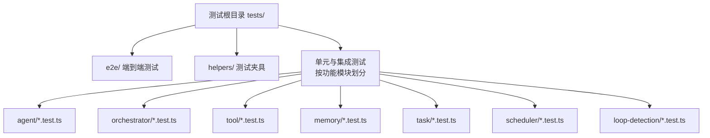
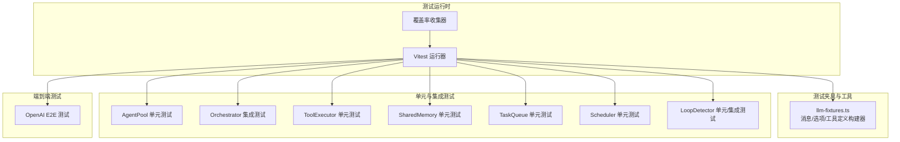
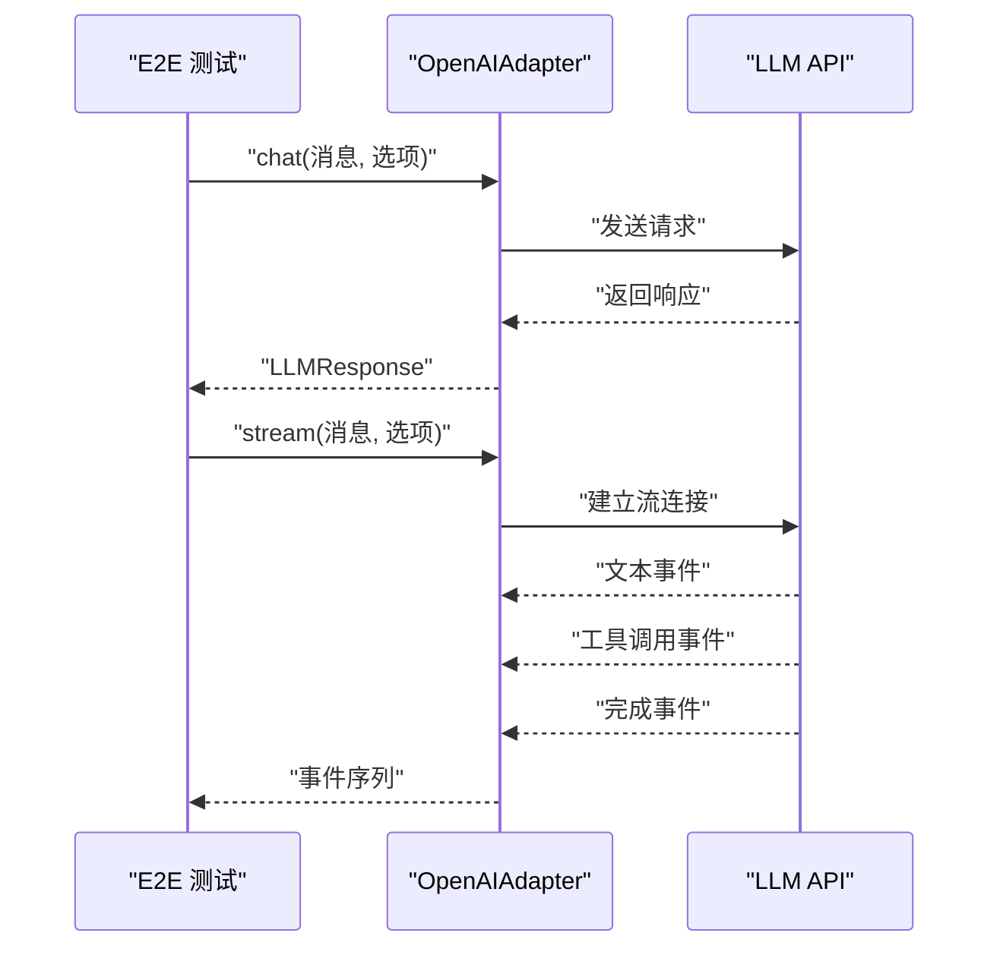
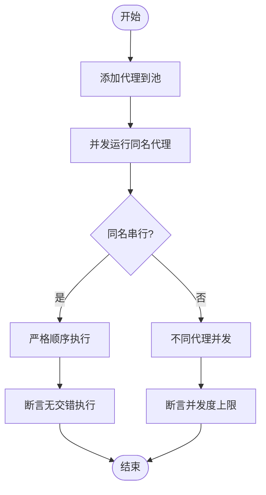
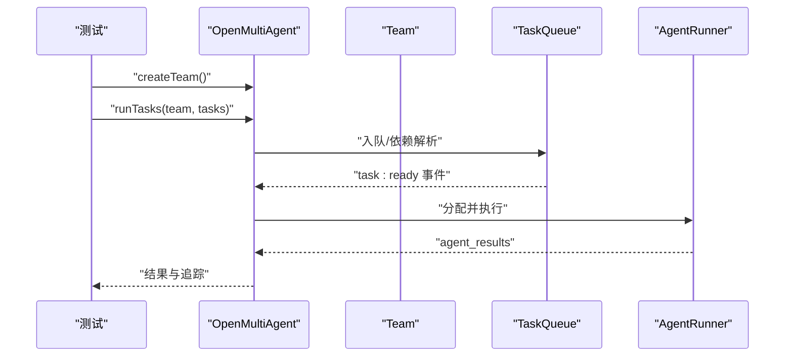
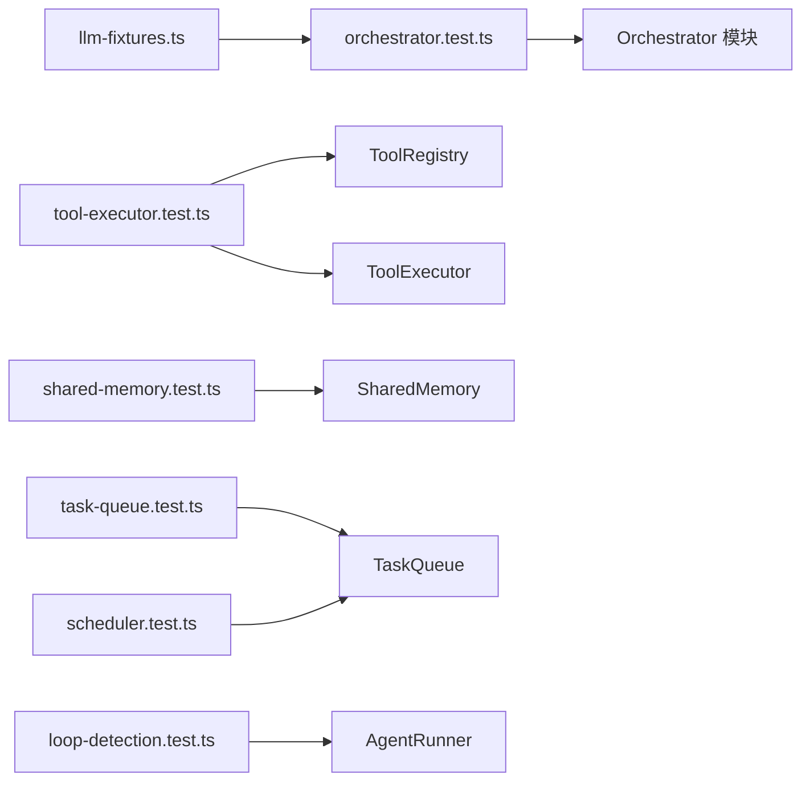

# 测试与质量保证

<cite>
**本文引用的文件**
- [vitest.config.ts](file://vitest.config.ts)
- [package.json](file://package.json)
- [tests/helpers/llm-fixtures.ts](file://tests/helpers/llm-fixtures.ts)
- [tests/e2e/openai-e2e.test.ts](file://tests/e2e/openai-e2e.test.ts)
- [tests/abort-signal.test.ts](file://tests/abort-signal.test.ts)
- [tests/agent-pool.test.ts](file://tests/agent-pool.test.ts)
- [tests/orchestrator.test.ts](file://tests/orchestrator.test.ts)
- [tests/tool-executor.test.ts](file://tests/tool-executor.test.ts)
- [tests/shared-memory.test.ts](file://tests/shared-memory.test.ts)
- [tests/task-queue.test.ts](file://tests/task-queue.test.ts)
- [tests/scheduler.test.ts](file://tests/scheduler.test.ts)
- [tests/loop-detection.test.ts](file://tests/loop-detection.test.ts)
- [.github/codecov.yml](file://.github/codecov.yml)
</cite>

## 目录
1. [简介](#简介)
2. [项目结构](#项目结构)
3. [核心组件](#核心组件)
4. [架构总览](#架构总览)
5. [详细组件分析](#详细组件分析)
6. [依赖分析](#依赖分析)
7. [性能考虑](#性能考虑)
8. [故障排查指南](#故障排查指南)
9. [结论](#结论)
10. [附录](#附录)

## 简介
本文件系统化梳理 Open Multi-Agent 框架的测试与质量保证体系，覆盖单元测试、集成测试、端到端测试（E2E）的组织结构与策略；说明测试配置、模拟对象与测试数据管理；给出测试最佳实践与代码覆盖率要求；提供性能与压力测试方法建议；解释持续集成与自动化测试流程，并总结调试技巧与常见问题解决方案。

## 项目结构
测试目录采用按功能域分层的组织方式：
- tests/
  - e2e/: 端到端测试，依赖真实 LLM API，需显式启用
  - helpers/: 公共测试夹具与工具
  - 各类功能模块测试：如 agent、orchestrator、tool、memory、task、scheduler、loop-detection 等

**图表来源**
- [tests/e2e/openai-e2e.test.ts:1-82](file://tests/e2e/openai-e2e.test.ts#L1-L82)
- [tests/helpers/llm-fixtures.ts:1-81](file://tests/helpers/llm-fixtures.ts#L1-L81)

**章节来源**
- [vitest.config.ts:1-19](file://vitest.config.ts#L1-L19)
- [package.json:34-43](file://package.json#L34-L43)

## 核心组件
- 测试运行器与覆盖率
  - 使用 Vitest 进行测试执行与覆盖率统计，报告格式包括文本、HTML、LCov、JSON
  - 默认排除路径包含本地工作树与 E2E 目录，可通过环境变量 RUN_E2E 控制是否包含 E2E
- 测试脚本
  - 提供 test、test:watch、test:coverage、test:e2e 等常用命令
- 覆盖率配置
  - 覆盖范围限定在 src/**，便于聚焦业务代码
- E2E 测试开关
  - 通过 RUN_E2E 环境变量启用，且需要相应 API 密钥

**章节来源**
- [vitest.config.ts:3-18](file://vitest.config.ts#L3-L18)
- [package.json:34-43](file://package.json#L34-L43)

## 架构总览
测试架构围绕“夹具—模拟—断言”的模式展开，结合模块级隔离与跨模块集成验证，形成从单点到端到端的完整质量保障闭环。

**图表来源**
- [tests/helpers/llm-fixtures.ts:1-81](file://tests/helpers/llm-fixtures.ts#L1-L81)
- [tests/agent-pool.test.ts:1-384](file://tests/agent-pool.test.ts#L1-L384)
- [tests/orchestrator.test.ts:1-1006](file://tests/orchestrator.test.ts#L1-L1006)
- [tests/tool-executor.test.ts:1-521](file://tests/tool-executor.test.ts#L1-L521)
- [tests/shared-memory.test.ts:1-408](file://tests/shared-memory.test.ts#L1-L408)
- [tests/task-queue.test.ts:1-246](file://tests/task-queue.test.ts#L1-L246)
- [tests/scheduler.test.ts:1-222](file://tests/scheduler.test.ts#L1-L222)
- [tests/loop-detection.test.ts:1-457](file://tests/loop-detection.test.ts#L1-L457)
- [tests/e2e/openai-e2e.test.ts:1-82](file://tests/e2e/openai-e2e.test.ts#L1-L82)

## 详细组件分析

### 测试策略与组织
- 单元测试
  - 针对独立模块或类进行最小化边界验证，使用 vi.fn/vi.mock 等进行行为替换与状态捕获
  - 示例：AgentPool 的并发控制、错误处理与序列化；ToolExecutor 的批量执行与输出截断；LoopDetector 的重复检测
- 集成测试
  - 覆盖多模块协作场景，如 Orchestrator 的任务分解、计划注入、审批门禁、追踪事件等
  - 通过模块级 mock（如适配器工厂）隔离外部依赖，确保测试稳定可重复
- 端到端测试
  - 直连真实 LLM API，验证完整链路的可用性与稳定性
  - 通过环境变量 RUN_E2E 开关，避免默认执行时对外部资源的依赖

**章节来源**
- [tests/agent-pool.test.ts:1-384](file://tests/agent-pool.test.ts#L1-L384)
- [tests/tool-executor.test.ts:1-521](file://tests/tool-executor.test.ts#L1-L521)
- [tests/loop-detection.test.ts:1-457](file://tests/loop-detection.test.ts#L1-L457)
- [tests/orchestrator.test.ts:1-1006](file://tests/orchestrator.test.ts#L1-L1006)
- [tests/e2e/openai-e2e.test.ts:1-82](file://tests/e2e/openai-e2e.test.ts#L1-L82)

### 测试夹具与模拟对象
- LLM 夹具
  - 提供消息构建器（文本/工具调用/工具结果/图片）、聊天选项构建器、工具定义构建器与事件收集辅助函数
  - 用于统一构造 LLM 交互输入与期望输出，减少重复样板代码
- 适配器与注册表模拟
  - 在 Orchestrator 测试中通过模块级 mock 替换 createAdapter 工厂，捕获聊天参数与提示词，验证策略注入与上下文构建
  - ToolExecutor 测试中使用自定义工具与 Zod Schema，验证输入/输出校验与错误传播

**章节来源**
- [tests/helpers/llm-fixtures.ts:1-81](file://tests/helpers/llm-fixtures.ts#L1-L81)
- [tests/orchestrator.test.ts:78-110](file://tests/orchestrator.test.ts#L78-L110)
- [tests/tool-executor.test.ts:1-521](file://tests/tool-executor.test.ts#L1-L521)

### 端到端测试实现与覆盖范围
- 实现方法
  - 基于真实 LLM 客户端实例，直接发起 chat/stream 请求，断言响应类型、内容块类型、令牌用量等
  - 使用 describe.skip 与环境变量 RUN_E2E 组合，仅在需要时执行
- 覆盖范围
  - 文本对话返回、工具调用识别、流式事件分发与完成事件、工具调用在流式场景中的识别
- 执行方式
  - 通过 npm run test:e2e 启动，需设置对应环境变量与密钥

**图表来源**
- [tests/e2e/openai-e2e.test.ts:27-80](file://tests/e2e/openai-e2e.test.ts#L27-L80)

**章节来源**
- [tests/e2e/openai-e2e.test.ts:1-82](file://tests/e2e/openai-e2e.test.ts#L1-L82)
- [vitest.config.ts:14-16](file://vitest.config.ts#L14-L16)
- [package.json:41-41](file://package.json#L41-L41)

### 测试数据管理
- 统一构建器
  - 使用 llm-fixtures 中的消息/工具/选项构建器，确保测试间一致性
- 事件收集
  - collectEvents 辅助函数用于聚合异步迭代器事件，便于断言流式行为
- 自定义存储注入
  - SharedMemory 支持注入自定义 MemoryStore，测试中通过记录型存储备份调用轨迹，验证命名空间与摘要生成

**章节来源**
- [tests/helpers/llm-fixtures.ts:73-81](file://tests/helpers/llm-fixtures.ts#L73-L81)
- [tests/shared-memory.test.ts:142-312](file://tests/shared-memory.test.ts#L142-L312)

### 单元测试示例分析

#### AgentPool 并发与序列化
- 关键点
  - 注册表增删查、并行执行、失败容错、轮询调度、槽位计数、临时实例不占用锁
  - 对同一代理的并发调用进行串行化，不同代理并发执行
- 断言要点
  - 执行日志顺序、最大并发度、异常后锁释放、槽位变化

**图表来源**
- [tests/agent-pool.test.ts:181-262](file://tests/agent-pool.test.ts#L181-L262)

**章节来源**
- [tests/agent-pool.test.ts:1-384](file://tests/agent-pool.test.ts#L1-L384)

#### Orchestrator 集成测试
- 关键点
  - 创建团队、关闭、状态查询
  - 单代理运行、自定义工具注入、工具白名单/黑名单、审批门禁、计划就绪门禁、追踪事件
  - 任务队列依赖解析、级联失败、进度统计
- 断言要点
  - 事件类型与顺序、提示词注入、令牌用量、结果映射

**图表来源**
- [tests/orchestrator.test.ts:283-378](file://tests/orchestrator.test.ts#L283-L378)
- [tests/task-queue.test.ts:20-246](file://tests/task-queue.test.ts#L20-L246)

**章节来源**
- [tests/orchestrator.test.ts:1-1006](file://tests/orchestrator.test.ts#L1-L1006)
- [tests/task-queue.test.ts:1-246](file://tests/task-queue.test.ts#L1-L246)

#### ToolExecutor 与输出截断
- 关键点
  - 单次与批量执行、并发限制、错误隔离
  - 输出截断策略（头尾拼接标记）、错误结果同样截断、输出模式校验
- 断言要点
  - 截断长度、标记存在、错误路径正确

**章节来源**
- [tests/tool-executor.test.ts:1-521](file://tests/tool-executor.test.ts#L1-L521)

#### SharedMemory 与摘要生成
- 关键点
  - 命名空间隔离、元数据存储、摘要生成、过期 TTL、自定义存储注入
- 断言要点
  - 摘要结构、过滤条件、过期行为

**章节来源**
- [tests/shared-memory.test.ts:1-408](file://tests/shared-memory.test.ts#L1-L408)

#### Scheduler 分配策略
- 关键点
  - 轮询、最少忙碌、能力匹配、依赖优先、自动分配
- 断言要点
  - 分配均衡性、依赖优先级、关键字匹配

**章节来源**
- [tests/scheduler.test.ts:1-222](file://tests/scheduler.test.ts#L1-L222)

#### LoopDetector 循环检测
- 关键点
  - 工具调用重复、文本重复、窗口大小、警告/注入/继续/终止策略
- 断言要点
  - 触发时机、事件注入、回调行为

**章节来源**
- [tests/loop-detection.test.ts:1-457](file://tests/loop-detection.test.ts#L1-L457)

### 测试最佳实践
- 明确测试职责
  - 单测只验证单一模块或类；集成测跨模块协作；E2E 测真实链路
- 使用夹具与模拟
  - 统一构建输入，模块级 mock 隔离外部依赖
- 断言设计
  - 关注关键行为与边界条件；对并发与错误路径进行显式断言
- 可观测性
  - 利用 onProgress/onTrace 回调收集事件，便于定位问题
- 可维护性
  - 将公共逻辑抽取为夹具与辅助函数，减少重复

[本节为通用指导，无需特定文件引用]

## 依赖分析
测试依赖关系主要体现在模块级 mock 与跨模块协作上：

**图表来源**
- [tests/helpers/llm-fixtures.ts:1-81](file://tests/helpers/llm-fixtures.ts#L1-L81)
- [tests/orchestrator.test.ts:78-110](file://tests/orchestrator.test.ts#L78-L110)
- [tests/tool-executor.test.ts:1-521](file://tests/tool-executor.test.ts#L1-L521)
- [tests/shared-memory.test.ts:1-408](file://tests/shared-memory.test.ts#L1-L408)
- [tests/task-queue.test.ts:1-246](file://tests/task-queue.test.ts#L1-L246)
- [tests/scheduler.test.ts:1-222](file://tests/scheduler.test.ts#L1-L222)
- [tests/loop-detection.test.ts:1-457](file://tests/loop-detection.test.ts#L1-L457)

**章节来源**
- [tests/orchestrator.test.ts:78-110](file://tests/orchestrator.test.ts#L78-L110)
- [tests/tool-executor.test.ts:1-521](file://tests/tool-executor.test.ts#L1-L521)

## 性能考虑
- 单元测试
  - 使用 vi.fn/vi.mock 替代真实网络调用，避免 IO 抖动
  - 对并发与超时场景使用可控的延迟与计数器
- 集成测试
  - 通过模块级 mock 控制外部依赖，缩短测试执行时间
  - 对长链路场景拆分为多个子步骤断言，提升定位效率
- 端到端测试
  - 仅在必要时启用，避免 CI 时间过长
  - 使用较短的 maxTokens 与温度参数，减少 API 调用成本
- 覆盖率
  - 通过 include: ['src/**'] 精准统计业务代码覆盖率，关注热点路径与分支

[本节为通用指导，无需特定文件引用]

## 故障排查指南
- E2E 测试失败
  - 确认 RUN_E2E 环境变量已设置
  - 检查对应 API 密钥是否配置正确
  - 查看网络与配额限制
- 并发相关问题
  - 检查 AgentPool 的 per-agent 序列化与 maxConcurrency 设置
  - 使用并发计数器与日志确认是否存在死锁或饥饿
- 工具执行异常
  - 核对输入 Schema 与输出模式校验
  - 检查工具注册与并发限制
- 循环检测误报
  - 调整 maxRepetitions 与窗口大小
  - 审核 onLoopDetected 回调策略
- 覆盖率不足
  - 补充边界条件与错误路径断言
  - 使用 collectEvents 等辅助函数覆盖异步事件

**章节来源**
- [tests/e2e/openai-e2e.test.ts:1-82](file://tests/e2e/openai-e2e.test.ts#L1-L82)
- [tests/agent-pool.test.ts:181-262](file://tests/agent-pool.test.ts#L181-L262)
- [tests/tool-executor.test.ts:1-521](file://tests/tool-executor.test.ts#L1-L521)
- [tests/loop-detection.test.ts:1-457](file://tests/loop-detection.test.ts#L1-L457)
- [vitest.config.ts:5-8](file://vitest.config.ts#L5-L8)

## 结论
本测试体系以夹具与模拟为核心，结合单元、集成与端到端三层测试，既保证了开发效率，又覆盖了关键业务路径与边界条件。通过明确的测试策略、规范的断言设计与可观测性支持，能够有效保障框架的稳定性与可维护性。建议在 CI 中固定覆盖率阈值并在 PR 中强制执行 E2E 快速通道，持续优化测试执行时间与稳定性。

[本节为总结性内容，无需特定文件引用]

## 附录

### 测试命令与配置
- 常用命令
  - 运行全部测试：npm run test
  - 监听模式：npm run test:watch
  - 生成覆盖率：npm run test:coverage
  - 运行端到端：npm run test:e2e
- 覆盖率报告
  - 文本、HTML、LCov、JSON 多格式输出，include 范围为 src/**
- E2E 开关
  - 通过 RUN_E2E 环境变量启用，需提供相应 API 密钥

**章节来源**
- [package.json:34-43](file://package.json#L34-L43)
- [vitest.config.ts:5-8](file://vitest.config.ts#L5-L8)
- [vitest.config.ts:14-16](file://vitest.config.ts#L14-L16)

### 持续集成与自动化
- 覆盖率提交
  - 仓库配置了 Codecov 提交，评论关闭，适合在 CI 中上传覆盖率报告
- 建议流程
  - 单元与集成测试在 PR 中快速执行
  - E2E 在主干或定时任务中执行
  - 覆盖率阈值纳入 CI 失败条件

**章节来源**
- [.github/codecov.yml:1-2](file://.github/codecov.yml#L1-L2)