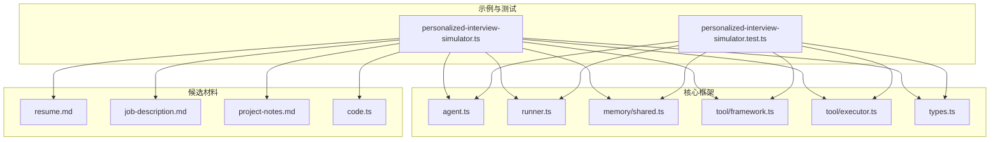
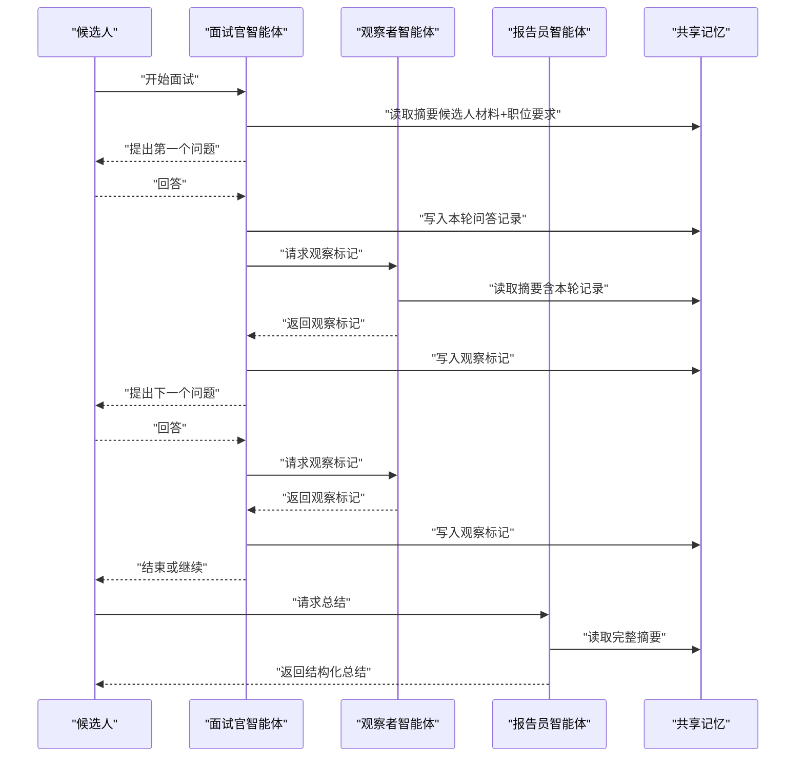
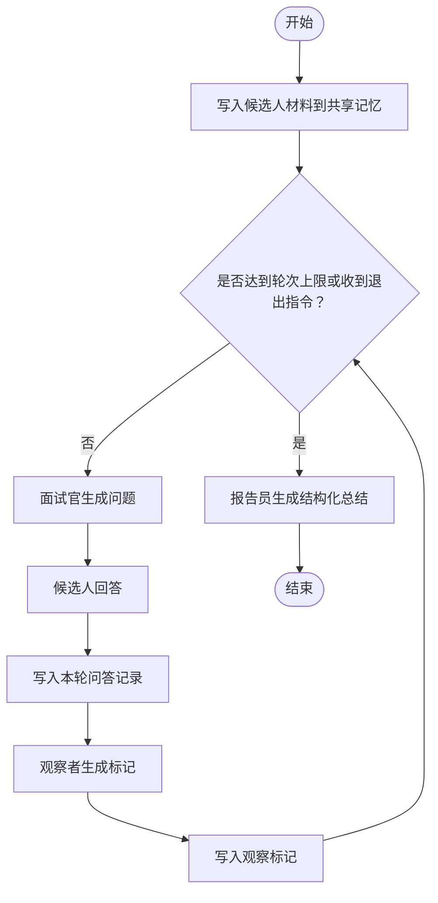
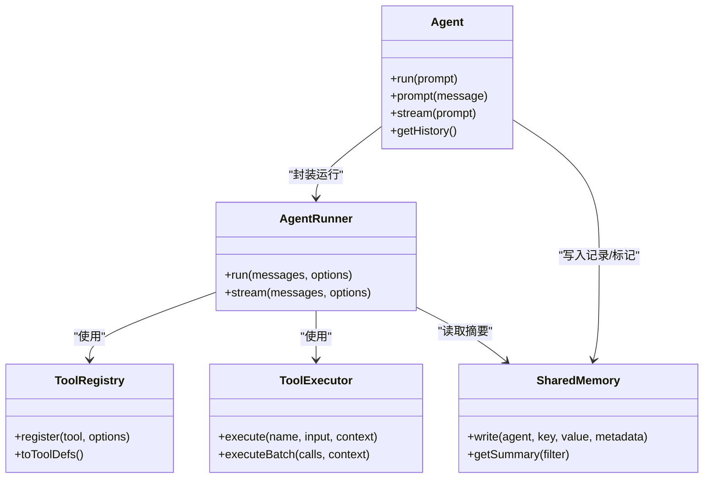

# 个性化面试模拟器

<cite>
**本文引用的文件**
- [personalized-interview-simulator.ts](file://examples/cookbook/personalized-interview-simulator.ts)
- [personalized-interview-simulator.test.ts](file://tests/personalized-interview-simulator.test.ts)
- [agent.ts](file://src/agent/agent.ts)
- [runner.ts](file://src/agent/runner.ts)
- [shared.ts](file://src/memory/shared.ts)
- [framework.ts](file://src/tool/framework.ts)
- [executor.ts](file://src/tool/executor.ts)
- [types.ts](file://src/types.ts)
- [resume.md](file://examples/fixtures/interview-candidate/resume.md)
- [job-description.md](file://examples/fixtures/interview-candidate/job-description.md)
- [project-notes.md](file://examples/fixtures/interview-candidate/project-notes.md)
- [code.ts](file://examples/fixtures/interview-candidate/code.ts)
</cite>

## 目录
1. [引言](#引言)
2. [项目结构](#项目结构)
3. [核心组件](#核心组件)
4. [架构总览](#架构总览)
5. [详细组件分析](#详细组件分析)
6. [依赖关系分析](#依赖关系分析)
7. [性能考量](#性能考量)
8. [故障排查指南](#故障排查指南)
9. [结论](#结论)
10. [附录](#附录)

## 引言
本文件面向“个性化面试模拟器”的设计与实现，围绕以下目标展开：候选人画像构建（简历分析、项目经验评估、技能匹配）、面试官智能体的多维度评估（技术能力、沟通技巧、文化适配性、领导潜力）、基于候选人背景与职位要求的问题生成策略、实时反馈与改进建议、代码面试场景（算法题评估与代码审查）、软技能评估与行为面试分析、面试过程录制与分析、以及基于结果的学习建议与技能提升计划。  
该系统以多智能体协作为核心，通过共享记忆（SharedMemory）在多轮对话中持续注入候选材料与观察标记，驱动面试官智能体进行个性化提问，并由观察者智能体对回答进行交叉校验，最终由报告智能体输出结构化总结。

## 项目结构
- 示例入口位于 examples/cookbook/personalized-interview-simulator.ts，演示了三智能体（面试官、观察者、报告员）的交互流程与结构化总结输出。
- 测试用例 tests/personalized-interview-simulator.test.ts 验证了共享内存跨轮次传递、观察标记注入、以及结构化总结的正确性。
- 核心框架位于 src/ 下：
  - agent.ts 提供高阶 Agent 封装，支持持久对话历史、结构化输出与流式输出。
  - runner.ts 实现对话循环引擎，处理工具调用、并发执行与预算控制。
  - memory/shared.ts 提供命名空间化的共享记忆，支持摘要生成与过期管理。
  - tool/framework.ts 与 tool/executor.ts 提供工具注册、转换与执行框架。
  - types.ts 定义消息、运行结果、工具、队列等核心类型。
- 候选材料示例位于 examples/fixtures/interview-candidate/，包含简历、职位描述、项目笔记与代码片段。

图表来源
- [personalized-interview-simulator.ts:108-192](file://examples/cookbook/personalized-interview-simulator.ts#L108-L192)
- [agent.ts:94-191](file://src/agent/agent.ts#L94-L191)
- [runner.ts:67-143](file://src/agent/runner.ts#L67-L143)
- [shared.ts:55-85](file://src/memory/shared.ts#L55-L85)
- [framework.ts:121-254](file://src/tool/framework.ts#L121-L254)
- [executor.ts:54-63](file://src/tool/executor.ts#L54-L63)
- [types.ts:368-531](file://src/types.ts#L368-L531)

章节来源
- [personalized-interview-simulator.ts:1-275](file://examples/cookbook/personalized-interview-simulator.ts#L1-L275)
- [personalized-interview-simulator.test.ts:1-171](file://tests/personalized-interview-simulator.test.ts#L1-L171)

## 核心组件
- 面试官智能体（Interviewer）
  - 角色：资深技术面试官，基于候选人材料与职位要求提出个性化问题。
  - 关键点：每轮仅提一个问题；优先追问而非频繁换题；结合观察者标记调整后续问题；保持问题简洁尖锐。
- 观察者智能体（Observer）
  - 角色：在每轮结束后生成“观察标记”，聚焦矛盾、模糊、未覆盖维度与隐藏追问钩子。
  - 关键点：输出3–6条具体要点，不使用散文式介绍。
- 报告员智能体（Reporter）
  - 角色：生成结构化面试总结，包含“问题清单及原因”“弱项”“强项”“总体评估”。
  - 关键点：使用 Zod 结构化模式，确保输出可解析且一致。
- 共享记忆（SharedMemory）
  - 角色：多智能体共享上下文存储，按命名空间写入，支持摘要生成与过期管理。
  - 关键点：命名空间键格式为“<agent>/<key>”；摘要用于注入系统提示或用户回合。
- 工具框架与执行器
  - 角色：提供工具注册、Zod 输入/输出校验、并发限制与批量执行。
  - 关键点：输入/输出均通过 Zod 校验；错误统一包装为 ToolResult；支持截断长输出。

章节来源
- [personalized-interview-simulator.ts:108-192](file://examples/cookbook/personalized-interview-simulator.ts#L108-L192)
- [shared.ts:55-294](file://src/memory/shared.ts#L55-L294)
- [framework.ts:121-254](file://src/tool/framework.ts#L121-L254)
- [executor.ts:54-130](file://src/tool/executor.ts#L54-L130)
- [agent.ts:94-191](file://src/agent/agent.ts#L94-L191)

## 架构总览
系统采用“三智能体 + 共享记忆”的协作架构：面试官负责提问，观察者负责交叉验证，报告员负责结构化总结；共享记忆贯穿所有轮次，承载候选人材料、面试记录与观察标记。

图表来源
- [personalized-interview-simulator.ts:206-274](file://examples/cookbook/personalized-interview-simulator.ts#L206-L274)
- [shared.ts:251-294](file://src/memory/shared.ts#L251-L294)

## 详细组件分析

### 组件A：个性化面试流程与结构化总结
- 流程要点
  - 初始化：加载候选人材料（简历、项目笔记、代码片段、职位描述），构建共享记忆并写入。
  - 多轮交互：面试官基于上下文与观察标记生成问题；候选人回答后写入记录；观察者生成标记并写回；重复直至轮次上限或退出指令。
  - 结构化总结：报告员读取完整摘要，输出符合 Zod 模式的 JSON 结果。
- 关键实现路径
  - 示例主流程：[personalized-interview-simulator.ts:206-274](file://examples/cookbook/personalized-interview-simulator.ts#L206-L274)
  - 测试用例验证：[personalized-interview-simulator.test.ts:62-170](file://tests/personalized-interview-simulator.test.ts#L62-L170)

图表来源
- [personalized-interview-simulator.ts:206-274](file://examples/cookbook/personalized-interview-simulator.ts#L206-L274)
- [shared.ts:124-135](file://src/memory/shared.ts#L124-L135)

章节来源
- [personalized-interview-simulator.ts:108-192](file://examples/cookbook/personalized-interview-simulator.ts#L108-L192)
- [personalized-interview-simulator.test.ts:62-170](file://tests/personalized-interview-simulator.test.ts#L62-L170)

### 组件B：候选人画像构建与技能匹配
- 简历分析
  - 关键信息抽取：工作年限、技术栈、职责范围、项目成果。
  - 示例材料：[resume.md:1-14](file://examples/fixtures/interview-candidate/resume.md#L1-L14)
- 项目经验评估
  - 当前展示项目、实现细节、已知权衡与潜在改进点。
  - 示例材料：[project-notes.md:1-16](file://examples/fixtures/interview-candidate/project-notes.md#L1-L16)
- 技能匹配
  - 职位要求与候选人能力的对应关系，如事务边界、幂等性、并发与一致性、日志与可观测性等。
  - 示例材料：[job-description.md:1-16](file://examples/fixtures/interview-candidate/job-description.md#L1-L16)
- 代码样例审查
  - 通过代码片段评估事务使用、错误处理、审计日志等关键实践。
  - 示例材料：[code.ts:1-47](file://examples/fixtures/interview-candidate/code.ts#L1-L47)

章节来源
- [resume.md:1-14](file://examples/fixtures/interview-candidate/resume.md#L1-L14)
- [project-notes.md:1-16](file://examples/fixtures/interview-candidate/project-notes.md#L1-L16)
- [job-description.md:1-16](file://examples/fixtures/interview-candidate/job-description.md#L1-L16)
- [code.ts:1-47](file://examples/fixtures/interview-candidate/code.ts#L1-L47)

### 组件C：面试官智能体的多维度评估能力
- 技术能力
  - 基于职位要求与候选人材料，针对幂等性、事务边界、并发与一致性、扩展路径等进行追问。
- 沟通技巧
  - 通过追问与引导，观察候选人的表达逻辑、结构化思维与自证能力。
- 文化适配性
  - 从项目决策、权衡与团队协作角度，评估价值观与团队契合度。
- 领导潜力
  - 关注项目所有权、复杂度管理与跨团队影响，识别潜在领导者特质。

章节来源
- [personalized-interview-simulator.ts:112-128](file://examples/cookbook/personalized-interview-simulator.ts#L112-L128)

### 组件D：面试问题生成算法与个性化策略
- 个性化策略
  - 上下文注入：将候选人材料与职位要求注入系统提示，确保问题与背景相关。
  - 观察标记：结合观察者标记，优先追问矛盾、模糊或未覆盖维度。
  - 追问优先：每轮仅一个问题，优先深入追问而非切换主题。
- 代码级实现要点
  - 面试官配置与系统提示：[personalized-interview-simulator.ts:108-131](file://examples/cookbook/personalized-interview-simulator.ts#L108-L131)
  - 共享记忆摘要注入：[personalized-interview-simulator.ts:209-219](file://examples/cookbook/personalized-interview-simulator.ts#L209-L219)

章节来源
- [personalized-interview-simulator.ts:108-131](file://examples/cookbook/personalized-interview-simulator.ts#L108-L131)
- [personalized-interview-simulator.ts:209-219](file://examples/cookbook/personalized-interview-simulator.ts#L209-L219)

### 组件E：实时反馈与改进建议生成机制
- 观察标记
  - 每轮结束后生成“矛盾/模糊/未覆盖/隐藏钩子”等标记，作为后续问题的依据。
- 结构化总结
  - 报告员输出“问题清单及原因”“弱项”“强项”“总体评估”，形成闭环反馈。
- 代码级实现要点
  - 观察者系统提示与输出约束：[personalized-interview-simulator.ts:133-156](file://examples/cookbook/personalized-interview-simulator.ts#L133-L156)
  - 报告员系统提示与结构化模式：[personalized-interview-simulator.ts:158-174](file://examples/cookbook/personalized-interview-simulator.ts#L158-L174)

章节来源
- [personalized-interview-simulator.ts:133-174](file://examples/cookbook/personalized-interview-simulator.ts#L133-L174)

### 组件F：代码面试场景实现（算法题评估与代码审查）
- 代码审查
  - 使用候选人提供的代码片段，评估事务使用、错误处理、审计日志与并发风险。
  - 示例代码：[code.ts:1-47](file://examples/fixtures/interview-candidate/code.ts#L1-L47)
- 算法题评估
  - 可扩展为“算法题生成器 + 代码执行/静态检查 + 复杂度分析”的组合，当前示例侧重代码审查与行为问题。
- 代码级实现要点
  - 代码样例注入与审查：[personalized-interview-simulator.ts:48-51](file://examples/cookbook/personalized-interview-simulator.ts#L48-L51)

章节来源
- [code.ts:1-47](file://examples/fixtures/interview-candidate/code.ts#L1-L47)
- [personalized-interview-simulator.ts:48-51](file://examples/cookbook/personalized-interview-simulator.ts#L48-L51)

### 组件G：软技能评估与行为面试分析
- 软技能评估
  - 通过行为问题与追问，评估沟通、协作、冲突解决与学习能力。
- 行为面试分析
  - 基于候选人回答中的具体实例，识别其在压力下的决策与执行方式。
- 代码级实现要点
  - 面试官系统提示强调“深入追问”与“避免过早换题”：[personalized-interview-simulator.ts:121-128](file://examples/cookbook/personalized-interview-simulator.ts#L121-L128)

章节来源
- [personalized-interview-simulator.ts:121-128](file://examples/cookbook/personalized-interview-simulator.ts#L121-L128)

### 组件H：面试过程录制与分析
- 录制
  - 每轮问答与观察标记均写入共享记忆，形成完整可追溯的面试记录。
- 分析
  - 报告员基于完整摘要生成结构化总结，支持后续复盘与对比。
- 代码级实现要点
  - 记录写入与摘要生成：[personalized-interview-simulator.ts:234-248](file://examples/cookbook/personalized-interview-simulator.ts#L234-L248)
  - 摘要格式与用途：[shared.ts:251-294](file://src/memory/shared.ts#L251-L294)

章节来源
- [personalized-interview-simulator.ts:234-248](file://examples/cookbook/personalized-interview-simulator.ts#L234-L248)
- [shared.ts:251-294](file://src/memory/shared.ts#L251-L294)

### 组件I：基于结果的学习建议与技能提升计划
- 输出结构
  - “强项”“弱项”“总体评估”为制定学习计划提供依据。
- 建议生成思路
  - 针对“弱项”给出具体训练方向（如幂等性设计、事务边界、并发模型）与资源建议。
  - 针对“强项”建议进一步深化与拓展（如扩展性设计、跨团队协作案例）。
- 代码级实现要点
  - 结构化模式定义与验证：[personalized-interview-simulator.ts:57-71](file://examples/cookbook/personalized-interview-simulator.ts#L57-L71)

章节来源
- [personalized-interview-simulator.ts:57-71](file://examples/cookbook/personalized-interview-simulator.ts#L57-L71)

## 依赖关系分析
- 组件耦合
  - 面试官智能体依赖共享记忆摘要与观察标记；观察者依赖完整摘要；报告员依赖完整摘要与结构化模式。
- 类型与接口
  - AgentConfig、LLMMessage、ToolDefinition、RunResult 等类型贯穿核心流程。
- 并发与工具
  - 工具执行器通过并发信号量控制并行度，保障稳定性。

图表来源
- [agent.ts:94-191](file://src/agent/agent.ts#L94-L191)
- [runner.ts:67-143](file://src/agent/runner.ts#L67-L143)
- [shared.ts:55-85](file://src/memory/shared.ts#L55-L85)
- [framework.ts:121-254](file://src/tool/framework.ts#L121-L254)
- [executor.ts:54-63](file://src/tool/executor.ts#L54-L63)

章节来源
- [types.ts:368-531](file://src/types.ts#L368-L531)
- [framework.ts:121-254](file://src/tool/framework.ts#L121-L254)
- [executor.ts:54-130](file://src/tool/executor.ts#L54-L130)
- [agent.ts:94-191](file://src/agent/agent.ts#L94-L191)
- [runner.ts:67-143](file://src/agent/runner.ts#L67-L143)
- [shared.ts:55-85](file://src/memory/shared.ts#L55-L85)

## 性能考量
- 上下文压缩
  - 支持滑动窗口、摘要与紧凑压缩策略，避免上下文膨胀导致成本上升与延迟增加。
- 并发控制
  - 工具执行器默认并发上限为4，可通过选项调整，平衡吞吐与稳定性。
- 令牌预算
  - 支持全局与单次运行的令牌预算控制，防止超支。
- 输出截断
  - 对工具输出进行头部/尾部截断并保留统计标记，避免超出预算。

章节来源
- [types.ts:124-152](file://src/types.ts#L124-L152)
- [executor.ts:54-63](file://src/tool/executor.ts#L54-L63)
- [agent.ts:358-366](file://src/agent/agent.ts#L358-L366)

## 故障排查指南
- 结构化输出失败
  - 现象：报告员无法解析 JSON。
  - 排查：确认 outputSchema 是否正确配置；查看重试后的错误反馈消息。
  - 参考：[agent.ts:437-516](file://src/agent/agent.ts#L437-L516)
- 观察者/面试官运行失败
  - 现象：某一轮次返回失败。
  - 排查：检查共享记忆写入是否成功、摘要是否包含预期键值。
  - 参考：[personalized-interview-simulator.ts:222-246](file://examples/cookbook/personalized-interview-simulator.ts#L222-L246)
- 工具执行异常
  - 现象：工具报错或输入/输出校验失败。
  - 排查：核对工具输入/输出 Zod 模式；检查并发与中断信号。
  - 参考：[executor.ts:147-189](file://src/tool/executor.ts#L147-L189)

章节来源
- [agent.ts:437-516](file://src/agent/agent.ts#L437-L516)
- [personalized-interview-simulator.ts:222-246](file://examples/cookbook/personalized-interview-simulator.ts#L222-L246)
- [executor.ts:147-189](file://src/tool/executor.ts#L147-L189)

## 结论
该个性化面试模拟器通过“三智能体 + 共享记忆”的架构，实现了候选人画像驱动的个性化提问、多维度评估与结构化总结。系统具备良好的扩展性：可在现有框架上接入算法题生成器、行为面试模块与录制分析功能，并通过工具框架与并发控制保障稳定性与性能。最终输出可用于生成针对性学习建议与技能提升计划，帮助候选人持续改进。

## 附录
- 候选材料示例
  - 简历：[resume.md:1-14](file://examples/fixtures/interview-candidate/resume.md#L1-L14)
  - 职位描述：[job-description.md:1-16](file://examples/fixtures/interview-candidate/job-description.md#L1-L16)
  - 项目笔记：[project-notes.md:1-16](file://examples/fixtures/interview-candidate/project-notes.md#L1-L16)
  - 代码片段：[code.ts:1-47](file://examples/fixtures/interview-candidate/code.ts#L1-L47)
- 示例运行
  - 执行命令：[personalized-interview-simulator.ts:11-12](file://examples/cookbook/personalized-interview-simulator.ts#L11-L12)
  - 环境变量：[personalized-interview-simulator.ts:14-18](file://examples/cookbook/personalized-interview-simulator.ts#L14-L18)