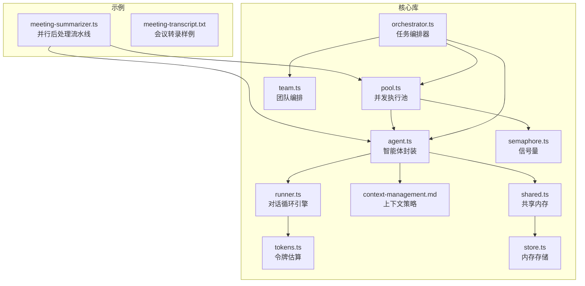
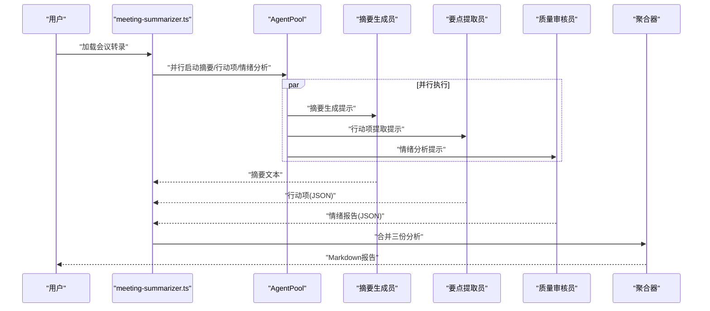
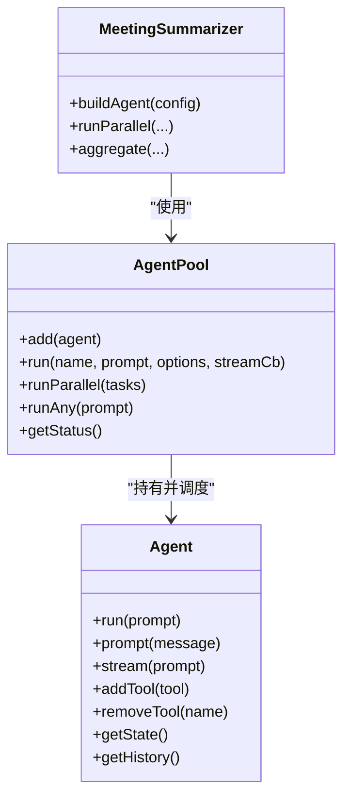
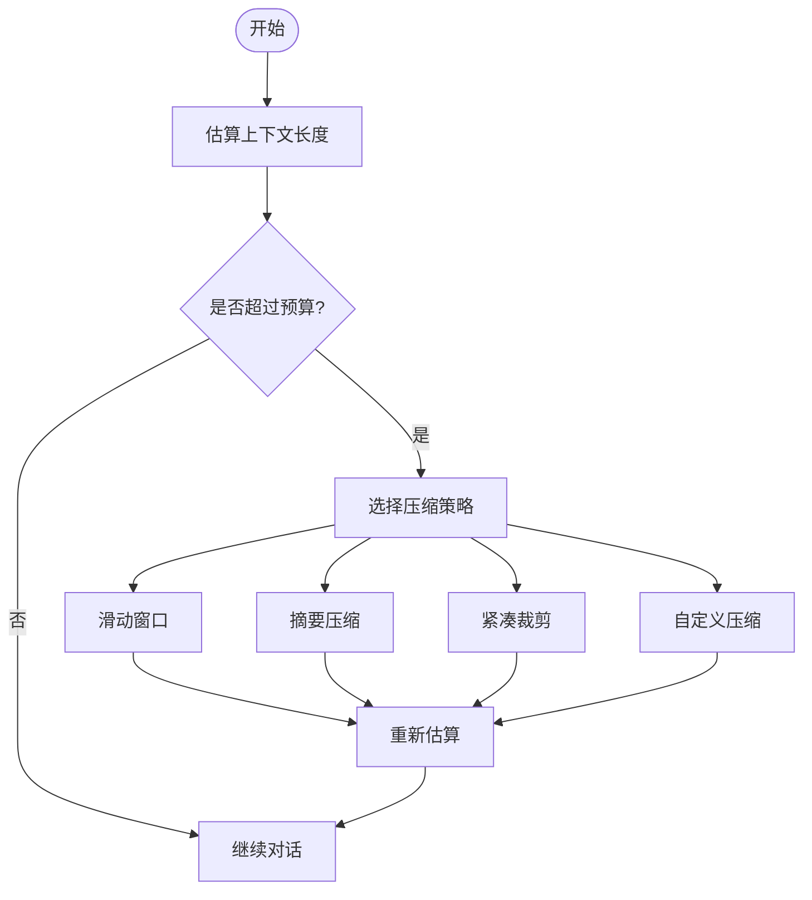
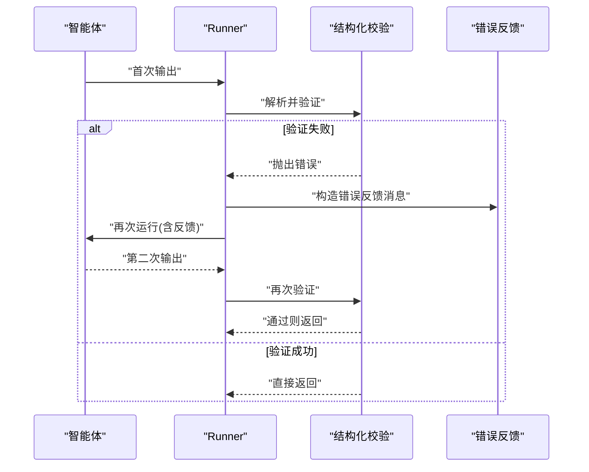
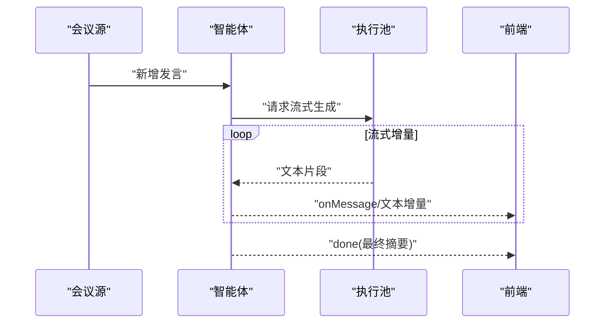
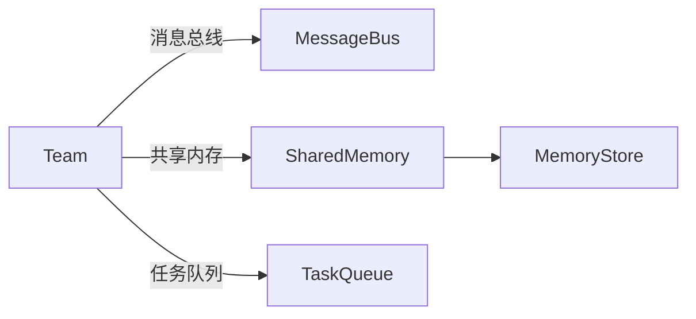
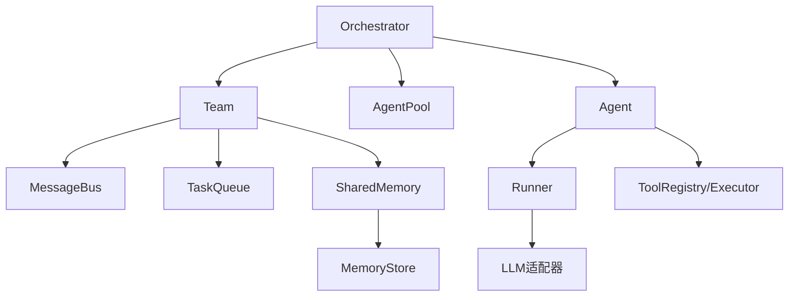

# 会议摘要生成器

<cite>
**本文引用的文件**
- [examples/cookbook/meeting-summarizer.ts](file://examples/cookbook/meeting-summarizer.ts)
- [examples/fixtures/meeting-transcript.txt](file://examples/fixtures/meeting-transcript.txt)
- [src/team/team.ts](file://src/team/team.ts)
- [src/agent/agent.ts](file://src/agent/agent.ts)
- [src/agent/pool.ts](file://src/agent/pool.ts)
- [src/agent/runner.ts](file://src/agent/runner.ts)
- [src/orchestrator/orchestrator.ts](file://src/orchestrator/orchestrator.ts)
- [src/utils/tokens.ts](file://src/utils/tokens.ts)
- [docs/context-management.md](file://docs/context-management.md)
- [src/memory/shared.ts](file://src/memory/shared.ts)
- [src/memory/store.ts](file://src/memory/store.ts)
- [src/utils/semaphore.ts](file://src/utils/semaphore.ts)
</cite>

## 目录
1. [简介](#简介)
2. [项目结构](#项目结构)
3. [核心组件](#核心组件)
4. [架构总览](#架构总览)
5. [详细组件分析](#详细组件分析)
6. [依赖关系分析](#依赖关系分析)
7. [性能考量](#性能考量)
8. [故障排查指南](#故障排查指南)
9. [结论](#结论)
10. [附录](#附录)

## 简介
本文件面向“会议摘要生成器”的使用者与维护者，系统性阐述如何基于多智能体协作模式自动处理会议记录并生成结构化摘要。文档覆盖以下关键主题：
- 智能体角色分配：转录分析员、要点提取员、摘要生成员、质量审核员
- 长文本输入处理：上下文窗口管理与分段策略
- 质量控制机制：关键信息提取、风险评估、行动项识别
- 会议转录预处理与格式标准化
- 实时流式处理：边会话边输出的即时摘要更新
- 性能优化与资源消耗分析

## 项目结构
该仓库采用模块化设计，围绕“智能体（Agent）—团队（Team）—编排器（Orchestrator）—执行池（AgentPool）”的层次组织代码。示例中提供了完整的会议摘要生成流程，演示了并行专用智能体与聚合器的协同工作方式。

**图表来源**
- [examples/cookbook/meeting-summarizer.ts:1-285](file://examples/cookbook/meeting-summarizer.ts#L1-L285)
- [src/agent/agent.ts:1-670](file://src/agent/agent.ts#L1-L670)
- [src/agent/runner.ts:1-200](file://src/agent/runner.ts#L1-L200)
- [src/agent/pool.ts:1-370](file://src/agent/pool.ts#L1-L370)
- [src/team/team.ts:1-346](file://src/team/team.ts#L1-L346)
- [src/orchestrator/orchestrator.ts:1-800](file://src/orchestrator/orchestrator.ts#L1-L800)
- [docs/context-management.md:1-65](file://docs/context-management.md#L1-L65)
- [src/utils/tokens.ts:1-30](file://src/utils/tokens.ts#L1-L30)
- [src/memory/shared.ts:1-334](file://src/memory/shared.ts#L1-L334)
- [src/memory/store.ts:1-149](file://src/memory/store.ts#L1-L149)
- [src/utils/semaphore.ts:1-95](file://src/utils/semaphore.ts#L1-L95)

**章节来源**
- [examples/cookbook/meeting-summarizer.ts:1-285](file://examples/cookbook/meeting-summarizer.ts#L1-L285)
- [src/team/team.ts:1-346](file://src/team/team.ts#L1-L346)
- [src/agent/agent.ts:1-670](file://src/agent/agent.ts#L1-L670)
- [src/agent/pool.ts:1-370](file://src/agent/pool.ts#L1-L370)
- [src/orchestrator/orchestrator.ts:1-800](file://src/orchestrator/orchestrator.ts#L1-L800)

## 核心组件
- 智能体（Agent）
  - 提供一次性运行、持续对话、流式输出能力；内置结构化输出校验与钩子扩展点。
  - 支持工具注册、动态增删工具、历史消息持久化。
- 执行池（AgentPool）
  - 基于信号量的并发控制，避免同实例竞态；支持轮询派发与并行派发。
- 团队（Team）
  - 统一管理代理名单、消息总线、任务队列与可选共享内存；提供事件总线与任务生命周期管理。
- 编排器（Orchestrator）
  - 将高层目标分解为任务，调度执行，支持重试、预算控制、可观测性与代理委托。
- 上下文管理
  - 提供滑动窗口、摘要压缩、紧凑裁剪与自定义压缩策略，配合工具结果压缩与工具输出截断。
- 共享内存（SharedMemory）
  - 团队级键值存储，按代理命名空间隔离，支持过期轮次控制与摘要视图注入。

**章节来源**
- [src/agent/agent.ts:197-394](file://src/agent/agent.ts#L197-L394)
- [src/agent/pool.ts:58-191](file://src/agent/pool.ts#L58-L191)
- [src/team/team.ts:88-346](file://src/team/team.ts#L88-L346)
- [src/orchestrator/orchestrator.ts:561-800](file://src/orchestrator/orchestrator.ts#L561-L800)
- [docs/context-management.md:1-65](file://docs/context-management.md#L1-L65)
- [src/memory/shared.ts:1-334](file://src/memory/shared.ts#L1-L334)

## 架构总览
会议摘要生成采用“并行专用分析 + 聚合报告”的流水线模式：
- 输入：会议转录文本
- 并行阶段：三个专用智能体分别产出摘要、行动项、情绪分析
- 聚合阶段：聚合器将三类结果合并为统一的Markdown报告
- 输出：结构化报告与令牌用量统计

**图表来源**
- [examples/cookbook/meeting-summarizer.ts:131-246](file://examples/cookbook/meeting-summarizer.ts#L131-L246)
- [src/agent/pool.ts:230-257](file://src/agent/pool.ts#L230-L257)

**章节来源**
- [examples/cookbook/meeting-summarizer.ts:131-246](file://examples/cookbook/meeting-summarizer.ts#L131-L246)

## 详细组件分析

### 智能体角色与职责
- 转录分析员（摘要生成员）
  - 角色：从会议转录生成三段式摘要（议程、决策、背景与风险）
  - 行为：一次性运行，温度较低以提升稳定性
- 要点提取员（行动项提取员）
  - 角色：抽取明确的任务、负责人与到期日
  - 行为：结构化输出（Zod Schema），失败时自动重试一次
- 质量审核员（情绪分析员）
  - 角色：分析每位发言者的情绪倾向与证据
  - 行为：结构化输出（Zod Schema），失败时自动重试一次
- 质量审核员（聚合器）
  - 角色：将摘要、行动项、情绪报告整合为统一Markdown报告
  - 行为：一次性运行，严格遵循标题层级与表格规范

**图表来源**
- [src/agent/agent.ts:94-670](file://src/agent/agent.ts#L94-L670)
- [src/agent/pool.ts:58-370](file://src/agent/pool.ts#L58-L370)
- [examples/cookbook/meeting-summarizer.ts:131-246](file://examples/cookbook/meeting-summarizer.ts#L131-L246)

**章节来源**
- [examples/cookbook/meeting-summarizer.ts:64-125](file://examples/cookbook/meeting-summarizer.ts#L64-L125)
- [src/agent/agent.ts:437-516](file://src/agent/agent.ts#L437-L516)

### 长文本输入与上下文窗口管理
- 上下文策略
  - 滑动窗口：保留最近N轮对话
  - 摘要压缩：用旧回合摘要替换原文本
  - 紧凑裁剪：规则化缩短大文本块，保留近期回合
  - 自定义压缩：提供压缩函数
- 工具结果压缩
  - 对已消费的工具结果进行标记压缩，降低上下文占用
- 工具输出截断
  - 在进入对话前对工具输出进行头尾截断，避免超限
- 令牌估算
  - 基于字符启发式估算令牌数，便于预算控制

**图表来源**
- [docs/context-management.md:17-65](file://docs/context-management.md#L17-L65)
- [src/utils/tokens.ts:7-29](file://src/utils/tokens.ts#L7-L29)
- [src/agent/runner.ts:525-553](file://src/agent/runner.ts#L525-L553)

**章节来源**
- [docs/context-management.md:1-65](file://docs/context-management.md#L1-L65)
- [src/utils/tokens.ts:1-30](file://src/utils/tokens.ts#L1-L30)
- [src/agent/runner.ts:525-553](file://src/agent/runner.ts#L525-L553)

### 质量控制机制
- 结构化输出与二次校验
  - 配置输出Schema后，首次解析失败将自动追加错误反馈并重试一次
- 令牌预算与超支保护
  - 运行过程中累计输入/输出令牌，超过预算时触发保护事件
- 重试与退避
  - 任务级重试支持指数退避，最大延迟上限
- 循环检测
  - 可配置循环检测，避免无意义的重复对话

**图表来源**
- [src/agent/agent.ts:437-516](file://src/agent/agent.ts#L437-L516)
- [src/orchestrator/orchestrator.ts:266-333](file://src/orchestrator/orchestrator.ts#L266-L333)

**章节来源**
- [src/agent/agent.ts:437-516](file://src/agent/agent.ts#L437-L516)
- [src/orchestrator/orchestrator.ts:266-333](file://src/orchestrator/orchestrator.ts#L266-L333)

### 会议转录预处理与格式标准化
- 输入来源
  - 示例使用固定路径的转录文件作为输入
- 建议的预处理步骤
  - 文本清洗：去除多余空白、统一换行
  - 标准化说话人标识：统一“姓名: 内容”格式
  - 分段与分页：按时间戳或发言人切换切分，便于后续分段处理
  - 令牌预算预留：为摘要与聚合留足上下文空间
- 与上下文策略结合
  - 对超长转录启用“摘要压缩”或“紧凑裁剪”，避免超限

**章节来源**
- [examples/cookbook/meeting-summarizer.ts:29-32](file://examples/cookbook/meeting-summarizer.ts#L29-L32)
- [docs/context-management.md:17-65](file://docs/context-management.md#L17-L65)

### 实时流式处理与即时摘要更新
- 流式接口
  - 智能体提供流式生成接口，逐字/逐片段推送文本增量
- 回调与可观测性
  - 支持在流式回调中注入追踪事件，便于前端渲染与调试
- 并发与背压
  - 执行池通过信号量控制并发，避免资源争用导致的抖动
- 应用建议
  - 在会议进行时，将每条新发言追加到上下文并触发流式生成，前端以滚动方式展示增量摘要

**图表来源**
- [src/agent/agent.ts:245-251](file://src/agent/agent.ts#L245-L251)
- [src/agent/pool.ts:152-191](file://src/agent/pool.ts#L152-L191)

**章节来源**
- [src/agent/agent.ts:245-251](file://src/agent/agent.ts#L245-L251)
- [src/agent/pool.ts:152-191](file://src/agent/pool.ts#L152-L191)

### 团队协作与共享记忆
- 团队消息总线
  - 支持点对点与广播消息，便于跨智能体协作
- 共享内存
  - 按代理命名空间写入/读取中间结果，支持过期轮次控制
- 任务队列与调度
  - 依赖感知的任务调度，失败不阻塞其他任务

**图表来源**
- [src/team/team.ts:181-212](file://src/team/team.ts#L181-L212)
- [src/memory/shared.ts:1-334](file://src/memory/shared.ts#L1-L334)
- [src/memory/store.ts:31-149](file://src/memory/store.ts#L31-L149)

**章节来源**
- [src/team/team.ts:181-212](file://src/team/team.ts#L181-L212)
- [src/memory/shared.ts:1-334](file://src/memory/shared.ts#L1-L334)
- [src/memory/store.ts:31-149](file://src/memory/store.ts#L31-L149)

## 依赖关系分析
- 组件耦合
  - AgentPool与Agent之间通过信号量与互斥锁解耦，避免竞态
  - Agent依赖Runner与工具执行器，Runner依赖LLM适配器与上下文策略
  - Orchestrator协调Team、TaskQueue、Scheduler与AgentPool
- 外部依赖
  - LLM适配器（Anthropic等）由Runner内部创建
  - 工具注册与执行通过ToolRegistry/ToolExecutor完成
- 循环依赖
  - 未发现直接循环依赖；各层职责清晰

**图表来源**
- [src/orchestrator/orchestrator.ts:61-71](file://src/orchestrator/orchestrator.ts#L61-L71)
- [src/team/team.ts:104-106](file://src/team/team.ts#L104-L106)
- [src/agent/agent.ts:139-191](file://src/agent/agent.ts#L139-L191)
- [src/agent/runner.ts:15-42](file://src/agent/runner.ts#L15-L42)
- [src/memory/shared.ts:11](file://src/memory/shared.ts#L11)

**章节来源**
- [src/orchestrator/orchestrator.ts:61-71](file://src/orchestrator/orchestrator.ts#L61-L71)
- [src/team/team.ts:104-106](file://src/team/team.ts#L104-L106)
- [src/agent/agent.ts:139-191](file://src/agent/agent.ts#L139-L191)
- [src/agent/runner.ts:15-42](file://src/agent/runner.ts#L15-L42)
- [src/memory/shared.ts:11](file://src/memory/shared.ts#L11)

## 性能考量
- 并行度与吞吐
  - 使用AgentPool限制并发，避免LLM与工具调用成为瓶颈
  - 并行专用分析显著缩短总耗时，示例中对比串行与并行的耗时
- 令牌预算与成本控制
  - 通过上下文策略与工具输出截断减少输入长度
  - 累计令牌用量用于成本归集与告警
- 资源竞争与死锁规避
  - 同一Agent实例使用互斥锁，池内使用信号量，避免竞态
  - 委托调用使用临时Agent实例，绕开互斥锁死锁
- 建议
  - 根据模型上下文长度调整策略
  - 对长转录启用摘要压缩或分段处理
  - 控制并发度与重试次数，平衡速度与成本

**章节来源**
- [examples/cookbook/meeting-summarizer.ts:165-221](file://examples/cookbook/meeting-summarizer.ts#L165-L221)
- [src/agent/pool.ts:68-88](file://src/agent/pool.ts#L68-L88)
- [src/orchestrator/orchestrator.ts:733-747](file://src/orchestrator/orchestrator.ts#L733-L747)

## 故障排查指南
- 结构化输出失败
  - 现象：智能体返回非JSON或不符合Schema
  - 处理：自动追加错误反馈并重试；检查Schema与提示词
- 令牌预算超限
  - 现象：累计令牌超过阈值，停止后续任务
  - 处理：降低并发、启用更激进的上下文策略、缩短提示词
- 代理不可用或名称错误
  - 现象：找不到代理或代理未注册
  - 处理：确认代理名称与注册顺序一致
- 流式回调异常
  - 现象：回调抛错导致重试浪费
  - 处理：确保回调内部捕获异常，不影响主流程

**章节来源**
- [src/agent/agent.ts:437-516](file://src/agent/agent.ts#L437-L516)
- [src/orchestrator/orchestrator.ts:733-747](file://src/orchestrator/orchestrator.ts#L733-L747)
- [src/agent/pool.ts:343-352](file://src/agent/pool.ts#L343-L352)

## 结论
本方案通过“并行专用分析 + 聚合报告”的多智能体协作模式，实现了对会议转录的自动化处理与高质量摘要生成。借助上下文管理、结构化输出校验、令牌预算控制与流式接口，系统在准确性、稳定性与性能之间取得良好平衡。建议在生产环境中结合分段策略、并发控制与可观测性指标，持续优化成本与响应时间。

## 附录
- 快速开始
  - 安装依赖后运行示例脚本，准备环境变量（如API密钥）
  - 准备会议转录文件，确保说话人与内容格式规范
- 最佳实践
  - 长转录优先采用“摘要压缩”策略
  - 为每个智能体设置合适的温度与最大轮次
  - 在前端集成流式回调，实现边会话边更新的体验