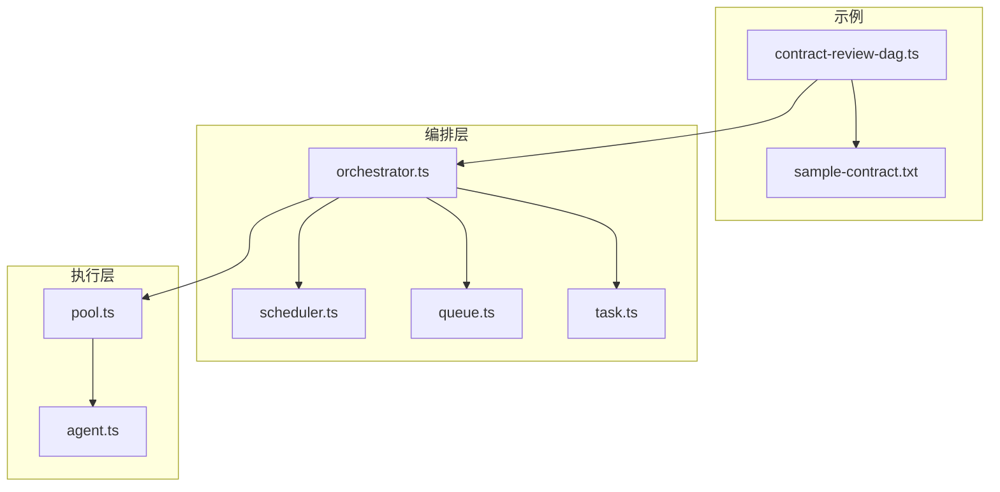
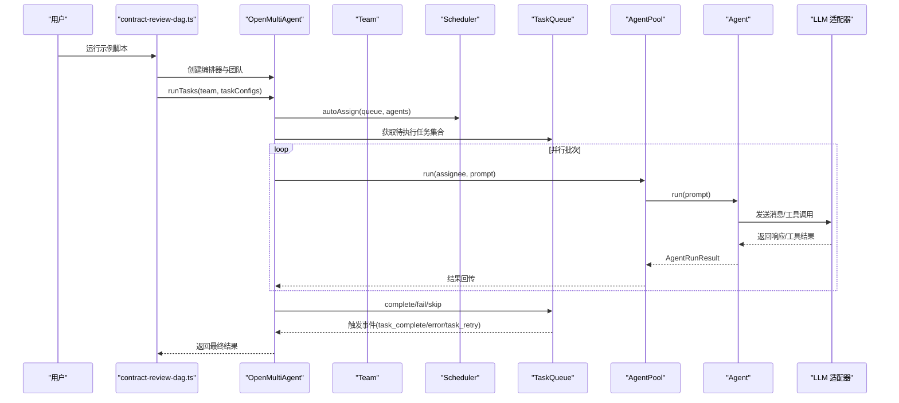
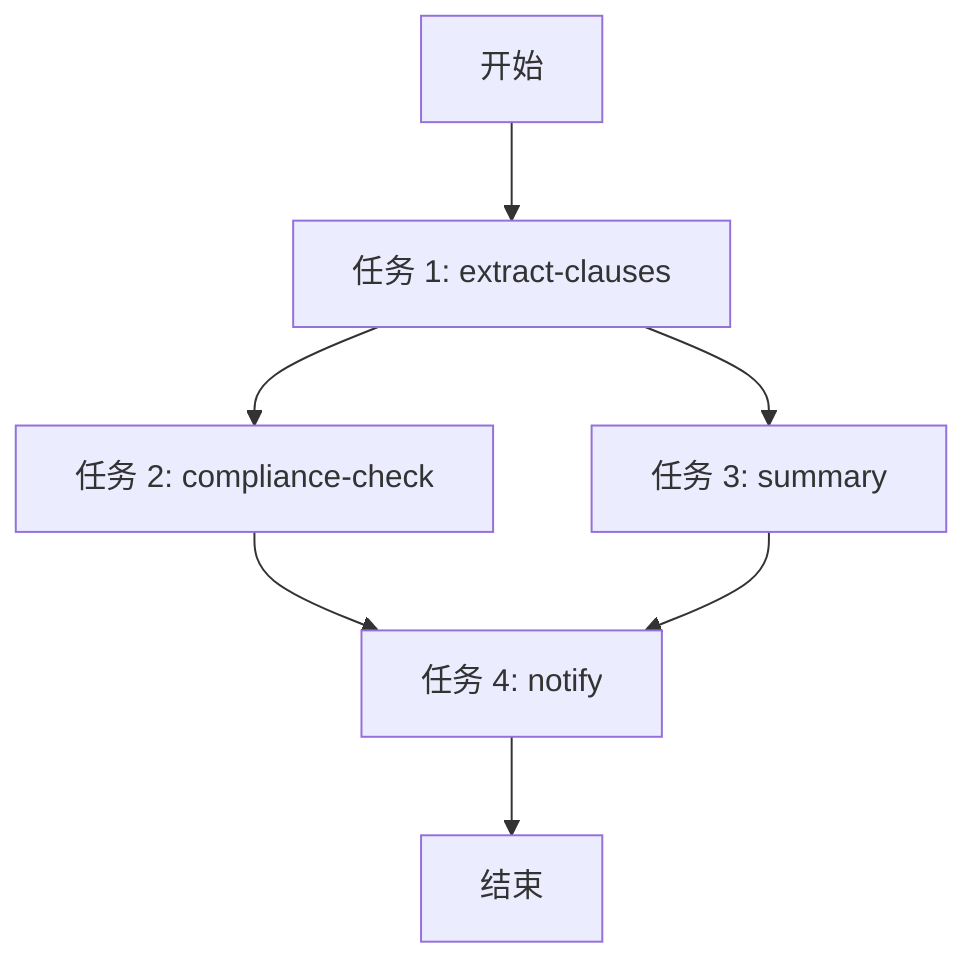
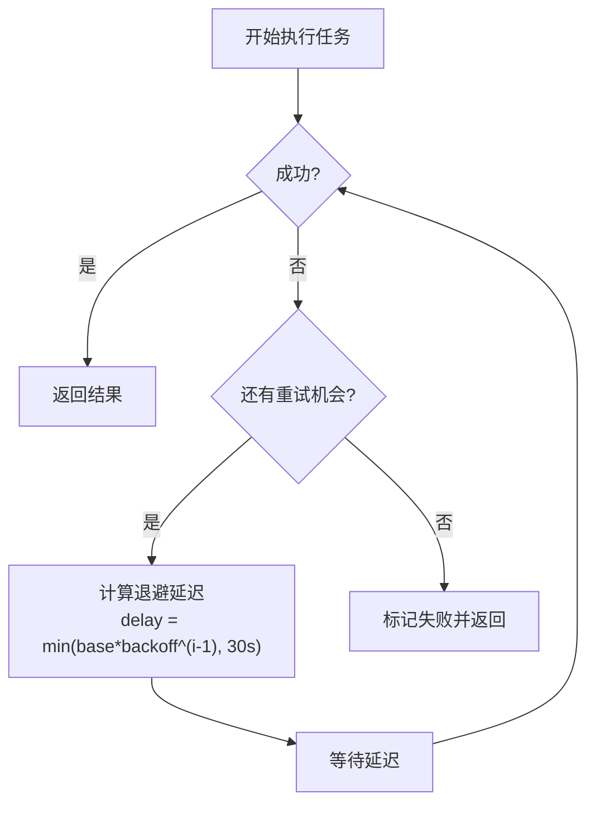
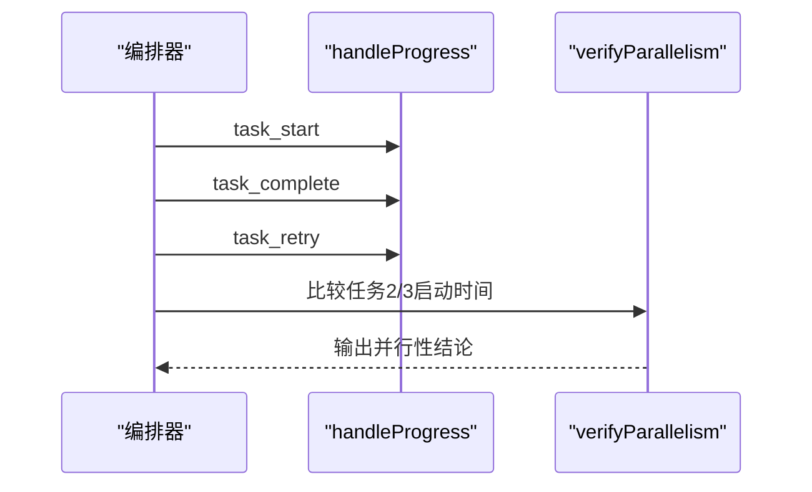
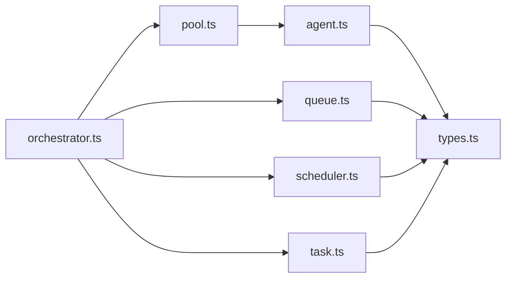

# 合同审查 DAG

<cite>
**本文引用的文件**
- [contract-review-dag.ts](file://examples/cookbook/contract-review-dag.ts)
- [sample-contract.txt](file://examples/fixtures/sample-contract.txt)
- [orchestrator.ts](file://src/orchestrator/orchestrator.ts)
- [scheduler.ts](file://src/orchestrator/scheduler.ts)
- [task.ts](file://src/task/task.ts)
- [queue.ts](file://src/task/queue.ts)
- [agent.ts](file://src/agent/agent.ts)
- [pool.ts](file://src/agent/pool.ts)
- [types.ts](file://src/types.ts)
- [task-retry.test.ts](file://tests/task-retry.test.ts)
- [agent-pool.test.ts](file://tests/agent-pool.test.ts)
</cite>

## 目录
1. [简介](#简介)
2. [项目结构](#项目结构)
3. [核心组件](#核心组件)
4. [架构总览](#架构总览)
5. [详细组件分析](#详细组件分析)
6. [依赖分析](#依赖分析)
7. [性能考量](#性能考量)
8. [故障排查指南](#故障排查指南)
9. [结论](#结论)
10. [附录](#附录)

## 简介
本示例演示了基于有向无环图（DAG）的任务编排模式，用于构建复杂的多步骤合同审查工作流。该工作流包含四个智能体（代理）：
- 条款提取器：从合同文本中抽取条款并输出结构化 JSON
- 合规性检查器：对每个条款进行合规性审核与风险分类
- 摘要生成器：基于条款列表生成高层摘要
- 通知发送器：整合合规结果与摘要，生成最终报告

工作流采用并行执行机制：在任务 1 完成后，任务 2（合规性检查）与任务 3（摘要生成）并行启动；当两者均完成后，任务 4（通知发送）再开始。系统内置步骤级重试机制，支持指数退避策略，并提供进度跟踪、时间统计与并行性验证功能。此外，通过 FORCE_FAIL 环境变量可注入故障以测试重试与失败处理。

## 项目结构
示例位于 examples/cookbook 目录下，核心文件如下：
- contract-review-dag.ts：示例入口，定义四个智能体配置、任务依赖、重试策略、进度回调与并行性验证
- sample-contract.txt：示例合同文本，作为任务输入
- 核心框架位于 src 目录：
  - orchestrator.ts：编排器主实现，包含任务队列、调度器、并发池、重试与追踪
  - scheduler.ts：任务调度策略（轮转、最少忙碌、能力匹配、关键路径优先）
  - task.ts：任务工厂与依赖关系工具函数（拓扑排序、就绪判断、依赖校验）
  - queue.ts：依赖感知的任务队列，支持事件驱动的状态流转
  - agent.ts：智能体封装，负责对话历史、工具执行与结构化输出
  - pool.ts：代理池，控制并发与串行化同一代理实例的多次调用
  - types.ts：公共类型定义（任务、代理、运行结果、事件等）

图表来源
- [contract-review-dag.ts:1-369](file://examples/cookbook/contract-review-dag.ts#L1-L369)
- [orchestrator.ts:1-800](file://src/orchestrator/orchestrator.ts#L1-L800)
- [scheduler.ts:1-322](file://src/orchestrator/scheduler.ts#L1-L322)
- [queue.ts:1-470](file://src/task/queue.ts#L1-L470)
- [task.ts:1-242](file://src/task/task.ts#L1-L242)
- [agent.ts:1-670](file://src/agent/agent.ts#L1-L670)
- [pool.ts:1-370](file://src/agent/pool.ts#L1-L370)

章节来源
- [contract-review-dag.ts:1-369](file://examples/cookbook/contract-review-dag.ts#L1-L369)

## 核心组件
- 智能体配置（四个 AgentConfig）：分别定义系统提示词、模型、温度、最大轮次与前置钩子（beforeRun），其中合规性检查器使用 FORCE_FAIL 注入机制进行故障注入测试。
- 任务配置（四个 TaskConfig）：定义标题、描述、负责人（assignee）、依赖（dependsOn）以及步骤级重试参数（maxRetries、retryDelayMs、retryBackoff）。
- 编排器（OpenMultiAgent）：创建团队、注册四个智能体、设置共享内存、配置进度回调与追踪。
- 任务队列（TaskQueue）：根据依赖关系自动推进状态，支持“就绪”、“完成”、“失败”、“跳过”等事件。
- 调度器（Scheduler）：提供四种策略（轮转、最少忙碌、能力匹配、关键路径优先），默认使用“关键路径优先”以确保复杂管线的稳定性。
- 并发池（AgentPool）：通过信号量限制全局并发，同时为同一代理实例加锁，避免竞态。
- 步骤级重试（executeWithRetry）：在任务执行失败或返回失败结果时，按指数退避策略重试，最多尝试 maxRetries+1 次，并累计 token 使用量。

章节来源
- [contract-review-dag.ts:48-124](file://examples/cookbook/contract-review-dag.ts#L48-L124)
- [contract-review-dag.ts:275-308](file://examples/cookbook/contract-review-dag.ts#L275-L308)
- [orchestrator.ts:266-333](file://src/orchestrator/orchestrator.ts#L266-L333)
- [queue.ts:55-470](file://src/task/queue.ts#L55-L470)
- [scheduler.ts:96-322](file://src/orchestrator/scheduler.ts#L96-L322)
- [pool.ts:58-370](file://src/agent/pool.ts#L58-L370)
- [orchestrator.ts:266-333](file://src/orchestrator/orchestrator.ts#L266-L333)

## 架构总览
下图展示了从示例入口到底层执行的完整调用链路与数据流。

图表来源
- [contract-review-dag.ts:320-368](file://examples/cookbook/contract-review-dag.ts#L320-L368)
- [orchestrator.ts:561-787](file://src/orchestrator/orchestrator.ts#L561-L787)
- [queue.ts:131-178](file://src/task/queue.ts#L131-L178)
- [pool.ts:147-191](file://src/agent/pool.ts#L147-L191)
- [agent.ts:205-409](file://src/agent/agent.ts#L205-L409)

## 详细组件分析

### 工作流与任务依赖设计
- DAG 结构：
  - 任务 1（extract-clauses）：独立任务，负责抽取条款
  - 任务 2（compliance-check）与任务 3（summary）：均依赖任务 1，完成后并行执行
  - 任务 4（notify）：依赖任务 2 与任务 3，二者均完成后才执行
- 依赖解析算法：
  - isTaskReady：判断任务是否满足所有依赖（依赖任务必须为 completed）
  - getTaskDependencyOrder：使用拓扑排序保证依赖顺序
  - validateTaskDependencies：检测未知依赖、自依赖与环形依赖
- 并行执行机制：
  - executeQueue 中每轮从队列取出所有 pending 任务，统一并发派发
  - 通过 AgentPool 的信号量与代理锁，确保并发安全与串行化同一代理实例

图表来源
- [contract-review-dag.ts:275-308](file://examples/cookbook/contract-review-dag.ts#L275-L308)
- [task.ts:78-94](file://src/task/task.ts#L78-L94)
- [task.ts:117-162](file://src/task/task.ts#L117-L162)
- [task.ts:186-242](file://src/task/task.ts#L186-L242)

章节来源
- [contract-review-dag.ts:275-308](file://examples/cookbook/contract-review-dag.ts#L275-L308)
- [task.ts:78-94](file://src/task/task.ts#L78-L94)
- [task.ts:117-162](file://src/task/task.ts#L117-L162)
- [task.ts:186-242](file://src/task/task.ts#L186-L242)

### 四个智能体的分工与职责
- 条款提取器（extractor）：将合同文本解析为结构化条款数组，包含 id、标题、内容与风险等级
- 合规性检查器（compliance-checker）：逐条检查合规性，输出是否合规、问题列表与风险类别
- 摘要生成器（summarizer）：基于条款列表生成高层摘要，涵盖合同概览、关键要点、风险提示与建议
- 通知发送器（notifier）：整合合规结果与摘要，输出最终 Markdown 报告

章节来源
- [contract-review-dag.ts:49-124](file://examples/cookbook/contract-review-dag.ts#L49-L124)

### 步骤级重试机制与指数退避
- 重试触发条件：任务返回失败结果或抛出异常
- 重试策略：
  - 最大尝试次数：maxRetries + 1（含首次）
  - 基础延迟：retryDelayMs（毫秒）
  - 指数退避：delay = min(baseDelay * backoff^(attempt-1), MAX_RETRY_DELAY_MS)
  - 最大延迟上限：30 秒
- 执行流程：
  - executeWithRetry 包装 pool.run，捕获异常与失败结果
  - 在每次重试前发出 task_retry 事件，记录尝试次数、最大次数与下次延迟
  - 累计 token 使用量，确保计费与可观测性准确
- 测试覆盖：
  - 计算延迟、上限、常数退避、负值处理、异常与成功场景

图表来源
- [orchestrator.ts:266-333](file://src/orchestrator/orchestrator.ts#L266-L333)
- [task-retry.test.ts:37-49](file://tests/task-retry.test.ts#L37-L49)
- [task-retry.test.ts:107-156](file://tests/task-retry.test.ts#L107-L156)
- [task-retry.test.ts:198-222](file://tests/task-retry.test.ts#L198-L222)

章节来源
- [orchestrator.ts:241-253](file://src/orchestrator/orchestrator.ts#L241-L253)
- [orchestrator.ts:266-333](file://src/orchestrator/orchestrator.ts#L266-L333)
- [task-retry.test.ts:81-197](file://tests/task-retry.test.ts#L81-L197)

### 进度跟踪、时间统计与并行性验证
- 进度跟踪：
  - handleProgress 接收 OrchestratorEvent，记录 task_start、task_complete、task_retry、task_skipped、agent_start、agent_complete、message、error 等事件
  - 统计每个任务的开始与结束时间，计算耗时（毫秒）
- 并行性验证：
  - verifyParallelism：比较任务 2 与任务 3 的启动时间差，若小于 500ms 则视为并行执行成功
- Token 使用统计：
  - executeQueue 中累积任务 tokenUsage，支持预算超限事件与追踪

图表来源
- [contract-review-dag.ts:154-215](file://examples/cookbook/contract-review-dag.ts#L154-L215)
- [contract-review-dag.ts:221-244](file://examples/cookbook/contract-review-dag.ts#L221-L244)
- [orchestrator.ts:724-731](file://src/orchestrator/orchestrator.ts#L724-L731)

章节来源
- [contract-review-dag.ts:154-215](file://examples/cookbook/contract-review-dag.ts#L154-L215)
- [contract-review-dag.ts:221-244](file://examples/cookbook/contract-review-dag.ts#L221-L244)
- [orchestrator.ts:724-731](file://src/orchestrator/orchestrator.ts#L724-L731)

### 故障注入与 FORCE_FAIL 机制
- 机制说明：
  - 在合规性检查器的 beforeRun 钩子中，读取 FORCE_FAIL 环境变量
  - 当 attempt=1 且 FORCE_FAIL=task2 时，主动抛出错误以模拟首次失败
- 使用方式：
  - 直接运行：npx tsx examples/cookbook/contract-review-dag.ts
  - 注入故障：FORCE_FAIL=task2 npx tsx examples/cookbook/contract-review-dag.ts
- 预期行为：
  - 首次失败触发重试，后续成功；并行任务不受影响

章节来源
- [contract-review-dag.ts:39-90](file://examples/cookbook/contract-review-dag.ts#L39-L90)

### 类型与接口概览
- 任务（Task）：包含 id、title、description、status、assignee、dependsOn、memoryScope、maxRetries、retryDelayMs、retryBackoff 等字段
- 代理（AgentConfig）：包含 name、model、provider、systemPrompt、temperature、maxTurns、beforeRun、afterRun 等
- 运行结果（AgentRunResult）：包含 success、output、messages、tokenUsage、toolCalls、structured、loopDetected、budgetExceeded
- 编排事件（OrchestratorEvent）：agent_start、agent_complete、task_start、task_complete、task_retry、task_skipped、budget_exceeded、message、error

章节来源
- [types.ts:705-729](file://src/types.ts#L705-L729)
- [types.ts:368-531](file://src/types.ts#L368-L531)
- [types.ts:586-602](file://src/types.ts#L586-L602)
- [types.ts:741-755](file://src/types.ts#L741-L755)

## 依赖分析
- 组件耦合与内聚：
  - 编排器（orchestrator.ts）聚合调度器、任务队列、代理池与代理实例，内聚度高
  - 任务队列与调度器解耦，通过接口传递状态与任务快照
  - 代理池与代理解耦，通过信号量与锁保障并发安全
- 外部依赖与集成点：
  - LLM 适配器：由 Agent 内部加载，编排器不直接依赖具体提供商
  - 事件与追踪：通过 onProgress 与 onTrace 回调扩展
- 可能的循环依赖：
  - 未发现循环导入；模块间通过类型导出与单向依赖保持清晰

图表来源
- [orchestrator.ts:61-70](file://src/orchestrator/orchestrator.ts#L61-L70)
- [scheduler.ts:16-18](file://src/orchestrator/scheduler.ts#L16-L18)
- [queue.ts:9-10](file://src/task/queue.ts#L9-L10)
- [task.ts:9-10](file://src/task/task.ts#L9-L10)
- [agent.ts:39-53](file://src/agent/agent.ts#L39-L53)
- [types.ts:8-9](file://src/types.ts#L8-L9)

章节来源
- [orchestrator.ts:61-70](file://src/orchestrator/orchestrator.ts#L61-L70)
- [scheduler.ts:16-18](file://src/orchestrator/scheduler.ts#L16-L18)
- [queue.ts:9-10](file://src/task/queue.ts#L9-L10)
- [task.ts:9-10](file://src/task/task.ts#L9-L10)
- [agent.ts:39-53](file://src/agent/agent.ts#L39-L53)
- [types.ts:8-9](file://src/types.ts#L8-L9)

## 性能考量
- 并发控制：
  - AgentPool 默认最大并发为 5，可通过构造参数调整
  - 通过信号量限制全局并发，避免资源争用
- 代理实例串行化：
  - 同一代理实例通过 per-agent 锁串行化多次调用，避免状态竞态
- 重试与延迟：
  - 指数退避上限 30 秒，防止抖动放大
  - 重试期间仅等待，不占用额外并发槽位
- Token 预算与追踪：
  - 累计 token 使用量，支持预算超限事件与追踪
- 并行性验证：
  - 通过任务启动时间差阈值（500ms）验证并行执行效果

章节来源
- [pool.ts:76-88](file://src/agent/pool.ts#L76-L88)
- [pool.ts:147-191](file://src/agent/pool.ts#L147-L191)
- [orchestrator.ts:241-253](file://src/orchestrator/orchestrator.ts#L241-L253)
- [orchestrator.ts:724-731](file://src/orchestrator/orchestrator.ts#L724-L731)
- [contract-review-dag.ts:221-244](file://examples/cookbook/contract-review-dag.ts#L221-L244)

## 故障排查指南
- 常见问题与定位：
  - 任务卡在 blocked：检查 dependsOn 是否正确，依赖任务是否完成
  - 任务失败：查看 onProgress 中的 error 事件与任务失败原因
  - 并行未生效：确认任务 1 完成后再启动任务 2/3，verifyParallelism 输出时间差
  - FORCE_FAIL 注入：确保 FORCE_FAIL=task2 且仅在首次尝试触发
- 关键日志与指标：
  - task_start、task_complete、task_retry、task_skipped、agent_start、agent_complete
  - 任务耗时（完成时间 - 开始时间）
  - Token 使用总量（输入/输出）
- 单元测试参考：
  - 重试延迟与上限、异常与成功场景、退避策略、负值处理

章节来源
- [contract-review-dag.ts:154-215](file://examples/cookbook/contract-review-dag.ts#L154-L215)
- [contract-review-dag.ts:221-244](file://examples/cookbook/contract-review-dag.ts#L221-L244)
- [task-retry.test.ts:81-197](file://tests/task-retry.test.ts#L81-L197)
- [agent-pool.test.ts:264-321](file://tests/agent-pool.test.ts#L264-L321)

## 结论
本示例通过明确的 DAG 任务编排、并行执行与步骤级重试机制，展示了如何在多智能体环境中构建稳健的合同审查工作流。编排器、调度器、任务队列与代理池协同工作，既保证了执行效率，又提供了完善的可观测性与容错能力。FORCE_FAIL 注入测试进一步验证了重试与失败恢复的有效性。通过合理配置重试参数与并发上限，可在生产环境中获得稳定且高效的执行表现。

## 附录
- 实际运行示例：
  - 直接运行：npx tsx examples/cookbook/contract-review-dag.ts
  - 注入故障：FORCE_FAIL=task2 npx tsx examples/cookbook/contract-review-dag.ts
- 输入文件：
  - 合同文本：examples/fixtures/sample-contract.txt
- 相关测试：
  - 重试行为与延迟策略：tests/task-retry.test.ts
  - 并发与代理池行为：tests/agent-pool.test.ts