# 示例与食谱

<cite>
**本文引用的文件**
- [examples/README.md](file://examples/README.md)
- [examples/basics/single-agent.ts](file://examples/basics/single-agent.ts)
- [examples/basics/team-collaboration.ts](file://examples/basics/team-collaboration.ts)
- [examples/basics/task-pipeline.ts](file://examples/basics/task-pipeline.ts)
- [examples/patterns/fan-out-aggregate.ts](file://examples/patterns/fan-out-aggregate.ts)
- [examples/patterns/structured-output.ts](file://examples/patterns/structured-output.ts)
- [examples/cookbook/contract-review-dag.ts](file://examples/cookbook/contract-review-dag.ts)
- [examples/cookbook/meeting-summarizer.ts](file://examples/cookbook/meeting-summarizer.ts)
- [examples/cookbook/competitive-monitoring.ts](file://examples/cookbook/competitive-monitoring.ts)
- [examples/cookbook/paper-replication-triage.ts](file://examples/cookbook/paper-replication-triage.ts)
- [examples/cookbook/rare-disease-information-triage.ts](file://examples/cookbook/rare-disease-information-triage.ts)
- [examples/cookbook/personalized-interview-simulator.ts](file://examples/cookbook/personalized-interview-simulator.ts)
- [examples/cookbook/incident-postmortem-dag.ts](file://examples/cookbook/incident-postmortem-dag.ts)
- [examples/cookbook/narrative-puzzle-hint-arbitration.ts](file://examples/cookbook/narrative-puzzle-hint-arbitration.ts)
- [examples/cookbook/translation-backtranslation.ts](file://examples/cookbook/translation-backtranslation.ts)
</cite>

## 目录
1. [简介](#简介)
2. [项目结构](#项目结构)
3. [核心组件](#核心组件)
4. [架构总览](#架构总览)
5. [详细组件分析](#详细组件分析)
6. [依赖关系分析](#依赖关系分析)
7. [性能考量](#性能考量)
8. [故障排除指南](#故障排除指南)
9. [结论](#结论)
10. [附录](#附录)

## 简介
本“示例与食谱”文档系统化梳理 Open Multi-Agent 框架在真实世界中的端到端工作流范式，覆盖合同审查 DAG、会议摘要生成、竞争监测、论文复现分流、罕见疾病信息分流、个性化面试模拟器、翻译回译等典型场景。每个示例均提供：
- 完整的执行步骤与配置说明
- 可运行的命令与前置条件
- 关键数据流与处理逻辑
- 可复用的模式（如并行扇出/聚合、结构化输出、任务编排）
- 性能与成本估算思路
- 故障排除与常见问题

目标是帮助读者从基础示例逐步进阶，理解如何将这些范式组合为自定义应用。

## 项目结构
示例按用途分层组织：
- basics：基础执行模式（单代理、团队协作、任务流水线、多模型团队）
- patterns：可复用的编排模式（并行扇出/聚合、结构化输出、重试、手递手等）
- cookbook：面向具体业务问题的完整食谱（端到端工作流）
- integrations：与外部系统的集成（可观测性、MCP、Vercel AI SDK、Express 客服）

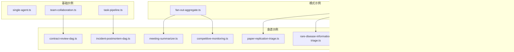

图示来源
- [examples/basics/team-collaboration.ts:103-114](file://examples/basics/team-collaboration.ts#L103-L114)
- [examples/basics/task-pipeline.ts:100-110](file://examples/basics/task-pipeline.ts#L100-L110)
- [examples/patterns/fan-out-aggregate.ts:107-111](file://examples/patterns/fan-out-aggregate.ts#L107-L111)
- [examples/patterns/structured-output.ts:17-43](file://examples/patterns/structured-output.ts#L17-L43)

章节来源
- [examples/README.md:1-100](file://examples/README.md#L1-L100)

## 核心组件
- OpenMultiAgent：统一的编排器，支持 runAgent/runTeam/runTasks 等入口，事件回调 onProgress，共享内存与并发控制。
- Agent：单代理执行单元，支持 stream 流式输出、prompt 多轮对话、工具注册与执行。
- AgentPool：并行执行池，适合扇出/聚合模式。
- Team：由多个 Agent 组成的团队，支持共享内存、并发度控制。
- Task/TaskQueue：显式任务编排，支持依赖链、作用域上下文、重试策略。
- Structured Output：通过 Zod Schema 对齐 LLM 输出，失败时自动重试一次。

章节来源
- [examples/basics/single-agent.ts:21-49](file://examples/basics/single-agent.ts#L21-L49)
- [examples/basics/team-collaboration.ts:103-128](file://examples/basics/team-collaboration.ts#L103-L128)
- [examples/basics/task-pipeline.ts:100-182](file://examples/basics/task-pipeline.ts#L100-L182)
- [examples/patterns/fan-out-aggregate.ts:107-167](file://examples/patterns/fan-out-aggregate.ts#L107-L167)
- [examples/patterns/structured-output.ts:25-43](file://examples/patterns/structured-output.ts#L25-L43)

## 架构总览
下图展示从“单代理/团队/任务”到“模式/食谱”的演进路径，以及关键交互点（事件回调、共享内存、结构化输出）：

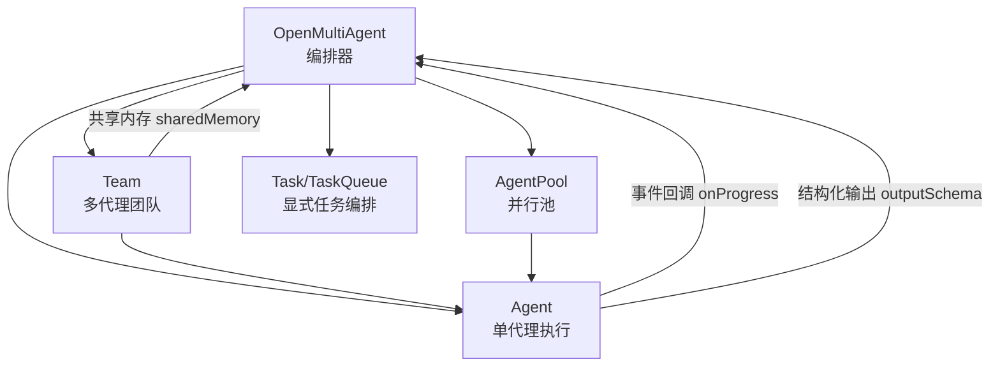

图示来源
- [examples/basics/single-agent.ts:21-49](file://examples/basics/single-agent.ts#L21-L49)
- [examples/basics/team-collaboration.ts:103-128](file://examples/basics/team-collaboration.ts#L103-L128)
- [examples/basics/task-pipeline.ts:100-182](file://examples/basics/task-pipeline.ts#L100-L182)
- [examples/patterns/fan-out-aggregate.ts:107-167](file://examples/patterns/fan-out-aggregate.ts#L107-L167)
- [examples/patterns/structured-output.ts:25-43](file://examples/patterns/structured-output.ts#L25-L43)

## 详细组件分析

### 合同审查 DAG（Step-Level Retry）
- 场景：合同审查流水线，四阶段 DAG（提取 → 并行合规检查/摘要 → 通知报告），支持每步重试与并行验证。
- 关键点：
  - 使用 runTasks 定义任务依赖与重试参数（指数退避）。
  - FORCE_FAIL 环境变量用于触发特定步骤失败，验证重试机制。
  - 通过 onProgress 记录任务起止时间，断言并行执行窗口。
  - 共享内存传递上游 JSON 结果给下游合成者。
- 运行方式：直接运行脚本；或设置 FORCE_FAIL=task2 触发第一步重试。
- 配置要点：各 Agent 的 systemPrompt、maxTurns、temperature；任务的 dependsOn、maxRetries、retryDelayMs、retryBackoff。

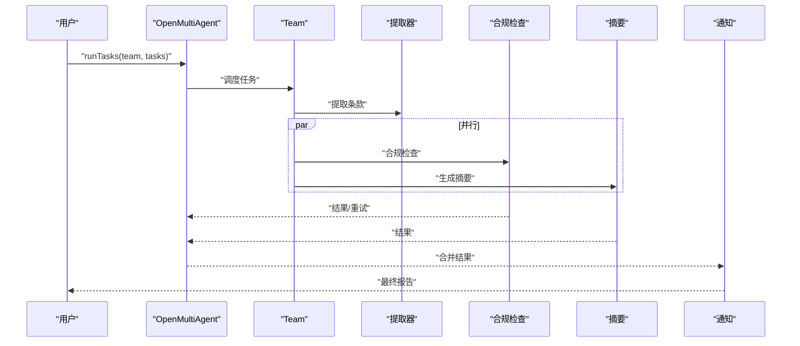

图示来源
- [examples/cookbook/contract-review-dag.ts:250-324](file://examples/cookbook/contract-review-dag.ts#L250-L324)

章节来源
- [examples/cookbook/contract-review-dag.ts:1-369](file://examples/cookbook/contract-review-dag.ts#L1-L369)

### 会议摘要生成（并行后处理）
- 场景：同一份会议记录，三个专用代理并行抽取摘要、行动项、情绪，再由聚合器合成报告。
- 关键点：
  - 使用 AgentPool.runParallel 实现三路并行。
  - 结构化输出（Zod）保证行动项与情绪报告格式一致。
  - 断言并行速度提升（并行耗时应显著小于串行之和）。
  - 支持手动计费与令牌统计。
- 运行方式：直接运行脚本。
- 配置要点：每个代理的 systemPrompt、outputSchema、maxTurns、temperature。

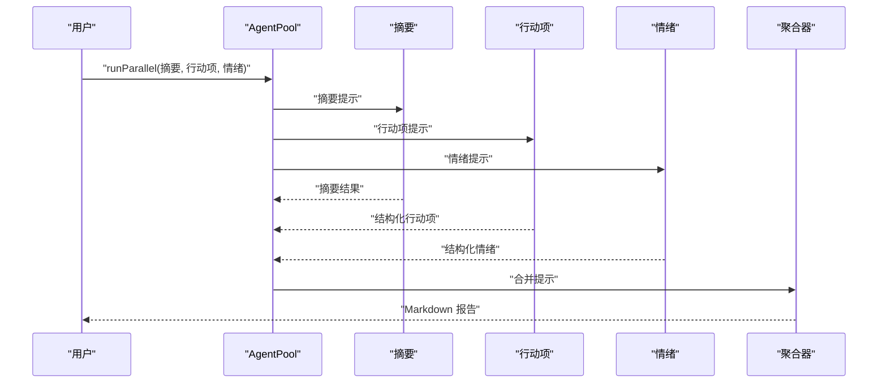

图示来源
- [examples/cookbook/meeting-summarizer.ts:166-241](file://examples/cookbook/meeting-summarizer.ts#L166-L241)

章节来源
- [examples/cookbook/meeting-summarizer.ts:1-285](file://examples/cookbook/meeting-summarizer.ts#L1-L285)

### 竞争监测（多源聚合与矛盾检测）
- 场景：Twitter/Reddit/News 三条来源并行抽取声明，跨源去重与矛盾检测，输出结构化情报报告。
- 关键点：
  - 三个专用代理分别解析不同来源，统一结构化输出。
  - 聚合器进行去重、平均置信度、时间最早值、矛盾识别。
  - 断言并行加速阈值（实际并行耗时应小于串行的 70% 左右）。
  - 提供本地 JSON fixture 与实时数据适配两种路径。
- 运行方式：直接运行脚本。
- 配置要点：outputSchema、maxTokens、temperature；聚合器 schema 更大以容纳合并结果。

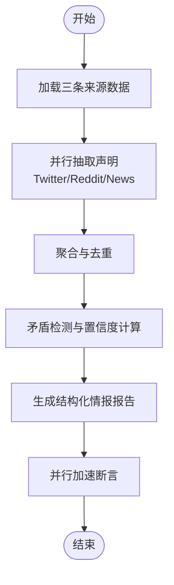

图示来源
- [examples/cookbook/competitive-monitoring.ts:257-350](file://examples/cookbook/competitive-monitoring.ts#L257-L350)

章节来源
- [examples/cookbook/competitive-monitoring.ts:1-448](file://examples/cookbook/competitive-monitoring.ts#L1-L448)

### 论文复现分流（多源证据协调）
- 场景：论文复现分流，多源证据审计（代码/数据集/引文反馈），冲突种子驱动规划器进行协调，输出结构化决策。
- 关键点：
  - 支持 mock 快照与 live 模式（Asta + GitHub），通过环境变量切换。
  - runTasks DAG：并行源审计 → 依赖式复现规划 → 结构化 go/no-go 计划。
  - 提供多种 Provider 选择（Anthropic/OpenAI/Gemini/Groq/OpenRouter）。
  - 大量辅助函数用于证据提取、候选数据集筛选、置信度评分。
- 运行方式：默认运行 mock；可设置 SOURCE_MODE=live 切换真实源。
- 配置要点：LLM_PROVIDER、OPENAI/GEMINI/GROQ/OPENROUTER 环境变量；任务依赖与共享内存。

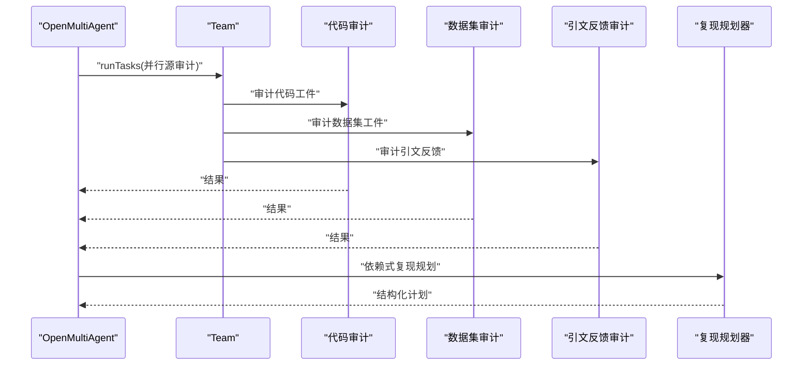

图示来源
- [examples/cookbook/paper-replication-triage.ts:320-365](file://examples/cookbook/paper-replication-triage.ts#L320-L365)

章节来源
- [examples/cookbook/paper-replication-triage.ts:1-800](file://examples/cookbook/paper-replication-triage.ts#L1-L800)

### 罕见疾病信息分流（源隔离审计 + 安全仲裁）
- 场景：患者症状、非营利教育、官方指南、基因表型、网络声明五路源隔离审计，下游仲裁器综合冲突与安全边界，给出分流决策。
- 关键点：
  - 源隔离：每个审计仅消费对应 fixture，不访问其他源。
  - 安全边界：强制禁止诊断/治疗/推荐等输出，仲裁器必须遵守。
  - 冲突检测：简化内容与商业化声明可能误导，官方指南与基因证据提供约束。
  - 结构化输出 + 运行时断言，确保输出符合预期。
- 运行方式：直接运行脚本。
- 配置要点：outputSchema 严格定义；仲裁器 systemPrompt 强调优先级链（安全 > 沉浸 > 进展）。

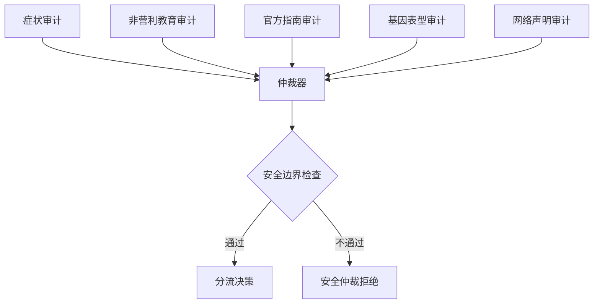

图示来源
- [examples/cookbook/rare-disease-information-triage.ts:340-426](file://examples/cookbook/rare-disease-information-triage.ts#L340-L426)

章节来源
- [examples/cookbook/rare-disease-information-triage.ts:1-510](file://examples/cookbook/rare-disease-information-triage.ts#L1-L510)

### 个性化面试模拟器（面试官 + 观察员）
- 场景：状态化的“面试官”代理与无状态“观察员”代理配合，人类候选人交互，最后生成结构化面试复盘。
- 关键点：
  - 面试官使用 Agent.prompt() 多轮对话，观察员基于完整上下文写入标志。
  - 手动向 SharedMemory 注入候选材料与面试记录，实现跨轮次记忆。
  - 结构化复盘输出（Zod）。
- 运行方式：直接运行脚本；可设置 INTERVIEW_CANDIDATE_DIR 指向自定义材料目录。
- 配置要点：面试官/观察员/报告员的 systemPrompt、maxTurns、temperature；readline 交互。

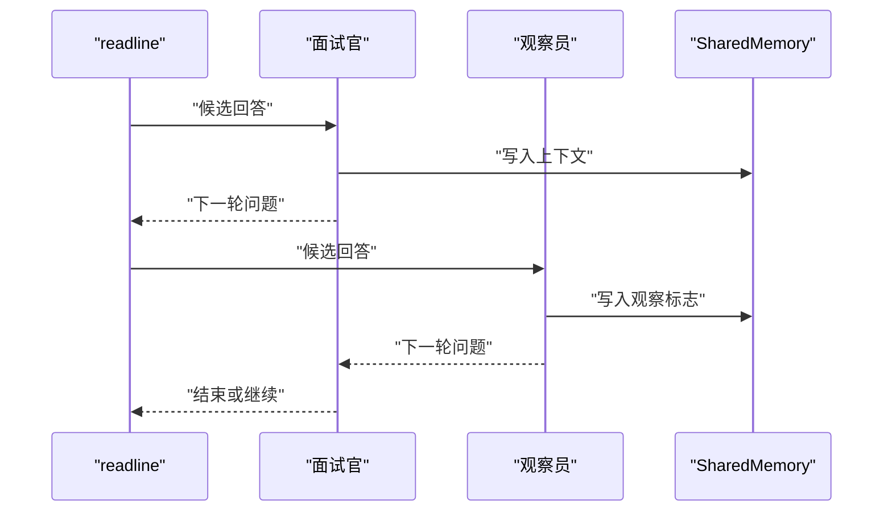

图示来源
- [examples/cookbook/personalized-interview-simulator.ts:206-252](file://examples/cookbook/personalized-interview-simulator.ts#L206-L252)

章节来源
- [examples/cookbook/personalized-interview-simulator.ts:1-275](file://examples/cookbook/personalized-interview-simulator.ts#L1-L275)

### 疫情后复盘 DAG（并行扇出 + 多源合成）
- 场景：日志模式提取、部署关联、爆炸半径分析三路并行，随后根因假设与最终复盘撰写。
- 关键点：
  - 三个根任务并行启动，断言起始时间差小于阈值。
  - 支持 EXAMPLE_PROVIDER=openrouter 切换免费 OpenRouter 模型进行本地验证。
  - 最终报告写入临时目录，打印令牌用量与成本估算。
- 运行方式：直接运行脚本；可设置 EXAMPLE_PROVIDER=openrouter。
- 配置要点：AgentConfig.provider/model 可按需替换；任务依赖与重试策略。

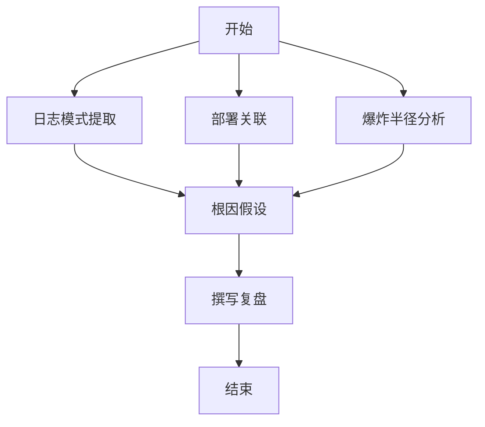

图示来源
- [examples/cookbook/incident-postmortem-dag.ts:331-365](file://examples/cookbook/incident-postmortem-dag.ts#L331-L365)

章节来源
- [examples/cookbook/incident-postmortem-dag.ts:1-438](file://examples/cookbook/incident-postmortem-dag.ts#L1-L438)

### 叙述解谜提示仲裁（冲突化解 + 安全否决）
- 场景：机制/叙事/社区三路上游并行，仲裁器妥协，外部安全代理对仲裁草案进行二元否决。
- 关键点：
  - 上游审计仅消费各自 fixture，仲裁器只接收结构化输出。
  - 设定优先级链：安全 > 沉浸 > 进展；当妥协压缩搜索空间过多时触发否决。
  - 运行时断言确保冲突被明确识别、Spoiler 风险被覆盖。
- 运行方式：直接运行脚本。
- 配置要点：outputSchema 严格定义；安全代理的否决规则与回退提示。

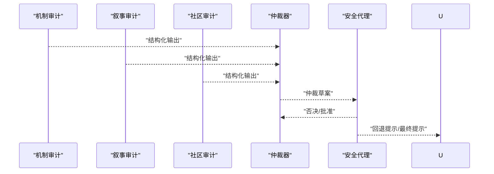

图示来源
- [examples/cookbook/narrative-puzzle-hint-arbitration.ts:444-475](file://examples/cookbook/narrative-puzzle-hint-arbitration.ts#L444-L475)

章节来源
- [examples/cookbook/narrative-puzzle-hint-arbitration.ts:1-567](file://examples/cookbook/narrative-puzzle-hint-arbitration.ts#L1-L567)

### 翻译回译质量检查（跨模型对比）
- 场景：Agent A（Claude）翻译 → Agent B（不同 Provider 家族）回译 → Agent C（Claude）对比原/回译，标记语义漂移。
- 关键点：
  - Provider 自动选择：优先 Gemini，否则 OpenAI；模型名可由环境变量覆盖。
  - 结构化输出：段落索引、翻译、回译、漂移等级与备注。
  - 统计令牌用量与总成本估算。
- 运行方式：直接运行脚本。
- 配置要点：outputSchema；不同 Provider 的 model/baseURL；AgentPool 并行执行。

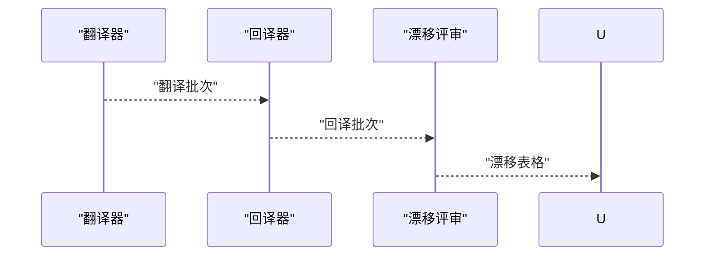

图示来源
- [examples/cookbook/translation-backtranslation.ts:239-285](file://examples/cookbook/translation-backtranslation.ts#L239-L285)

章节来源
- [examples/cookbook/translation-backtranslation.ts:1-328](file://examples/cookbook/translation-backtranslation.ts#L1-L328)

## 依赖关系分析
- 基础示例依赖 OpenMultiAgent 与 Agent/Team/Task 等核心能力。
- 模式示例（并行扇出/聚合、结构化输出）为食谱示例提供通用构件。
- 食谱示例通过 runTeam/runTasks 将模式组合为端到端工作流，并引入共享内存、事件回调、结构化输出等增强特性。

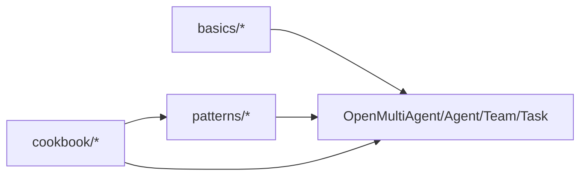

图示来源
- [examples/basics/single-agent.ts:14-49](file://examples/basics/single-agent.ts#L14-L49)
- [examples/basics/team-collaboration.ts:15-128](file://examples/basics/team-collaboration.ts#L15-L128)
- [examples/basics/task-pipeline.ts:17-182](file://examples/basics/task-pipeline.ts#L17-L182)
- [examples/patterns/fan-out-aggregate.ts:18-167](file://examples/patterns/fan-out-aggregate.ts#L18-L167)
- [examples/patterns/structured-output.ts:17-73](file://examples/patterns/structured-output.ts#L17-L73)
- [examples/cookbook/contract-review-dag.ts:25-324](file://examples/cookbook/contract-review-dag.ts#L25-L324)

章节来源
- [examples/basics/single-agent.ts:1-134](file://examples/basics/single-agent.ts#L1-L134)
- [examples/basics/team-collaboration.ts:1-168](file://examples/basics/team-collaboration.ts#L1-L168)
- [examples/basics/task-pipeline.ts:1-208](file://examples/basics/task-pipeline.ts#L1-L208)
- [examples/patterns/fan-out-aggregate.ts:1-210](file://examples/patterns/fan-out-aggregate.ts#L1-L210)
- [examples/patterns/structured-output.ts:1-74](file://examples/patterns/structured-output.ts#L1-L74)
- [examples/cookbook/contract-review-dag.ts:1-369](file://examples/cookbook/contract-review-dag.ts#L1-L369)

## 性能考量
- 并行加速：多数示例通过并行执行（AgentPool 或 runTasks 并行根任务）显著缩短总耗时。建议：
  - 评估任务间耦合度，尽量拆分为独立子任务。
  - 控制并发度，避免 LLM/工具调用成为瓶颈。
  - 使用断言校验并行效果（如会议摘要、竞争监测示例中的耗时比较）。
- 令牌与成本：
  - 记录 per-agent 与总令牌用量，结合 provider/model 的单价估算成本。
  - 在需要时降低 temperature、限制 maxTokens、使用更小模型以降低成本。
- 重试与稳定性：
  - 为关键步骤配置 maxRetries 与指数退避，避免偶发错误导致整体失败。
  - 对结构化输出启用 schema 校验与自动重试，提高鲁棒性。
- 共享内存与上下文：
  - 合理使用 sharedMemory 与 memoryScope，避免上下文膨胀导致 token 消耗上升。

## 故障排除指南
- 环境变量缺失
  - 常见：ANTHROPIC_API_KEY、OPENAI_API_KEY、GEMINI_API_KEY、OPENROUTER_API_KEY、AZURE/AWS 凭据等。
  - 排查：确认示例头部注释中的“Prerequisites”，逐个核对必需变量。
- Provider 选择与模型
  - 若使用 EXAMPLE_PROVIDER=openrouter 或 LLM_PROVIDER=xxx，请确保对应环境变量已正确设置。
  - 某些示例要求 Node.js >= 18。
- 结构化输出失败
  - 检查 outputSchema 是否与 systemPrompt 一致；必要时放宽 schema 或增加引导提示。
  - 框架会在首次失败后自动重试一次，若仍失败，查看原始输出定位问题。
- 并行断言失败
  - 若并行耗时不达标，检查并发度设置、任务粒度与上游依赖是否阻塞。
- 重试未生效
  - 确认任务配置中 maxRetries/retryDelayMs/retryBackoff 设置；某些示例通过 FORCE_FAIL 触发重试。
- 令牌用量异常
  - 检查是否启用了共享内存导致上下文过大；适当减少 maxTokens 或优化 systemPrompt。

章节来源
- [examples/cookbook/competitive-monitoring.ts:23-26](file://examples/cookbook/competitive-monitoring.ts#L23-L26)
- [examples/cookbook/translation-backtranslation.ts:13-16](file://examples/cookbook/translation-backtranslation.ts#L13-L16)
- [examples/cookbook/incident-postmortem-dag.ts:21-29](file://examples/cookbook/incident-postmortem-dag.ts#L21-L29)
- [examples/patterns/structured-output.ts:13-14](file://examples/patterns/structured-output.ts#L13-L14)

## 结论
通过从基础示例到模式再到食谱的渐进式学习，可以快速掌握 Open Multi-Agent 框架在复杂业务场景中的应用方法。建议实践路径：
- 从 basics 开始，理解 runAgent/runTeam/runTasks 的差异与适用场景。
- 学习 patterns 中的并行扇出/聚合与结构化输出，将其作为食谱的通用构件。
- 选择与自身业务相近的食谱示例（如会议摘要、竞争监测、论文复现分流等）深入研究，按需调整 Agent 配置、任务依赖与重试策略。
- 在生产环境中引入共享内存、事件回调、结构化输出与成本控制策略，持续迭代优化。

## 附录
- 运行方式与前置条件请参考各示例文件头部注释。
- 如需新增示例，请遵循 examples/README.md 中的命名与表格规范。