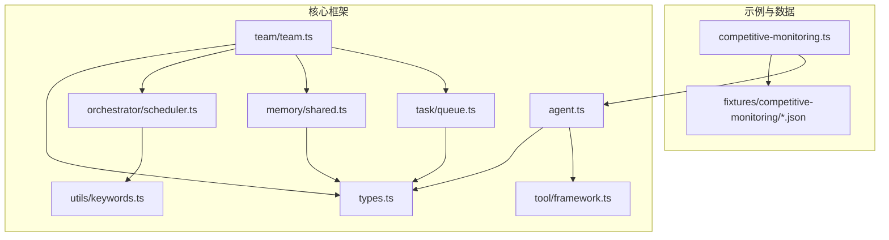
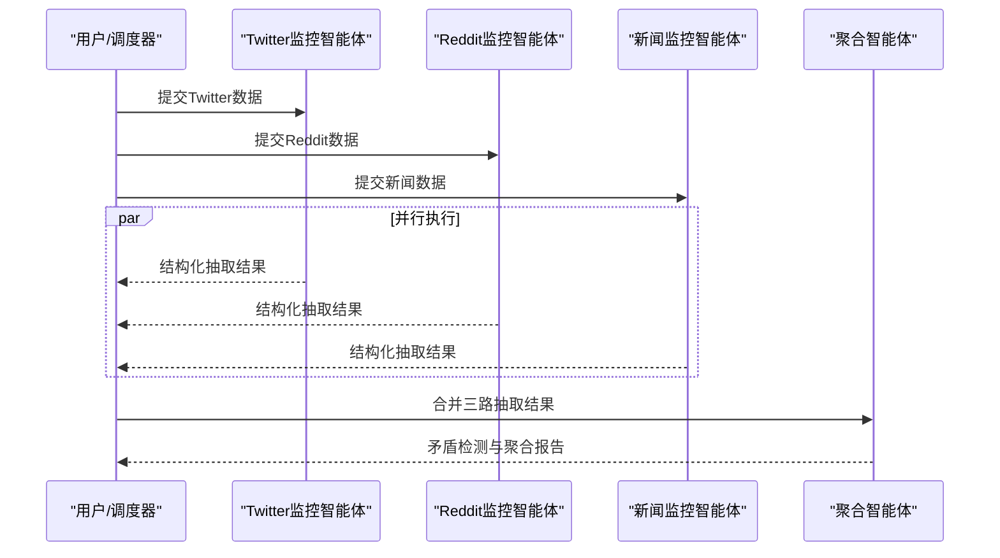
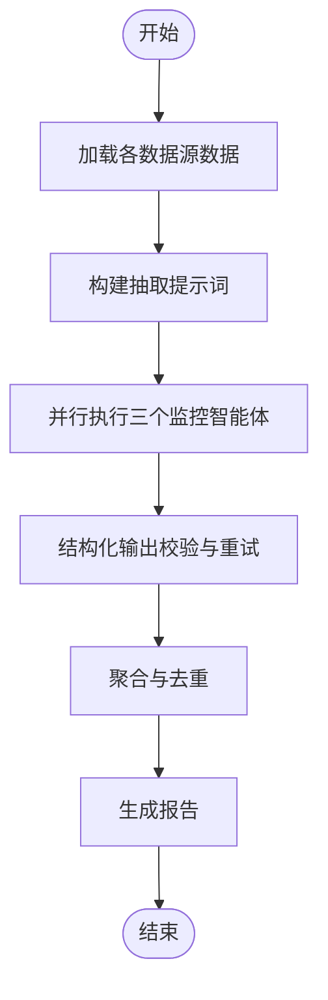
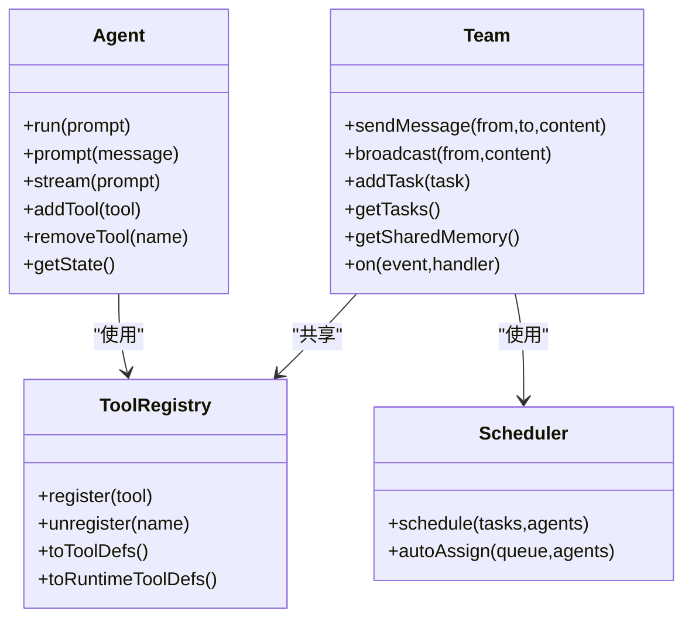
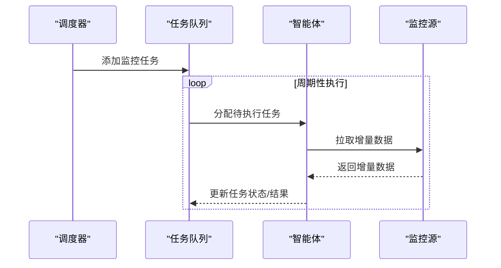
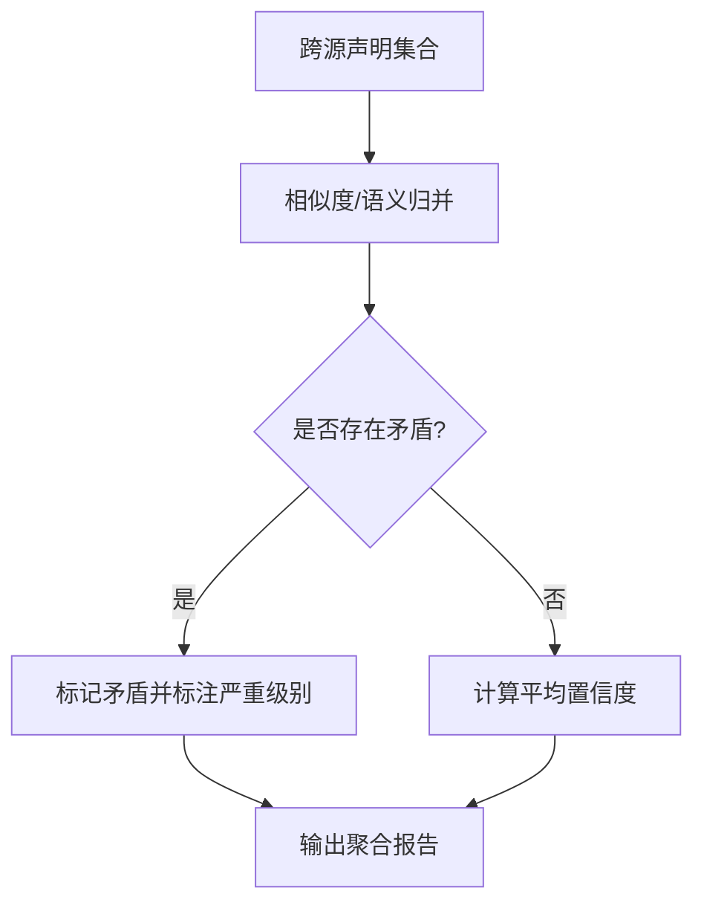
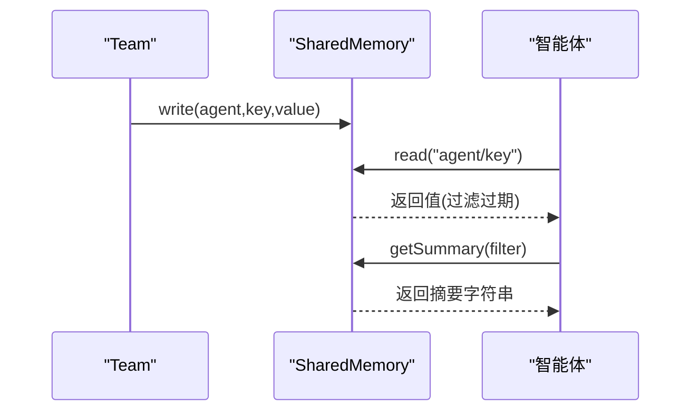
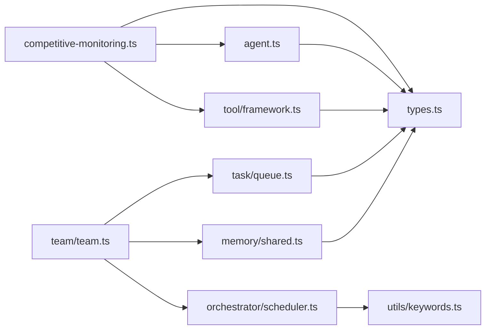

# 竞争监测系统

<cite>
**本文档引用的文件**
- [competitive-monitoring.ts](file://examples/cookbook/competitive-monitoring.ts)
- [news.json](file://examples/fixtures/competitive-monitoring/news.json)
- [reddit.json](file://examples/fixtures/competitive-monitoring/reddit.json)
- [twitter.json](file://examples/fixtures/competitive-monitoring/twitter.json)
- [team.ts](file://src/team/team.ts)
- [agent.ts](file://src/agent/agent.ts)
- [framework.ts](file://src/tool/framework.ts)
- [scheduler.ts](file://src/orchestrator/scheduler.ts)
- [shared.ts](file://src/memory/shared.ts)
- [keywords.ts](file://src/utils/keywords.ts)
- [queue.ts](file://src/task/queue.ts)
- [types.ts](file://src/types.ts)
- [store.ts](file://src/memory/store.ts)
- [package.json](file://package.json)
</cite>

## 目录
1. [简介](#简介)
2. [项目结构](#项目结构)
3. [核心组件](#核心组件)
4. [架构总览](#架构总览)
5. [详细组件分析](#详细组件分析)
6. [依赖关系分析](#依赖关系分析)
7. [性能考虑](#性能考虑)
8. [故障排查指南](#故障排查指南)
9. [结论](#结论)
10. [附录](#附录)

## 简介
本文件面向“竞争监测系统”的设计与实现，基于仓库中的示例与框架能力，系统化阐述如何构建一个自动化竞争情报收集与分析系统。该系统以多数据源（新闻API、社交媒体平台如Reddit、Twitter）为输入，通过智能体协作模式完成数据提取、冲突检测与聚合报告生成，并提供可扩展的实时监测、增量更新、数据预处理与清洗、威胁与机会识别、大规模数据处理与缓存等能力。

## 项目结构
该仓库采用模块化组织方式，核心能力集中在src目录下，示例与测试分别位于examples与tests目录。与竞争监测直接相关的模块包括：
- 示例与数据：examples/cookbook/competitive-monitoring.ts 及其本地fixture数据
- 智能体与工具：src/agent、src/tool
- 团队编排：src/team、src/orchestrator
- 内存与共享：src/memory
- 任务与调度：src/task、src/orchestrator/scheduler.ts
- 类型定义：src/types.ts
- 工具函数：src/utils/keywords.ts

**图表来源**
- [competitive-monitoring.ts:114-199](file://examples/cookbook/competitive-monitoring.ts#L114-L199)
- [agent.ts:94-191](file://src/agent/agent.ts#L94-L191)
- [framework.ts:121-254](file://src/tool/framework.ts#L121-L254)
- [team.ts:88-151](file://src/team/team.ts#L88-L151)
- [scheduler.ts:96-143](file://src/orchestrator/scheduler.ts#L96-L143)
- [shared.ts:55-85](file://src/memory/shared.ts#L55-L85)
- [queue.ts:55-80](file://src/task/queue.ts#L55-L80)
- [keywords.ts:18-39](file://src/utils/keywords.ts#L18-L39)
- [types.ts:368-531](file://src/types.ts#L368-L531)

**章节来源**
- [competitive-monitoring.ts:1-50](file://examples/cookbook/competitive-monitoring.ts#L1-L50)
- [package.json:1-108](file://package.json#L1-L108)

## 核心组件
- 多源监控智能体：Twitter、Reddit、新闻三路并行提取，使用结构化输出约束确保一致性
- 聚合智能体：跨源合并、去重、矛盾检测与置信度平均
- 团队编排：消息总线、任务队列、共享内存、事件总线
- 工具注册与执行：统一的工具定义、注册、转换与执行框架
- 关键字匹配与调度：基于关键字的代理能力匹配与依赖优先级调度
- 内存与共享：命名空间化的共享记忆，支持过期与摘要注入

**章节来源**
- [competitive-monitoring.ts:114-199](file://examples/cookbook/competitive-monitoring.ts#L114-L199)
- [team.ts:88-151](file://src/team/team.ts#L88-L151)
- [framework.ts:121-254](file://src/tool/framework.ts#L121-L254)
- [scheduler.ts:96-143](file://src/orchestrator/scheduler.ts#L96-L143)
- [shared.ts:55-85](file://src/memory/shared.ts#L55-L85)

## 架构总览
系统采用“多源并行采集 + 结构化抽取 + 智能体聚合”的流水线式架构。数据从本地fixture或外部API进入，经由三个专用监控智能体抽取结构化事实，随后由聚合智能体进行跨源对齐与矛盾检测，最终输出标准化的竞争情报报告。

**图表来源**
- [competitive-monitoring.ts:257-346](file://examples/cookbook/competitive-monitoring.ts#L257-L346)

## 详细组件分析

### 多数据源集成与结构化抽取
- 数据源适配：示例中通过本地JSON fixture模拟数据源；实际部署时可替换为真实API调用（见示例注释）
- 结构化输出：每个监控智能体配置了Zod schema，确保抽取结果符合固定结构（包含声明、日期、来源链接、置信度）
- 并行执行：使用Promise.all并发触发三个监控智能体，显著缩短端到端时间

**图表来源**
- [competitive-monitoring.ts:257-346](file://examples/cookbook/competitive-monitoring.ts#L257-L346)
- [competitive-monitoring.ts:439-447](file://examples/cookbook/competitive-monitoring.ts#L439-L447)

**章节来源**
- [competitive-monitoring.ts:48-108](file://examples/cookbook/competitive-monitoring.ts#L48-L108)
- [competitive-monitoring.ts:257-346](file://examples/cookbook/competitive-monitoring.ts#L257-L346)

### 智能体协作模式与任务编排
- 智能体生命周期：Agent封装运行、流式输出、工具注册、状态跟踪与钩子回调
- 工具体系：defineTool定义工具，ToolRegistry集中管理，ToolExecutor执行，支持动态注册与运行时扩展
- 团队协作：Team提供消息总线、任务队列、共享内存与事件总线，支持点对点与广播通信
- 调度策略：Scheduler支持轮转、最少忙碌、能力匹配、依赖优先四种策略，适合复杂管线

**图表来源**
- [agent.ts:94-191](file://src/agent/agent.ts#L94-L191)
- [framework.ts:121-254](file://src/tool/framework.ts#L121-L254)
- [team.ts:88-151](file://src/team/team.ts#L88-L151)
- [scheduler.ts:96-143](file://src/orchestrator/scheduler.ts#L96-L143)

**章节来源**
- [agent.ts:94-191](file://src/agent/agent.ts#L94-L191)
- [framework.ts:121-254](file://src/tool/framework.ts#L121-L254)
- [team.ts:88-151](file://src/team/team.ts#L88-L151)
- [scheduler.ts:96-143](file://src/orchestrator/scheduler.ts#L96-L143)

### 实时监测与增量更新
- 并发模型：示例通过Promise.all实现并行，满足“并行时间应小于串行时间的70%”的性能要求
- 增量更新：可基于上次聚合结果的时间戳或哈希值，仅拉取新增条目；聚合阶段进行去重与合并
- 令牌预算：AgentConfig支持maxTokenBudget与超时控制，避免长时间运行导致资源耗尽

**图表来源**
- [competitive-monitoring.ts:257-298](file://examples/cookbook/competitive-monitoring.ts#L257-L298)
- [queue.ts:55-80](file://src/task/queue.ts#L55-L80)

**章节来源**
- [competitive-monitoring.ts:257-298](file://examples/cookbook/competitive-monitoring.ts#L257-L298)
- [queue.ts:55-80](file://src/task/queue.ts#L55-L80)

### 数据预处理与清洗
- 去重策略：聚合阶段对相同主题的声明进行归并，保留首次出现时间与平均置信度
- 格式标准化：所有声明统一为标准结构（声明文本、日期、来源、置信度），便于后续分析
- 冲突检测：当同一主题在不同来源出现不一致的日期、数值或事实时，标记为矛盾并标注严重级别

**图表来源**
- [competitive-monitoring.ts:166-183](file://examples/cookbook/competitive-monitoring.ts#L166-L183)
- [competitive-monitoring.ts:314-346](file://examples/cookbook/competitive-monitoring.ts#L314-L346)

**章节来源**
- [competitive-monitoring.ts:166-183](file://examples/cookbook/competitive-monitoring.ts#L166-L183)
- [competitive-monitoring.ts:314-346](file://examples/cookbook/competitive-monitoring.ts#L314-L346)

### 威胁检测与机会识别
- 威胁检测：通过矛盾检测与异常波动（如价格战、监管障碍、估值分歧）识别潜在风险
- 机会识别：通过产品发布、合作伙伴关系、市场扩张、技术趋势等信号识别增长机会
- 置信度加权：聚合后的置信度可用于风险评分与优先级排序

**章节来源**
- [competitive-monitoring.ts:166-183](file://examples/cookbook/competitive-monitoring.ts#L166-L183)
- [competitive-monitoring.ts:314-346](file://examples/cookbook/competitive-monitoring.ts#L314-L346)

### 缓存机制与共享内存
- 命名空间共享：SharedMemory按“智能体名/键”写入，保证可追溯性与跨智能体读取
- TTL过期：支持按回合计数的过期策略，适用于短期上下文传递
- 摘要注入：getSummary生成人类可读摘要，可注入到智能体系统提示中，增强上下文一致性

**图表来源**
- [shared.ts:124-184](file://src/memory/shared.ts#L124-L184)
- [shared.ts:251-294](file://src/memory/shared.ts#L251-L294)

**章节来源**
- [shared.ts:55-85](file://src/memory/shared.ts#L55-L85)
- [shared.ts:124-184](file://src/memory/shared.ts#L124-L184)
- [shared.ts:251-294](file://src/memory/shared.ts#L251-L294)

### 部署与监控配置
- 运行环境：Node.js >= 18，示例使用Anthropic模型
- 依赖安装：通过package.json管理核心依赖与可选依赖
- 监控与追踪：Agent支持onTrace钩子，可输出运行指标（令牌用量、时长、轮次等）

**章节来源**
- [competitive-monitoring.ts:14-17](file://examples/cookbook/competitive-monitoring.ts#L14-L17)
- [package.json:66-107](file://package.json#L66-L107)
- [agent.ts:411-431](file://src/agent/agent.ts#L411-L431)

## 依赖关系分析

**图表来源**
- [competitive-monitoring.ts:32-33](file://examples/cookbook/competitive-monitoring.ts#L32-L33)
- [team.ts:10-22](file://src/team/team.ts#L10-L22)
- [scheduler.ts:16-18](file://src/orchestrator/scheduler.ts#L16-L18)
- [types.ts:8-9](file://src/types.ts#L8-L9)

**章节来源**
- [competitive-monitoring.ts:32-33](file://examples/cookbook/competitive-monitoring.ts#L32-L33)
- [team.ts:10-22](file://src/team/team.ts#L10-L22)
- [scheduler.ts:16-18](file://src/orchestrator/scheduler.ts#L16-L18)
- [types.ts:8-9](file://src/types.ts#L8-L9)

## 性能考虑
- 并行化：使用Promise.all减少端到端时间，示例验证并行速度提升
- 令牌预算：通过maxTokenBudget与超时控制防止长尾任务占用资源
- 上下文压缩：AgentConfig支持多种上下文策略（滑动窗口、摘要、紧凑压缩、自定义压缩），降低长对话开销
- 调度优化：Scheduler的“最少忙碌”“能力匹配”“依赖优先”策略提升整体吞吐

**章节来源**
- [competitive-monitoring.ts:257-298](file://examples/cookbook/competitive-monitoring.ts#L257-L298)
- [agent.ts:405-410](file://src/agent/agent.ts#L405-L410)
- [types.ts:124-152](file://src/types.ts#L124-L152)
- [scheduler.ts:194-236](file://src/orchestrator/scheduler.ts#L194-L236)

## 故障排查指南
- 结构化输出失败：Agent在outputSchema失败时会自动重试一次，若仍失败则返回错误结果
- 循环检测：Agent内置循环检测配置，可配置最大重复次数与检测窗口，必要时终止或注入提示
- 任务失败传播：TaskQueue在fail时会级联影响下游依赖任务，避免阻塞
- 共享内存过期：检查turnCount推进与过期逻辑，避免读取到已过期条目

**章节来源**
- [agent.ts:437-516](file://src/agent/agent.ts#L437-L516)
- [types.ts:538-566](file://src/types.ts#L538-L566)
- [queue.ts:150-243](file://src/task/queue.ts#L150-L243)
- [shared.ts:162-184](file://src/memory/shared.ts#L162-L184)

## 结论
该系统以多智能体并行抽取与聚合为核心，结合结构化输出、冲突检测与共享记忆，形成可扩展的竞争监测流水线。通过合理的调度策略、上下文压缩与令牌预算控制，可在大规模数据场景下保持高效与稳定。建议在生产环境中接入真实API、实现增量拉取与缓存、完善监控与告警，并根据业务需求扩展威胁与机会识别算法。

## 附录
- 示例数据源：Twitter、Reddit、新闻的fixture数据，用于演示抽取与聚合流程
- 工具定义：通过defineTool与ToolRegistry实现可复用的工具能力
- 关键字匹配：用于能力匹配调度与短路选择

**章节来源**
- [twitter.json:1-63](file://examples/fixtures/competitive-monitoring/twitter.json#L1-L63)
- [reddit.json:1-63](file://examples/fixtures/competitive-monitoring/reddit.json#L1-L63)
- [news.json:1-63](file://examples/fixtures/competitive-monitoring/news.json#L1-L63)
- [framework.ts:71-111](file://src/tool/framework.ts#L71-L111)
- [keywords.ts:18-39](file://src/utils/keywords.ts#L18-L39)