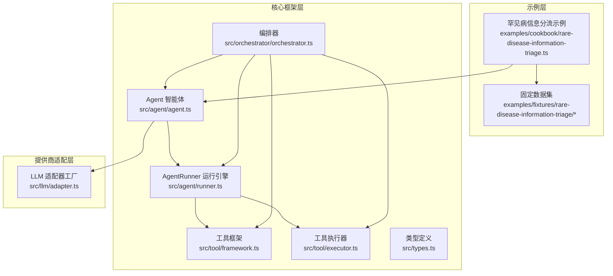
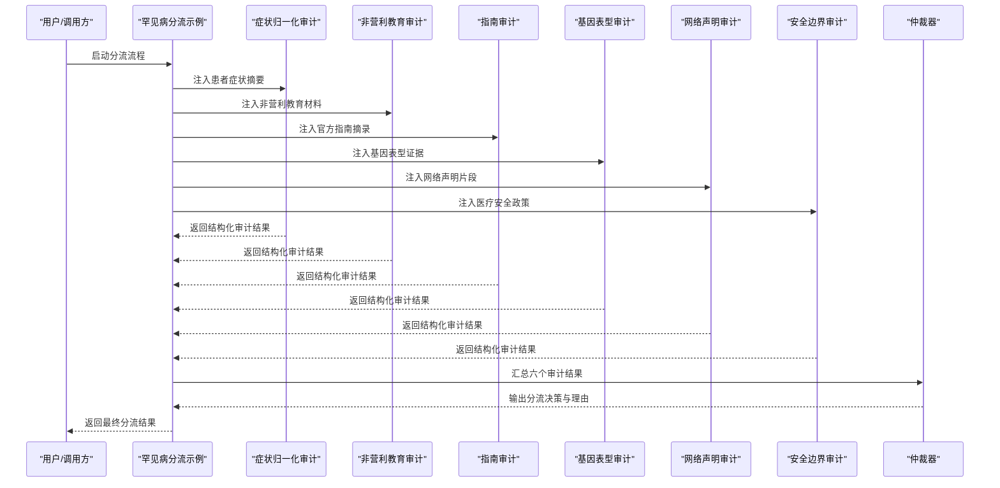
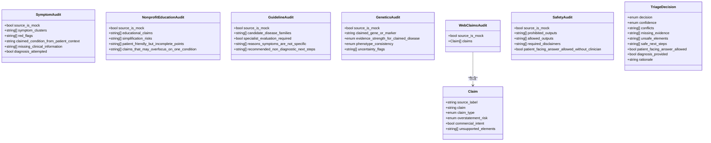
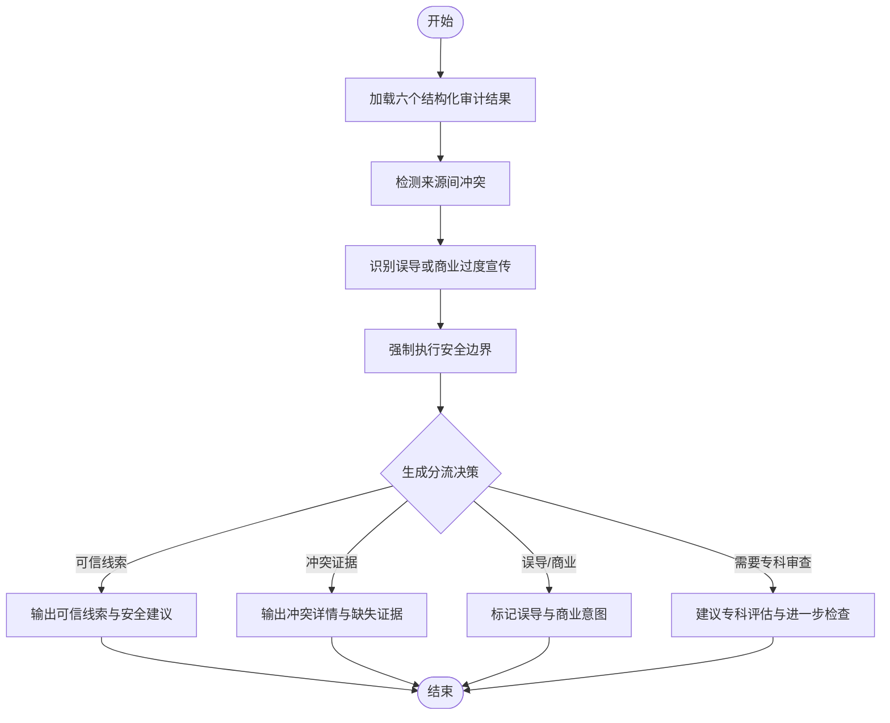
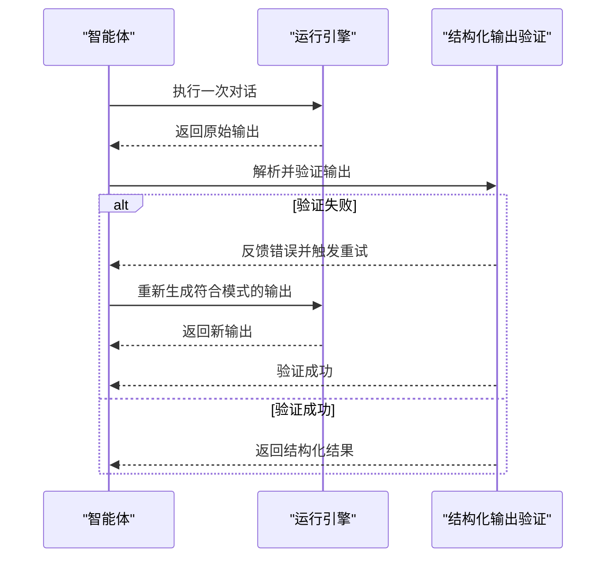
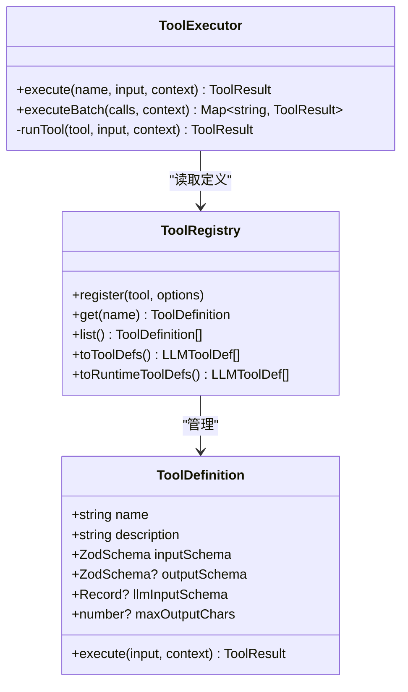
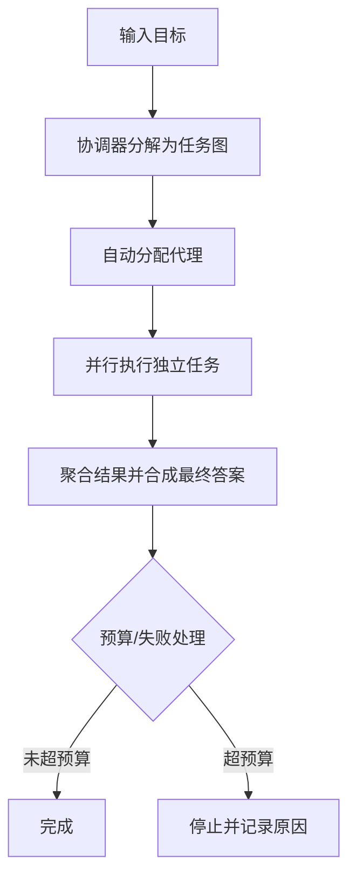
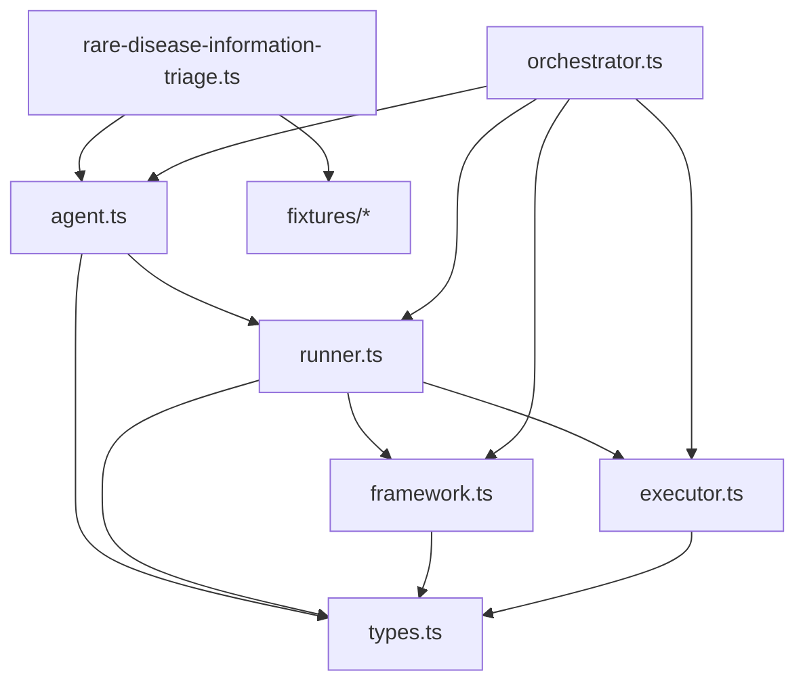

# 罕见病信息分流系统

<cite>
**本文档引用的文件**
- [rare-disease-information-triage.ts](file://examples/cookbook/rare-disease-information-triage.ts)
- [patient-symptom-summary.json](file://examples/fixtures/rare-disease-information-triage/patient-symptom-summary.json)
- [nonprofit-patient-education.md](file://examples/fixtures/rare-disease-information-triage/nonprofit-patient-education.md)
- [official-guideline-excerpt.md](file://examples/fixtures/rare-disease-information-triage/official-guideline-excerpt.md)
- [gene-phenotype-evidence.json](file://examples/fixtures/rare-disease-information-triage/gene-phenotype-evidence.json)
- [web-claims-snippets.json](file://examples/fixtures/rare-disease-information-triage/web-claims-snippets.json)
- [medical-safety-policy.json](file://examples/fixtures/rare-disease-information-triage/medical-safety-policy.json)
- [agent.ts](file://src/agent/agent.ts)
- [runner.ts](file://src/agent/runner.ts)
- [framework.ts](file://src/tool/framework.ts)
- [executor.ts](file://src/tool/executor.ts)
- [orchestrator.ts](file://src/orchestrator/orchestrator.ts)
- [types.ts](file://src/types.ts)
- [README.md](file://README.md)
</cite>

## 目录
1. [简介](#简介)
2. [项目结构](#项目结构)
3. [核心组件](#核心组件)
4. [架构总览](#架构总览)
5. [详细组件分析](#详细组件分析)
6. [依赖关系分析](#依赖关系分析)
7. [性能考量](#性能考量)
8. [故障排除指南](#故障排除指南)
9. [结论](#结论)
10. [附录](#附录)

## 简介
本项目是一个面向罕见病信息的智能分流与验证系统，通过多源异构信息的结构化审计与下游仲裁决策，实现对患者症状、非营利教育材料、官方指南、基因表型证据以及网络声明的综合评估。系统采用“源隔离审计 + 安全边界仲裁”的范式，确保输出严格遵循医疗安全政策，避免诊断或治疗建议的越权生成，并通过结构化输出与运行时断言保障结果的可解释性与一致性。

该系统特别强调以下方面：
- 多来源医疗信息整合：涵盖患者自述症状、非营利组织教育材料、官方指南/专家共识、基因表型证据、网络/论坛/商业声明等。
- 智能体在医疗信息验证中的应用：事实核查、风险评估、冲突检测与安全边界强制执行。
- 医疗术语标准化与语义理解：通过结构化输出模式与严格的系统提示（system prompt）约束，确保不同来源信息在统一框架下被规范化处理。
- 患者教育材料的生成与个性化：基于结构化审计结果，生成非诊断性、非替代临床决策的教育与引导建议。
- 医疗安全性与合规性：内置安全策略与禁止输出清单，确保不提供诊断、治疗、剂量或商业推荐。
- 敏感医疗数据的隐私保护与安全传输：示例中使用模拟数据，生产版本需接入受控数据源与加密传输通道。
- 与电子健康记录系统的集成接口与数据交换标准：通过工具注册与适配器扩展，支持与外部系统对接。

## 项目结构
该仓库采用模块化设计，核心由以下层次构成：
- 示例层：提供端到端工作流示例，如罕见病信息分流示例。
- 固定数据层：提供模拟的多源输入数据，用于演示与测试。
- 核心框架层：包含智能体、工具框架、执行器、编排器与类型定义。
- 提供商适配层：支持多种大模型提供商与本地推理后端。

**图表来源**
- [rare-disease-information-triage.ts:1-510](file://examples/cookbook/rare-disease-information-triage.ts#L1-L510)
- [agent.ts:1-670](file://src/agent/agent.ts#L1-L670)
- [runner.ts:1-200](file://src/agent/runner.ts#L1-L200)
- [framework.ts:1-610](file://src/tool/framework.ts#L1-L610)
- [executor.ts:1-200](file://src/tool/executor.ts#L1-L200)
- [orchestrator.ts:1-800](file://src/orchestrator/orchestrator.ts#L1-L800)
- [types.ts:1-800](file://src/types.ts#L1-L800)

**章节来源**
- [README.md:217-265](file://README.md#L217-L265)

## 核心组件
本系统围绕以下核心组件构建：

- 智能体（Agent）
  - 负责执行单轮或多轮对话，管理消息历史，支持结构化输出与工具调用。
  - 支持系统提示注入、超时控制、循环检测与预算限制。
- 运行引擎（AgentRunner）
  - 实现与 LLM 的交互循环，解析工具调用，调度工具执行，累积令牌用量与时间统计。
- 工具框架（Tool Framework）
  - 定义工具的输入/输出模式，提供 Zod 到 JSON Schema 的转换，支持工具注册与导出。
- 工具执行器（ToolExecutor）
  - 并发控制与错误隔离，批量执行工具调用，支持输出截断与长度限制。
- 编排器（Orchestrator）
  - 将目标分解为任务图，自动分配与并行执行，支持重试、预算与可观测性。
- 类型系统（Types）
  - 统一的消息、工具、运行结果与配置类型，保证跨模块一致性。

**章节来源**
- [agent.ts:94-670](file://src/agent/agent.ts#L94-L670)
- [runner.ts:67-198](file://src/agent/runner.ts#L67-L198)
- [framework.ts:117-255](file://src/tool/framework.ts#L117-L255)
- [executor.ts:54-131](file://src/tool/executor.ts#L54-L131)
- [orchestrator.ts:44-122](file://src/orchestrator/orchestrator.ts#L44-L122)
- [types.ts:119-602](file://src/types.ts#L119-L602)

## 架构总览
系统采用“源隔离审计 + 下游仲裁”的两阶段流程：
- 第一阶段：六个源隔离审计智能体分别对患者症状、非营利教育材料、官方指南、基因表型证据、网络声明与安全策略进行结构化审计。
- 第二阶段：仲裁智能体接收结构化审计输出，检测冲突、识别误导或商业过度宣传内容，强制执行安全边界，并给出分流决策。

**图表来源**
- [rare-disease-information-triage.ts:341-428](file://examples/cookbook/rare-disease-information-triage.ts#L341-L428)

**章节来源**
- [rare-disease-information-triage.ts:147-282](file://examples/cookbook/rare-disease-information-triage.ts#L147-L282)

## 详细组件分析

### 源隔离审计智能体
六个审计智能体分别负责不同来源的数据审计，并通过结构化输出模式确保结果的一致性与可验证性：
- 症状归一化审计：提取症状群、红标记、疑似疾病与缺失信息。
- 非营利教育审计：识别简化风险、可能过度聚焦单一疾病的表述。
- 指南审计：识别候选疾病家族、是否需要专科评估、非诊断性下一步建议。
- 基因表型审计：评估证据强度、表型一致性与不确定性标志。
- 网络声明审计：分类声明类型、标注过度陈述风险、商业意图与不支持元素。
- 安全边界审计：提取禁止输出、允许输出、必要免责声明与是否允许患者面询。

**图表来源**
- [rare-disease-information-triage.ts:71-141](file://examples/cookbook/rare-disease-information-triage.ts#L71-L141)

**章节来源**
- [rare-disease-information-triage.ts:71-141](file://examples/cookbook/rare-disease-information-triage.ts#L71-L141)

### 仲裁器与冲突检测
仲裁器接收六个结构化审计结果，执行以下操作：
- 冲突检测：比较不同来源的审计结果，识别矛盾点（例如简化患者教育与广泛指南差异、弱基因证据与商业声明过度承诺）。
- 误导与商业内容识别：标注过度陈述风险与商业意图。
- 安全边界强制：确保不提供诊断、治疗、剂量或商业推荐。
- 分流决策：给出可信线索、冲突证据、误导/商业或需要专科审查的结论，并提供置信度与安全建议。

**图表来源**
- [rare-disease-information-triage.ts:241-282](file://examples/cookbook/rare-disease-information-triage.ts#L241-L282)

**章节来源**
- [rare-disease-information-triage.ts:241-282](file://examples/cookbook/rare-disease-information-triage.ts#L241-L282)

### 结构化输出与验证
系统通过 Zod 模式对智能体输出进行结构化约束与二次校验，确保审计结果的规范性与一致性：
- 智能体配置中设置输出模式（outputSchema），首次解析失败时自动重试并反馈错误。
- 工具输入/输出同样通过 Zod 进行验证，防止无效数据进入后续流程。

**图表来源**
- [agent.ts:437-516](file://src/agent/agent.ts#L437-L516)

**章节来源**
- [agent.ts:437-516](file://src/agent/agent.ts#L437-L516)

### 工具系统与并发执行
工具系统提供类型安全的工具定义与执行环境：
- defineTool：定义工具的输入/输出模式与执行函数。
- ToolRegistry：注册与导出工具定义，支持运行时动态添加。
- ToolExecutor：并发控制与错误隔离，批量执行工具调用，支持输出截断与长度限制。

**图表来源**
- [framework.ts:71-111](file://src/tool/framework.ts#L71-L111)
- [framework.ts:121-255](file://src/tool/framework.ts#L121-L255)
- [executor.ts:54-131](file://src/tool/executor.ts#L54-L131)

**章节来源**
- [framework.ts:71-111](file://src/tool/framework.ts#L71-L111)
- [framework.ts:121-255](file://src/tool/framework.ts#L121-L255)
- [executor.ts:54-131](file://src/tool/executor.ts#L54-L131)

### 编排器与任务执行
编排器负责将目标分解为任务图，自动分配与并行执行，支持重试、预算与可观测性：
- 关键能力：关键词匹配选择最佳代理、复杂目标识别、任务队列与调度、并发池与委托、预算与追踪。
- 事件与追踪：提供进度回调与追踪事件，便于调试与审计。

**图表来源**
- [orchestrator.ts:561-800](file://src/orchestrator/orchestrator.ts#L561-L800)

**章节来源**
- [orchestrator.ts:561-800](file://src/orchestrator/orchestrator.ts#L561-L800)

## 依赖关系分析
系统内部模块之间的依赖关系如下：
- 示例依赖智能体与固定数据；智能体依赖运行引擎与工具系统；编排器贯穿任务执行与可观测性。
- 类型系统作为统一契约，贯穿所有模块。

**图表来源**
- [rare-disease-information-triage.ts:31-57](file://examples/cookbook/rare-disease-information-triage.ts#L31-L57)
- [agent.ts:48-53](file://src/agent/agent.ts#L48-L53)
- [runner.ts:35-42](file://src/agent/runner.ts#L35-L42)
- [framework.ts:13-20](file://src/tool/framework.ts#L13-L20)
- [executor.ts:13-17](file://src/tool/executor.ts#L13-L17)
- [orchestrator.ts:44-71](file://src/orchestrator/orchestrator.ts#L44-L71)
- [types.ts:8-10](file://src/types.ts#L8-L10)

**章节来源**
- [rare-disease-information-triage.ts:31-57](file://examples/cookbook/rare-disease-information-triage.ts#L31-L57)
- [agent.ts:48-53](file://src/agent/agent.ts#L48-L53)
- [runner.ts:35-42](file://src/agent/runner.ts#L35-L42)
- [framework.ts:13-20](file://src/tool/framework.ts#L13-L20)
- [executor.ts:13-17](file://src/tool/executor.ts#L13-L17)
- [orchestrator.ts:44-71](file://src/orchestrator/orchestrator.ts#L44-L71)
- [types.ts:8-10](file://src/types.ts#L8-L10)

## 性能考量
- 令牌预算与成本控制：示例打印输入/输出令牌数以透明化成本；可通过 maxTokenBudget 限制总消耗。
- 循环检测与超时：避免无意义的重复调用与长时间阻塞。
- 工具输出截断与压缩：减少上下文膨胀，提升长对话效率。
- 并发与批处理：工具执行器支持并发限制，平衡吞吐与资源占用。
- 上下文管理策略：滑动窗口、摘要与自定义压缩策略，适用于长期多轮对话。

**章节来源**
- [agent.ts:536-572](file://src/agent/agent.ts#L536-L572)
- [runner.ts:132-143](file://src/agent/runner.ts#L132-L143)
- [executor.ts:23-34](file://src/tool/executor.ts#L23-L34)
- [types.ts:124-153](file://src/types.ts#L124-L153)
- [README.md:317-329](file://README.md#L317-L329)

## 故障排除指南
- 结构化输出失败：系统会自动重试一次并反馈错误；检查输出模式与系统提示是否一致。
- 令牌预算超限：通过 maxTokenBudget 或 OrchestratorConfig 控制；观察 onProgress 中的预算事件。
- 循环检测：启用 loopDetection 并配置 onLoopDetected 行为（警告/终止/自定义）。
- 工具执行异常：工具输入/输出的 Zod 校验失败会被捕获并以错误结果返回，避免中断对话。
- 数据源问题：示例使用模拟数据；生产需替换为受控数据源与安全传输通道。

**章节来源**
- [agent.ts:437-516](file://src/agent/agent.ts#L437-L516)
- [runner.ts:132-143](file://src/agent/runner.ts#L132-L143)
- [executor.ts:147-189](file://src/tool/executor.ts#L147-L189)
- [orchestrator.ts:733-747](file://src/orchestrator/orchestrator.ts#L733-L747)

## 结论
罕见病信息分流系统通过“源隔离审计 + 安全边界仲裁”的范式，实现了对多源医疗信息的结构化处理与冲突检测，确保输出严格遵守医疗安全政策。系统具备良好的扩展性与可观测性，适合在生产环境中进一步接入真实数据源与电子健康记录系统，同时满足隐私保护与合规要求。

## 附录

### 多来源医疗信息整合要点
- 患者症状：提取症状群、红标记与缺失信息，避免诊断性结论。
- 非营利教育：识别简化风险与过度聚焦单一疾病的表述。
- 官方指南：强调症状非特异性与需要专科评估，提供非诊断性下一步建议。
- 基因表型：评估证据强度与表型一致性，标注不确定性标志。
- 网络声明：分类声明类型，标注过度陈述风险与商业意图。
- 安全策略：明确禁止输出与允许输出，确保免责声明与患者面询限制。

**章节来源**
- [patient-symptom-summary.json:1-40](file://examples/fixtures/rare-disease-information-triage/patient-symptom-summary.json#L1-L40)
- [nonprofit-patient-education.md:1-20](file://examples/fixtures/rare-disease-information-triage/nonprofit-patient-education.md#L1-L20)
- [official-guideline-excerpt.md:1-23](file://examples/fixtures/rare-disease-information-triage/official-guideline-excerpt.md#L1-L23)
- [gene-phenotype-evidence.json:1-33](file://examples/fixtures/rare-disease-information-triage/gene-phenotype-evidence.json#L1-L33)
- [web-claims-snippets.json:1-22](file://examples/fixtures/rare-disease-information-triage/web-claims-snippets.json#L1-L22)
- [medical-safety-policy.json:1-31](file://examples/fixtures/rare-disease-information-triage/medical-safety-policy.json#L1-L31)

### 医疗术语标准化与语义理解
- 使用结构化输出模式（Zod）统一字段与枚举值，确保不同来源信息在统一框架下被规范化处理。
- 通过系统提示约束智能体行为，避免越权生成诊断或治疗建议。

**章节来源**
- [rare-disease-information-triage.ts:71-141](file://examples/cookbook/rare-disease-information-triage.ts#L71-L141)
- [agent.ts:149-156](file://src/agent/agent.ts#L149-L156)

### 患者教育材料生成与个性化
- 基于结构化审计结果，生成非诊断性、非替代临床决策的教育与引导建议。
- 强调症状时间线整理、既往检查结果准备与专科咨询建议。

**章节来源**
- [nonprofit-patient-education.md:17-20](file://examples/fixtures/rare-disease-information-triage/nonprofit-patient-education.md#L17-L20)
- [official-guideline-excerpt.md:17-23](file://examples/fixtures/rare-disease-information-triage/official-guideline-excerpt.md#L17-L23)

### 医疗安全性与合规性
- 明确禁止输出清单：不诊断、不确认/排除罕见病、不推荐治疗/剂量/补充剂/程序、不推荐商业检测/产品/诊所/供应商、不将变异意义不明解读为诊断。
- 允许输出清单：总结证据冲突、识别缺失信息、将信息标记为讨论线索而非诊断、建议咨询执业医师/神经肌肉专科医生/遗传咨询师、鼓励整理症状时间线与既往检查结果。
- 必要免责声明：非医疗建议、示例数据为模拟、需执业医师评估患者特定情况。

**章节来源**
- [medical-safety-policy.json:5-23](file://examples/fixtures/rare-disease-information-triage/medical-safety-policy.json#L5-L23)

### 敏感医疗数据的隐私保护与安全传输
- 示例使用模拟数据，生产版本需接入受控数据源与加密传输通道。
- 建议采用最小化原则与访问控制，确保仅在必要范围内使用与处理敏感数据。

**章节来源**
- [rare-disease-information-triage.ts:25-29](file://examples/cookbook/rare-disease-information-triage.ts#L25-L29)

### 与电子健康记录系统的集成接口与数据交换标准
- 通过工具注册与适配器扩展，支持与外部系统对接。
- 推荐采用标准化的数据格式与安全协议，确保互操作性与数据完整性。

**章节来源**
- [framework.ts:198-208](file://src/tool/framework.ts#L198-L208)
- [README.md:273-292](file://README.md#L273-L292)