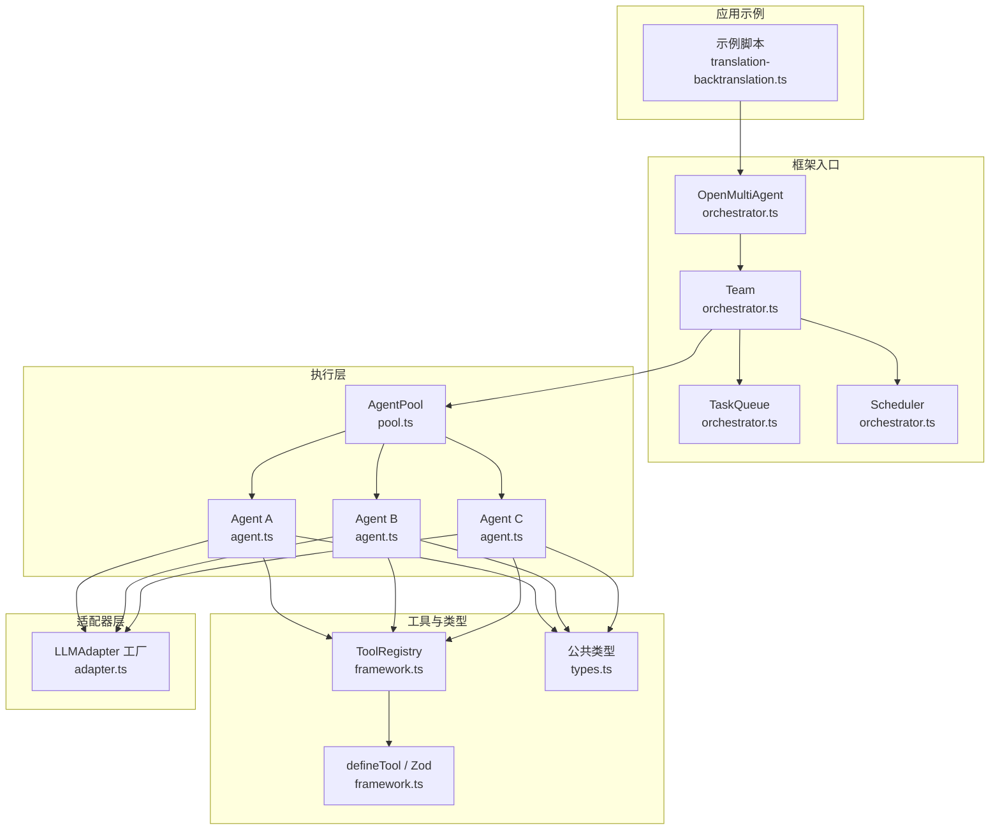
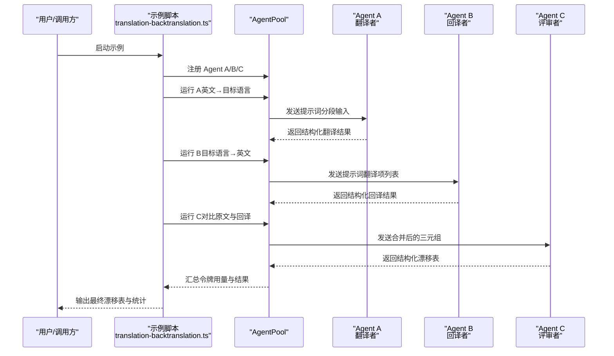
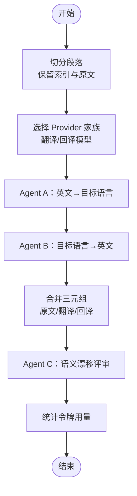
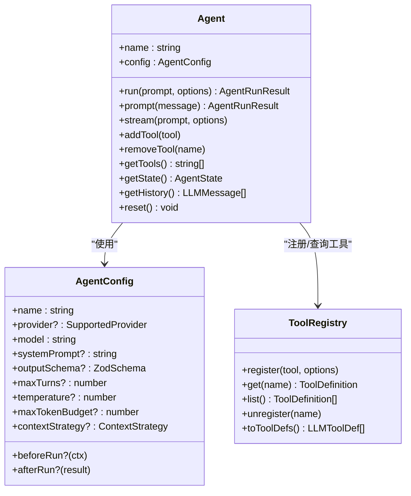
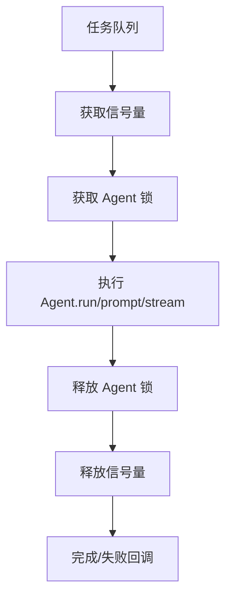
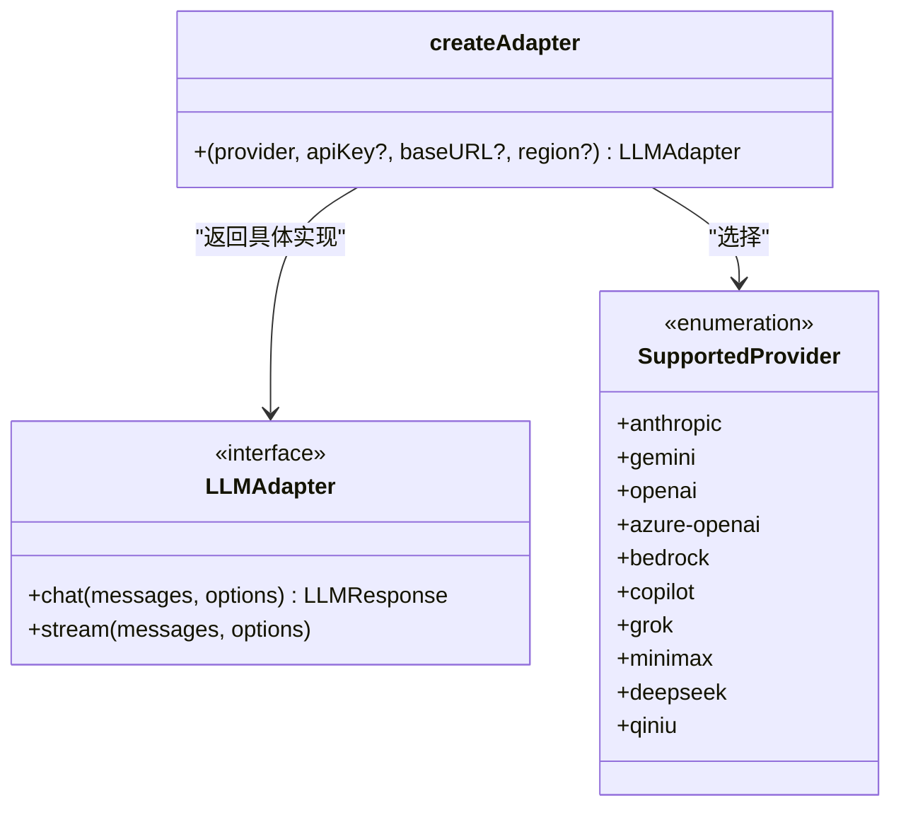
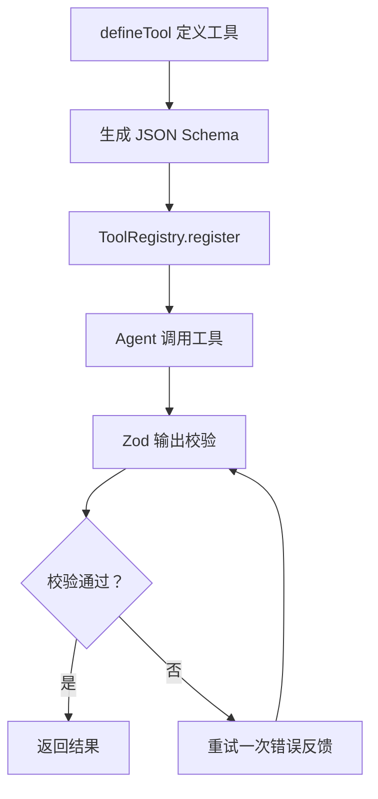
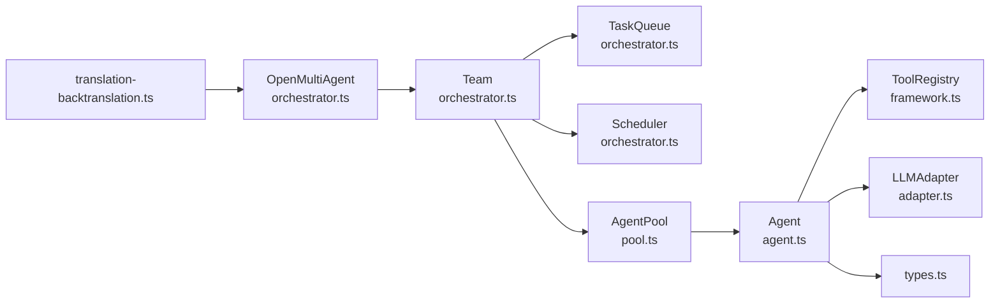

# 翻译回译系统

<cite>
**本文档引用的文件**
- [translation-backtranslation.ts](file://examples/cookbook/translation-backtranslation.ts)
- [index.ts](file://src/index.ts)
- [types.ts](file://src/types.ts)
- [adapter.ts](file://src/llm/adapter.ts)
- [framework.ts](file://src/tool/framework.ts)
- [agent.ts](file://src/agent/agent.ts)
- [pool.ts](file://src/agent/pool.ts)
- [orchestrator.ts](file://src/orchestrator/orchestrator.ts)
- [README.md](file://README.md)
- [context-management.md](file://docs/context-management.md)
- [providers.md](file://docs/providers.md)
</cite>

## 目录
1. [简介](#简介)
2. [项目结构](#项目结构)
3. [核心组件](#核心组件)
4. [架构总览](#架构总览)
5. [详细组件分析](#详细组件分析)
6. [依赖关系分析](#依赖关系分析)
7. [性能考量](#性能考量)
8. [故障排查指南](#故障排查指南)
9. [结论](#结论)
10. [附录](#附录)

## 简介
本文件面向“翻译回译系统”的设计与实现，围绕多语言处理与质量保障展开，系统性阐述以下主题：
- 翻译回译的核心原理：原文翻译 → 目标语言翻译 → 回译验证的循环机制
- 如何通过回译检测翻译质量、识别歧义并改进准确性
- 多语言模型选择与配置（含跨模型家族对比）
- 翻译一致性检查与术语标准化方案
- 上下文保持与语境理解的技术挑战
- 机器翻译与人工校对的混合工作流
- 翻译质量评估指标与自动化测试方法
- 专业术语、文化差异与表达习惯的处理策略
- 大规模翻译项目的并发处理与缓存策略

该系统基于 open-multi-agent 框架，采用多智能体流水线：翻译者（Agent A）→ 回译者（Agent B）→ 语义漂移评审者（Agent C），结合结构化输出与令牌用量统计，形成可复现的质量控制闭环。

## 项目结构
本仓库采用模块化组织，核心能力由以下层次构成：
- 入口与编排层：OpenMultiAgent、Team、TaskQueue、Scheduler
- 执行层：Agent、AgentPool、AgentRunner
- 工具与模式：ToolRegistry、ToolExecutor、defineTool、Zod 结构化输出
- 适配器层：LLMAdapter 抽象与多提供商支持
- 类型与契约：统一的类型定义与运行时事件

图表来源
- [translation-backtranslation.ts:142-214](file://examples/cookbook/translation-backtranslation.ts#L142-L214)
- [orchestrator.ts:1-120](file://src/orchestrator/orchestrator.ts#L1-L120)
- [pool.ts:58-110](file://src/agent/pool.ts#L58-L110)
- [agent.ts:94-127](file://src/agent/agent.ts#L94-L127)
- [framework.ts:117-254](file://src/tool/framework.ts#L117-L254)
- [adapter.ts:72-131](file://src/llm/adapter.ts#L72-L131)
- [types.ts:367-531](file://src/types.ts#L367-L531)

章节来源
- [README.md:217-264](file://README.md#L217-L264)
- [translation-backtranslation.ts:142-214](file://examples/cookbook/translation-backtranslation.ts#L142-L214)

## 核心组件
- 多智能体流水线
  - 翻译者（Agent A）：将英文段落翻译为目标语言（示例中为简体中文），严格保留段落边界与索引编号，并以结构化 JSON 输出。
  - 回译者（Agent B）：使用不同提供商家族（如 Gemini 或 OpenAI）将目标语言回译为英文，尽可能保持原意。
  - 评审者（Agent C）：对比原文与回译文，判定语义漂移等级（无、轻微、重大），并给出注释。
- 结构化输出与验证
  - 使用 Zod Schema 对三阶段输出进行强约束，确保下游解析与自动化处理稳定可靠。
- 并发与调度
  - AgentPool 提供并发限制与串行化，避免同一 Agent 实例状态竞争；支持 run、runParallel、runAny 等执行模式。
- 适配器与多提供商
  - LLMAdapter 工厂按 provider 返回具体适配器，覆盖 Anthropic、Gemini、OpenAI、Azure OpenAI、Bedrock、Copilot、Grok、MiniMax、DeepSeek、Qiniu 等。
- 观测与追踪
  - 统一的事件流与令牌用量统计，便于成本控制与性能分析。

章节来源
- [translation-backtranslation.ts:54-91](file://examples/cookbook/translation-backtranslation.ts#L54-L91)
- [translation-backtranslation.ts:142-201](file://examples/cookbook/translation-backtranslation.ts#L142-L201)
- [pool.ts:58-110](file://src/agent/pool.ts#L58-L110)
- [adapter.ts:42-131](file://src/llm/adapter.ts#L42-L131)
- [types.ts:367-531](file://src/types.ts#L367-L531)

## 架构总览
翻译回译系统采用“流水线 + 多智能体 + 结构化输出”的架构，核心流程如下：

图表来源
- [translation-backtranslation.ts:211-292](file://examples/cookbook/translation-backtranslation.ts#L211-L292)
- [pool.ts:147-191](file://src/agent/pool.ts#L147-L191)
- [agent.ts:205-238](file://src/agent/agent.ts#L205-L238)

## 详细组件分析

### 翻译回译流水线（示例）
- 输入预处理：将长文本按段落切分，保留索引与原始文本，确保后续三阶段一一对应。
- Provider 选择：优先使用本地 Gemini（若可用），否则回退到 OpenAI；回译模型与翻译模型来自不同提供商家族，降低自确认偏差。
- 结构化输出：三阶段分别绑定 Zod Schema，确保 JSON 字段与枚举值严格一致。
- 令牌统计：记录每个 Agent 的输入/输出令牌用量，汇总总用量用于成本控制。

图表来源
- [translation-backtranslation.ts:104-131](file://examples/cookbook/translation-backtranslation.ts#L104-L131)
- [translation-backtranslation.ts:220-292](file://examples/cookbook/translation-backtranslation.ts#L220-L292)

章节来源
- [translation-backtranslation.ts:104-131](file://examples/cookbook/translation-backtranslation.ts#L104-L131)
- [translation-backtranslation.ts:220-292](file://examples/cookbook/translation-backtranslation.ts#L220-L292)

### Agent 与结构化输出
- Agent 生命周期：run/prompt/stream 三种执行方式；支持 beforeRun/afterRun 钩子、超时控制、循环检测等。
- 结构化输出：当配置 outputSchema 时，自动注入结构化指令并在首次失败后重试一次，提升 JSON 解析成功率。
- 工具注册：ToolRegistry 支持内置工具与自定义工具，统一转换为 LLM 可消费的 JSON Schema。

图表来源
- [agent.ts:94-127](file://src/agent/agent.ts#L94-L127)
- [agent.ts:139-191](file://src/agent/agent.ts#L139-L191)
- [agent.ts:314-516](file://src/agent/agent.ts#L314-L516)
- [types.ts:367-531](file://src/types.ts#L367-L531)
- [framework.ts:117-254](file://src/tool/framework.ts#L117-L254)

章节来源
- [agent.ts:94-127](file://src/agent/agent.ts#L94-L127)
- [agent.ts:314-516](file://src/agent/agent.ts#L314-L516)
- [types.ts:367-531](file://src/types.ts#L367-L531)
- [framework.ts:117-254](file://src/tool/framework.ts#L117-L254)

### AgentPool 并发与调度
- 并发控制：Semaphore 控制全局并发；每个 Agent 实例有独立锁，避免状态竞争。
- 执行模式：run（按名称）、runParallel（并行）、runAny（轮询）。
- 观测：提供 PoolStatus 快照，便于监控健康度。

图表来源
- [pool.ts:147-191](file://src/agent/pool.ts#L147-L191)
- [pool.ts:230-257](file://src/agent/pool.ts#L230-L257)
- [pool.ts:269-293](file://src/agent/pool.ts#L269-L293)

章节来源
- [pool.ts:58-110](file://src/agent/pool.ts#L58-L110)
- [pool.ts:147-191](file://src/agent/pool.ts#L147-L191)
- [pool.ts:230-257](file://src/agent/pool.ts#L230-L257)

### LLM 适配器与多提供商
- 适配器工厂：根据 provider 返回具体适配器实例，支持 Anthropic、Gemini、OpenAI、Azure OpenAI、Bedrock、Copilot、Grok、MiniMax、DeepSeek、Qiniu 等。
- 环境变量与端点：内置提供商直接映射标准环境变量；OpenAI 兼容服务通过 baseURL 指定端点。
- 本地模型：通过 OpenAI 兼容接口支持 Ollama、vLLM、LM Studio、llama.cpp 等本地推理。

图表来源
- [adapter.ts:42-131](file://src/llm/adapter.ts#L42-L131)

章节来源
- [adapter.ts:42-131](file://src/llm/adapter.ts#L42-L131)
- [providers.md:20-49](file://docs/providers.md#L20-L49)

### 结构化输出与 Zod 验证
- defineTool：声明式定义工具，支持输入/输出 Zod 校验与最大输出长度限制。
- ToolRegistry：将工具转换为 LLM 可消费的 JSON Schema。
- Agent 结构化输出：在首次解析失败时自动重试一次，提高鲁棒性。

图表来源
- [framework.ts:71-111](file://src/tool/framework.ts#L71-L111)
- [framework.ts:198-208](file://src/tool/framework.ts#L198-L208)
- [agent.ts:437-516](file://src/agent/agent.ts#L437-L516)

章节来源
- [framework.ts:71-111](file://src/tool/framework.ts#L71-L111)
- [framework.ts:198-208](file://src/tool/framework.ts#L198-L208)
- [agent.ts:437-516](file://src/agent/agent.ts#L437-L516)

### 上下文管理与长对话控制
- 滑动窗口：仅保留最近 N 轮对话。
- 摘要策略：将旧对话摘要化，减少上下文占用。
- 紧凑策略：规则化截断大文本块与工具结果，保留近期回合。
- 自定义压缩：提供回调函数，按需定制压缩逻辑。
- 工具结果压缩：已消费的工具结果在下一轮前替换为短标记，节省上下文预算。

章节来源
- [context-management.md:1-65](file://docs/context-management.md#L1-L65)

## 依赖关系分析
- 示例脚本依赖框架入口与执行层，通过 AgentPool 协调三个 Agent。
- Agent 依赖 ToolRegistry 与 LLMAdapter，实现工具注册与多提供商适配。
- 编排层（Team/TaskQueue/Scheduler）负责任务分解与并行执行，与 AgentPool 协同。

图表来源
- [translation-backtranslation.ts:207-214](file://examples/cookbook/translation-backtranslation.ts#L207-L214)
- [orchestrator.ts:61-70](file://src/orchestrator/orchestrator.ts#L61-L70)
- [pool.ts:58-110](file://src/agent/pool.ts#L58-L110)
- [agent.ts:94-127](file://src/agent/agent.ts#L94-L127)
- [adapter.ts:72-131](file://src/llm/adapter.ts#L72-L131)
- [types.ts:367-531](file://src/types.ts#L367-L531)

章节来源
- [translation-backtranslation.ts:207-214](file://examples/cookbook/translation-backtranslation.ts#L207-L214)
- [orchestrator.ts:61-70](file://src/orchestrator/orchestrator.ts#L61-L70)

## 性能考量
- 并发与吞吐
  - 使用 AgentPool 的信号量控制全局并发，避免资源争用；单个 Agent 的串行化锁防止状态竞争。
  - runParallel 支持批量并行，适合大规模翻译任务的 MapReduce 场景。
- 上下文预算
  - 合理设置 contextStrategy（滑动窗口/摘要/紧凑/自定义）与 compressToolResults，显著降低长对话的上下文开销。
- 令牌成本
  - 通过结构化输出减少无效重试；统计每阶段令牌用量，辅助成本控制与阈值设定。
- 本地推理
  - 对于本地模型，建议设置合理的 timeoutMs；必要时调整采样参数（topK、minP、频率惩罚等）以改善工具调用稳定性。

## 故障排查指南
- 翻译失败或格式不符
  - 检查 Agent 的 outputSchema 是否与实际输出匹配；框架会在首次解析失败后自动重试一次。
  - 确认 Provider 环境变量与 baseURL 正确；对于本地模型，确保工具调用接口兼容。
- Provider 选择问题
  - 当 ANTHROPIC_API_KEY 缺失或同时缺少 GEMINI_API_KEY/OPENAI_API_KEY 时，示例会提前退出；请按需配置。
- 并发死锁
  - 若出现代理互相等待导致的死锁，检查 maxConcurrency 设置与任务分配策略；必要时增加并发上限或调整任务粒度。
- 成本超支
  - 使用 maxTokenBudget 与 onProgress 的预算事件进行监控；结合 contextStrategy 与工具输出截断降低消耗。

章节来源
- [translation-backtranslation.ts:118-127](file://examples/cookbook/translation-backtranslation.ts#L118-L127)
- [agent.ts:437-516](file://src/agent/agent.ts#L437-L516)
- [adapter.ts:42-131](file://src/llm/adapter.ts#L42-L131)
- [context-management.md:1-65](file://docs/context-management.md#L1-L65)

## 结论
翻译回译系统通过“翻译 → 回译 → 评审”的三阶段流水线，结合结构化输出与跨提供商回译策略，有效检测语义漂移、识别歧义并提升翻译准确性。配合上下文管理、并发控制与令牌统计，可在保证质量的同时实现规模化与成本可控的翻译生产。建议在实际项目中：
- 明确术语与风格规范，纳入评审者的系统提示
- 将回译模型与翻译模型置于不同提供商家族，降低自确认偏差
- 引入人工校对环节，对重大漂移与文化差异进行二次把关
- 建立自动化测试与评估指标，持续优化模型与提示词

## 附录

### 多语言模型选择与配置要点
- Provider 选择
  - 优先考虑本地 Gemini（若可用），否则回退至 OpenAI；回译模型与翻译模型来自不同家族。
- 环境变量与端点
  - 内置提供商：按 provider 映射标准环境变量；OpenAI 兼容服务通过 baseURL 指定端点。
- 本地模型
  - 通过 OpenAI 兼容接口接入 Ollama、vLLM、LM Studio、llama.cpp 等；必要时设置 timeoutMs。

章节来源
- [translation-backtranslation.ts:118-131](file://examples/cookbook/translation-backtranslation.ts#L118-L131)
- [providers.md:20-49](file://docs/providers.md#L20-L49)

### 翻译一致性检查与术语标准化
- 一致性检查
  - 在评审阶段引入“术语一致性”维度，要求回译与原文在关键术语上保持一致。
- 术语标准化
  - 建议维护术语表与风格指南，作为 Agent 的系统提示内容；对重复出现的专业术语进行显式标注与约束。

[本节为概念性指导，不直接分析具体文件]

### 上下文保持与语境理解的技术挑战
- 长文本与多段落
  - 使用滑动窗口或摘要策略控制上下文长度；对工具结果进行压缩，保留近期回合。
- 多 Agent 协作
  - 通过共享内存与任务依赖图，确保上下文在团队内可见；必要时启用“揭示协调者”模式，增强对齐。

章节来源
- [context-management.md:1-65](file://docs/context-management.md#L1-L65)
- [orchestrator.ts:407-434](file://src/orchestrator/orchestrator.ts#L407-L434)

### 机器翻译与人工校对的混合工作流
- 自动化流水线
  - 使用 Agent A/B/C 完成初译与回译验证；对重大漂移与文化差异标记，进入人工校对。
- 人工校对
  - 由人工审阅高风险段落，修正术语、语气与文化表达；将反馈纳入系统提示，持续迭代。

[本节为概念性指导，不直接分析具体文件]

### 翻译质量评估指标与自动化测试
- 指标建议
  - 语义漂移率（无/轻微/重大比例）、术语一致性、风格一致性、人工评分、成本与耗时。
- 自动化测试
  - 构建固定测试集（含技术术语、文化敏感句式），定期运行回译流水线，统计指标变化趋势。

[本节为概念性指导，不直接分析具体文件]

### 大规模翻译项目的并发处理与缓存策略
- 并发处理
  - 使用 AgentPool.runParallel 进行并行分发；合理设置 maxConcurrency，避免资源争用。
- 缓存策略
  - 对重复段落与通用术语进行缓存；在评审阶段对已判定的低风险段落跳过进一步回译。
- 成本控制
  - 通过 maxTokenBudget 与 onProgress 事件实时监控；结合上下文压缩与工具输出截断降低消耗。

章节来源
- [pool.ts:230-257](file://src/agent/pool.ts#L230-L257)
- [context-management.md:1-65](file://docs/context-management.md#L1-L65)