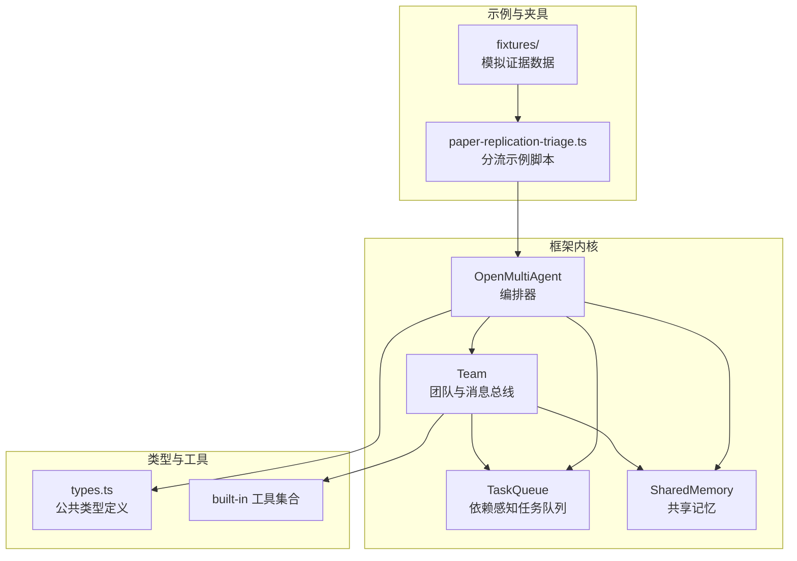
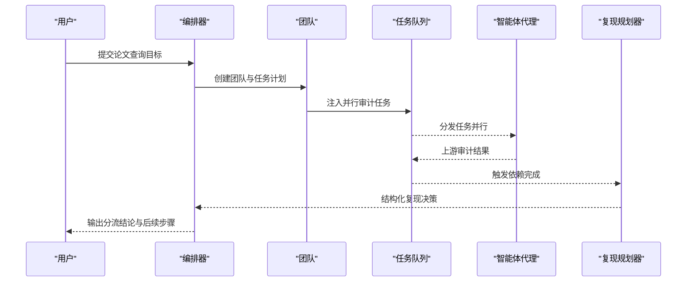
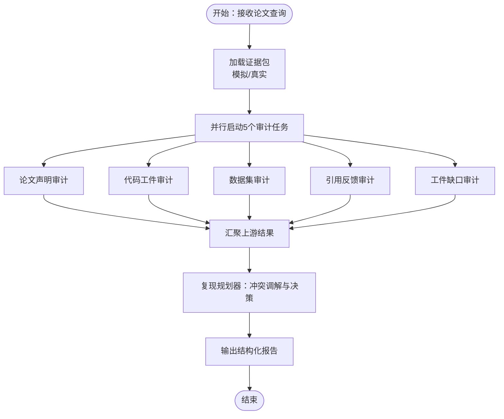
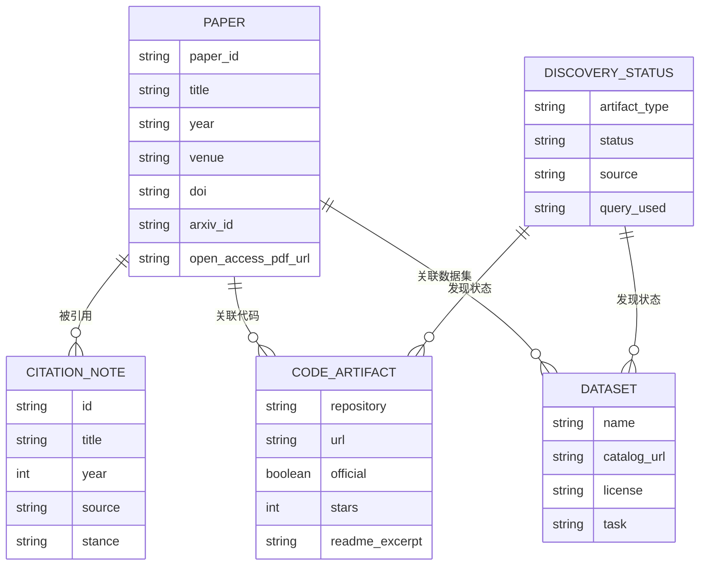
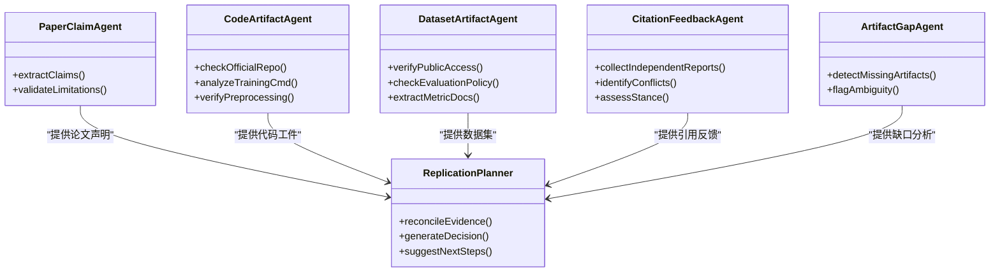
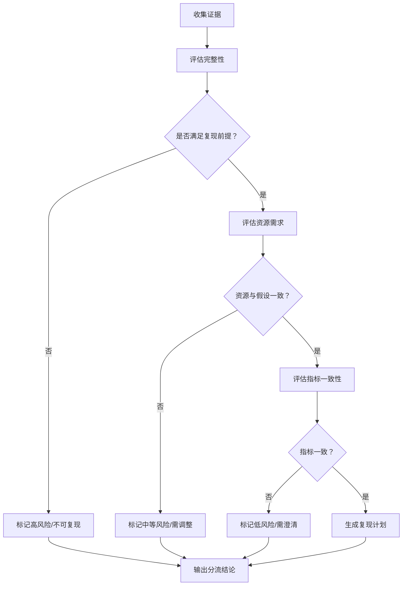
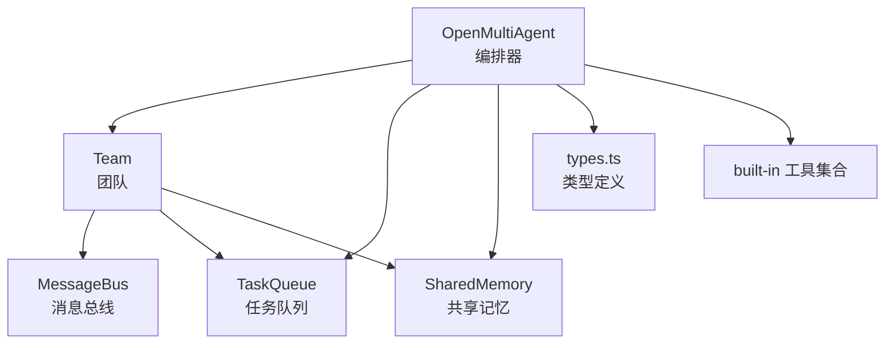

# 论文复现分流系统

<cite>
**本文档引用的文件**
- [paper-replication-triage.ts](file://examples/cookbook/paper-replication-triage.ts)
- [README.md](file://examples/fixtures/paper-replication-triage/README.md)
- [citation-feedback.json](file://examples/fixtures/paper-replication-triage/citation-feedback.json)
- [code-artifacts.json](file://examples/fixtures/paper-replication-triage/code-artifacts.json)
- [dataset-artifacts.json](file://examples/fixtures/paper-replication-triage/dataset-artifacts.json)
- [scholarly-metadata.json](file://examples/fixtures/paper-replication-triage/scholarly-metadata.json)
- [source-index.json](file://examples/fixtures/paper-replication-triage/source-index.json)
- [index.ts](file://src/index.ts)
- [types.ts](file://src/types.ts)
- [orchestrator.ts](file://src/orchestrator/orchestrator.ts)
- [team.ts](file://src/team/team.ts)
- [shared.ts](file://src/memory/shared.ts)
- [queue.ts](file://src/task/queue.ts)
- [index.ts](file://src/tool/built-in/index.ts)
- [README.md](file://README.md)
</cite>

## 目录
1. [简介](#简介)
2. [项目结构](#项目结构)
3. [核心组件](#核心组件)
4. [架构总览](#架构总览)
5. [详细组件分析](#详细组件分析)
6. [依赖关系分析](#依赖关系分析)
7. [性能考虑](#性能考虑)
8. [故障排除指南](#故障排除指南)
9. [结论](#结论)
10. [附录](#附录)

## 简介
本系统是一个面向学术论文复现验证的自动化分流与决策平台，基于多智能体编排框架构建。其目标是通过并行审计多个证据源（学术元数据、代码工件、数据集信息、引用反馈等），自动识别冲突与缺失项，生成结构化复现决策与后续行动清单。系统支持离线模拟与在线真实数据两种模式，具备完善的可观测性、共享记忆、任务编排与重试机制，适用于学术写作、研究复现与质量保障场景。

## 项目结构
该仓库采用模块化组织方式，核心能力由以下层次构成：
- 示例与夹具层：提供论文复现分流的端到端示例与模拟证据数据
- 框架内核层：多智能体编排、任务队列、共享内存、工具系统
- 类型与适配器层：统一的类型定义、LLM适配器与工具接口
- 文档与配置：使用指南、提供商配置、上下文管理与可观测性

**图表来源**
- [paper-replication-triage.ts:1-800](file://examples/cookbook/paper-replication-triage.ts#L1-L800)
- [index.ts:1-201](file://src/index.ts#L1-L201)
- [team.ts:1-346](file://src/team/team.ts#L1-L346)
- [queue.ts:1-470](file://src/task/queue.ts#L1-L470)
- [shared.ts:1-335](file://src/memory/shared.ts#L1-L335)
- [types.ts:1-800](file://src/types.ts#L1-L800)
- [index.ts:1-75](file://src/tool/built-in/index.ts#L1-L75)

**章节来源**
- [README.md:217-264](file://README.md#L217-L264)
- [index.ts:1-201](file://src/index.ts#L1-L201)

## 核心组件
- 多智能体编排器（OpenMultiAgent）：负责任务分解、并发执行、进度回调与追踪事件
- 团队（Team）：维护代理名单、消息总线、任务队列与共享内存
- 任务队列（TaskQueue）：拓扑依赖解析、状态流转与级联失败/跳过传播
- 共享记忆（SharedMemory）：命名空间化的键值存储，支持TTL与摘要生成
- 工具系统：内置工具集合与自定义工具注册，支持MCP集成
- 类型系统：统一的消息块、工具定义、运行时结果与追踪事件类型

**章节来源**
- [orchestrator.ts:1-800](file://src/orchestrator/orchestrator.ts#L1-L800)
- [team.ts:1-346](file://src/team/team.ts#L1-L346)
- [queue.ts:1-470](file://src/task/queue.ts#L1-L470)
- [shared.ts:1-335](file://src/memory/shared.ts#L1-L335)
- [index.ts:1-75](file://src/tool/built-in/index.ts#L1-L75)
- [types.ts:1-800](file://src/types.ts#L1-L800)

## 架构总览
论文复现分流系统采用“目标驱动”的协调者模式：给定一个论文查询目标，协调者将目标分解为并行的证据审计任务，随后由专门的智能体分别审计学术元数据、代码工件、数据集信息与引用反馈，最终由规划器进行冲突调解与复现决策。

**图表来源**
- [paper-replication-triage.ts:2664-2758](file://examples/cookbook/paper-replication-triage.ts#L2664-L2758)
- [orchestrator.ts:561-800](file://src/orchestrator/orchestrator.ts#L561-L800)
- [team.ts:88-151](file://src/team/team.ts#L88-L151)
- [queue.ts:68-139](file://src/task/queue.ts#L68-L139)

## 详细组件分析

### 论文复现分流示例（paper-replication-triage.ts）
该示例展示了完整的多源证据审计与冲突调解流程：
- 数据加载与模式选择：支持模拟夹具与在线真实数据（SOURCE_MODE=mock/live）
- 智能体角色划分：论文声明审计、代码工件审计、数据集审计、引用反馈审计、工件缺口审计、复现规划
- 并行执行与依赖：前5个任务并行，最后由规划器汇聚输出
- 结构化输出：规划器返回JSON格式的复现决策、冲突列表、缺失工件与最小下一步

**图表来源**
- [paper-replication-triage.ts:2687-2727](file://examples/cookbook/paper-replication-triage.ts#L2687-L2727)
- [paper-replication-triage.ts:2739-2758](file://examples/cookbook/paper-replication-triage.ts#L2739-L2758)

**章节来源**
- [paper-replication-triage.ts:1-800](file://examples/cookbook/paper-replication-triage.ts#L1-L800)
- [paper-replication-triage.ts:2664-2758](file://examples/cookbook/paper-replication-triage.ts#L2664-L2758)

### 多模态证据整合与冲突调解
系统通过统一的数据模型整合来自不同证据源的信息：
- 学术元数据：论文标题、作者、年份、会议、DOI、TL;DR、声明与局限性
- 代码工件：官方仓库状态、非官方仓库线索、训练入口、预处理脚本、GPU数量与指标实现
- 数据集工件：数据集名称、公开状态、访问策略、评估政策与度量文档
- 引用反馈：交叉引用笔记、独立复现实验、冲突信号与立场
- 发现状态：已发现、缺失、模糊工件的索引与查询记录

**图表来源**
- [scholarly-metadata.json:1-35](file://examples/fixtures/paper-replication-triage/scholarly-metadata.json#L1-L35)
- [code-artifacts.json:1-66](file://examples/fixtures/paper-replication-triage/code-artifacts.json#L1-L66)
- [dataset-artifacts.json:1-48](file://examples/fixtures/paper-replication-triage/dataset-artifacts.json#L1-L48)
- [citation-feedback.json:1-57](file://examples/fixtures/paper-replication-triage/citation-feedback.json#L1-L57)
- [source-index.json:1-65](file://examples/fixtures/paper-replication-triage/source-index.json#L1-L65)

**章节来源**
- [README.md:1-39](file://examples/fixtures/paper-replication-triage/README.md#L1-L39)
- [scholarly-metadata.json:1-35](file://examples/fixtures/paper-replication-triage/scholarly-metadata.json#L1-L35)
- [code-artifacts.json:1-66](file://examples/fixtures/paper-replication-triage/code-artifacts.json#L1-L66)
- [dataset-artifacts.json:1-48](file://examples/fixtures/paper-replication-triage/dataset-artifacts.json#L1-L48)
- [citation-feedback.json:1-57](file://examples/fixtures/paper-replication-triage/citation-feedback.json#L1-L57)
- [source-index.json:1-65](file://examples/fixtures/paper-replication-triage/source-index.json#L1-L65)

### 智能体在不同阶段的作用
- 文献检索阶段：论文声明审计智能体从学术元数据中提取声明与局限性
- 代码审查阶段：代码工件审计智能体检查官方仓库状态、训练命令与指标实现
- 数据验证阶段：数据集审计智能体确认数据集公开性、访问策略与评估政策
- 实验复现阶段：引用反馈审计智能体汇总独立复现实验与冲突信号
- 冲突调解阶段：工件缺口审计智能体识别缺失与模糊工件；复现规划器综合所有证据，输出冲突列表、缺失工件与最小下一步

**图表来源**
- [paper-replication-triage.ts:2372-2680](file://examples/cookbook/paper-replication-triage.ts#L2372-L2680)

**章节来源**
- [paper-replication-triage.ts:2372-2680](file://examples/cookbook/paper-replication-triage.ts#L2372-L2680)

### 分流决策机制设计
系统通过以下机制实现分流与决策：
- 复现难度评估：基于证据完整性（是否找到官方仓库、是否缺少预处理脚本）、数据集访问限制（是否需要申请）、指标一致性（宏F1 vs 微F1）与计算资源假设（单GPU vs 多GPU）
- 资源需求分析：统计训练命令默认GPU数量、数据集访问策略与预处理脚本可用性
- 优先级排序：规划器根据冲突严重性、缺失工件数量与最小下一步的可行性进行排序
- 冲突调解：当证据存在矛盾时，规划器输出调解建议与缓解措施

**图表来源**
- [paper-replication-triage.ts:2338-2366](file://examples/cookbook/paper-replication-triage.ts#L2338-L2366)
- [paper-replication-triage.ts:2687-2727](file://examples/cookbook/paper-replication-triage.ts#L2687-L2727)

**章节来源**
- [paper-replication-triage.ts:2338-2366](file://examples/cookbook/paper-replication-triage.ts#L2338-L2366)

### 版本控制与实验跟踪
- 版本控制：通过任务队列的状态流转与共享记忆的摘要功能，记录每个阶段的产出与变更
- 实验跟踪：编排器提供进度事件与追踪事件，支持渲染静态HTML仪表盘以回放任务DAG与节点指标

**章节来源**
- [queue.ts:131-158](file://src/task/queue.ts#L131-L158)
- [shared.ts:251-294](file://src/memory/shared.ts#L251-L294)
- [orchestrator.ts:707-720](file://src/orchestrator/orchestrator.ts#L707-L720)
- [README.md:139-140](file://README.md#L139-L140)

### 处理不完整或矛盾的研究报告
- 不完整报告：通过工件缺口审计识别缺失项（如官方仓库缺失、预处理脚本缺失、数据集访问受限），并在规划器输出中明确列出
- 矛盾报告：通过引用反馈与指标一致性检查识别矛盾（如宏F1与微F1差异、Holdout标签不可用），在冲突列表中给出调解建议

**章节来源**
- [paper-replication-triage.ts:2687-2727](file://examples/cookbook/paper-replication-triage.ts#L2687-L2727)
- [code-artifacts.json:48-64](file://examples/fixtures/paper-replication-triage/code-artifacts.json#L48-L64)
- [dataset-artifacts.json:37-46](file://examples/fixtures/paper-replication-triage/dataset-artifacts.json#L37-L46)
- [citation-feedback.json:44-56](file://examples/fixtures/paper-replication-triage/citation-feedback.json#L44-L56)

## 依赖关系分析
系统内部模块之间的依赖关系如下：

**图表来源**
- [index.ts:57-198](file://src/index.ts#L57-L198)
- [team.ts:1-346](file://src/team/team.ts#L1-L346)
- [queue.ts:1-470](file://src/task/queue.ts#L1-L470)
- [shared.ts:1-335](file://src/memory/shared.ts#L1-L335)
- [types.ts:1-800](file://src/types.ts#L1-L800)
- [index.ts:1-75](file://src/tool/built-in/index.ts#L1-L75)

**章节来源**
- [index.ts:1-201](file://src/index.ts#L1-L201)

## 性能考虑
- 并行执行：默认最大并发度为5，可根据资源与API配额调整
- 令牌预算：支持全局令牌上限与单次任务重试，避免过度消耗
- 上下文压缩：提供滑动窗口、摘要与紧凑压缩策略，减少长对话开销
- 重试退避：指数退避延迟，避免瞬时错误放大

**章节来源**
- [orchestrator.ts:247-333](file://src/orchestrator/orchestrator.ts#L247-L333)
- [types.ts:124-152](file://src/types.ts#L124-L152)
- [README.md:317-328](file://README.md#L317-L328)

## 故障排除指南
- 令牌预算超限：触发预算耗尽事件，后续任务被跳过
- 任务失败级联：失败会向下游传播，阻塞任务被标记为失败
- 空闲轮询：使用事件回调与追踪事件替代轮询，便于调试
- 代理循环检测：可配置循环检测策略，防止代理陷入重复输出

**章节来源**
- [orchestrator.ts:733-747](file://src/orchestrator/orchestrator.ts#L733-L747)
- [queue.ts:212-225](file://src/task/queue.ts#L212-L225)
- [types.ts:537-566](file://src/types.ts#L537-L566)

## 结论
论文复现分流系统通过多智能体编排与结构化证据整合，实现了从目标到决策的自动化流水线。系统支持离线模拟与在线真实数据，具备完善的冲突调解、资源需求分析与优先级排序能力，适用于学术复现、研究质量保障与写作辅助场景。通过共享记忆与可观测性，系统能够持续优化复现流程并提升可追溯性。

## 附录
- 快速开始：安装依赖后设置提供商密钥，运行分流示例脚本
- 支持的提供商：Anthropic、OpenAI、Gemini、Azure OpenAI、GitHub Copilot、xAI Grok、DeepSeek、MiniMax、Qiniu、AWS Bedrock
- 可观测性：进度事件、追踪事件与静态仪表盘渲染

**章节来源**
- [README.md:47-103](file://README.md#L47-L103)
- [README.md:273-292](file://README.md#L273-L292)
- [README.md:139-140](file://README.md#L139-L140)