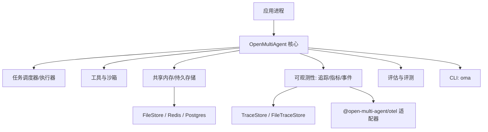
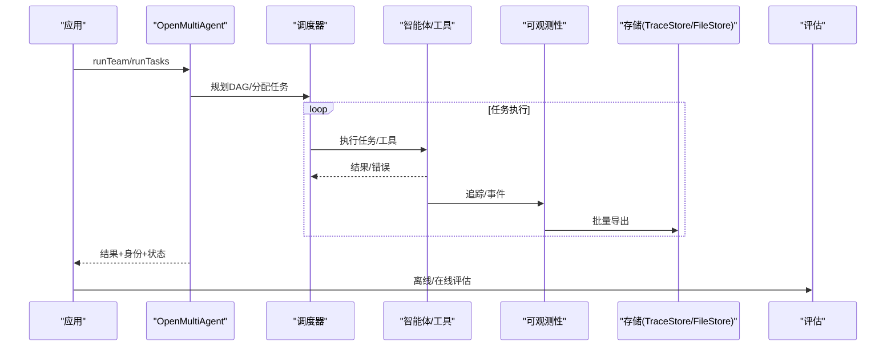
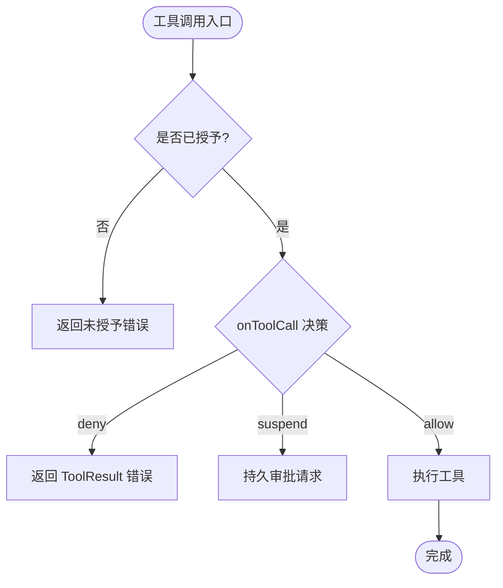
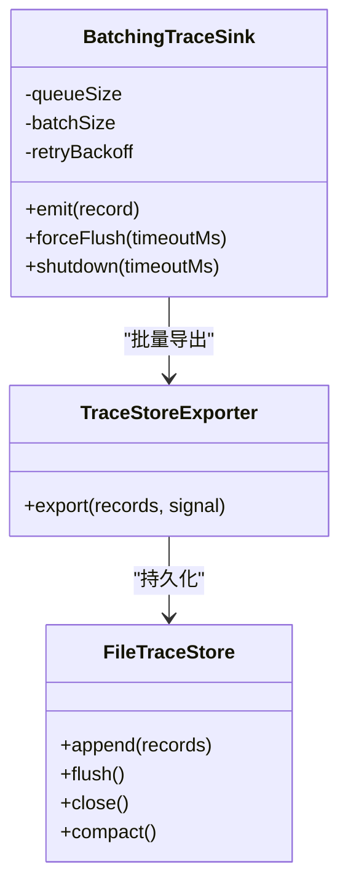
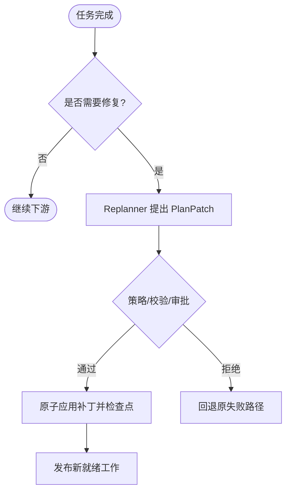
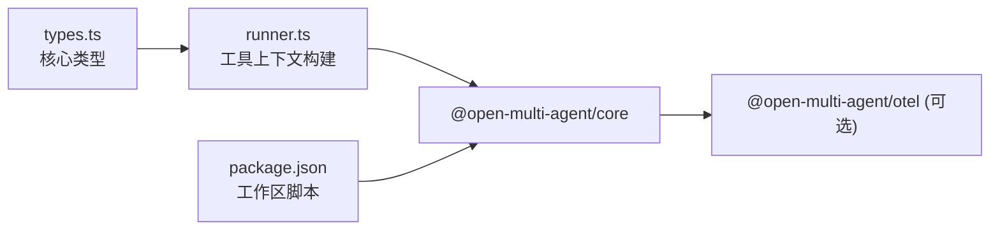

# 企业实践

<cite>
**本文引用的文件**
- [README.md](file://README.md)
- [package.json](file://package.json)
- [AGENTS.md](file://AGENTS.md)
- [observability.md](file://docs/observability.md)
- [checkpoint.md](file://docs/checkpoint.md)
- [adaptive-recovery.md](file://docs/adaptive-recovery.md)
- [tool-configuration.md](file://docs/tool-configuration.md)
- [providers.md](file://docs/providers.md)
- [evaluation.md](file://docs/evaluation.md)
- [shared-memory.md](file://docs/shared-memory.md)
- [durable-approvals.md](file://docs/durable-approvals.md)
- [cli.md](file://docs/cli.md)
- [types.ts](file://packages/core/src/types.ts)
- [runner.ts](file://packages/core/src/agent/runner.ts)
</cite>

## 目录
1. [简介](#简介)
2. [项目结构](#项目结构)
3. [核心组件](#核心组件)
4. [架构总览](#架构总览)
5. [详细组件分析](#详细组件分析)
6. [依赖关系分析](#依赖关系分析)
7. [性能与可观测性](#性能与可观测性)
8. [故障恢复策略](#故障恢复策略)
9. [安全与合规最佳实践](#安全与合规最佳实践)
10. [生产部署与运维手册](#生产部署与运维手册)
11. [测试策略与质量保证](#测试策略与质量保证)
12. [结论](#结论)

## 简介
本指南面向企业级生产环境，围绕安全配置、监控集成、故障恢复、部署架构、配置与脚本、以及测试与质量保障，提供基于 Open Multi-Agent（OMA）的最佳实践。内容覆盖访问控制、数据加密、审计日志、合规要求；指标收集、日志聚合、告警配置、性能分析；检查点机制、重试策略、降级处理与灾难恢复；容器化部署、负载均衡、服务发现与配置管理；并提供配置文件示例、部署脚本与运维手册要点。同时给出评估与质量门禁方案，帮助在生产中持续验证稳定性与正确性。

## 项目结构
仓库采用 npm workspaces 多包组织：
- @open-multi-agent/core：编排运行时、工具、记忆、检查点、可观测性、CLI、离线 Run Viewer。
- @open-multi-agent/otel：可选的 OpenTelemetry 适配器，独立版本发布。
- create-oma-app：脚手架与模板。
- docs：子系统行为与运行指南的权威文档。
- scripts：示例与可观测性基准、CI 脚本等。

图表来源
- [AGENTS.md:64-70](file://AGENTS.md#L64-L70)
- [observability.md:185-223](file://docs/observability.md#L185-L223)
- [checkpoint.md:49-73](file://docs/checkpoint.md#L49-L73)

章节来源
- [AGENTS.md:5-15](file://AGENTS.md#L5-L15)
- [package.json:1-34](file://package.json#L1-L34)

## 核心组件
- 编排与执行：runAgent/runTeam/runTasks，动态生成任务 DAG，确定性调度，结果聚合。
- 工具与权限：默认拒绝内置工具，按预设/白名单/黑名单授予；onToolCall 逐调用门控；bash 不沙箱化，文件系统工具路径受限。
- 共享内存与持久化：InMemoryStore/FileStore/自定义 MemoryStore；RedactingStore 脱敏写入。
- 可观测性：v2 TraceRecord、BatchingTraceSink、TraceStore、Run Viewer、OTel 适配。
- 评估：离线 EvalSet、在线采样、评分器、门禁与基线对比。
- 恢复与治理：检查点与恢复、自适应修复、持久审批门、共识验证。

章节来源
- [README.md:46-108](file://README.md#L46-L108)
- [tool-configuration.md:214-238](file://docs/tool-configuration.md#L214-L238)
- [shared-memory.md:1-47](file://docs/shared-memory.md#L1-L47)
- [observability.md:151-223](file://docs/observability.md#L151-L223)
- [evaluation.md:1-19](file://docs/evaluation.md#L1-L19)

## 架构总览
下图展示生产环境中 OMA 的核心交互：应用通过 OpenMultiAgent 发起 runTeam/runTasks，内部由协调器生成任务图并调度执行；工具在沙箱内运行；可观测性以 sink/exporter 形式输出到本地文件或 OTel；评估在后台或离线进行；检查点与恢复确保中断后可续跑。

图表来源
- [observability.md:185-223](file://docs/observability.md#L185-L223)
- [checkpoint.md:109-143](file://docs/checkpoint.md#L109-L143)
- [evaluation.md:140-188](file://docs/evaluation.md#L140-L188)

## 详细组件分析

### 安全与访问控制
- 工具默认拒绝：仅显式授予内置工具；支持 toolPreset、allowlist/denylist；注册自定义工具即视为授予但仍受 disallowedTools 约束。
- 逐调用门控 onToolCall：在输入校验后、执行前决定 allow/deny/suspend；suspend 可与检查点结合实现持久审批。
- 沙箱边界：文件系统工具限制在 cwd 根下；bash 不沙箱化，需进程隔离。
- 凭据作用域：AgentConfig.credentials 为每智能体隔离读取，避免共享密钥泄露。
- 后果性工具确认：对未声明治理意图的自动 runTeam 或 runAgent，可开启 requireConsequentialConfirmation 强制人工确认。

图表来源
- [tool-configuration.md:214-238](file://docs/tool-configuration.md#L214-L238)
- [tool-configuration.md:326-363](file://docs/tool-configuration.md#L326-L363)
- [tool-configuration.md:391-441](file://docs/tool-configuration.md#L391-L441)
- [tool-configuration.md:469-505](file://docs/tool-configuration.md#L469-L505)

章节来源
- [tool-configuration.md:214-238](file://docs/tool-configuration.md#L214-L238)
- [tool-configuration.md:326-363](file://docs/tool-configuration.md#L326-L363)
- [tool-configuration.md:391-441](file://docs/tool-configuration.md#L391-L441)
- [tool-configuration.md:469-505](file://docs/tool-configuration.md#L469-L505)

### 数据加密与隐私
- 追踪与仪表默认不采集提示词、补全、工具入参与结果；敏感字段会被脱敏。
- 持久化路径（共享内存、检查点）不会自动脱敏；使用 RedactingStore 在写入时脱敏。
- 审批记录与检查点包含原始内容，需配合访问控制与加密存储。

章节来源
- [observability.md:743-768](file://docs/observability.md#L743-L768)
- [shared-memory.md:29-47](file://docs/shared-memory.md#L29-L47)
- [checkpoint.md:172-204](file://docs/checkpoint.md#L172-L204)
- [durable-approvals.md:149-162](file://docs/durable-approvals.md#L149-L162)

### 审计日志与合规
- 运行身份与状态：每次执行返回 identity（runId/attempt/traceId/rootSpanId）与 status（ok/error/cancelled/timeout/budget_exhausted/rejected/skipped）。
- 执行收据：buildExecutionReceipt 产出实际拓扑、角色、依赖边、token/时长、是否部分等，用于治理结论与审计。
- 治理结论：required 角色与顺序必须被观测到，否则 unsatisfied；budget 耗尽会披露原因。
- 保留与删除：TraceStore 支持 maxAge/maxRuns/状态范围保留；删除幂等且立即生效。

章节来源
- [observability.md:12-83](file://docs/observability.md#L12-L83)
- [observability.md:84-143](file://docs/observability.md#L84-L143)
- [observability.md:430-446](file://docs/observability.md#L430-L446)
- [tool-configuration.md:5-46](file://docs/tool-configuration.md#L5-L46)

### 监控集成（指标、日志、告警、性能）
- 追踪层：v2 TraceRecord + Batch 导出；支持 InMemoryTraceStore 与 FileTraceStore；支持 OTel 适配器。
- 进度事件：onProgress 轻量生命周期事件，适合终端/UI。
- 批处理与回退：队列容量、批次大小、超时、重试、退避、丢弃优先级均有默认上限；失败不影响业务结果。
- 关闭与刷新：forceFlush/shutdown 明确生命周期；长服务需在优雅停机中 flush 并关闭 exporter。
- 指标建议：将 token/成本/延迟/错误率纳入指标；避免高基数标签；结合 OTel 统一接入。

图表来源
- [observability.md:185-223](file://docs/observability.md#L185-L223)
- [observability.md:255-384](file://docs/observability.md#L255-L384)
- [observability.md:527-600](file://docs/observability.md#L527-L600)

章节来源
- [observability.md:185-223](file://docs/observability.md#L185-L223)
- [observability.md:527-600](file://docs/observability.md#L527-L600)
- [observability.md:602-668](file://docs/observability.md#L602-L668)

### 故障恢复（检查点、重试、降级、灾难恢复）
- 检查点：在安全边界保存执行快照；支持 FileStore 原子写入；恢复时重建队列与共享内存，跳过已完成任务，重放工具结果。
- 中间工具恢复：每个工具调用有独立提交记录；缺失则保守重放；并行工具相互独立。
- 自适应恢复：允许在任务完成后对未执行部分进行补丁（新增/重定向/替代），经策略与检查点后原子应用。
- 重试与预算：任务级别支持 maxRetries/retryDelayMs/retryBackoff；不可重试的终止错误自动跳过；token/成本预算在边界处检查。
- 灾难恢复：结合检查点与外部系统幂等键（toolCallId）保证外部副作用一致性；必要时启动新逻辑运行。

图表来源
- [adaptive-recovery.md:1-22](file://docs/adaptive-recovery.md#L1-L22)
- [adaptive-recovery.md:82-119](file://docs/adaptive-recovery.md#L82-L119)
- [checkpoint.md:206-249](file://docs/checkpoint.md#L206-L249)

章节来源
- [checkpoint.md:109-143](file://docs/checkpoint.md#L109-L143)
- [checkpoint.md:206-249](file://docs/checkpoint.md#L206-L249)
- [adaptive-recovery.md:1-22](file://docs/adaptive-recovery.md#L1-L22)
- [adaptive-recovery.md:82-119](file://docs/adaptive-recovery.md#L82-L119)

### 部署架构（容器化、负载均衡、服务发现、配置管理）
- 容器化：将 Node 应用打包镜像，环境变量注入模型密钥与端点；使用只读根文件系统与最小权限用户。
- 负载均衡：HTTP 网关前置，健康检查指向应用探针；无状态扩展实例。
- 服务发现：Kubernetes Service/Ingress 暴露 API；内部服务间通过 DNS 与服务网格通信。
- 配置管理：集中化 Secret/ConfigMap 管理 provider 密钥与端点；运行时通过环境变量注入；避免硬编码。
- 可观测性：侧车或 DaemonSet 收集日志与指标；TraceStore 落盘或远端 OTLP 上报。

（本节为通用实践说明，不直接引用具体代码文件）

### 完整配置示例与脚本
- CLI 团队/任务/编排 JSON：见 cli.md 中的 Team/Tasks/Orchestrator 片段。
- Provider 模板：oma provider template <provider> 输出占位 JSON。
- 评估 CLI：oma eval run/gate 支持报告与门禁。
- 仪表盘：oma run --dashboard 或 oma dashboard 导出静态 HTML。

章节来源
- [cli.md:193-301](file://docs/cli.md#L193-L301)
- [cli.md:93-185](file://docs/cli.md#L93-L185)
- [cli.md:304-413](file://docs/cli.md#L304-L413)

## 依赖关系分析
- 核心与可选包解耦：core 不引入 otel；应用按需安装并持有 tracerProvider 生命周期。
- 类型与运行时：types.ts 定义 OrchestratorConfig、Task、ModelRouteConfig 等关键契约；runner.ts 构建工具上下文（agent/model/cwd/credentials）。
- 工作区命令：根 package.json 提供 build/test/lint 等跨工作区脚本。

图表来源
- [types.ts:2149-2210](file://packages/core/src/types.ts#L2149-L2210)
- [runner.ts:1795-1811](file://packages/core/src/agent/runner.ts#L1795-L1811)
- [package.json:1-34](file://package.json#L1-L34)

章节来源
- [types.ts:2149-2210](file://packages/core/src/types.ts#L2149-L2210)
- [runner.ts:1795-1811](file://packages/core/src/agent/runner.ts#L1795-L1811)
- [package.json:1-34](file://package.json#L1-L34)

## 性能与可观测性
- 追踪开销：BatchingTraceSink 默认队列/批次/超时/重试均有限制；溢出按优先级丢弃；诊断默认限频。
- 指标设计：避免高基数标签；使用低维维度（服务、环境、版本）；token/成本/延迟/错误率作为核心指标。
- 性能调优：合理设置 batch size、scheduled delay、export timeout；对慢后端启用超时与熔断；对热点任务启用缓存或压缩。
- 发布就绪：遵循 observability-release-readiness 与 performance 文档中的基准与回归门禁。

章节来源
- [observability.md:572-600](file://docs/observability.md#L572-L600)
- [observability.md:459-525](file://docs/observability.md#L459-L525)

## 故障恢复策略
- 检查点：在安全边界保存快照；FileStore 原子写入；恢复时重放已完成工具结果，避免重复副作用。
- 重试策略：任务级重试与指数退避；不可重试错误自动跳过；预算耗尽及时停止。
- 降级处理：preferredUnderBudget=degrade 在预算紧张时降级为单智能体路径；路由策略可切换。
- 灾难恢复：结合外部系统幂等键与检查点；必要时启动新逻辑运行；保留历史修订与证据。

章节来源
- [checkpoint.md:109-143](file://docs/checkpoint.md#L109-L143)
- [checkpoint.md:206-249](file://docs/checkpoint.md#L206-L249)
- [adaptive-recovery.md:1-22](file://docs/adaptive-recovery.md#L1-L22)
- [tool-configuration.md:96-138](file://docs/tool-configuration.md#L96-L138)

## 安全与合规最佳实践
- 访问控制：默认拒绝内置工具；最小权限授予；onToolCall 细粒度门控；后果性工具强制确认。
- 数据加密：传输层 TLS；静态数据加密（磁盘/对象存储）；Secrets 管理（KMS/Secrets Manager）。
- 审计日志：开启 v2 追踪与执行收据；保留必要元数据；脱敏敏感信息；保留策略与删除流程。
- 合规要求：数据最小化；访问留痕；审批流（持久审批）；定期审计与演练。

章节来源
- [tool-configuration.md:214-238](file://docs/tool-configuration.md#L214-L238)
- [tool-configuration.md:326-363](file://docs/tool-configuration.md#L326-L363)
- [observability.md:12-83](file://docs/observability.md#L12-L83)
- [durable-approvals.md:1-28](file://docs/durable-approvals.md#L1-L28)

## 生产部署与运维手册
- 启动与配置：通过环境变量注入 provider 密钥与端点；使用 CLI 模板生成 JSON 配置。
- 健康检查：HTTP 探针；可观测性健康端点；资源使用阈值告警。
- 滚动升级：蓝绿/金丝雀；灰度流量；回滚策略。
- 日志与追踪：集中化日志；OTLP 上报；TraceStore 归档与保留策略。
- 备份与恢复：检查点与共享内存备份；灾难恢复演练。

章节来源
- [cli.md:193-301](file://docs/cli.md#L193-L301)
- [observability.md:527-600](file://docs/observability.md#L527-L600)
- [checkpoint.md:49-73](file://docs/checkpoint.md#L49-L73)

## 测试策略与质量保证
- 单元测试：Mock 外部依赖；无网络/无密钥运行。
- 集成测试：真实 provider E2E 仅在必要时运行；凭证安全保管。
- 评估门禁：离线 EvalSet 与在线采样；评分器版本化；基线对比与回归检测。
- 示例与目录：production 示例需包含 README.md、index.ts 与 tests/；目录校验脚本保障完整性。

章节来源
- [evaluation.md:140-188](file://docs/evaluation.md#L140-L188)
- [evaluation.md:492-573](file://docs/evaluation.md#L492-L573)
- [AGENTS.md:50-62](file://AGENTS.md#L50-L62)
- [scripts/example-catalog-lib.mjs:317-360](file://scripts/example-catalog-lib.mjs#L317-L360)

## 结论
通过默认拒绝的工具授权、逐调用门控与沙箱边界，结合检查点与自适应恢复，OMA 为企业级多智能体系统提供了可控、可观测、可恢复的执行基础。配合可观测性 sink/exporter、评估门禁与稳健的部署运维流程，可在生产环境中实现安全、稳定与高效的 AI 工作流交付。建议在上线前完成安全评审、可观测性接入、恢复演练与质量门禁，确保系统在变更与异常下仍具备强韧性与可追溯性。