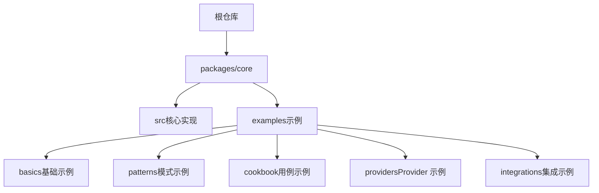
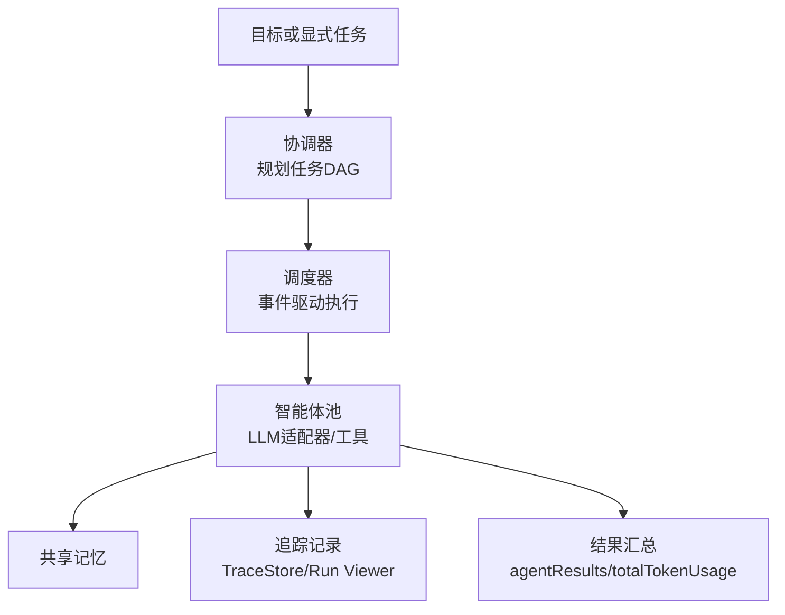
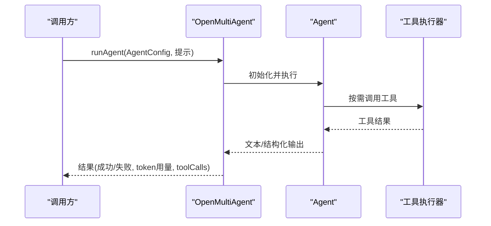
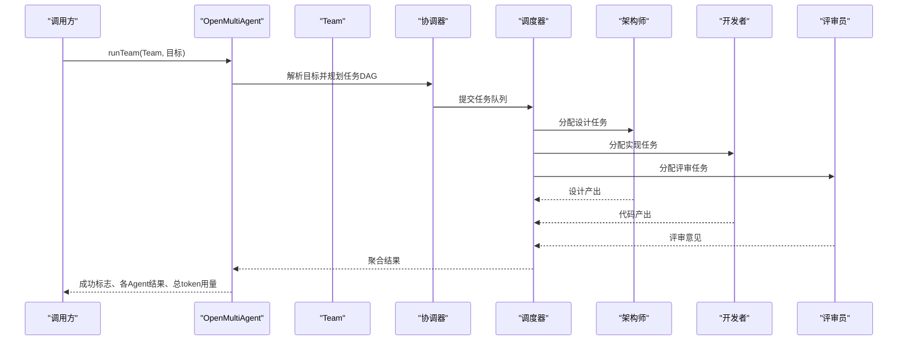
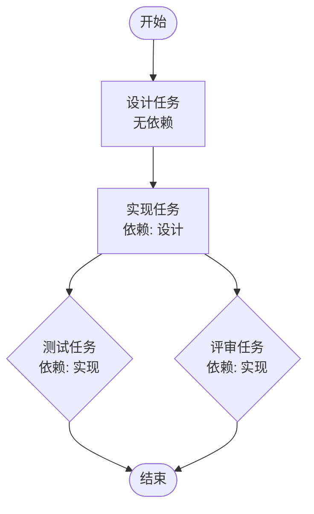
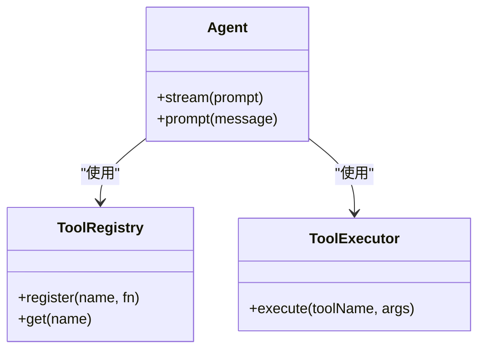
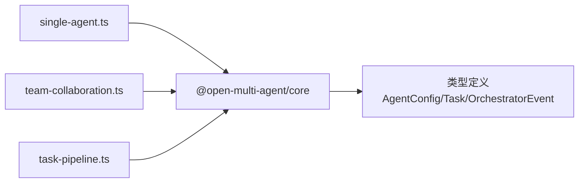

# 基础示例

<cite>
**本文引用的文件**
- [README_zh.md](file://README_zh.md)
- [核心包说明_英文](file://packages/core/README.md)
- [核心包说明_中文](file://packages/core/README_zh.md)
- [示例索引](file://packages/core/examples/README.md)
- [单智能体示例](file://packages/core/examples/basics/single-agent.ts)
- [团队协作示例](file://packages/core/examples/basics/team-collaboration.ts)
- [显式任务流水线示例](file://packages/core/examples/basics/task-pipeline.ts)
</cite>

## 目录
1. [简介](#简介)
2. [项目结构](#项目结构)
3. [核心组件](#核心组件)
4. [架构总览](#架构总览)
5. [详细组件分析](#详细组件分析)
6. [依赖关系分析](#依赖关系分析)
7. [性能与可靠性考虑](#性能与可靠性考虑)
8. [故障排查指南](#故障排查指南)
9. [结论](#结论)
10. [附录：快速上手清单](#附录快速上手清单)

## 简介
本指南面向初学者，带你从零开始使用 Open Multi-Agent（OMA）完成以下目标：
- 创建并运行一个简单智能体，理解系统提示词、模型参数和基本任务执行。
- 使用团队协作模式，体验多智能体分工、自动任务分配与结果聚合。
- 了解工具使用的基础方式，包括内置工具的启用与自定义工具的扩展思路。
- 掌握关键概念：AgentConfig、Team 配置、OpenMultiAgent 编排以及基本工作流模式（runAgent / runTeam / runTasks）。

OMA 的核心思想是“只描述目标，不画任务图”。你只需给出目标或显式任务，框架会在运行时生成任务 DAG、调度执行、共享上下文，并返回可审查、可回放的结果。

**章节来源**
- [README_zh.md:46-96](file://README_zh.md#L46-L96)
- [核心包说明_中文:49-111](file://packages/core/README_zh.md#L49-L111)

## 项目结构
仓库采用多包组织，核心编排能力在 `@open-multi-agent/core`，配套文档与示例位于 `packages/core`。示例按类别划分：basics（基础）、patterns（模式）、cookbook（用例）、providers（Provider 接入）、integrations（集成）等。

**图表来源**
- [示例索引:15-25](file://packages/core/examples/README.md#L15-L25)

**章节来源**
- [示例索引:1-25](file://packages/core/examples/README.md#L1-L25)

## 核心组件
- OpenMultiAgent：编排入口，负责协调器规划、调度、并发控制、预算与观测等。
- AgentConfig：定义单个智能体的名称、模型、系统提示词、工具、最大轮次、温度等。
- Team：由多个 Agent 组成的团队，支持共享记忆、并发度限制等。
- 三种执行模式：
  - 单智能体：runAgent()
  - 自动编排团队：runTeam()
  - 显式任务管线：runTasks()

这些组件共同构成 OMA 的“目标→计划→执行→结果”闭环。

**章节来源**
- [核心包说明_英文:76-111](file://packages/core/README.md#L76-L111)
- [核心包说明_中文:76-111](file://packages/core/README_zh.md#L76-L111)

## 架构总览
下图展示了从目标到结果的典型数据流：Coordinator 将目标拆解为任务 DAG，Scheduler 负责任务派发与顺序，AgentPool 调用 LLM 适配器与工具，SharedMemory 提供跨 Agent 上下文，TraceStore 记录可观测数据。

**图表来源**
- [核心包说明_英文:237-252](file://packages/core/README.md#L237-L252)
- [核心包说明_中文:178-193](file://packages/core/README_zh.md#L178-L193)

## 详细组件分析

### 单智能体：最小可用路径
- 目标：通过 runAgent() 快速完成一次任务，体验系统提示词、工具与输出。
- 关键点：
  - 使用 OpenMultiAgent.runAgent() 传入 AgentConfig 与用户提示。
  - 可选开启内置工具（如 bash、file_read/file_write），注意沙箱目录。
  - 可通过 onProgress 观察 agent_start/complete 等事件。
  - 直接通过 Agent 类进行流式输出或多轮对话。

**图表来源**
- [单智能体示例:28-71](file://packages/core/examples/basics/single-agent.ts#L28-L71)
- [单智能体示例:80-110](file://packages/core/examples/basics/single-agent.ts#L80-L110)

运行说明
- 设置所需环境变量（例如 Anthropic API Key）。
- 在仓库根目录执行示例脚本。
- 查看控制台输出的 agent 事件、最终输出与 token 用量。

输出结果
- 控制台会打印 agent 启动/完成事件、最终输出片段、token 用量统计与工具调用次数。

**章节来源**
- [单智能体示例:1-141](file://packages/core/examples/basics/single-agent.ts#L1-L141)

### 团队协作：自动编排与结果聚合
- 目标：用 runTeam() 让 Coordinator 自动规划任务，将工作分派给不同角色（如架构师、开发者、评审员），并汇总结果。
- 关键点：
  - 定义多个 AgentConfig，分别承担设计、实现、评审职责。
  - 通过 createTeam() 组建团队，可开启 sharedMemory 共享上下文。
  - 使用 onProgress 监听 task_start/complete、agent_start/complete、message、error 等事件。
  - 结果中可获取每个 agent 的输出、工具调用次数与总 token 用量。

**图表来源**
- [团队协作示例:33-63](file://packages/core/examples/basics/team-collaboration.ts#L33-L63)
- [团队协作示例:111-138](file://packages/core/examples/basics/team-collaboration.ts#L111-L138)

运行说明
- 设置 OpenAI 兼容 Provider 的环境变量（如 OPENAI_API_KEY 或 OPENAI_BASE_URL + OMA_MODEL）。
- 运行示例脚本，观察任务与智能体事件日志。

输出结果
- 控制台显示团队创建信息、任务与智能体事件、整体成功状态、token 用量、各 Agent 的工具调用情况，以及开发者与评审员的输出摘要。

**章节来源**
- [团队协作示例:1-178](file://packages/core/examples/basics/team-collaboration.ts#L1-L178)

### 显式任务流水线：依赖驱动的执行
- 目标：通过 runTasks() 显式声明任务及其依赖，构建“设计→实现→测试+评审”的流水线。
- 关键点：
  - 每个任务包含 title、description、assignee、dependsOn、memoryScope 等字段。
  - 框架根据 dependsOn 自动阻塞下游任务，直到依赖完成。
  - 可使用 onProgress 观察任务就绪、完成与错误事件。
  - 结果中包含整体成功标志、token 用量与各 Agent 的工具使用情况。

**图表来源**
- [显式任务流水线示例:123-179](file://packages/core/examples/basics/task-pipeline.ts#L123-L179)

运行说明
- 设置所需环境变量（例如 Anthropic API Key）。
- 运行示例脚本，观察任务就绪与完成事件，以及最终的评审结论。

输出结果
- 控制台显示流水线阶段、任务耗时、整体成功状态、token 用量、各 Agent 使用的工具列表，以及评审结论。

**章节来源**
- [显式任务流水线示例:1-215](file://packages/core/examples/basics/task-pipeline.ts#L1-L215)

### 工具使用基础
- 内置工具：可在 AgentConfig.tools 中启用，如 bash、file_read、file_write、grep 等。文件系统工具默认沙箱到工作区目录，避免误写。
- 自定义工具：通过 ToolRegistry 注册、ToolExecutor 执行；在 Agent 构造时注入，即可在流式或多轮对话中使用。
- 安全建议：默认拒绝危险工具，按需授予读取/执行权限；对后果性工具结合审批或 gate 机制。

**图表来源**
- [单智能体示例:82-96](file://packages/core/examples/basics/single-agent.ts#L82-L96)

**章节来源**
- [单智能体示例:82-96](file://packages/core/examples/basics/single-agent.ts#L82-L96)

### 关键概念速查
- AgentConfig：定义智能体的 name、model、systemPrompt、tools、maxTurns、temperature 等。
- Team：由多个 Agent 组成，支持 sharedMemory、maxConcurrency 等。
- OpenMultiAgent：编排入口，提供 runAgent/runTeam/runTasks，以及 onProgress、预算、并发、路由等配置。
- 执行模式：
  - runAgent()：单智能体一次性任务。
  - runTeam()：自动编排团队，目标驱动。
  - runTasks()：显式任务图，依赖驱动。

**章节来源**
- [核心包说明_英文:76-111](file://packages/core/README.md#L76-L111)
- [核心包说明_中文:76-111](file://packages/core/README_zh.md#L76-L111)

## 依赖关系分析
- 示例依赖 core 包提供的编排能力与类型定义。
- 单智能体示例演示了 Agent 与 ToolRegistry/ToolExecutor 的组合使用。
- 团队协作示例展示了 Team 的创建、onProgress 事件监听与结果聚合。
- 显式任务流水线示例体现了 dependsOn 的任务依赖与事件驱动执行。

**图表来源**
- [单智能体示例:14-16](file://packages/core/examples/basics/single-agent.ts#L14-L16)
- [团队协作示例:16-18](file://packages/core/examples/basics/team-collaboration.ts#L16-L18)
- [显式任务流水线示例:17-19](file://packages/core/examples/basics/task-pipeline.ts#L17-L19)

**章节来源**
- [单智能体示例:14-16](file://packages/core/examples/basics/single-agent.ts#L14-L16)
- [团队协作示例:16-18](file://packages/core/examples/basics/team-collaboration.ts#L16-L18)
- [显式任务流水线示例:17-19](file://packages/core/examples/basics/task-pipeline.ts#L17-L19)

## 性能与可靠性考虑
- 并发与调度：可通过 maxConcurrency 与 schedulingStrategy 控制任务派发策略（如 dependency-first、round-robin、least-busy、capability-match、composite）。
- 预算与超时：设置 maxTurns、timeoutMs、callTimeoutMs、maxTokenBudget、maxCostBudget 以限定工作量与成本。
- 恢复与观测：支持 checkpoint 断点恢复、trace 记录与离线 Run Viewer 回放。
- 工具安全：内置工具默认拒绝，谨慎授予读写/执行权限，必要时结合审批与 gate。

**章节来源**
- [核心包说明_英文:187-222](file://packages/core/README.md#L187-L222)
- [核心包说明_英文:288-316](file://packages/core/README.md#L288-L316)
- [核心包说明_中文:135-163](file://packages/core/README_zh.md#L135-L163)
- [核心包说明_中文:227-248](file://packages/core/README_zh.md#L227-L248)

## 故障排查指南
- 常见问题
  - 未设置 Provider 环境变量导致模型调用失败。
  - 工具权限不足或沙箱目录不可写。
  - 任务依赖未满足导致下游任务无法启动。
  - 并发过高导致资源争用或输出混乱。
- 定位方法
  - 使用 onProgress 监听 agent_start/complete、task_start/complete、message、error 等事件，定位卡点。
  - 检查 result.success、result.agentResults 中的每个 Agent 输出与 toolCalls。
  - 使用 TraceStore 或离线 Run Viewer 回放任务 DAG 与 span 瀑布视图。
- 修复建议
  - 补齐环境变量（如 OPENAI_API_KEY、ANTHROPIC_API_KEY）。
  - 调整 tools 白名单与工作目录权限。
  - 修正 dependsOn 指向正确的任务标题。
  - 降低 maxConcurrency 或改用更合适的调度策略。

**章节来源**
- [团队协作示例:69-105](file://packages/core/examples/basics/team-collaboration.ts#L69-L105)
- [显式任务流水线示例:72-102](file://packages/core/examples/basics/task-pipeline.ts#L72-L102)
- [核心包说明_英文:288-316](file://packages/core/README.md#L288-L316)
- [核心包说明_中文:227-248](file://packages/core/README_zh.md#L227-L248)

## 结论
通过本指南的三个基础示例，你已经掌握了：
- 如何创建并运行单智能体，体验系统提示词、工具与流式输出。
- 如何使用团队协作模式，让 Coordinator 自动规划任务、分配工作并聚合结果。
- 如何构建显式任务流水线，利用依赖关系驱动执行。
- 如何启用内置工具与扩展自定义工具，并在安全边界内使用。
- 如何通过事件、结果对象与可观测工具进行调试与复盘。

建议下一步：
- 阅读更多 patterns 与 cookbook 示例，学习复杂场景下的组合用法。
- 探索 Provider 接入与本地模型部署。
- 在生产环境启用预算、审批、checkpoint 与 trace 观测。

[无需来源：本节为总结性内容]

## 附录：快速上手清单
- 安装与运行
  - 使用脚手架一键初始化并运行 Demo。
  - 或在现有后端引入 @open-multi-agent/core。
- 环境变量
  - 设置对应 Provider 的密钥或端点（如 OPENAI_API_KEY、OPENAI_BASE_URL、OMA_MODEL）。
- 选择执行模式
  - 单智能体：runAgent()
  - 自动团队：runTeam()
  - 显式流水线：runTasks()
- 观察与调试
  - 使用 onProgress 监听事件。
  - 查看 result.agentResults 与 totalTokenUsage。
  - 使用 TraceStore/Run Viewer 回放。

**章节来源**
- [README_zh.md:48-96](file://README_zh.md#L48-L96)
- [核心包说明_中文:57-111](file://packages/core/README_zh.md#L57-L111)
- [示例索引:15-25](file://packages/core/examples/README.md#L15-L25)