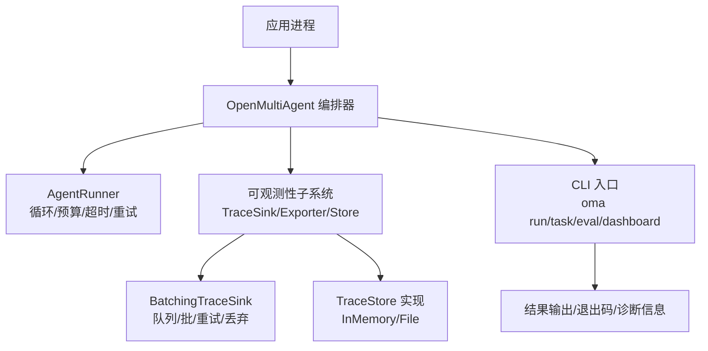
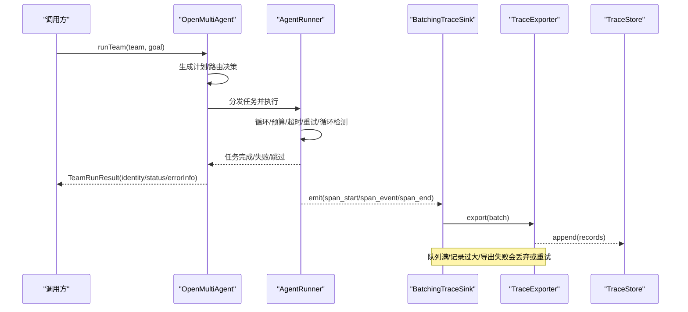
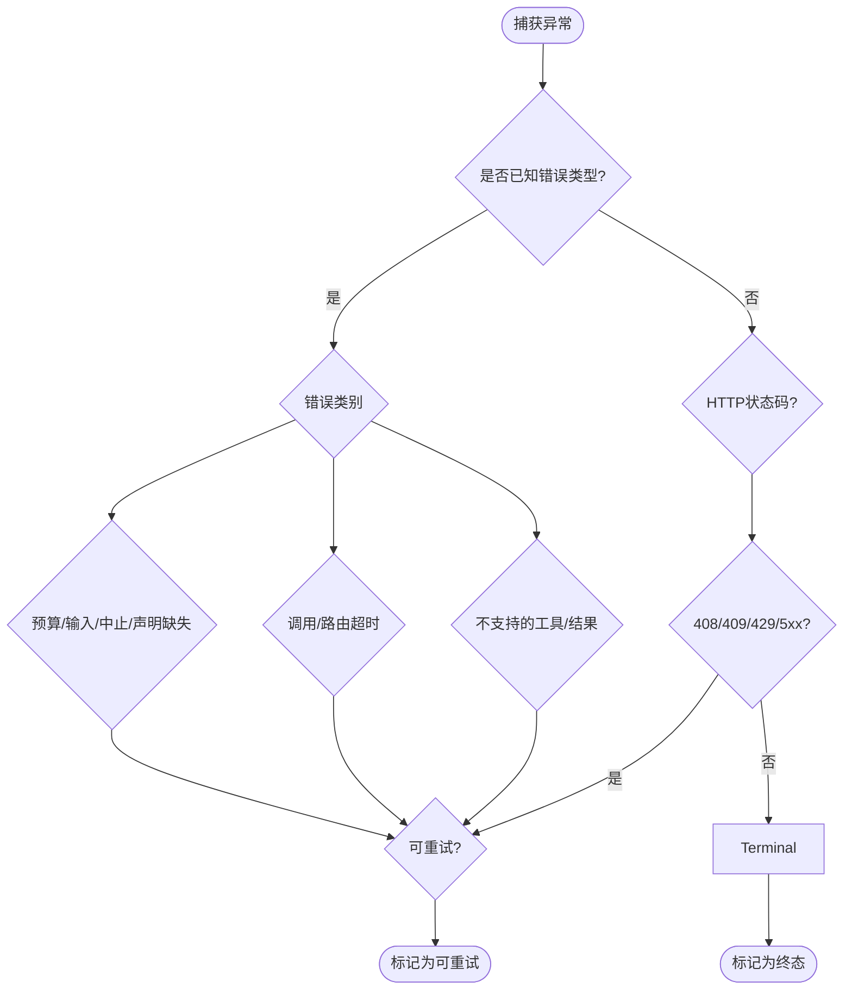
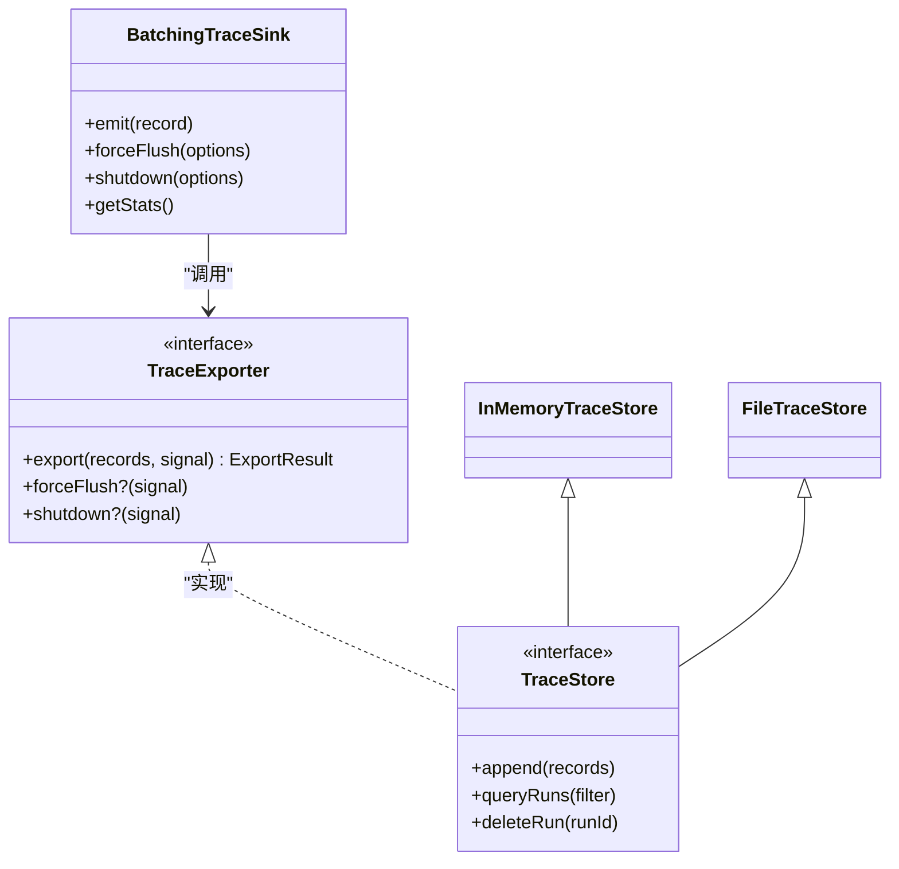
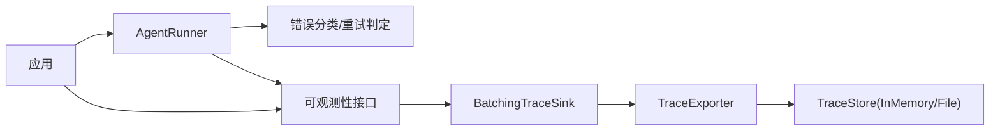

# 故障排查指南

<cite>
**本文引用的文件**
- [README.md](file://README.md)
- [package.json](file://package.json)
- [observability.md](file://docs/observability.md)
- [cli.md](file://docs/cli.md)
- [errors.ts](file://packages/core/src/errors.ts)
- [types.ts](file://packages/core/src/types.ts)
- [runner.ts](file://packages/core/src/agent/runner.ts)
- [batching.ts](file://packages/core/src/observability/batching.ts)
- [file-store.ts](file://packages/core/src/memory/file-store.ts)
- [observability-performance.md](file://docs/observability-performance.md)
</cite>

## 目录
1. [简介](#简介)
2. [项目结构](#项目结构)
3. [核心组件](#核心组件)
4. [架构总览](#架构总览)
5. [详细组件分析](#详细组件分析)
6. [依赖关系分析](#依赖关系分析)
7. [性能注意事项](#性能注意事项)
8. [故障排查指南](#故障排查指南)
9. [结论](#结论)
10. [附录](#附录)

## 简介
本指南面向在生产与本地环境中使用 Open Multi-Agent（OMA）的工程师，提供系统化的问题定位方法、常见故障的诊断与修复步骤、调试工具与技巧、监控指标解读与告警建议，以及社区支持与反馈的最佳实践。内容基于仓库中的可观测性、CLI、错误类型、运行时配置与批处理导出等实现进行归纳，确保每一步都可追溯到具体源码或文档。

## 项目结构
- 根工作区通过 npm workspaces 管理多包；核心编排能力在 packages/core，可选 OTel 集成在 packages/otel，脚手架在 packages/create-oma-app。
- 文档集中在 docs，涵盖可观测性、CLI、评估、执行路由、模型路由、任务调度、共享内存等主题。
- CLI 命令 oma 提供 run、task、eval、dashboard、provider 等子命令，便于脚本化运行与离线回放。

**图示来源**
- [observability.md:185-222](file://docs/observability.md#L185-L222)
- [batching.ts:163-242](file://packages/core/src/observability/batching.ts#L163-L242)
- [cli.md:31-57](file://docs/cli.md#L31-L57)

**章节来源**
- [package.json:1-34](file://package.json#L1-L34)
- [README.md:138-144](file://README.md#L138-L144)

## 核心组件
- 编排与执行：OpenMultiAgent 负责团队/任务/单 Agent 的运行生命周期，包含计划、调度、审批、检查点、恢复、共识等。
- AgentRunner：封装单次 Agent 的 LLM 调用循环、工具调用、令牌预算、调用超时、循环检测、流式事件与错误分类。
- 可观测性：v2 TraceRecord 体系，支持 onTrace 兼容路径与 sinks/exporters 新路径；内置 BatchingTraceSink、InMemoryTraceStore、FileTraceStore；可选 OTel 适配器。
- CLI：oma 命令提供 run/task/eval/dashboard/provider 等能力，统一 JSON 输出与稳定退出码，便于 CI 与脚本集成。
- 错误与状态：框架定义多种错误类与可重试判定逻辑；运行结果包含 identity/status/errorInfo/metadata 等字段。

**章节来源**
- [runner.ts:76-141](file://packages/core/src/agent/runner.ts#L76-L141)
- [observability.md:12-41](file://docs/observability.md#L12-L41)
- [observability.md:185-222](file://docs/observability.md#L185-L222)
- [cli.md:31-57](file://docs/cli.md#L31-L57)
- [errors.ts:11-239](file://packages/core/src/errors.ts#L11-L239)

## 架构总览
下图展示一次 runTeam 的典型执行与可观测数据流，包括计划、任务执行、LLM/工具调用、批处理导出与存储。

**图示来源**
- [observability.md:151-178](file://docs/observability.md#L151-L178)
- [observability.md:185-222](file://docs/observability.md#L185-L222)
- [batching.ts:210-242](file://packages/core/src/observability/batching.ts#L210-L242)
- [batching.ts:351-399](file://packages/core/src/observability/batching.ts#L351-L399)

## 详细组件分析

### 错误与重试策略
- 错误类型覆盖：任务要求不满足、令牌/成本预算超限、LLM 调用超时、路由超时/分析器失败、消息格式非法、不支持的工具调用/结果内容等。
- 可重试判定：对网络抖动、请求超时(408)、冲突(409)、限流(429)、服务端错误(5xx)等视为可重试；预算耗尽、输入非法、用户中止等为终态。
- 运行时表现：AgentRunner 在达到令牌预算时发出 budget_exceeded 事件并抛出 TokenBudgetExceededError；调用超时触发 LLMCallTimeoutError；路由阶段超时触发 RoutingTimeoutError。

**图示来源**
- [errors.ts:11-239](file://packages/core/src/errors.ts#L11-L239)
- [runner.ts:1204-1234](file://packages/core/src/agent/runner.ts#L1204-L1234)

**章节来源**
- [errors.ts:11-239](file://packages/core/src/errors.ts#L11-L239)
- [runner.ts:1204-1234](file://packages/core/src/agent/runner.ts#L1204-L1234)

### 可观测性与追踪
- 运行身份与结果：每次顶层执行返回 identity(runId/attempt/traceId/rootSpanId) 与 status(code/message)，以及 errorInfo。
- TraceRecord v2：span_start/span_event/span_end 构成完整跨度；run root 包含协调器、任务、共识、检查点等；链接表达非树关系（依赖、委派、消费、恢复延续）。
- Sink/Exporter：同步热路径 emit 不阻塞业务；异步 exporter 负责批量投递；失败不影响业务结果但影响统计与诊断。
- 批处理与背压：默认队列上限、记录大小上限、批大小、调度延迟、导出超时、重试次数与退避；队列满时按优先级丢弃（stream_chunk > 其他事件 > span_start > span_end）。
- 存储：InMemoryTraceStore 用于测试/本地；FileTraceStore 提供追加日志、恢复、压缩、删除与保留策略；关闭/flush/fsync 语义明确。
- OTel 适配：将 TraceRecord 映射为 OTel Span/Event/Link；不读取全局 Provider；无内容抓取；仅转发低敏感 allowlist。

**图示来源**
- [observability.md:185-222](file://docs/observability.md#L185-L222)
- [observability.md:224-287](file://docs/observability.md#L224-L287)
- [batching.ts:163-242](file://packages/core/src/observability/batching.ts#L163-L242)
- [batching.ts:351-399](file://packages/core/src/observability/batching.ts#L351-L399)

**章节来源**
- [observability.md:12-41](file://docs/observability.md#L12-L41)
- [observability.md:151-178](file://docs/observability.md#L151-L178)
- [observability.md:185-222](file://docs/observability.md#L185-L222)
- [observability.md:224-287](file://docs/observability.md#L224-L287)
- [observability.md:527-600](file://docs/observability.md#L527-L600)

### CLI 与离线回放
- oma run：执行 runTeam，支持 --dashboard 捕获追踪并生成静态 Run Viewer HTML；stderr 输出路径与诊断，stdout 保持 JSON。
- oma dashboard：只读导出已有 FileTraceStore 中单个 run 的可视化页面；不存在/被占用/关闭失败等均有稳定错误码。
- 输出与退出码：成功/失败/参数校验/模块加载/文件访问/意外错误分别对应不同退出码；JSON 包含 command/success/result/error 等字段。

**章节来源**
- [cli.md:31-57](file://docs/cli.md#L31-L57)
- [cli.md:59-80](file://docs/cli.md#L59-L80)
- [cli.md:304-413](file://docs/cli.md#L304-L413)

### 检查点与共享内存持久化
- FileStore：单进程、追加式、安全边界写入；适合检查点与轻量持久化；跨进程并发需串行化。
- 恢复语义：重启后从上次提交边界恢复；崩溃/断电场景下以 fsync 为持久化边界。

**章节来源**
- [file-store.ts:23-54](file://packages/core/src/memory/file-store.ts#L23-L54)

## 依赖关系分析
- 运行时依赖：Node.js >= 20；核心包 @open-multi-agent/core；可选 @open-multi-agent/otel。
- 内部耦合：AgentRunner 依赖错误分类、追踪、令牌估算、工具授权与结果处理；可观测性子系统解耦 sink/exporter/store，允许替换与组合。
- 外部依赖：LLM 提供商 SDK（由上层注入），OTel SDK（由应用持有并传入）。

**图示来源**
- [runner.ts:76-141](file://packages/core/src/agent/runner.ts#L76-L141)
- [batching.ts:163-242](file://packages/core/src/observability/batching.ts#L163-L242)
- [observability.md:185-222](file://docs/observability.md#L185-L222)

**章节来源**
- [package.json:1-34](file://package.json#L1-L34)
- [README.md:138-144](file://README.md#L138-L144)

## 性能注意事项
- 可观测性开销基线：无 sink 路径回归限制严格；批处理入队 p95、OTel 转换 p95 有明确阈值；CI 使用更宽泛阈值防硬件抖动。
- 批处理默认值：队列记录数、字节上限、单记录大小、批大小、调度延迟、导出超时、重试次数与指数退避等均已内置保护。
- 存储基准：InMemory/File 的 append/query/reopen/compaction 时间范围与文件大小参考已给出，便于容量规划与调优。
- 建议：生产环境优先使用 BatchingTraceSink + 合适的 TraceStore；控制 batch size 与 flush 周期；关注 dropped/failed/queued 指标；必要时调整 retry 策略与超时。

**章节来源**
- [observability-performance.md:8-20](file://docs/observability-performance.md#L8-L20)
- [observability-performance.md:64-118](file://docs/observability-performance.md#L64-L118)
- [batching.ts:14-25](file://packages/core/src/observability/batching.ts#L14-L25)

## 故障排查指南

### 一、系统化问题定位流程
1. 现象描述
   - 收集 runId、attempt、traceId、rootSpanId、status.code、errorInfo、metadata。
   - 记录 CLI 退出码与 stdout/stderr 片段。
2. 快速分诊
   - 若 status.code 为 error/timeout/budget_exhausted/rejected/skipped，优先查看 errorInfo 与最近 span_end。
   - 若为 cancelled，检查上游 AbortSignal 或调用方取消。
3. 定位阶段
   - 使用 Run Viewer 或 TraceStore 查询，聚焦 agent/task/llm_call/tool_call/routing_decision 等关键跨度。
   - 关注 TTFT、token 用量、cost、重试次数、dropped/failed 计数。
4. 根因分析
   - 结合错误类型与 isRetryableError 判断是否应重试。
   - 检查配置项：callTimeoutMs、timeoutMs、maxTokens、maxTurns、loop detection、budget、routing failurePolicy。
5. 验证修复
   - 复现最小用例；逐步放宽/收紧配置；观察指标变化；必要时切换 provider/model。

**章节来源**
- [observability.md:12-41](file://docs/observability.md#L12-L41)
- [observability.md:616-668](file://docs/observability.md#L616-L668)
- [errors.ts:208-239](file://packages/core/src/errors.ts#L208-L239)

### 二、常见问题与解决

#### 1. 配置错误
- 症状：启动即失败、参数校验报错、CLI 提示 usage/validation/io/runtime/internal 错误。
- 排查：
  - 使用 oma provider list/template 核对 provider、apiKey、baseURL 与环境变量。
  - 检查 team/tasks/orchestrator/coordinator JSON 结构与必填字段。
  - 确认 Node 版本与引擎要求。
- 修复：修正 JSON 字段、补齐环境变量、升级 Node。

**章节来源**
- [cli.md:176-185](file://docs/cli.md#L176-L185)
- [cli.md:193-299](file://docs/cli.md#L193-L299)
- [package.json:30-32](file://package.json#L30-L32)

#### 2. 运行时异常
- 令牌/成本预算超限：
  - 现象：budget_exceeded 事件、TokenBudgetExceededError/CostBudgetExceededError。
  - 处理：提高预算或拆分任务；启用结构化输出减少上下文膨胀；降低 maxTokens/maxTurns。
- LLM 调用超时：
  - 现象：LLMCallTimeoutError；status=timeout。
  - 处理：增大 callTimeoutMs；优化 prompt；更换模型/提供商；开启重试（若可重试）。
- 路由超时/分析器失败：
  - 现象：RoutingTimeoutError/RoutingProfilerFailedError。
  - 处理：增大 routing timeout；降级到 fallback；必要时显式声明治理拓扑。
- 非法消息/不支持的工具：
  - 现象：InvalidMessageError/UnsupportedToolCallError/UnsupportedToolResultContentError。
  - 处理：修正消息结构；避免文本后端越界；选择支持的工具集。

**章节来源**
- [runner.ts:1204-1234](file://packages/core/src/agent/runner.ts#L1204-L1234)
- [errors.ts:27-180](file://packages/core/src/errors.ts#L27-L180)
- [types.ts:1084-1093](file://packages/core/src/types.ts#L1084-L1093)

#### 3. 性能瓶颈
- 现象：整体耗时上升、p95 升高、队列积压、dropped/failed 增多。
- 排查：
  - 查看 BatchingTraceSink.getStats() 的 queued/dropped/failed/lastFailureCode。
  - 调整 maxQueueRecords/maxQueueBytes/maxBatchRecords/scheduledDelayMs/exportTimeoutMs。
  - 评估 TraceStore 写入与查询压力，必要时 compact/retention。
- 优化：
  - 降低 stream_chunk 频率或合并；减少不必要属性；使用 InMemoryTraceStore 做本地调试，FileTraceStore 做持久化。
  - 合理设置 retryBackoff/maxRetries，避免雪崩。

**章节来源**
- [batching.ts:14-25](file://packages/core/src/observability/batching.ts#L14-L25)
- [batching.ts:282-315](file://packages/core/src/observability/batching.ts#L282-L315)
- [observability.md:572-600](file://docs/observability.md#L572-L600)

#### 4. 资源耗尽
- 现象：队列满导致丢弃、导出超时、文件写入失败、磁盘空间不足。
- 排查：
  - 关注 queue_full、record_too_large、export_timeout、shutdown_failed 等诊断。
  - 检查 FileTraceStore 的 flush/close/fsync 是否及时调用。
- 修复：
  - 扩大队列/批大小或增加导出并行度；缩短 flush 间隔；定期 compact；清理旧 trace。
  - 确保优雅关闭：先 forceFlush，再 shutdown，最后 close。

**章节来源**
- [batching.ts:210-242](file://packages/core/src/observability/batching.ts#L210-L242)
- [batching.ts:459-499](file://packages/core/src/observability/batching.ts#L459-L499)
- [observability.md:527-570](file://docs/observability.md#L527-L570)

### 三、调试工具与技巧
- 日志与进度：onProgress 获取轻量生命周期事件；stderr 接收 CLI 诊断；stdout 解析 JSON。
- 追踪数据：onTrace 或 sinks 收集 span；使用 renderRunViewer 生成本地 HTML；通过 TraceStore 查询 runs。
- 内存泄漏检测：使用 --expose-gc 配合基准脚本；关注 retained bytes/result；避免长时间持有大对象引用。
- 性能剖析：使用 observability-performance 矩阵与基准脚本；对比 no-sink/legacy/batching/OTel 路径；记录 p95 与整体回归。

**章节来源**
- [observability.md:602-668](file://docs/observability.md#L602-L668)
- [observability.md:670-741](file://docs/observability.md#L670-L741)
- [observability-performance.md:22-62](file://docs/observability-performance.md#L22-L62)

### 四、典型故障场景与复现步骤

#### 场景A：令牌预算耗尽导致任务中断
- 复现：设置较小 maxTokens 或 token 预算；构造长上下文或多轮工具调用。
- 预期：出现 budget_exceeded 事件与 TokenBudgetExceededError；status 可能为 budget_exhausted。
- 修复：提高预算；拆分任务；启用结构化输出；减少历史长度。

**章节来源**
- [runner.ts:1204-1234](file://packages/core/src/agent/runner.ts#L1204-L1234)
- [errors.ts:27-54](file://packages/core/src/errors.ts#L27-L54)

#### 场景B：LLM 调用超时
- 复现：设置较小 callTimeoutMs；模拟慢响应提供商。
- 预期：抛出 LLMCallTimeoutError；status=timeout；可重试（视错误分类）。
- 修复：增大超时；重试；切换模型/提供商；优化 prompt。

**章节来源**
- [errors.ts:56-81](file://packages/core/src/errors.ts#L56-L81)
- [errors.ts:208-239](file://packages/core/src/errors.ts#L208-L239)

#### 场景C：可观测性导出丢失
- 复现：高吞吐 stream_chunk；限制队列/批大小；制造导出超时。
- 预期：stats.dropped/failed 上升；lastFailureCode 指示原因；forceFlush/shutdown 报告 partial/error。
- 修复：增大队列/批；延长超时；降低 stream 频率；使用合适 TraceStore。

**章节来源**
- [batching.ts:210-242](file://packages/core/src/observability/batching.ts#L210-L242)
- [batching.ts:351-399](file://packages/core/src/observability/batching.ts#L351-L399)
- [observability.md:527-600](file://docs/observability.md#L527-L600)

#### 场景D：CLI 导出失败
- 复现：oma run --dashboard 或 oma dashboard 指定不存在的 store/run-id。
- 预期：stderr 输出 DASHBOARD_TRACE_CAPTURE_FAILED/DASHBOARD_RENDER_FAILED/DASHBOARD_WRITE_FAILED 或 trace_store_not_found/run_not_found。
- 修复：确保 store 存在且可读；避免输出路径冲突；检查权限与磁盘空间。

**章节来源**
- [cli.md:31-57](file://docs/cli.md#L31-L57)
- [cli.md:59-80](file://docs/cli.md#L59-L80)
- [cli.md:375-390](file://docs/cli.md#L375-L390)

### 五、监控指标与告警建议
- 关键指标
  - 运行状态：status.code(ok/error/cancelled/timeout/budget_exhausted/rejected/skipped)。
  - 追踪健康：accepted/exported/retried/failed/dropped/queuedRecords/queuedBytes/lastFailureCode。
  - 性能：enqueue p95、export 超时次数、flush 超时次数、store reopen/compaction 耗时。
- 告警规则建议
  - dropped 比率突增或 lastFailureCode 持续出现。
  - failed 计数增长且无 recovered 趋势。
  - export 超时比例超过阈值。
  - 运行超时/预算耗尽比例上升。
  - store 文件大小/索引重建耗时异常增长。

**章节来源**
- [observability.md:12-41](file://docs/observability.md#L12-L41)
- [observability.md:572-600](file://docs/observability.md#L572-L600)
- [observability-performance.md:8-20](file://docs/observability-performance.md#L8-L20)

### 六、社区支持与问题反馈
- 讨论与贡献：通过 Discussions 参与交流；遵循 CONTRIBUTING 规范提交 Issue/PR。
- 商业支持：如需嵌入产品或业务系统，可通过邮件联系获得支持。
- 最佳实践：提交问题时附带 runId、status、errorInfo、trace 片段、CLI 输出与退出码；说明环境与版本；提供最小复现。

**章节来源**
- [README.md:159-167](file://README.md#L159-L167)
- [README.md:146-148](file://README.md#L146-L148)

## 结论
通过统一的运行身份、结构化追踪、稳定的 CLI 输出与健壮的批处理导出，OMA 提供了端到端的可观测与排障能力。结合错误分类、预算/超时控制、检查点恢复与离线回放，能够快速定位从配置错误到性能瓶颈的各类问题。建议在生产中启用 BatchingTraceSink 与合适的 TraceStore，建立基于指标与阈值的告警体系，并沉淀典型故障的复现与修复手册。

## 附录
- 常用命令
  - 运行团队并生成离线看板：oma run --goal "..." --team team.json --dashboard
  - 导出历史运行看板：oma dashboard --trace-store ./.oma/traces.ndjson --run-id <runId>
  - 列出可用 provider 与模板：oma provider list / oma provider template <provider>
- 关键配置要点
  - 调用级超时：callTimeoutMs；运行级超时：timeoutMs。
  - 令牌/成本预算：maxTokens、maxTurns、estimatedCost 与预算策略。
  - 批处理：maxQueueRecords、maxQueueBytes、maxBatchRecords、scheduledDelayMs、exportTimeoutMs、maxRetries、retryBackoff。
- 参考文档
  - 可观测性、CLI、评估、执行/模型路由、任务调度、共享内存、检查点、恢复等详见 docs 目录。

**章节来源**
- [cli.md:31-57](file://docs/cli.md#L31-L57)
- [cli.md:59-80](file://docs/cli.md#L59-L80)
- [observability.md:527-600](file://docs/observability.md#L527-L600)
- [types.ts:1084-1093](file://packages/core/src/types.ts#L1084-L1093)