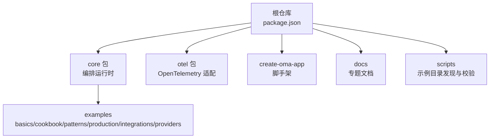
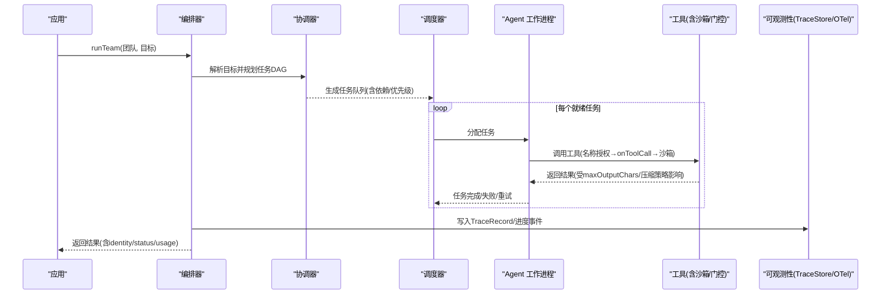
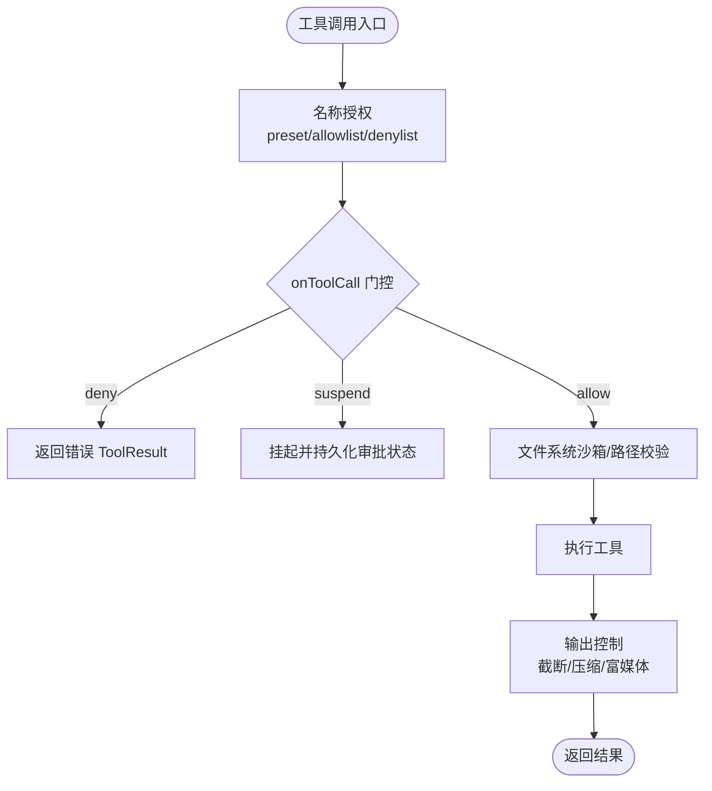
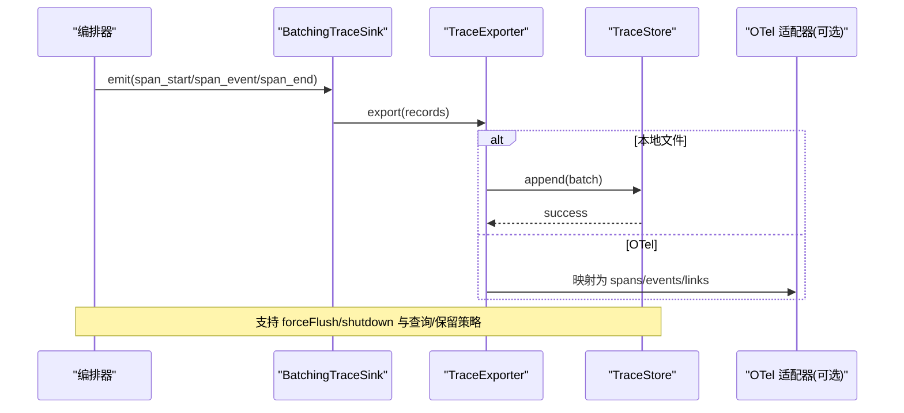
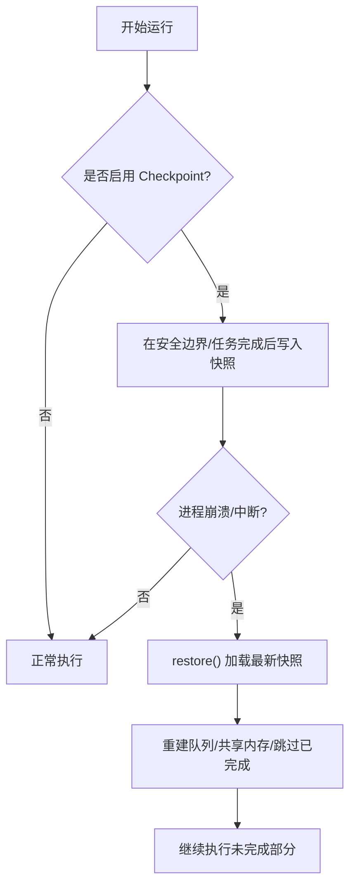
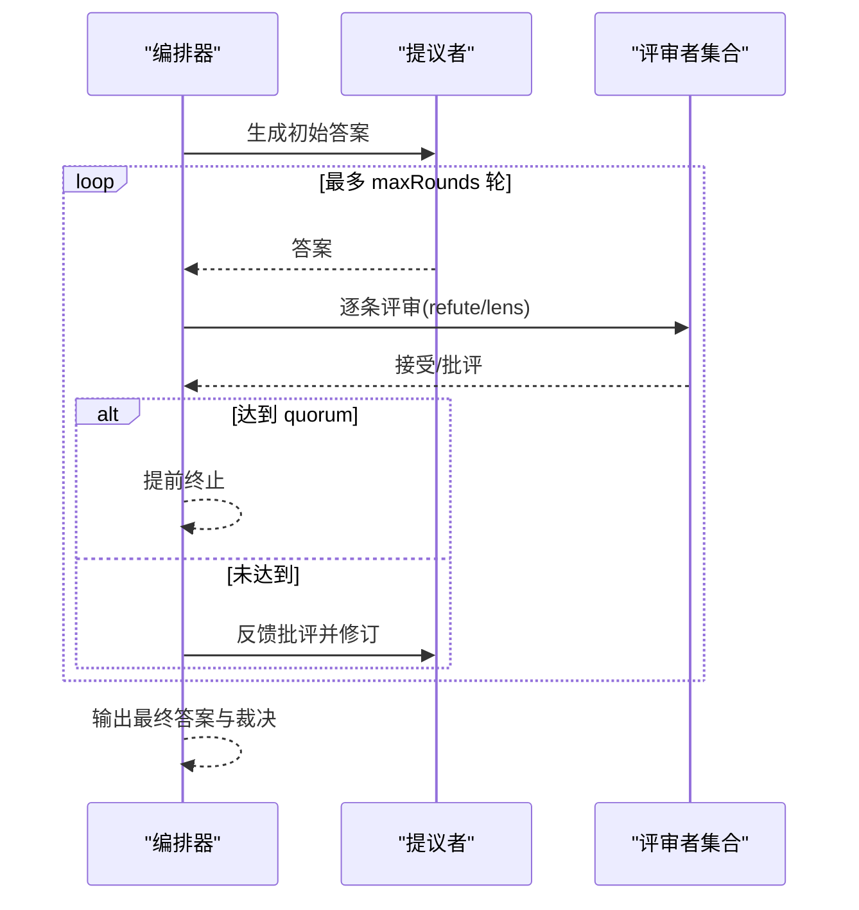
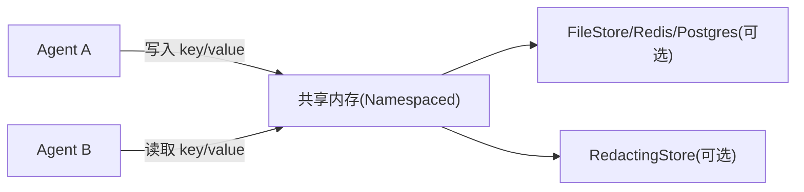
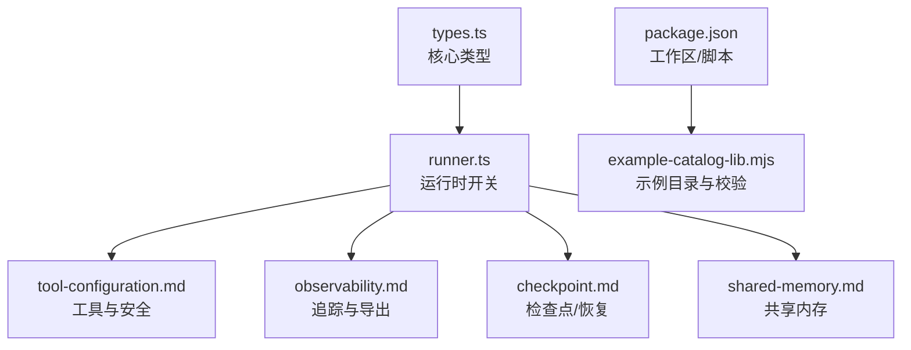

# 示例和最佳实践

<cite>
**本文引用的文件**   
- [README.md](file://README.md)
- [README_zh.md](file://README_zh.md)
- [package.json](file://package.json)
- [packages/core/README.md](file://packages/core/README.md)
- [docs/tool-configuration.md](file://docs/tool-configuration.md)
- [docs/observability.md](file://docs/observability.md)
- [docs/checkpoint.md](file://docs/checkpoint.md)
- [docs/shared-memory.md](file://docs/shared-memory.md)
- [docs/consensus.md](file://docs/consensus.md)
- [packages/core/src/types.ts](file://packages/core/src/types.ts)
- [packages/core/src/agent/runner.ts](file://packages/core/src/agent/runner.ts)
- [packages/core/src/memory/file-store.ts](file://packages/core/src/memory/file-store.ts)
- [scripts/example-catalog-lib.mjs](file://scripts/example-catalog-lib.mjs)
</cite>

## 目录
1. [简介](#简介)
2. [项目结构](#项目结构)
3. [核心组件](#核心组件)
4. [架构总览](#架构总览)
5. [详细组件分析](#详细组件分析)
6. [依赖关系分析](#依赖关系分析)
7. [性能与优化](#性能与优化)
8. [故障排查指南](#故障排查指南)
9. [结论](#结论)
10. [附录：示例与脚手架使用指南](#附录示例与脚手架使用指南)

## 简介
本指南面向希望快速上手并生产化部署 Open Multi-Agent（OMA）的团队，聚焦“示例 + 最佳实践”。内容覆盖：
- 基础示例：单智能体、团队协作、工具使用、结构化输入等入门场景。
- 高级示例：复杂工作流、自定义工具、MCP 集成、共识校验、计划回放等企业级能力。
- 企业实践：安全配置（默认拒绝工具、逐次门控、凭据隔离）、可观测性（TraceStore、Run Viewer、OpenTelemetry）、容错恢复（Checkpoint 断点续跑、自适应恢复）。
- 架构模式与优化：执行路由、模型路由、任务调度、预算控制、上下文压缩。
- 常见问题与调试：工具沙箱、权限判定、追踪与回放、存储与隐私。
- 代码模板与脚手架：create-oma-app 的使用与扩展方式。
- 社区贡献与扩展：示例目录规范、验证脚本、如何提交与复用。

## 项目结构
仓库采用 monorepo 组织，核心编排运行时在 packages/core，可选的企业级可观测性适配在 packages/otel，脚手架在 packages/create-oma-app。根 package.json 提供统一构建、测试与示例验证脚本；docs 下包含工具配置、可观测性、检查点、共享内存、共识等专题文档。

图表来源
- [package.json:1-34](file://package.json#L1-L34)
- [packages/core/README.md:49-111](file://packages/core/README.md#L49-L111)

章节来源
- [package.json:1-34](file://package.json#L1-L34)
- [README.md:138-144](file://README.md#L138-L144)
- [README_zh.md:137-143](file://README_zh.md#L137-L143)

## 核心组件
- 编排器与团队：通过 createTeam 声明角色与共享记忆，runTeam/runTasks/runAgent 三种运行模式支持从目标自动规划到显式流水线。
- 工具系统：内置工具默认拒绝，支持预设、白名单、黑名单、逐次门控 onToolCall、凭据作用域隔离、文件系统沙箱。
- 可观测性：v2 TraceRecord、TraceStore、离线 Run Viewer、OpenTelemetry 适配器；支持进度事件、结构化追踪、批处理导出。
- 可靠性：Checkpoint v4、FileStore 持久化、断点恢复、中途中断的工具调用幂等重放。
- 共识与治理：runConsensus 多轮评审；runTeam 的 governanceIntent/requiredRoles/requiredOrder 保障拓扑合规。
- 调度与路由：executionRouter 选择 Single/Team，model routing 选择具体模型；任务优先级、重试、循环检测、token/成本预算。

章节来源
- [packages/core/README.md:103-185](file://packages/core/README.md#L103-L185)
- [docs/tool-configuration.md:214-290](file://docs/tool-configuration.md#L214-L290)
- [docs/observability.md:12-83](file://docs/observability.md#L12-L83)
- [docs/checkpoint.md:1-10](file://docs/checkpoint.md#L1-L10)
- [docs/consensus.md:1-64](file://docs/consensus.md#L1-L64)

## 架构总览
下图展示一次 runTeam 的典型流程：目标进入协调器生成任务 DAG，调度器按依赖派发任务给不同 Agent，工具调用经门控与沙箱执行，结果聚合后输出；同时产生可观测数据供离线回放或接入 OTel。

图表来源
- [packages/core/README.md:103-185](file://packages/core/README.md#L103-L185)
- [docs/tool-configuration.md:326-390](file://docs/tool-configuration.md#L326-L390)
- [docs/observability.md:185-223](file://docs/observability.md#L185-L223)

## 详细组件分析

### 工具系统与沙箱（安全与可控）
- 默认拒绝：未显式授予时，内置工具不可用；可通过 toolPreset/tools/disallowedTools 组合精确控制。
- 逐次门控：onToolCall 在输入校验后、工具执行前拦截，支持 allow/deny/suspend；高风险命令可使用分类器辅助决策。
- 凭据隔离：AgentConfig.credentials 将密钥限定到调用者作用域，避免子代理越权。
- 文件系统沙箱：文件类工具限制在 cwd 内，bash 不沙箱，需配合 disallowedTools 或进程级隔离。
- 输出控制：maxToolOutputChars、compressToolResults、rich modelOutput（文本/图片/文件）与提供者映射。

图表来源
- [docs/tool-configuration.md:214-290](file://docs/tool-configuration.md#L214-L290)
- [docs/tool-configuration.md:326-390](file://docs/tool-configuration.md#L326-L390)
- [docs/tool-configuration.md:391-441](file://docs/tool-configuration.md#L391-L441)
- [docs/tool-configuration.md:507-649](file://docs/tool-configuration.md#L507-L649)

章节来源
- [docs/tool-configuration.md:214-290](file://docs/tool-configuration.md#L214-L290)
- [docs/tool-configuration.md:326-390](file://docs/tool-configuration.md#L326-L390)
- [docs/tool-configuration.md:391-441](file://docs/tool-configuration.md#L391-L441)
- [docs/tool-configuration.md:507-649](file://docs/tool-configuration.md#L507-L649)
- [packages/core/src/agent/runner.ts:140-166](file://packages/core/src/agent/runner.ts#L140-L166)
- [packages/core/src/types.ts:544-583](file://packages/core/src/types.ts#L544-L583)

### 可观测性与回放（生产级追踪）
- 运行标识与状态：每次运行返回 identity（runId/attempt/traceId/rootSpanId）与 status（ok/error/cancelled/timeout/budget_exhausted/rejected/skipped）。
- 执行回执：buildExecutionReceipt 汇总实际执行的拓扑、角色、依赖边、token 用量与时长，用于治理结论评估。
- TraceRecord v2：span_start/span_event/span_end 构成完整生命周期；links 表达 DAG/委派/消费关系。
- 存储与导出：BatchingTraceSink + TraceExporter；InMemoryTraceStore/FileTraceStore；可选 @open-multi-agent/otel 适配器。
- 离线查看：renderRunViewer 生成静态 HTML，支持 DAG 与 span 瀑布视图。

图表来源
- [docs/observability.md:12-83](file://docs/observability.md#L12-L83)
- [docs/observability.md:151-184](file://docs/observability.md#L151-L184)
- [docs/observability.md:185-223](file://docs/observability.md#L185-L223)
- [docs/observability.md:224-287](file://docs/observability.md#L224-L287)
- [docs/observability.md:459-525](file://docs/observability.md#L459-L525)
- [docs/observability.md:527-599](file://docs/observability.md#L527-L599)
- [docs/observability.md:670-731](file://docs/observability.md#L670-L731)

章节来源
- [docs/observability.md:12-83](file://docs/observability.md#L12-L83)
- [docs/observability.md:151-184](file://docs/observability.md#L151-L184)
- [docs/observability.md:185-223](file://docs/observability.md#L185-L223)
- [docs/observability.md:224-287](file://docs/observability.md#L224-L287)
- [docs/observability.md:459-525](file://docs/observability.md#L459-L525)
- [docs/observability.md:527-599](file://docs/observability.md#L527-L599)
- [docs/observability.md:670-731](file://docs/observability.md#L670-L731)

### 检查点与恢复（断点续跑）
- 启用方式：per-call checkpoint 或全局默认；支持 InMemoryStore 与 FileStore。
- 保存内容：执行身份、任务队列、共享内存、已完成任务结果、进行中 runner 状态、审批延续状态、任务交接元信息。
- 恢复语义：restore 重建任务队列与共享内存，跳过已完成任务，必要时重新运行协调器综合步骤。
- 中途中断恢复：工具调用以 toolCallId 为幂等键，已提交结果重放，未提交则保守重跑。
- 隐私保护：RedactingStore 对持久化值进行写时脱敏（注意不适用于需要原值的审批记录）。

图表来源
- [docs/checkpoint.md:1-10](file://docs/checkpoint.md#L1-L10)
- [docs/checkpoint.md:11-48](file://docs/checkpoint.md#L11-L48)
- [docs/checkpoint.md:49-73](file://docs/checkpoint.md#L49-L73)
- [docs/checkpoint.md:74-107](file://docs/checkpoint.md#L74-L107)
- [docs/checkpoint.md:109-157](file://docs/checkpoint.md#L109-L157)
- [docs/checkpoint.md:172-204](file://docs/checkpoint.md#L172-L204)
- [docs/checkpoint.md:206-249](file://docs/checkpoint.md#L206-L249)

章节来源
- [docs/checkpoint.md:1-10](file://docs/checkpoint.md#L1-L10)
- [docs/checkpoint.md:11-48](file://docs/checkpoint.md#L11-L48)
- [docs/checkpoint.md:49-73](file://docs/checkpoint.md#L49-L73)
- [docs/checkpoint.md:74-107](file://docs/checkpoint.md#L74-L107)
- [docs/checkpoint.md:109-157](file://docs/checkpoint.md#L109-L157)
- [docs/checkpoint.md:172-204](file://docs/checkpoint.md#L172-L204)
- [docs/checkpoint.md:206-249](file://docs/checkpoint.md#L206-L249)
- [packages/core/src/memory/file-store.ts:23-54](file://packages/core/src/memory/file-store.ts#L23-L54)

### 共识与治理（质量与合规）
- runConsensus：提议者生成答案，评审者多轮反驳/确认，达到法定人数即接受；支持 revise/reject/keep 策略。
- 任务级 verify：可在 runTasks 中对单个任务结果触发共识校验，提升关键步骤质量。
- 治理意图：runTeam 支持 required/preferred/none 的 governanceIntent，结合 requiredRoles/requiredOrder 强制拓扑与顺序，并在执行回执中评估结论。

图表来源
- [docs/consensus.md:1-64](file://docs/consensus.md#L1-L64)
- [docs/tool-configuration.md:5-45](file://docs/tool-configuration.md#L5-L45)

章节来源
- [docs/consensus.md:1-64](file://docs/consensus.md#L1-L64)
- [docs/tool-configuration.md:5-45](file://docs/tool-configuration.md#L5-L45)

### 共享内存与跨 Agent 协作
- 启用方式：sharedMemory: true 或使用 sharedMemoryStore 指定后端（内存/文件/Redis/Postgres 等）。
- 命名空间：键以 agentName/key 形式隔离，避免冲突。
- 持久化与脱敏：FileStore 提供原子写入；RedactingStore 可对敏感值写时脱敏。

图表来源
- [docs/shared-memory.md:1-47](file://docs/shared-memory.md#L1-L47)

章节来源
- [docs/shared-memory.md:1-47](file://docs/shared-memory.md#L1-L47)

## 依赖关系分析
- 包与脚本：根 package.json 定义 workspaces、构建与测试脚本；scripts/example-catalog-lib.mjs 负责示例目录发现、能力标签与级别校验，确保示例索引一致性。
- 类型与运行时：types.ts 定义了任务、路由、预算、检查点、工具上下文等核心类型；runner.ts 暴露工具预设、白/黑名单、每调用门控、循环检测、token 预算等运行时开关。
- 存储：memory/file-store.ts 提供基于文件的原子写入实现，支撑检查点与共享内存的持久化需求。

图表来源
- [packages/core/src/types.ts:1340-1415](file://packages/core/src/types.ts#L1340-L1415)
- [packages/core/src/types.ts:2023-2049](file://packages/core/src/types.ts#L2023-L2049)
- [packages/core/src/types.ts:2177-2236](file://packages/core/src/types.ts#L2177-L2236)
- [packages/core/src/agent/runner.ts:140-166](file://packages/core/src/agent/runner.ts#L140-L166)
- [scripts/example-catalog-lib.mjs:1-130](file://scripts/example-catalog-lib.mjs#L1-L130)
- [package.json:1-34](file://package.json#L1-L34)

章节来源
- [packages/core/src/types.ts:1340-1415](file://packages/core/src/types.ts#L1340-L1415)
- [packages/core/src/types.ts:2023-2049](file://packages/core/src/types.ts#L2023-L2049)
- [packages/core/src/types.ts:2177-2236](file://packages/core/src/types.ts#L2177-L2236)
- [packages/core/src/agent/runner.ts:140-166](file://packages/core/src/agent/runner.ts#L140-L166)
- [scripts/example-catalog-lib.mjs:1-130](file://scripts/example-catalog-lib.mjs#L1-L130)
- [package.json:1-34](file://package.json#L1-L34)

## 性能与优化
- 任务调度与并行：事件驱动，依赖满足即启动下游任务；合理设置优先级与重试退避，减少长尾。
- 预算控制：maxTokenBudget/maxCostBudget 在 turn/task 边界检查，防止失控；estimateCost 由调用方提供定价函数。
- 上下文与输出：compressToolResults 压缩历史工具结果；maxToolOutputChars 控制单次输出大小；structured output 降低解析失败重试。
- 可观测性开销：BatchingTraceSink 默认队列/批次/超时/重试参数已做平衡；生产环境建议集中 flush/shutdown 并选择合适的 exporter。
- 存储与恢复：FileStore 原子写入减少损坏风险；仅在安全边界落盘，避免频繁 I/O。

[本节为通用指导，不直接分析具体文件]

## 故障排查指南
- 工具未被执行：检查名称授权（preset/allowlist/denylist），以及 onToolCall 是否 deny/suspend；确认 bash 未误用沙箱假设。
- 预算耗尽：关注 budget_exhausted 状态码与 flags；调整 maxTokenBudget/maxCostBudget 或拆分任务。
- 无法恢复：确认 checkpoint store 可用且路径正确；FileStore 需 fsync；审批相关记录不应被 RedactingStore 脱敏。
- 追踪缺失：确保 sink/exporter 已配置并调用 forceFlush/shutdown；检查日志中的 dropped/failed 统计。
- 治理不满足：核对 governanceConclusion/governanceReason；必要时调整 requiredRoles/requiredOrder 或 mode。

章节来源
- [docs/tool-configuration.md:214-290](file://docs/tool-configuration.md#L214-L290)
- [docs/tool-configuration.md:326-390](file://docs/tool-configuration.md#L326-L390)
- [docs/observability.md:527-599](file://docs/observability.md#L527-L599)
- [docs/checkpoint.md:172-204](file://docs/checkpoint.md#L172-L204)
- [docs/tool-configuration.md:5-45](file://docs/tool-configuration.md#L5-L45)

## 结论
OMA 通过“动态编排 + 强约束治理 + 完备可观测与恢复”的组合，帮助团队从原型快速走向生产。建议在生产中：
- 明确治理意图与角色拓扑，结合执行回执做合规审计。
- 开启工具默认拒绝与 onToolCall 门控，最小化权限面。
- 启用检查点与 FileStore，关键路径加 RedactingStore 脱敏。
- 接入 TraceStore/Run Viewer 或 OTel，建立统一的监控与回放体系。
- 设定 token/成本预算与重试策略，配合上下文压缩与结构化输出控制成本。

[本节为总结性内容，不直接分析具体文件]

## 附录：示例与脚手架使用指南
- 快速开始与示例索引：通过 npm create oma-app@latest 初始化 starter，或在现有后端安装 core 包；示例索引涵盖基础、cookbook、模式、Provider 与集成。
- 运行模式：runAgent（单智能体）、runTeam（自动编排团队）、runTasks（显式流水线）；planOnly 可先预览计划再 replay。
- 示例目录与校验：scripts/example-catalog-lib.mjs 扫描 basics/cookbook/patterns/providers/integrations/production，依据 id/path/title/description/section/goal/capabilities/format/level/entrypoints 等字段校验一致性。
- 参与贡献：遵循 .github/CONTRIBUTING.md 的工作区边界、验证与提交流程；新增示例需符合 catalog schema，便于自动化发现与演示。

章节来源
- [README.md:48-97](file://README.md#L48-L97)
- [README_zh.md:48-96](file://README_zh.md#L48-L96)
- [packages/core/README.md:57-111](file://packages/core/README.md#L57-L111)
- [scripts/example-catalog-lib.mjs:1-130](file://scripts/example-catalog-lib.mjs#L1-L130)
- [README.md:159-167](file://README.md#L159-L167)
- [README_zh.md:162-170](file://README_zh.md#L162-L170)