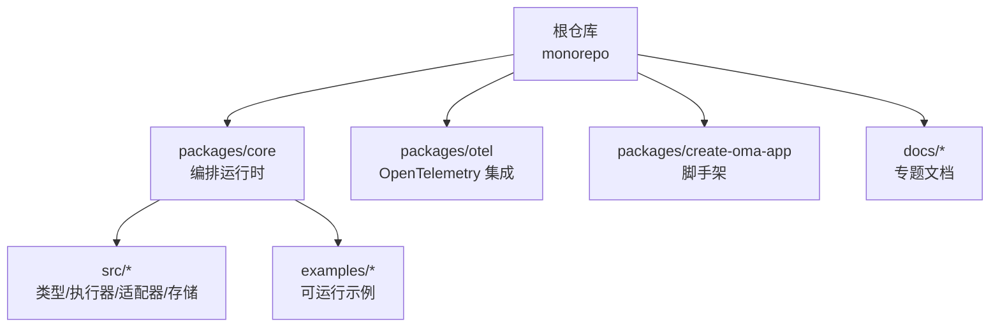
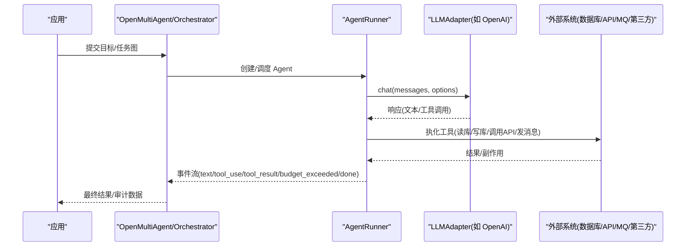
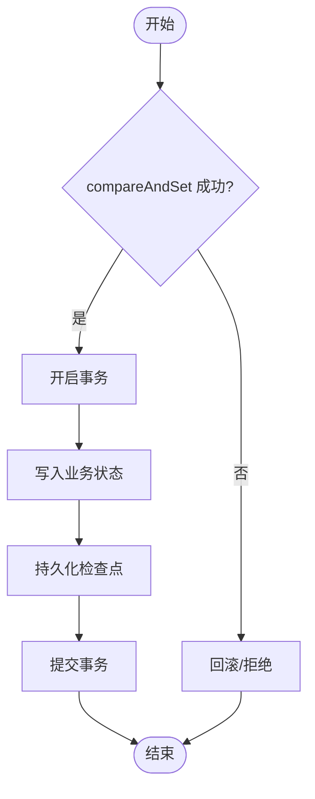
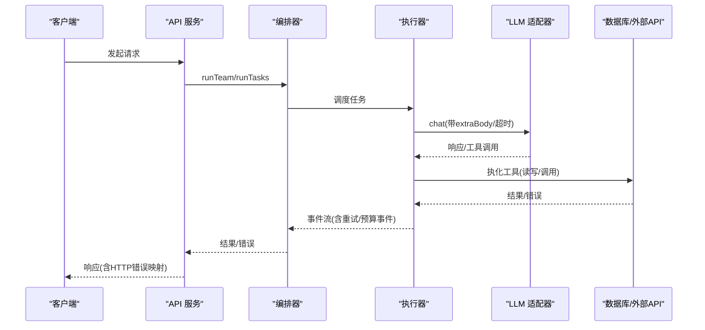
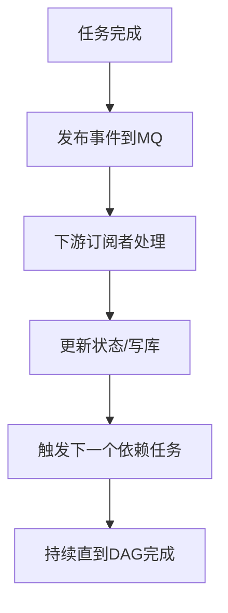
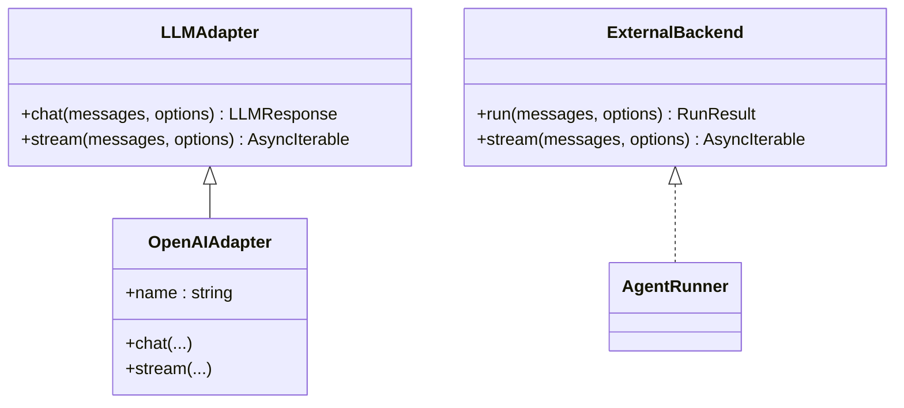
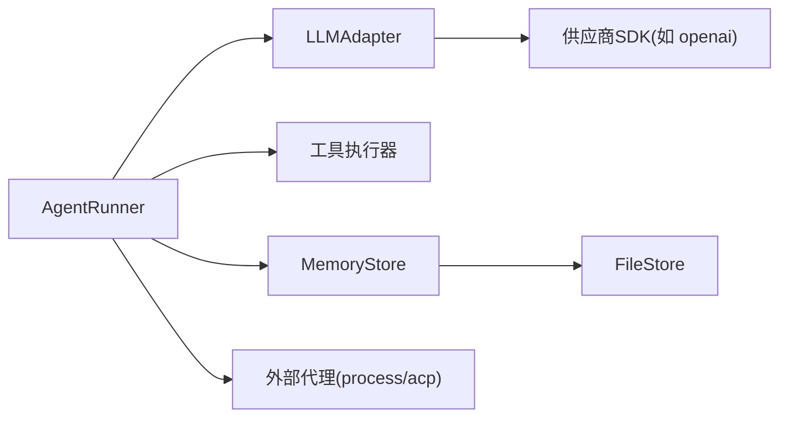

# 集成示例

<cite>
**本文引用的文件**
- [README.md](file://README.md)
- [package.json](file://package.json)
- [packages/core/README.md](file://packages/core/README.md)
- [packages/core/examples/README.md](file://packages/core/examples/README.md)
- [docs/external-agents.md](file://docs/external-agents.md)
- [packages/core/src/types.ts](file://packages/core/src/types.ts)
- [packages/core/src/agent/runner.ts](file://packages/core/src/agent/runner.ts)
- [packages/core/src/llm/openai.ts](file://packages/core/src/llm/openai.ts)
- [packages/core/src/memory/file-store.ts](file://packages/core/src/memory/file-store.ts)
</cite>

## 目录
1. [简介](#简介)
2. [项目结构](#项目结构)
3. [核心组件](#核心组件)
4. [架构总览](#架构总览)
5. [详细组件分析](#详细组件分析)
6. [依赖关系分析](#依赖关系分析)
7. [性能考量](#性能考量)
8. [故障排查指南](#故障排查指南)
9. [结论](#结论)
10. [附录](#附录)

## 简介
本文件面向希望在 Open Multi-Agent（OMA）中实现“高级外部系统集成”的工程师，围绕数据库集成、API 服务集成、消息队列与事件驱动、第三方服务适配等主题，给出可落地的模式、配置要点与排错建议。内容基于仓库中的类型定义、执行器、适配器与示例组织，确保读者既能理解整体架构，也能按图索骥落地到代码。

## 项目结构
- 根仓库为 monorepo，核心能力位于 packages/core；可选企业级可观测性在 packages/otel；脚手架在 packages/create-oma-app。
- 示例集中在 packages/core/examples，涵盖基础用法、编排模式、生产实践与外部系统集成。
- 文档集中于 docs，包含外部代理、可观测性、任务调度等专题。

图表来源
- [package.json:1-34](file://package.json#L1-L34)
- [packages/core/README.md:1-200](file://packages/core/README.md#L1-L200)

章节来源
- [package.json:1-34](file://package.json#L1-L34)
- [packages/core/README.md:1-200](file://packages/core/README.md#L1-L200)

## 核心组件
- 执行器与流式循环：AgentRunner 提供 run/stream 契约，统一处理模型调用、工具执行、预算控制、循环检测、检查点恢复与事件上报。
- LLM 适配器：以 OpenAIAdapter 为代表，将内部消息模型映射到具体供应商协议，支持非流式与流式调用，并合并 extraBody。
- 共享内存与持久化：MemoryStore 抽象键值存储，FileStore 提供单进程原子写入与 fsync 保障，用于检查点与跨重启恢复。
- 外部代理后端：process/acp 两种后端，使本地进程或 ACP 协议代理成为团队一等成员，参与 DAG、共享内存与预算聚合。

章节来源
- [packages/core/src/agent/runner.ts:875-1234](file://packages/core/src/agent/runner.ts#L875-L1234)
- [packages/core/src/llm/openai.ts:163-264](file://packages/core/src/llm/openai.ts#L163-L264)
- [packages/core/src/memory/file-store.ts:1-169](file://packages/core/src/memory/file-store.ts#L1-L169)
- [docs/external-agents.md:1-239](file://docs/external-agents.md#L1-L239)

## 架构总览
下图展示从应用层到 LLM 适配器与外部系统的调用路径，以及 OMA 在其中的编排角色。

图表来源
- [packages/core/src/agent/runner.ts:875-1234](file://packages/core/src/agent/runner.ts#L875-L1234)
- [packages/core/src/llm/openai.ts:163-264](file://packages/core/src/llm/openai.ts#L163-L264)

## 详细组件分析

### 数据库集成模式（连接池、事务、查询优化）
- 连接池管理
  - 通过 MemoryStore 抽象接入持久化存储（如 Redis、Postgres、SQLite）。推荐将“检查点”与“共享内存”解耦：检查点使用 FileStore 保证原子写入与 fsync；共享内存优先使用 InMemoryStore 以获得低延迟，必要时再切换为数据库-backed store。
  - 若使用数据库作为 MemoryStore，应在应用启动时建立连接池并在生命周期结束时释放；对并发写进行序列化（参考 FileStore 的 writeChain 思想），避免竞态。
- 事务处理
  - 对于需要原子性的决策（如耐久审批），利用 MemoryStore.compareAndSet 实现 CAS，确保“期望值匹配才写入”，失败则关闭安全地回退。
  - 将关键状态变更（如任务完成、审批结果）放入同一事务边界，配合检查点持久化，确保崩溃后可恢复。
- 查询优化
  - 将高频读取缓存至内存，仅将必要增量落盘；对列表操作（list）做分页与索引优化。
  - 结合 SharedMemory 的 TTL 语义（expiresAtTurn）减少过期数据膨胀。

图表来源
- [packages/core/src/types.ts:2842-2872](file://packages/core/src/types.ts#L2842-L2872)
- [packages/core/src/memory/file-store.ts:124-169](file://packages/core/src/memory/file-store.ts#L124-L169)

章节来源
- [packages/core/src/types.ts:2842-2872](file://packages/core/src/types.ts#L2842-L2872)
- [packages/core/src/memory/file-store.ts:1-169](file://packages/core/src/memory/file-store.ts#L1-L169)

### API 服务集成最佳实践（认证授权、重试、错误处理、速率限制）
- 认证授权
  - 通过 AgentConfig.extraBody 将供应商特定字段注入请求体；对鉴权头/密钥由适配器或上层 SDK 管理，避免硬编码。
  - 对外暴露 HTTP 接口时，统一鉴权中间件，并将错误映射为 4xx/5xx（示例应用展示了 HTTP 错误映射）。
- 请求重试
  - 任务级重试：Task.maxRetries/retryDelayMs/retryBackoff 提供指数退避；结合 OrchestratorEvent.task_retry 观察重试轨迹。
  - 每调用超时：RunnerOptions.callTimeoutMs 为每次 adapter.chat() 设置独立超时信号，避免供应商默认不一致导致的挂起。
- 错误处理
  - 区分“可重试”与“终态”错误：AgentRunResult.error 保留底层异常以便分类；预算超限会触发 budget_exceeded 事件。
  - 工具执行失败应返回结构化错误信息，便于上游重试或降级。
- 速率限制
  - 在适配器层或网关层实施限流；结合 maxTokenBudget 与并行度控制，避免突发流量打满下游。

图表来源
- [packages/core/src/types.ts:2082-2098](file://packages/core/src/types.ts#L2082-L2098)
- [packages/core/src/agent/runner.ts:544-582](file://packages/core/src/agent/runner.ts#L544-L582)
- [packages/core/src/llm/openai.ts:163-264](file://packages/core/src/llm/openai.ts#L163-L264)

章节来源
- [packages/core/src/types.ts:2082-2098](file://packages/core/src/types.ts#L2082-L2098)
- [packages/core/src/agent/runner.ts:544-582](file://packages/core/src/agent/runner.ts#L544-L582)
- [packages/core/src/llm/openai.ts:163-264](file://packages/core/src/llm/openai.ts#L163-L264)
- [packages/core/examples/README.md:94-113](file://packages/core/examples/README.md#L94-L113)

### 消息队列集成方案（异步任务、事件驱动、持久化）
- 异步任务处理
  - 将耗时工具调用（如长任务、批处理）投递到 MQ；执行器侧通过工具回调或轮询获取结果，保持主流程不阻塞。
  - 使用 onToolResult 钩子将 MQ 结果回填到对话上下文，供后续推理使用。
- 事件驱动架构
  - 借助 OrchestratorEvent 与 onTrace 事件，将任务生命周期事件桥接到消息总线，驱动下游消费者（如通知、指标收集）。
  - 事件驱动 DAG：下游任务在依赖完成后自动启动，无需等待无关任务。
- 消息持久化
  - 将关键事件与审批结果持久化（数据库或对象存储），结合检查点实现断点续跑。
  - 对幂等性要求高的场景，使用唯一 ID + 去重表，避免重复消费。

图表来源
- [packages/core/src/types.ts:2111-2118](file://packages/core/src/types.ts#L2111-L2118)
- [packages/core/examples/README.md:54-76](file://packages/core/examples/README.md#L54-L76)

章节来源
- [packages/core/src/types.ts:2111-2118](file://packages/core/src/types.ts#L2111-L2118)
- [packages/core/examples/README.md:54-76](file://packages/core/examples/README.md#L54-L76)

### 第三方服务集成模式（云服务SDK、SDK封装、适配器模式）
- 适配器模式
  - 通过 LLMAdapter 抽象屏蔽不同供应商差异；对其它第三方服务也可采用相同思路，定义统一接口，分别实现各厂商适配。
  - OpenAIAdapter 展示了如何将内部消息模型转换为供应商协议，并合并 extraBody 以兼容本地服务器参数。
- SDK 封装
  - 将复杂 SDK 调用封装为简单函数，集中处理鉴权、重试、超时、错误转换与日志埋点。
  - 对 MCP 工具、外部 CLI 或 ACP 代理，可通过 process/acp 后端无缝纳入团队执行。
- 适配器扩展
  - 新增第三方服务时，遵循“输入输出标准化 + 错误归一化 + 可观测性埋点”的原则，便于替换与测试。

图表来源
- [packages/core/src/llm/openai.ts:1-79](file://packages/core/src/llm/openai.ts#L1-L79)
- [packages/core/src/agent/runner.ts:275-292](file://packages/core/src/agent/runner.ts#L275-L292)
- [docs/external-agents.md:146-151](file://docs/external-agents.md#L146-L151)

章节来源
- [packages/core/src/llm/openai.ts:1-79](file://packages/core/src/llm/openai.ts#L1-L79)
- [packages/core/src/agent/runner.ts:275-292](file://packages/core/src/agent/runner.ts#L275-L292)
- [docs/external-agents.md:146-151](file://docs/external-agents.md#L146-L151)

### 完整集成示例与配置模板
- 示例入口
  - 外部代理：process 与 acp 两种后端示例，演示如何把本地命令或 ACP 代理纳入团队。
  - 可观测性：onTrace 事件与 TraceStore 的使用，覆盖无 key 的可观测性示例。
  - 应用集成：Express 客服 REST API、Next.js 与 Vercel AI SDK 的集成示例。
- 配置模板要点
  - 任务重试：maxRetries、retryDelayMs、retryBackoff。
  - 调用超时：callTimeoutMs 为每次模型调用设置独立超时。
  - 预算控制：maxTokenBudget 与 budget_exceeded 事件。
  - 共享内存：InMemoryStore/FileStore 的选择与用途。

章节来源
- [docs/external-agents.md:19-117](file://docs/external-agents.md#L19-L117)
- [packages/core/examples/README.md:94-113](file://packages/core/examples/README.md#L94-L113)
- [packages/core/src/types.ts:2082-2098](file://packages/core/src/types.ts#L2082-L2098)
- [packages/core/src/agent/runner.ts:544-582](file://packages/core/src/agent/runner.ts#L544-L582)

### 常见陷阱与解决方案
- 陷阱：供应商默认超时不一致导致挂起
  - 解决：启用 callTimeoutMs，为每次模型调用绑定独立超时信号。
- 陷阱：共享内存频繁写导致 I/O 抖动
  - 解决：检查点与共享内存分离；检查点使用 FileStore 原子写入，共享内存用 InMemoryStore。
- 陷阱：外部代理权限过宽
  - 解决：ACP permission 设置为 reject 或细粒度函数；process 后端限定 command/args/cwd/env。
- 陷阱：重试风暴
  - 解决：使用指数退避与最大重试次数；结合任务级重试与全局预算控制。
- 陷阱：事件丢失或重复消费
  - 解决：事件持久化 + 幂等键；对关键路径使用 compareAndSet 保证一致性。

章节来源
- [packages/core/src/agent/runner.ts:544-582](file://packages/core/src/agent/runner.ts#L544-L582)
- [packages/core/src/memory/file-store.ts:1-169](file://packages/core/src/memory/file-store.ts#L1-L169)
- [docs/external-agents.md:118-145](file://docs/external-agents.md#L118-L145)
- [packages/core/src/types.ts:2082-2098](file://packages/core/src/types.ts#L2082-L2098)

## 依赖关系分析
- 模块耦合
  - AgentRunner 依赖 LLMAdapter 与工具执行器；通过类型抽象降低对具体实现的耦合。
  - MemoryStore 抽象屏蔽存储实现差异，FileStore 提供零依赖的磁盘持久化。
- 外部依赖
  - OpenAIAdapter 依赖 openai SDK；其他供应商适配器同理。
  - 外部代理后端依赖 @agentclientprotocol/sdk（可选，按需加载）。

图表来源
- [packages/core/src/agent/runner.ts:275-292](file://packages/core/src/agent/runner.ts#L275-L292)
- [packages/core/src/llm/openai.ts:1-79](file://packages/core/src/llm/openai.ts#L1-L79)
- [packages/core/src/memory/file-store.ts:1-169](file://packages/core/src/memory/file-store.ts#L1-L169)
- [docs/external-agents.md:59-82](file://docs/external-agents.md#L59-L82)

章节来源
- [packages/core/src/agent/runner.ts:275-292](file://packages/core/src/agent/runner.ts#L275-L292)
- [packages/core/src/llm/openai.ts:1-79](file://packages/core/src/llm/openai.ts#L1-L79)
- [packages/core/src/memory/file-store.ts:1-169](file://packages/core/src/memory/file-store.ts#L1-L169)
- [docs/external-agents.md:59-82](file://docs/external-agents.md#L59-L82)

## 性能考量
- 并行与并发
  - 合理设置 TeamConfig.maxConcurrency，避免下游资源争用。
  - 对独立任务使用 fan-out 模式提升吞吐。
- 上下文压缩
  - 使用 contextStrategy 控制输入增长，减少 token 消耗与延迟。
- 预算与超时
  - 设置 maxTokenBudget 与 callTimeoutMs，防止无限增长与挂起。
- I/O 优化
  - 检查点批量写入与 fsync 策略，避免频繁落盘；共享内存尽量内存化。

[本节为通用指导，不直接分析具体文件]

## 故障排查指南
- 常见问题定位
  - 查看 OrchestratorEvent 中的 task_retry、task_complete 等事件，确认重试与完成路径。
  - 关注 budget_exceeded 事件，判断是否因预算限制提前终止。
  - 检查 AgentRunResult.error 与 HTTP 错误映射，定位上游/下游错误。
- 恢复与回放
  - 使用检查点与计划回放（createPlanArtifact/runFromPlan）复现问题。
  - 对关键路径启用 durable approval，确保人工介入后能精确恢复。
- 外部代理问题
  - 校验 command/args/cwd/env 配置；ACP 权限策略是否过松或过紧。
  - 注意 ACP 的 token 会计口径（累计上下文 token），避免预算误判。

章节来源
- [packages/core/src/types.ts:2111-2118](file://packages/core/src/types.ts#L2111-L2118)
- [packages/core/src/agent/runner.ts:1204-1215](file://packages/core/src/agent/runner.ts#L1204-L1215)
- [docs/external-agents.md:187-203](file://docs/external-agents.md#L187-L203)

## 结论
通过 OMA 的类型抽象、执行器契约与适配器模式，可以在不侵入业务逻辑的前提下，将数据库、API、消息队列与第三方服务高效集成。结合任务重试、预算控制、检查点与事件驱动，能够构建高可靠、可观测、可扩展的多智能体系统。建议在工程实践中优先采用“适配器 + 事件 + 检查点”的组合，逐步完善容错与可运维性。

## 附录
- 快速开始与示例导航
  - 根 README 与 Core 包 README 提供安装、运行与模式说明。
  - examples/README 提供按类别组织的可运行脚本与集成示例。
- 相关文档
  - external-agents.md 详解外部代理后端与权限策略。
  - 可观测性与评估文档帮助在生产环境落地监控与评测。

章节来源
- [README.md:46-108](file://README.md#L46-L108)
- [packages/core/README.md:57-111](file://packages/core/README.md#L57-L111)
- [packages/core/examples/README.md:1-138](file://packages/core/examples/README.md#L1-L138)
- [docs/external-agents.md:1-239](file://docs/external-agents.md#L1-L239)