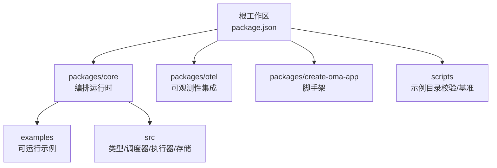
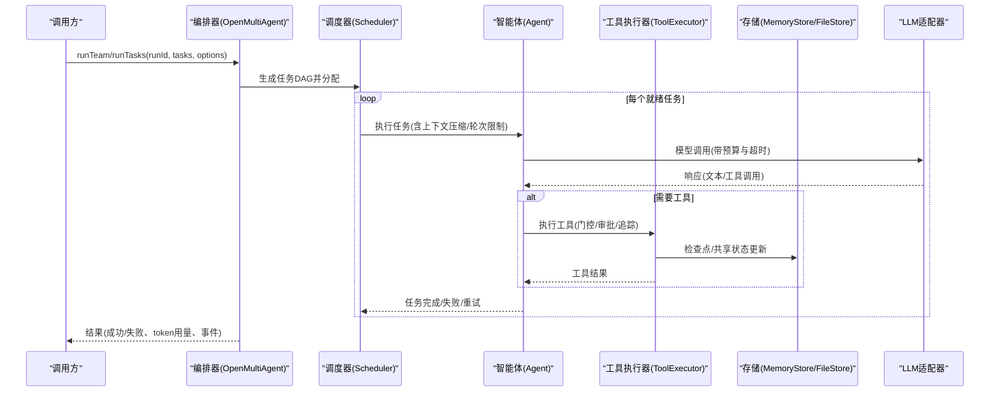
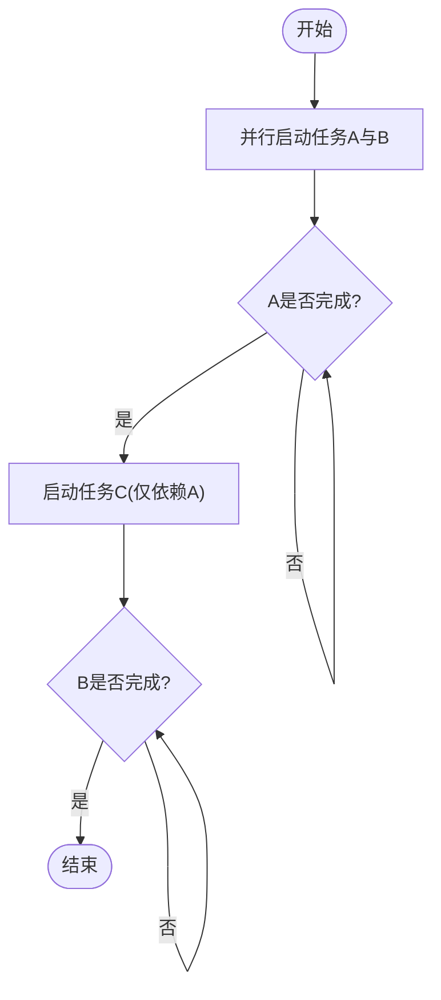
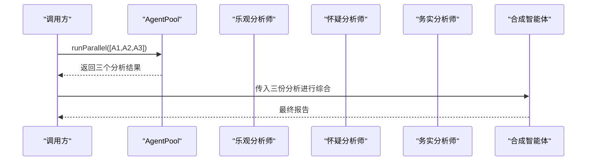
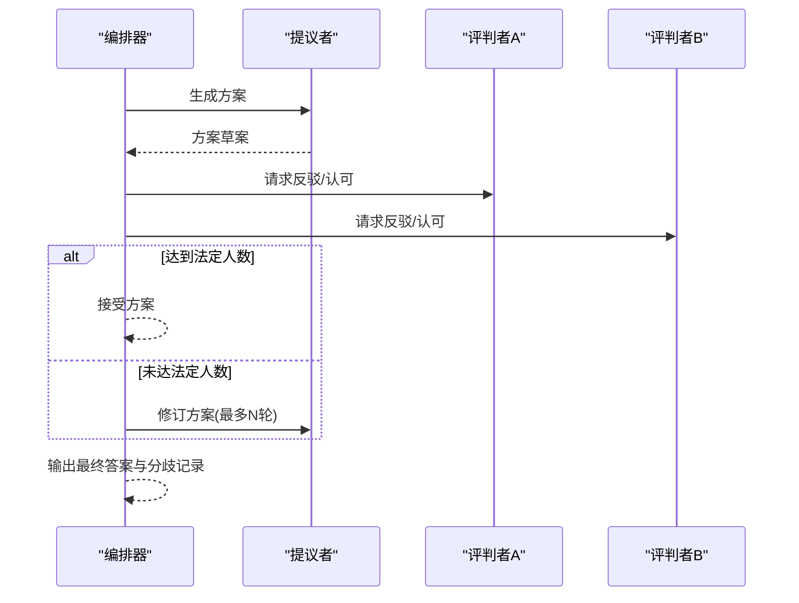
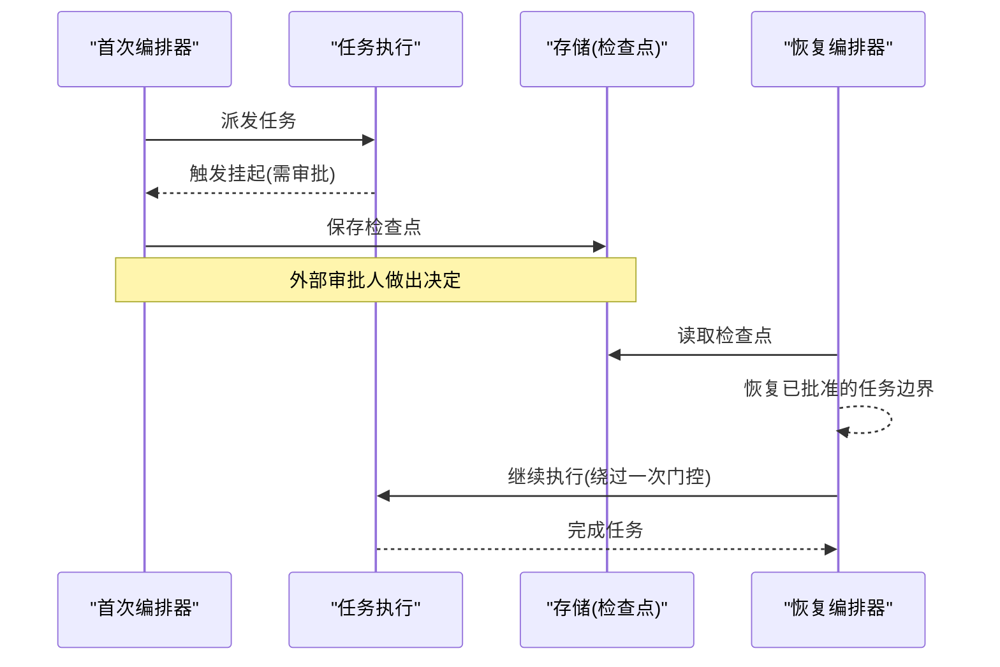
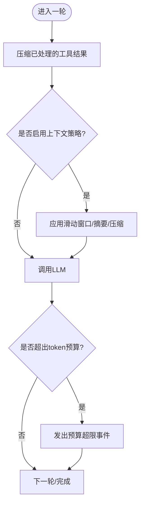
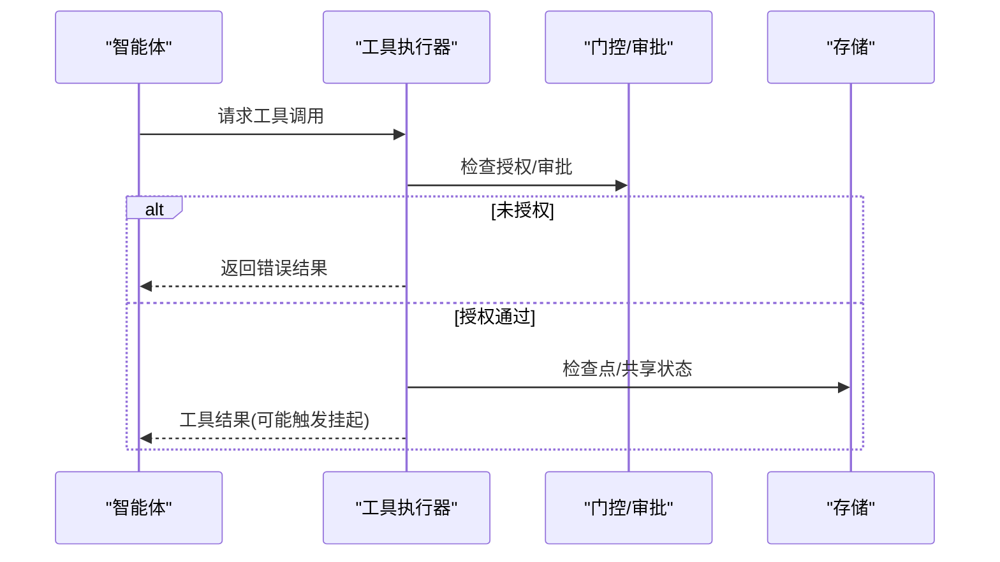
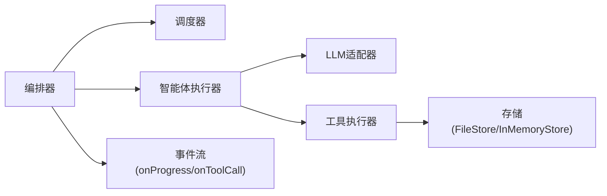

# 高级示例

<cite>
**本文引用的文件**
- [README.md](file://README.md)
- [package.json](file://package.json)
- [packages/core/README.md](file://packages/core/README.md)
- [packages/core/examples/README.md](file://packages/core/examples/README.md)
- [packages/core/examples/patterns/event-driven-dag.ts](file://packages/core/examples/patterns/event-driven-dag.ts)
- [packages/core/examples/patterns/fan-out-aggregate.ts](file://packages/core/examples/patterns/fan-out-aggregate.ts)
- [packages/core/examples/patterns/consensus.ts](file://packages/core/examples/patterns/consensus.ts)
- [packages/core/examples/patterns/durable-approval.ts](file://packages/core/examples/patterns/durable-approval.ts)
- [packages/core/src/types.ts](file://packages/core/src/types.ts)
- [packages/core/src/agent/runner.ts](file://packages/core/src/agent/runner.ts)
- [packages/core/src/memory/file-store.ts](file://packages/core/src/memory/file-store.ts)
- [scripts/example-catalog-lib.mjs](file://scripts/example-catalog-lib.mjs)
</cite>

## 目录
1. [简介](#简介)
2. [项目结构](#项目结构)
3. [核心组件](#核心组件)
4. [架构总览](#架构总览)
5. [详细组件分析](#详细组件分析)
6. [依赖关系分析](#依赖关系分析)
7. [性能考量](#性能考量)
8. [故障排查指南](#故障排查指南)
9. [结论](#结论)
10. [附录](#附录)

## 简介
本章节面向希望在企业级环境中使用 Open Multi-Agent（OMA）构建复杂工作流的工程师与架构师。文档聚焦以下目标：
- 展示多层依赖、条件分支与循环处理的高级编排模式
- 深入讲解自定义工具开发：输入校验、错误处理、异步操作与资源管理
- 提供并发控制、内存管理与缓存策略等性能优化技巧
- 在企业智能体编排中应用工厂模式、策略模式与观察者模式
- 结合仓库中的可运行示例，给出架构图与调优建议
- 解释关键配置项对执行行为的影响

该仓库以 TypeScript 为核心，提供动态编排、确定性调度、检查点恢复、可观测性与评估能力，适合将多智能体系统从原型推进到生产环境。

**章节来源**
- [README.md:46-108](file://README.md#L46-L108)
- [packages/core/README.md:49-161](file://packages/core/README.md#L49-L161)

## 项目结构
仓库采用 monorepo 组织，核心运行时位于 packages/core，配套包包括 @open-multi-agent/otel 与 create-oma-app。根脚本用于示例目录验证、基准测试与 CI 流程。示例按类别划分：basics、patterns、cookbook、providers、integrations、apps、production，便于循序渐进学习与企业级实践。

**图表来源**
- [package.json:1-34](file://package.json#L1-L34)
- [packages/core/README.md:53-117](file://packages/core/README.md#L53-L117)

**章节来源**
- [package.json:1-34](file://package.json#L1-L34)
- [packages/core/examples/README.md:1-138](file://packages/core/examples/README.md#L1-L138)

## 核心组件
- 编排器（OpenMultiAgent）：负责任务图生成、调度、预算控制、检查点与事件流
- 团队（Team）：一组 Agent 的集合，支持共享内存与并发上限
- 智能体（Agent）：单智能体执行单元，支持上下文压缩、工具调用、轮次限制
- 调度器（Scheduler）：根据策略分配未指派任务，支持多种策略与权重
- 存储（MemoryStore/FileStore）：持久化检查点与共享状态，原子写入保证一致性
- 工具执行器（ToolExecutor）：安全门控、审批、追踪与结果摘要
- 可观测性（Observability）：事件流、TraceSpan、在线/离线评估

这些组件共同实现“描述目标而非手工绘制图”的动态编排理念，并通过事件驱动与确定性调度确保可观测、可恢复与可控的执行路径。

**章节来源**
- [packages/core/src/types.ts:2131-2210](file://packages/core/src/types.ts#L2131-L2210)
- [packages/core/src/agent/runner.ts:1142-1177](file://packages/core/src/agent/runner.ts#L1142-L1177)
- [packages/core/src/memory/file-store.ts:1-45](file://packages/core/src/memory/file-store.ts#L1-L45)

## 架构总览
下图展示了从用户目标到任务图生成、调度执行、工具调用与结果聚合的关键路径，并标注了检查点、预算控制与事件流的位置。

**图表来源**
- [packages/core/src/types.ts:2131-2210](file://packages/core/src/types.ts#L2131-L2210)
- [packages/core/src/agent/runner.ts:1142-1177](file://packages/core/src/agent/runner.ts#L1142-L1177)
- [packages/core/src/memory/file-store.ts:308-345](file://packages/core/src/memory/file-store.ts#L308-L345)

## 详细组件分析

### 事件驱动 DAG 与条件分支
该示例通过受控延迟的 LLM 适配器演示：任务 C 在依赖 A 完成后立即启动，无需等待无关任务 B。这体现了 OMA 的事件驱动执行模型与任务级依赖解耦。

**图表来源**
- [packages/core/examples/patterns/event-driven-dag.ts:105-153](file://packages/core/examples/patterns/event-driven-dag.ts#L105-L153)

**章节来源**
- [packages/core/examples/patterns/event-driven-dag.ts:1-153](file://packages/core/examples/patterns/event-driven-dag.ts#L1-L153)

### 扇出/聚合（MapReduce）模式
该示例使用 AgentPool.runParallel 并行执行多个分析师智能体，再由合成智能体汇总输出，形成典型的 MapReduce 模式。它展示了并发 fan-out、结果聚合与 token 用量统计。

**图表来源**
- [packages/core/examples/patterns/fan-out-aggregate.ts:107-167](file://packages/core/examples/patterns/fan-out-aggregate.ts#L107-L167)

**章节来源**
- [packages/core/examples/patterns/fan-out-aggregate.ts:1-210](file://packages/core/examples/patterns/fan-out-aggregate.ts#L1-L210)

### 共识模式（提议者/评判者）
该示例演示 runConsensus：提议者生成方案，评判者尝试反驳；若达到法定人数则接受，否则迭代修订。支持默认评判提示与自定义每评判者的视角。

**图表来源**
- [packages/core/examples/patterns/consensus.ts:67-167](file://packages/core/examples/patterns/consensus.ts#L67-L167)

**章节来源**
- [packages/core/examples/patterns/consensus.ts:1-167](file://packages/core/examples/patterns/consensus.ts#L1-L167)

### 持久化审批（挂起-决策-恢复）
该示例通过 onTaskDispatch 返回 suspend，配合 InMemoryStore 或 FileStore 实现原子审批与恢复。它展示了在生产环境中对高风险操作的审批闭环。

**图表来源**
- [packages/core/examples/patterns/durable-approval.ts:54-105](file://packages/core/examples/patterns/durable-approval.ts#L54-L105)
- [packages/core/src/memory/file-store.ts:308-345](file://packages/core/src/memory/file-store.ts#L308-L345)

**章节来源**
- [packages/core/examples/patterns/durable-approval.ts:1-105](file://packages/core/examples/patterns/durable-approval.ts#L1-L105)
- [packages/core/src/memory/file-store.ts:1-45](file://packages/core/src/memory/file-store.ts#L1-L45)

### 智能体执行器与上下文压缩
智能体在执行过程中会进行上下文压缩、工具结果压缩与轮次限制，避免无限循环与上下文膨胀。同时，预算超限时发出事件并终止后续调用。

**图表来源**
- [packages/core/src/agent/runner.ts:1142-1177](file://packages/core/src/agent/runner.ts#L1142-L1177)
- [packages/core/src/agent/runner.ts:1204-1215](file://packages/core/src/agent/runner.ts#L1204-L1215)

**章节来源**
- [packages/core/src/agent/runner.ts:1142-1177](file://packages/core/src/agent/runner.ts#L1142-L1177)
- [packages/core/src/agent/runner.ts:1204-1215](file://packages/core/src/agent/runner.ts#L1204-L1215)

### 工具执行与安全门控
工具执行包含默认拒绝策略、授权白名单、审批挂起、追踪与结果摘要。当工具请求暂停但缺少必要基础设施时，会返回错误信息。

**图表来源**
- [packages/core/src/agent/runner.ts:1364-1486](file://packages/core/src/agent/runner.ts#L1364-L1486)

**章节来源**
- [packages/core/src/agent/runner.ts:1364-1486](file://packages/core/src/agent/runner.ts#L1364-L1486)

### 工厂模式、策略模式与观察者模式
- 工厂模式：通过 createTeam 与 buildAgent 等方式创建团队与智能体实例，封装配置与依赖注入
- 策略模式：调度策略（round-robin、least-busy、capability-match、dependency-first、composite）与上下文压缩策略（sliding-window、summarize、compact、custom）
- 观察者模式：onProgress/onToolCall/onCheckpoint 等回调用于实时观察与干预执行过程

这些模式在编排器、调度器与智能体执行器中广泛使用，使系统具备可扩展性与可插拔性。

**章节来源**
- [packages/core/src/types.ts:2131-2210](file://packages/core/src/types.ts#L2131-L2210)
- [packages/core/src/agent/runner.ts:773-805](file://packages/core/src/agent/runner.ts#L773-L805)

## 依赖关系分析
下图展示了核心模块之间的依赖关系：编排器依赖调度器与智能体执行器，执行器依赖 LLM 适配器与工具执行器，存储模块提供检查点与共享状态。

**图表来源**
- [packages/core/src/types.ts:2131-2210](file://packages/core/src/types.ts#L2131-L2210)
- [packages/core/src/agent/runner.ts:1142-1177](file://packages/core/src/agent/runner.ts#L1142-L1177)
- [packages/core/src/memory/file-store.ts:308-345](file://packages/core/src/memory/file-store.ts#L308-L345)

**章节来源**
- [packages/core/src/types.ts:2131-2210](file://packages/core/src/types.ts#L2131-L2210)
- [packages/core/src/agent/runner.ts:1142-1177](file://packages/core/src/agent/runner.ts#L1142-L1177)
- [packages/core/src/memory/file-store.ts:308-345](file://packages/core/src/memory/file-store.ts#L308-L345)

## 性能考量
- 并发控制：通过 maxConcurrency 与调度策略限制并行度，避免资源争用
- 上下文压缩：滑动窗口、摘要与规则压缩减少 token 消耗与延迟
- 预算与成本：maxTokenBudget/maxCostBudget 在 turn/task 边界进行检查，防止无界开销
- 检查点与恢复：FileStore 原子写入与 fsync 保障崩溃恢复，降低重放成本
- 工具结果压缩：compressToolResults 与 compressReasoningText 减少历史膨胀
- 事件流与追踪：onProgress/onToolCall 与 TraceSpan 帮助定位瓶颈

上述机制在智能体执行器与存储模块中得到具体实现，确保在高负载与长对话场景下的稳定性与效率。

**章节来源**
- [packages/core/src/agent/runner.ts:1142-1177](file://packages/core/src/agent/runner.ts#L1142-L1177)
- [packages/core/src/agent/runner.ts:1204-1215](file://packages/core/src/agent/runner.ts#L1204-L1215)
- [packages/core/src/memory/file-store.ts:308-345](file://packages/core/src/memory/file-store.ts#L308-L345)

## 故障排查指南
- 预算超限：当 totalTokens 超过阈值时，执行器会发出 budget_exceeded 事件并停止后续调用
- 工具调用失败：未授权或工具执行异常会返回错误结果，不会中断主循环
- 审批缺失：工具请求暂停但缺少 checkpoint/MemoryStore.compareAndSet 时会报错
- 文件同步失败：FileStore 在 compaction/fsync 失败时保持原数据不变，避免损坏

建议在 onProgress 中监听 error/warning/budget_exceeded 事件，并结合 TraceSpan 定位问题。

**章节来源**
- [packages/core/src/agent/runner.ts:1204-1215](file://packages/core/src/agent/runner.ts#L1204-L1215)
- [packages/core/src/agent/runner.ts:1364-1486](file://packages/core/src/agent/runner.ts#L1364-L1486)
- [packages/core/src/memory/file-store.ts:308-345](file://packages/core/src/memory/file-store.ts#L308-L345)

## 结论
Open Multi-Agent 提供了强大的动态编排能力，结合事件驱动、策略模式与持久化检查点，能够支撑企业级复杂工作流。通过合理的并发控制、上下文压缩与预算限制，可在保证稳定性的同时提升性能。示例覆盖了从基础到高级的多种模式，为实际落地提供了可复用的蓝图。

## 附录
- 示例目录与分类：参见 examples 说明，涵盖 basics、patterns、cookbook、providers、integrations、apps、production
- 示例目录校验：scripts/example-catalog-lib.mjs 定义了示例元数据与验证规则

**章节来源**
- [packages/core/examples/README.md:1-138](file://packages/core/examples/README.md#L1-L138)
- [scripts/example-catalog-lib.mjs:1-60](file://scripts/example-catalog-lib.mjs#L1-L60)