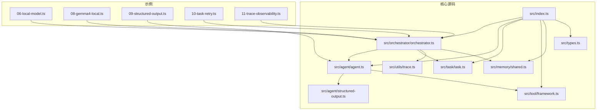
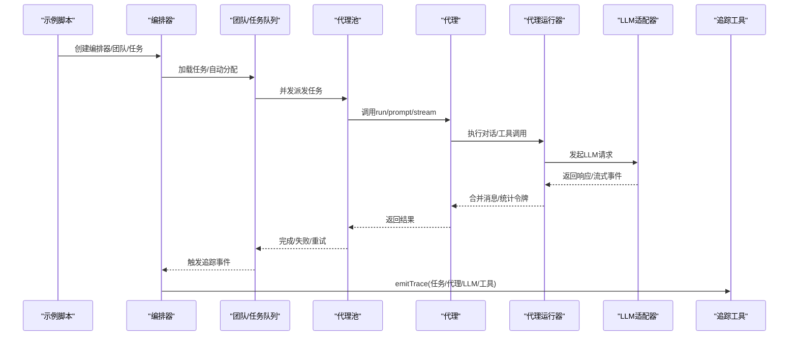
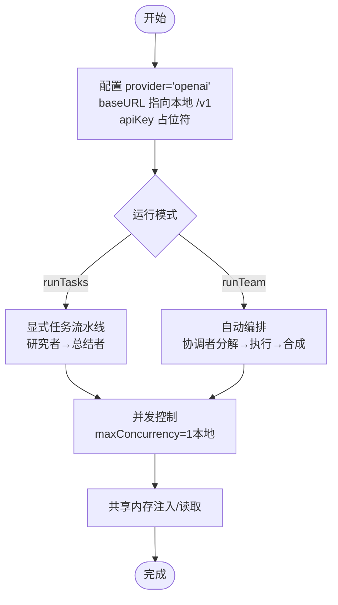
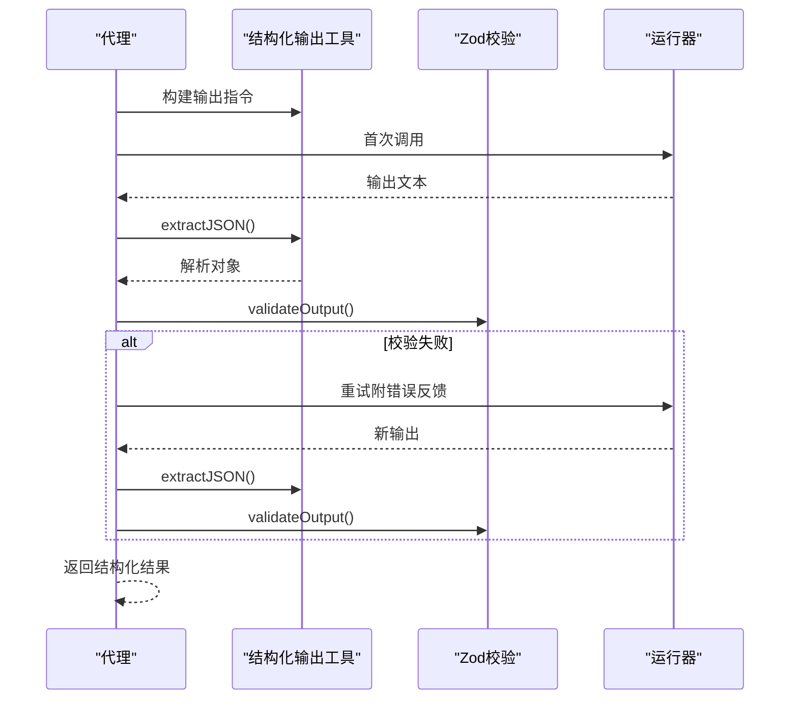
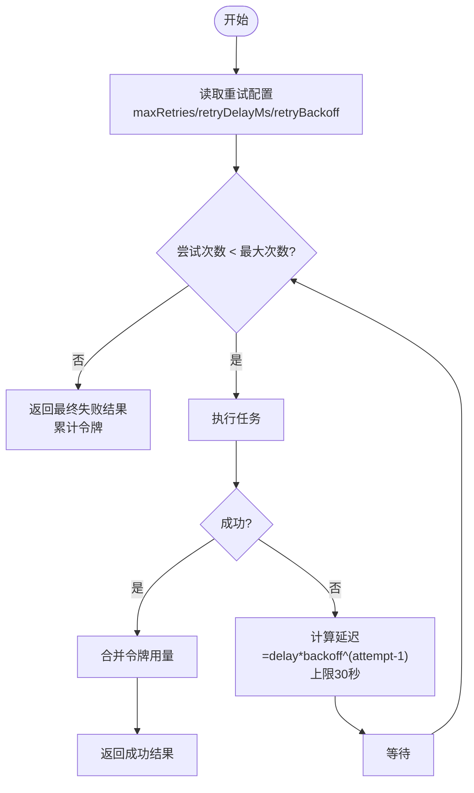
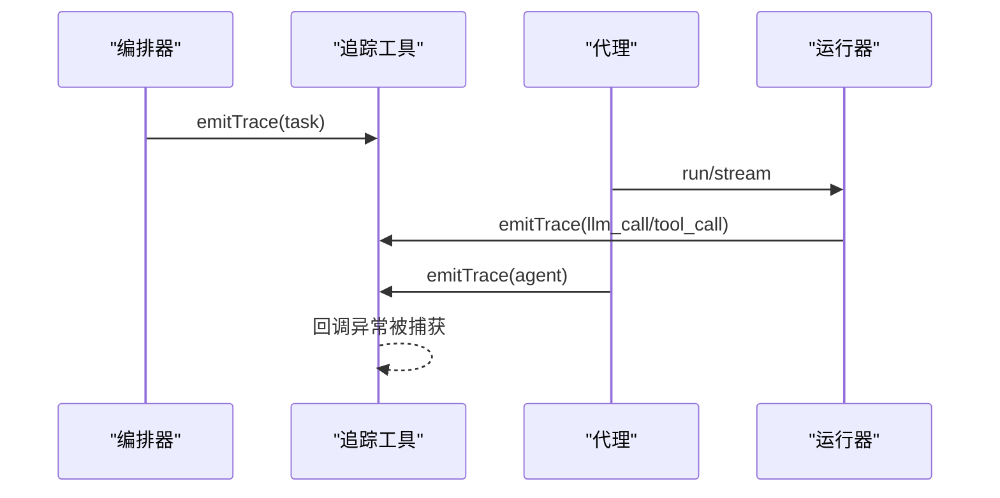
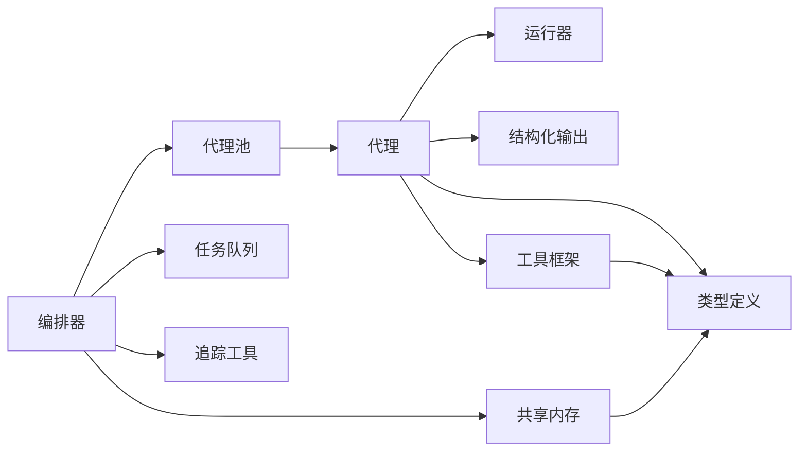

# 专业功能示例

<cite>
**本文档引用的文件**
- [examples/06-local-model.ts](file://examples/06-local-model.ts)
- [examples/08-gemma4-local.ts](file://examples/08-gemma4-local.ts)
- [examples/09-structured-output.ts](file://examples/09-structured-output.ts)
- [examples/10-task-retry.ts](file://examples/10-task-retry.ts)
- [examples/11-trace-observability.ts](file://examples/11-trace-observability.ts)
- [src/index.ts](file://src/index.ts)
- [src/types.ts](file://src/types.ts)
- [src/utils/trace.ts](file://src/utils/trace.ts)
- [src/agent/structured-output.ts](file://src/agent/structured-output.ts)
- [src/task/task.ts](file://src/task/task.ts)
- [src/orchestrator/orchestrator.ts](file://src/orchestrator/orchestrator.ts)
- [src/agent/agent.ts](file://src/agent/agent.ts)
- [src/tool/framework.ts](file://src/tool/framework.ts)
- [src/memory/shared.ts](file://src/memory/shared.ts)
- [tests/structured-output.test.ts](file://tests/structured-output.test.ts)
- [tests/task-retry.test.ts](file://tests/task-retry.test.ts)
- [tests/trace.test.ts](file://tests/trace.test.ts)
</cite>

## 目录
1. [简介](#简介)
2. [项目结构](#项目结构)
3. [核心组件](#核心组件)
4. [架构总览](#架构总览)
5. [详细组件分析](#详细组件分析)
6. [依赖关系分析](#依赖关系分析)
7. [性能考虑](#性能考虑)
8. [故障排查指南](#故障排查指南)
9. [结论](#结论)
10. [附录](#附录)

## 简介
本文件面向需要在生产环境中部署与运维多智能体系统的工程师，系统性讲解框架中的四大专业能力：本地模型部署（含Ollama/Gemma4）、结构化输出（数据校验与格式化）、任务重试（指数退避与失败恢复）、可观测性追踪（全链路日志与性能监控）。文档以官方示例为线索，结合源码实现，提供可操作的配置建议、性能调优要点与运维最佳实践。

## 项目结构
该仓库采用按层组织的模块化设计：
- examples：官方示例，覆盖本地模型、结构化输出、任务重试、可观测性等主题
- src：核心源码，包含编排器、代理、工具、任务、内存、类型定义与工具函数
- tests：完备的单元测试，覆盖结构化输出、任务重试、可观测性等关键路径

**图表来源**
- [src/index.ts:1-183](file://src/index.ts#L1-L183)
- [examples/06-local-model.ts:1-201](file://examples/06-local-model.ts#L1-L201)
- [examples/08-gemma4-local.ts:1-193](file://examples/08-gemma4-local.ts#L1-L193)
- [examples/09-structured-output.ts:1-74](file://examples/09-structured-output.ts#L1-L74)
- [examples/10-task-retry.ts:1-133](file://examples/10-task-retry.ts#L1-L133)
- [examples/11-trace-observability.ts:1-134](file://examples/11-trace-observability.ts#L1-L134)

**章节来源**
- [src/index.ts:1-183](file://src/index.ts#L1-L183)
- [examples/06-local-model.ts:1-201](file://examples/06-local-model.ts#L1-L201)
- [examples/08-gemma4-local.ts:1-193](file://examples/08-gemma4-local.ts#L1-L193)
- [examples/09-structured-output.ts:1-74](file://examples/09-structured-output.ts#L1-L74)
- [examples/10-task-retry.ts:1-133](file://examples/10-task-retry.ts#L1-L133)
- [examples/11-trace-observability.ts:1-134](file://examples/11-trace-observability.ts#L1-L134)

## 核心组件
- 编排器（OpenMultiAgent）：统一入口，负责团队管理、任务队列、调度与并发控制，并提供进度回调与追踪事件
- 代理（Agent）：封装对话历史、工具执行、结构化输出校验与钩子（beforeRun/afterRun）
- 结构化输出工具：构建输出格式指令、提取JSON、Zod校验与二次重试
- 任务系统：任务创建、就绪判断、拓扑排序、依赖校验与重试执行
- 可观测性：统一追踪事件发射、运行ID生成与回调容错
- 工具框架：工具注册、JSON Schema转换与执行器
- 共享内存：命名空间化的跨代理共享存储

**章节来源**
- [src/orchestrator/orchestrator.ts:514-800](file://src/orchestrator/orchestrator.ts#L514-L800)
- [src/agent/agent.ts:81-623](file://src/agent/agent.ts#L81-L623)
- [src/agent/structured-output.ts:1-127](file://src/agent/structured-output.ts#L1-L127)
- [src/task/task.ts:1-240](file://src/task/task.ts#L1-L240)
- [src/utils/trace.ts:1-35](file://src/utils/trace.ts#L1-L35)
- [src/tool/framework.ts:1-558](file://src/tool/framework.ts#L1-L558)
- [src/memory/shared.ts:1-182](file://src/memory/shared.ts#L1-L182)

## 架构总览
下图展示从示例到核心实现的关键交互路径，突出本地模型适配、结构化输出、任务重试与追踪事件的集成点。

**图表来源**
- [src/orchestrator/orchestrator.ts:280-464](file://src/orchestrator/orchestrator.ts#L280-L464)
- [src/agent/agent.ts:287-372](file://src/agent/agent.ts#L287-L372)
- [src/utils/trace.ts:12-35](file://src/utils/trace.ts#L12-L35)

## 详细组件分析

### 本地模型部署（Ollama/Gemma4）
- 配置要点
  - 使用 provider: 'openai' + baseURL 指向本地 OpenAI 兼容端点（如 Ollama 的 /v1）
  - 即使本地无鉴权，仍需设置非空 apiKey（SDK 校验要求），可填占位符
  - 对慢速本地模型设置合理超时（timeoutMs），避免阻塞
- 运行模式
  - runTasks：显式流水线（研究者→总结者）
  - runTeam：自动编排（Gemma4 作为协调者分解目标、执行并合成结果）
- 资源管理
  - 本地模型通常单并发（maxConcurrency=1），避免过载
  - 通过共享内存传递中间结果，减少重复计算
- 示例参考
  - 混合云+本地团队：[examples/06-local-model.ts:1-201](file://examples/06-local-model.ts#L1-L201)
  - Gemma4 全本地运行与自动编排：[examples/08-gemma4-local.ts:1-193](file://examples/08-gemma4-local.ts#L1-L193)

**图表来源**
- [examples/06-local-model.ts:32-68](file://examples/06-local-model.ts#L32-L68)
- [examples/08-gemma4-local.ts:45-68](file://examples/08-gemma4-local.ts#L45-L68)
- [src/types.ts:194-241](file://src/types.ts#L194-L241)

**章节来源**
- [examples/06-local-model.ts:1-201](file://examples/06-local-model.ts#L1-L201)
- [examples/08-gemma4-local.ts:1-193](file://examples/08-gemma4-local.ts#L1-L193)
- [src/types.ts:194-241](file://src/types.ts#L194-L241)

### 结构化输出（数据验证与格式化）
- 设计思路
  - 在系统提示中注入 JSON Schema 指令，约束模型输出
  - 提供三种 JSON 提取策略：纯JSON、带 fenced 块、嵌入文本
  - 使用 Zod 进行严格校验；首次失败自动重试一次并反馈错误
- 关键流程
  - 构建输出指令：[buildStructuredOutputInstruction:21-34](file://src/agent/structured-output.ts#L21-L34)
  - JSON 提取：[extractJSON:50-105](file://src/agent/structured-output.ts#L50-L105)
  - Zod 校验：[validateOutput:117-127](file://src/agent/structured-output.ts#L117-L127)
  - 代理层整合：[validateStructuredOutput:400-477](file://src/agent/agent.ts#L400-L477)
- 示例参考
  - 结构化输出分析：[examples/09-structured-output.ts:1-74](file://examples/09-structured-output.ts#L1-L74)
  - 测试覆盖（含重试与令牌统计）：[tests/structured-output.test.ts:190-332](file://tests/structured-output.test.ts#L190-L332)

**图表来源**
- [src/agent/structured-output.ts:21-127](file://src/agent/structured-output.ts#L21-L127)
- [src/agent/agent.ts:400-477](file://src/agent/agent.ts#L400-L477)

**章节来源**
- [src/agent/structured-output.ts:1-127](file://src/agent/structured-output.ts#L1-L127)
- [src/agent/agent.ts:400-477](file://src/agent/agent.ts#L400-L477)
- [examples/09-structured-output.ts:1-74](file://examples/09-structured-output.ts#L1-L74)
- [tests/structured-output.test.ts:190-332](file://tests/structured-output.test.ts#L190-L332)

### 任务重试机制（指数退避与失败恢复）
- 配置参数
  - maxRetries：最大重试次数（默认0，即不重试）
  - retryDelayMs：基础延迟（毫秒，默认1000）
  - retryBackoff：退避系数（默认2，指数增长）
- 执行逻辑
  - 计算延迟：[computeRetryDelay:108-114](file://src/orchestrator/orchestrator.ts#L108-L114)
  - 统一重试执行：[executeWithRetry:127-194](file://src/orchestrator/orchestrator.ts#L127-L194)
  - 令牌累计：将所有尝试的令牌用量合并，准确反映成本
  - 进度事件：触发 task_retry 事件，便于实时观察
- 示例参考
  - 两步流水线重试演示：[examples/10-task-retry.ts:1-133](file://examples/10-task-retry.ts#L1-L133)
  - 测试覆盖（退避、延迟、令牌累计）：[tests/task-retry.test.ts:1-369](file://tests/task-retry.test.ts#L1-L369)

**图表来源**
- [src/orchestrator/orchestrator.ts:108-194](file://src/orchestrator/orchestrator.ts#L108-L194)
- [src/task/task.ts:29-53](file://src/task/task.ts#L29-L53)

**章节来源**
- [src/orchestrator/orchestrator.ts:108-194](file://src/orchestrator/orchestrator.ts#L108-L194)
- [src/task/task.ts:29-53](file://src/task/task.ts#L29-L53)
- [examples/10-task-retry.ts:1-133](file://examples/10-task-retry.ts#L1-L133)
- [tests/task-retry.test.ts:1-369](file://tests/task-retry.test.ts#L1-L369)

### 可观测性追踪（全链路日志与性能监控）
- 事件类型
  - llm_call：每次LLM调用（携带模型、轮次、令牌用量）
  - tool_call：每次工具调用（携带工具名、是否错误）
  - task：任务完成（携带成功/失败、重试次数）
  - agent：代理回合（携带轮次、令牌、工具调用数）
- 实现要点
  - 统一追踪发射：[emitTrace:12-27](file://src/utils/trace.ts#L12-L27)，回调异常被吞掉，保证不中断执行
  - 运行ID生成：[generateRunId:32-34](file://src/utils/trace.ts#L32-L34)，用于跨事件关联
  - 事件注入：编排器/代理运行器在关键节点发出事件
- 示例参考
  - 轻量可观测性：[examples/11-trace-observability.ts:1-134](file://examples/11-trace-observability.ts#L1-L134)
  - 测试覆盖（事件字段、错误回调容错、令牌拆分）：[tests/trace.test.ts:1-454](file://tests/trace.test.ts#L1-L454)

**图表来源**
- [src/utils/trace.ts:12-35](file://src/utils/trace.ts#L12-L35)
- [src/orchestrator/orchestrator.ts:384-398](file://src/orchestrator/orchestrator.ts#L384-L398)
- [src/agent/agent.ts:375-394](file://src/agent/agent.ts#L375-L394)

**章节来源**
- [src/utils/trace.ts:1-35](file://src/utils/trace.ts#L1-L35)
- [src/orchestrator/orchestrator.ts:362-398](file://src/orchestrator/orchestrator.ts#L362-L398)
- [src/agent/agent.ts:375-394](file://src/agent/agent.ts#L375-L394)
- [examples/11-trace-observability.ts:1-134](file://examples/11-trace-observability.ts#L1-L134)
- [tests/trace.test.ts:1-454](file://tests/trace.test.ts#L1-L454)

## 依赖关系分析
- 组件耦合
  - 编排器依赖代理池、任务队列、调度器与追踪工具
  - 代理依赖运行器、工具注册表与结构化输出工具
  - 工具框架提供工具注册与JSON Schema转换
  - 共享内存为团队协作提供上下文注入
- 外部依赖
  - LLM适配器（Anthropic/OpenAI/Gemini/Grok/Copilot）通过统一接口对接
  - Zod 用于结构化输出的模式校验
- 循环依赖
  - 类型定义集中于 types.ts，避免循环导入

**图表来源**
- [src/orchestrator/orchestrator.ts:514-800](file://src/orchestrator/orchestrator.ts#L514-L800)
- [src/agent/agent.ts:81-623](file://src/agent/agent.ts#L81-L623)
- [src/tool/framework.ts:1-558](file://src/tool/framework.ts#L1-L558)
- [src/memory/shared.ts:1-182](file://src/memory/shared.ts#L1-L182)
- [src/types.ts:1-543](file://src/types.ts#L1-L543)

**章节来源**
- [src/orchestrator/orchestrator.ts:514-800](file://src/orchestrator/orchestrator.ts#L514-L800)
- [src/agent/agent.ts:81-623](file://src/agent/agent.ts#L81-L623)
- [src/tool/framework.ts:1-558](file://src/tool/framework.ts#L1-L558)
- [src/memory/shared.ts:1-182](file://src/memory/shared.ts#L1-L182)
- [src/types.ts:1-543](file://src/types.ts#L1-L543)

## 性能考虑
- 本地模型优化
  - 单并发限制（maxConcurrency=1）避免GPU/CPU争抢
  - 设置合理 timeoutMs（如120秒），防止长尾阻塞
  - 使用共享内存复用中间结果，减少重复推理
- 令牌成本
  - 重试会叠加令牌用量，应结合 maxRetries/retryDelayMs 控制成本
  - 在 onTrace 中记录每个 llm_call 的令牌，便于精细化成本分析
- 并发与调度
  - 云模型可适当提高并发度，本地模型保持串行
  - 依赖图拓扑排序确保独立任务并行，依赖任务串行

[本节为通用指导，无需特定文件引用]

## 故障排查指南
- 本地模型无法连接
  - 检查 baseURL 是否指向正确的 /v1 端点
  - 确认 apiKey 非空（SDK 校验），可使用占位符
  - 若有代理，使用 no_proxy 或调整网络配置
- 结构化输出失败
  - 首次失败会自动重试一次；若仍失败，检查 Zod 模式与输入范围
  - 查看 onTrace 中 llm_call 的令牌用量，确认模型未截断输出
- 任务重试无效
  - 确认任务配置包含 maxRetries/retryDelayMs/retryBackoff
  - 检查 onProgress 是否收到 task_retry 事件
- 追踪事件缺失
  - 确认 onTrace 回调已传入编排器或代理运行选项
  - 回调异常会被吞掉，不影响执行，但可能影响日志落地

**章节来源**
- [examples/06-local-model.ts:19-23](file://examples/06-local-model.ts#L19-L23)
- [examples/08-gemma4-local.ts:24-27](file://examples/08-gemma4-local.ts#L24-L27)
- [src/utils/trace.ts:12-27](file://src/utils/trace.ts#L12-L27)
- [tests/trace.test.ts:90-158](file://tests/trace.test.ts#L90-L158)

## 结论
本框架通过统一的编排器、可插拔的LLM适配器、结构化输出与任务重试、以及轻量可观测性，为生产级多智能体应用提供了稳定可靠的工程化能力。结合本地模型部署与云模型混合使用，可在保障成本与性能的同时，实现复杂业务场景的自动化编排与执行。

[本节为总结性内容，无需特定文件引用]

## 附录
- 类型与公共API导出
  - 公共入口与类型导出集中在 [src/index.ts:57-183](file://src/index.ts#L57-L183)
  - 核心类型定义见 [src/types.ts:1-543](file://src/types.ts#L1-L543)
- 工具与注册表
  - 工具定义与注册：[src/tool/framework.ts:51-203](file://src/tool/framework.ts#L51-L203)
- 共享内存
  - 命名空间写入与摘要生成：[src/memory/shared.ts:58-159](file://src/memory/shared.ts#L58-L159)

**章节来源**
- [src/index.ts:57-183](file://src/index.ts#L57-L183)
- [src/types.ts:1-543](file://src/types.ts#L1-L543)
- [src/tool/framework.ts:51-203](file://src/tool/framework.ts#L51-L203)
- [src/memory/shared.ts:58-159](file://src/memory/shared.ts#L58-L159)