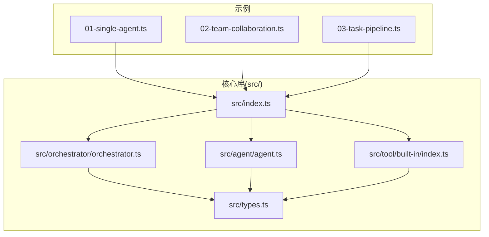
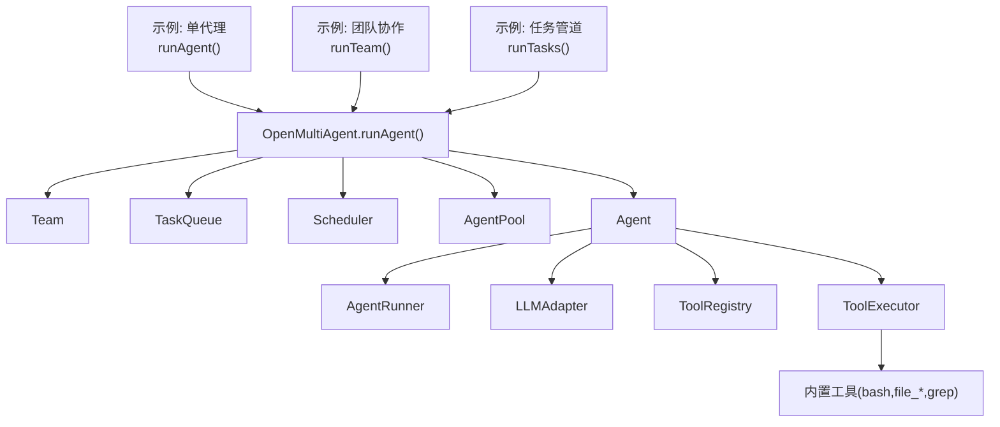
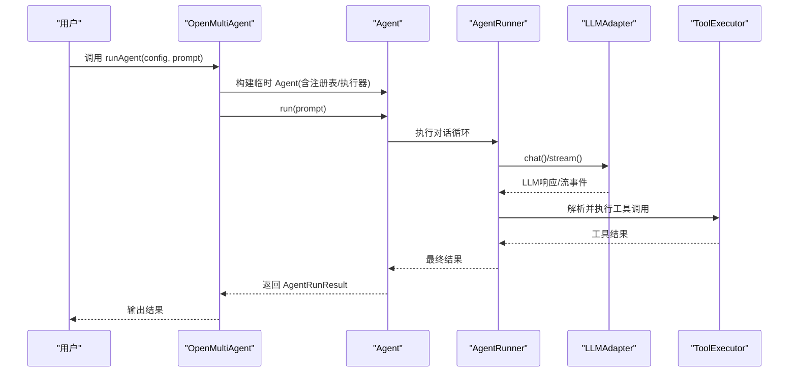
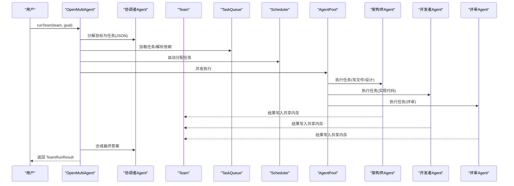
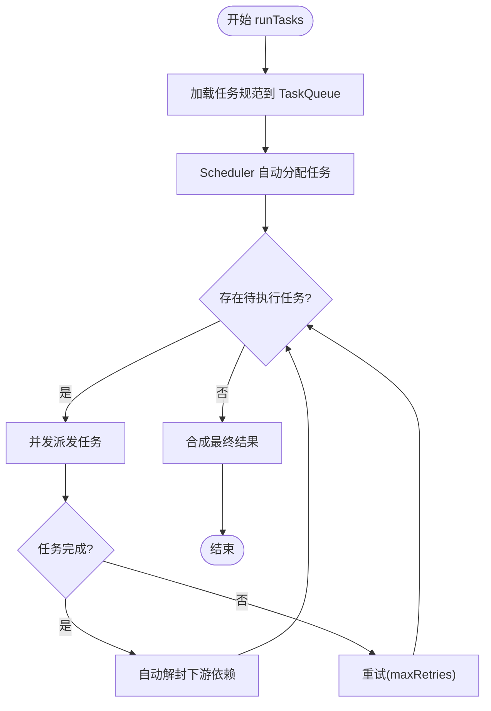
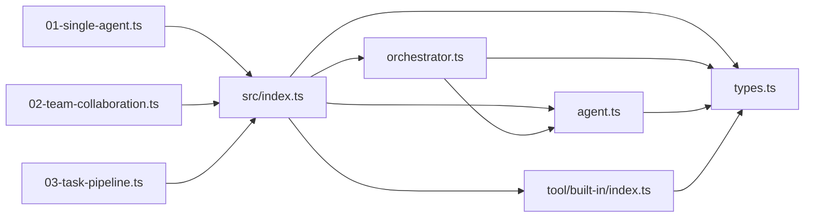

# 基础示例

<cite>
**本文引用的文件列表**
- [examples/01-single-agent.ts](file://examples/01-single-agent.ts)
- [examples/02-team-collaboration.ts](file://examples/02-team-collaboration.ts)
- [examples/03-task-pipeline.ts](file://examples/03-task-pipeline.ts)
- [README.md](file://README.md)
- [package.json](file://package.json)
- [src/index.ts](file://src/index.ts)
- [src/orchestrator/orchestrator.ts](file://src/orchestrator/orchestrator.ts)
- [src/types.ts](file://src/types.ts)
- [src/agent/agent.ts](file://src/agent/agent.ts)
- [src/tool/built-in/index.ts](file://src/tool/built-in/index.ts)
</cite>

## 目录
1. [简介](#简介)
2. [项目结构](#项目结构)
3. [核心组件](#核心组件)
4. [架构总览](#架构总览)
5. [详细组件分析](#详细组件分析)
6. [依赖关系分析](#依赖关系分析)
7. [性能与并发](#性能与并发)
8. [故障排查指南](#故障排查指南)
9. [结论](#结论)
10. [附录：运行命令与环境变量](#附录运行命令与环境变量)

## 简介
本文件面向初学者，系统讲解 Open Multi-Agent 框架的三个基础示例：单代理使用、团队协作与任务管道。文档从代码结构、关键配置参数、运行机制入手，结合架构图与流程图，帮助你快速上手框架的核心能力。同时给出环境变量配置、API 密钥设置、运行命令说明，以及常见问题的解决方案与最佳实践建议。

## 项目结构
- 示例脚本位于 examples/ 下，分别演示三种典型用法：
  - 单代理：examples/01-single-agent.ts
  - 团队协作：examples/02-team-collaboration.ts
  - 任务管道：examples/03-task-pipeline.ts
- 核心库位于 src/，包括编排器、代理、工具、任务与类型定义等模块。
- README.md 提供总体说明、架构图、支持的提供商与内置工具清单。

图表来源
- [examples/01-single-agent.ts](file://examples/01-single-agent.ts)
- [examples/02-team-collaboration.ts](file://examples/02-team-collaboration.ts)
- [examples/03-task-pipeline.ts](file://examples/03-task-pipeline.ts)
- [src/index.ts](file://src/index.ts)
- [src/orchestrator/orchestrator.ts](file://src/orchestrator/orchestrator.ts)
- [src/types.ts](file://src/types.ts)
- [src/agent/agent.ts](file://src/agent/agent.ts)
- [src/tool/built-in/index.ts](file://src/tool/built-in/index.ts)

章节来源
- [README.md](file://README.md)
- [package.json](file://package.json)

## 核心组件
- 编排器 OpenMultiAgent：提供 runAgent/runTeam/runTasks 等入口方法，负责任务分解、调度、并发执行与结果聚合。
- Agent：高阶代理类，封装对话历史、一次性对话、流式输出与生命周期钩子。
- Team：团队容器，管理成员、共享内存与消息总线。
- TaskQueue/Scheduler：任务队列与调度策略，支持依赖图与并发控制。
- 工具系统：注册表 ToolRegistry、执行器 ToolExecutor，以及内置工具（bash、file_*、grep）。
- 类型系统：统一的消息、响应、事件、追踪等类型定义。

章节来源
- [src/index.ts](file://src/index.ts)
- [src/orchestrator/orchestrator.ts](file://src/orchestrator/orchestrator.ts)
- [src/types.ts](file://src/types.ts)
- [src/agent/agent.ts](file://src/agent/agent.ts)
- [src/tool/built-in/index.ts](file://src/tool/built-in/index.ts)

## 架构总览
下图展示框架在三个示例中的调用路径与关键对象交互。

图表来源
- [examples/01-single-agent.ts](file://examples/01-single-agent.ts)
- [examples/02-team-collaboration.ts](file://examples/02-team-collaboration.ts)
- [examples/03-task-pipeline.ts](file://examples/03-task-pipeline.ts)
- [src/orchestrator/orchestrator.ts](file://src/orchestrator/orchestrator.ts)
- [src/agent/agent.ts](file://src/agent/agent.ts)
- [src/tool/built-in/index.ts](file://src/tool/built-in/index.ts)

## 详细组件分析

### 单代理使用（examples/01-single-agent.ts）
- 功能要点
  - 使用 OpenMultiAgent.runAgent() 快速执行一次提示词，适合简单问答或一次性任务。
  - 直接使用 Agent.stream() 获取增量文本输出，适合需要实时反馈的场景。
  - 使用 Agent.prompt() 进行多轮对话，保持会话历史。
- 关键配置参数
  - AgentConfig：name、model、systemPrompt、tools、maxTurns、temperature 等。
  - OrchestratorConfig：defaultModel、onProgress 等。
- 运行机制
  - runAgent() 内部构建临时 Agent，注入 ToolRegistry/ToolExecutor，执行后返回结果。
  - stream()/prompt() 由 Agent 类直接驱动，支持流式事件与历史保留。
- 预期输出
  - 成功时输出最终文本；失败时输出错误信息与 token 统计。
- 最佳实践
  - 对于一次性任务优先使用 runAgent()；需要流式或多轮对话时使用 Agent 直接实例化。
  - 合理设置 maxTurns 与 temperature，避免长对话无止境。

图表来源
- [examples/01-single-agent.ts](file://examples/01-single-agent.ts)
- [src/orchestrator/orchestrator.ts](file://src/orchestrator/orchestrator.ts)
- [src/agent/agent.ts](file://src/agent/agent.ts)

章节来源
- [examples/01-single-agent.ts](file://examples/01-single-agent.ts)
- [src/orchestrator/orchestrator.ts](file://src/orchestrator/orchestrator.ts)
- [src/agent/agent.ts](file://src/agent/agent.ts)

### 团队协作（examples/02-team-collaboration.ts）
- 功能要点
  - 定义多个角色化的 AgentConfig（架构师、开发者、评审员），通过 Team 协作完成目标。
  - 使用 runTeam() 让框架自动分解目标为任务、分配给合适代理、并行执行。
  - 支持进度回调 onProgress，观察任务与代理的开始/完成、消息传递与错误。
- 关键配置参数
  - TeamConfig：agents、sharedMemory、maxConcurrency。
  - AgentConfig：provider、temperature、tools 等。
  - OrchestratorConfig：maxConcurrency、onProgress。
- 运行机制
  - runTeam() 创建临时“协调者”代理，将高层目标分解为任务数组，构建 TaskQueue 并调度执行。
  - 执行过程中将任务结果写入共享内存，供后续代理读取。
- 预期输出
  - 汇总成功状态、总 token 使用量、各代理工具调用次数与输出摘要。
- 最佳实践
  - 将团队最大并发设为 1 便于调试；生产可按需提升。
  - 使用 sharedMemory 共享中间产物，减少重复工作。

图表来源
- [examples/02-team-collaboration.ts](file://examples/02-team-collaboration.ts)
- [src/orchestrator/orchestrator.ts](file://src/orchestrator/orchestrator.ts)

章节来源
- [examples/02-team-collaboration.ts](file://examples/02-team-collaboration.ts)
- [src/orchestrator/orchestrator.ts](file://src/orchestrator/orchestrator.ts)

### 任务管道（examples/03-task-pipeline.ts）
- 功能要点
  - 显式定义任务依赖链（设计 → 实现 → 测试 + 评审并行），使用 runTasks() 执行。
  - 通过 dependsOn 建立依赖，TaskQueue 自动阻塞下游直到上游完成。
  - 支持 onProgress 观察任务就绪、完成与代理执行过程。
- 关键配置参数
  - 任务数组：title/description/assignee/dependsOn/maxRetries/retryDelayMs/retryBackoff。
  - OrchestratorConfig：maxConcurrency、onProgress。
- 运行机制
  - 将任务规范加载到 TaskQueue，Scheduler 自动分配未指定的 assignee。
  - 并发池执行独立任务，完成后写入共享内存，下游自动解封。
- 预期输出
  - 整体成功标志、总 token 使用、各代理工具使用情况与评审结论。
- 最佳实践
  - 为耗时任务设置合理的 maxRetries/retryDelayMs/retryBackoff。
  - 并发度 maxConcurrency 可根据资源与任务特性调整。

图表来源
- [examples/03-task-pipeline.ts](file://examples/03-task-pipeline.ts)
- [src/orchestrator/orchestrator.ts](file://src/orchestrator/orchestrator.ts)

章节来源
- [examples/03-task-pipeline.ts](file://examples/03-task-pipeline.ts)
- [src/orchestrator/orchestrator.ts](file://src/orchestrator/orchestrator.ts)

## 依赖关系分析
- 示例对核心 API 的依赖
  - examples/* 依赖 src/index.ts 中导出的 OpenMultiAgent、Agent、Team、TaskQueue、ToolRegistry 等。
- 核心模块耦合
  - OpenMultiAgent 依赖 Team、TaskQueue、Scheduler、AgentPool、AgentRunner、LLMAdapter、ToolRegistry/Executor。
  - Agent 依赖 AgentRunner、LLMAdapter、ToolRegistry、ToolExecutor。
- 外部依赖
  - 运行时依赖：@anthropic-ai/sdk、openai、zod。
  - 可选依赖：@google/genai（用于 Gemini）。

图表来源
- [examples/01-single-agent.ts](file://examples/01-single-agent.ts)
- [examples/02-team-collaboration.ts](file://examples/02-team-collaboration.ts)
- [examples/03-task-pipeline.ts](file://examples/03-task-pipeline.ts)
- [src/index.ts](file://src/index.ts)
- [src/orchestrator/orchestrator.ts](file://src/orchestrator/orchestrator.ts)
- [src/agent/agent.ts](file://src/agent/agent.ts)
- [src/types.ts](file://src/types.ts)
- [src/tool/built-in/index.ts](file://src/tool/built-in/index.ts)

章节来源
- [package.json](file://package.json)
- [src/index.ts](file://src/index.ts)

## 性能与并发
- 并发控制
  - OrchestratorConfig.maxConcurrency 控制并发上限，默认值在实现中定义。
  - runTeam()/runTasks() 通过 AgentPool 与 TaskQueue 并行执行独立任务。
- 超时与重试
  - AgentConfig.timeoutMs 可限制本地模型推理时间。
  - Task 支持 maxRetries/retryDelayMs/retryBackoff，executeWithRetry 提供指数退避。
- 观测性
  - onTrace 可收集 LLM 调用、工具调用、任务与代理的追踪事件，便于性能分析与成本归集。

章节来源
- [src/orchestrator/orchestrator.ts](file://src/orchestrator/orchestrator.ts)
- [src/types.ts](file://src/types.ts)

## 故障排查指南
- API 密钥与提供商
  - Anthropic：ANTHROPIC_API_KEY
  - OpenAI：OPENAI_API_KEY
  - Grok：XAI_API_KEY
  - Gemini：GEMINI_API_KEY
  - Copilot：GITHUB_TOKEN
- 本地模型
  - 使用 Ollama/vLLM/LM Studio 等时，通过 provider: 'openai' + baseURL 指定；部分模型需具备工具调用能力。
- 常见问题
  - 代理卡死：启用 loopDetection 或适当降低 maxTurns。
  - 本地模型超时：设置 AgentConfig.timeoutMs。
  - 任务失败：检查 dependsOn 是否正确，必要时增加重试配置。
  - 输出非结构化：为 AgentConfig 设置 outputSchema 并配合结构化输出工具。

章节来源
- [README.md](file://README.md)
- [src/types.ts](file://src/types.ts)

## 结论
通过三个基础示例，你可以掌握：
- 单代理的一次性任务与流式输出；
- 团队协作的目标分解与并行执行；
- 显式任务管道的依赖管理与并发控制。
结合本文的配置参数、运行机制与最佳实践，可以快速在本地或云端部署稳定可靠的多代理工作流。

## 附录：运行命令与环境变量
- 运行命令
  - 使用 tsx 直接运行示例脚本：
    - npx tsx examples/01-single-agent.ts
    - npx tsx examples/02-team-collaboration.ts
    - npx tsx examples/03-task-pipeline.ts
- 环境变量
  - ANTHROPIC_API_KEY（示例默认模型）
  - OPENAI_API_KEY（如切换 provider: 'openai'）
  - XAI_API_KEY（Groks）
  - GEMINI_API_KEY（Gemini）
  - GITHUB_TOKEN（Copilot）
- 依赖安装
  - npm install @jackchen_me/open-multi-agent

章节来源
- [README.md](file://README.md)
- [package.json](file://package.json)