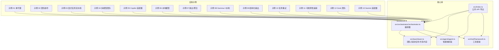
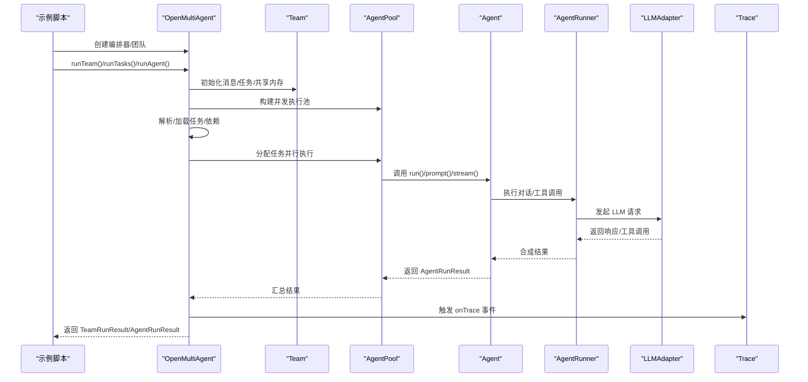
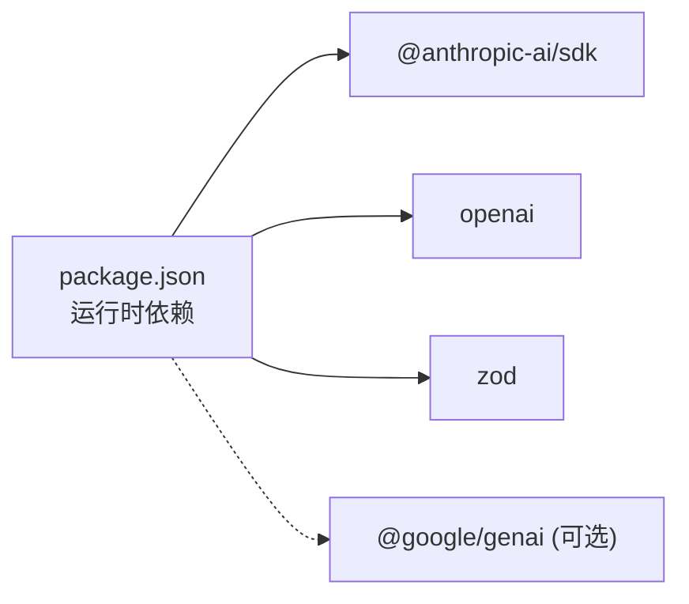

# 示例教程

<cite>
**本文引用的文件**
- [README.md](file://README.md)
- [package.json](file://package.json)
- [src/index.ts](file://src/index.ts)
- [src/orchestrator/orchestrator.ts](file://src/orchestrator/orchestrator.ts)
- [src/team/team.ts](file://src/team/team.ts)
- [src/agent/agent.ts](file://src/agent/agent.ts)
- [src/tool/framework.ts](file://src/tool/framework.ts)
- [examples/01-single-agent.ts](file://examples/01-single-agent.ts)
- [examples/02-team-collaboration.ts](file://examples/02-team-collaboration.ts)
- [examples/03-task-pipeline.ts](file://examples/03-task-pipeline.ts)
- [examples/04-multi-model-team.ts](file://examples/04-multi-model-team.ts)
- [examples/05-copilot-test.ts](file://examples/05-copilot-test.ts)
- [examples/06-local-model.ts](file://examples/06-local-model.ts)
- [examples/07-fan-out-aggregate.ts](file://examples/07-fan-out-aggregate.ts)
- [examples/08-gemma4-local.ts](file://examples/08-gemma4-local.ts)
- [examples/09-structured-output.ts](file://examples/09-structured-output.ts)
- [examples/10-task-retry.ts](file://examples/10-task-retry.ts)
- [examples/11-trace-observability.ts](file://examples/11-trace-observability.ts)
- [examples/12-grok.ts](file://examples/12-grok.ts)
- [examples/13-gemini.ts](file://examples/13-gemini.ts)
</cite>

## 目录
1. [简介](#简介)
2. [项目结构](#项目结构)
3. [核心组件](#核心组件)
4. [架构总览](#架构总览)
5. [详细组件分析](#详细组件分析)
6. [依赖关系分析](#依赖关系分析)
7. [性能考量](#性能考量)
8. [故障排除指南](#故障排除指南)
9. [结论](#结论)
10. [附录](#附录)

## 简介
本教程面向希望系统学习 Open Multi-Agent 框架的开发者与研究者，围绕仓库中的 13 个示例程序构建循序渐进的学习路径。从最简单的单代理示例出发，逐步引入团队协作、显式任务流水线、多模型混合团队、本地模型集成、结构化输出、重试机制、可观测性追踪、以及不同提供商（Grok、Gemini）适配器的使用。每个示例均提供运行说明、预期行为与最佳实践建议，帮助你快速掌握从“目标到结果”的端到端编排能力。

## 项目结构
该仓库采用按层组织的模块化设计：顶层入口导出公共 API；orchestrator 负责编排；team 提供消息总线与共享内存；agent 封装对话与工具调用循环；tool 提供工具定义与执行框架；llm 提供多提供商适配器；memory 提供共享存储；task 提供任务队列与依赖管理；examples 展示典型用法。

图表来源
- [src/index.ts:1-183](file://src/index.ts#L1-L183)
- [src/orchestrator/orchestrator.ts:514-800](file://src/orchestrator/orchestrator.ts#L514-L800)
- [src/team/team.ts:88-335](file://src/team/team.ts#L88-L335)
- [src/agent/agent.ts:81-623](file://src/agent/agent.ts#L81-L623)
- [src/tool/framework.ts:93-203](file://src/tool/framework.ts#L93-L203)

章节来源
- [README.md:113-136](file://README.md#L113-L136)
- [src/index.ts:57-183](file://src/index.ts#L57-L183)

## 核心组件
- 编排器（OpenMultiAgent）
  - 提供 runAgent/runTeam/runTasks 三种运行模式，统一进度回调与可观测性事件。
  - 内置任务队列、调度器、代理池，支持并发控制与失败重试。
- 团队（Team）
  - 维护代理名单、消息总线、任务队列与共享内存，提供事件桥接。
- 智能体（Agent）
  - 封装对话历史、流式输出、生命周期钩子、结构化输出校验与工具注册。
- 工具框架（ToolRegistry/defineTool）
  - 定义类型安全的工具，转换为 LLM 期望的 JSON Schema 并执行。
- LLM 适配器
  - 支持 Anthropic、OpenAI、Copilot、Grok、Gemini 等，可扩展至任意 OpenAI 兼容服务。
- 任务与队列（TaskQueue/Scheduler）
  - 基于依赖图的任务调度，自动分配与级联失败处理。

章节来源
- [src/orchestrator/orchestrator.ts:514-800](file://src/orchestrator/orchestrator.ts#L514-L800)
- [src/team/team.ts:88-335](file://src/team/team.ts#L88-L335)
- [src/agent/agent.ts:81-623](file://src/agent/agent.ts#L81-L623)
- [src/tool/framework.ts:93-203](file://src/tool/framework.ts#L93-L203)

## 架构总览
下图展示从示例到核心组件的调用关系与数据流，体现“目标驱动”的自动编排与“显式流水线”的灵活控制两条主线。

图表来源
- [src/orchestrator/orchestrator.ts:641-740](file://src/orchestrator/orchestrator.ts#L641-L740)
- [src/team/team.ts:109-140](file://src/team/team.ts#L109-L140)
- [src/agent/agent.ts:177-224](file://src/agent/agent.ts#L177-L224)

## 详细组件分析

### 示例 01：单智能体（runAgent/stream/prompt）
- 学习要点
  - 使用 runAgent 快速执行一次性任务。
  - 使用 Agent.stream 实现增量文本输出。
  - 使用 Agent.prompt 进行多轮对话并保留上下文。
- 关键配置
  - tools 列表启用内置工具（bash、file_*）。
  - maxTurns 控制最大对话轮次。
- 预期输出
  - 成功时输出最终文本与 token 统计；失败时打印错误信息。
- 最佳实践
  - 对需要流式输出的场景优先使用 Agent.stream。
  - 对需要上下文延续的交互使用 Agent.prompt。

章节来源
- [examples/01-single-agent.ts:14-132](file://examples/01-single-agent.ts#L14-L132)
- [src/agent/agent.ts:177-224](file://src/agent/agent.ts#L177-L224)

### 示例 02：团队协作（runTeam 协作）
- 学习要点
  - runTeam 自动分解目标为任务，协调多个角色（架构师、开发者、评审员）。
  - 共享内存用于跨阶段结果传递。
  - onProgress 输出任务与代理的生命周期事件。
- 关键配置
  - sharedMemory: true 启用共享内存。
  - maxConcurrency 控制并发度以保证输出可读性。
- 预期输出
  - 每个代理的工具调用次数、最终输出摘要与总体 token 消耗。
- 最佳实践
  - 将复杂工程拆分为明确角色与职责，避免代理重复工作。
  - 使用共享内存传递中间产物，减少跨轮次重复计算。

章节来源
- [examples/02-team-collaboration.ts:15-168](file://examples/02-team-collaboration.ts#L15-L168)
- [src/orchestrator/orchestrator.ts:641-740](file://src/orchestrator/orchestrator.ts#L641-L740)

### 示例 03：显式任务流水线（runTasks 依赖图）
- 学习要点
  - 显式定义任务列表与依赖关系（设计 → 实现 → 测试 + 评审并行）。
  - TaskQueue 自动阻塞与解阻，支持并发执行独立任务。
- 关键配置
  - dependsOn 指定上游任务标题映射为任务 ID。
  - maxConcurrency 允许测试与评审并行。
- 预期输出
  - 每个任务的完成时间、代理工具使用情况与最终评审意见。
- 最佳实践
  - 依赖图应尽量“无环”且最小化阻塞链路。
  - 对高风险环节设置 onApproval 回调进行人工审批。

章节来源
- [examples/03-task-pipeline.ts:15-202](file://examples/03-task-pipeline.ts#L15-L202)
- [src/orchestrator/orchestrator.ts:280-464](file://src/orchestrator/orchestrator.ts#L280-L464)

### 示例 04：多模型团队与自定义工具
- 学习要点
  - 在同一团队中混合 Anthropic 与 OpenAI 模型。
  - 使用 defineTool 定义自定义工具（汇率查询、货币格式化），并注入 ToolRegistry。
  - 通过 AgentPool 控制并发与顺序。
- 关键配置
  - 自定义工具输入使用 Zod 校验，执行函数返回标准化 ToolResult。
  - Agent 注入自定义 ToolRegistry 以启用工具。
- 预期输出
  - 研究员返回 JSON 格式的汇率数据；分析师基于数据生成简报。
- 最佳实践
  - 自定义工具需具备幂等与降级策略（网络异常时返回稳定占位值）。
  - 工具命名唯一，避免覆盖内置工具。

章节来源
- [examples/04-multi-model-team.ts:18-262](file://examples/04-multi-model-team.ts#L18-L262)
- [src/tool/framework.ts:71-83](file://src/tool/framework.ts#L71-L83)

### 示例 05：Copilot 适配器（GitHub Copilot）
- 学习要点
  - 使用 provider: 'copilot' 与默认模型 gpt-4o。
  - 若未设置 GITHUB_TOKEN，将触发设备流登录。
- 关键配置
  - defaultProvider: 'copilot'，defaultModel: 'gpt-4o'。
- 预期输出
  - 简短回答与 token 统计；失败时输出错误信息。
- 最佳实践
  - 在 CI 环境中预置 GITHUB_TOKEN 以避免交互式登录。

章节来源
- [examples/05-copilot-test.ts:11-50](file://examples/05-copilot-test.ts#L11-L50)

### 示例 06：本地模型（Ollama + Claude）
- 学习要点
  - 使用 provider: 'openai' + baseURL 指向 Ollama 的 OpenAI 兼容接口。
  - 通过 timeoutMs 防止本地推理超时。
- 关键配置
  - baseURL: 'http://localhost:11434/v1'，apiKey: 'ollama'。
  - 任务依赖：编码 → 本地模型评审。
- 预期输出
  - 本地模型评审报告与总体 token 消耗。
- 最佳实践
  - 本地模型工具调用需满足“工具类别”要求；必要时设置较长超时。

章节来源
- [examples/06-local-model.ts:25-201](file://examples/06-local-model.ts#L25-L201)
- [README.md:214-232](file://README.md#L214-L232)

### 示例 07：扇出/聚合（MapReduce）
- 学习要点
  - 使用 AgentPool.runParallel 并行获取多个视角分析。
  - 由合成器读取所有分析并生成平衡结论。
- 关键配置
  - 并发池大小与温度参数控制输出风格。
- 预期输出
  - 三个分析视角与最终合成报告，统计总 token 消耗。
- 最佳实践
  - 扇出阶段保持独立性，聚合阶段强调对比与权衡。

章节来源
- [examples/07-fan-out-aggregate.ts:18-210](file://examples/07-fan-out-aggregate.ts#L18-L210)

### 示例 08：Gemma 4 本地（与示例 06 类似）
- 学习要点
  - 使用 runTasks + runTeam 在本地 Gemma 4 上执行任务。
- 关键配置
  - baseURL 指向本地服务，model 选择 Gemma 4。
- 预期输出
  - 本地模型生成的代码与评审结果。
- 最佳实践
  - 本地模型适合零 API 成本的开发与测试流程。

章节来源
- [examples/08-gemma4-local.ts](file://examples/08-gemma4-local.ts)

### 示例 09：结构化输出（Zod Schema）
- 学习要点
  - 在 AgentConfig 中设置 outputSchema，自动解析并验证 JSON。
  - 验证失败时自动重试一次并反馈错误。
- 关键配置
  - Zod schema 描述期望字段与约束。
- 预期输出
  - 每条评论的结构化分析（情感、置信度、主题等）。
- 最佳实践
  - schema 设计要清晰且可验证；对边界条件给出默认值或降级策略。

章节来源
- [examples/09-structured-output.ts:17-74](file://examples/09-structured-output.ts#L17-L74)
- [src/agent/agent.ts:400-477](file://src/agent/agent.ts#L400-L477)

### 示例 10：任务重试（指数退避）
- 学习要点
  - 通过 maxRetries/retryDelayMs/retryBackoff 配置自动重试。
  - onProgress 接收 task_retry 事件，实时观察重试过程。
- 关键配置
  - 仅上游任务开启重试，下游任务依赖其成功。
- 预期输出
  - 重试间隔与错误日志，最终成功或失败。
- 最佳实践
  - 对易受外部波动影响的任务启用重试；合理设置最大尝试次数与退避系数。

章节来源
- [examples/10-task-retry.ts:19-133](file://examples/10-task-retry.ts#L19-L133)
- [src/orchestrator/orchestrator.ts:127-194](file://src/orchestrator/orchestrator.ts#L127-L194)

### 示例 11：可观测性追踪（onTrace）
- 学习要点
  - onTrace 回调输出 LLM 调用、工具执行、任务与代理的结构化事件。
  - 每个事件包含耗时、token 使用与 runId，便于关联与审计。
- 关键配置
  - defaultProvider/model 设置后，onTrace 会自动注入 runId。
- 预期输出
  - 逐项展示 LLM 调用、工具调用、任务与代理的耗时与 token 使用。
- 最佳实践
  - 将 trace 事件接入日志系统或可观测平台，实现端到端可视化。

章节来源
- [examples/11-trace-observability.ts:20-134](file://examples/11-trace-observability.ts#L20-L134)
- [src/agent/agent.ts:374-394](file://src/agent/agent.ts#L374-L394)

### 示例 12：Grok 团队协作
- 学习要点
  - 使用 provider: 'grok' 与 grok-code-fast-1 模型进行团队协作。
  - 与示例 02 相同的编排流程，但全部代理使用 Grok。
- 关键配置
  - defaultProvider: 'grok'，defaultModel: 'grok-code-fast-1'。
- 预期输出
  - 架构设计、代码实现与评审意见。
- 最佳实践
  - Grok 在代码优化场景表现优异，适合对齐高质量输出。

章节来源
- [examples/12-grok.ts:14-154](file://examples/12-grok.ts#L14-L154)

### 示例 13：Gemini 适配器
- 学习要点
  - 使用 provider: 'gemini' 与 gemini-2.5-flash 模型进行单代理测试。
- 关键配置
  - defaultProvider: 'gemini'，defaultModel: 'gemini-2.5-flash'。
- 预期输出
  - 简短回答与 token 统计。
- 最佳实践
  - 在需要 Google 生态集成或特定模型能力时选用 Gemini。

章节来源
- [examples/13-gemini.ts:10-49](file://examples/13-gemini.ts#L10-L49)

## 依赖关系分析
- 运行时依赖
  - @anthropic-ai/sdk、openai、zod 三者构成最小运行依赖集。
- 可选依赖
  - @google/genai 作为 peerDependencies，按需启用 Gemini 适配。
- Node 版本要求
  - engines.node >= 18。

图表来源
- [package.json:45-57](file://package.json#L45-L57)

章节来源
- [package.json:45-67](file://package.json#L45-L67)

## 性能考量
- 并发与吞吐
  - 通过 maxConcurrency 控制并发度，避免资源争用导致的延迟放大。
  - runParallel 适合扇出/聚合场景，显著缩短端到端时间。
- 令牌成本
  - 重试会累加 token 使用，应在 onProgress 中监控并优化 prompt 与 schema。
  - 本地模型可降低 API 成本，但需注意推理速度与工具调用稳定性。
- 超时与健壮性
  - 为本地模型设置合理的 timeoutMs，防止长时间阻塞。
  - 对易失败的外部调用（网络请求）在工具层实现降级与重试。

## 故障排除指南
- 环境变量缺失
  - Anthropic: ANTHROPIC_API_KEY
  - OpenAI: OPENAI_API_KEY
  - Grok: XAI_API_KEY
  - Copilot: GITHUB_TOKEN
  - Gemini: GEMINI_API_KEY
- 本地模型工具调用失败
  - 确认模型属于“工具类别”，并更新 Ollama 至最新版本。
  - 如使用代理，设置 no_proxy=localhost。
- 代理循环检测
  - 启用 loopDetection 并根据需求选择警告、终止或自定义回调。
- 重试与退避
  - 合理设置 maxRetries/retryDelayMs/retryBackoff，避免无限重试。
- 可观测性
  - 使用 onTrace 记录结构化事件，结合 runId 追踪全链路耗时与错误。

章节来源
- [README.md:38-41](file://README.md#L38-L41)
- [README.md:228-232](file://README.md#L228-L232)
- [src/agent/agent.ts:576-582](file://src/agent/agent.ts#L576-L582)

## 结论
通过这 13 个示例，你可以从单智能体起步，逐步掌握团队协作、显式流水线、多模型混合、本地模型集成、结构化输出、重试与可观测性等核心能力。框架以“目标到结果”的自动编排为核心价值，同时提供灵活的显式控制点，适用于 API 开发、代码审查、数据分析等多种实际场景。建议在生产环境中结合 onTrace、onApproval 与 loopDetection 等特性，确保可观测、可控与稳健。

## 附录
- 运行方式
  - 使用 npx tsx examples/<编号>-<名称>.ts 运行示例。
- 常见问题速查
  - 无法连接 LLM：检查对应环境变量与网络访问。
  - 本地模型工具调用失败：确认模型支持工具类别与 Ollama 版本。
  - 输出非结构化：为 AgentConfig 添加 outputSchema 并启用自动校验与重试。