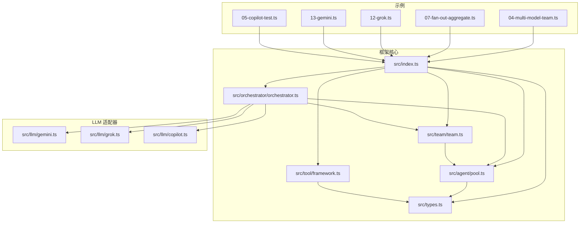
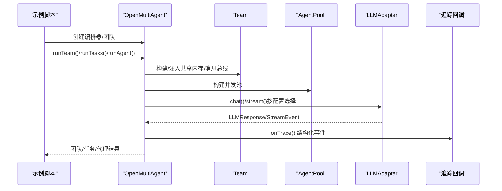
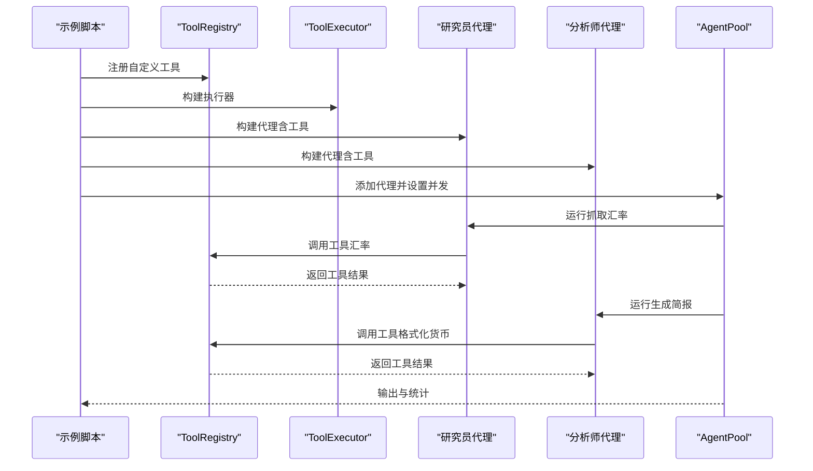
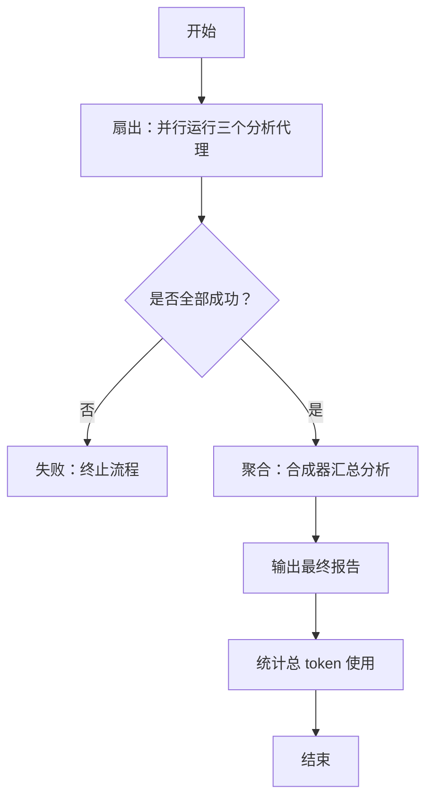
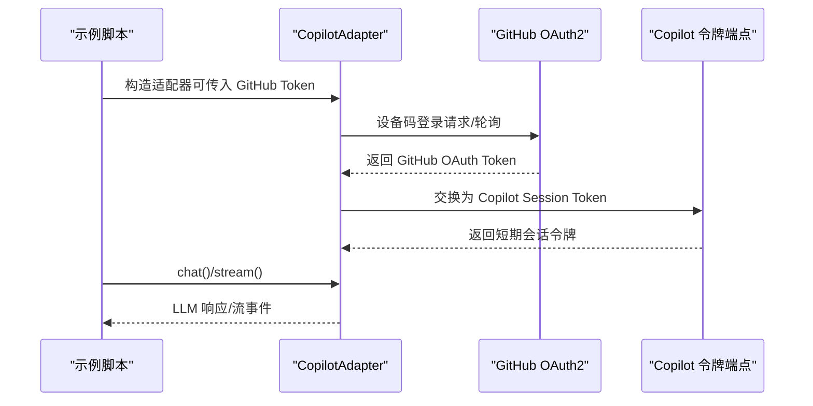
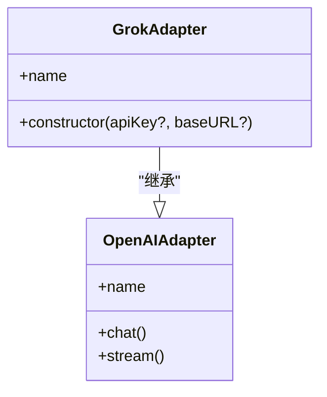
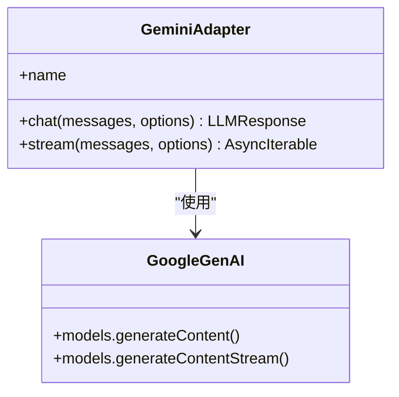
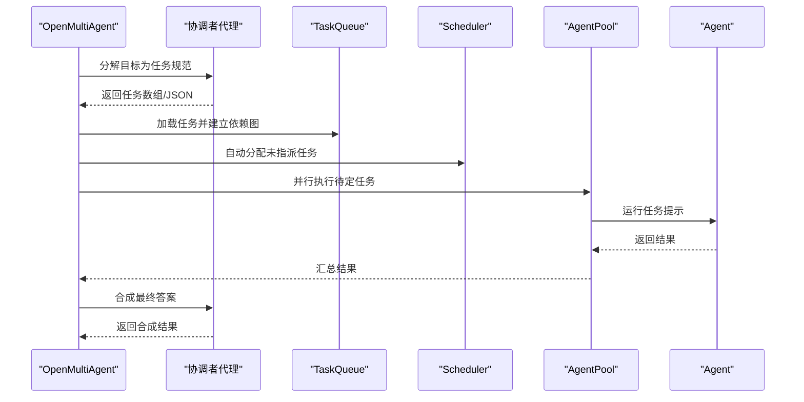
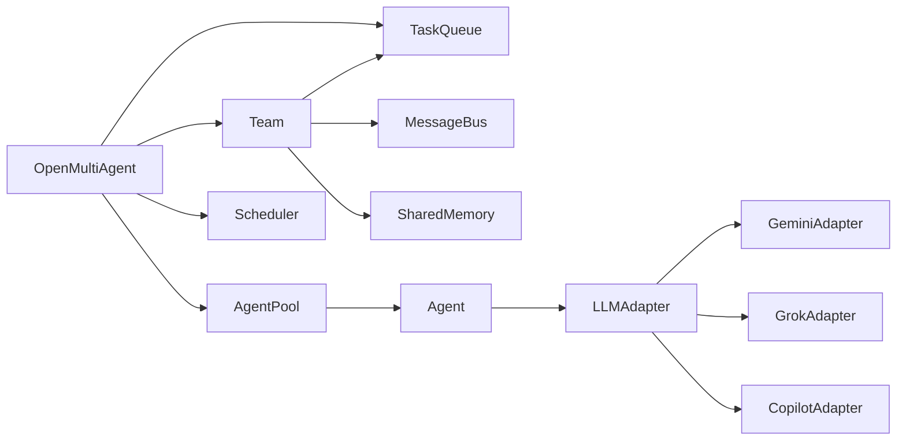

# 高级示例

<cite>
**本文引用的文件**
- [examples/04-multi-model-team.ts](file://examples/04-multi-model-team.ts)
- [examples/07-fan-out-aggregate.ts](file://examples/07-fan-out-aggregate.ts)
- [examples/12-grok.ts](file://examples/12-grok.ts)
- [examples/13-gemini.ts](file://examples/13-gemini.ts)
- [examples/05-copilot-test.ts](file://examples/05-copilot-test.ts)
- [src/index.ts](file://src/index.ts)
- [src/team/team.ts](file://src/team/team.ts)
- [src/orchestrator/orchestrator.ts](file://src/orchestrator/orchestrator.ts)
- [src/agent/pool.ts](file://src/agent/pool.ts)
- [src/tool/framework.ts](file://src/tool/framework.ts)
- [src/llm/gemini.ts](file://src/llm/gemini.ts)
- [src/llm/grok.ts](file://src/llm/grok.ts)
- [src/llm/copilot.ts](file://src/llm/copilot.ts)
- [src/types.ts](file://src/types.ts)
- [README.md](file://README.md)
</cite>

## 目录
1. [简介](#简介)
2. [项目结构](#项目结构)
3. [核心组件](#核心组件)
4. [架构总览](#架构总览)
5. [详细组件分析](#详细组件分析)
6. [依赖关系分析](#依赖关系分析)
7. [性能考量](#性能考量)
8. [故障排查指南](#故障排查指南)
9. [结论](#结论)
10. [附录](#附录)

## 简介
本文件面向有经验的开发者，系统化梳理 Open Multi-Agent 框架在高级场景中的实践与架构要点，重点覆盖以下主题：
- 多模型团队协作：混合 Anthropic、OpenAI、Grok、Gemini、Copilot 的团队编排与工具扩展
- Copilot 集成：认证流程、会话令牌管理与流式输出
- 扇出-聚合（MapReduce）模式：并行分析与合成报告
- Grok 与 Gemini 模型集成：适配器设计与调用路径
- 多模型切换、负载均衡与结果聚合：基于 AgentPool 与任务队列的并发控制
- 生产环境部署与可观测性：进度事件、追踪与重试策略

## 项目结构
该仓库采用按“层”组织的模块化结构，核心目录与职责如下：
- examples：示例脚本，涵盖单代理、团队协作、多模型团队、Copilot/Gemini/Grok 集成、扇出-聚合等高级用法
- src：框架源码，包含 Orchestrator、Team、Agent、Task、Tool、LLM Adapter、Memory、Types 等
- tests：端到端与单元测试，覆盖适配器、工具、循环检测、任务重试等

图示来源
- [src/index.ts:1-183](file://src/index.ts#L1-L183)
- [src/orchestrator/orchestrator.ts:1-1072](file://src/orchestrator/orchestrator.ts#L1-L1072)
- [src/team/team.ts:1-335](file://src/team/team.ts#L1-L335)
- [src/agent/pool.ts:1-286](file://src/agent/pool.ts#L1-L286)
- [src/tool/framework.ts:1-558](file://src/tool/framework.ts#L1-L558)
- [src/llm/gemini.ts:1-379](file://src/llm/gemini.ts#L1-L379)
- [src/llm/grok.ts:1-30](file://src/llm/grok.ts#L1-L30)
- [src/llm/copilot.ts:1-553](file://src/llm/copilot.ts#L1-L553)

章节来源
- [README.md:113-178](file://README.md#L113-L178)

## 核心组件
- Orchestrator（OpenMultiAgent）：顶层编排器，负责团队创建、自动分解与执行、进度回调、追踪与重试
- Team：团队实体，维护代理清单、消息总线、任务队列与共享内存
- AgentPool：并发池，通过信号量控制最大并发，支持并行运行与轮询派发
- ToolFramework：工具定义与注册中心，支持 Zod 输入校验与 JSON Schema 转换
- LLMAdapters：抽象统一的 LLM 接口，内置 Anthropic、OpenAI、Copilot、Gemini、Grok 适配器
- Types：跨模块共享的类型定义，包括内容块、消息、响应、工具、任务、追踪事件等

章节来源
- [src/index.ts:57-183](file://src/index.ts#L57-L183)
- [src/orchestrator/orchestrator.ts:514-800](file://src/orchestrator/orchestrator.ts#L514-L800)
- [src/team/team.ts:88-335](file://src/team/team.ts#L88-L335)
- [src/agent/pool.ts:58-286](file://src/agent/pool.ts#L58-L286)
- [src/tool/framework.ts:93-203](file://src/tool/framework.ts#L93-L203)
- [src/types.ts:526-543](file://src/types.ts#L526-L543)

## 架构总览
下图展示从示例到核心组件的调用链路与数据流：

图示来源
- [src/orchestrator/orchestrator.ts:641-740](file://src/orchestrator/orchestrator.ts#L641-L740)
- [src/team/team.ts:88-140](file://src/team/team.ts#L88-L140)
- [src/agent/pool.ts:127-180](file://src/agent/pool.ts#L127-L180)
- [src/types.ts:526-543](file://src/types.ts#L526-L543)

## 详细组件分析

### 组件A：多模型团队协作（混合 Anthropic/OpenAI，自定义工具）
- 场景目标：在同一团队中混合使用不同提供商模型，定义自定义工具并通过 AgentPool 控制并发
- 关键点
  - 自定义工具：使用 defineTool 定义输入 Zod Schema 与执行函数；通过 ToolRegistry 注册后注入 Agent
  - 混合提供商：根据环境变量动态选择模型与提供商（如 OpenAI 或 Anthropic），并在 Agent 配置中指定
  - 并发控制：使用 AgentPool 限制同时运行的代理数量，保证资源可控
  - 工具调用与回退：示例中自定义工具对网络请求失败进行优雅降级，返回占位数据以保证流程继续
- 数据流与处理逻辑
  - 步骤一：研究员代理使用自定义汇率工具抓取实时汇率
  - 步骤二：分析师代理接收研究员输出，格式化货币并生成简报
  - 步骤三：统计总 token 使用量，便于成本与性能评估

图示来源
- [examples/04-multi-model-team.ts:29-72](file://examples/04-multi-model-team.ts#L29-L72)
- [examples/04-multi-model-team.ts:116-132](file://examples/04-multi-model-team.ts#L116-L132)
- [examples/04-multi-model-team.ts:181-225](file://examples/04-multi-model-team.ts#L181-L225)
- [src/tool/framework.ts:93-203](file://src/tool/framework.ts#L93-L203)
- [src/agent/pool.ts:127-180](file://src/agent/pool.ts#L127-L180)

章节来源
- [examples/04-multi-model-team.ts:1-262](file://examples/04-multi-model-team.ts#L1-L262)
- [src/tool/framework.ts:71-83](file://src/tool/framework.ts#L71-L83)
- [src/agent/pool.ts:58-115](file://src/agent/pool.ts#L58-L115)

### 组件B：扇出-聚合（MapReduce）模式
- 场景目标：对同一问题并行生成多个视角分析，再由合成器汇总形成平衡报告
- 关键点
  - 并行执行：使用 AgentPool.runParallel 同时启动三个分析代理
  - 结果聚合：合成器读取所有分析结果，输出结构化建议
  - 错误处理：任一分析失败则终止流程，确保质量门槛
  - 成本统计：汇总各代理的 token 使用，便于成本控制
- 流程图

图示来源
- [examples/07-fan-out-aggregate.ts:123-172](file://examples/07-fan-out-aggregate.ts#L123-L172)
- [examples/07-fan-out-aggregate.ts:190-207](file://examples/07-fan-out-aggregate.ts#L190-L207)
- [src/agent/pool.ts:153-180](file://src/agent/pool.ts#L153-L180)

章节来源
- [examples/07-fan-out-aggregate.ts:1-210](file://examples/07-fan-out-aggregate.ts#L1-L210)
- [src/agent/pool.ts:153-180](file://src/agent/pool.ts#L153-L180)

### 组件C：Copilot 集成（认证与流式输出）
- 场景目标：通过 GitHub OAuth2 设备码流程获取 Copilot 会话令牌，并与适配器交互
- 关键点
  - 认证流程：设备码登录、轮询授权、令牌交换，支持回调打印验证信息
  - 会话令牌缓存：短时令牌自动刷新，避免重复登录
  - 适配器实现：基于 OpenAI 兼容接口，向 Copilot 端点发起请求，支持同步与流式
- 序列图

图示来源
- [examples/05-copilot-test.ts:14-24](file://examples/05-copilot-test.ts#L14-L24)
- [src/llm/copilot.ts:109-169](file://src/llm/copilot.ts#L109-L169)
- [src/llm/copilot.ts:273-282](file://src/llm/copilot.ts#L273-L282)
- [src/llm/copilot.ts:298-449](file://src/llm/copilot.ts#L298-L449)

章节来源
- [examples/05-copilot-test.ts:1-50](file://examples/05-copilot-test.ts#L1-L50)
- [src/llm/copilot.ts:228-450](file://src/llm/copilot.ts#L228-L450)

### 组件D：Grok 集成（xAI）
- 场景目标：使用 Grok 模型进行代码优化类任务的团队协作
- 关键点
  - 适配器继承 OpenAIAdapter，硬编码官方 xAI 端点与环境变量
  - 示例中通过 runTeam 协作完成最小 Express API 的构建
- 类图

图示来源
- [src/llm/grok.ts:19-29](file://src/llm/grok.ts#L19-L29)

章节来源
- [examples/12-grok.ts:1-154](file://examples/12-grok.ts#L1-L154)
- [src/llm/grok.ts:1-30](file://src/llm/grok.ts#L1-L30)

### 组件E：Gemini 集成（Google GenAI）
- 场景目标：通过 @google/genai SDK 调用 Gemini 模型，支持同步与流式
- 关键点
  - 内容转换：将框架的消息与工具调用映射到 Gemini 的 Content/Part 结构
  - 工具声明：将 LLMToolDef 转换为 Gemini 的 FunctionDeclaration 数组
  - 流式处理：累积增量文本与工具调用，最终发出 done 事件
- 类图

图示来源
- [src/llm/gemini.ts:249-379](file://src/llm/gemini.ts#L249-L379)

章节来源
- [examples/13-gemini.ts:1-49](file://examples/13-gemini.ts#L1-L49)
- [src/llm/gemini.ts:1-379](file://src/llm/gemini.ts#L1-L379)

### 组件F：编排器与任务队列（自动分解与执行）
- 场景目标：将高层目标分解为任务图，自动分配与并行执行，最终合成结果
- 关键点
  - 协调者模式：临时协调者代理负责分解目标为任务数组或 JSON 规范
  - 任务解析：解析标题依赖为任务 ID，构建依赖图
  - 并行执行：按依赖顺序并行调度，独立任务并发执行
  - 重试机制：任务失败可配置指数退避重试，累计 token 使用
  - 共享记忆：任务结果写入共享内存供后续代理读取
- 序列图

图示来源
- [src/orchestrator/orchestrator.ts:641-740](file://src/orchestrator/orchestrator.ts#L641-L740)
- [src/orchestrator/orchestrator.ts:280-464](file://src/orchestrator/orchestrator.ts#L280-L464)
- [src/team/team.ts:474-502](file://src/team/team.ts#L474-L502)

章节来源
- [src/orchestrator/orchestrator.ts:514-800](file://src/orchestrator/orchestrator.ts#L514-L800)
- [src/team/team.ts:88-335](file://src/team/team.ts#L88-L335)

## 依赖关系分析
- 组件耦合
  - OpenMultiAgent 依赖 Team、AgentPool、Scheduler、TaskQueue、LLMAdapter
  - Team 内部持有 MessageBus、TaskQueue、SharedMemory，并桥接队列事件
  - AgentPool 通过信号量控制并发，封装 run/runParallel/runAny
  - LLMAdapters 实现统一接口，适配不同提供商
- 外部依赖
  - @google/genai（Gemini）
  - openai（Copilot/Grok/OpenAI 兼容）
  - anthropic（Anthropic）

图示来源
- [src/orchestrator/orchestrator.ts:62-66](file://src/orchestrator/orchestrator.ts#L62-L66)
- [src/team/team.ts:18-22](file://src/team/team.ts#L18-L22)
- [src/agent/pool.ts:24-26](file://src/agent/pool.ts#L24-L26)
- [src/llm/gemini.ts:27-37](file://src/llm/gemini.ts#L27-L37)
- [src/llm/grok.ts:8](file://src/llm/grok.ts#L8)
- [src/llm/copilot.ts:27](file://src/llm/copilot.ts#L27)

章节来源
- [src/index.ts:57-117](file://src/index.ts#L57-L117)

## 性能考量
- 并发与限流
  - AgentPool 通过信号量限制最大并发，避免资源争用与超卖
  - runParallel 并行度受 maxConcurrency 与任务依赖约束
- 任务重试与退避
  - executeWithRetry 支持指数退避与最大延迟上限，累计 token 使用以准确计费
- 流式输出与内存
  - Copilot/Gemini 流式处理需累积增量内容，注意内存占用与序列一致性
- 模型选择与成本
  - 不同提供商的定价与上下文窗口差异较大，结合任务复杂度与预算选择模型
- 本地模型优化
  - 使用 baseURL 指向本地服务时，合理设置超时与工具调用能力，避免长时间阻塞

## 故障排查指南
- Copilot 登录失败
  - 检查 GITHUB_TOKEN 或 GITHUB_COPILOT_TOKEN 是否正确设置
  - 若无令牌，确认设备码流程是否被阻断或超时
- Grok/Gemini API Key 缺失
  - 确认 XAI_API_KEY、GEMINI_API_KEY 环境变量已配置
- 任务失败与重试
  - 查看 onProgress 中的 task_retry 事件，调整 maxRetries/retryDelayMs/retryBackoff
  - 检查 onTrace 中的任务追踪事件，定位失败原因
- 循环检测
  - 在 AgentConfig 中启用 loopDetection，根据需要选择 warn/terminate/custom 行为
- 工具调用异常
  - 确认 ToolRegistry 已注册工具且名称匹配
  - 对于本地模型，若工具调用未走标准格式，检查框架的文本提取回退逻辑

章节来源
- [src/orchestrator/orchestrator.ts:127-194](file://src/orchestrator/orchestrator.ts#L127-L194)
- [src/llm/copilot.ts:109-169](file://src/llm/copilot.ts#L109-L169)
- [src/types.ts:248-277](file://src/types.ts#L248-L277)
- [src/tool/framework.ts:93-203](file://src/tool/framework.ts#L93-L203)

## 结论
本高级示例文档展示了如何在 Open Multi-Agent 框架中实现多模型团队协作、Copilot 集成、扇出-聚合模式以及 Grok/Gemini 的无缝接入。通过 Orchestrator 的协调、AgentPool 的并发控制、TaskQueue 的依赖管理与 SharedMemory 的状态共享，开发者可以快速搭建高可靠、可观测、可扩展的多智能体工作流。配合重试与循环检测等工程化能力，可在生产环境中稳定落地。

## 附录
- 快速参考
  - 多模型团队：示例 04，自定义工具 + AgentPool 并发
  - 扇出-聚合：示例 07，runParallel + 合成器
  - Copilot：示例 05，OAuth2 设备码 + 适配器
  - Grok：示例 12，团队协作 + 进度回调
  - Gemini：示例 13，适配器 smoke test
- 类型与接口
  - LLMAdapter、LLMMessage、LLMResponse、ToolDefinition、AgentConfig、TeamConfig、Task、OrchestratorEvent、TraceEvent 等

章节来源
- [README.md:113-136](file://README.md#L113-L136)
- [src/types.ts:526-543](file://src/types.ts#L526-L543)