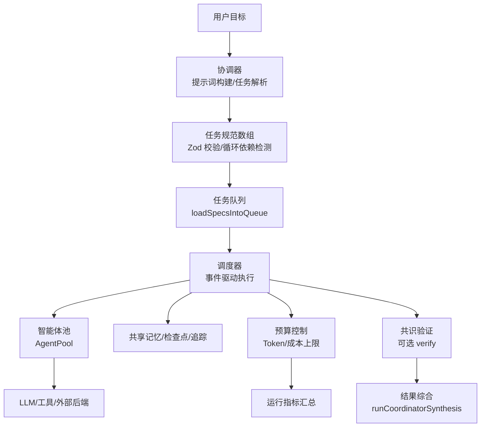
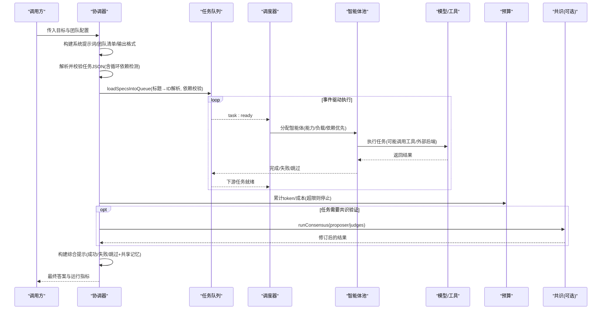
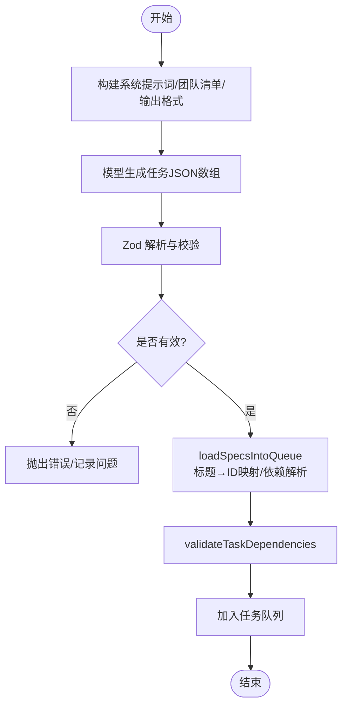
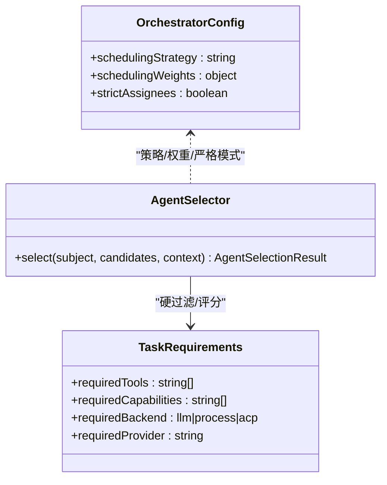
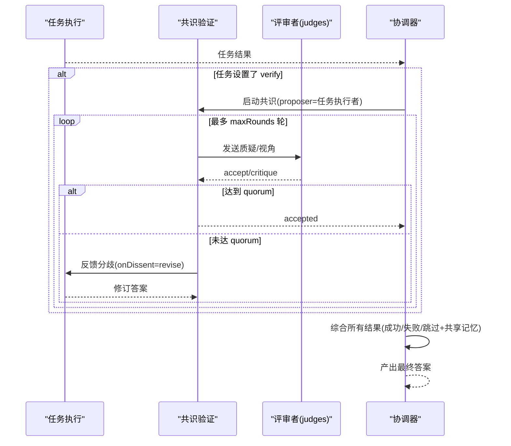
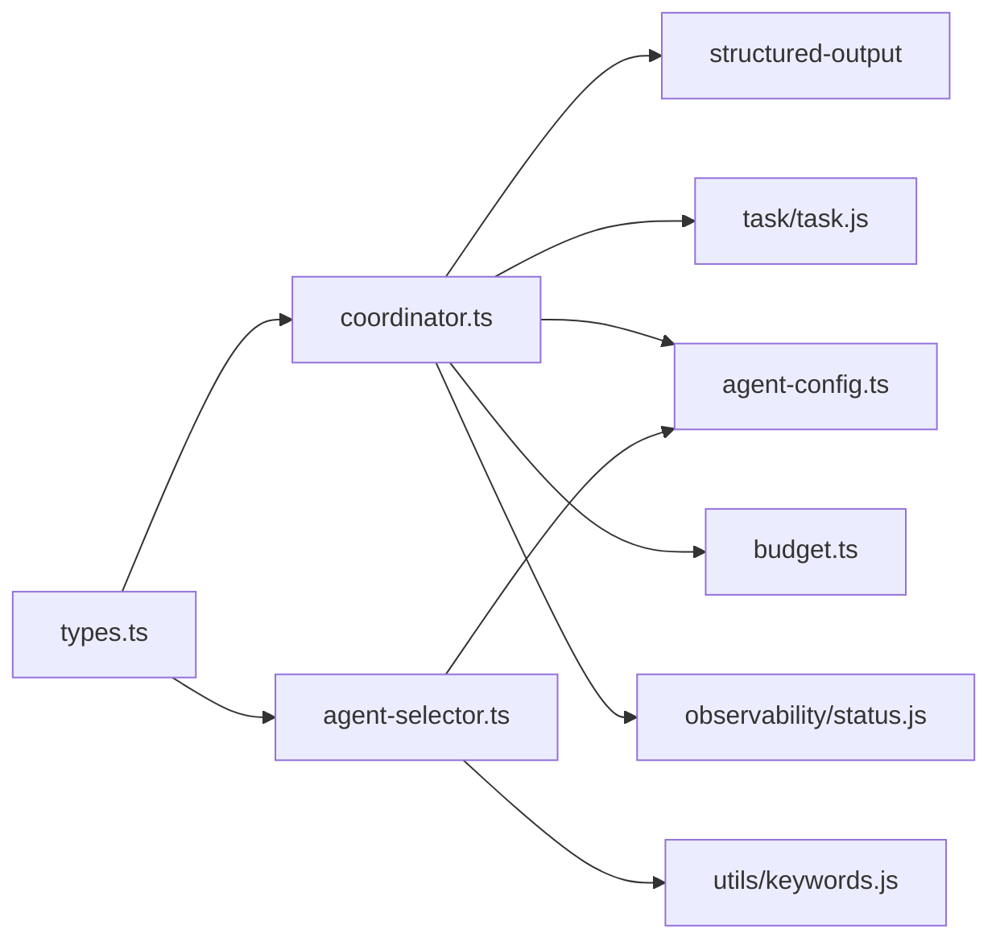

# 协调器（Coordinator）

<cite>
**本文引用的文件**
- [packages/core/src/orchestrator/coordinator.ts](file://packages/core/src/orchestrator/coordinator.ts)
- [packages/core/src/orchestrator/agent-selector.ts](file://packages/core/src/orchestrator/agent-selector.ts)
- [packages/core/src/orchestrator/budget.ts](file://packages/core/src/orchestrator/budget.ts)
- [packages/core/src/types.ts](file://packages/core/src/types.ts)
- [packages/core/README.md](file://packages/core/README.md)
- [docs/consensus.md](file://docs/consensus.md)
- [docs/task-scheduling.md](file://docs/task-scheduling.md)
</cite>

## 目录
1. [简介](#简介)
2. [项目结构](#项目结构)
3. [核心组件](#核心组件)
4. [架构总览](#架构总览)
5. [详细组件分析](#详细组件分析)
6. [依赖关系分析](#依赖关系分析)
7. [性能与预算控制](#性能与预算控制)
8. [故障排查指南](#故障排查指南)
9. [结论](#结论)
10. [附录：配置选项速查](#附录配置选项速查)

## 简介
协调器是 Open Multi-Agent 的“目标到任务图”的转换中枢。它负责：
- 解析用户目标，生成可执行的任务规范（任务标题、描述、依赖、负责人、能力/工具要求等）。
- 构建系统提示词与团队清单，约束输出格式并检测循环依赖。
- 将任务规范加载为任务队列，交由调度器按依赖事件驱动执行。
- 在所有任务完成后进行结果综合，产出面向原始目标的最终回答。
- 在必要时启用共识验证（verify），对关键任务结果进行多智能体复核。

该组件强调“只描述目标，不画任务图”，通过运行时动态规划实现复杂的多智能体协作。

## 项目结构
协调器相关代码集中在 orchestrator 子系统中，并与类型定义、调度、预算、共识等模块紧密协作：
- 协调器核心：coordinator.ts（提示词构建、任务规范解析、输出校验、循环依赖检测、综合合成）
- 智能体选择：agent-selector.ts（硬过滤 + 能力/关键词匹配评分）
- 预算与指标：budget.ts（token/成本预算、运行指标汇总）
- 类型与配置：types.ts（OrchestratorConfig、RunTeamOptions、Task 等）
- 文档：task-scheduling.md、consensus.md（调度策略、共识验证）

图表来源
- [packages/core/src/orchestrator/coordinator.ts:365-486](file://packages/core/src/orchestrator/coordinator.ts#L365-L486)
- [packages/core/src/orchestrator/coordinator.ts:696-800](file://packages/core/src/orchestrator/coordinator.ts#L696-L800)
- [docs/task-scheduling.md:1-26](file://docs/task-scheduling.md#L1-L26)
- [packages/core/src/orchestrator/budget.ts:118-168](file://packages/core/src/orchestrator/budget.ts#L118-L168)

章节来源
- [packages/core/README.md:237-252](file://packages/core/README.md#L237-L252)
- [docs/task-scheduling.md:1-26](file://docs/task-scheduling.md#L1-L26)

## 核心组件
- 协调器提示词与清单构建：将团队角色摘要、可用工具、模型信息以受限清单形式注入，避免泄露完整 systemPrompt；同时给出严格的 JSON 输出格式说明。
- 任务规范解析与校验：使用 Zod 严格校验任务字段，强制 title/description/assignee/dependsOn 等必填项，并对 dependsOn 做存在性与唯一性校验。
- 循环依赖检测：在 schema 中内置 DFS 环检测，发现环即拒绝计划。
- 任务加载与依赖解析：先创建任务获取稳定 ID，再二次解析 title-based 依赖为真实 ID，最后统一校验并加入队列。
- 结果综合：收集已完成/失败/跳过任务及共享记忆摘要，构造综合提示，调用协调器 Agent 产出最终答案。
- 预算与指标：每次调用后更新累计 token/成本，超限则触发预算事件并标记失败。

章节来源
- [packages/core/src/orchestrator/coordinator.ts:75-106](file://packages/core/src/orchestrator/coordinator.ts#L75-L106)
- [packages/core/src/orchestrator/coordinator.ts:112-186](file://packages/core/src/orchestrator/coordinator.ts#L112-L186)
- [packages/core/src/orchestrator/coordinator.ts:696-800](file://packages/core/src/orchestrator/coordinator.ts#L696-L800)
- [packages/core/src/orchestrator/coordinator.ts:546-642](file://packages/core/src/orchestrator/coordinator.ts#L546-L642)
- [packages/core/src/orchestrator/budget.ts:118-168](file://packages/core/src/orchestrator/budget.ts#L118-L168)

## 架构总览
协调器处于编排层的核心位置：接收高层目标，产出结构化任务图；调度器基于依赖事件驱动执行；预算模块保障运行边界；共识模块提供可选的结果复核；最终由协调器综合所有任务结果形成最终答案。

图表来源
- [packages/core/src/orchestrator/coordinator.ts:365-486](file://packages/core/src/orchestrator/coordinator.ts#L365-L486)
- [packages/core/src/orchestrator/coordinator.ts:696-800](file://packages/core/src/orchestrator/coordinator.ts#L696-L800)
- [docs/task-scheduling.md:8-26](file://docs/task-scheduling.md#L8-L26)
- [packages/core/src/orchestrator/budget.ts:118-168](file://packages/core/src/orchestrator/budget.ts#L118-L168)
- [docs/consensus.md:1-64](file://docs/consensus.md#L1-L64)

## 详细组件分析

### 目标分解算法与任务规范解析
- 输入：用户目标字符串与团队配置。
- 处理：
  - 构建协调器系统提示词与团队清单，明确输出格式与依赖指导原则。
  - 调用模型生成任务 JSON 数组。
  - 使用 Zod 严格解析并校验：title/description/assignee/dependsOn 等字段；支持 memoryScope、优先级、重试、requires、verify 等扩展字段。
  - 校验 includes：未知 assignee（strictAssignees）、重复标题、依赖不存在或歧义、循环依赖。
- 输出：ParsedTaskSpec[]，随后被加载进任务队列。

图表来源
- [packages/core/src/orchestrator/coordinator.ts:365-486](file://packages/core/src/orchestrator/coordinator.ts#L365-L486)
- [packages/core/src/orchestrator/coordinator.ts:75-106](file://packages/core/src/orchestrator/coordinator.ts#L75-L106)
- [packages/core/src/orchestrator/coordinator.ts:696-800](file://packages/core/src/orchestrator/coordinator.ts#L696-L800)

章节来源
- [packages/core/src/orchestrator/coordinator.ts:75-106](file://packages/core/src/orchestrator/coordinator.ts#L75-L106)
- [packages/core/src/orchestrator/coordinator.ts:112-186](file://packages/core/src/orchestrator/coordinator.ts#L112-L186)
- [packages/core/src/orchestrator/coordinator.ts:696-800](file://packages/core/src/orchestrator/coordinator.ts#L696-L800)

### 智能体选择策略与任务分配机制
- 硬过滤：仅基于已解析的工具授权、后端类型、Provider、以及声明的能力标签进行资格判定，绝不从 systemPrompt/名称/自然语言推断权限。
- 评分排序：
  - 能力亲和度优先（基于 capabilities 与任务需求文本的双向关键词匹配）。
  - 关键词亲和度作为次级信号。
  - 分数相同按 agent name 升序打破平局，确保确定性。
- 调度策略（OrchestratorConfig.schedulingStrategy）：
  - dependency-first（默认）：优先分配能解锁最多下游任务的 ready 任务，并在候选中轮转。
  - round-robin：按队列顺序均匀分发。
  - least-busy：选择当前活跃任务最少的候选。
  - capability-match：先硬过滤，再按能力/关键词匹配。
  - composite：按依赖关键性排序，结合 fit 与负载的综合评分。
- 显式 assignee 保留：若任务指定了负责人，必须满足其 requires；否则失败。

图表来源
- [packages/core/src/orchestrator/agent-selector.ts:95-223](file://packages/core/src/orchestrator/agent-selector.ts#L95-L223)
- [packages/core/src/types.ts:2132-2180](file://packages/core/src/types.ts#L2132-L2180)

章节来源
- [packages/core/src/orchestrator/agent-selector.ts:95-223](file://packages/core/src/orchestrator/agent-selector.ts#L95-L223)
- [packages/core/src/types.ts:2132-2180](file://packages/core/src/types.ts#L2132-L2180)
- [docs/task-scheduling.md:98-133](file://docs/task-scheduling.md#L98-L133)

### 系统提示词构建、团队清单与输出格式
- 团队清单（Roster Manifest）：
  - 暴露每个 agent 的 name、model、roleSummary（≤140字符）、capabilities（≤20）、tools（≤24）、costTier。
  - 不暴露完整 systemPrompt，防止信息泄露。
- 输出格式：
  - 强制返回 JSON 数组，包含 title/description/assignee/dependsOn/requires/verify（可选）。
  - 提供依赖指导：仅在 manifest 表明某 agent 消费该输入时才建立依赖，避免过度连接降低并行度。
- 综合阶段提示：
  - 聚合已完成/失败/跳过任务结果与共享记忆摘要，要求协调器产出面向原始目标的最终答案。

章节来源
- [packages/core/src/orchestrator/coordinator.ts:321-363](file://packages/core/src/orchestrator/coordinator.ts#L321-L363)
- [packages/core/src/orchestrator/coordinator.ts:414-486](file://packages/core/src/orchestrator/coordinator.ts#L414-L486)
- [packages/core/src/orchestrator/coordinator.ts:644-688](file://packages/core/src/orchestrator/coordinator.ts#L644-L688)

### 输出格式验证与循环依赖检测
- 使用 Zod 严格模式校验任务字段类型与取值范围。
- 自定义校验：
  - strictAssignees：拒绝不在团队名单中的 assignee。
  - 标题去重：重复标题报错。
  - 依赖存在性与唯一性：未知或歧义依赖报错。
  - 循环依赖检测：DFS 遍历，发现环即拒绝计划。

章节来源
- [packages/core/src/orchestrator/coordinator.ts:75-106](file://packages/core/src/orchestrator/coordinator.ts#L75-L106)
- [packages/core/src/orchestrator/coordinator.ts:112-186](file://packages/core/src/orchestrator/coordinator.ts#L112-L186)

### 共识验证（Consensus）与结果综合
- 任务级 verify：
  - 协调器可在任务 JSON 中设置 verify 为 true 或部分配置（mode/quorum/maxRounds/onDissent）。
  - 当 RunTeamOptions.verifyJudges 存在时，部分配置会被合并为完整的 ConsensusVerifyOptions。
  - 无 verifyJudges 时，verify 键被忽略。
- 共识流程：
  - proposer 提出答案，judges 按 mode（refute/lens）逐轮质疑/审视，达到 quorum 提前终止。
  - onDissent 决定继续修订、直接拒绝或保留原答案。
- 结果综合：
  - 收集所有任务结果与共享记忆摘要，构造综合提示，调用协调器 Agent 产出最终答案。
  - 综合阶段同样受预算控制，超限则中止。

图表来源
- [packages/core/src/orchestrator/coordinator.ts:205-249](file://packages/core/src/orchestrator/coordinator.ts#L205-L249)
- [docs/consensus.md:1-64](file://docs/consensus.md#L1-L64)
- [packages/core/src/orchestrator/coordinator.ts:546-642](file://packages/core/src/orchestrator/coordinator.ts#L546-L642)

章节来源
- [docs/consensus.md:1-64](file://docs/consensus.md#L1-L64)
- [packages/core/src/orchestrator/coordinator.ts:205-249](file://packages/core/src/orchestrator/coordinator.ts#L205-L249)
- [packages/core/src/orchestrator/coordinator.ts:546-642](file://packages/core/src/orchestrator/coordinator.ts#L546-L642)

### 实际协调场景示例（多智能体协作流程）
- 场景：研究对比与推荐
  - 协调器将“比较三种方法并推荐一种”的目标分解为若干子任务（如资料检索、证据对比、权衡分析、撰写建议）。
  - 依赖关系最小化：仅在 manifest 显示某角色需要上游输入时才建立依赖，保证最大并行度。
  - 智能体选择：依据角色能力与任务需求匹配负责人；若任务有 requires，则硬过滤后再评分。
  - 共识验证：对关键结论（如推荐决策）开启 verify，由多个 judge 进行反驳/多角度审视，达到共识阈值即接受。
  - 结果综合：协调器汇总各任务结果与共享记忆，生成面向原始目标的最终报告。
  - 失败恢复：若部分任务失败/跳过，综合阶段会注明缺口；可通过 checkpoint 恢复与自适应修复继续推进未完成分支。

章节来源
- [packages/core/README.md:103-109](file://packages/core/README.md#L103-L109)
- [docs/task-scheduling.md:8-26](file://docs/task-scheduling.md#L8-L26)
- [docs/consensus.md:1-64](file://docs/consensus.md#L1-L64)

## 依赖关系分析
- coordinator.ts 依赖：
  - structured-output（extractJSON）用于提取模型输出的 JSON。
  - task 模块（createTask、validateTaskDependencies）用于任务创建与依赖校验。
  - agent-config（applyDefaultToolPreset、resolveAgentToolDefinitions、withModelRoute）用于工具与模型路由。
  - budget（applyBudgetAccounting、buildCostEstimateContext、emitBudgetExceeded）用于预算控制。
  - observability（classifyRunFailure）用于状态分类。
- agent-selector.ts 依赖：
  - utils/keywords（关键词提取与评分）。
  - agent-config（工具定义解析）。
- types.ts 提供全局类型与配置接口（OrchestratorConfig、RunTeamOptions、Task、ConsensusVerifyOptions 等）。

图表来源
- [packages/core/src/orchestrator/coordinator.ts:10-38](file://packages/core/src/orchestrator/coordinator.ts#L10-L38)
- [packages/core/src/orchestrator/agent-selector.ts:10-22](file://packages/core/src/orchestrator/agent-selector.ts#L10-L22)
- [packages/core/src/types.ts:2132-2180](file://packages/core/src/types.ts#L2132-L2180)

章节来源
- [packages/core/src/orchestrator/coordinator.ts:10-38](file://packages/core/src/orchestrator/coordinator.ts#L10-L38)
- [packages/core/src/orchestrator/agent-selector.ts:10-22](file://packages/core/src/orchestrator/agent-selector.ts#L10-L22)
- [packages/core/src/types.ts:2132-2180](file://packages/core/src/types.ts#L2132-L2180)

## 性能与预算控制
- 事件驱动执行：下游任务一旦依赖满足即启动，无需等待同批其他无关任务，最大化并行度。
- 调度策略优化：
  - dependency-first/composite 适合强依赖 DAG，优先解锁关键路径。
  - least-busy 适合时长差异大的任务，均衡负载。
  - round-robin 适用于可互换智能体。
- 预算控制：
  - Token 预算：累计 token 超过阈值即触发预算事件并停止新任务派发。
  - 成本预算：通过 estimateCost 计算增量成本，超过 maxCostBudget 同样停止。
  - 预算检查点在 turn 与任务边界执行，允许一次调用越界但整体可控。
- 上下文与压缩：配合 ContextStrategy（滑动窗口/总结/压缩）减少长对话开销。
- 观测与回放：Trace、Run Viewer、执行回执便于定位瓶颈与回放。

章节来源
- [docs/task-scheduling.md:8-26](file://docs/task-scheduling.md#L8-L26)
- [packages/core/src/orchestrator/budget.ts:118-168](file://packages/core/src/orchestrator/budget.ts#L118-L168)
- [packages/core/README.md:288-316](file://packages/core/README.md#L288-L316)

## 故障排查指南
- 循环依赖：Zod 自定义校验检测到环即拒绝计划，需调整任务依赖关系。
- 未知/重复标题：dependsOn 引用不存在或标题重复会导致校验失败，需修正任务标题或依赖引用。
- 非法 assignee：strictAssignees=true 时，协调器指定的不在团队名单中的 assignee 将被拒绝；可临时设为 false 回退旧行为，但不推荐。
- 无合格智能体：当任务 requires 无法满足（工具/能力/后端/Provider）时，调度前即失败，需调整任务要求或智能体配置。
- 预算超限：Token/成本超限时会触发 budget_exceeded 事件，后续不再派发新任务；检查 estimateCost 与预算上限。
- 共识未达成：onDissent=reject 时直接拒绝；可调整 quorum、maxRounds 或 judge 提示词。

章节来源
- [packages/core/src/orchestrator/coordinator.ts:112-186](file://packages/core/src/orchestrator/coordinator.ts#L112-L186)
- [packages/core/src/orchestrator/agent-selector.ts:236-299](file://packages/core/src/orchestrator/agent-selector.ts#L236-L299)
- [packages/core/src/orchestrator/budget.ts:170-182](file://packages/core/src/orchestrator/budget.ts#L170-L182)
- [docs/consensus.md:25-64](file://docs/consensus.md#L25-L64)

## 结论
协调器通过“目标→任务图→执行→综合”的闭环，实现了灵活且可控的多智能体编排。其优势在于：
- 动态规划：无需手工维护工作流图，随目标变化自动生成最优 DAG。
- 强约束：Zod 严格校验、循环依赖检测、严格 assignee 校验，确保计划安全。
- 可解释选择：能力/关键词双通道评分，结合调度策略，兼顾效率与公平。
- 可靠运行：预算控制、事件驱动调度、共识验证、检查点与观测体系共同保障生产可用性。

## 附录：配置选项速查
- 协调器配置（CoordinatorConfig）
  - model/provider/baseURL/apiKey：覆盖默认模型与 Provider。
  - systemPrompt/instructions：自定义系统提示或附加指令。
  - maxTurns/maxTokens/temperature/topP/topK/minP/parallelToolCalls/frequencyPenalty/presencePenalty/extrabody：控制生成参数。
  - toolPreset/tools/disallowedTools：工具白/黑名单与预设。
  - cwd/loopDetection/timeoutMs/callTimeoutMs：运行环境与超时控制。
- 编排配置（OrchestratorConfig）
  - schedulingStrategy/schedulingWeights：调度策略与复合权重。
  - strictAssignees：是否拒绝未知 assignee。
  - executionRouter：执行拓扑路由（Single/Team）。
  - defaultModel/defaultProvider/defaultBaseURL/defaultApiKey/defaultToolPreset/defaultCwd：默认值。
  - maxTokenBudget/maxCostBudget/estimateCost：预算控制。
  - verifyJudges：为协调器生成的任务提供共识评审者。
- 运行选项（RunTeamOptions）
  - planOnly：仅生成计划不执行。
  - revealCoordinator：为 worker 注入团队上下文块。
  - modelRouting：模型路由策略。

章节来源
- [packages/core/src/types.ts:2603-2640](file://packages/core/src/types.ts#L2603-L2640)
- [packages/core/src/types.ts:2132-2180](file://packages/core/src/types.ts#L2132-L2180)
- [packages/core/src/types.ts:1811-1846](file://packages/core/src/types.ts#L1811-L1846)
- [packages/core/README.md:187-222](file://packages/core/README.md#L187-L222)