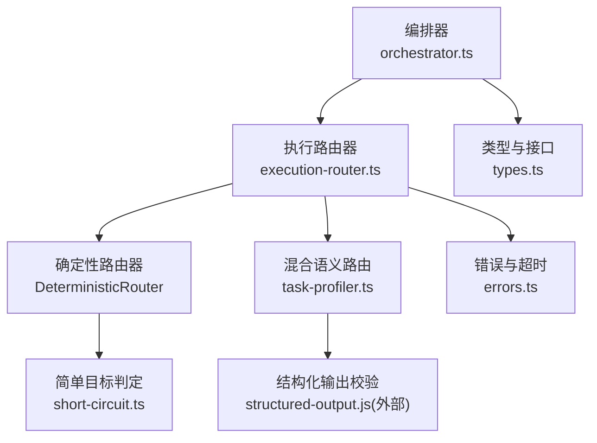
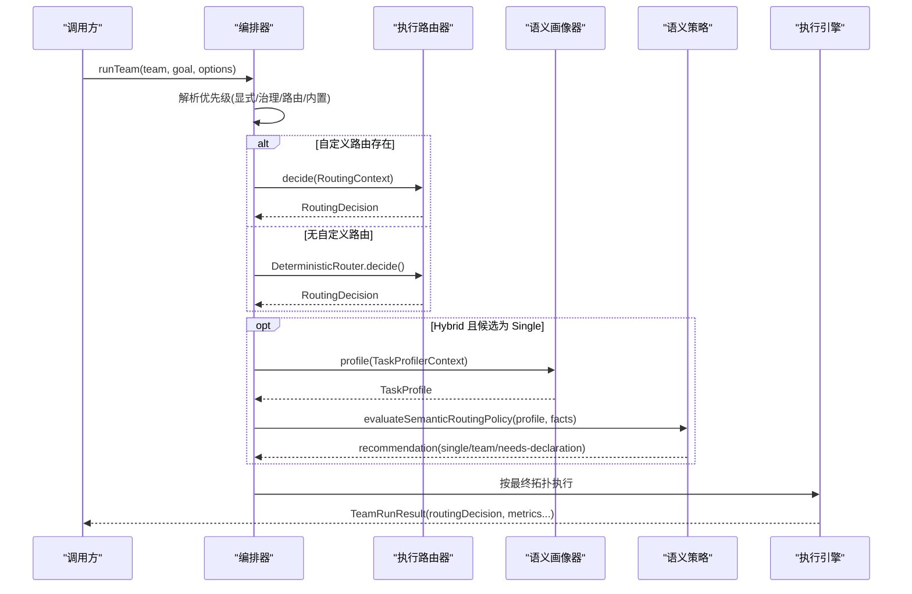
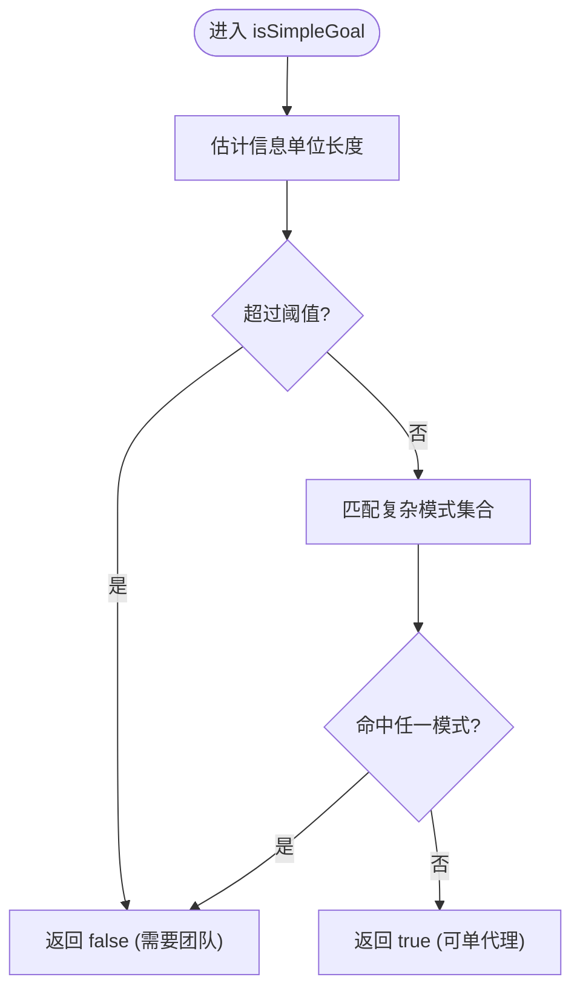
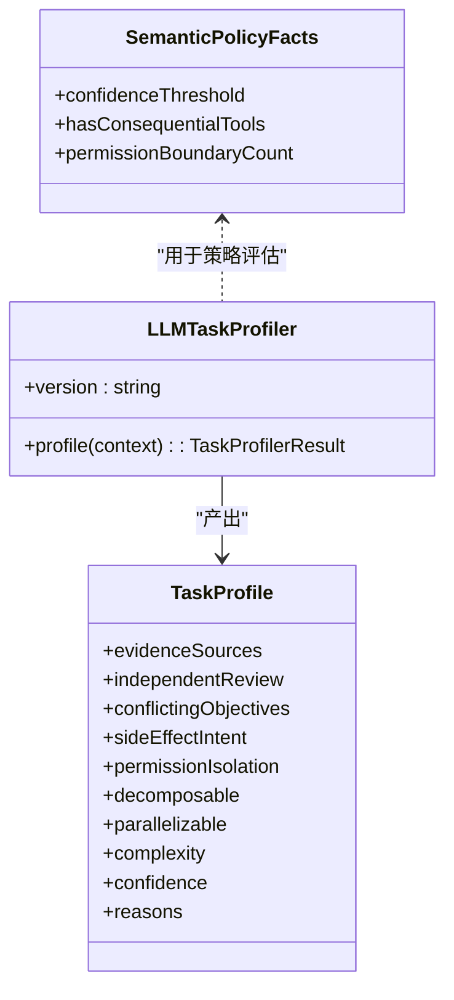
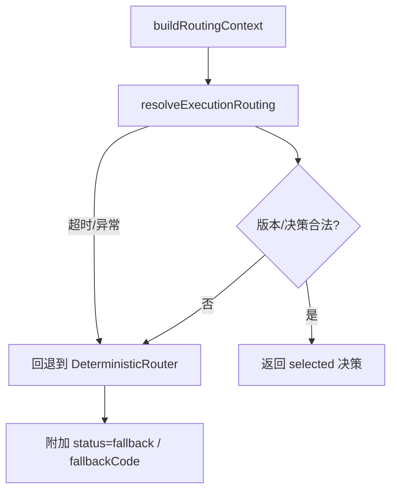
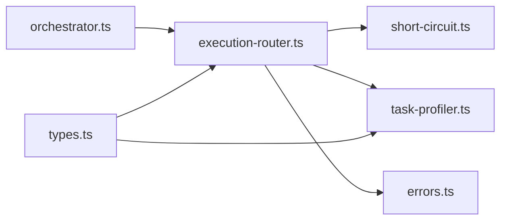

# 执行路由器（Execution Router）

<cite>
**本文引用的文件**
- [execution-routing.md](file://docs/execution-routing.md)
- [types.ts](file://packages/core/src/types.ts)
- [execution-router.ts](file://packages/core/src/orchestrator/execution-router.ts)
- [short-circuit.ts](file://packages/core/src/orchestrator/short-circuit.ts)
- [task-profiler.ts](file://packages/core/src/orchestrator/task-profiler.ts)
- [errors.ts](file://packages/core/src/errors.ts)
- [orchestrator.ts](file://packages/core/src/orchestrator/orchestrator.ts)
</cite>

## 目录
1. [简介](#简介)
2. [项目结构](#项目结构)
3. [核心组件](#核心组件)
4. [架构总览](#架构总览)
5. [详细组件分析](#详细组件分析)
6. [依赖关系分析](#依赖关系分析)
7. [性能考量](#性能考量)
8. [故障排查指南](#故障排查指南)
9. [结论](#结论)
10. [附录：配置与示例](#附录配置与示例)

## 简介
执行路由器负责在自动调用 runTeam() 时选择执行拓扑：直接单代理执行（single）或交由协调器构建并执行团队计划（team）。它与模型路由正交，后者决定拓扑内部具体调用的模型。执行路由器支持确定性策略、混合语义路由以及自定义路由实现，并提供超时、失败回退、可观测性与治理边界等保障机制。

## 项目结构
执行路由器相关代码主要位于 orchestrator 层与类型定义中，配合短路与任务画像模块共同完成决策与优化。

图表来源
- [orchestrator.ts:382-403](file://packages/core/src/orchestrator/orchestrator.ts#L382-L403)
- [orchestrator.ts:1029-1043](file://packages/core/src/orchestrator/orchestrator.ts#L1029-L1043)
- [execution-router.ts:49-71](file://packages/core/src/orchestrator/execution-router.ts#L49-L71)
- [execution-router.ts:78-119](file://packages/core/src/orchestrator/execution-router.ts#L78-L119)
- [execution-router.ts:121-224](file://packages/core/src/orchestrator/execution-router.ts#L121-L224)
- [short-circuit.ts:146-149](file://packages/core/src/orchestrator/short-circuit.ts#L146-L149)
- [task-profiler.ts:94-173](file://packages/core/src/orchestrator/task-profiler.ts#L94-L173)
- [errors.ts:83-126](file://packages/core/src/errors.ts#L83-L126)
- [types.ts:1579-1728](file://packages/core/src/types.ts#L1579-L1728)

章节来源
- [orchestrator.ts:382-403](file://packages/core/src/orchestrator/orchestrator.ts#L382-L403)
- [execution-router.ts:49-71](file://packages/core/src/orchestrator/execution-router.ts#L49-L71)
- [short-circuit.ts:146-149](file://packages/core/src/orchestrator/short-circuit.ts#L146-L149)
- [task-profiler.ts:94-173](file://packages/core/src/orchestrator/task-profiler.ts#L94-L173)
- [errors.ts:83-126](file://packages/core/src/errors.ts#L83-L126)
- [types.ts:1579-1728](file://packages/core/src/types.ts#L1579-L1728)

## 核心组件
- 执行路由器接口与上下文
  - ExecutionRouter：提供 version 与 decide(context)，返回 RoutingDecision。
  - RoutingContext：包含 goal、roster 摘要、可选预算上限与中止信号。
  - RoutingDecision：mode(single/team)、reasons、routerVersion、可选 confidence/status/fallbackCode。
- 内置确定性路由器
  - DeterministicRouter：基于 isSimpleGoal() 的轻量启发式，空名册强制 team。
- 混合语义路由
  - LLMTaskProfiler：通过适配器进行一次无工具调用，产出 TaskProfile。
  - evaluateSemanticRoutingPolicy：将 profile 与框架事实结合，给出 single/team/needs-declaration 建议。
- 运行时支撑
  - buildRoutingContext：从 AgentConfig 构造隐私友好的 roster 摘要与预算信息。
  - resolveExecutionRouting：带超时、校验与失败回退的统一入口。
  - 错误与超时：RoutingTimeoutError、RoutingProfilerFailedError、RoutingDeclarationRequiredError 等。

章节来源
- [types.ts:1579-1728](file://packages/core/src/types.ts#L1579-L1728)
- [execution-router.ts:49-71](file://packages/core/src/orchestrator/execution-router.ts#L49-L71)
- [execution-router.ts:78-119](file://packages/core/src/orchestrator/execution-router.ts#L78-L119)
- [execution-router.ts:121-224](file://packages/core/src/orchestrator/execution-router.ts#L121-L224)
- [task-profiler.ts:94-173](file://packages/core/src/orchestrator/task-profiler.ts#L94-L173)
- [task-profiler.ts:226-277](file://packages/core/src/orchestrator/task-profiler.ts#L226-L277)
- [errors.ts:83-126](file://packages/core/src/errors.ts#L83-L126)

## 架构总览
执行路由器的优先级与流程如下：
- 优先级
  1) 显式 mode: 'single' | 'team'
  2) 已声明的治理拓扑或 preferredUnderBudget 降级策略
  3) 每次运行或编排器级别的自定义 executionRouter
  4) 内置 DeterministicRouter
  5) 当 strategy 为 hybrid 且默认/回退结果为 Single 时，使用语义 TaskProfiler + 确定性策略进行修正
- 关键约束
  - 路由仅在自动、非 planOnly 的选择阶段运行；不会覆盖显式模式、角色拓扑或治理预算策略。
  - 有效自定义路由决策是最终的，不会被 Profiler 重新解释；若自定义路由失败且回退选 Single，Hybrid 可能对该候选进行画像。

图表来源
- [execution-routing.md:5-21](file://docs/execution-routing.md#L5-L21)
- [execution-routing.md:23-79](file://docs/execution-routing.md#L23-L79)
- [execution-router.ts:181-224](file://packages/core/src/orchestrator/execution-router.ts#L181-L224)
- [task-profiler.ts:94-173](file://packages/core/src/orchestrator/task-profiler.ts#L94-L173)
- [task-profiler.ts:226-277](file://packages/core/src/orchestrator/task-profiler.ts#L226-L277)
- [types.ts:1654-1692](file://packages/core/src/types.ts#L1654-L1692)

## 详细组件分析

### 确定性路由器与简单目标判定
- 行为
  - 空名册：强制 team，避免 single 路径不可用。
  - 简单目标：isSimpleGoal(goal) 为真则 single，否则 team。
- 启发式要点
  - 长度估计：考虑脚本感知信息密度，CJK 字符权重更高。
  - 复杂模式匹配：序列标记、协作/并行词汇、多阶段枚举、动词连接等。
- 复杂度
  - 时间复杂度近似 O(L)（L 为目标字符串长度），正则集合固定规模。

图表来源
- [short-circuit.ts:104-149](file://packages/core/src/orchestrator/short-circuit.ts#L104-L149)
- [execution-router.ts:49-71](file://packages/core/src/orchestrator/execution-router.ts#L49-L71)

章节来源
- [short-circuit.ts:104-149](file://packages/core/src/orchestrator/short-circuit.ts#L104-L149)
- [execution-router.ts:49-71](file://packages/core/src/orchestrator/execution-router.ts#L49-L71)

### 混合语义路由（Hybrid）
- 触发条件
  - strategy: 'hybrid'，且确定性路由候选为 Single。
- 画像器
  - LLMTaskProfiler 仅进行一次无工具调用，产出严格结构的 TaskProfile。
  - 输入不包含系统提示、凭据、工具实现等敏感信息。
- 策略评估
  - 低置信度：保持 Single。
  - 高置信度且存在独立证据/评审/冲突目标/可并行：推荐 Team。
  - 高风险语义与后果性工具或多权限边界交叉：返回 needs-declaration，要求显式治理声明。
- 适配与模型选择
  - 优先 per-run adapter/model，其次编排器级，再 Coordinator 有效适配器/模型，最后默认提供者。

图表来源
- [task-profiler.ts:94-173](file://packages/core/src/orchestrator/task-profiler.ts#L94-L173)
- [task-profiler.ts:226-277](file://packages/core/src/orchestrator/task-profiler.ts#L226-L277)
- [types.ts:1612-1692](file://packages/core/src/types.ts#L1612-L1692)

章节来源
- [execution-routing.md:23-79](file://docs/execution-routing.md#L23-L79)
- [task-profiler.ts:94-173](file://packages/core/src/orchestrator/task-profiler.ts#L94-L173)
- [task-profiler.ts:226-277](file://packages/core/src/orchestrator/task-profiler.ts#L226-L277)
- [types.ts:1612-1692](file://packages/core/src/types.ts#L1612-L1692)

### 路由上下文与决策验证
- 上下文构建
  - 生成 RosterSummaryEntry：name、model、toolCount、capabilities、costTier、latencyClass。
  - 注入预算上限（token/cost）与 abortSignal。
- 决策校验
  - mode 必须为 single/team；single 需至少一名成员。
  - routerVersion 必须与实现版本一致。
  - reasons 为字符串数组；confidence 若在，需在 [0,1]。
- 统一入口
  - resolveExecutionRouting：封装超时、校验、失败回退与状态标注。

图表来源
- [execution-router.ts:78-119](file://packages/core/src/orchestrator/execution-router.ts#L78-L119)
- [execution-router.ts:150-171](file://packages/core/src/orchestrator/execution-router.ts#L150-L171)
- [execution-router.ts:181-224](file://packages/core/src/orchestrator/execution-router.ts#L181-L224)
- [types.ts:1579-1610](file://packages/core/src/types.ts#L1579-L1610)

章节来源
- [execution-router.ts:78-119](file://packages/core/src/orchestrator/execution-router.ts#L78-L119)
- [execution-router.ts:150-171](file://packages/core/src/orchestrator/execution-router.ts#L150-L171)
- [execution-router.ts:181-224](file://packages/core/src/orchestrator/execution-router.ts#L181-L224)
- [types.ts:1579-1610](file://packages/core/src/types.ts#L1579-L1610)

### 执行模式与动态决策
- 串行/并行/条件分支
  - 执行路由器本身不直接编排任务图；它选择 single 或 team。
  - 在 team 模式下，由协调器生成任务图，调度器负责顺序/并行与依赖。
  - 条件分支由协调器/任务图表达；执行路由器可通过治理意图 required/preferred 强制特定角色拓扑。
- 动态决策
  - Hybrid 在候选为 Single 时引入一次无工具画像，依据语义信号决定是否升级为 Team 或要求治理声明。
  - 路由过程受 AbortSignal 控制，可在路由/画像阶段中止。

章节来源
- [execution-routing.md:5-21](file://docs/execution-routing.md#L5-L21)
- [execution-routing.md:23-79](file://docs/execution-routing.md#L23-L79)
- [types.ts:1760-1787](file://packages/core/src/types.ts#L1760-L1787)

### 错误处理与回滚机制
- 路由超时
  - 通过 AbortSignal.timeout 与合并传入的 abortSignal，超时报 RoutingTimeoutError。
- 失败策略
  - failurePolicy: 'fallback'（默认）：自定义路由失败回退到确定性路由，并记录 requestedRouterVersion 与 fallbackCode。
  - failurePolicy: 'fail'：直接抛出错误，终止运行。
- 画像失败
  - 结构化输出校验失败抛 TaskProfileValidationError，上层包装为 RoutingProfilerFailedError。
- 治理要求
  - 当语义高风险且与后果性工具/权限边界交叉时，抛出 RoutingDeclarationRequiredError，要求在协调前进行显式治理声明。
- 结果可观测
  - TeamRunResult.routingDecision 记录 source、status、fallbackCode 等机器可读字段，便于追踪与审计。

章节来源
- [execution-router.ts:121-148](file://packages/core/src/orchestrator/execution-router.ts#L121-L148)
- [execution-router.ts:181-224](file://packages/core/src/orchestrator/execution-router.ts#L181-L224)
- [task-profiler.ts:150-173](file://packages/core/src/orchestrator/task-profiler.ts#L150-L173)
- [errors.ts:83-126](file://packages/core/src/errors.ts#L83-L126)
- [types.ts:1872-1884](file://packages/core/src/types.ts#L1872-L1884)

## 依赖关系分析
- 编排器对路由器的装配与调用
  - 默认装配 DeterministicRouter；per-call 可覆盖。
  - 解析优先级：显式 > 治理 > per-call router > 编排器 router > 内置。
- 路由器对短路与画像的依赖
  - DeterministicRouter 依赖 isSimpleGoal。
  - Hybrid 依赖 LLMTaskProfiler 与 evaluateSemanticRoutingPolicy。
- 类型契约
  - ExecutionRouter/RoutingContext/RoutingDecision 等接口贯穿各模块。

图表来源
- [orchestrator.ts:382-403](file://packages/core/src/orchestrator/orchestrator.ts#L382-L403)
- [orchestrator.ts:1029-1043](file://packages/core/src/orchestrator/orchestrator.ts#L1029-L1043)
- [execution-router.ts:49-71](file://packages/core/src/orchestrator/execution-router.ts#L49-L71)
- [task-profiler.ts:94-173](file://packages/core/src/orchestrator/task-profiler.ts#L94-L173)
- [types.ts:1579-1728](file://packages/core/src/types.ts#L1579-L1728)

章节来源
- [orchestrator.ts:382-403](file://packages/core/src/orchestrator/orchestrator.ts#L382-L403)
- [orchestrator.ts:1029-1043](file://packages/core/src/orchestrator/orchestrator.ts#L1029-L1043)
- [execution-router.ts:49-71](file://packages/core/src/orchestrator/execution-router.ts#L49-L71)
- [task-profiler.ts:94-173](file://packages/core/src/orchestrator/task-profiler.ts#L94-L173)
- [types.ts:1579-1728](file://packages/core/src/types.ts#L1579-L1728)

## 性能考量
- 确定性路由
  - 仅一次 isSimpleGoal 判断，成本极低；适合默认路径。
- 混合语义路由
  - 仅在候选为 Single 时触发一次无工具 LLM 调用；代价可控但需设置 timeoutMs 与 confidenceThreshold。
  - 建议为 Hybrid 启用前通过 Shadow 评估验证准确率、无效输出率、成本与时延。
- 资源与预算
  - 路由上下文携带 token/cost 剩余上限，供路由/画像阶段参考。
  - 路由与画像的开销计入 totalTokenUsage，便于整体预算控制。

[本节为通用指导，不直接分析具体文件]

## 故障排查指南
- 常见问题定位
  - 路由超时：检查 timeoutMs 与 provider 延迟；查看 routingDecision.status 与 fallbackCode。
  - 画像失败：确认结构化输出是否被正确解析；关注 profiling 的 usage 与 model/provider。
  - 治理要求：出现 ROUTING_DECLARATION_REQUIRED 时，补充 governanceIntent/requiredRoles 等显式声明。
- 可观测字段
  - routingDecision.source：override/declared/policy/router/legacy-deterministic。
  - semanticRoutingAssessment：profilerVersion/recommendation/outcome/usage 等。
- 快速修复
  - 提高 confidenceThreshold 或切换更稳定的模型/适配器。
  - 将 failurePolicy 设为 'fail' 以快速暴露问题。
  - 对高频场景优先使用 deterministic 策略，减少额外 LLM 调用。

章节来源
- [execution-routing.md:120-160](file://docs/execution-routing.md#L120-L160)
- [errors.ts:83-126](file://packages/core/src/errors.ts#L83-L126)
- [types.ts:1872-1884](file://packages/core/src/types.ts#L1872-L1884)

## 结论
执行路由器以“低成本确定性 + 可选语义增强”的方式，在保证稳定性的同时提供灵活的任务拓扑选择能力。通过明确的优先级、严格的输入/输出校验、完善的超时与回退机制，以及与治理边界的清晰解耦，使得在不同业务场景下都能获得可预期、可观测、可扩展的执行路径。

[本节为总结，不直接分析具体文件]

## 附录：配置与示例
- 基本配置
  - 设置默认路由策略：strategy: 'deterministic' 或 'hybrid'。
  - 设置 per-call 路由：options.executionRouter。
  - 设置 per-call 混合参数：options.executionRouting（含 adapter/model/confidenceThreshold/timeoutMs/failurePolicy）。
- 典型场景
  - 简单指令：期望 single；若误判，可开启 hybrid 并在置信度足够时升级至 team。
  - 多阶段/协作任务：期望 team；若确定性误判为 single，hybrid 可纠正。
  - 高风险操作：当语义检测到副作用/隔离需求与后果性工具/多权限边界交叉时，需显式治理声明。
- 自定义路由开发
  - 实现 ExecutionRouter：提供 version 与 decide(context)。
  - 保证 decision 合法性：mode、reasons、routerVersion、可选 confidence。
  - 利用 RoutingContext 中的 goal、roster 摘要、budget 与 abortSignal 做决策。
  - 在失败时遵循 failurePolicy 约定，确保可回退或可观测。

章节来源
- [execution-routing.md:23-79](file://docs/execution-routing.md#L23-L79)
- [execution-routing.md:81-118](file://docs/execution-routing.md#L81-L118)
- [execution-routing.md:162-181](file://docs/execution-routing.md#L162-L181)
- [types.ts:1654-1692](file://packages/core/src/types.ts#L1654-L1692)
- [types.ts:1724-1728](file://packages/core/src/types.ts#L1724-L1728)
- [execution-router.ts:78-119](file://packages/core/src/orchestrator/execution-router.ts#L78-L119)