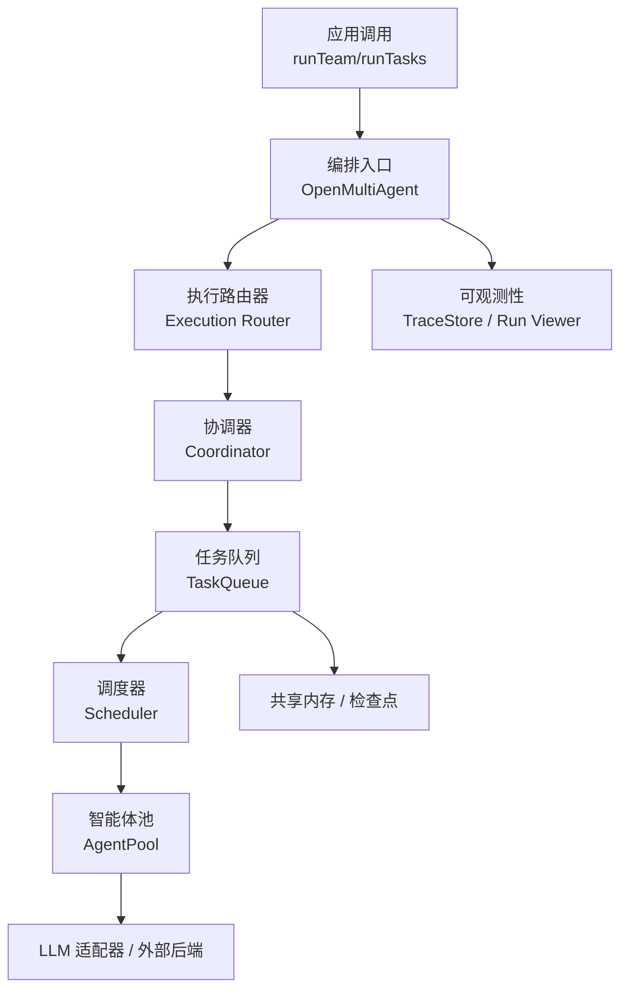
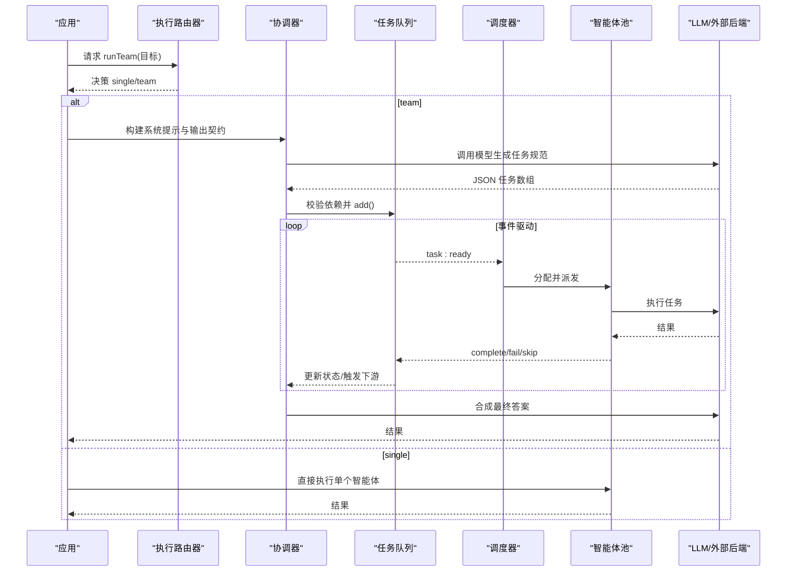
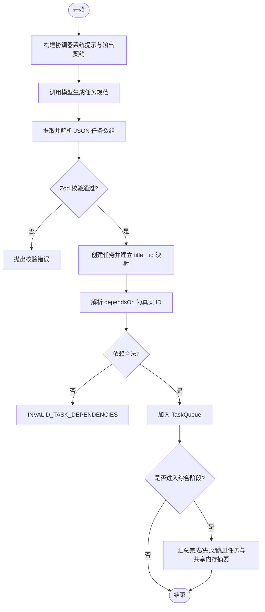
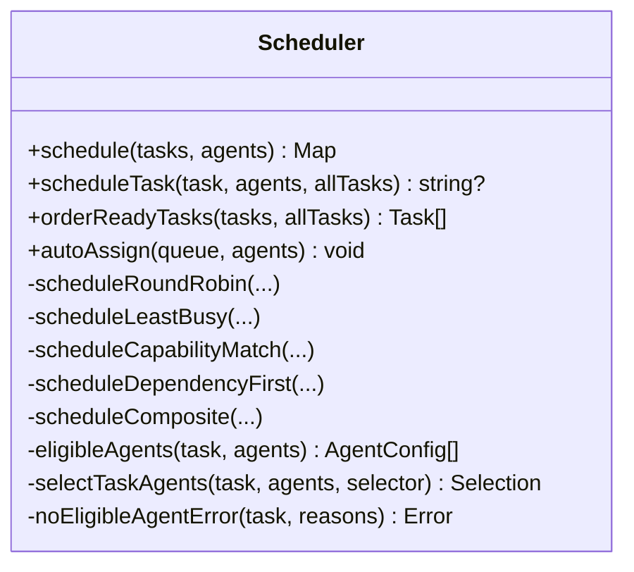
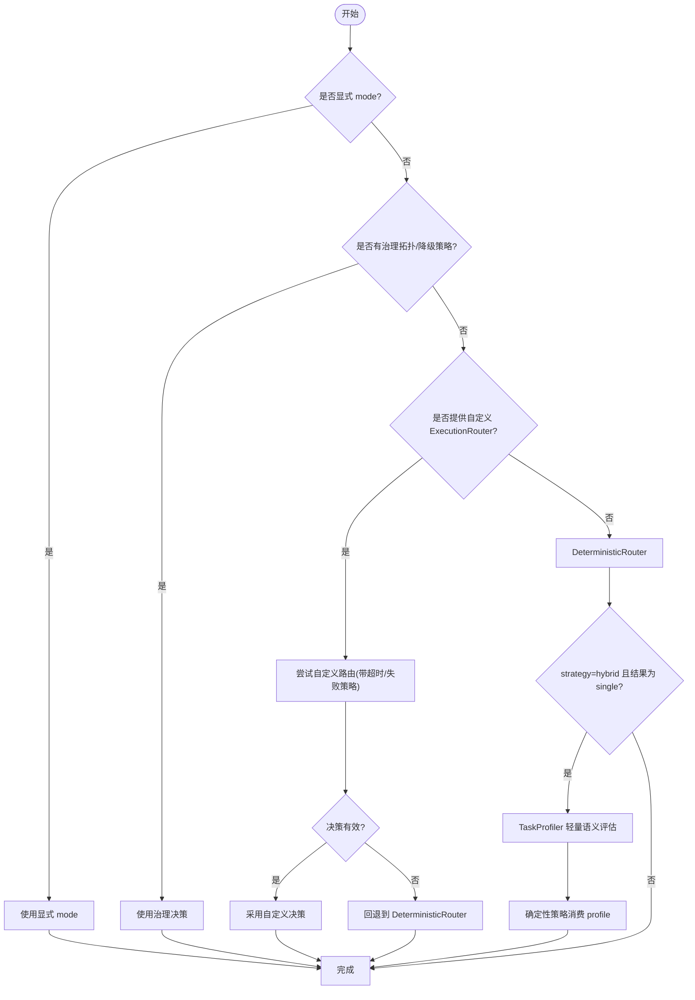
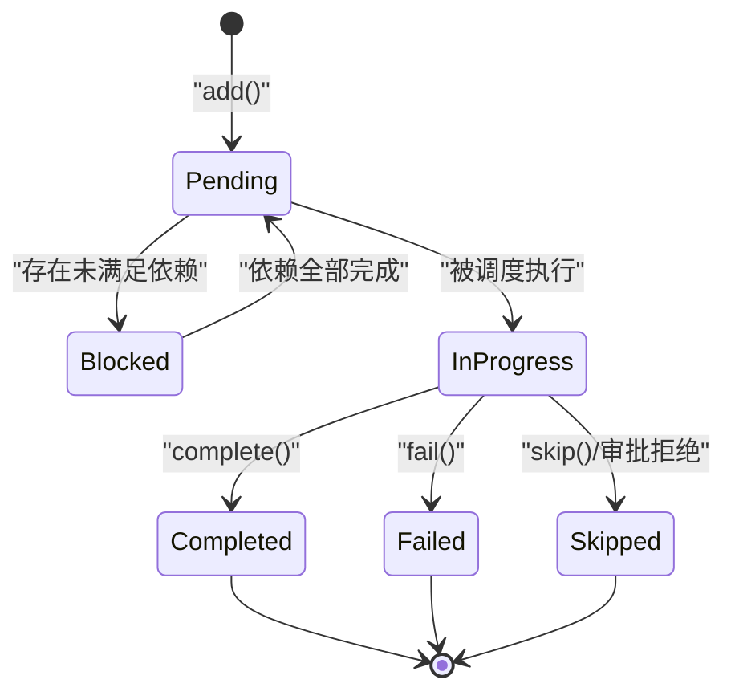
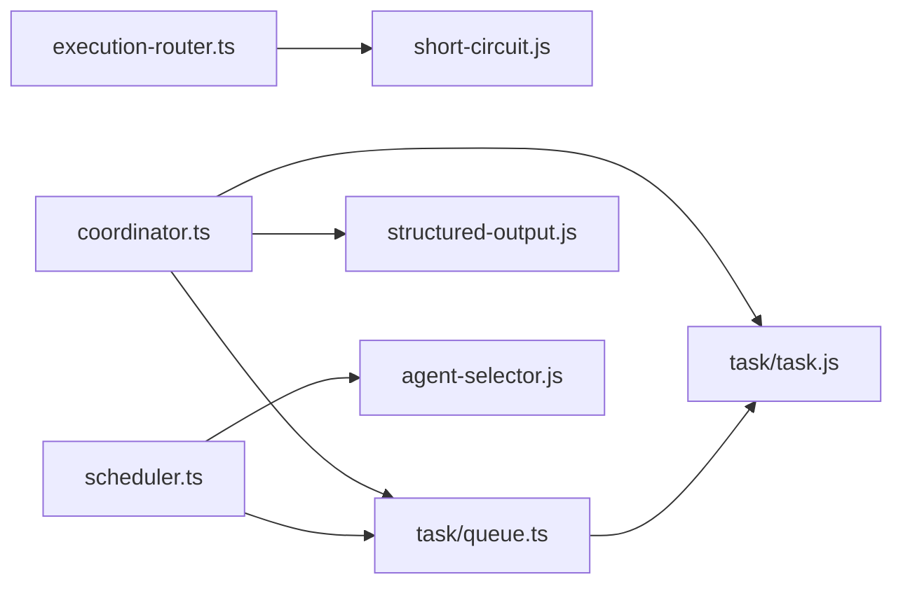

# 编排系统

<cite>
**本文引用的文件**
- [README.md](file://README.md)
- [packages/core/README.md](file://packages/core/README.md)
- [packages/core/src/index.ts](file://packages/core/src/index.ts)
- [packages/core/src/orchestrator/coordinator.ts](file://packages/core/src/orchestrator/coordinator.ts)
- [packages/core/src/orchestrator/scheduler.ts](file://packages/core/src/orchestrator/scheduler.ts)
- [packages/core/src/orchestrator/execution-router.ts](file://packages/core/src/orchestrator/execution-router.ts)
- [packages/core/src/task/queue.ts](file://packages/core/src/task/queue.ts)
- [docs/execution-routing.md](file://docs/execution-routing.md)
- [docs/task-scheduling.md](file://docs/task-scheduling.md)
- [docs/external-agents.md](file://docs/external-agents.md)
</cite>

## 目录
1. [简介](#简介)
2. [项目结构](#项目结构)
3. [核心组件](#核心组件)
4. [架构总览](#架构总览)
5. [详细组件分析](#详细组件分析)
6. [依赖关系分析](#依赖关系分析)
7. [性能考虑](#性能考虑)
8. [故障处理指南](#故障处理指南)
9. [结论](#结论)
10. [附录：配置与集成要点](#附录：配置与集成要点)

## 简介
本文件系统性介绍 Open Multi-Agent（OMA）的编排系统，聚焦以下主题：
- 协调器（Coordinator）如何解析目标并生成任务依赖图
- 调度器（Scheduler）如何进行任务分配和执行控制
- 执行路由器（Execution Router）如何实现不同的执行拓扑（单智能体 vs 团队计划）
- 动态工作流生成算法、智能体选择策略、任务优先级管理
- 配置选项详解、性能优化建议与故障处理机制
- 实际编排场景示例与外部系统集成模式、扩展点

OMA 的核心思想是“描述目标而非手工绘制图”：在运行时由协调器将目标分解为任务 DAG，再由事件驱动的调度器在多智能体间并行执行，最终合成结果。

**章节来源**
- [README.md:46-108](file://README.md#L46-L108)
- [packages/core/README.md:49-55](file://packages/core/README.md#L49-L55)

## 项目结构
- 顶层 README 提供整体定位、快速开始、生态与文档导航
- Core 包提供编排运行时、工具、记忆、检查点、可观测性、CLI 与离线 Run Viewer
- docs 下包含执行路由、任务调度、外部智能体等子系统指南
- 源码按职责分层：orchestrator（编排）、task（队列与任务）、team（团队与消息）、agent（智能体池与运行）、tool（工具）、observability（追踪）、memory（共享内存与检查点）

**图表来源**
- [packages/core/src/index.ts:57-102](file://packages/core/src/index.ts#L57-L102)
- [packages/core/src/orchestrator/execution-router.ts:49-71](file://packages/core/src/orchestrator/execution-router.ts#L49-L71)
- [packages/core/src/orchestrator/coordinator.ts:365-412](file://packages/core/src/orchestrator/coordinator.ts#L365-L412)
- [packages/core/src/task/queue.ts:64-90](file://packages/core/src/task/queue.ts#L64-L90)
- [packages/core/src/orchestrator/scheduler.ts:142-214](file://packages/core/src/orchestrator/scheduler.ts#L142-L214)

**章节来源**
- [README.md:138-144](file://README.md#L138-L144)
- [packages/core/README.md:237-252](file://packages/core/README.md#L237-L252)

## 核心组件
- 执行路由器（Execution Router）：决定 runTeam 的执行拓扑（single/team），支持自定义路由与混合语义路由
- 协调器（Coordinator）：构建系统提示与输出契约，解析 LLM 返回的任务规范，校验依赖与角色，加载到队列
- 任务队列（TaskQueue）：维护任务状态机、依赖解析、事件驱动推进、快照/恢复、计划修补
- 调度器（Scheduler）：实现多种分配策略（轮询、最少忙、能力匹配、依赖优先、复合），对就绪任务进行排序与指派
- 智能体池（AgentPool）：并发控制、执行封装、预算与重试边界
- 外部后端（Process/ACP）：将本地进程或 ACP 协议编码的智能体纳入同一 DAG

**章节来源**
- [packages/core/src/orchestrator/execution-router.ts:1-71](file://packages/core/src/orchestrator/execution-router.ts#L1-L71)
- [packages/core/src/orchestrator/coordinator.ts:85-106](file://packages/core/src/orchestrator/coordinator.ts#L85-L106)
- [packages/core/src/task/queue.ts:46-90](file://packages/core/src/task/queue.ts#L46-L90)
- [packages/core/src/orchestrator/scheduler.ts:26-63](file://packages/core/src/orchestrator/scheduler.ts#L26-L63)
- [docs/external-agents.md:1-17](file://docs/external-agents.md#L1-L17)

## 架构总览
下图展示从目标到执行的关键路径：执行路由器选择拓扑；协调器生成任务规范并注入队列；调度器基于策略分配；队列事件驱动推进；完成后协调器合成结果。

**图表来源**
- [packages/core/src/orchestrator/execution-router.ts:49-71](file://packages/core/src/orchestrator/execution-router.ts#L49-L71)
- [packages/core/src/orchestrator/coordinator.ts:365-412](file://packages/core/src/orchestrator/coordinator.ts#L365-L412)
- [packages/core/src/task/queue.ts:64-90](file://packages/core/src/task/queue.ts#L64-L90)
- [packages/core/src/orchestrator/scheduler.ts:191-250](file://packages/core/src/orchestrator/scheduler.ts#L191-L250)

## 详细组件分析

### 协调器（Coordinator）：目标解析与任务图生成
- 输出契约：通过 Zod schema 约束任务字段（标题、描述、依赖、角色、优先级、要求、验证等），并对 assignee 白名单、依赖唯一性、环检测进行强校验
- 系统提示：构造团队清单（bounded manifest）、输出格式说明、依赖指导原则与综合指引
- 解析流程：提取 JSON 任务数组 → 校验 → 创建任务 → 解析 title→id 映射 → 二次解析 dependsOn → 依赖合法性校验 → 入队
- 综合阶段：所有任务完成后，协调器汇总结果并生成最终回答

**图表来源**
- [packages/core/src/orchestrator/coordinator.ts:85-106](file://packages/core/src/orchestrator/coordinator.ts#L85-L106)
- [packages/core/src/orchestrator/coordinator.ts:112-186](file://packages/core/src/orchestrator/coordinator.ts#L112-L186)
- [packages/core/src/orchestrator/coordinator.ts:251-263](file://packages/core/src/orchestrator/coordinator.ts#L251-L263)
- [packages/core/src/orchestrator/coordinator.ts:696-800](file://packages/core/src/orchestrator/coordinator.ts#L696-L800)
- [packages/core/src/orchestrator/coordinator.ts:546-642](file://packages/core/src/orchestrator/coordinator.ts#L546-L642)

**章节来源**
- [packages/core/src/orchestrator/coordinator.ts:365-412](file://packages/core/src/orchestrator/coordinator.ts#L365-L412)
- [packages/core/src/orchestrator/coordinator.ts:645-688](file://packages/core/src/orchestrator/coordinator.ts#L645-L688)

### 调度器（Scheduler）：任务分配与执行控制
- 策略族：
  - round-robin：按索引轮询分配
  - least-busy：选择当前 in_progress 最少的智能体
  - capability-match：硬过滤需求后，基于能力/关键词打分
  - dependency-first：优先分配能解锁最多下游的任务（关键路径启发）
  - composite：结合关键路径、能力契合度与负载的综合评分
- 事件驱动：当队列发出 task:ready，调度器对当前就绪集排序并逐个分配
- 失败传播：依赖失败/跳过的任务会级联标记其下游为失败/跳过

**图表来源**
- [packages/core/src/orchestrator/scheduler.ts:142-250](file://packages/core/src/orchestrator/scheduler.ts#L142-L250)
- [packages/core/src/orchestrator/scheduler.ts:305-508](file://packages/core/src/orchestrator/scheduler.ts#L305-L508)

**章节来源**
- [packages/core/src/orchestrator/scheduler.ts:26-63](file://packages/core/src/orchestrator/scheduler.ts#L26-L63)
- [packages/core/src/orchestrator/scheduler.ts:191-250](file://packages/core/src/orchestrator/scheduler.ts#L191-L250)

### 执行路由器（Execution Router）：拓扑选择与混合语义路由
- 优先级：显式 mode > 治理拓扑/降级策略 > 自定义 router > 内置 DeterministicRouter > hybrid 下的 TaskProfiler
- 内置确定性路由：空名册强制 team；否则依据 isSimpleGoal 启发式选择 single/team
- 混合路由：仅在确定性路由倾向 single 时进行一次无工具的轻量语义评估，再交由确定性策略做最终决策
- 失败策略：默认 fallback 到确定性路由；也可设置为 fail 终止

**图表来源**
- [docs/execution-routing.md:5-22](file://docs/execution-routing.md#L5-L22)
- [docs/execution-routing.md:23-80](file://docs/execution-routing.md#L23-L80)
- [packages/core/src/orchestrator/execution-router.ts:49-71](file://packages/core/src/orchestrator/execution-router.ts#L49-L71)
- [packages/core/src/orchestrator/execution-router.ts:181-224](file://packages/core/src/orchestrator/execution-router.ts#L181-L224)

**章节来源**
- [docs/execution-routing.md:5-22](file://docs/execution-routing.md#L5-L22)
- [docs/execution-routing.md:162-204](file://docs/execution-routing.md#L162-L204)

### 任务队列（TaskQueue）：依赖管理与事件驱动推进
- 状态机：pending/blocked/in_progress/completed/failed/skipped
- 事件：task:ready、task:complete、task:failed、task:skipped、all:complete
- 依赖解析：初始插入即判定 blocked/pending；完成上游后批量 unblock 下游
- 失败/跳过级联：fail/skip 会递归标记下游
- 快照/恢复：支持序列化快照与恢复，支持追加式计划修补（PlanPatch）

**图表来源**
- [packages/core/src/task/queue.ts:46-90](file://packages/core/src/task/queue.ts#L46-L90)
- [packages/core/src/task/queue.ts:424-480](file://packages/core/src/task/queue.ts#L424-L480)
- [packages/core/src/task/queue.ts:514-545](file://packages/core/src/task/queue.ts#L514-L545)

**章节来源**
- [packages/core/src/task/queue.ts:64-90](file://packages/core/src/task/queue.ts#L64-L90)
- [packages/core/src/task/queue.ts:172-396](file://packages/core/src/task/queue.ts#L172-L396)

### 动态工作流生成算法与智能体选择策略
- 动态生成：协调器根据团队清单与输出契约，让模型产出最小必要依赖的任务图；框架侧做严格校验与循环检测
- 智能体选择：
  - 硬过滤：任务 requires（工具/能力/后端/提供商）必须被满足
  - 策略：轮询、最少忙、能力匹配、依赖优先、复合（fit×load）
  - 权重：composite 中 fit/load 默认 0.7/0.3
- 任务优先级：任务可声明 priority（low/normal/high/critical），用于 UI/审计与后续策略扩展；当前调度以依赖关键路径为主

**章节来源**
- [packages/core/src/orchestrator/coordinator.ts:85-106](file://packages/core/src/orchestrator/coordinator.ts#L85-L106)
- [packages/core/src/orchestrator/scheduler.ts:191-250](file://packages/core/src/orchestrator/scheduler.ts#L191-L250)
- [packages/core/src/orchestrator/scheduler.ts:463-508](file://packages/core/src/orchestrator/scheduler.ts#L463-L508)

### 执行拓扑与外部系统集成
- 拓扑：single（直接调用一个智能体）或 team（协调器规划并执行多任务）
- 外部智能体：process 与 acp 两种后端，作为普通团队成员参与 DAG、共享内存与预算聚合
- 权限与安全：ACP 支持 per-request 授权策略；process 需限制命令、参数、环境变量与工作目录

**章节来源**
- [docs/execution-routing.md:1-22](file://docs/execution-routing.md#L1-L22)
- [docs/external-agents.md:1-17](file://docs/external-agents.md#L1-L17)
- [docs/external-agents.md:83-144](file://docs/external-agents.md#L83-L144)

## 依赖关系分析
- orchestrator 层依赖：
  - execution-router → short-circuit（isSimpleGoal）
  - coordinator → task（createTask/validateTaskDependencies）、structured-output（extractJSON）、budget、agent-config
  - scheduler → agent-selector、task queue
  - task/queue → task（isTaskReady/validateTaskDependencies）、metadata
- 对外暴露：index.ts 统一导出 Orchestrator、Scheduler、AgentSelector、ExecutionRouter、TaskQueue 等

**图表来源**
- [packages/core/src/orchestrator/execution-router.ts:18-20](file://packages/core/src/orchestrator/execution-router.ts#L18-L20)
- [packages/core/src/orchestrator/coordinator.ts:11-38](file://packages/core/src/orchestrator/coordinator.ts#L11-L38)
- [packages/core/src/orchestrator/scheduler.ts:18-24](file://packages/core/src/orchestrator/scheduler.ts#L18-L24)
- [packages/core/src/task/queue.ts:9-19](file://packages/core/src/task/queue.ts#L9-L19)

**章节来源**
- [packages/core/src/index.ts:57-102](file://packages/core/src/index.ts#L57-L102)

## 性能考虑
- 事件驱动执行：下游任务在依赖满足后立即启动，不等待同批其他无关任务
- 调度策略选择：
  - 依赖密集图用 dependency-first 或 composite
  - 异构时长用 least-busy
  - 可互换智能体用 round-robin
  - 明确角色差异用 capability-match
- 预算与成本：token/cost 预算在 turn 与任务边界检查；estimateCost 由应用提供价格表
- 上下文与工具：合理设置 contextStrategy、工具预设与输出上限，避免过大上下文与冗余工具调用
- 可观测性：使用 TraceStore/Run Viewer 观察 DAG 与 span 瀑布，定位瓶颈

**章节来源**
- [docs/task-scheduling.md:1-26](file://docs/task-scheduling.md#L1-L26)
- [packages/core/README.md:288-316](file://packages/core/README.md#L288-L316)

## 故障处理指南
- 路由失败：默认回退到确定性路由；可配置 failurePolicy 为 fail 终止；记录 status、requestedRouterVersion、fallbackCode
- 任务依赖无效：coordinator 校验 title 唯一性与依赖引用，非法则抛出 INVALID_TASK_DEPENDENCIES
- 无合格智能体：当任务 requires 无法满足时，抛出 NO_ELIGIBLE_AGENT（含原因）
- 失败/跳过级联：队列在 fail/skip 时递归标记下游，避免悬挂阻塞
- 审批与中断：onTaskDispatch/onApproval 可拒绝继续；中断走 drain-then-skip 路径，保证 in-flight 任务先结算

**章节来源**
- [docs/execution-routing.md:120-154](file://docs/execution-routing.md#L120-L154)
- [packages/core/src/orchestrator/coordinator.ts:112-186](file://packages/core/src/orchestrator/coordinator.ts#L112-L186)
- [packages/core/src/orchestrator/scheduler.ts:510-557](file://packages/core/src/orchestrator/scheduler.ts#L510-L557)
- [packages/core/src/task/queue.ts:424-545](file://packages/core/src/task/queue.ts#L424-L545)
- [docs/task-scheduling.md:135-184](file://docs/task-scheduling.md#L135-L184)

## 结论
OMA 的编排系统以“目标驱动”为核心：执行路由器选择拓扑，协调器生成并校验任务图，任务队列以事件驱动推进，调度器以多种策略高效分配，最终由协调器合成结果。该设计兼顾灵活性与可控性，支持混合语义路由、外部智能体集成、预算与可观测性，适合复杂的多智能体协作场景。

## 附录：配置与集成要点
- 执行路由
  - strategy：deterministic | hybrid（默认 deterministic）
  - adapter/model：路由与 Profiler 的模型/提供者选择
  - failurePolicy：fallback | fail
- 调度策略
  - schedulingStrategy：round-robin | least-busy | capability-match | dependency-first | composite
  - schedulingWeights：fit/load（默认 0.7/0.3）
- 任务元数据
  - role/metadata：业务角色与受限键值（敏感信息自动脱敏）
  - dependencyPayload：output | structured | both（结构化传递上限 64 KiB）
- 外部智能体
  - backend.kind：process | acp
  - permission：auto-approve | reject | fn（针对 ACP）
- 生产建议
  - 设置 maxTurns/timeoutMs/callTimeoutMs/contextStrategy/loopDetection
  - 使用 maxTokenBudget/maxCostBudget+estimateCost
  - 启用检查点与恢复；使用 Run Viewer 与可选 OTel 集成

**章节来源**
- [docs/execution-routing.md:23-80](file://docs/execution-routing.md#L23-L80)
- [docs/task-scheduling.md:98-134](file://docs/task-scheduling.md#L98-L134)
- [docs/task-scheduling.md:135-184](file://docs/task-scheduling.md#L135-L184)
- [docs/external-agents.md:83-144](file://docs/external-agents.md#L83-L144)
- [packages/core/README.md:288-316](file://packages/core/README.md#L288-L316)