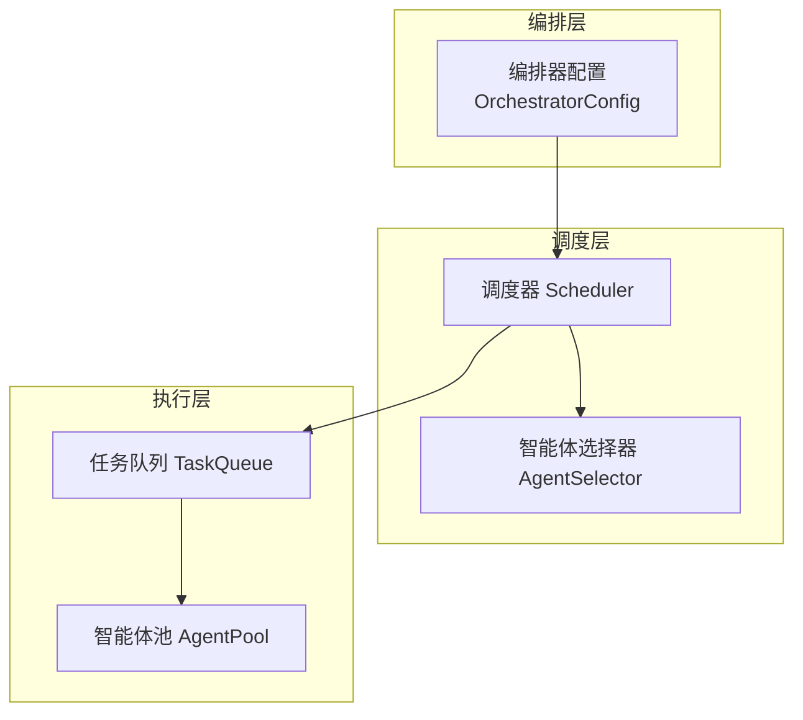
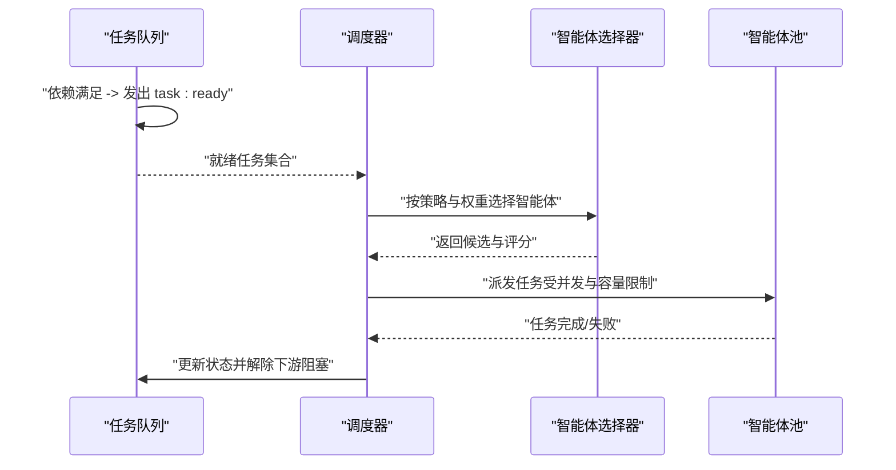
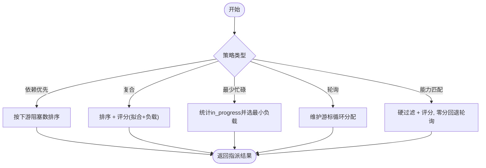
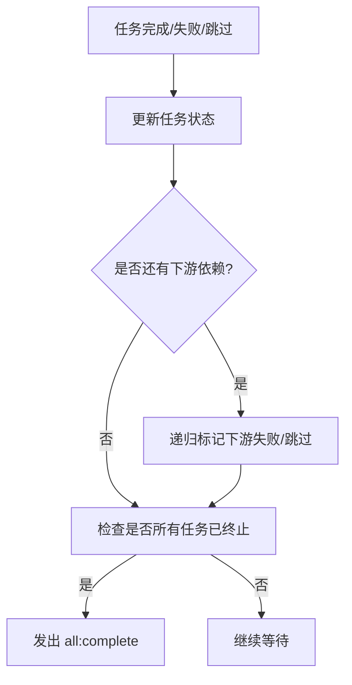
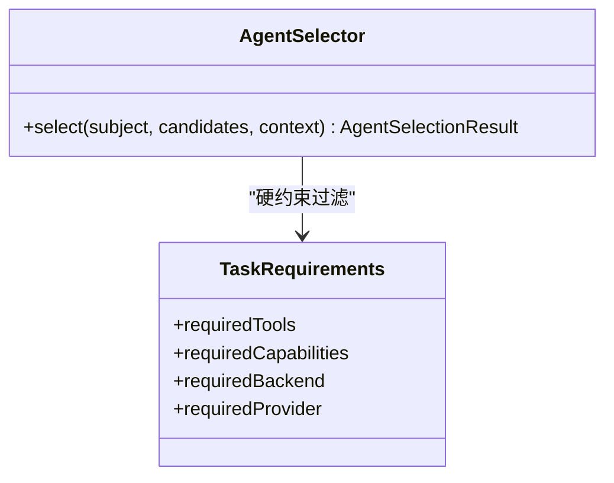
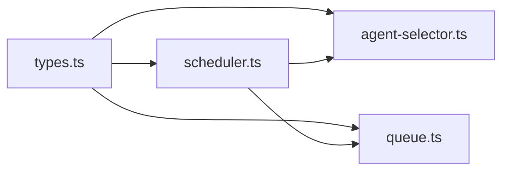

# 调度器（Scheduler）

<cite>
**本文引用的文件**
- [packages/core/src/orchestrator/scheduler.ts](file://packages/core/src/orchestrator/scheduler.ts)
- [packages/core/src/task/queue.ts](file://packages/core/src/task/queue.ts)
- [packages/core/src/orchestrator/agent-selector.ts](file://packages/core/src/orchestrator/agent-selector.ts)
- [packages/core/src/types.ts](file://packages/core/src/types.ts)
- [docs/task-scheduling.md](file://docs/task-scheduling.md)
</cite>

## 目录
1. [简介](#简介)
2. [项目结构](#项目结构)
3. [核心组件](#核心组件)
4. [架构总览](#架构总览)
5. [详细组件分析](#详细组件分析)
6. [依赖关系分析](#依赖关系分析)
7. [性能考虑](#性能考虑)
8. [故障排查指南](#故障排查指南)
9. [结论](#结论)
10. [附录](#附录)

## 简介
本文件系统性介绍 Open Multi-Agent 的调度器组件，覆盖任务调度算法、优先级与依赖管理、并发控制、资源分配策略、执行拓扑选择、负载均衡、配置选项（最大并发、重试、超时）、性能调优参数、故障转移机制，以及与任务队列和智能体池的集成模式与扩展点。文档面向不同技术背景的读者，提供从概念到代码级的可视化说明。

## 项目结构
调度相关能力由以下模块协同实现：
- 调度器：负责将待调度任务映射到可用智能体，支持多种策略与权重组合。
- 任务队列：维护任务生命周期、依赖解析、事件驱动推进与快照恢复。
- 智能体选择器：基于硬约束与软评分进行可解释的智能体筛选。
- 类型与配置：定义调度策略、权重、任务要求、编排器配置等。
- 官方文档：描述事件驱动执行、结果传递、角色元数据、审批模式、中断与检查点等。

图表来源
- [packages/core/src/orchestrator/scheduler.ts:142-214](file://packages/core/src/orchestrator/scheduler.ts#L142-L214)
- [packages/core/src/orchestrator/agent-selector.ts:95-222](file://packages/core/src/orchestrator/agent-selector.ts#L95-L222)
- [packages/core/src/task/queue.ts:64-105](file://packages/core/src/task/queue.ts#L64-L105)
- [packages/core/src/types.ts:2132-2180](file://packages/core/src/types.ts#L2132-L2180)

章节来源
- [packages/core/src/orchestrator/scheduler.ts:1-16](file://packages/core/src/orchestrator/scheduler.ts#L1-L16)
- [packages/core/src/task/queue.ts:1-63](file://packages/core/src/task/queue.ts#L1-L63)
- [packages/core/src/orchestrator/agent-selector.ts:1-39](file://packages/core/src/orchestrator/agent-selector.ts#L1-L39)
- [packages/core/src/types.ts:2132-2180](file://packages/core/src/types.ts#L2132-L2180)
- [docs/task-scheduling.md:1-26](file://docs/task-scheduling.md#L1-L26)

## 核心组件
- 调度器（Scheduler）
  - 提供五种调度策略：轮询、最少忙碌、能力匹配、依赖优先、复合策略。
  - 支持对“就绪任务”排序与单任务指派，以及批量指派。
  - 通过智能体选择器进行硬过滤与评分，结合负载与依赖关键性做决策。
- 任务队列（TaskQueue）
  - 维护任务状态机（pending/blocked/in_progress/completed/failed/skipped）。
  - 完成或失败时自动解除下游阻塞或级联失败/跳过，并触发事件。
  - 支持计划补丁、快照与恢复，保障可观测性与容错。
- 智能体选择器（AgentSelector）
  - 基于工具授予、后端类型、提供者、能力标签进行硬约束过滤。
  - 使用关键词与能力词法相似度计算软评分，保证可解释与确定性。
- 类型与配置（types.ts）
  - 定义 OrchestratorConfig.maxConcurrency、schedulingStrategy、schedulingWeights、strictAssignees 等。
  - 定义任务要求 TaskRequirements、重试与验证字段、事件类型等。

章节来源
- [packages/core/src/orchestrator/scheduler.ts:30-82](file://packages/core/src/orchestrator/scheduler.ts#L30-L82)
- [packages/core/src/task/queue.ts:46-63](file://packages/core/src/task/queue.ts#L46-L63)
- [packages/core/src/orchestrator/agent-selector.ts:95-222](file://packages/core/src/orchestrator/agent-selector.ts#L95-L222)
- [packages/core/src/types.ts:1360-1415](file://packages/core/src/types.ts#L1360-L1415)
- [packages/core/src/types.ts:2082-2099](file://packages/core/src/types.ts#L2082-L2099)
- [packages/core/src/types.ts:2132-2180](file://packages/core/src/types.ts#L2132-L2180)

## 架构总览
调度器在事件驱动的执行模型中工作：任务队列在依赖满足时发出 ready 事件；调度器根据当前 DAG 快照为任务指派智能体；派发门限检查取消、预算、审批与智能体池容量；最终通过智能体池执行，完成后立即唤醒后续任务。

图表来源
- [docs/task-scheduling.md:8-25](file://docs/task-scheduling.md#L8-L25)
- [packages/core/src/orchestrator/scheduler.ts:191-250](file://packages/core/src/orchestrator/scheduler.ts#L191-L250)
- [packages/core/src/task/queue.ts:433-480](file://packages/core/src/task/queue.ts#L433-L480)

## 详细组件分析

### 调度器（Scheduler）
- 策略与排序
  - 依赖优先：按被阻塞的下游任务数量降序，优先调度能解锁更多任务的任务。
  - 复合策略：先按依赖关键性排序，再对候选智能体以 fitWeight * fit + loadWeight * (1 - normalizedLoad) 打分。
  - 最少忙碌：统计 in_progress 计数，选择负载最低的智能体。
  - 轮询：维护游标，均匀分布。
  - 能力匹配：硬过滤后按能力与关键词相似度评分，零分回退到轮询。
- 单任务与批量指派
  - scheduleTask：针对单个就绪任务进行指派，保持对其他策略的一致性。
  - orderReadyTasks：对依赖敏感的策略对就绪集排序，确保关键路径优先。
  - autoAssign：直接更新任务队列中的 assignee。
- 权重与校验
  - 复合策略权重需有限且非负，不能同时为零；默认 fit=0.7、load=0.3。
- 错误处理
  - 无合格智能体时抛出带 code 的错误，便于上层统一处理。

图表来源
- [packages/core/src/orchestrator/scheduler.ts:260-268](file://packages/core/src/orchestrator/scheduler.ts#L260-L268)
- [packages/core/src/orchestrator/scheduler.ts:305-317](file://packages/core/src/orchestrator/scheduler.ts#L305-L317)
- [packages/core/src/orchestrator/scheduler.ts:326-363](file://packages/core/src/orchestrator/scheduler.ts#L326-L363)
- [packages/core/src/orchestrator/scheduler.ts:374-413](file://packages/core/src/orchestrator/scheduler.ts#L374-L413)
- [packages/core/src/orchestrator/scheduler.ts:423-450](file://packages/core/src/orchestrator/scheduler.ts#L423-L450)
- [packages/core/src/orchestrator/scheduler.ts:463-508](file://packages/core/src/orchestrator/scheduler.ts#L463-L508)

章节来源
- [packages/core/src/orchestrator/scheduler.ts:128-214](file://packages/core/src/orchestrator/scheduler.ts#L128-L214)
- [packages/core/src/orchestrator/scheduler.ts:216-292](file://packages/core/src/orchestrator/scheduler.ts#L216-L292)
- [packages/core/src/orchestrator/scheduler.ts:546-564](file://packages/core/src/orchestrator/scheduler.ts#L546-L564)

### 任务队列（TaskQueue）
- 生命周期与事件
  - add/addBatch：入队即评估初始状态，必要时进入 blocked；否则发出 task:ready。
  - complete/fail/skip：更新状态、触发下游解除阻塞或级联失败/跳过，并在全部结束时发出 all:complete。
- 计划补丁与恢复
  - applyPlanPatch：原子地追加任务、重定向、替代，并记录版本历史；发布后才对外可见。
  - fromSnapshot/restorePlanSnapshot：支持精确恢复与崩溃恢复（重置 in_progress）。
- 查询与进度
  - next/nextAvailable：按 assignee 或全局获取下一个可执行任务。
  - getProgress：统计各状态任务数量，用于监控与告警。

图表来源
- [packages/core/src/task/queue.ts:433-480](file://packages/core/src/task/queue.ts#L433-L480)
- [packages/core/src/task/queue.ts:514-545](file://packages/core/src/task/queue.ts#L514-L545)
- [packages/core/src/task/queue.ts:603-667](file://packages/core/src/task/queue.ts#L603-L667)

章节来源
- [packages/core/src/task/queue.ts:79-105](file://packages/core/src/task/queue.ts#L79-L105)
- [packages/core/src/task/queue.ts:111-170](file://packages/core/src/task/queue.ts#L111-L170)
- [packages/core/src/task/queue.ts:172-396](file://packages/core/src/task/queue.ts#L172-L396)
- [packages/core/src/task/queue.ts:402-505](file://packages/core/src/task/queue.ts#L402-L505)
- [packages/core/src/task/queue.ts:551-667](file://packages/core/src/task/queue.ts#L551-L667)

### 智能体选择器（AgentSelector）
- 硬约束过滤
  - requiredTools：基于框架解析后的工具授予集合。
  - requiredCapabilities：基于声明的能力标签。
  - requiredBackend：llm/process/acp。
  - requiredProvider：模型提供者（外部后端不强制）。
- 软评分
  - 能力文本与关键词相似度，优先于纯关键词匹配。
  - 评分排序稳定，名称作为平局打破规则。
- 前置验证
  - validateTaskRequirements：在派发前验证未分配任务是否有合格候选；显式 assignee 必须满足要求。

图表来源
- [packages/core/src/orchestrator/agent-selector.ts:95-222](file://packages/core/src/orchestrator/agent-selector.ts#L95-L222)
- [packages/core/src/orchestrator/agent-selector.ts:243-299](file://packages/core/src/orchestrator/agent-selector.ts#L243-L299)
- [packages/core/src/types.ts:1360-1372](file://packages/core/src/types.ts#L1360-L1372)

章节来源
- [packages/core/src/orchestrator/agent-selector.ts:1-39](file://packages/core/src/orchestrator/agent-selector.ts#L1-L39)
- [packages/core/src/orchestrator/agent-selector.ts:95-222](file://packages/core/src/orchestrator/agent-selector.ts#L95-L222)
- [packages/core/src/orchestrator/agent-selector.ts:243-299](file://packages/core/src/orchestrator/agent-selector.ts#L243-L299)

### 配置与策略（OrchestratorConfig）
- maxConcurrency：全局最大并发，控制智能体池信号量。
- schedulingStrategy：选择调度策略（默认 dependency-first）。
- schedulingWeights：复合策略的 fit/load 权重。
- strictAssignees：是否拒绝协调器指定不在名单内的智能体。
- executionRouter：默认执行拓扑路由（Single/Team），与模型路由正交。

章节来源
- [packages/core/src/types.ts:2132-2180](file://packages/core/src/types.ts#L2132-L2180)

## 依赖关系分析
调度器依赖任务队列的事件与状态、智能体选择器的筛选逻辑，并通过编排器配置决定行为。任务队列依赖任务创建与依赖校验工具函数。类型定义贯穿各模块，保证契约一致。

图表来源
- [packages/core/src/orchestrator/scheduler.ts:18-24](file://packages/core/src/orchestrator/scheduler.ts#L18-L24)
- [packages/core/src/task/queue.ts:9-19](file://packages/core/src/task/queue.ts#L9-L19)
- [packages/core/src/orchestrator/agent-selector.ts:10-22](file://packages/core/src/orchestrator/agent-selector.ts#L10-L22)
- [packages/core/src/types.ts:2132-2180](file://packages/core/src/types.ts#L2132-L2180)

章节来源
- [packages/core/src/orchestrator/scheduler.ts:18-24](file://packages/core/src/orchestrator/scheduler.ts#L18-L24)
- [packages/core/src/task/queue.ts:9-19](file://packages/core/src/task/queue.ts#L9-L19)
- [packages/core/src/orchestrator/agent-selector.ts:10-22](file://packages/core/src/orchestrator/agent-selector.ts#L10-L22)
- [packages/core/src/types.ts:2132-2180](file://packages/core/src/types.ts#L2132-L2180)

## 性能考虑
- 事件驱动执行：下游任务在依赖满足后立即启动，不等待同批就绪的其他无关任务，降低延迟。
- 负载感知：least-busy 与 composite 策略在读快照时统计 in_progress 计数，避免热点。
- 依赖关键性：dependency-first 与 composite 优先调度能解锁更多任务的任务，缩短关键路径。
- 权重可调：composite 的 fit/load 权重可按场景调整，平衡能力匹配与负载均衡。
- 并发上限：maxConcurrency 控制整体并发，防止过载。
- 计划补丁：运行时可追加/重定向/替代任务，减少重新规划开销。

[本节为通用指导，无需特定文件引用]

## 故障排查指南
- 无合格智能体
  - 现象：调度时报错 NO_ELIGIBLE_AGENT。
  - 原因：任务 requires 无法被任何候选满足（工具/能力/后端/提供者）。
  - 处理：修正任务要求或扩展智能体能力/工具授予。
- 显式 assignee 不匹配
  - 现象：协调器指定了不在名单或不符合要求的智能体。
  - 处理：设置 strictAssignees=true 提前拒绝；或放宽要求/修正 assignee。
- 任务失败/跳过级联
  - 现象：上游失败导致下游被标记失败/跳过。
  - 处理：检查上游任务日志；必要时使用 plan patch 修复分支。
- 审批拒绝与预算耗尽
  - 现象：停止新任务派发，进行中任务完成后剩余任务被跳过。
  - 处理：调整审批策略或预算阈值；确认 onTaskDispatch/onApproval 回调逻辑。
- 超时与取消
  - 现象：调用超时或中止信号触发。
  - 处理：调整 callTimeoutMs 或合并 AbortSignal；检查网络与模型服务状态。

章节来源
- [packages/core/src/orchestrator/scheduler.ts:546-557](file://packages/core/src/orchestrator/scheduler.ts#L546-L557)
- [packages/core/src/orchestrator/agent-selector.ts:243-299](file://packages/core/src/orchestrator/agent-selector.ts#L243-L299)
- [packages/core/src/task/queue.ts:433-505](file://packages/core/src/task/queue.ts#L433-L505)
- [docs/task-scheduling.md:135-177](file://docs/task-scheduling.md#L135-L177)

## 结论
Open Multi-Agent 的调度器以事件驱动为核心，结合多种调度策略与可配置的权重，在保证依赖正确性的前提下最大化吞吐与响应速度。配合任务队列的状态机与计划补丁、智能体选择器的硬约束与软评分、以及编排器配置的全局并发与路由控制，形成高可靠、可扩展的多智能体执行体系。在高负载环境下，可通过 least-busy/composite 策略、合理权重与 maxConcurrency 控制负载；通过 plan patch 与检查点进行动态修复与恢复；通过审批与预算机制保障稳定性。

[本节为总结性内容，无需特定文件引用]

## 附录

### 实际调度场景示例
- 高负载下的任务队列管理
  - 使用 least-busy 或 composite 策略，结合 maxConcurrency 控制并发。
  - 通过 TaskQueue.getProgress 监控 pending/in_progress/blocked 比例，动态调整策略或扩容。
- 动态优先级调整
  - 使用 priority 字段与依赖关键性（dependency-first/composite）共同作用，优先推进关键路径。
  - 通过 plan patch 重定向或替代低优先级任务，提升整体效率。
- 异常恢复
  - 利用 TaskQueue.applyPlanPatch 在失败时追加补偿任务或重定向未执行任务。
  - 借助 fromSnapshot 恢复运行状态，避免重复执行已提交的工作。

[本节为概念性示例，无需特定文件引用]

### 与任务队列、智能体池的集成模式与扩展点
- 集成模式
  - 任务队列发出 task:ready，调度器依据策略与权重指派智能体，再通过智能体池执行。
  - 完成/失败/跳过事件驱动下游任务推进，形成闭环。
- 扩展点
  - 自定义 AgentSelectorContext.resolveCandidate：在硬过滤前对候选智能体进行动态替换或增强。
  - 自定义 OrchestratorConfig.executionRouter：切换 Single/Team 拓扑。
  - 使用 onTaskDispatch/onApproval 实现审批与预算门控。
  - 使用 PlanPatch 在运行时动态修复图结构。

章节来源
- [docs/task-scheduling.md:8-25](file://docs/task-scheduling.md#L8-L25)
- [packages/core/src/orchestrator/agent-selector.ts:32-39](file://packages/core/src/orchestrator/agent-selector.ts#L32-L39)
- [packages/core/src/types.ts:2170-2180](file://packages/core/src/types.ts#L2170-L2180)
- [packages/core/src/task/queue.ts:172-396](file://packages/core/src/task/queue.ts#L172-L396)