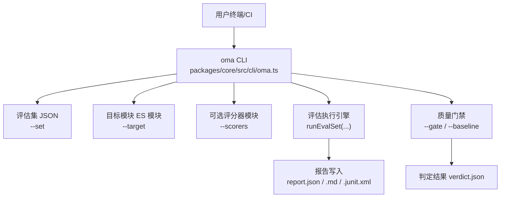
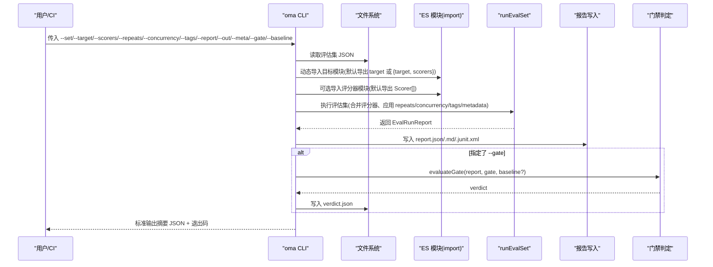
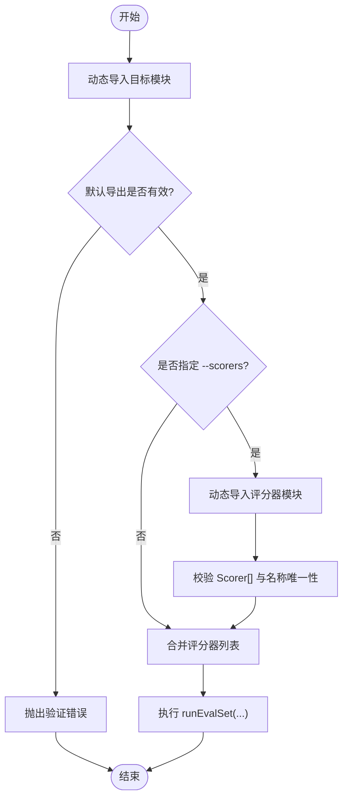
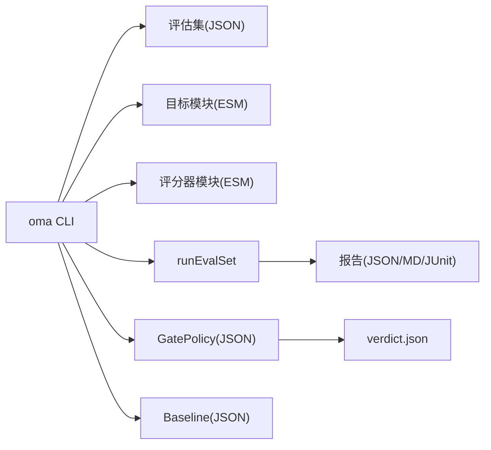

# 命令行工具

<cite>
**本文引用的文件**
- [cli.md](file://docs/cli.md)
- [evaluation.md](file://docs/evaluation.md)
- [oma.ts](file://packages/core/src/cli/oma.ts)
- [eval-example-smoke.mjs](file://scripts/eval-example-smoke.mjs)
</cite>

## 目录
1. [简介](#简介)
2. [项目结构](#项目结构)
3. [核心组件](#核心组件)
4. [架构总览](#架构总览)
5. [详细组件分析](#详细组件分析)
6. [依赖关系分析](#依赖关系分析)
7. [性能与并发](#性能与并发)
8. [故障排查与调试](#故障排查与调试)
9. [结论](#结论)
10. [附录：常用工作流与脚本模板](#附录常用工作流与脚本模板)

## 简介
本章节面向使用 `oma` 命令行工具进行离线评估的用户，聚焦 `oma eval run` 命令的参数、选项、模块加载机制、批量与并行执行配置、CI/Git hooks 集成方式，以及常见工作流的示例和错误处理技巧。该 CLI 提供稳定的 JSON 输出与退出码，适合在 shell 脚本与 CI 中自动化运行。

## 项目结构
- 文档层：`docs/cli.md` 提供完整的 CLI 参考；`docs/evaluation.md` 提供评估体系、评分器、报告与质量门禁的详细说明。
- 实现层：`packages/core/src/cli/oma.ts` 是 CLI 入口与命令调度、参数解析、动态导入目标/评分器模块、执行评估集、写入报告与门禁判定的核心实现。
- 脚本层：`scripts/eval-example-smoke.mjs` 展示了如何在测试/冒烟流程中通过子进程调用示例评估脚本。

图表来源
- [oma.ts:374-479](file://packages/core/src/cli/oma.ts#L374-L479)
- [cli.md:93-157](file://docs/cli.md#L93-L157)
- [evaluation.md:462-490](file://docs/evaluation.md#L462-L490)

章节来源
- [cli.md:1-444](file://docs/cli.md#L1-L444)
- [evaluation.md:1-814](file://docs/evaluation.md#L1-L814)
- [oma.ts:1-1096](file://packages/core/src/cli/oma.ts#L1-L1096)

## 核心组件
- 参数解析与校验：支持长选项、重复选项（如 `--report`、`--meta`）、键值对与布尔标志；对必填项、路径、正整数等进行严格校验。
- 动态模块加载：通过 `import()` 动态导入目标模块与评分器模块，要求默认导出为函数或对象 `{ target, scorers? }`；评分器模块需默认导出 `Scorer[]`。
- 评估执行：调用 `runEvalSet` 执行评估集，支持 repeats、concurrency、filterTags、metadata 等。
- 报告生成：按格式写入 `report.json`、`report.md`、`report.junit.xml`，默认输出根为 `./eval-results/<evalRunId>/`。
- 质量门禁：可选加载 GatePolicy 与 Baseline，计算并输出 `verdict.json`，根据门禁结果设置退出码。

章节来源
- [oma.ts:211-330](file://packages/core/src/cli/oma.ts#L211-L330)
- [oma.ts:374-479](file://packages/core/src/cli/oma.ts#L374-L479)
- [cli.md:93-157](file://docs/cli.md#L93-L157)

## 架构总览
下图展示 `oma eval run` 从参数到报告与门禁的端到端流程。

图表来源
- [oma.ts:374-479](file://packages/core/src/cli/oma.ts#L374-L479)
- [cli.md:93-157](file://docs/cli.md#L93-L157)
- [evaluation.md:462-490](file://docs/evaluation.md#L462-L490)

## 详细组件分析

### 命令与参数：`oma eval run`
- 必填参数
  - `--set`：评估集 JSON 路径，遵循 `defineEvalSet()` 契约。
  - `--target`：目标模块路径，动态导入后必须默认导出 `EvalTarget` 函数或 `{ target, scorers? }`。
- 可选参数
  - `--scorers`：评分器模块路径，默认导出 `Scorer[]`，会与目标模块内嵌评分器合并，名称必须唯一。
  - `--repeats`：每个用例重复次数（正整数）。
  - `--concurrency`：并发度（正整数）。
  - `--tags`：按标签过滤用例，逗号分隔。
  - `--report`：可重复，选择 `json`、`markdown`、`junit`；默认仅 `json`。
  - `--out`：输出根目录，默认 `./eval-results`；实际落盘在 `<out>/<evalRunId>/`。
  - `--meta key=value`：可重复，附加字符串元数据到每条记录。
  - `--gate`：质量门禁策略 JSON 路径。
  - `--baseline`：基线报告 JSON 路径，需要与 `--gate` 同时使用。
- 全局标志
  - `--pretty`：美化 JSON 输出。
  - `--include-messages`：包含完整消息数组（体积较大）。

章节来源
- [cli.md:93-157](file://docs/cli.md#L93-L157)
- [cli.md:304-401](file://docs/cli.md#L304-L401)
- [cli.md:405-444](file://docs/cli.md#L405-L444)
- [oma.ts:211-330](file://packages/core/src/cli/oma.ts#L211-L330)
- [oma.ts:374-479](file://packages/core/src/cli/oma.ts#L374-L479)

### 模块加载机制：目标模块与评分器模块
- 目标模块
  - 通过 `import()` 动态导入，路径会被解析为绝对路径。
  - 默认导出必须是函数（作为 `EvalTarget`）或对象 `{ target, scorers? }`。
  - 若未找到默认导出或类型不符，将抛出验证错误。
- 评分器模块
  - 通过 `--scorers` 指定，默认导出必须为 `Scorer[]`。
  - 与目标模块内嵌评分器合并时，会检查名称唯一性；若无任何评分器则报错。
- 安全提示
  - 动态导入在当前进程权限下执行，不沙箱化；仅加载可信代码。

图表来源
- [oma.ts:318-366](file://packages/core/src/cli/oma.ts#L318-L366)
- [cli.md:112-138](file://docs/cli.md#L112-L138)

章节来源
- [oma.ts:318-366](file://packages/core/src/cli/oma.ts#L318-L366)
- [cli.md:112-138](file://docs/cli.md#L112-L138)

### 批量评估与并行执行
- 批量
  - 通过 `--repeats` 控制每个用例重复次数，用于采样非确定性行为并比较聚合统计。
  - 通过 `--tags` 筛选用例集合，便于分批次运行不同标签的评估集。
- 并行
  - 通过 `--concurrency` 控制并发度，默认由评估集或运行时决定。
  - 不同样本之间可并行执行，单个样本内的评分器串行执行。
- 元数据
  - 通过 `--meta key=value` 多次追加，所有值为字符串，会附加到每条记录。

章节来源
- [cli.md:93-157](file://docs/cli.md#L93-L157)
- [evaluation.md:123-139](file://docs/evaluation.md#L123-L139)
- [oma.ts:417-439](file://packages/core/src/cli/oma.ts#L417-L439)

### 报告格式与输出
- 报告格式
  - `json`：权威 `EvalRunReport` 表示，默认输出。
  - `markdown`：人类可读的汇总与失败详情。
  - `junit`：每个记录一个 testcase，`pass: false` 映射为 `<failure>`，错误映射为 `<error>`。
- 输出位置
  - 默认根目录 `./eval-results`，每次运行创建 `<evalRunId>/` 子目录。
  - 文件名固定：`report.json`、`report.md`、`report.junit.xml`。
- 标准输出
  - 每次调用向 stdout 输出一个 JSON 文档（含命令、子命令、指标、报告路径等），并以换行结尾。
  - 无单独进度流；如需实时遥测请使用 TypeScript API。

章节来源
- [cli.md:93-157](file://docs/cli.md#L93-L157)
- [cli.md:304-401](file://docs/cli.md#L304-L401)
- [evaluation.md:420-460](file://docs/evaluation.md#L420-L460)
- [oma.ts:368-479](file://packages/core/src/cli/oma.ts#L368-L479)

### 质量门禁与基线对比
- 门禁策略
  - 通过 `--gate` 指定 GatePolicy JSON，可对阈值、健康度、基线回归进行检查。
  - 门禁通过后，stdout 摘要包含 `verdict` 与 `verdictPath`，并在输出目录下写入 `verdict.json`。
- 基线对比
  - 通过 `--baseline` 指定前次 `EvalRunReport`，需与 `--gate` 同时使用。
  - 若配置了基线规则但未提供基线，会发出警告并跳过回归检查。
- 退出码
  - 门禁失败或所有选定目标均失败时退出码为 1；用法/文件/模块/契约错误为 2；其他内部错误为 3。

章节来源
- [cli.md:148-157](file://docs/cli.md#L148-L157)
- [cli.md:405-444](file://docs/cli.md#L405-L444)
- [evaluation.md:492-573](file://docs/evaluation.md#L492-L573)
- [oma.ts:448-479](file://packages/core/src/cli/oma.ts#L448-L479)

### 结合 Git hooks 或 CI/CD 管道
- Git hooks
  - 可在 pre-commit 或 commit-msg 钩子中运行轻量级评估（例如只跑 smoke 标签的用例），快速反馈问题。
- CI/CD
  - 典型步骤：安装依赖 → 构建（如需）→ 运行评估 → 上传 JUnit 报告 → 门禁判定。
  - 可使用 `oma eval gate` 将报告生成与质量判定分离到不同阶段。
  - GitHub Actions 示例可参考文档中的 YAML 片段，保留机器可读报告并通过门禁控制步骤状态。

章节来源
- [evaluation.md:575-591](file://docs/evaluation.md#L575-L591)
- [cli.md:93-157](file://docs/cli.md#L93-L157)

### 常用工作流与脚本模板
- 基础离线评估
  - 指定评估集与目标模块，输出 JSON 与 JUnit，必要时附加元数据。
- 带门禁的回归评估
  - 在候选报告中应用门禁并与基线对比，失败则 CI 步骤失败。
- 分标签分批执行
  - 使用 `--tags` 拆分大评估集，配合 CI 矩阵并行执行。
- 本地冒烟测试
  - 通过子进程调用示例脚本，捕获退出码并断言成功。

章节来源
- [cli.md:93-157](file://docs/cli.md#L93-L157)
- [evaluation.md:462-490](file://docs/evaluation.md#L462-L490)
- [eval-example-smoke.mjs:1-33](file://scripts/eval-example-smoke.mjs#L1-L33)

## 依赖关系分析
- CLI 与评估子系统
  - CLI 依赖评估文件读写、评估执行器、门禁判定与报告写入。
  - 目标与评分器模块通过动态导入耦合，需在运行时保证路径正确与默认导出符合契约。
- 外部依赖
  - 环境变量：模型提供商密钥等通过环境注入，CLI 不从标志读取敏感信息。
  - 文件系统：评估集、报告、门禁策略与基线均为 JSON 文件。

图表来源
- [oma.ts:374-479](file://packages/core/src/cli/oma.ts#L374-L479)
- [cli.md:93-157](file://docs/cli.md#L93-L157)

章节来源
- [oma.ts:374-479](file://packages/core/src/cli/oma.ts#L374-L479)
- [cli.md:93-157](file://docs/cli.md#L93-L157)

## 性能与并发
- 并发度
  - 通过 `--concurrency` 控制样本间并行度；默认值可由评估集或运行时决定。
- 重复采样
  - 通过 `--repeats` 增加重复次数以覆盖非确定性行为；注意与并发度的组合对资源的影响。
- 报告开销
  - 多格式报告（JSON/Markdown/JUnit）会并行写入；在大评估集上建议按需选择格式。
- 在线评估
  - 在线评估默认保守：采样关闭、并发低、队列长度有限制；可通过 SDK 配置调整。

章节来源
- [cli.md:93-157](file://docs/cli.md#L93-L157)
- [evaluation.md:123-139](file://docs/evaluation.md#L123-L139)
- [evaluation.md:140-239](file://docs/evaluation.md#L140-L239)

## 故障排查与调试
- 常见错误分类
  - 用法错误：缺少必填参数、非法选项值、路径为空等。
  - 文件/模块错误：找不到文件、权限不足、JSON 解析失败、模块无默认导出或类型不符。
  - 运行时错误：LLM/API 失败、评分器异常、存储写入失败等。
- 退出码
  - 0：成功；1：运行/门禁失败；2：用法/验证/文件/模块错误；3：意外错误。
- 诊断要点
  - 查看 stdout 的 JSON 摘要与 stderr 的仪表盘/诊断信息。
  - 检查报告目录下的 `report.json` 与 `verdict.json`。
  - 对于评分器错误，记录为 `scorer_error`，不计入平均分与通过率分母。
- 调试技巧
  - 先用小数据集与单标签验证目标与评分器逻辑。
  - 逐步启用更多报告格式与门禁规则，定位问题范围。
  - 使用 `--pretty` 提升可读性；避免在生产日志中打印敏感信息。

章节来源
- [cli.md:304-401](file://docs/cli.md#L304-L401)
- [cli.md:405-444](file://docs/cli.md#L405-L444)
- [evaluation.md:47-51](file://docs/evaluation.md#L47-L51)
- [evaluation.md:492-573](file://docs/evaluation.md#L492-L573)

## 结论
`oma eval run` 提供了稳定、可脚本化的离线评估能力，支持灵活的模块加载、批量与并行执行、多格式报告与质量门禁。结合 Git hooks 与 CI/CD，可实现持续的质量保障与回归检测。使用时应关注参数校验、模块信任边界、并发与重复配置，以及错误分类与退出码语义，以获得可靠的评估流水线。

## 附录：常用工作流与脚本模板
- 基础离线评估
  - 命令要点：指定 `--set` 与 `--target`，选择 `--report json junit`，输出到 `--out`。
- 带门禁的回归评估
  - 命令要点：添加 `--gate` 与 `--baseline`，产出 `verdict.json`，CI 依据退出码判定。
- 分标签分批执行
  - 命令要点：使用 `--tags` 筛选用例，配合 CI 矩阵并行运行不同标签。
- 本地冒烟测试
  - 通过子进程调用示例脚本，捕获退出码并断言成功。

章节来源
- [cli.md:93-157](file://docs/cli.md#L93-L157)
- [evaluation.md:462-490](file://docs/evaluation.md#L462-L490)
- [eval-example-smoke.mjs:1-33](file://scripts/eval-example-smoke.mjs#L1-L33)