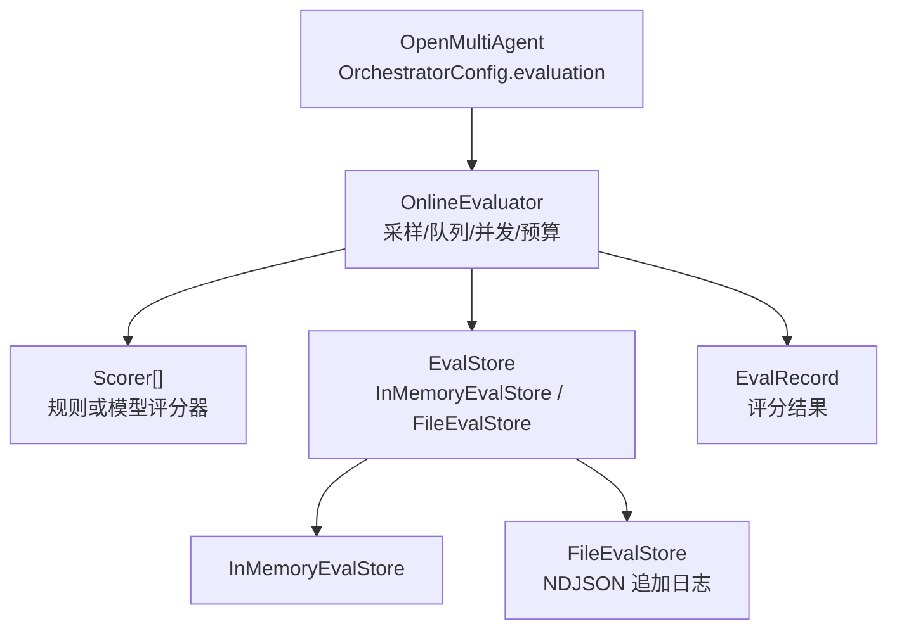
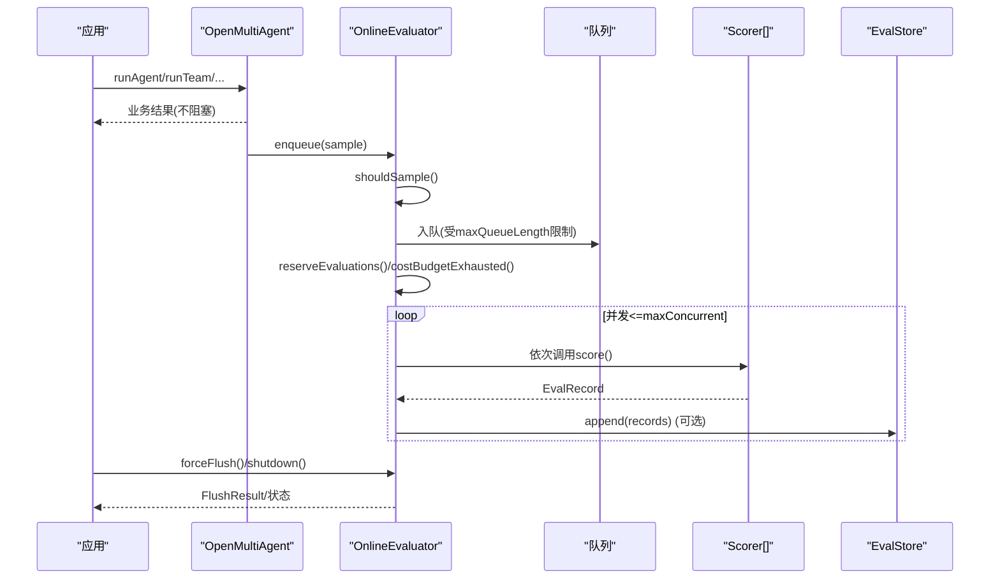
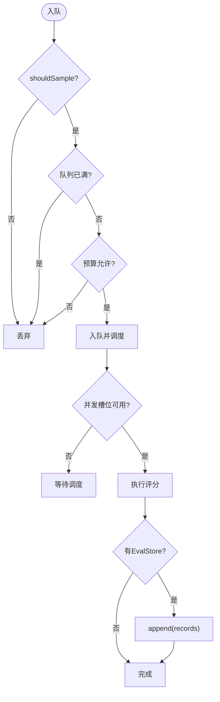
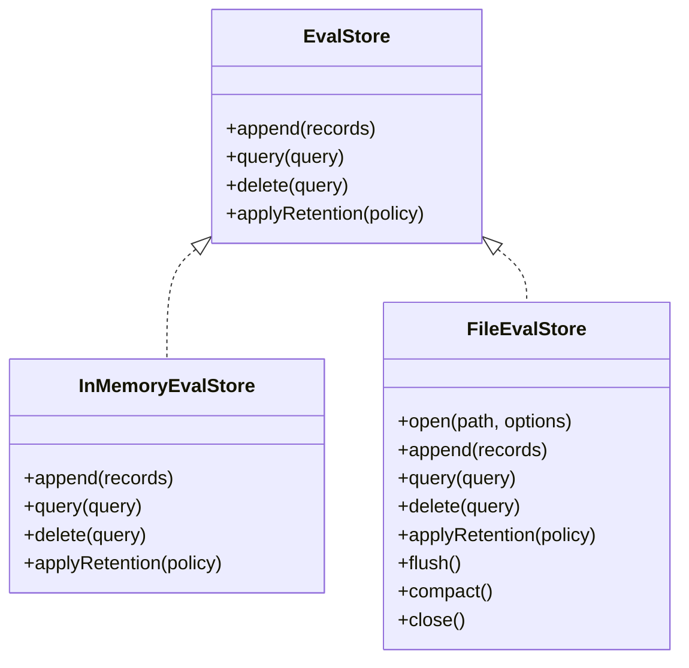
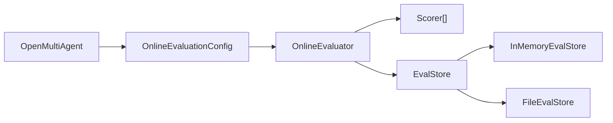

# 在线评估

<cite>
**本文引用的文件**
- [evaluation.md](file://docs/evaluation.md)
- [online.ts](file://packages/core/src/eval/online.ts)
- [store.ts](file://packages/core/src/eval/store.ts)
- [file-store.ts](file://packages/core/src/eval/file-store.ts)
- [record.ts](file://packages/core/src/eval/record.ts)
- [types.ts](file://packages/core/src/types.ts)
- [eval-online-sampling.ts](file://packages/core/examples/patterns/eval-online-sampling.ts)
</cite>

## 目录
1. [简介](#简介)
2. [项目结构](#项目结构)
3. [核心组件](#核心组件)
4. [架构总览](#架构总览)
5. [详细组件分析](#详细组件分析)
6. [依赖关系分析](#依赖关系分析)
7. [性能考量](#性能考量)
8. [故障排查指南](#故障排查指南)
9. [结论](#结论)
10. [附录](#附录)

## 简介
本章节面向在 OpenMultiAgent 中启用和使用“在线评估”的读者，系统说明如何配置采样策略、并发与队列、预算控制、存储后端以及生命周期管理（forceFlush、shutdown），并给出生产部署的最佳实践与安全注意事项。在线评估是“尽力而为”的异步质量观测机制：它不改变业务结果，仅在运行结束后进行抽样、评分与落盘，且所有失败均隔离于主流程之外。

## 项目结构
在线评估能力由以下模块构成：
- 运行时集成与生命周期：OpenMultiAgent 通过 OrchestratorConfig.evaluation 注入 OnlineEvaluationConfig；实例暴露 orchestrator.evaluation 用于 forceFlush/shutdown/getStats。
- 在线评估执行器：OnlineEvaluator 负责采样、入队、并发调度、预算控制、评分、持久化与诊断。
- 存储抽象与实现：EvalStore 接口定义 append/query/delete/applyRetention；InMemoryEvalStore 用于内存态；FileEvalStore 提供单进程 NDJSON 持久化。
- 记录模型：EvalRecord 描述一次评分结果的结构与字段约束。
- 示例与文档：examples 提供可运行的在线评估样例；docs 提供完整使用指南。



图表来源
- [online.ts:320-405](file://packages/core/src/eval/online.ts#L320-L405)
- [store.ts:57-64](file://packages/core/src/eval/store.ts#L57-L64)
- [file-store.ts:252-317](file://packages/core/src/eval/file-store.ts#L252-L317)

章节来源
- [types.ts:2254-2256](file://packages/core/src/types.ts#L2254-L2256)
- [online.ts:320-405](file://packages/core/src/eval/online.ts#L320-L405)
- [store.ts:57-64](file://packages/core/src/eval/store.ts#L57-L64)
- [file-store.ts:252-317](file://packages/core/src/eval/file-store.ts#L252-L317)

## 核心组件
- OnlineEvaluationConfig：包含 scorers、sample、maxConcurrent、maxQueueLength、budget、store、storePayloads、onResult、onDiagnostic、diagnostics 等选项。
- OnlineEvaluator：实现 enqueue、forceFlush、shutdown、getStats；维护队列、并发、预算、统计与诊断。
- EvalStore：统一存储接口；InMemoryEvalStore 适合测试与短生命周期；FileEvalStore 提供本地持久化与恢复。
- EvalRecord：评分结果的数据契约，source 为 online/offline，status 支持 scored/scorer_error/target_error/skipped。

章节来源
- [online.ts:56-86](file://packages/core/src/eval/online.ts#L56-L86)
- [online.ts:320-405](file://packages/core/src/eval/online.ts#L320-L405)
- [store.ts:57-64](file://packages/core/src/eval/store.ts#L57-L64)
- [record.ts:10-49](file://packages/core/src/eval/record.ts#L10-L49)

## 架构总览
在线评估的工作流如下：
- 业务运行完成后，OMA 将结果交由 OnlineEvaluator.enqueue 进行同步决策（采样、队列容量、预算）。
- 被接受的样本进入内部队列，按 maxConcurrent 并发执行评分。
- 每个 scorer 串行执行，产出 EvalRecord；可选写入 EvalStore。
- 应用可通过 forceFlush 等待已接受样本完成，或通过 shutdown 原子拒绝新样本并排空。
- 所有错误（采样异常、评分失败、存储失败）均不影响业务结果，仅产生诊断与统计。



图表来源
- [online.ts:407-464](file://packages/core/src/eval/online.ts#L407-L464)
- [online.ts:517-626](file://packages/core/src/eval/online.ts#L517-L626)
- [store.ts:57-64](file://packages/core/src/eval/store.ts#L57-L64)

## 详细组件分析

### 在线评估配置与启用
- 在 OpenMultiAgent 构造时传入 evaluation 配置项，即可启用在线评估。未配置或 sample=0 时自动禁用。
- 关键配置项：
  - scorers：至少一个评分器，可为规则或模型驱动。
  - sample：数值型概率或函数式规则，基于运行上下文决定是否抽样。
  - maxConcurrent：默认 1，控制并发评分任务数。
  - maxQueueLength：默认 100，超出则丢弃样本。
  - budget：支持 maxEvaluationsPerMinute（每分钟评分次数）与 maxCostPerHour（每小时成本上限，需配合 estimateCost）。
  - store：可选 EvalStore；未设置时仅内存处理。
  - storePayloads：'none'|'redacted'|'full'，控制输入输出是否持久化及脱敏。
  - onResult/onDiagnostic/diagnostics：回调与诊断模式。

章节来源
- [types.ts:2254-2256](file://packages/core/src/types.ts#L2254-L2256)
- [online.ts:56-86](file://packages/core/src/eval/online.ts#L56-L86)
- [online.ts:359-405](file://packages/core/src/eval/online.ts#L359-L405)
- [evaluation.md:140-240](file://docs/evaluation.md#L140-L240)

### 采样策略
- 数值采样：Math.random() < sample。
- 函数采样：接收 OnlineSampleContext（identity/status/metadata/durationMs），返回布尔值；抛错视为 false 并记录诊断。
- 建议：可按 status.code 或 metadata 中的标签（如 canary）做条件抽样，避免全量线上开销。

章节来源
- [online.ts:494-502](file://packages/core/src/eval/online.ts#L494-L502)
- [evaluation.md:193-206](file://docs/evaluation.md#L193-L206)

### 并发控制与队列管理
- 队列：bounded queue，长度受 maxQueueLength 限制；满时直接丢弃并上报 queue_full 诊断。
- 并发：worker 数量不超过 maxConcurrent；每个 worker 从队列取样执行评分。
- 顺序与水位线：enqueue 分配递增 id；forceFlush 等待到指定水位线（watermark）完成；shutdown 原子拒绝新样本并 flush 截止点。



图表来源
- [online.ts:407-464](file://packages/core/src/eval/online.ts#L407-L464)
- [online.ts:517-531](file://packages/core/src/eval/online.ts#L517-L531)

章节来源
- [online.ts:407-464](file://packages/core/src/eval/online.ts#L407-L464)
- [online.ts:517-531](file://packages/core/src/eval/online.ts#L517-L531)

### 预算控制
- 速率预算：maxEvaluationsPerMinute 以“评分次数”为单位计数（一个样本含多个 scorer 则多次计数）。
- 成本预算：maxCostPerHour 基于 estimateCost 对模型用量估算累计；若未提供 estimateCost，该预算不生效并告警。
- 预算耗尽：立即丢弃后续样本，并上报 budget_exhausted 诊断。

章节来源
- [online.ts:671-696](file://packages/core/src/eval/online.ts#L671-L696)
- [evaluation.md:221-230](file://docs/evaluation.md#L221-L230)

### 存储后端选择
- InMemoryEvalStore：内存存储，适合测试与短生命周期场景；支持 maxRecords 硬上限与 retention 策略。
- FileEvalStore：单进程 NDJSON 追加日志，具备幂等 append、恢复、压缩（compact）、fsync 边界（flush/close）；跨进程不安全。
- 查询与分页：支持 evalRunId/runId/scorer/source/status/time 范围过滤；cursor 快照不可跨实例复用。



图表来源
- [store.ts:57-64](file://packages/core/src/eval/store.ts#L57-L64)
- [store.ts:407-627](file://packages/core/src/eval/store.ts#L407-L627)
- [file-store.ts:252-450](file://packages/core/src/eval/file-store.ts#L252-L450)

章节来源
- [store.ts:57-64](file://packages/core/src/eval/store.ts#L57-L64)
- [store.ts:407-627](file://packages/core/src/eval/store.ts#L407-L627)
- [file-store.ts:252-450](file://packages/core/src/eval/file-store.ts#L252-L450)
- [evaluation.md:287-387](file://docs/evaluation.md#L287-L387)

### 生命周期管理
- forceFlush：等待截至当前水位的样本完成，返回 ok/partial/timeout/error 及统计。
- shutdown：原子拒绝新样本，flush 截止点，幂等；重复调用共享首次结果。
- getStats：返回 sampled/enqueued/completed/dropped/failed/storeFailed 累计计数。
- 典型用法：Serverless 每次请求后 flush；CLI 正常退出前 flush+shutdown；长服务优雅停机时先停流量再 flush+shutdown。

```mermaid
sequenceDiagram
participant App as "应用"
participant Eval as "OnlineEvaluator"
App->>Eval : forceFlush({timeoutMs})
Eval->>Eval : waitForWatermark(target, timeout)
Eval-->>App : FlushResult(status, counts)
App->>Eval : shutdown({timeoutMs})
Eval->>Eval : closing=true; forceFlush()
Eval-->>App : FlushResult(idempotent)
```

图表来源
- [online.ts:466-488](file://packages/core/src/eval/online.ts#L466-L488)
- [online.ts:737-774](file://packages/core/src/eval/online.ts#L737-L774)

章节来源
- [online.ts:466-488](file://packages/core/src/eval/online.ts#L466-L488)
- [evaluation.md:241-286](file://docs/evaluation.md#L241-L286)

### 数据隐私与 payload 策略
- storePayloads='none'：不持久化输入输出，仅保留元数据与分数。
- 'redacted'：序列化并脱敏，最大 8 KiB。
- 'full'：序列化但不脱敏，仍受 8 KiB 限制；需显式隐私决策。
- 注意：模型评分器会将待评输出发送至外部模型提供商，请谨慎开启。

章节来源
- [evaluation.md:232-240](file://docs/evaluation.md#L232-L240)
- [evaluation.md:744-747](file://docs/evaluation.md#L744-L747)

### 示例参考
- 在线评估采样示例展示了如何在 OpenMultiAgent 中配置 FileEvalStore、scorers、sample、预算与生命周期方法。

章节来源
- [eval-online-sampling.ts:1-60](file://packages/core/examples/patterns/eval-online-sampling.ts#L1-L60)

## 依赖关系分析
- OpenMultiAgent 通过 OrchestratorConfig.evaluation 注入 OnlineEvaluationConfig；若无配置或 sample=0，则使用 NOOP_ONLINE_EVALUATION。
- OnlineEvaluator 依赖：
  - Scorer[]：评分逻辑（规则或模型）。
  - EvalStore：可选，用于持久化。
  - estimateCost：可选，用于成本预算。
- 存储层：
  - InMemoryEvalStore：线程内内存表，支持 cursor、retention、删除。
  - FileEvalStore：单进程 NDJSON 追加日志，具备恢复、压缩、fsync 边界。



图表来源
- [types.ts:2254-2256](file://packages/core/src/types.ts#L2254-L2256)
- [online.ts:313-318](file://packages/core/src/eval/online.ts#L313-L318)
- [store.ts:57-64](file://packages/core/src/eval/store.ts#L57-L64)

章节来源
- [types.ts:2254-2256](file://packages/core/src/types.ts#L2254-L2256)
- [online.ts:313-318](file://packages/core/src/eval/online.ts#L313-L318)
- [store.ts:57-64](file://packages/core/src/eval/store.ts#L57-L64)

## 性能考量
- 采样与入队开销极低：基准显示 p95 约 0.42 µs（同进程直入），确保对主路径影响极小。
- 并发与队列：合理设置 maxConcurrent 与 maxQueueLength，避免评分任务积压导致延迟上升。
- 预算控制：启用 maxEvaluationsPerMinute 与 maxCostPerHour，保护下游模型与成本。
- 存储 I/O：FileEvalStore 的 flush/compact/close 是明确 fsync 边界；在高吞吐下应结合批处理与定期 compact。
- 诊断限频：诊断消息默认每 60 秒聚合一次，避免日志风暴。

章节来源
- [evaluation.md:281-286](file://docs/evaluation.md#L281-L286)
- [online.ts:24-30](file://packages/core/src/eval/online.ts#L24-L30)
- [online.ts:698-725](file://packages/core/src/eval/online.ts#L698-L725)

## 故障排查指南
常见诊断码与含义：
- queue_full：队列已满，样本被丢弃。
- budget_exhausted：速率或成本预算耗尽。
- scorer_failed：评分器抛错/超时或被取消。
- store_append_failed：存储写入失败，样本批次丢弃。
- flush_timeout：forceFlush 等待超时。
- enqueue_after_shutdown：在 shutdown 后尝试入队被拒。

定位步骤：
- 检查 getStats() 的 enqueued/completed/dropped/failed/storeFailed 变化趋势。
- 查看 onDiagnostic 或控制台警告，确认具体 code 与 count。
- 若 store 为 FileEvalStore，检查 flush/compact/close 是否成功，关注 RECOVERY_REQUIRED/CLOSED 等错误。
- 对于 scorer 失败，确认 scorer.timeoutMs 与外部依赖可用性。

章节来源
- [online.ts:40-54](file://packages/core/src/eval/online.ts#L40-L54)
- [online.ts:596-625](file://packages/core/src/eval/online.ts#L596-L625)
- [file-store.ts:35-66](file://packages/core/src/eval/file-store.ts#L35-L66)

## 结论
在线评估为 OpenMultiAgent 提供了低侵入、可观测的质量保障通道。通过合理的采样策略、并发与队列配置、预算控制与合适的存储后端，可在生产环境中安全地收集评估指标。务必重视生命周期管理（forceFlush/shutdown）与隐私策略（storePayloads），并结合诊断与监控持续优化。

## 附录
- 快速上手：参考示例文件，结合 FileEvalStore 与 costBudgetScorer 验证端到端流程。
- 离线评估：如需批量回归与报告，可使用 EvalSet 与 CLI 工具生成 JSON/Markdown/JUnit 报告。
- 最佳实践：
  - 生产环境优先使用 FileEvalStore 并定期 compact；必要时迁移至数据库适配器。
  - 启用预算控制与诊断回调，避免资源滥用与日志风暴。
  - 严格管理 storePayloads，遵循最小必要原则。
  - 在 Serverless/短生命周期场景中，每次请求后 flush；在服务关闭时 flush+shutdown。

章节来源
- [eval-online-sampling.ts:1-60](file://packages/core/examples/patterns/eval-online-sampling.ts#L1-L60)
- [evaluation.md:420-491](file://docs/evaluation.md#L420-L491)