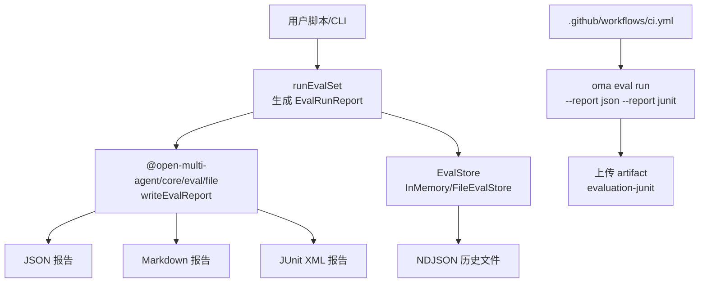
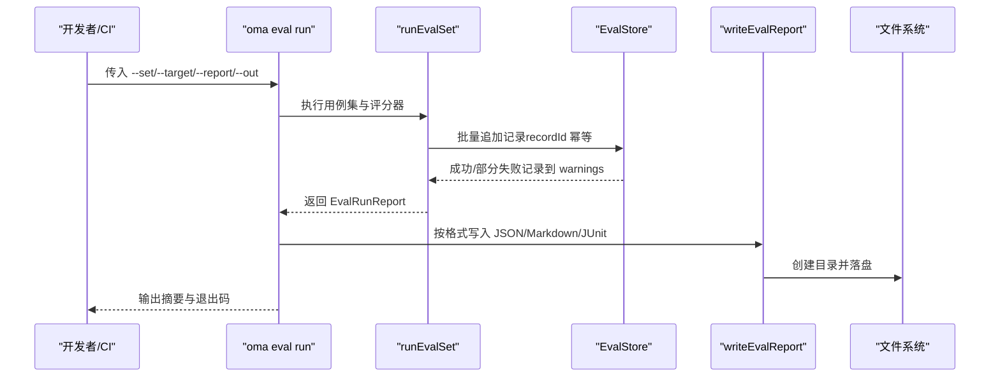
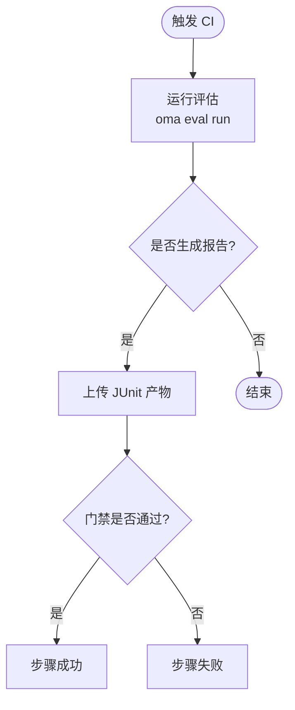
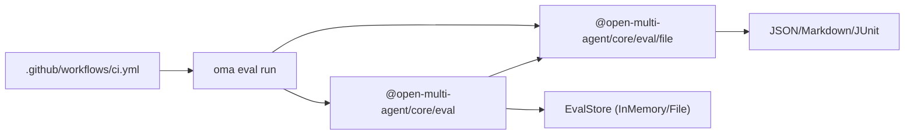

# 报告生成

<cite>
**本文引用的文件**
- [evaluation.md](file://docs/evaluation.md)
- [ci.yml](file://.github/workflows/ci.yml)
- [eval-file-store.test.ts](file://packages/core/tests/eval-file-store.test.ts)
</cite>

## 目录
1. [简介](#简介)
2. [项目结构](#项目结构)
3. [核心组件](#核心组件)
4. [架构总览](#架构总览)
5. [详细组件分析](#详细组件分析)
6. [依赖关系分析](#依赖关系分析)
7. [性能考量](#性能考量)
8. [故障排查指南](#故障排查指南)
9. [结论](#结论)
10. [附录](#附录)

## 简介
本章节聚焦评估报告的生成与分析能力，覆盖以下目标：
- 如何生成不同格式的报告：JSON、Markdown、JUnit XML。
- 报告内容的结构与字段含义：聚合统计、失败样本、评分详情等。
- 报告的加载与解析方法：loadEvalReport 与 loadEvalSet。
- 将评估结果集成到 CI/CD 流程（含 GitHub Actions 示例）。
- 报告可视化与趋势分析的最佳实践。

该功能基于 @open-multi-agent/core/eval 子路径提供的离线评估与在线采样能力，并通过 Node-only 的 @open-multi-agent/core/eval/file 子路径完成文件 I/O 与报告写入。

**章节来源**
- [evaluation.md:1-18](file://docs/evaluation.md#L1-L18)

## 项目结构
围绕“报告生成”的关键位置如下：
- 文档入口与使用说明：docs/evaluation.md
- 报告写入与加载（Node-only）：@open-multi-agent/core/eval/file（通过 CLI 与 API 暴露）
- CI 中的评估门禁与产物上传：.github/workflows/ci.yml
- 评估存储与持久化（NDJSON 文件）：packages/core/tests/eval-file-store.test.ts（验证文件格式与恢复行为）

**图表来源**
- [evaluation.md:420-460](file://docs/evaluation.md#L420-L460)
- [ci.yml:82-104](file://.github/workflows/ci.yml#L82-L104)
- [eval-file-store.test.ts:76-174](file://packages/core/tests/eval-file-store.test.ts#L76-L174)

**章节来源**
- [evaluation.md:420-460](file://docs/evaluation.md#L420-L460)
- [ci.yml:82-104](file://.github/workflows/ci.yml#L82-L104)
- [eval-file-store.test.ts:76-174](file://packages/core/tests/eval-file-store.test.ts#L76-L174)

## 核心组件
- 评估运行与报告对象
  - runEvalSet：执行用例集与评分器，返回包含 records、aggregates、warnings 等的 EvalRunReport。
  - 评分器：规则型或模型型（judge），输出 score、pass、reason 等。
- 报告写入
  - writeEvalReport：支持 JSON、Markdown、JUnit XML 三种格式；自动创建父目录；对 Markdown 截断长失败原因；对 JUnit XML 进行转义。
- 报告与集合加载
  - loadEvalSet：解析并校验 JSON 格式的 EvalSet，深冻结并附加文件路径与首个校验问题。
  - loadEvalReport：校验并加载基线报告（schema-versioned JSON），用于回归比较。
- 存储与持久化
  - EvalStore：统一接口，支持 append/query/delete/applyRetention。
  - FileEvalStore：单进程 NDJSON 追加日志，具备版本头、批处理原子性、损坏恢复与诊断。

**章节来源**
- [evaluation.md:90-139](file://docs/evaluation.md#L90-L139)
- [evaluation.md:287-387](file://docs/evaluation.md#L287-L387)
- [evaluation.md:420-460](file://docs/evaluation.md#L420-L460)
- [eval-file-store.test.ts:76-174](file://packages/core/tests/eval-file-store.test.ts#L76-L174)

## 架构总览
下图展示了从评估运行到多格式报告输出的端到端流程，以及 CI 中如何利用 JUnit 产物进行质量门禁。

**图表来源**
- [evaluation.md:420-460](file://docs/evaluation.md#L420-L460)
- [evaluation.md:462-491](file://docs/evaluation.md#L462-L491)
- [eval-file-store.test.ts:76-174](file://packages/core/tests/eval-file-store.test.ts#L76-L174)

## 详细组件分析

### 报告格式与内容结构
- JSON 报告
  - 权威、可打印的 EvalRunReport 表示，包含元数据、records、aggregates、warnings、totals 等。
  - 适合机器消费、基线对比与趋势分析。
- Markdown 报告
  - 面向人类阅读：元数据、各评分器的聚合、失败样例、总计信息；长失败原因会被截断。
- JUnit XML 报告
  - 每个 record 对应一个 testcase；pass=false 映射为 <failure>；scorer_error/target_error 映射为 <error>；无 pass 且无错误视为成功；XML 名称与消息会做完全转义。

字段与含义要点
- 聚合统计（aggregates）：按评分器与标签维度计算均值、分位数、通过率等；仅包含显式 pass 的记录参与通过率计算；评分器错误不计入分母。
- 失败样本：records 中标记 target_error/scorer_error 或 pass=false 的条目，便于定位问题。
- 评分详情：每条 record 包含 scorer、status、score、pass、reason、details 等，便于追溯评分依据。

**章节来源**
- [evaluation.md:420-460](file://docs/evaluation.md#L420-L460)
- [evaluation.md:123-139](file://docs/evaluation.md#L123-L139)

### 报告加载与解析
- loadEvalSet
  - 解析 JSON 格式的 EvalSet，应用与 defineEvalSet 相同的校验与深冻结逻辑；在错误中包含解析到的文件路径与首个校验问题。
- loadEvalReport
  - 校验 schema-versioned JSON 的基线报告，返回防御性拷贝并深冻结；用于 evaluateGate 的回归比较。

使用建议
- 将 EvalSet 与 Gate 策略以 JSON 形式纳入版本控制，配合 baseline.json 形成稳定的质量门禁。
- 在 CI 中先运行评估生成报告，再调用 gate 命令进行判定。

**章节来源**
- [evaluation.md:420-460](file://docs/evaluation.md#L420-L460)

### 存储与持久化（NDJSON）
- FileEvalStore
  - 单进程参考实现，维护带 schema 版本的 NDJSON 追加日志；打开时重建内存索引。
  - 批处理原子可见：已提交批次要么完整可见，要么不可见；崩溃最多丢失最后一个未持久化的批次。
  - 恢复机制：遇到不完整批次或尾部残缺行会发出诊断并安全截断；严重损坏则报错。
  - 压缩：写临时文件、fsync、原子重命名覆盖目标，并在支持的系统上 fsync 父目录。

注意
- 不建议跨进程共享同一文件；如需多进程或大规模数据，应使用数据库适配器。
- 删除与保留策略是幂等的；查询分页默认 100，最大 1000。

**章节来源**
- [evaluation.md:347-387](file://docs/evaluation.md#L347-L387)
- [eval-file-store.test.ts:76-174](file://packages/core/tests/eval-file-store.test.ts#L76-L174)

### CI/CD 集成（GitHub Actions）
- 在 CI 中运行评估并输出多种报告
  - 使用 oma eval run 指定 --set/--target/--gate/--baseline/--report json/--report junit/--out。
  - 通过 exit code 控制步骤状态：门禁失败或所有目标失败时退出码为 1；用法/模块错误为 2。
- 上传 JUnit 产物
  - 使用 actions/upload-artifact 上传 report.junit.xml，便于在 PR 中查看测试结果。
- 基线与回归
  - 将 baseline.json 纳入仓库；CI 中通过 --baseline 进行比较，避免误报漂移。

**图表来源**
- [ci.yml:82-104](file://.github/workflows/ci.yml#L82-L104)
- [evaluation.md:462-491](file://docs/evaluation.md#L462-L491)

**章节来源**
- [ci.yml:82-104](file://.github/workflows/ci.yml#L82-L104)
- [evaluation.md:462-491](file://docs/evaluation.md#L462-L491)

### 可视化与趋势分析最佳实践
- 选择合适的数据源
  - JSON 报告作为权威数据源，便于程序化消费与对比。
  - Markdown 报告用于人工审阅与快速定位失败样例。
  - JUnit XML 用于 CI 平台展示测试分布与失败详情。
- 趋势分析
  - 定期保存 JSON 报告作为基线；在后续运行中通过 evaluateGate 与 baseline 比较，关注关键指标（avg、p50、p95、passRate）的回归。
  - 结合时间序列工具（如 Grafana、Tableau 或自研看板）绘制指标趋势，设置告警阈值。
- 可视化建议
  - 聚合视图：按评分器/标签维度展示通过率与分数分布。
  - 失败视图：列出失败样例 ID、评分器、reason 与上下文引用（如 trace/runRef）。
  - 回归视图：对比候选与基线的差异，突出超阈值的指标变化。

[本节为通用实践说明，不直接分析具体代码文件]

## 依赖关系分析
- 运行时依赖
  - 评估运行依赖评分器与目标函数；可选依赖 traceStore 以增强上下文。
  - 报告写入依赖 Node-only 的 file 子路径；根包与 core/eval 不引入该入口。
- 存储依赖
  - InMemoryEvalStore：适用于本地/测试场景。
  - FileEvalStore：适用于本地持久化；需显式 flush/compact/close。
- CI 依赖
  - GitHub Actions 通过 CLI 驱动评估与门禁；产物通过 artifact 上传。

**图表来源**
- [evaluation.md:420-460](file://docs/evaluation.md#L420-L460)
- [evaluation.md:287-387](file://docs/evaluation.md#L287-L387)
- [ci.yml:82-104](file://.github/workflows/ci.yml#L82-L104)

**章节来源**
- [evaluation.md:287-387](file://docs/evaluation.md#L287-L387)
- [evaluation.md:420-460](file://docs/evaluation.md#L420-L460)
- [ci.yml:82-104](file://.github/workflows/ci.yml#L82-L104)

## 性能考量
- 评估开销隔离
  - 在线评估仅在业务运行后做抽样与队列准入；评分与存储异步进行，不影响业务响应。
  - 默认保守配置：并发与队列长度受限，负载可控。
- 存储性能
  - FileEvalStore 采用追加日志与原子批处理；flush 提供 fsync 边界；compaction 减少文件大小。
- 报告体积
  - Markdown 会截断长失败原因；JUnit XML 对特殊字符转义；JSON 保持完整结构。

[本节提供一般性指导，不直接分析具体代码文件]

## 故障排查指南
- 评分器错误
  - 评分器抛错/超时不会得到 0 分，而是记录为 scorer_error，并从分母中排除；由门禁健康限制决定是否阻断。
- 目标错误
  - 目标抛错产生 target_error 记录，其 scorers 不再运行。
- 存储异常
  - FileEvalStore 遇到不完整批次或尾部残缺行会发出诊断并安全恢复；严重损坏会报错。
- CI 门禁失败
  - 检查 gate 策略与 baseline 是否匹配；确认评分器版本一致；查看 verdict 中的 failures/warnings。

**章节来源**
- [evaluation.md:47-51](file://docs/evaluation.md#L47-L51)
- [evaluation.md:492-567](file://docs/evaluation.md#L492-L567)
- [eval-file-store.test.ts:114-174](file://packages/core/tests/eval-file-store.test.ts#L114-L174)

## 结论
- 通过 runEvalSet 与 writeEvalReport，可以稳定地生成 JSON、Markdown、JUnit XML 三类报告，满足机器与人工消费需求。
- 借助 loadEvalSet/loadEvalReport 与 evaluateGate，可在 CI 中建立可复现的质量门禁与回归检测。
- 使用 FileEvalStore 或 InMemoryEvalStore 管理评估记录，并结合基线与趋势分析实现持续改进。
- 建议在 CI 中同时产出 JSON 与 JUnit 产物，既便于自动化比对，也利于可视化展示。

[本节总结性内容，不直接分析具体代码文件]

## 附录
- 常用命令参考
  - 运行评估并输出多种报告：oma eval run --set ... --target ... --report json --report junit --out ...
  - 单独门禁判定：oma eval gate --report ... --gate ... --baseline ...
- 注意事项
  - 评分器错误不等于 0 分；不要用 0 分替代评分器失败。
  - 基线变更需人工审查后再更新 baseline.json。
  - 在线评估默认关闭，需显式配置 sample/store/budget 等参数。

[本节为补充说明，不直接分析具体代码文件]