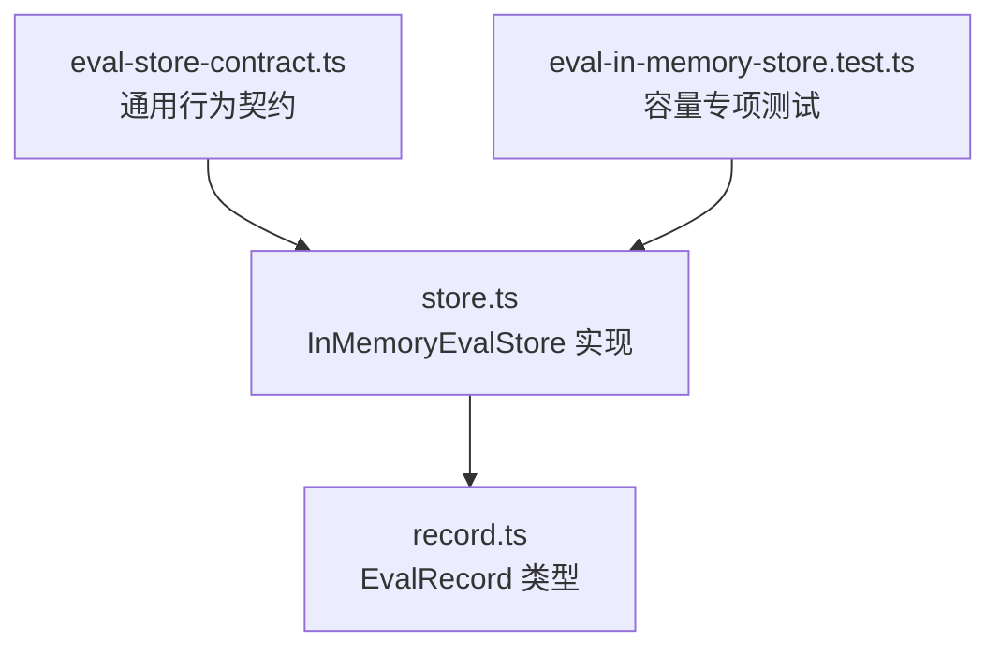
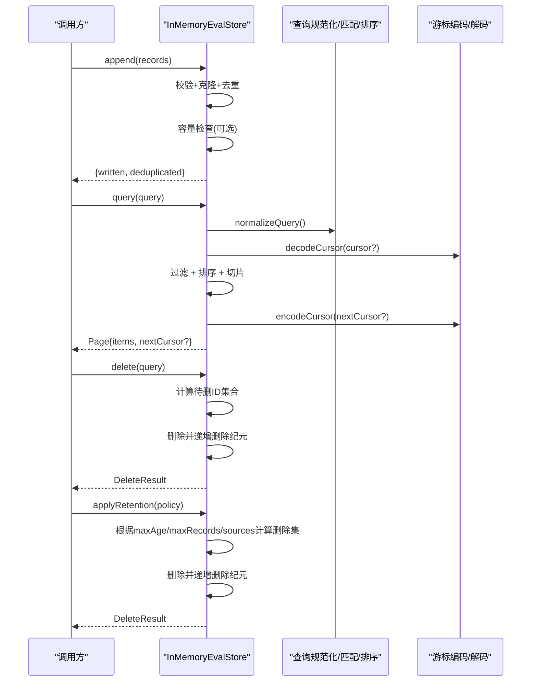
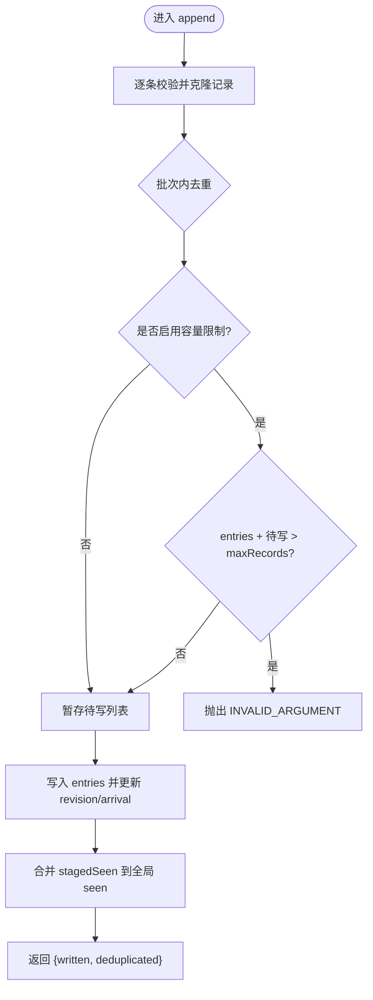
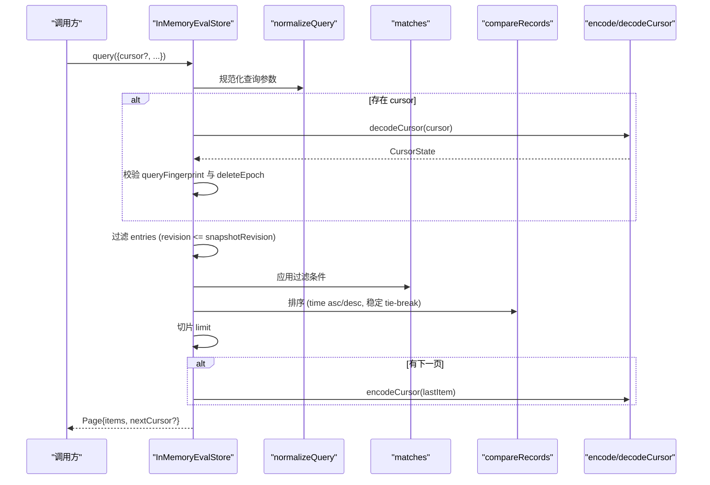
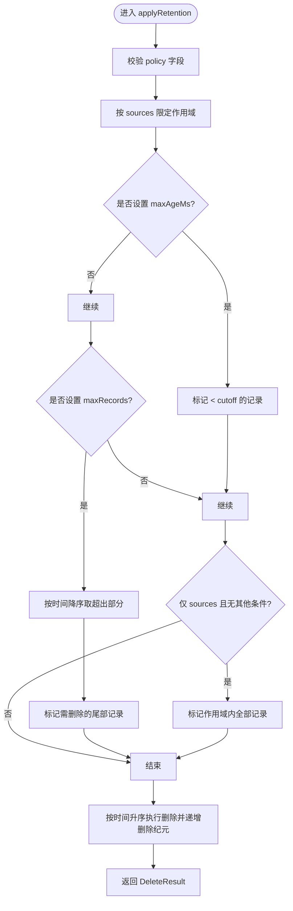
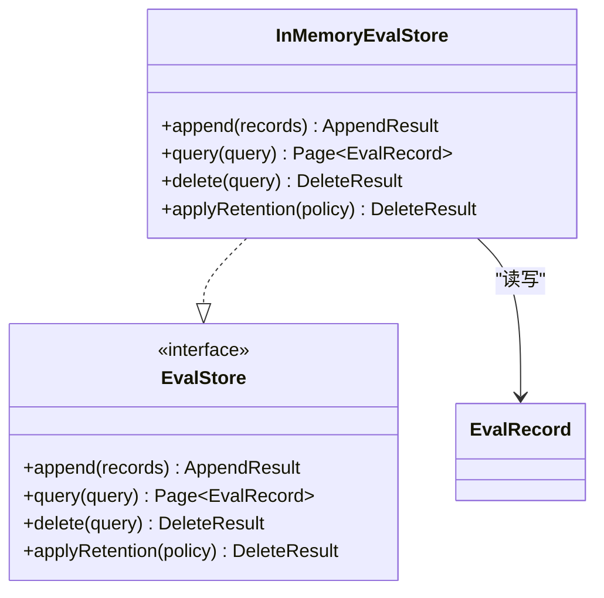

# 内存存储实现

<cite>
**本文引用的文件**
- [store.ts](file://packages/core/src/eval/store.ts)
- [record.ts](file://packages/core/src/eval/record.ts)
- [eval-store-contract.ts](file://packages/core/tests/eval-store-contract.ts)
- [eval-in-memory-store.test.ts](file://packages/core/tests/eval-in-memory-store.test.ts)
</cite>

## 目录
1. [简介](#简介)
2. [项目结构](#项目结构)
3. [核心组件](#核心组件)
4. [架构总览](#架构总览)
5. [详细组件分析](#详细组件分析)
6. [依赖关系分析](#依赖关系分析)
7. [性能考量](#性能考量)
8. [故障排查指南](#故障排查指南)
9. [结论](#结论)
10. [附录](#附录)

## 简介
本文件围绕 InMemoryEvalStore 的实现原理与使用方法展开，重点解释其内存数据结构（StoredRecordEntry、CursorState、NormalizedQuery）、追加操作的原子性与幂等性保证（记录去重与容量控制）、查询功能的规范化与匹配排序分页机制、删除操作与保留策略的应用方式，以及配置选项、性能特点、使用场景与局限性。

## 项目结构
InMemoryEvalStore 位于评估存储模块中，提供非持久化的 EvalStore 实现，用于测试与短生命周期运行。其核心定义与行为由以下文件共同约束：
- 接口与实现：store.ts
- 数据模型：record.ts
- 行为契约与用例：eval-store-contract.ts、eval-in-memory-store.test.ts

图表来源
- [store.ts:407-627](file://packages/core/src/eval/store.ts#L407-L627)
- [record.ts:10-49](file://packages/core/src/eval/record.ts#L10-L49)
- [eval-store-contract.ts:62-283](file://packages/core/tests/eval-store-contract.ts#L62-L283)
- [eval-in-memory-store.test.ts:10-21](file://packages/core/tests/eval-in-memory-store.test.ts#L10-L21)

章节来源
- [store.ts:407-627](file://packages/core/src/eval/store.ts#L407-L627)
- [record.ts:10-49](file://packages/core/src/eval/record.ts#L10-L49)
- [eval-store-contract.ts:62-283](file://packages/core/tests/eval-store-contract.ts#L62-L283)
- [eval-in-memory-store.test.ts:10-21](file://packages/core/tests/eval-in-memory-store.test.ts#L10-L21)

## 核心组件
- InMemoryEvalStore：内存中的评估记录存储，实现 append/query/delete/applyRetention 四个方法，支持查询游标与保留策略。
- StoredRecordEntry：内部存储单元，包含记录、版本号和到达顺序。
- CursorState：分页游标的内部状态，绑定查询指纹、快照版本、删除纪元和定位点。
- NormalizedQuery：查询参数的规范化形式，统一过滤条件、排序与限制。

章节来源
- [store.ts:73-98](file://packages/core/src/eval/store.ts#L73-L98)
- [store.ts:407-627](file://packages/core/src/eval/store.ts#L407-L627)

## 架构总览
InMemoryEvalStore 以数组维护有序记录，通过版本号与到达序号保障一致性；查询时先规范化参数，再基于快照版本进行过滤、排序与分页；删除通过“删除纪元”使旧游标失效；保留策略按时间、数量或来源筛选并批量删除。

图表来源
- [store.ts:431-462](file://packages/core/src/eval/store.ts#L431-L462)
- [store.ts:464-509](file://packages/core/src/eval/store.ts#L464-L509)
- [store.ts:511-565](file://packages/core/src/eval/store.ts#L511-L565)
- [store.ts:602-625](file://packages/core/src/eval/store.ts#L602-L625)

## 详细组件分析

### 数据结构设计
- StoredRecordEntry
  - 字段：记录对象、版本号、到达序号
  - 作用：记录写入顺序与可见性快照，支撑稳定排序与快照一致性
- CursorState
  - 字段：快照版本号、删除纪元、查询指纹、时间戳、记录ID
  - 作用：将分页位置与查询语义绑定，防止跨实例/跨查询复用导致的不一致
- NormalizedQuery
  - 字段：标准化后的过滤条件、limit、order
  - 作用：统一输入边界，简化匹配与排序逻辑

章节来源
- [store.ts:73-98](file://packages/core/src/eval/store.ts#L73-L98)

### 追加操作：原子性与幂等性
- 原子性
  - 批内所有记录在写入前完成校验与克隆，任一非法则整批拒绝，不会部分写入
  - 容量限制（可选）在写入前整体检查，超限则整批拒绝
- 幂等性
  - 同一批次内按 recordId 去重，仅保留首次出现的完整负载
  - 全局 seen 表避免重复写入相同 recordId
  - 返回结果包含 written 与 deduplicated，便于上层统计
- 容量控制
  - 若配置 maxRecords，则在追加前判断 entries.length + 新写入数是否超过上限，超限直接抛出结构化错误
  - 该限制是硬上限，不触发自动清理

图表来源
- [store.ts:431-462](file://packages/core/src/eval/store.ts#L431-L462)

章节来源
- [store.ts:431-462](file://packages/core/src/eval/store.ts#L431-L462)
- [eval-in-memory-store.test.ts:10-21](file://packages/core/tests/eval-in-memory-store.test.ts#L10-L21)

### 查询功能：规范化、匹配、排序与游标
- 查询规范化
  - 统一 limit（默认 100，范围 1..1000）、order（time_asc/time_desc）、时间边界 after/before、枚举值校验
  - 将字符串或数组形式的过滤条件归一化为有序无重复列表
- 匹配算法
  - 支持 evalRunId、runId、evalSetName、scorer、source、status、after/before 的组合过滤
  - 时间比较基于记录的 timestampUnixMs
- 排序逻辑
  - 按 timestampUnixMs 升序或降序；时间相同时按 recordId 字典序稳定排序
- 分页游标
  - 编码：将 CursorState 序列化后 URL 编码，附加签名（基于实例私钥哈希），形成 opaque 字符串
  - 解码：校验格式与签名，解析出快照版本、删除纪元、查询指纹、定位点
  - 一致性：游标绑定查询指纹与删除纪元，任何变化均视为无效，避免跨实例/跨查询复用

图表来源
- [store.ts:333-395](file://packages/core/src/eval/store.ts#L333-L395)
- [store.ts:464-509](file://packages/core/src/eval/store.ts#L464-L509)
- [store.ts:602-625](file://packages/core/src/eval/store.ts#L602-L625)

章节来源
- [store.ts:333-395](file://packages/core/src/eval/store.ts#L333-L395)
- [store.ts:464-509](file://packages/core/src/eval/store.ts#L464-L509)
- [store.ts:602-625](file://packages/core/src/eval/store.ts#L602-L625)
- [eval-store-contract.ts:106-202](file://packages/core/tests/eval-store-contract.ts#L106-L202)

### 删除操作与保留策略
- 删除
  - 支持按 evalRunId、evalSetName、before 时间边界组合删除
  - 删除会移除对应记录并从 seen 表中清除，随后递增删除纪元，使旧游标失效
  - 删除操作幂等：重复删除不会产生副作用
- 保留策略
  - maxAgeMs：删除早于 now() - maxAgeMs 的记录
  - maxRecords：保留最近 maxRecords 条，其余删除
  - sources：仅对指定来源生效
  - 策略可组合，最终按时间升序删除，确保确定性

图表来源
- [store.ts:529-565](file://packages/core/src/eval/store.ts#L529-L565)

章节来源
- [store.ts:511-565](file://packages/core/src/eval/store.ts#L511-L565)
- [eval-store-contract.ts:221-263](file://packages/core/tests/eval-store-contract.ts#L221-L263)

### 配置选项说明
- InMemoryEvalStoreOptions
  - maxRecords：硬容量上限。若追加会导致超过上限，整批拒绝并抛出 INVALID_ARGUMENT
  - now：注入的时间函数，仅用于保留策略中的时间计算，便于测试与确定性
- 使用示例要点
  - 构造时传入 now 以固定当前时间，配合 applyRetention 验证过期删除
  - 设置 maxRecords 以限制内存占用，适合短时评测或测试

章节来源
- [store.ts:66-71](file://packages/core/src/eval/store.ts#L66-L71)
- [store.ts:417-429](file://packages/core/src/eval/store.ts#L417-L429)
- [eval-store-contract.ts:247-263](file://packages/core/tests/eval-store-contract.ts#L247-L263)

### 使用场景与局限性
- 适用场景
  - 单元测试与集成测试：无需外部依赖，快速启动与清理
  - 本地短生命周期评测：进程退出即释放，无持久化开销
  - 作为 FileEvalStore 的内存镜像：用于快速路径或并发安全隔离
- 局限性
  - 非持久化：进程崩溃数据丢失
  - 单进程：不支持跨进程共享
  - 容量有限：受限于 maxRecords，不适合长期归档
  - 游标实例绑定：不同实例间不可复用

章节来源
- [store.ts:407-429](file://packages/core/src/eval/store.ts#L407-L429)
- [eval-store-contract.ts:187-202](file://packages/core/tests/eval-store-contract.ts#L187-L202)

## 依赖关系分析
- 对外接口
  - EvalStore：定义 append/query/delete/applyRetention 契约
  - EvalRecord：记录的数据结构与版本约束
- 内部依赖
  - 校验工具：validateRecord、normalizeQuery、matches、compareRecords
  - 游标工具：encodeCursor、decodeCursor
  - 常量集合：EVAL_STATUSES、EVAL_SOURCES、TRACE_ERROR_KINDS

图表来源
- [store.ts:57-64](file://packages/core/src/eval/store.ts#L57-L64)
- [store.ts:407-627](file://packages/core/src/eval/store.ts#L407-L627)
- [record.ts:10-49](file://packages/core/src/eval/record.ts#L10-L49)

章节来源
- [store.ts:57-64](file://packages/core/src/eval/store.ts#L57-L64)
- [store.ts:407-627](file://packages/core/src/eval/store.ts#L407-L627)
- [record.ts:10-49](file://packages/core/src/eval/record.ts#L10-L49)

## 性能考量
- 时间复杂度
  - append：O(n) 校验与去重，n 为批次大小；容量检查 O(1)
  - query：O(m) 过滤 + O(k log k) 排序（k 为候选记录数）+ O(1) 切片
  - delete/applyRetention：O(m) 扫描 + O(d log d) 排序（d 为待删记录数）
- 空间复杂度
  - 内存占用与记录数线性相关；seen Map 与 entries 数组共同维护
- 优化建议
  - 合理设置 limit，避免过大结果集
  - 使用 after/before 缩小扫描范围
  - 结合 maxRecords 控制内存峰值
  - 在高频查询下，优先使用游标分页

[本节为通用性能讨论，不直接分析具体代码行]

## 故障排查指南
- 常见错误码
  - INVALID_ARGUMENT：参数校验失败（如 limit、order、status、source、schemaVersion 等）
  - INVALID_CURSOR：游标无效、篡改、与当前查询不匹配或被删除失效
  - UNSUPPORTED_SCHEMA_VERSION：记录 schemaVersion 主版本不受支持
- 典型问题定位
  - 追加失败：检查 records 是否为数组、每条记录是否满足 validateRecord 约束、是否超过 maxRecords
  - 查询异常：确认 after/before 合法、order 取值、limit 范围
  - 游标报错：确认未跨实例复用、未修改查询条件、未被删除影响
  - 保留策略无效：确认 policy 至少设置一项（maxAgeMs/maxRecords/sources），now 注入正确

章节来源
- [store.ts:9-25](file://packages/core/src/eval/store.ts#L9-L25)
- [store.ts:194-287](file://packages/core/src/eval/store.ts#L194-L287)
- [store.ts:333-369](file://packages/core/src/eval/store.ts#L333-L369)
- [store.ts:469-509](file://packages/core/src/eval/store.ts#L469-L509)
- [store.ts:529-565](file://packages/core/src/eval/store.ts#L529-L565)
- [eval-store-contract.ts:265-280](file://packages/core/tests/eval-store-contract.ts#L265-L280)

## 结论
InMemoryEvalStore 提供了轻量、确定性强、易于测试的评估记录存储实现。通过严格的参数校验、批级原子写入、recordId 幂等去重、快照版本与删除纪元的游标一致性保障，使其在测试与短生命周期场景中表现可靠。对于需要持久化与跨进程共享的场景，应选用 FileEvalStore 或其他后端实现。

[本节为总结性内容，不直接分析具体代码行]

## 附录
- 关键流程参考
  - 追加：[store.ts:431-462](file://packages/core/src/eval/store.ts#L431-L462)
  - 查询：[store.ts:464-509](file://packages/core/src/eval/store.ts#L464-L509)
  - 删除：[store.ts:511-565](file://packages/core/src/eval/store.ts#L511-L565)
  - 游标：[store.ts:602-625](file://packages/core/src/eval/store.ts#L602-L625)
- 行为契约与用例
  - 通用契约：[eval-store-contract.ts:62-283](file://packages/core/tests/eval-store-contract.ts#L62-L283)
  - 容量测试：[eval-in-memory-store.test.ts:10-21](file://packages/core/tests/eval-in-memory-store.test.ts#L10-L21)