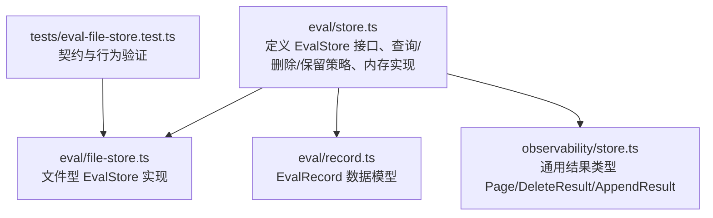
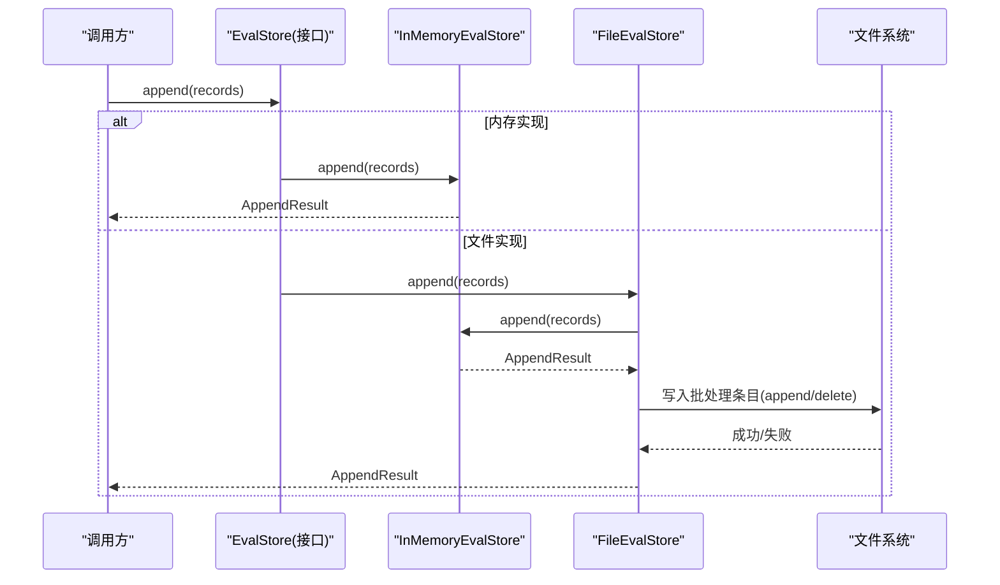
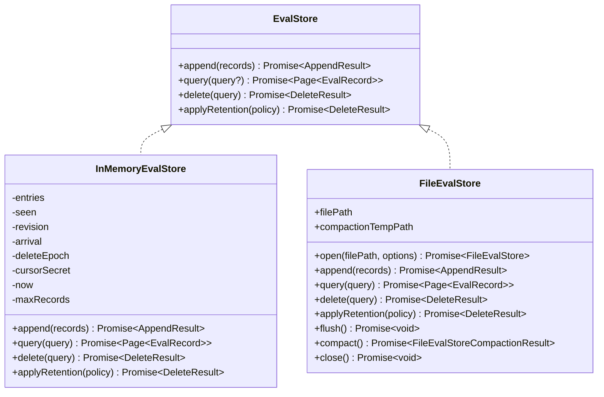
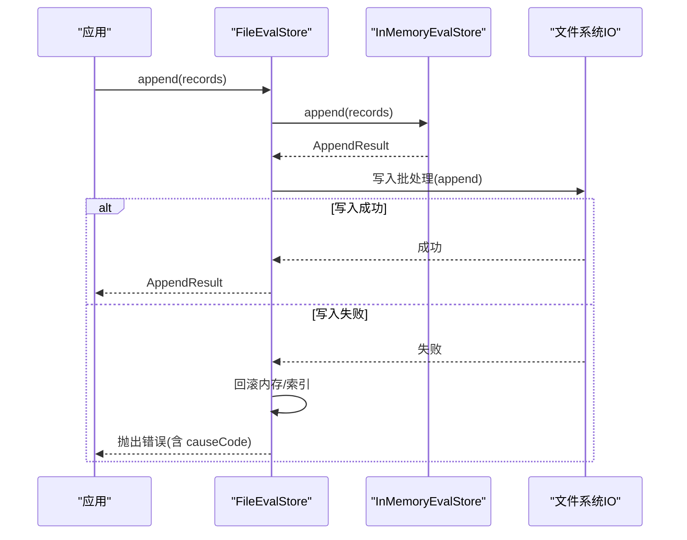
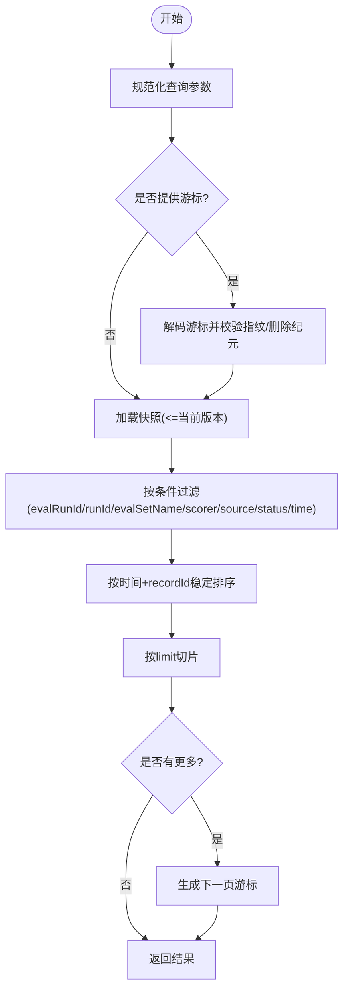
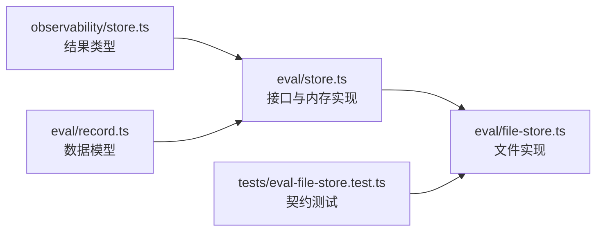

# 存储接口设计

<cite>
**本文引用的文件**
- [packages/core/src/eval/store.ts](file://packages/core/src/eval/store.ts)
- [packages/core/src/eval/file-store.ts](file://packages/core/src/eval/file-store.ts)
- [packages/core/src/eval/record.ts](file://packages/core/src/eval/record.ts)
- [packages/core/src/observability/store.ts](file://packages/core/src/observability/store.ts)
- [packages/core/tests/eval-file-store.test.ts](file://packages/core/tests/eval-file-store.test.ts)
</cite>

## 目录
1. [简介](#简介)
2. [项目结构](#项目结构)
3. [核心组件](#核心组件)
4. [架构总览](#架构总览)
5. [详细组件分析](#详细组件分析)
6. [依赖关系分析](#依赖关系分析)
7. [性能考量](#性能考量)
8. [故障排查指南](#故障排查指南)
9. [结论](#结论)
10. [附录](#附录)

## 简介
本文件面向评估数据存储接口的设计与契约，重点说明 EvalStore 接口的四个核心方法：append、query、delete 与 applyRetention 的职责与实现要求；解释 EvalQuery 与 EvalDeleteQuery 的字段定义与使用方式（时间范围过滤、状态筛选、分页游标等）；介绍 EvalRetentionPolicy 保留策略的配置选项与数据生命周期管理；阐述错误处理机制（EvalStoreError 类型及错误码）；并提供自定义存储后端实现的完整指南与最佳实践。

## 项目结构
评估存储相关代码集中在 core 包的 eval 子模块中，包含：
- 接口与内存实现：store.ts
- 基于文件的持久化实现：file-store.ts
- 记录模型：record.ts
- 通用结果类型（AppendResult、DeleteResult、Page）：observability/store.ts
- 行为契约测试：tests/eval-file-store.test.ts

**图表来源**
- [packages/core/src/eval/store.ts:57-64](file://packages/core/src/eval/store.ts#L57-L64)
- [packages/core/src/eval/file-store.ts:252-364](file://packages/core/src/eval/file-store.ts#L252-L364)
- [packages/core/src/eval/record.ts:10-49](file://packages/core/src/eval/record.ts#L10-L49)
- [packages/core/src/observability/store.ts:37-53](file://packages/core/src/observability/store.ts#L37-L53)
- [packages/core/tests/eval-file-store.test.ts:42-68](file://packages/core/tests/eval-file-store.test.ts#L42-L68)

**章节来源**
- [packages/core/src/eval/store.ts:57-64](file://packages/core/src/eval/store.ts#L57-L64)
- [packages/core/src/eval/file-store.ts:252-364](file://packages/core/src/eval/file-store.ts#L252-L364)
- [packages/core/src/eval/record.ts:10-49](file://packages/core/src/eval/record.ts#L10-L49)
- [packages/core/src/observability/store.ts:37-53](file://packages/core/src/observability/store.ts#L37-L53)
- [packages/core/tests/eval-file-store.test.ts:42-68](file://packages/core/tests/eval-file-store.test.ts#L42-L68)

## 核心组件
- EvalStore 接口：定义 append、query、delete、applyRetention 四个方法，作为存储介质无关的评估记录契约。
- InMemoryEvalStore：内存中的参考实现，提供幂等追加、分页查询、条件删除与保留策略应用。
- FileEvalStore：基于追加式 NDJSON 文件的持久化实现，具备批处理提交、恢复、压缩与强一致写入保障。
- EvalRecord：评估记录的数据模型，包含运行标识、评分器信息、状态、时间戳、元数据、用量与错误等。
- 通用结果类型：AppendResult、DeleteResult、Page，用于统一返回结构。

**章节来源**
- [packages/core/src/eval/store.ts:57-64](file://packages/core/src/eval/store.ts#L57-L64)
- [packages/core/src/eval/store.ts:407-627](file://packages/core/src/eval/store.ts#L407-L627)
- [packages/core/src/eval/file-store.ts:252-364](file://packages/core/src/eval/file-store.ts#L252-L364)
- [packages/core/src/eval/record.ts:10-49](file://packages/core/src/eval/record.ts#L10-L49)
- [packages/core/src/observability/store.ts:37-53](file://packages/core/src/observability/store.ts#L37-L53)

## 架构总览
EvalStore 是跨介质的抽象层，上层调用通过该接口访问评估记录。InMemoryEvalStore 提供快速本地能力；FileEvalStore 提供持久化能力，内部复用 InMemoryEvalStore 进行内存索引与一致性校验，并通过追加式批处理日志保证原子性与可恢复性。

**图表来源**
- [packages/core/src/eval/store.ts:57-64](file://packages/core/src/eval/store.ts#L57-L64)
- [packages/core/src/eval/store.ts:431-462](file://packages/core/src/eval/store.ts#L431-L462)
- [packages/core/src/eval/file-store.ts:327-341](file://packages/core/src/eval/file-store.ts#L327-L341)
- [packages/core/src/eval/file-store.ts:497-535](file://packages/core/src/eval/file-store.ts#L497-L535)

## 详细组件分析

### EvalStore 接口与核心方法
- append(records): 批量追加评估记录。对调用方视为原子操作，按 recordId 幂等去重。返回 AppendResult。
- query(query?): 支持多种过滤与排序的分页查询，返回 Page<EvalRecord>。
- delete(query): 按条件删除记录，返回 DeleteResult。
- applyRetention(policy): 根据保留策略清理数据，返回 DeleteResult。

**图表来源**
- [packages/core/src/eval/store.ts:57-64](file://packages/core/src/eval/store.ts#L57-L64)
- [packages/core/src/eval/store.ts:407-627](file://packages/core/src/eval/store.ts#L407-L627)
- [packages/core/src/eval/file-store.ts:252-450](file://packages/core/src/eval/file-store.ts#L252-L450)

**章节来源**
- [packages/core/src/eval/store.ts:57-64](file://packages/core/src/eval/store.ts#L57-L64)
- [packages/core/src/eval/store.ts:407-627](file://packages/core/src/eval/store.ts#L407-L627)
- [packages/core/src/eval/file-store.ts:252-450](file://packages/core/src/eval/file-store.ts#L252-L450)

### 查询接口：EvalQuery 与 EvalDeleteQuery
- EvalQuery 字段
  - evalRunId/runId：按评估运行或运行引用过滤，支持单值或数组。
  - evalSetName：按评估集名称过滤。
  - scorer：按评分器名称过滤。
  - source：按来源过滤（offline/online）。
  - status：按状态过滤（scored/scorer_error/target_error/skipped）。
  - after/before：ISO-8601 时间范围过滤（after 含边界，before 不含边界）。
  - limit：每页条数限制（默认 100，最大 1000）。
  - cursor：分页游标，用于续查下一页。
  - order：排序方向（time_desc/time_asc，默认 time_desc）。
- EvalDeleteQuery 字段
  - evalRunId：按评估运行 ID 删除。
  - evalSetName：按评估集名称删除。
  - before：仅删除指定时间之前的记录（不含边界）。

查询规范化与匹配逻辑在内存实现中完成，确保参数合法性与高效过滤。

**章节来源**
- [packages/core/src/eval/store.ts:27-49](file://packages/core/src/eval/store.ts#L27-L49)
- [packages/core/src/eval/store.ts:333-385](file://packages/core/src/eval/store.ts#L333-L385)

### 保留策略：EvalRetentionPolicy
- maxAgeMs：删除早于当前时间减去该时长的记录。
- maxRecords：仅保留最新 N 条记录，超出部分删除。
- sources：限定策略作用范围到指定来源（offline/online）。
- 规则：至少设置上述一项；当同时存在多个条件时，先按时间或数量筛选，再按来源过滤。

**章节来源**
- [packages/core/src/eval/store.ts:51-55](file://packages/core/src/eval/store.ts#L51-L55)
- [packages/core/src/eval/store.ts:529-565](file://packages/core/src/eval/store.ts#L529-L565)

### 错误处理机制
- EvalStoreError：结构化验证失败，包含 code、message、field。
  - INVALID_ARGUMENT：参数不合法（如类型、范围、枚举值、必填项缺失等）。
  - INVALID_CURSOR：游标无效或不匹配当前查询快照。
  - UNSUPPORTED_SCHEMA_VERSION：记录或文件使用的 schema major 不被支持。
- FileEvalStoreError：文件型实现的特定错误，包含 operation、path、lineNumber、causeCode 等上下文。
  - 常见错误码：INVALID_PATH、OPEN_FAILED、READ_FAILED、WRITE_FAILED、SYNC_FAILED、CLOSE_FAILED、CORRUPT_FILE、UNSUPPORTED_FILE_FORMAT、UNSUPPORTED_EVAL_SCHEMA、RECOVERY_FAILED、STALE_COMPACTION_FILE、RENAME_FAILED、COMPACTION_FAILED、CLOSED、RECOVERY_REQUIRED。

错误传播示例：
- 关闭后继续操作会返回 CLOSED。
- 游标跨实例或查询指纹不匹配会返回 INVALID_CURSOR。
- 写入失败会尝试回滚并可能进入 RECOVERY_REQUIRED 状态。

**章节来源**
- [packages/core/src/eval/store.ts:9-25](file://packages/core/src/eval/store.ts#L9-L25)
- [packages/core/src/eval/store.ts:464-509](file://packages/core/src/eval/store.ts#L464-L509)
- [packages/core/src/eval/file-store.ts:35-66](file://packages/core/src/eval/file-store.ts#L35-L66)
- [packages/core/src/eval/file-store.ts:416-470](file://packages/core/src/eval/file-store.ts#L416-L470)
- [packages/core/tests/eval-file-store.test.ts:199-232](file://packages/core/tests/eval-file-store.test.ts#L199-L232)

### 自定义存储后端实现指南与最佳实践
- 必须实现 EvalStore 的四个方法：
  - append：需支持批量追加、按 recordId 幂等去重、返回 AppendResult。
  - query：需支持 EvalQuery 所有过滤条件、limit/cursor/order，返回 Page<EvalRecord>。
  - delete：需支持 EvalDeleteQuery 过滤，返回 DeleteResult。
  - applyRetention：需支持 EvalRetentionPolicy，返回 DeleteResult。
- 建议遵循的行为与约束：
  - 幂等性：同一 recordId 多次追加应只保留一份。
  - 事务性：append 对调用方视为原子；若底层失败需回滚内存/索引状态。
  - 游标安全：游标应与查询指纹绑定，跨实例或查询变更应拒绝。
  - 时间语义：after 为包含边界，before 为不包含边界。
  - 排序稳定：相同时间戳下按 recordId 稳定排序。
  - 容量控制：可选实现 maxRecords 上限并在超限时拒绝追加。
  - 诊断与可观测性：记录诊断信息以便定位问题。
- 持久化建议：
  - 采用追加式日志（如 NDJSON），以批处理信封（start/item/commit）保证完整性。
  - 使用 fsync 与原子 rename 确保崩溃恢复一致性。
  - 提供压缩（compact）能力以减少文件大小并提升查询性能。
  - 启动时解析文件头与批处理，截断不完整尾部，重建内存索引。

**章节来源**
- [packages/core/src/eval/store.ts:57-64](file://packages/core/src/eval/store.ts#L57-L64)
- [packages/core/src/eval/store.ts:431-462](file://packages/core/src/eval/store.ts#L431-L462)
- [packages/core/src/eval/store.ts:464-509](file://packages/core/src/eval/store.ts#L464-L509)
- [packages/core/src/eval/store.ts:529-565](file://packages/core/src/eval/store.ts#L529-L565)
- [packages/core/src/eval/file-store.ts:248-317](file://packages/core/src/eval/file-store.ts#L248-L317)
- [packages/core/src/eval/file-store.ts:371-413](file://packages/core/src/eval/file-store.ts#L371-L413)
- [packages/core/src/eval/file-store.ts:584-685](file://packages/core/src/eval/file-store.ts#L584-L685)

### 关键流程时序图

#### 追加流程（文件实现）

**图表来源**
- [packages/core/src/eval/file-store.ts:327-341](file://packages/core/src/eval/file-store.ts#L327-L341)
- [packages/core/src/eval/file-store.ts:497-535](file://packages/core/src/eval/file-store.ts#L497-L535)
- [packages/core/src/eval/store.ts:431-462](file://packages/core/src/eval/store.ts#L431-L462)

#### 查询流程（内存实现）

**图表来源**
- [packages/core/src/eval/store.ts:333-385](file://packages/core/src/eval/store.ts#L333-L385)
- [packages/core/src/eval/store.ts:464-509](file://packages/core/src/eval/store.ts#L464-L509)

## 依赖关系分析
- store.ts 依赖 observability/store.ts 的结果类型（AppendResult、DeleteResult、Page）。
- file-store.ts 依赖 store.ts 的接口与内存实现，以及 record.ts 的 EvalRecord 模型。
- tests/eval-file-store.test.ts 通过契约测试验证文件实现的正确性（包括游标、关闭后错误、恢复等）。

**图表来源**
- [packages/core/src/observability/store.ts:37-53](file://packages/core/src/observability/store.ts#L37-L53)
- [packages/core/src/eval/store.ts:1-7](file://packages/core/src/eval/store.ts#L1-L7)
- [packages/core/src/eval/file-store.ts:20-30](file://packages/core/src/eval/file-store.ts#L20-L30)
- [packages/core/tests/eval-file-store.test.ts:1-33](file://packages/core/tests/eval-file-store.test.ts#L1-L33)

**章节来源**
- [packages/core/src/observability/store.ts:37-53](file://packages/core/src/observability/store.ts#L37-L53)
- [packages/core/src/eval/store.ts:1-7](file://packages/core/src/eval/store.ts#L1-L7)
- [packages/core/src/eval/file-store.ts:20-30](file://packages/core/src/eval/file-store.ts#L20-L30)
- [packages/core/tests/eval-file-store.test.ts:1-33](file://packages/core/tests/eval-file-store.test.ts#L1-L33)

## 性能考量
- 追加性能：批量写入优于逐条写入；文件实现使用追加式批处理减少系统调用次数。
- 查询性能：合理设置 limit 与 order；利用索引（内存实现维护 revision 与 arrival）加速过滤与排序。
- 压缩（compact）：定期重写文件可减少碎片、降低 I/O 成本；注意原子替换与目录同步。
- 游标分页：避免全表扫描，使用游标续查提高吞吐。
- 容量限制：InMemoryEvalStore 支持 maxRecords 硬上限，防止内存膨胀。

[本节为通用指导，无需具体文件引用]

## 故障排查指南
- 常见问题与错误码
  - CLOSED：在 close 之后执行任何操作都会返回此错误。
  - INVALID_CURSOR：游标无效、被篡改或与当前查询/实例不匹配。
  - WRITE_FAILED/SYNC_FAILED/RENAME_FAILED：文件写入、fsync、原子替换失败，需检查磁盘空间与权限。
  - CORRUPT_FILE：文件损坏或格式不符，需修复或重建。
  - RECOVERY_REQUIRED：不可恢复的写入失败后需要重新打开并恢复。
- 排查步骤
  - 检查 onDiagnostic 回调收集的诊断信息（如 incomplete_batch、trailing_partial_line）。
  - 确认文件头与批处理信封完整且校验和匹配。
  - 验证权限与平台特性（如 Windows 不支持 0600 模式）。
  - 在失败后重试前，确保已正确回滚或重建内存索引。

**章节来源**
- [packages/core/src/eval/file-store.ts:35-66](file://packages/core/src/eval/file-store.ts#L35-L66)
- [packages/core/src/eval/file-store.ts:416-470](file://packages/core/src/eval/file-store.ts#L416-L470)
- [packages/core/src/eval/file-store.ts:584-685](file://packages/core/src/eval/file-store.ts#L584-L685)
- [packages/core/tests/eval-file-store.test.ts:214-232](file://packages/core/tests/eval-file-store.test.ts#L214-L232)
- [packages/core/tests/eval-file-store.test.ts:234-265](file://packages/core/tests/eval-file-store.test.ts#L234-L265)

## 结论
EvalStore 提供了统一的评估数据存储契约，配合 InMemoryEvalStore 与 FileEvalStore 两种实现，既满足高性能本地场景，也支持可靠的持久化需求。通过严格的参数校验、游标安全、批处理提交与恢复机制，确保了数据的一致性与可恢复性。遵循本文档的指南与最佳实践，可实现自定义存储后端并集成到评估系统中。

[本节为总结，无需具体文件引用]

## 附录
- 数据模型参考：EvalRecord 字段含义与约束见 record.ts。
- 通用结果类型参考：AppendResult、DeleteResult、Page 的定义见 observability/store.ts。
- 契约测试覆盖：eval-file-store.test.ts 提供了大量行为断言，可作为实现对照。

**章节来源**
- [packages/core/src/eval/record.ts:10-49](file://packages/core/src/eval/record.ts#L10-L49)
- [packages/core/src/observability/store.ts:37-53](file://packages/core/src/observability/store.ts#L37-L53)
- [packages/core/tests/eval-file-store.test.ts:76-353](file://packages/core/tests/eval-file-store.test.ts#L76-L353)