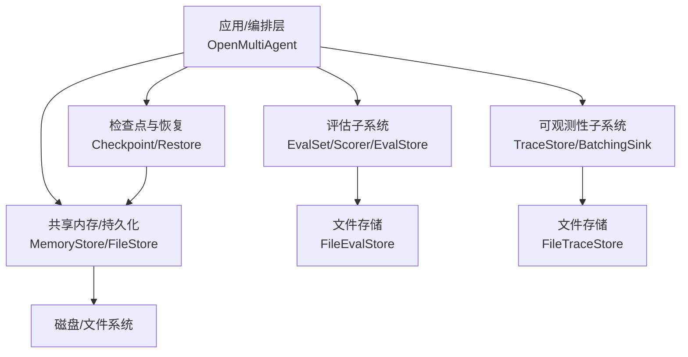
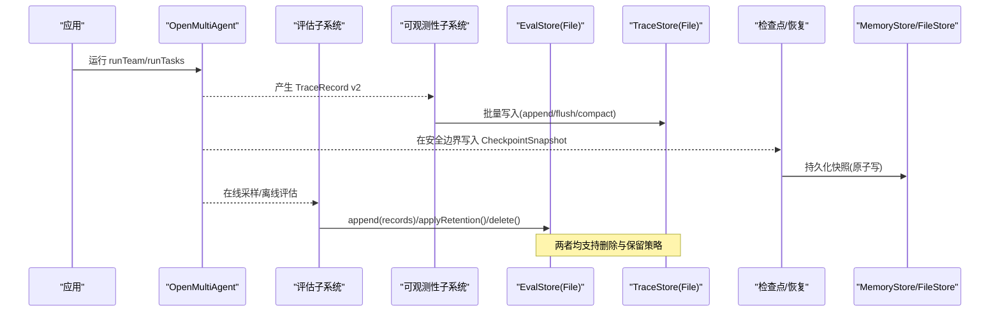
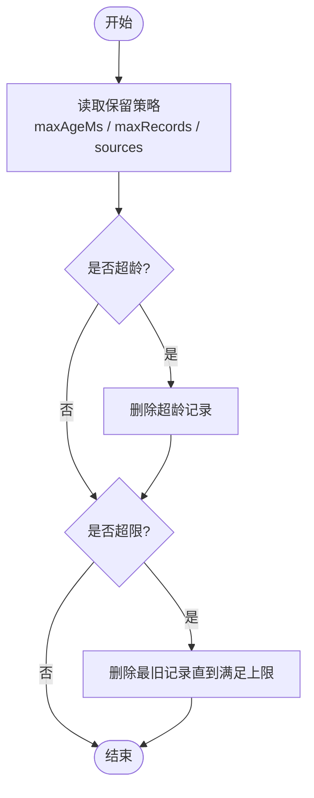
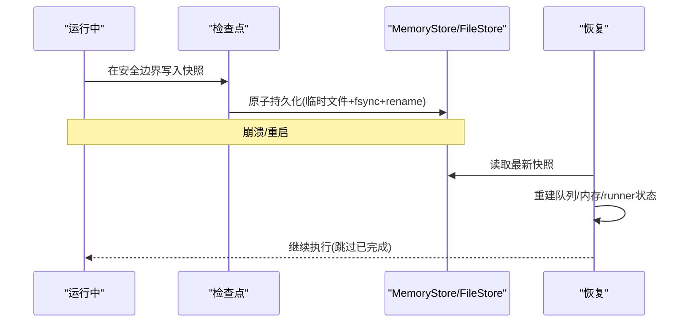
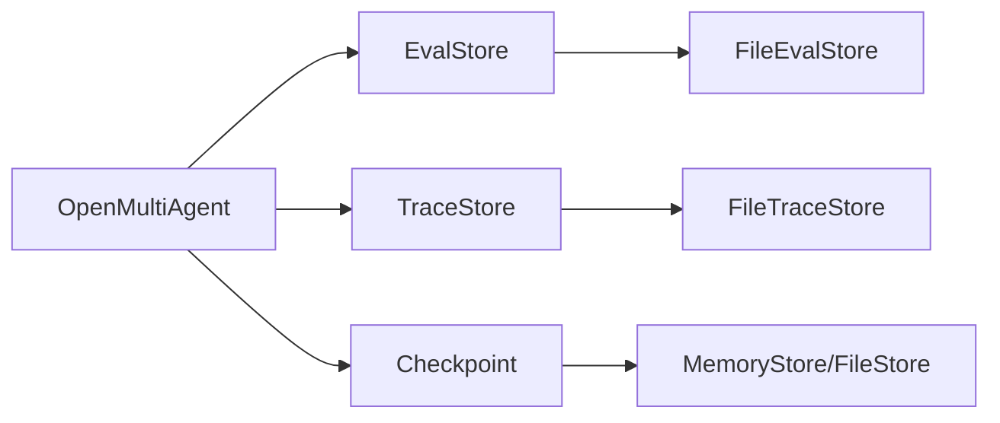

# 数据管理策略

<cite>
**本文引用的文件**
- [README.md](file://README.md)
- [evaluation.md](file://docs/evaluation.md)
- [checkpoint.md](file://docs/checkpoint.md)
- [durable-approvals.md](file://docs/durable-approvals.md)
- [observability.md](file://docs/observability.md)
- [shared-memory.md](file://docs/shared-memory.md)
- [cli.md](file://docs/cli.md)
- [package.json](file://package.json)
- [file-store.ts](file://packages/core/src/memory/file-store.ts)
- [types.ts](file://packages/core/src/types.ts)
</cite>

## 目录
1. [简介](#简介)
2. [项目结构](#项目结构)
3. [核心组件](#核心组件)
4. [架构总览](#架构总览)
5. [详细组件分析](#详细组件分析)
6. [依赖关系分析](#依赖关系分析)
7. [性能与容量规划](#性能与容量规划)
8. [故障排查指南](#故障排查指南)
9. [结论](#结论)
10. [附录](#附录)

## 简介
本文件围绕“评估数据的生命周期管理与维护策略”，系统阐述从数据采集、存储、保留清理、备份恢复，到迁移升级、容量规划与监控告警的全链路方案。内容基于仓库中的评估子系统（Eval）、可观测性子系统（TraceStore）、检查点与恢复（Checkpoint & Resume）、共享内存与持久化（MemoryStore/FileStore）以及命令行工具（CLI）等能力进行整合设计，确保在生产环境中实现安全、可控、可审计的数据治理。

## 项目结构
- 评估子系统：提供离线/在线采样、评分器、报告输出、质量门禁与 EvalStore 抽象（内存/文件）。
- 可观测性子系统：提供 TraceRecord v2、批处理导出、TraceStore（内存/文件）、删除与保留策略、运行查看器。
- 检查点与恢复：在任务边界写入快照，支持崩溃恢复、审批门控、工具调用恢复。
- 共享内存与持久化：通过 MemoryStore 接口统一键值存储；FileStore 提供原子落盘与进程内并发安全。
- CLI：用于运行团队任务、离线评估、生成运行查看器与 Provider 模板。

图表来源
- [evaluation.md:90-187](file://docs/evaluation.md#L90-L187)
- [observability.md:224-446](file://docs/observability.md#L224-L446)
- [checkpoint.md:11-107](file://docs/checkpoint.md#L11-L107)
- [file-store.ts:1-54](file://packages/core/src/memory/file-store.ts#L1-L54)

章节来源
- [README.md:46-144](file://README.md#L46-L144)
- [evaluation.md:1-800](file://docs/evaluation.md#L1-L800)
- [observability.md:1-768](file://docs/observability.md#L1-L768)
- [checkpoint.md:1-290](file://docs/checkpoint.md#L1-L290)
- [shared-memory.md:1-47](file://docs/shared-memory.md#L1-L47)
- [cli.md:1-444](file://docs/cli.md#L1-L444)
- [file-store.ts:1-54](file://packages/core/src/memory/file-store.ts#L1-L54)
- [types.ts:2349-2377](file://packages/core/src/types.ts#L2349-L2377)

## 核心组件
- 评估数据流
  - 定义 EvalSet/Scorer，执行 runEvalSet，产出 EvalRunReport。
  - 在线采样：OpenMultiAgent 配置 evaluation，异步入队并写入 EvalStore。
  - 存储：InMemoryEvalStore（短生命周期）、FileEvalStore（单进程 NDJSON 追加日志 + 索引重建）。
- 可观测性数据流
  - 通过 BatchingTraceSink 将 TraceRecord v2 批量导出到 TraceStoreExporter，最终写入 FileTraceStore。
  - 提供查询、删除、保留策略（按时间/数量/状态），以及运行查看器渲染。
- 检查点与恢复
  - 在安全边界写入 CheckpointSnapshot（v4），包含任务队列、共享内存、已完成结果、进行中 runner 状态、审批延续状态。
  - restore() 加载最新快照，重建队列与内存，跳过已完成任务，必要时重跑协调器综合。
- 共享内存与持久化
  - MemoryStore 抽象键值存储；FileStore 以原子写（临时文件+fsync+rename）保证一致性。
  - RedactingStore 可在写入时脱敏敏感字段。

章节来源
- [evaluation.md:90-187](file://docs/evaluation.md#L90-L187)
- [evaluation.md:287-383](file://docs/evaluation.md#L287-L383)
- [observability.md:185-229](file://docs/observability.md#L185-L229)
- [observability.md:224-446](file://docs/observability.md#L224-L446)
- [checkpoint.md:11-107](file://docs/checkpoint.md#L11-L107)
- [checkpoint.md:109-160](file://docs/checkpoint.md#L109-L160)
- [shared-memory.md:1-47](file://docs/shared-memory.md#L1-L47)
- [file-store.ts:1-54](file://packages/core/src/memory/file-store.ts#L1-L54)

## 架构总览
下图展示了评估数据与可观测性数据在系统中的流转、存储与清理路径，以及与检查点/恢复的关联。

图表来源
- [observability.md:224-446](file://docs/observability.md#L224-L446)
- [evaluation.md:287-383](file://docs/evaluation.md#L287-L383)
- [checkpoint.md:109-160](file://docs/checkpoint.md#L109-L160)
- [file-store.ts:1-54](file://packages/core/src/memory/file-store.ts#L1-L54)

## 详细组件分析

### 评估数据生命周期与保留策略
- 采集阶段
  - 离线：runEvalSet 串行执行样本，并行度受 concurrency 控制，聚合报告。
  - 在线：OpenMultiAgent.evaluation 配置 sample、maxConcurrent、maxQueueLength、budget、store，采样后异步入队，不阻塞业务结果。
- 存储与查询
  - InMemoryEvalStore：适合测试/本地短生命周期；支持 capacity 上限与 applyRetention。
  - FileEvalStore：NDJSON 追加日志，打开时重建内存索引；append 原子批次，flush 显式 fsync，compact 原子替换目标文件。
- 保留策略
  - 基于时间：applyRetention({ maxAgeMs }) 删除超过阈值的记录。
  - 基于数量：applyRetention({ maxRecords }) 限制最大记录数。
  - 来源过滤：sources 限定仅对特定来源（如 offline/online）生效。
  - 删除 API：delete({ evalRunId, before, after, scorer, source, status }) 支持范围删除。
- 一致性保障
  - 批次原子写入；幂等 recordId；关闭后操作返回结构化错误；compaction 使用临时文件+rename 保证可见性。

图表来源
- [evaluation.md:287-383](file://docs/evaluation.md#L287-L383)

章节来源
- [evaluation.md:90-187](file://docs/evaluation.md#L90-L187)
- [evaluation.md:287-383](file://docs/evaluation.md#L287-L383)

### 数据清理机制：批量删除、增量清理与一致性
- 批量删除
  - EvalStore：delete(...) 支持按评估运行、时间窗口、来源、评分器等维度批量删除。
  - TraceStore：deleteRun(runId)、delete(query) 支持按逻辑运行或查询条件批量删除。
- 增量清理
  - FileEvalStore.compact()：压缩为有效记录集合，移除已删除/保留清理的记录，原子替换目标文件。
  - FileTraceStore.compact()：同上，且保持查询结果不变。
- 一致性保证
  - 所有删除/保留操作以追加 tombstone 或原子替换方式实现，重启后不可复活已删除记录。
  - 关闭后任何写/删/压缩操作返回 CLOSED 错误；flush/close 幂等。

章节来源
- [evaluation.md:287-383](file://docs/evaluation.md#L287-L383)
- [observability.md:430-446](file://docs/observability.md#L430-L446)
- [observability.md:351-365](file://docs/observability.md#L351-L365)

### 数据备份与恢复流程：快照、增量与灾难恢复
- 快照创建
  - 检查点在安全边界（任务完成/进行中 runner 边界）写入 CheckpointSnapshot v4，包含执行身份、任务队列、共享内存、已完成结果、进行中 runner 状态、审批延续状态。
  - 共享内存与检查点可复用同一 store；若分开，则嵌入完整共享内存快照。
- 增量恢复
  - restore() 加载最新快照，重建队列与内存，跳过已完成任务；必要时重跑协调器综合。
  - 工具调用恢复：已提交结果回放，未提交保守重试；toolCallId 作为幂等键。
- 灾难恢复
  - 文件级原子写（临时文件+fsync+rename）避免半写；进程/机器崩溃最多丢失最后一个未完成批次。
  - 审批门控：请求与决策独立主记录，校验 requestHash，防止篡改；拒绝/批准语义明确。

图表来源
- [checkpoint.md:109-160](file://docs/checkpoint.md#L109-L160)
- [checkpoint.md:206-249](file://docs/checkpoint.md#L206-L249)
- [file-store.ts:1-54](file://packages/core/src/memory/file-store.ts#L1-L54)

章节来源
- [checkpoint.md:11-107](file://docs/checkpoint.md#L11-L107)
- [checkpoint.md:109-160](file://docs/checkpoint.md#L109-L160)
- [checkpoint.md:206-249](file://docs/checkpoint.md#L206-L249)
- [durable-approvals.md:30-143](file://docs/durable-approvals.md#L30-L143)

### 数据迁移与版本升级策略：向后兼容与转换规则
- 评估数据
  - EvalStore 支持 schema major 版本；未知字段在支持的 major 内保留；更高 major 拒绝降级。
  - 建议：升级前导出报告与基线，CI 对比阈值与回归检查。
- 可观测性数据
  - TraceRecord v2 与文件 envelope formatVersion/traceSchemaMajor 分离；恢复严格校验，不支持格式直接降级。
  - 迁移：通过 replay committed stream 到新数据库适配器；禁止跨进程共享单一文件路径。
- 检查点数据
  - v1/v2/v3 可读；v4 新增审批延续；restore 会递增 attempt 并链接 prior trace/root ID。
  - 冲突检测：restore 时 runId 冲突抛错，避免误合并。

章节来源
- [evaluation.md:378-383](file://docs/evaluation.md#L378-L383)
- [observability.md:297-323](file://docs/observability.md#L297-L323)
- [observability.md:385-411](file://docs/observability.md#L385-L411)
- [checkpoint.md:145-152](file://docs/checkpoint.md#L145-L152)

### 容量规划建议：存储估算、增长预测与扩展策略
- 存储估算
  - 评估记录：每条 EvalRecord 含评分、元数据、引用；批量写入 NDJSON，建议按评估集/来源分目录。
  - 追踪记录：每个 span 一条记录，批量写入；注意 batch size、record size 上限与队列大小。
- 增长预测
  - 在线采样率、并发、队列长度、预算（每分钟评估次数/每小时成本）决定写入速率。
  - 保留策略（maxAgeMs/maxRuns）决定长期占用空间。
- 扩展策略
  - 短期：增大队列与批大小、提高 flush/compact 频率。
  - 中期：引入数据库适配器替代文件存储，实现多进程/高并发与高级查询。
  - 长期：分层归档（热/温/冷），冷热分离与压缩归档。

章节来源
- [evaluation.md:140-249](file://docs/evaluation.md#L140-L249)
- [observability.md:572-600](file://docs/observability.md#L572-L600)
- [observability.md:366-376](file://docs/observability.md#L366-L376)

### 监控指标与告警配置指南
- 评估子系统
  - 指标：sampled、enqueued、completed、dropped、failed、storeFailed；getStats() 获取累计计数。
  - 告警：队列溢出、预算耗尽、store 失败、scorer_error 比例过高。
- 可观测性子系统
  - 指标：accepted/exported/retried/failed/dropped/queued 记录数与字节；last error code。
  - 告警：exporter 失败、超时、队列满导致丢弃、compaction 异常。
- 检查点与恢复
  - 指标：checkpoint_save_failed 事件；审批冲突（APPROVAL_CONFLICT）、陈旧决策（APPROVAL_STALE_DECISION）。
  - 告警：恢复失败、快照损坏、CAS 失败。

章节来源
- [evaluation.md:213-249](file://docs/evaluation.md#L213-L249)
- [observability.md:572-600](file://docs/observability.md#L572-L600)
- [durable-approvals.md:89-143](file://docs/durable-approvals.md#L89-L143)

## 依赖关系分析
- 组件耦合
  - OpenMultiAgent 同时驱动评估、可观测性与检查点；三者通过不同 Store 解耦。
  - FileStore 作为 MemoryStore 的实现，被检查点与共享内存复用。
  - FileEvalStore 与 FileTraceStore 各自维护 NDJSON 追加日志与索引，互不影响。
- 外部依赖
  - Node 内置 fs/promises、path；无第三方运行时依赖。
  - OTel 集成可选，位于独立包 @open-multi-agent/otel。

图表来源
- [evaluation.md:287-383](file://docs/evaluation.md#L287-L383)
- [observability.md:224-446](file://docs/observability.md#L224-L446)
- [checkpoint.md:109-160](file://docs/checkpoint.md#L109-L160)
- [file-store.ts:1-54](file://packages/core/src/memory/file-store.ts#L1-L54)

章节来源
- [package.json:1-34](file://package.json#L1-L34)
- [README.md:138-144](file://README.md#L138-L144)

## 性能与容量规划
- 性能特性
  - 在线评估默认保守：sample=0 关闭；maxConcurrent=1；maxQueueLength=100；payload 默认 none。
  - TraceSink 默认队列 2048 条、16 MiB；单记录上限 256 KiB；批大小 512；导出超时 30s；重试指数退避。
- 容量规划
  - 评估：按评估集/来源分目录；启用 compact 定期压缩；设置 maxRecords 与 maxAgeMs。
  - 追踪：合理设置 batch size、flush 周期；对大运行启用 compaction；按 runId 删除历史。
- 扩展策略
  - 文件存储适用于单进程；多进程/高并发场景应实现数据库适配器；迁移通过 replay committed stream。

章节来源
- [evaluation.md:213-249](file://docs/evaluation.md#L213-L249)
- [observability.md:572-600](file://docs/observability.md#L572-L600)
- [observability.md:366-376](file://docs/observability.md#L366-L376)

## 故障排查指南
- 常见问题
  - 评估存储失败：storeFailed 计数上升；检查 FileEvalStore 权限、磁盘空间、compact 临时文件。
  - 追踪导出失败：last error code 非空；检查 exporter 网络/超时、队列丢弃优先级。
  - 检查点写入失败：onProgress 出现 checkpoint_save_failed；确认 store 可用与 CAS 能力。
  - 审批冲突：APPROVAL_CONFLICT/APPROVAL_STALE_DECISION；核对 requestId/requestHash 与当前部署。
- 定位步骤
  - 使用 getStats() 与诊断信息缩小范围；查看最近一次 flush/close 是否成功；检查 compaction 是否产生 stale temp。
  - 对 TraceStore：使用 queryRuns 过滤状态/时间范围；对 EvalStore：使用 delete/query 验证数据可见性。

章节来源
- [evaluation.md:213-249](file://docs/evaluation.md#L213-L249)
- [observability.md:572-600](file://docs/observability.md#L572-L600)
- [checkpoint.md:154-160](file://docs/checkpoint.md#L154-L160)
- [durable-approvals.md:89-143](file://docs/durable-approvals.md#L89-L143)

## 结论
本策略以评估与可观测性为核心数据面，结合检查点与恢复、共享内存持久化，形成完整的生命周期闭环。通过明确的保留策略、批量/增量清理、原子写入与恢复、版本迁移与容量规划，以及完善的监控告警，确保系统在大规模生产环境下的可靠性、可维护性与可审计性。

## 附录
- 快速命令参考
  - 运行团队任务并生成运行查看器：oma run --goal ... --team ... --dashboard
  - 离线评估：oma eval run --set ... --target ... --report json/junit/markdown
  - 历史运行查看器：oma dashboard --trace-store ... --run-id ...
- 关键配置要点
  - 在线评估：evaluation.sample、maxConcurrent、maxQueueLength、budget、store、storePayloads
  - 追踪导出：BatchingTraceSink 参数、forceFlush/shutdown 生命周期
  - 检查点：checkpoint.store、coordinator 配置、RedactingStore 脱敏

章节来源
- [cli.md:31-175](file://docs/cli.md#L31-L175)
- [evaluation.md:140-249](file://docs/evaluation.md#L140-L249)
- [observability.md:527-570](file://docs/observability.md#L527-L570)
- [checkpoint.md:11-107](file://docs/checkpoint.md#L11-L107)
- [shared-memory.md:29-47](file://docs/shared-memory.md#L29-L47)