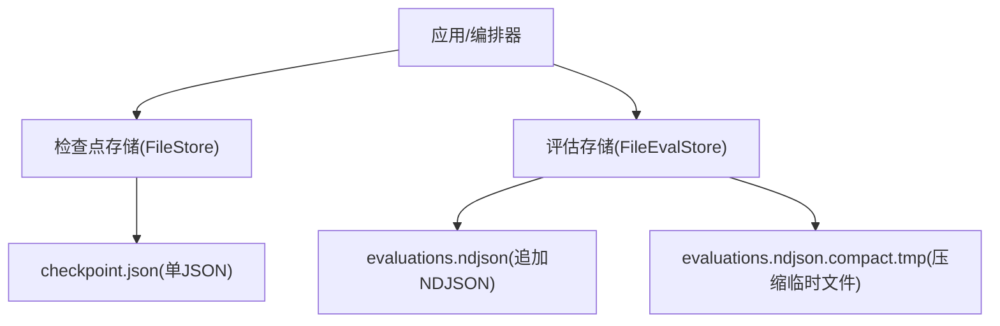
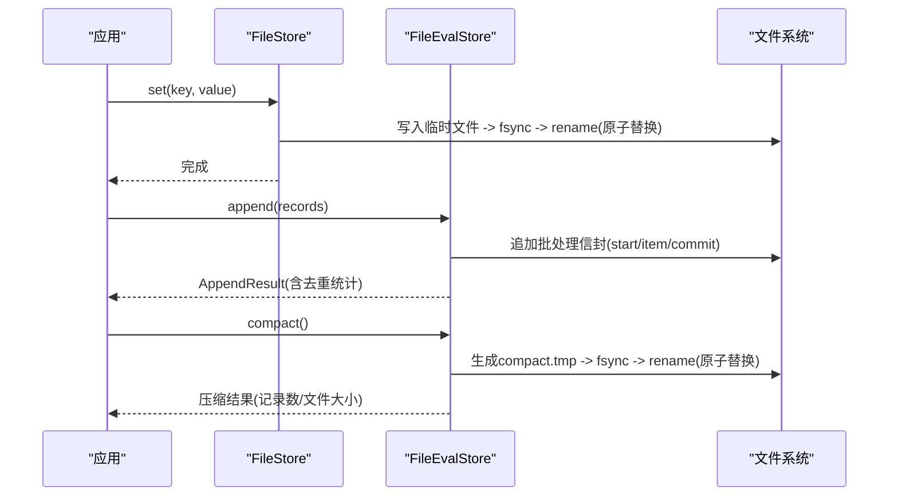
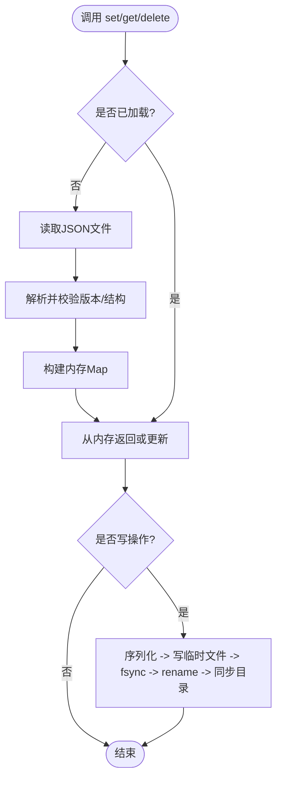
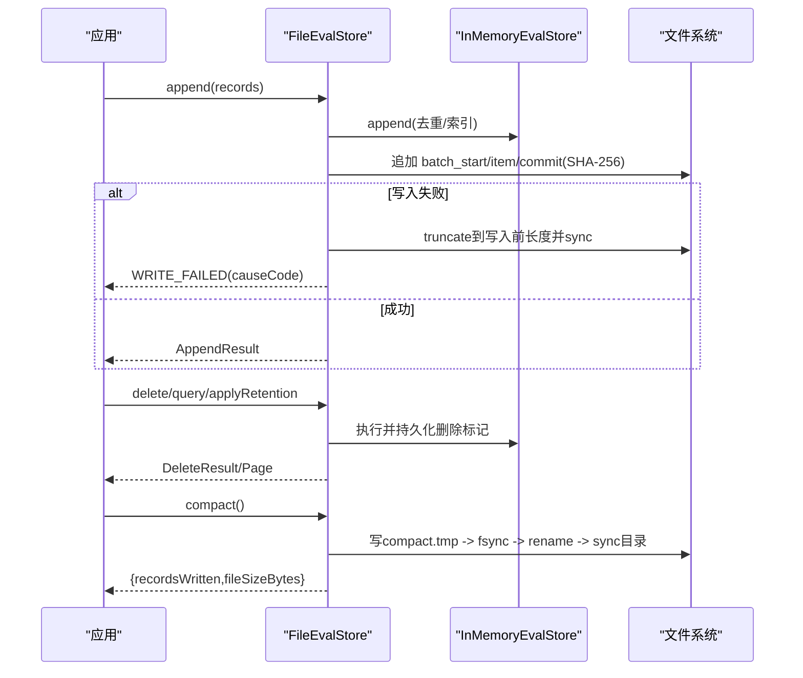
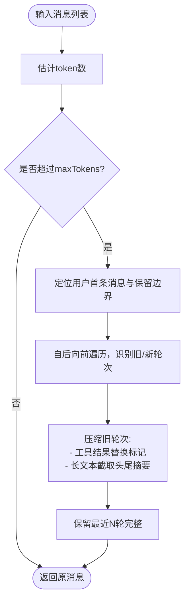
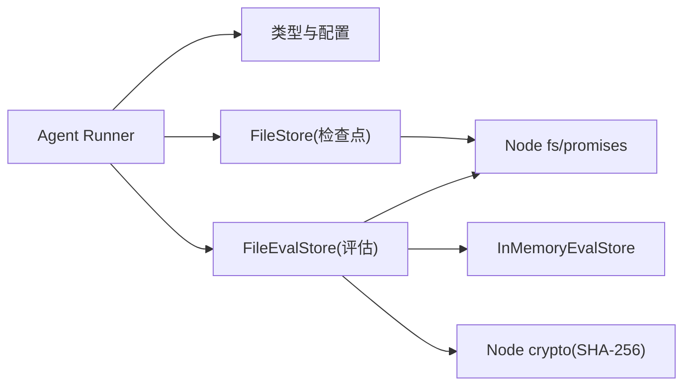

# 文件存储实现

<cite>
**本文引用的文件**
- [packages/core/src/memory/file-store.ts](file://packages/core/src/memory/file-store.ts)
- [packages/core/src/eval/file-store.ts](file://packages/core/src/eval/file-store.ts)
- [packages/core/tests/eval-file-store.test.ts](file://packages/core/tests/eval-file-store.test.ts)
- [packages/core/src/types.ts](file://packages/core/src/types.ts)
- [packages/core/src/agent/runner.ts](file://packages/core/src/agent/runner.ts)
- [README.md](file://README.md)
- [package.json](file://package.json)
</cite>

## 目录
1. [简介](#简介)
2. [项目结构](#项目结构)
3. [核心组件](#核心组件)
4. [架构总览](#架构总览)
5. [详细组件分析](#详细组件分析)
6. [依赖关系分析](#依赖关系分析)
7. [性能考量](#性能考量)
8. [故障排查指南](#故障排查指南)
9. [结论](#结论)
10. [附录：部署与配置示例](#附录部署与配置示例)

## 简介
本文件围绕仓库中的“文件存储后端”进行系统化说明，覆盖两类持久化实现：
- 基于单 JSON 文件的轻量级键值存储（用于检查点/共享内存快照）
- 基于追加式 NDJSON 的评估记录存储（用于可回放、可压缩、可清理的评估数据）

文档重点解释：
- 目录结构与文件格式规范
- 版本兼容性与模式校验
- 持久化策略：写入模式、事务边界、崩溃恢复
- 压缩算法选择与应用场景（上下文压缩与数据归档）
- 数据清理与归档策略（时间、容量、备份恢复）
- 性能调优建议（并发控制、缓存、索引）
- 部署配置与故障排查

## 项目结构
该仓库为多包 monorepo，文件存储相关代码集中在 core 包的 memory 与 eval 子模块中：
- memory/file-store.ts：单 JSON 文件的状态存储，面向检查点与共享内存快照
- eval/file-store.ts：追加式 NDJSON 文件存储，面向评估记录的持久化、查询、删除、保留策略与压缩
- tests/eval-file-store.test.ts：对评估文件存储的行为、格式、恢复与压缩进行严格测试
- types.ts、agent/runner.ts：提供上下文压缩策略与运行时选项，影响存储体积与回放质量

图表来源
- [packages/core/src/memory/file-store.ts:10-45](file://packages/core/src/memory/file-store.ts#L10-L45)
- [packages/core/src/eval/file-store.ts:1-10](file://packages/core/src/eval/file-store.ts#L1-L10)

章节来源
- [README.md:140-158](file://README.md#L140-L158)
- [package.json:1-34](file://package.json#L1-L34)

## 核心组件
- FileStore（memory）：单进程、单文件 JSON 状态存储。读路径走内存 Map，写路径原子替换目标文件，保证断电/崩溃一致性。
- FileEvalStore（eval）：单进程、追加式 NDJSON 存储。通过批处理信封（start/item/commit）+ SHA-256 校验确保幂等与可恢复；支持删除、保留策略、压缩重写、诊断信息输出。

章节来源
- [packages/core/src/memory/file-store.ts:10-45](file://packages/core/src/memory/file-store.ts#L10-L45)
- [packages/core/src/eval/file-store.ts:1-10](file://packages/core/src/eval/file-store.ts#L1-L10)

## 架构总览
两类存储均遵循“内存镜像 + 磁盘持久化”的模式，但侧重点不同：
- FileStore：适合小体量、频繁读写的键值快照（如检查点），强调原子写入与简单格式。
- FileEvalStore：适合大规模追加、需回放与清理的数据，强调追加顺序、事务性批处理、压缩与保留策略。

图表来源
- [packages/core/src/memory/file-store.ts:309-351](file://packages/core/src/memory/file-store.ts#L309-L351)
- [packages/core/src/eval/file-store.ts:327-413](file://packages/core/src/eval/file-store.ts#L327-L413)

## 详细组件分析

### 组件一：FileStore（检查点/共享内存快照）
- 设计要点
  - 单 JSON 文件承载全部条目，内存 Map 镜像，读取走内存，写入原子替换。
  - 写入流程：写同目录临时文件 -> fsync -> rename -> 可选目录 fsync。
  - 并发安全：进程内串行化写入链，避免竞态；跨进程无锁，不允许多写者。
  - 版本兼容：文件头包含 version，加载时校验版本，拒绝未知版本。
  - 错误处理：非法 JSON、缺失字段、非对象 metadata 会抛出明确错误，防止静默丢弃。

- 数据结构与复杂度
  - 存储结构：{ version, entries[] }，entries 按插入顺序保存。
  - 读写复杂度：get/list O(1)/O(n)，set/delete/clear 触发全量序列化与原子替换，I/O 成本与条目规模线性相关。

- 事务与崩溃恢复
  - 原子替换 + fsync 保证要么看到旧完整状态，要么看到新完整状态。
  - 首次打开若文件不存在视为空存储；若存在则必须合法 JSON 且版本匹配。

- 适用场景
  - 作为 checkpoint store 更合适；若用作 sharedMemoryStore，每次写入都会刷新整个文件，I/O 开销较大。

图表来源
- [packages/core/src/memory/file-store.ts:212-351](file://packages/core/src/memory/file-store.ts#L212-L351)

章节来源
- [packages/core/src/memory/file-store.ts:10-45](file://packages/core/src/memory/file-store.ts#L10-L45)
- [packages/core/src/memory/file-store.ts:55-74](file://packages/core/src/memory/file-store.ts#L55-L74)
- [packages/core/src/memory/file-store.ts:212-351](file://packages/core/src/memory/file-store.ts#L212-L351)

### 组件二：FileEvalStore（评估记录追加存储）
- 设计要点
  - 追加式 NDJSON，首行为文件头（format/formatVersion/evalSchemaMajor）。
  - 批处理信封：batch_start/batch_item/batch_commit，附带 payload 的 SHA-256 校验，确保中断恢复后要么完全重放，要么丢弃不完整批次。
  - 删除与保留：delete 记录删除标记；applyRetention 支持按时间与数量策略清理。
  - 压缩：compact 将当前有效记录重写为新文件（带文件头），移除已删除项，保持查询一致性与字节确定性。
  - 权限与安全：创建文件使用 0600 权限；Windows 平台发出最小权限未强制的诊断。
  - 诊断：支持 trailing_partial_line、incomplete_batch、stale_compaction_file、directory_sync_unsupported 等诊断。

- 数据结构与复杂度
  - 文件结构：header + 若干 batch 序列；内存维护 InMemoryEvalStore 以支持查询、去重、删除、保留。
  - 查询复杂度：基于内存索引，支持分页与游标；游标实例绑定，重启后失效。
  - 压缩复杂度：全量重建，I/O 成本与有效记录规模线性相关。

- 事务与崩溃恢复
  - 追加失败：尝试截断回滚到写入前大小；若回滚失败进入 RECOVERY_REQUIRED 状态。
  - 恢复：解析文件，仅提交完整且校验通过的批次；尾部不完整部分被丢弃并给出诊断。
  - 压缩失败：若 rename/sync 失败，保留原文件权威状态，抛出结构化错误。

图表来源
- [packages/core/src/eval/file-store.ts:327-413](file://packages/core/src/eval/file-store.ts#L327-L413)
- [packages/core/src/eval/file-store.ts:497-582](file://packages/core/src/eval/file-store.ts#L497-L582)
- [packages/core/src/eval/file-store.ts:584-685](file://packages/core/src/eval/file-store.ts#L584-L685)

章节来源
- [packages/core/src/eval/file-store.ts:1-10](file://packages/core/src/eval/file-store.ts#L1-L10)
- [packages/core/src/eval/file-store.ts:93-142](file://packages/core/src/eval/file-store.ts#L93-L142)
- [packages/core/src/eval/file-store.ts:252-317](file://packages/core/src/eval/file-store.ts#L252-L317)
- [packages/core/src/eval/file-store.ts:327-413](file://packages/core/src/eval/file-store.ts#L327-L413)
- [packages/core/src/eval/file-store.ts:497-582](file://packages/core/src/eval/file-store.ts#L497-L582)
- [packages/core/src/eval/file-store.ts:584-685](file://packages/core/src/eval/file-store.ts#L584-L685)
- [packages/core/tests/eval-file-store.test.ts:76-174](file://packages/core/tests/eval-file-store.test.ts#L76-L174)
- [packages/core/tests/eval-file-store.test.ts:214-329](file://packages/core/tests/eval-file-store.test.ts#L214-L329)

### 组件三：上下文压缩与文本截断（运行时）
- 作用范围
  - 针对长对话上下文进行选择性压缩，减少存储与传输成本，同时保留关键骨架（工具调用决策、最近轮次）。
- 策略要点
  - 工具结果块超过阈值时整体替换为短标记。
  - 助手文本块超过阈值时保留头尾摘要，控制在 minChars 以内。
  - 错误工具结果不压缩，保留近期轮次。
- 配置入口
  - AgentConfig 与 RunOptions 暴露 compressToolResults、compressReasoningText、preserveReasoningAsText 等开关与阈值。

图表来源
- [packages/core/src/agent/runner.ts:1566-1598](file://packages/core/src/agent/runner.ts#L1566-L1598)
- [packages/core/src/types.ts:1165-1185](file://packages/core/src/types.ts#L1165-L1185)

章节来源
- [packages/core/src/agent/runner.ts:1566-1598](file://packages/core/src/agent/runner.ts#L1566-L1598)
- [packages/core/src/types.ts:1165-1185](file://packages/core/src/types.ts#L1165-L1185)

## 依赖关系分析
- FileStore 依赖 Node 内置 fs/promises 与 path，零外部依赖，适合嵌入核心。
- FileEvalStore 依赖 Node crypto（SHA-256）、fs/promises，以及内部 InMemoryEvalStore 提供内存索引与查询能力。
- 运行时 runner 与 types 提供上下文压缩策略，间接影响存储体积与回放体验。

图表来源
- [packages/core/src/memory/file-store.ts:47-49](file://packages/core/src/memory/file-store.ts#L47-L49)
- [packages/core/src/eval/file-store.ts:10-21](file://packages/core/src/eval/file-store.ts#L10-L21)
- [packages/core/src/agent/runner.ts:165-177](file://packages/core/src/agent/runner.ts#L165-L177)

章节来源
- [packages/core/src/memory/file-store.ts:47-49](file://packages/core/src/memory/file-store.ts#L47-L49)
- [packages/core/src/eval/file-store.ts:10-21](file://packages/core/src/eval/file-store.ts#L10-L21)
- [packages/core/src/agent/runner.ts:165-177](file://packages/core/src/agent/runner.ts#L165-L177)

## 性能考量
- 写入模式
  - FileStore：全量原子替换，适合小规模状态；高频写入会导致 I/O 放大。
  - FileEvalStore：追加写入，天然适合高吞吐；定期 compact 回收删除与冗余，降低后续 I/O。
- 并发访问控制
  - 两者均为单进程写者；进程内通过 Promise 链串行化写入，避免竞争。
  - 多进程或多实例不得写入同一文件。
- 缓存策略
  - FileStore：内存 Map 镜像，读路径零 I/O。
  - FileEvalStore：内存索引支撑查询与分页；游标实例绑定，重启后无效。
- 索引优化
  - 评估存储通过内存索引实现高效过滤与排序；压缩后重建索引，保证查询一致性。
- 压缩与体积
  - 上下文压缩可减少长期对话的存储与传输成本；评估数据通过 compact 去除已删除项，提升回放效率。
- 持久化强度
  - 写入后 fsync 数据文件；compact 后 fsync 目录（平台不支持时降级为诊断）。

[本节为通用性能指导，不直接分析具体文件]

## 故障排查指南
- 常见错误码与含义
  - FileStore：JSON 非法、版本不匹配、字段缺失、metadata 非对象。
  - FileEvalStore：CORRUPT_FILE、UNSUPPORTED_FILE_FORMAT、UNSUPPORTED_EVAL_SCHEMA、WRITE_FAILED、SYNC_FAILED、CLOSE_FAILED、RENAME_FAILED、COMPACTION_FAILED、STALE_COMPACTION_FILE、CLOSED、RECOVERY_REQUIRED。
- 恢复步骤
  - 遇到 CORRUPT_FILE：检查文件头与行完整性；必要时移动或删除损坏文件后重建。
  - 遇到 STALE_COMPACTION_FILE：删除 .compact.tmp 后再打开。
  - 遇到 RECOVERY_REQUIRED：重新 open 以重建内存状态；若仍失败，检查磁盘空间与权限。
- 诊断信息
  - 启用 onDiagnostic 回调收集 trailing_partial_line、incomplete_batch、stale_compaction_file、directory_sync_unsupported 等诊断，辅助定位问题。
- 权限与平台差异
  - 非 Windows 平台默认 0600 权限；Windows 平台会发出 minimal_permissions_not_enforced 诊断，需通过系统访问控制保护文件。

章节来源
- [packages/core/tests/eval-file-store.test.ts:76-174](file://packages/core/tests/eval-file-store.test.ts#L76-L174)
- [packages/core/tests/eval-file-store.test.ts:214-329](file://packages/core/tests/eval-file-store.test.ts#L214-L329)
- [packages/core/src/eval/file-store.ts:35-80](file://packages/core/src/eval/file-store.ts#L35-L80)
- [packages/core/src/eval/file-store.ts:780-800](file://packages/core/src/eval/file-store.ts#L780-L800)

## 结论
- 两类文件存储分别满足“轻量快照”和“可回放数据”的需求：前者强调原子性与简单可靠，后者强调追加吞吐、事务性、压缩与清理。
- 通过版本校验、批处理校验与 fsync/rename 机制，系统在进程崩溃与断电场景下具备强一致性保障。
- 结合上下文压缩与评估数据 compact，可在长期运行中有效控制存储体积与回放性能。
- 生产部署应关注权限、平台差异、诊断信息与定期压缩策略，确保稳定性与可观测性。

[本节为总结性内容，不直接分析具体文件]

## 附录：部署与配置示例
- 检查点存储（FileStore）
  - 推荐作为 checkpoint store 使用，路径指向持久化目录；共享内存建议使用 InMemoryStore 以获得更低延迟。
  - 示例参考：在 orchestrator.runTasks 中传入 checkpoint.store = new FileStore('./.oma/checkpoint.json')。
- 评估存储（FileEvalStore）
  - 通过 FileEvalStore.open(path) 打开或创建文件；定期调用 compact() 回收删除与冗余。
  - 可通过 applyRetention({ maxAgeMs, maxRecords }) 实施时间与容量策略。
  - 通过 onDiagnostic 回调收集诊断信息，便于监控与告警。
- 上下文压缩
  - 在 AgentConfig/RunOptions 中设置 compressToolResults、compressReasoningText、preserveReasoningAsText 等参数，平衡体积与可读性。
- 平台与权限
  - 非 Windows 平台自动设置 0600 权限；Windows 平台需通过系统访问控制保护文件。
  - 目录 fsync 在某些平台不被支持，会降级为诊断而非错误。

章节来源
- [packages/core/src/memory/file-store.ts:19-45](file://packages/core/src/memory/file-store.ts#L19-L45)
- [packages/core/src/eval/file-store.ts:275-317](file://packages/core/src/eval/file-store.ts#L275-L317)
- [packages/core/src/eval/file-store.ts:357-364](file://packages/core/src/eval/file-store.ts#L357-L364)
- [packages/core/src/agent/runner.ts:165-177](file://packages/core/src/agent/runner.ts#L165-L177)
- [packages/core/src/types.ts:1165-1185](file://packages/core/src/types.ts#L1165-L1185)