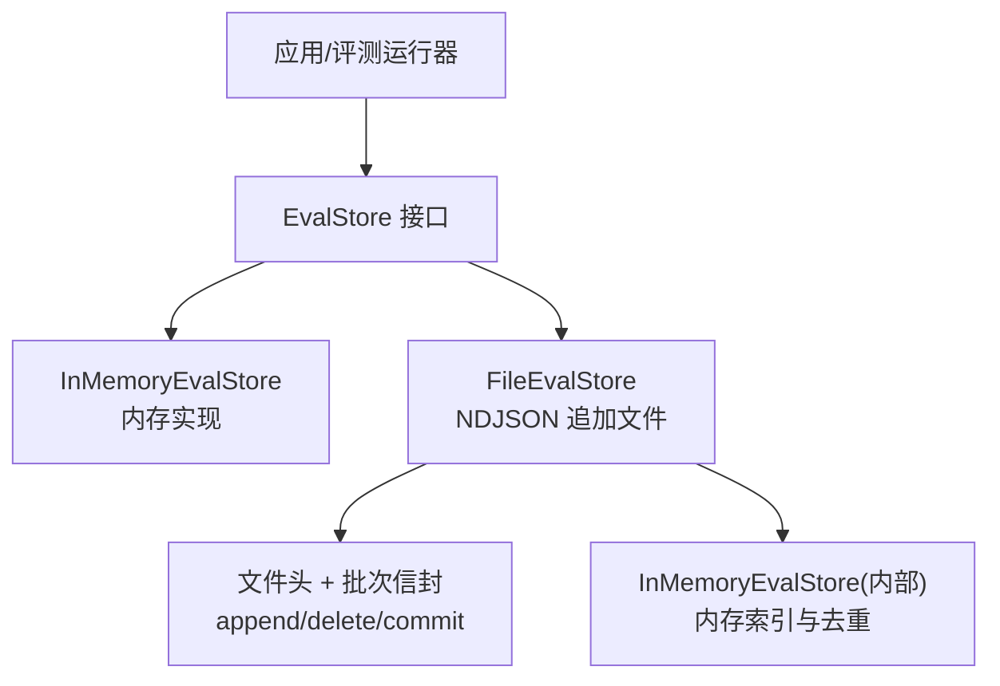
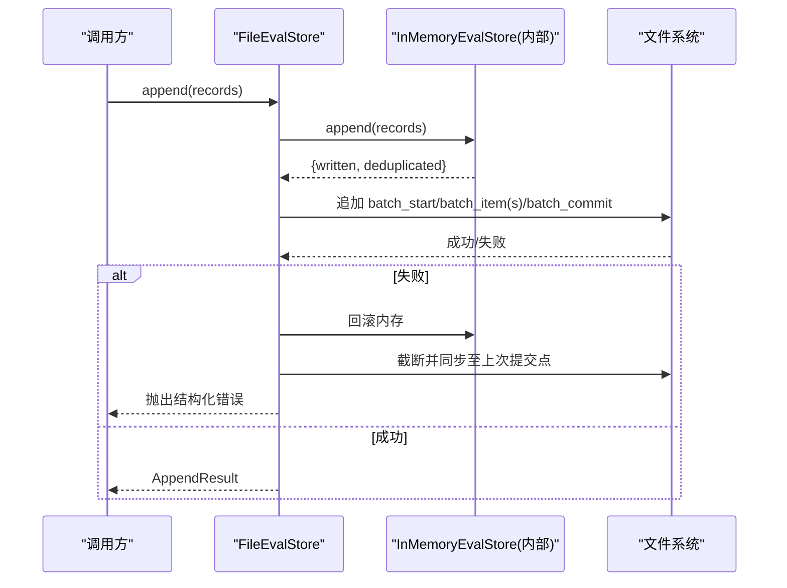
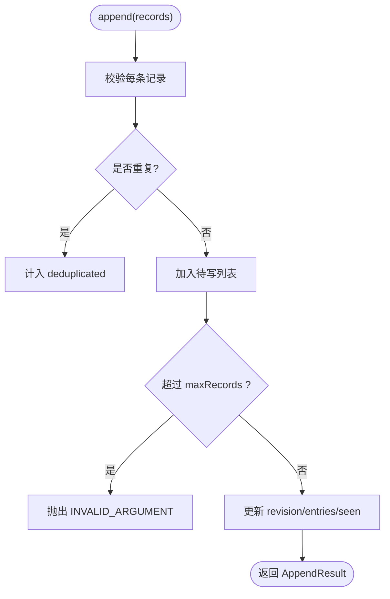
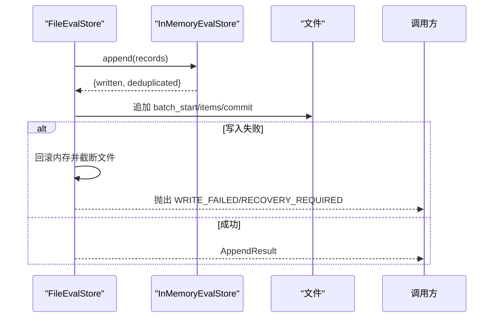
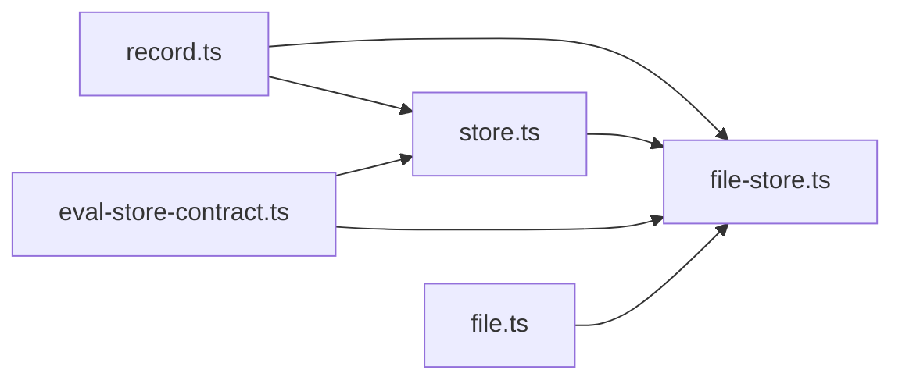

# 评估存储

<cite>
**本文引用的文件**
- [store.ts](file://packages/core/src/eval/store.ts)
- [file-store.ts](file://packages/core/src/eval/file-store.ts)
- [record.ts](file://packages/core/src/eval/record.ts)
- [file.ts](file://packages/core/src/eval/file.ts)
- [eval-store-contract.ts](file://packages/core/tests/eval-store-contract.ts)
- [eval-file-store.test.ts](file://packages/core/tests/eval-file-store.test.ts)
</cite>

## 目录
1. [简介](#简介)
2. [项目结构](#项目结构)
3. [核心组件](#核心组件)
4. [架构总览](#架构总览)
5. [详细组件分析](#详细组件分析)
6. [依赖关系分析](#依赖关系分析)
7. [性能与容量管理](#性能与容量管理)
8. [故障排查指南](#故障排查指南)
9. [结论](#结论)
10. [附录：自定义存储后端开发指南](#附录自定义存储后端开发指南)

## 简介
本文件系统面向“评估数据存储”的设计与实现，围绕 EvalStore 接口及其两种参考实现 InMemoryEvalStore（内存）与 FileEvalStore（基于追加模式的 NDJSON 文件）展开。文档涵盖：
- 接口定义与实现要求
- 查询语法、分页与游标机制
- 持久化策略：追加模式、压缩、清理与恢复
- 容量管理与保留策略、删除操作
- 自定义存储后端的开发与集成要点

## 项目结构
评估存储相关代码位于 packages/core/src/eval 下，测试位于 packages/core/tests。关键文件职责如下：
- store.ts：定义 EvalStore 接口、查询/删除/保留策略类型、InMemoryEvalStore 实现及通用校验逻辑
- file-store.ts：FileEvalStore 实现，基于追加 NDJSON 的持久化、恢复、压缩等
- record.ts：评估记录的数据模型与 schema 版本常量
- file.ts：导出文件存储能力，并提供报告加载/写入等工具
- eval-store-contract.ts：跨实现的契约测试套件，覆盖查询、分页、游标、删除、保留策略等
- eval-file-store.test.ts：针对 FileEvalStore 的文件格式、恢复、生命周期与错误处理测试

图表来源
- [store.ts:57-64](file://packages/core/src/eval/store.ts#L57-L64)
- [file-store.ts:252-317](file://packages/core/src/eval/file-store.ts#L252-L317)

章节来源
- [store.ts:1-627](file://packages/core/src/eval/store.ts#L1-L627)
- [file-store.ts:1-840](file://packages/core/src/eval/file-store.ts#L1-L840)
- [record.ts:1-50](file://packages/core/src/eval/record.ts#L1-L50)
- [file.ts:1-402](file://packages/core/src/eval/file.ts#L1-L402)
- [eval-store-contract.ts:1-283](file://packages/core/tests/eval-store-contract.ts#L1-L283)
- [eval-file-store.test.ts:1-353](file://packages/core/tests/eval-file-store.test.ts#L1-L353)

## 核心组件
- EvalStore 接口：统一 append/query/delete/applyRetention 四元组 API，返回 AppendResult/DeleteResult/Page
- EvalRecord：评估结果记录的数据模型，包含评分、状态、引用、用量、错误、负载等字段
- InMemoryEvalStore：进程内内存实现，支持容量上限、时间排序、分页与游标、删除与保留策略
- FileEvalStore：基于追加 NDJSON 的持久化实现，提供原子批处理、崩溃恢复、压缩、诊断信息

章节来源
- [store.ts:57-64](file://packages/core/src/eval/store.ts#L57-L64)
- [record.ts:8-49](file://packages/core/src/eval/record.ts#L8-L49)
- [store.ts:407-627](file://packages/core/src/eval/store.ts#L407-L627)
- [file-store.ts:252-450](file://packages/core/src/eval/file-store.ts#L252-L450)

## 架构总览
评估数据流遵循“先写内存、再落盘”的模式：
- 写入：调用 append 时，先在内存中完成去重与插入，随后以“批次信封”形式追加到文件；失败时回滚内存与文件
- 读取：query 直接对内存中的索引进行过滤、排序、分页与游标定位
- 删除/保留：在内存中执行删除，并持久化为 delete 类型的批条目
- 压缩：将当前内存快照重写为新的 NDJSON 文件，原子替换原文件，减少体积并提升后续恢复速度

图表来源
- [file-store.ts:327-341](file://packages/core/src/eval/file-store.ts#L327-L341)
- [file-store.ts:497-535](file://packages/core/src/eval/file-store.ts#L497-L535)
- [file-store.ts:554-565](file://packages/core/src/eval/file-store.ts#L554-L565)

章节来源
- [file-store.ts:327-450](file://packages/core/src/eval/file-store.ts#L327-L450)
- [file-store.ts:497-565](file://packages/core/src/eval/file-store.ts#L497-L565)

## 详细组件分析

### EvalStore 接口与数据模型
- 接口方法
  - append：批量写入，按 recordId 去重，幂等语义
  - query：支持多维过滤、时间范围、排序、分页与游标
  - delete：按 evalRunId、evalSetName、before 等维度删除
  - applyRetention：按 maxAgeMs、maxRecords、sources 组合策略清理
- 数据模型
  - EvalRecord：schemaVersion=1，包含 scorer、status、score/pass/reason、runRef、metadata、usage、error、payload 等
  - 查询参数 EvalQuery/EvalDeleteQuery/EvalRetentionPolicy：严格校验，非法输入抛出 EvalStoreError

章节来源
- [store.ts:27-64](file://packages/core/src/eval/store.ts#L27-L64)
- [store.ts:194-287](file://packages/core/src/eval/store.ts#L194-L287)
- [store.ts:333-395](file://packages/core/src/eval/store.ts#L333-L395)
- [record.ts:8-49](file://packages/core/src/eval/record.ts#L8-L49)

### InMemoryEvalStore 设计与使用
- 配置选项
  - maxRecords：硬容量上限，超出则拒绝整批写入
  - now：可注入的时间源，仅用于保留策略计算
- 查询与分页
  - 支持 evalRunId/runId/evalSetName/scorer/source/status/after/border/order/limit/cursor
  - 默认 limit=100，最大 1000；time_asc/time_desc 稳定排序（时间相同按 recordId）
  - 游标包含 snapshotRevision、deleteEpoch、queryFingerprint、timestampUnixMs、recordId，带签名防篡改
- 删除与保留
  - delete：按条件匹配并按时间升序删除
  - applyRetention：支持按年龄、数量、来源筛选；顺序确定且幂等
- 内部细节
  - 维护 entries[]、seen Map、revision、arrival、deleteEpoch
  - 通过 EVAL_STORE_INTERNALS 暴露 records() 与 deleteRecordIds() 给 FileEvalStore 使用

图表来源
- [store.ts:431-462](file://packages/core/src/eval/store.ts#L431-L462)
- [store.ts:464-509](file://packages/core/src/eval/store.ts#L464-L509)
- [store.ts:579-627](file://packages/core/src/eval/store.ts#L579-L627)

章节来源
- [store.ts:66-71](file://packages/core/src/eval/store.ts#L66-L71)
- [store.ts:407-627](file://packages/core/src/eval/store.ts#L407-L627)
- [eval-store-contract.ts:62-283](file://packages/core/tests/eval-store-contract.ts#L62-L283)

### FileEvalStore 设计与使用
- 文件格式
  - 首行文件头：type/format/formatVersion/evalSchemaMajor
  - 后续为批次信封：batch_start → 若干 batch_item → batch_commit，含 payloadSha256 校验
- 打开与恢复
  - open：若目标不存在则创建；解析文件重建内存索引；自动修复尾部不完整批次
  - 遇到不兼容格式或 schema 版本会抛出结构化错误
- 写入与回滚
  - append：先写内存，再追加批次；失败时回滚内存并截断文件至上次提交偏移
- 删除与保留
  - delete/applyRetention：在内存中执行，并以 delete 类型批条目持久化
- 压缩
  - compact：将当前内存快照写入临时文件，fsync 后原子 rename 覆盖原文件；失败保留原文件
- 生命周期
  - flush：对目标文件 fsync
  - close：幂等关闭，确保最终同步；失败进入需恢复状态
- 诊断
  - onDiagnostic：输出 trailing_partial_line、incomplete_batch、stale_compaction_file、directory_sync_unsupported、minimal_permissions_not_enforced 等

图表来源
- [file-store.ts:327-341](file://packages/core/src/eval/file-store.ts#L327-L341)
- [file-store.ts:497-535](file://packages/core/src/eval/file-store.ts#L497-L535)
- [file-store.ts:554-565](file://packages/core/src/eval/file-store.ts#L554-L565)

章节来源
- [file-store.ts:82-91](file://packages/core/src/eval/file-store.ts#L82-L91)
- [file-store.ts:137-160](file://packages/core/src/eval/file-store.ts#L137-L160)
- [file-store.ts:275-317](file://packages/core/src/eval/file-store.ts#L275-L317)
- [file-store.ts:366-413](file://packages/core/src/eval/file-store.ts#L366-L413)
- [file-store.ts:584-685](file://packages/core/src/eval/file-store.ts#L584-L685)
- [file-store.ts:737-773](file://packages/core/src/eval/file-store.ts#L737-L773)

### 查询语法、分页与游标
- 查询字段
  - evalRunId/runId/evalSetName/scorer/source/status/after/before/order/limit/cursor
- 行为
  - 默认 order=time_desc，limit=100，最大 1000
  - after/before 为 ISO-8601 时间戳，after < before
  - 游标绑定查询指纹、删除纪元与快照版本，跨实例/重启无效
- 分页
  - 返回 nextCursor；当 items.length < limit 时无 nextCursor
  - 同一时间戳下的顺序由 recordId 稳定排序

章节来源
- [store.ts:27-42](file://packages/core/src/eval/store.ts#L27-L42)
- [store.ts:333-395](file://packages/core/src/eval/store.ts#L333-L395)
- [store.ts:464-509](file://packages/core/src/eval/store.ts#L464-L509)
- [eval-store-contract.ts:147-202](file://packages/core/tests/eval-store-contract.ts#L147-L202)

### 持久化策略：追加、压缩、清理与恢复
- 追加模式
  - 所有变更以“批次信封”追加，保证单条记录的原子性与完整性
  - 通过 payloadSha256 校验避免部分写入被误接受
- 压缩
  - compact 将内存快照重写为紧凑 NDJSON，原子替换原文件，减小体积并加速恢复
- 清理
  - delete：显式删除
  - applyRetention：按 age/records/sources 策略定期清理
- 恢复
  - open 时解析文件，忽略未提交的尾部批次，必要时截断至 lastCommittedOffset
  - 遇到损坏或不兼容格式抛出结构化错误

章节来源
- [file-store.ts:212-236](file://packages/core/src/eval/file-store.ts#L212-L236)
- [file-store.ts:371-413](file://packages/core/src/eval/file-store.ts#L371-L413)
- [file-store.ts:584-685](file://packages/core/src/eval/file-store.ts#L584-L685)
- [file-store.ts:737-773](file://packages/core/src/eval/file-store.ts#L737-L773)

### 容量管理与保留策略、删除操作
- 容量管理
  - InMemoryEvalStore.maxRecords：超过阈值拒绝整批写入
- 保留策略
  - maxAgeMs：删除早于阈值的记录
  - maxRecords：保留最近 N 条，其余删除
  - sources：限定作用域
  - 三者可组合，顺序确定且幂等
- 删除
  - delete：按 evalRunId/evalSetName/before 组合删除
  - 返回 runsDeleted/recordsDeleted/runIds，便于审计

章节来源
- [store.ts:66-71](file://packages/core/src/eval/store.ts#L66-L71)
- [store.ts:51-55](file://packages/core/src/eval/store.ts#L51-L55)
- [store.ts:529-565](file://packages/core/src/eval/store.ts#L529-L565)
- [eval-store-contract.ts:221-263](file://packages/core/tests/eval-store-contract.ts#L221-L263)

## 依赖关系分析
- 模块耦合
  - FileEvalStore 依赖 InMemoryEvalStore 作为内存索引与去重中心
  - 两者共享 EvalRecord 数据模型与通用校验逻辑
  - 测试通过契约套件验证不同实现的等价行为
- 外部依赖
  - Node.js 文件系统 API（fs/promises）
  - Zod（在 file.ts 中用于报告/策略 JSON 校验）

图表来源
- [store.ts:1-627](file://packages/core/src/eval/store.ts#L1-L627)
- [file-store.ts:1-840](file://packages/core/src/eval/file-store.ts#L1-L840)
- [record.ts:1-50](file://packages/core/src/eval/record.ts#L1-L50)
- [eval-store-contract.ts:1-283](file://packages/core/tests/eval-store-contract.ts#L1-L283)
- [file.ts:1-402](file://packages/core/src/eval/file.ts#L1-L402)

章节来源
- [store.ts:1-627](file://packages/core/src/eval/store.ts#L1-L627)
- [file-store.ts:1-840](file://packages/core/src/eval/file-store.ts#L1-L840)
- [eval-store-contract.ts:1-283](file://packages/core/tests/eval-store-contract.ts#L1-L283)

## 性能与容量管理
- 写入路径
  - 内存 O(1) 去重与插入；文件追加 I/O 为顺序写，适合高吞吐
  - 失败时回滚到上次提交偏移，避免脏数据
- 查询路径
  - 内存过滤+排序，时间复杂度近似 O(N log N)，N 为匹配集大小
  - 游标避免全量扫描，支持高效分页
- 压缩
  - 降低文件大小，提高恢复速度与查询效率
- 容量控制
  - InMemoryEvalStore 的 maxRecords 防止内存膨胀
  - 建议配合定期 applyRetention 与 compact 保持健康

[本节为通用指导，无需特定文件来源]

## 故障排查指南
- 常见错误码
  - EvalStoreError：INVALID_ARGUMENT、INVALID_CURSOR、UNSUPPORTED_SCHEMA_VERSION
  - FileEvalStoreError：WRITE_FAILED、SYNC_FAILED、CORRUPT_FILE、STALE_COMPACTION_FILE、RENAME_FAILED、COMPACTION_FAILED、CLOSED、RECOVERY_REQUIRED
- 典型问题
  - 游标失效：查询指纹变化、删除导致游标位置不可用、跨实例/重启无效
  - 文件损坏：非完整批次、未知信封类型、空行、头部缺失
  - 权限/平台差异：Windows 不支持 0600 权限；目录 fsync 可能不受支持
- 诊断信息
  - onDiagnostic 回调输出警告：trailing_partial_line、incomplete_batch、stale_compaction_file、directory_sync_unsupported、minimal_permissions_not_enforced

章节来源
- [store.ts:9-25](file://packages/core/src/eval/store.ts#L9-L25)
- [store.ts:602-627](file://packages/core/src/eval/store.ts#L602-L627)
- [file-store.ts:35-80](file://packages/core/src/eval/file-store.ts#L35-L80)
- [file-store.ts:666-685](file://packages/core/src/eval/file-store.ts#L666-L685)
- [eval-file-store.test.ts:214-329](file://packages/core/tests/eval-file-store.test.ts#L214-L329)

## 结论
该评估存储系统通过统一的 EvalStore 接口抽象了不同介质上的评估数据存取，提供了强一致性的内存实现与具备崩溃恢复能力的文件实现。其设计强调：
- 明确的查询与分页语义、健壮的游标机制
- 追加模式与批次校验带来的可靠性
- 灵活的保留策略与压缩能力
- 完善的错误分类与诊断信息
这些特性使其适用于离线与在线评测场景，并可扩展至更多后端。

[本节为总结性内容，无需特定文件来源]

## 附录：自定义存储后端开发指南
- 实现要求
  - 实现 EvalStore 接口的 append/query/delete/applyRetention
  - 遵循 EvalRecord 数据模型与 schemaVersion 约束
  - 正确处理查询参数校验与错误码（EvalStoreError）
  - 支持分页与游标：游标应绑定查询指纹、删除纪元与快照版本，并在删除/重启后失效
  - 幂等写入：按 recordId 去重，重复写入不计入 written
- 推荐实践
  - 使用事务或批处理保证原子性
  - 为查询建立索引以提升过滤与排序性能
  - 实现保留策略与删除操作的幂等性
  - 提供诊断与监控指标（如写入延迟、错误率）
- 集成示例思路
  - 在评测运行器中通过工厂函数创建 EvalStore 实例
  - 使用契约测试套件验证新实现的行为一致性
  - 结合 FileEvalStore 的 onDiagnostic 模式，为后端增加诊断回调

章节来源
- [store.ts:57-64](file://packages/core/src/eval/store.ts#L57-L64)
- [store.ts:194-287](file://packages/core/src/eval/store.ts#L194-L287)
- [eval-store-contract.ts:62-283](file://packages/core/tests/eval-store-contract.ts#L62-L283)