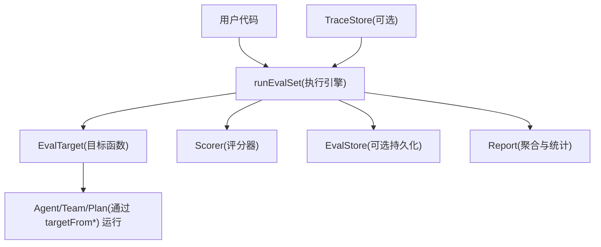
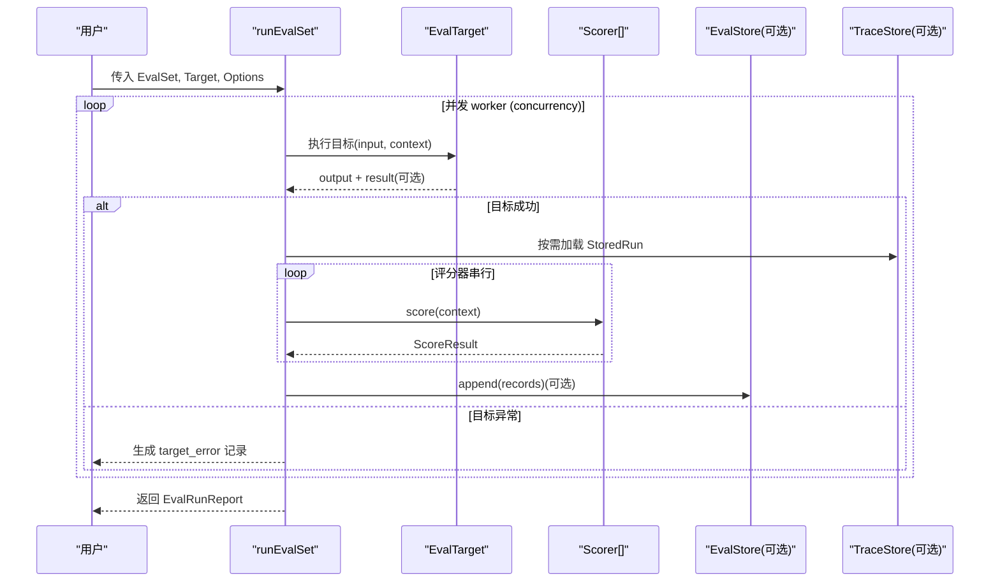
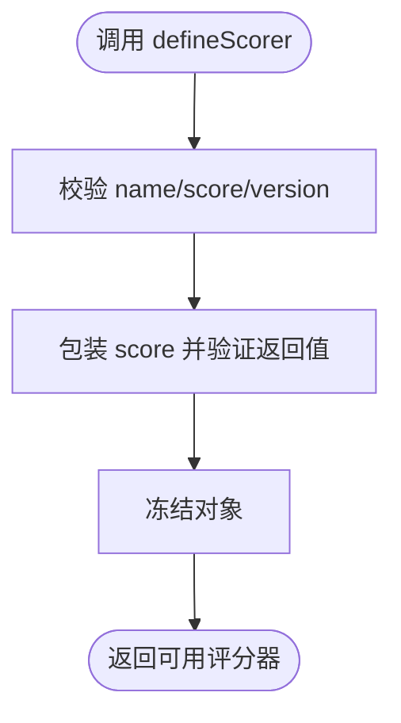
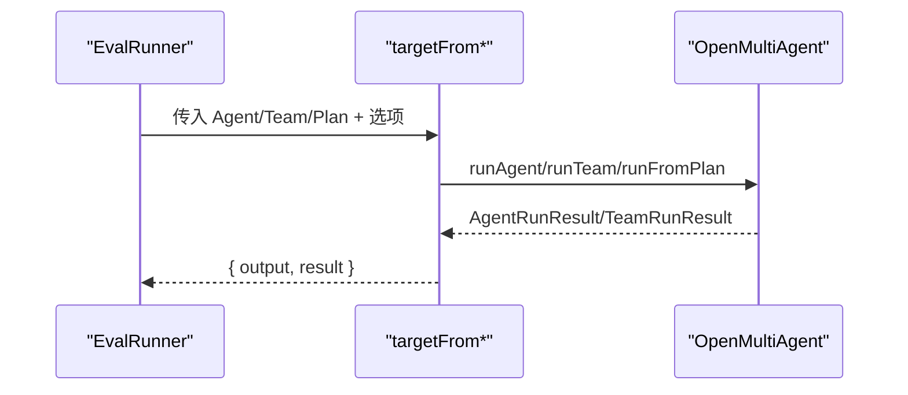
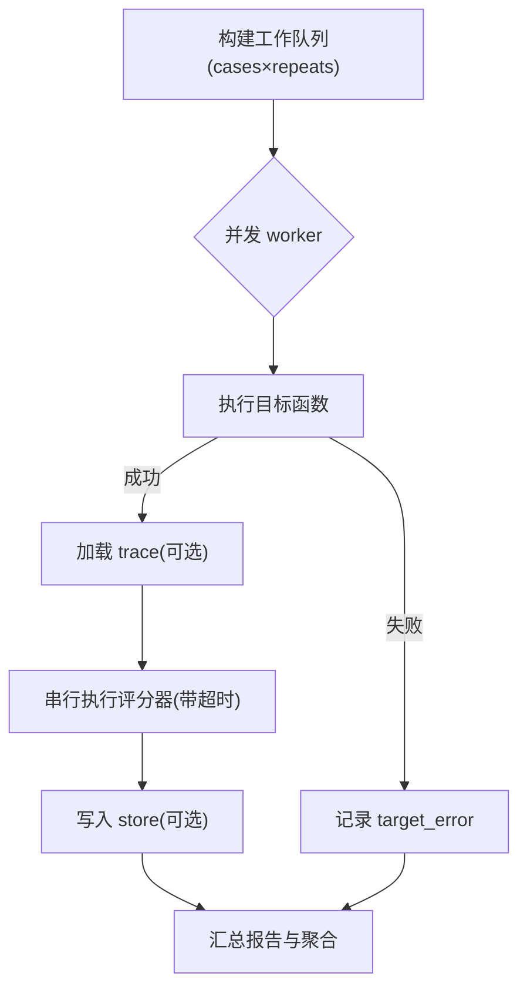
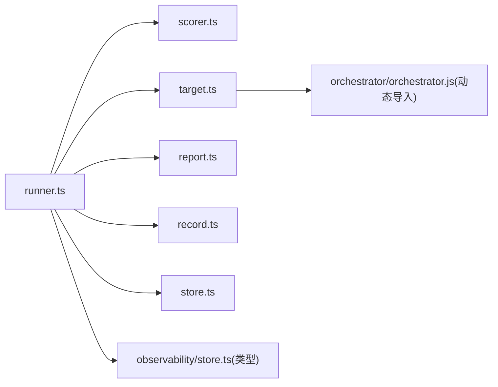
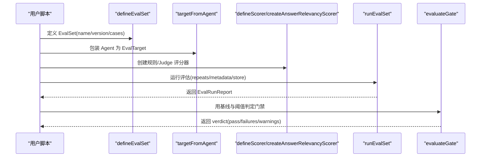

# 评估框架

<cite>
**本文引用的文件**
- [evaluation.md](file://docs/evaluation.md)
- [evalset.ts](file://packages/core/src/eval/evalset.ts)
- [evalcase.ts](file://packages/core/src/eval/evalcase.ts)
- [scorer.ts](file://packages/core/src/eval/scorer.ts)
- [target.ts](file://packages/core/src/eval/target.ts)
- [runner.ts](file://packages/core/src/eval/runner.ts)
- [index.ts](file://packages/core/src/eval/index.ts)
- [eval-offline-regression.ts](file://packages/core/examples/patterns/eval-offline-regression.ts)
</cite>

## 目录
1. [简介](#简介)
2. [项目结构](#项目结构)
3. [核心组件](#核心组件)
4. [架构总览](#架构总览)
5. [详细组件分析](#详细组件分析)
6. [依赖关系分析](#依赖关系分析)
7. [性能与并发](#性能与并发)
8. [故障排查指南](#故障排查指南)
9. [结论](#结论)
10. [附录：快速开始示例](#附录快速开始示例)

## 简介
本文件系统化介绍 Open Multi-Agent 的评估框架，覆盖 EvalSet 定义、测试用例编写、断言方法（评分器）、测试数据准备、自定义目标函数包装（Agent/Team/Plan）、评估执行流程（并发控制、重试/超时、元数据与持久化），以及错误处理、性能优化与最佳实践。文档同时提供从零到一的完整快速开始路径，帮助读者在离线或在线采样场景下稳定地度量 Agent、Team 与 Plan 的质量。

## 项目结构
评估能力集中在 core 包的 eval 子路径，并通过统一入口对外暴露类型与函数。关键目录与职责如下：
- evalset.ts：EvalSet 的定义、校验与冻结
- evalcase.ts：单个测试用例的数据结构
- scorer.ts：评分器定义、结果校验与成本输入附加
- target.ts：将 Agent/Team/Plan 包装为可评估的目标函数
- runner.ts：评估执行引擎（并发、串行评分、元数据、持久化）
- index.ts：对外导出 API 集合
- file-store.ts / store.ts：存储抽象与内存实现
- report.ts / record.ts：报告聚合与记录结构
- gate.ts：质量门禁判定逻辑
- online.ts：在线采样配置与生命周期



图表来源
- [runner.ts:368-452](file://packages/core/src/eval/runner.ts#L368-L452)
- [target.ts:84-133](file://packages/core/src/eval/target.ts#L84-L133)
- [scorer.ts:133-168](file://packages/core/src/eval/scorer.ts#L133-L168)
- [index.ts:1-60](file://packages/core/src/eval/index.ts#L1-L60)

章节来源
- [index.ts:1-60](file://packages/core/src/eval/index.ts#L1-L60)

## 核心组件
- EvalSet：版本化的评估集，包含用例列表、默认重复次数与并发度，支持标签过滤与元数据。
- EvalCase：单条用例，含输入、期望输出、标签与元数据。
- Scorer：评分器，接收上下文并返回归一化分数（0~1），支持可选 pass、reason、details；失败以异常上报而非零分。
- EvalTarget：评估目标函数，封装对 Agent/Team/Plan 的调用，产出输出与可选的运行结果用于追踪与用量统计。
- Runner：执行引擎，负责并发调度、串行评分、元数据合并、持久化、中止信号与进度事件。
- Store：评估记录存储接口与内存实现，支持追加、查询、删除与保留策略。
- Gate：基于报告的门禁判定，支持阈值、基线对比与健康检查。

章节来源
- [evalset.ts:22-64](file://packages/core/src/eval/evalset.ts#L22-L64)
- [evalcase.ts:1-11](file://packages/core/src/eval/evalcase.ts#L1-L11)
- [scorer.ts:12-37](file://packages/core/src/eval/scorer.ts#L12-L37)
- [target.ts:12-30](file://packages/core/src/eval/target.ts#L12-L30)
- [runner.ts:21-46](file://packages/core/src/eval/runner.ts#L21-L46)

## 架构总览
评估框架采用“目标函数 + 评分器”的解耦设计：
- 目标函数负责产生被测系统的输出与运行上下文（如 AgentRunResult/TeamRunResult）。
- 评分器专注质量度量，不改变业务结果。
- 执行引擎按并发上限并行调度样本，每个样本内评分器串行执行，确保顺序一致性与资源可控。
- 可选 TraceStore 加载追踪信息供评分器使用；可选 EvalStore 持久化记录。
- 报告聚合统计各评分器的均值、百分位、通过率等指标，并按标签分组。



图表来源
- [runner.ts:219-345](file://packages/core/src/eval/runner.ts#L219-L345)
- [runner.ts:368-452](file://packages/core/src/eval/runner.ts#L368-L452)
- [target.ts:84-133](file://packages/core/src/eval/target.ts#L84-L133)

## 详细组件分析

### EvalSet 与 EvalCase
- 定义与校验：名称、版本非空；用例至少一个；用例 id 唯一；支持 description、defaults.repeats/concurrency、tags、metadata。
- 深度冻结：防止运行时意外修改，保证评估集不可变。
- 用例字段：id、input、expected（可选）、tags（可选）、metadata（可选，受 TraceAttributeValue 约束）。

```mermaid
classDiagram
class EvalSet {
+string name
+string version
+string description?
+EvalCase[] cases
+{repeats? : number; concurrency? : number} defaults?
}
class EvalCase {
+string id
+unknown input
+unknown expected?
+string[] tags?
+Record metadata?
}
EvalSet "1" --> "*" EvalCase : "包含"
```

图表来源
- [evalset.ts:22-64](file://packages/core/src/eval/evalset.ts#L22-L64)
- [evalcase.ts:1-11](file://packages/core/src/eval/evalcase.ts#L1-L11)

章节来源
- [evalset.ts:22-64](file://packages/core/src/eval/evalset.ts#L22-L64)
- [evalcase.ts:1-11](file://packages/core/src/eval/evalcase.ts#L1-L11)

### 评分器 Scorer
- 上下文：包含 evalCase、output、result（Agent/Team/Consensus 结果）、trace（可选）、metadata、signal。
- 结果：score 必须在 [0,1] 的有限数；pass 可选；reason/details 可选且需符合约束。
- 定义保护：defineScorer 会校验并冻结定义，包装 score 以验证同步/异步返回值；未设置 version 会告警一次。
- 成本输入：框架评分器可通过 attachScoreCostInputs 附加模型用量，便于在线成本预算。



图表来源
- [scorer.ts:133-168](file://packages/core/src/eval/scorer.ts#L133-L168)
- [scorer.ts:88-124](file://packages/core/src/eval/scorer.ts#L88-L124)

章节来源
- [scorer.ts:12-37](file://packages/core/src/eval/scorer.ts#L12-L37)
- [scorer.ts:88-124](file://packages/core/src/eval/scorer.ts#L88-L124)
- [scorer.ts:133-168](file://packages/core/src/eval/scorer.ts#L133-L168)

### 目标函数包装：Agent / Team / Plan
- targetFromAgent：将 AgentConfig 包装为 EvalTarget，自动注入 eval_case、eval_repeat 等元数据与模型指纹。
- targetFromTeam：将 Team 包装为 EvalTarget，聚合协调者或其他代理的输出作为主输出。
- targetFromPlan：固定计划回放，输入被忽略，执行由 PlanArtifact 决定。
- 所有包装均返回 { output, result }，以便评估器关联 runRef、tokenUsage/costs。



图表来源
- [target.ts:84-133](file://packages/core/src/eval/target.ts#L84-L133)

章节来源
- [target.ts:12-30](file://packages/core/src/eval/target.ts#L12-L30)
- [target.ts:84-133](file://packages/core/src/eval/target.ts#L84-L133)

### 评估执行流程：并发、超时、元数据与持久化
- 并发控制：worker 池大小 = min(concurrency, jobs.length)，jobs 由 cases × repeats 展开。
- 串行评分：每个样本内的多个评分器串行执行，避免竞争与资源争用。
- 超时控制：评分器可设置 timeoutMs；超时会被转换为结构化错误并记录为 scorer_error。
- 元数据合并：evalCase.metadata → options.metadata → result.metadata，后者优先覆盖。
- 负载裁剪：payload 序列化并截断至 8 KiB；redacted 模式会脱敏敏感文本。
- 追踪加载：当提供 traceStore 且 result.identity 存在时，加载 StoredRun 注入 ScorerContext.trace。
- 持久化：store.append 原子写入批次；失败仅记录警告，不影响报告完整性。
- 中止信号：AbortSignal 可停止新任务调度，等待已启动任务完成后返回部分报告。



图表来源
- [runner.ts:219-345](file://packages/core/src/eval/runner.ts#L219-L345)
- [runner.ts:368-452](file://packages/core/src/eval/runner.ts#L368-L452)

章节来源
- [runner.ts:21-46](file://packages/core/src/eval/runner.ts#L21-L46)
- [runner.ts:162-195](file://packages/core/src/eval/runner.ts#L162-L195)
- [runner.ts:219-345](file://packages/core/src/eval/runner.ts#L219-L345)
- [runner.ts:368-452](file://packages/core/src/eval/runner.ts#L368-L452)

## 依赖关系分析
- 模块耦合：
  - runner 依赖 scorer、target、report、record、store、observability 的类型与工具。
  - target 动态导入 orchestrator，避免在 eval 子路径引入静态运行时依赖。
  - scorer 与 report/store 通过稳定类型契约交互，降低耦合。
- 外部依赖：
  - observability 的 TraceStore/StoredRun 用于增强评分上下文。
  - utils/redaction 用于 payload 脱敏。
- 潜在循环：无直接循环依赖；动态导入进一步降低耦合。



图表来源
- [runner.ts:1-19](file://packages/core/src/eval/runner.ts#L1-L19)
- [target.ts:1-10](file://packages/core/src/eval/target.ts#L1-L10)

章节来源
- [runner.ts:1-19](file://packages/core/src/eval/runner.ts#L1-L19)
- [target.ts:1-10](file://packages/core/src/eval/target.ts#L1-L10)

## 性能与并发
- 并发上限：concurrency 默认 2，可按需提升；建议根据 CPU/IO 与评分器成本调优。
- 串行评分：同一样本内评分器串行，避免重复计算与资源竞争。
- 超时保护：为昂贵评分器设置 timeoutMs，避免长尾阻塞。
- 负载限制：payload 最大 8 KiB，减少 I/O 与存储压力。
- 成本预算：在线模式下结合 estimateCost 与框架评分器内部用量进行预算控制。
- 存储策略：InMemoryEvalStore 适合本地/测试；FileEvalStore 适合本地持久化；生产建议使用数据库适配器。

[本节为通用指导，无需特定文件引用]

## 故障排查指南
- 评分器错误 vs 零分：评分器抛错或超时不会记为零分，而是 scorer_error，不参与平均分与通过率分母。
- 目标错误：目标抛出异常会产生 _target 下的 target_error 记录，后续评分器不再执行。
- 存储失败：append 失败仅记录警告，不影响报告完整性。
- 中止行为：AbortSignal 触发后不再调度新样本，等待进行中样本完成，返回 aborted=true 的部分报告。
- 常见错误定位：
  - 检查评分器返回值是否满足 [0,1] 范围与类型约束。
  - 确认 target 返回 { output } 的对象结构。
  - 核对 EvalSet 的 name/version/cases.id 唯一性。
  - 若使用 judge 评分器，确认模型/适配器配置与配额。

章节来源
- [runner.ts:219-345](file://packages/core/src/eval/runner.ts#L219-L345)
- [scorer.ts:88-124](file://packages/core/src/eval/scorer.ts#L88-L124)
- [evaluation.md:47-52](file://docs/evaluation.md#L47-L52)

## 结论
该评估框架以“目标函数 + 评分器”为核心，提供稳定的离线评估与可选在线采样能力。通过严格的输入校验、并发控制、超时保护与持久化机制，能够在多 Agent/Team/Plan 场景下可靠地度量质量、检测回归并驱动 CI 门禁。配合丰富的内置评分器与灵活的 Judge 评分器，既能做规则型断言，也能进行语义级评判。

[本节为总结性内容，无需特定文件引用]

## 附录：快速开始示例
以下示例展示从定义评估集到运行评估的完整流程，包括定义用例、构造目标、编写评分器、执行评估与门禁判定。



图表来源
- [eval-offline-regression.ts:59-133](file://packages/core/examples/patterns/eval-offline-regression.ts#L59-L133)
- [index.ts:1-60](file://packages/core/src/eval/index.ts#L1-L60)

章节来源
- [eval-offline-regression.ts:59-133](file://packages/core/examples/patterns/eval-offline-regression.ts#L59-L133)
- [evaluation.md:90-139](file://docs/evaluation.md#L90-L139)
- [evaluation.md:492-567](file://docs/evaluation.md#L492-L567)