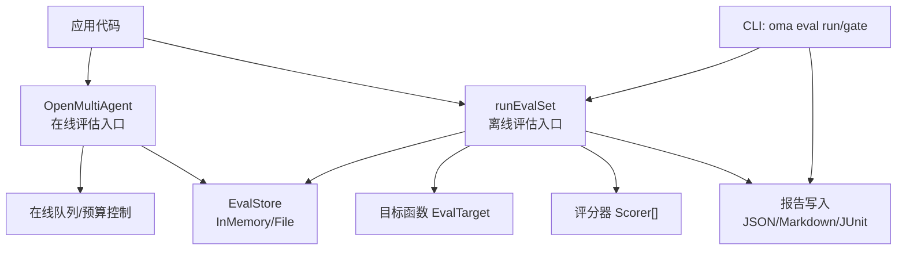
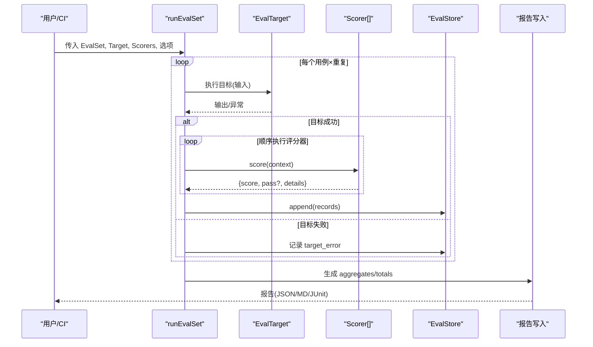
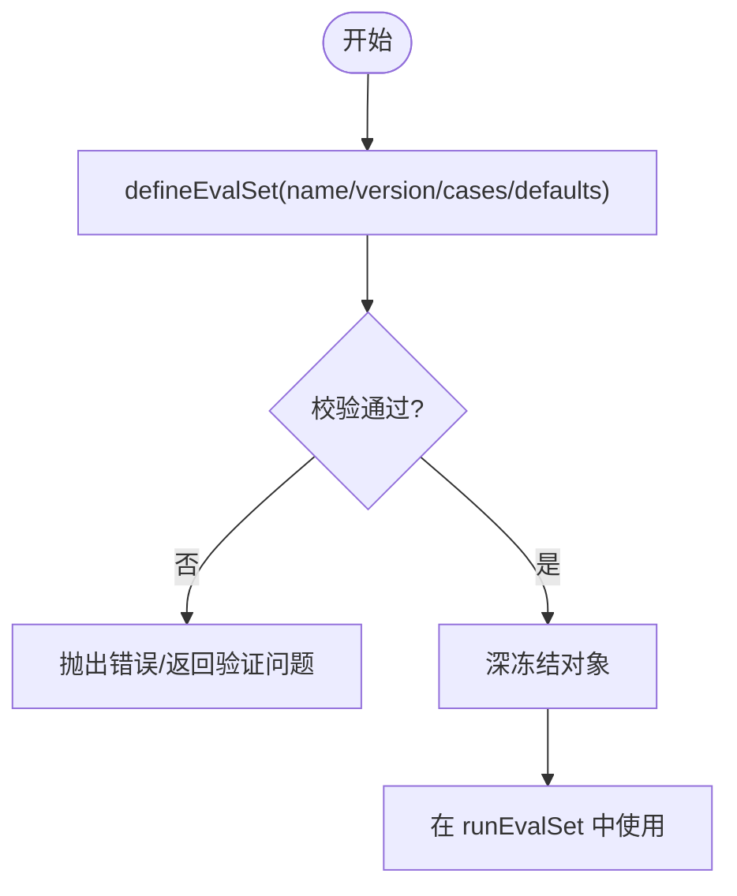
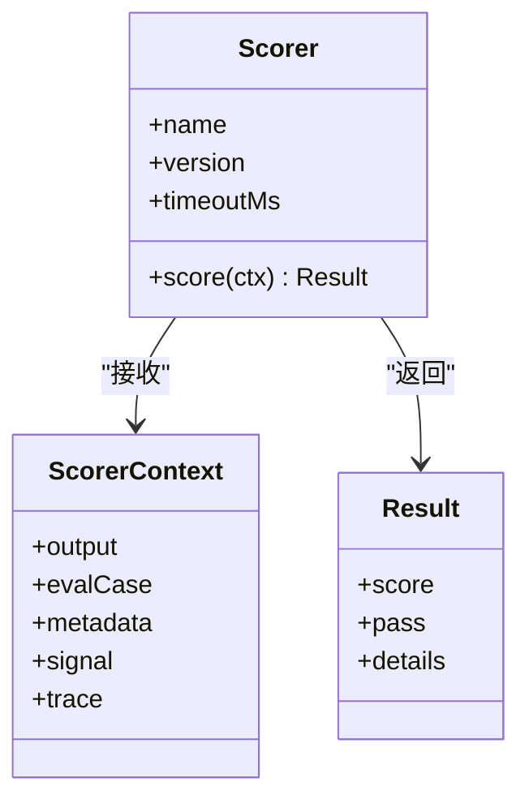
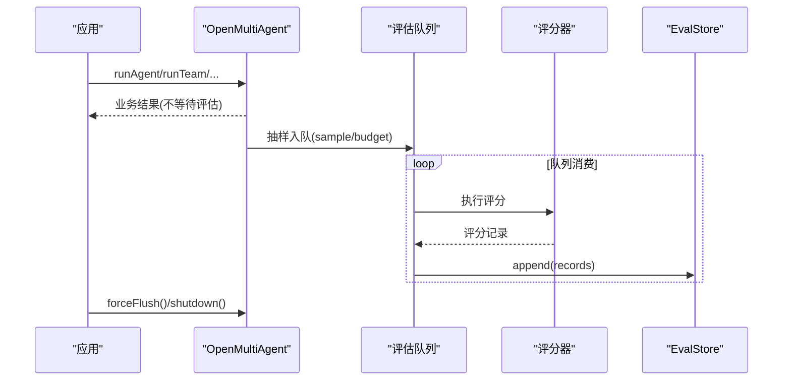
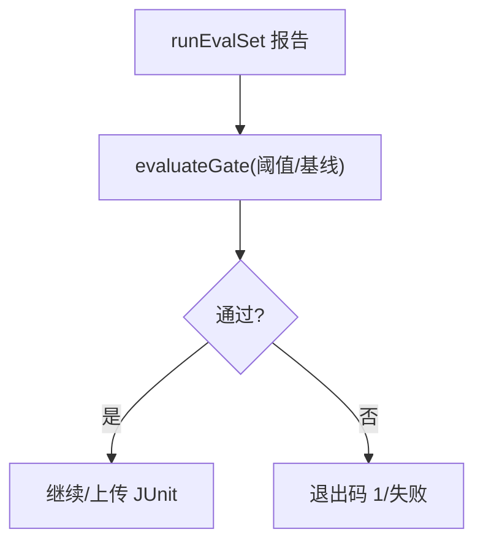
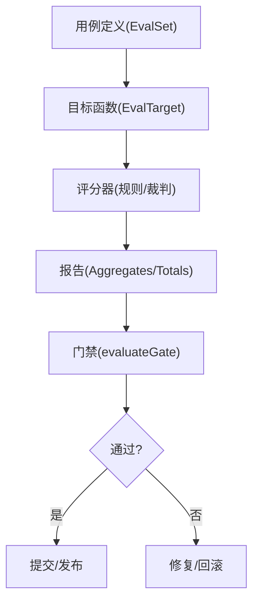
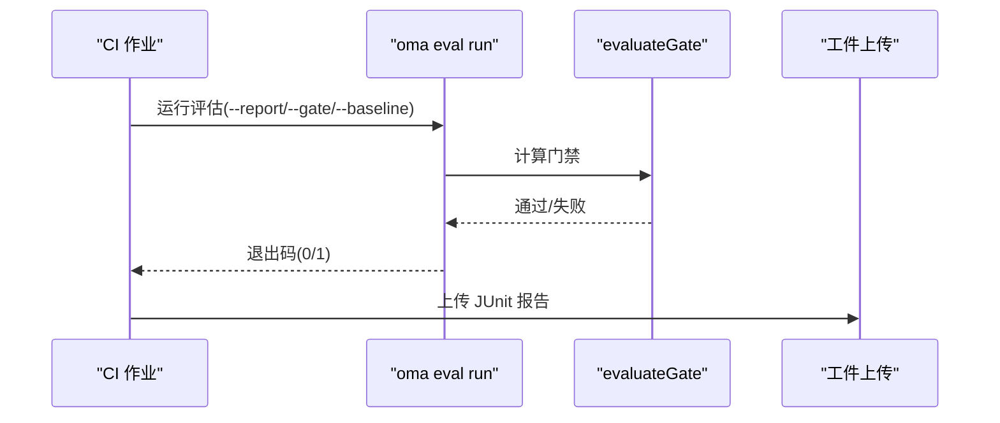
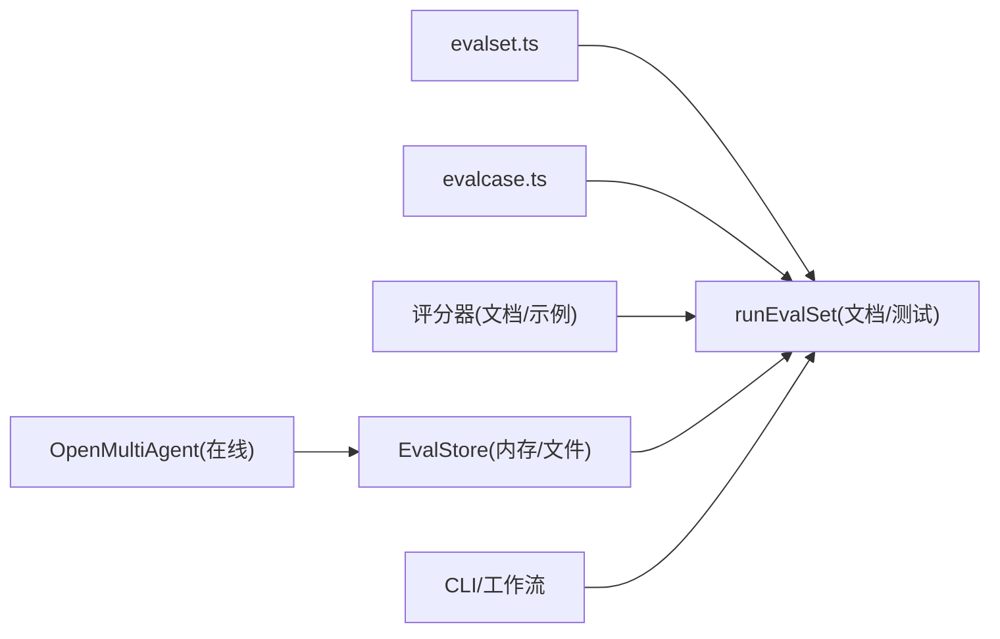

# 评估测试

<cite>
**本文引用的文件**
- [evaluation.md](file://docs/evaluation.md)
- [evalset.ts](file://packages/core/src/eval/evalset.ts)
- [evalcase.ts](file://packages/core/src/eval/evalcase.ts)
- [eval-offline-regression.ts](file://packages/core/examples/patterns/eval-offline-regression.ts)
- [eval-online-sampling.ts](file://packages/core/examples/patterns/eval-online-sampling.ts)
- [eval-runner.test.ts](file://packages/core/tests/eval-runner.test.ts)
- [eval-file-store.test.ts](file://packages/core/tests/eval-file-store.test.ts)
- [example-catalog-lib.mjs](file://scripts/example-catalog-lib.mjs)
- [ci.yml](file://.github/workflows/ci.yml)
</cite>

## 目录
1. [简介](#简介)
2. [项目结构](#项目结构)
3. [核心组件](#核心组件)
4. [架构总览](#架构总览)
5. [详细组件分析](#详细组件分析)
6. [依赖关系分析](#依赖关系分析)
7. [性能考量](#性能考量)
8. [故障排查指南](#故障排查指南)
9. [结论](#结论)
10. [附录](#附录)

## 简介
本文件系统性介绍 Open Multi-Agent 的评估测试体系，覆盖 EvalSet 定义与用例编写、评分器实现（内置与自定义）、批量评估与在线采样、评估报告生成与分析、测试驱动开发实践、结果可视化与解读，以及将评估集成到 CI/CD 的流程。文档以仓库中的官方文档与源码为依据，确保内容准确可追溯。

## 项目结构
评估能力集中在 @open-multi-agent/core/eval 子路径，提供离线与在线两种评估模式：
- 离线评估：通过 runEvalSet 对 EvalSet 进行批处理执行与评分，输出 EvalRunReport。
- 在线评估：在 OpenMultiAgent 实例中配置 evaluation，对线上运行进行抽样异步评分，不阻塞业务结果。
- 存储：InMemoryEvalStore 用于本地/测试；FileEvalStore 用于持久化 NDJSON 日志。
- CLI：oma eval run/gate 支持从命令行运行评估、生成报告并执行质量门禁。

图表来源
- [evaluation.md:90-187](file://docs/evaluation.md#L90-L187)
- [evaluation.md:287-387](file://docs/evaluation.md#L287-L387)
- [evaluation.md:420-490](file://docs/evaluation.md#L420-L490)

章节来源
- [evaluation.md:1-18](file://docs/evaluation.md#L1-L18)
- [evaluation.md:90-187](file://docs/evaluation.md#L90-L187)
- [evaluation.md:287-387](file://docs/evaluation.md#L287-L387)
- [evaluation.md:420-490](file://docs/evaluation.md#L420-L490)

## 核心组件
- EvalSet/EvalCase：版本化的用例集合与单条用例，包含输入、期望、标签与元数据，支持去重校验与深冻结。
- 评分器 Scorer：通过 defineScorer 或内置工厂创建，返回 0~1 分数与可选 pass；支持超时、错误隔离与串行执行。
- 评估运行器 runEvalSet：并发调度用例与重复次数，聚合统计（avg、p50、p95、passRate），按标签分组聚合。
- 存储 EvalStore：InMemoryEvalStore 与 FileEvalStore，支持追加、查询、删除、保留策略与原子批次。
- 在线评估：OpenMultiAgent.evaluation 配置 sample、maxConcurrent、budget、store，异步评分不影响业务响应。
- 报告与门禁：writeEvalReport 输出 JSON/Markdown/JUnit；evaluateGate 基于阈值与基线判定通过与否。

章节来源
- [evalset.ts:14-63](file://packages/core/src/eval/evalset.ts#L14-L63)
- [evalcase.ts:1-11](file://packages/core/src/eval/evalcase.ts#L1-L11)
- [evaluation.md:20-73](file://docs/evaluation.md#L20-L73)
- [evaluation.md:90-139](file://docs/evaluation.md#L90-L139)
- [evaluation.md:140-240](file://docs/evaluation.md#L140-L240)
- [evaluation.md:287-387](file://docs/evaluation.md#L287-L387)
- [evaluation.md:420-490](file://docs/evaluation.md#L420-L490)

## 架构总览
评估系统围绕“用例—目标—评分—存储—报告—门禁”的流水线构建，离线与在线两条路径共享评分器与存储抽象，保证一致性。

图表来源
- [evaluation.md:90-139](file://docs/evaluation.md#L90-L139)
- [evaluation.md:287-387](file://docs/evaluation.md#L287-L387)
- [evaluation.md:420-490](file://docs/evaluation.md#L420-L490)

## 详细组件分析

### EvalSet 与用例编写
- 定义：使用 defineEvalSet 声明 name/version/description/cases/defaults，cases 中的 id 必须唯一，整体对象会被深冻结。
- 用例字段：id、input、expected（可选）、tags（可选）、metadata（键值对为 TraceAttributeValue）。
- 过滤与并发：filterTags 选择用例；repeats/concurrency 控制重复与并行度；默认并发为 2。
- 断言方法：由评分器决定，常见为精确匹配、结构化输出合规、成本预算、相关性等；也可自定义 defineScorer。

图表来源
- [evalset.ts:14-63](file://packages/core/src/eval/evalset.ts#L14-L63)
- [evalcase.ts:1-11](file://packages/core/src/eval/evalcase.ts#L1-L11)

章节来源
- [evalset.ts:14-63](file://packages/core/src/eval/evalset.ts#L14-L63)
- [evalcase.ts:1-11](file://packages/core/src/eval/evalcase.ts#L1-L11)
- [evaluation.md:90-139](file://docs/evaluation.md#L90-L139)

### 评分器实现与内置评分器
- 自定义评分器：defineScorer({name, version?, score(ctx)})，ctx 包含 output、evalCase、metadata、signal；返回值 {score, pass?}，score 范围 0~1。
- 内置评分器：toolCallSuccessScorer、structuredOutputComplianceScorer、costBudgetScorer、dependencyUtilizationScorer、duplicateWorkScorer、noProgressScorer、createAnswerRelevancyScorer 等。
- 行为特性：评分器抛错/拒绝/超时记为 scorer_error，不计入平均分与通过率分母；_target 记录目标异常；支持 timeoutMs 限制。

图表来源
- [evaluation.md:20-73](file://docs/evaluation.md#L20-L73)
- [evaluation.md:47-67](file://docs/evaluation.md#L47-L67)

章节来源
- [evaluation.md:20-73](file://docs/evaluation.md#L20-L73)
- [evaluation.md:47-67](file://docs/evaluation.md#L47-L67)
- [eval-runner.test.ts:39-200](file://packages/core/tests/eval-runner.test.ts#L39-L200)

### 批量评估与在线采样
- 离线批量：runEvalSet(set, target, {scorers, repeats, concurrency, filterTags, metadata, store})，返回 EvalRunReport，含 records/aggregates/totals。
- 在线采样：OpenMultiAgent({evaluation:{scorers, sample, maxConcurrent, maxQueueLength, budget, store}})，业务结果不等待评分；forceFlush/shutdown 管理生命周期。
- 存储：InMemoryEvalStore 用于测试；FileEvalStore 持久化 NDJSON，支持 flush/compact/close、删除与保留策略。

图表来源
- [evaluation.md:140-240](file://docs/evaluation.md#L140-L240)
- [evaluation.md:287-387](file://docs/evaluation.md#L287-L387)
- [eval-online-sampling.ts:1-60](file://packages/core/examples/patterns/eval-online-sampling.ts#L1-L60)

章节来源
- [evaluation.md:90-139](file://docs/evaluation.md#L90-L139)
- [evaluation.md:140-240](file://docs/evaluation.md#L140-L240)
- [evaluation.md:287-387](file://docs/evaluation.md#L287-L387)
- [eval-online-sampling.ts:1-60](file://packages/core/examples/patterns/eval-online-sampling.ts#L1-L60)

### 评估报告与质量门禁
- 报告格式：JSON（权威）、Markdown（人类可读）、JUnit（CI 友好，每条 record 一个 testcase）。
- 门禁 evaluateGate：支持 avg/p50/p95/min/passRate 阈值，tag 限定，最大评分器/目标错误率，基线回归比较。
- CLI：oma eval run 支持 --report/--gate/--baseline/--meta；oma eval gate 单独执行门禁逻辑。

图表来源
- [evaluation.md:420-490](file://docs/evaluation.md#L420-L490)
- [evaluation.md:492-573](file://docs/evaluation.md#L492-L573)

章节来源
- [evaluation.md:420-490](file://docs/evaluation.md#L420-L490)
- [evaluation.md:492-573](file://docs/evaluation.md#L492-L573)

### 测试驱动开发实践
- 单元测试：针对评分器与运行器的行为断言，如并发、串行评分、错误隔离、超时处理等。
- 集成测试：结合 InMemoryEvalStore/FileEvalStore 验证追加、查询、删除、保留策略与恢复。
- 端到端测试：示例脚本 eval-offline-regression.ts 演示双模型对比、规则+裁判评分、门禁判定。

图表来源
- [eval-runner.test.ts:47-200](file://packages/core/tests/eval-runner.test.ts#L47-L200)
- [eval-file-store.test.ts:76-151](file://packages/core/tests/eval-file-store.test.ts#L76-L151)
- [eval-offline-regression.ts:59-133](file://packages/core/examples/patterns/eval-offline-regression.ts#L59-L133)

章节来源
- [eval-runner.test.ts:47-200](file://packages/core/tests/eval-runner.test.ts#L47-L200)
- [eval-file-store.test.ts:76-151](file://packages/core/tests/eval-file-store.test.ts#L76-L151)
- [eval-offline-regression.ts:59-133](file://packages/core/examples/patterns/eval-offline-regression.ts#L59-L133)

### 结果可视化与报告解读
- JSON：权威数据结构，便于程序化分析与趋势对比。
- Markdown：摘要、评分器与标签聚合、失败样例与总计，适合人工审查。
- JUnit：CI 平台可直接展示用例级通过/失败/错误，便于定位问题。

章节来源
- [evaluation.md:420-490](file://docs/evaluation.md#L420-L490)

### 将评估系统集成到 CI/CD
- 使用 oma eval run 执行离线评估，输出 JSON 与 JUnit 报告，配合 --gate 与 --baseline 进行门禁。
- GitHub Actions 示例：步骤失败时退出码 1，始终上传 JUnit 工件以便归档。
- 示例脚本 eval-example-smoke.mjs 用于冒烟验证评估示例是否可运行。

图表来源
- [evaluation.md:462-573](file://docs/evaluation.md#L462-L573)
- [ci.yml:1-200](file://.github/workflows/ci.yml#L1-L200)
- [example-catalog-lib.mjs:1-60](file://scripts/example-catalog-lib.mjs#L1-L60)

章节来源
- [evaluation.md:462-573](file://docs/evaluation.md#L462-L573)
- [ci.yml:1-200](file://.github/workflows/ci.yml#L1-L200)
- [example-catalog-lib.mjs:1-60](file://scripts/example-catalog-lib.mjs#L1-L60)

## 依赖关系分析
- 模块耦合：runEvalSet 依赖 EvalSet/EvalCase 定义、评分器接口、EvalStore 抽象；在线评估依赖 OpenMultiAgent 配置与队列/预算控制。
- 外部依赖：LLMAdapter（用于裁判/目标模拟）、Zod（校验）、文件系统（FileEvalStore）。
- 潜在循环：无直接循环依赖；CLI 与示例脚本仅调用公共 API。

图表来源
- [evalset.ts:14-63](file://packages/core/src/eval/evalset.ts#L14-L63)
- [evalcase.ts:1-11](file://packages/core/src/eval/evalcase.ts#L1-L11)
- [evaluation.md:90-187](file://docs/evaluation.md#L90-L187)
- [evaluation.md:287-387](file://docs/evaluation.md#L287-L387)

章节来源
- [evalset.ts:14-63](file://packages/core/src/eval/evalset.ts#L14-L63)
- [evalcase.ts:1-11](file://packages/core/src/eval/evalcase.ts#L1-L11)
- [evaluation.md:90-187](file://docs/evaluation.md#L90-L187)
- [evaluation.md:287-387](file://docs/evaluation.md#L287-L387)

## 性能考量
- 并发与串行：不同样本并发执行（默认 2），同一样本内评分器串行执行，避免竞争与状态污染。
- 在线开销：采样与入队开销极低（微秒级），不影响业务响应；预算与队列长度保护系统稳定性。
- 存储性能：FileEvalStore 使用追加式 NDJSON，flush/compact 控制 fsync 与文件大小；InMemoryEvalStore 适合短生命周期场景。

章节来源
- [evaluation.md:90-139](file://docs/evaluation.md#L90-L139)
- [evaluation.md:140-240](file://docs/evaluation.md#L140-L240)
- [evaluation.md:287-387](file://docs/evaluation.md#L287-L387)

## 故障排查指南
- 评分器错误：记录为 scorer_error，不参与平均分与通过率计算；检查超时、异常与资源限制。
- 目标错误：记录为 target_error，位于保留的 _target 评分器名下；检查目标函数与输入合法性。
- 存储问题：FileEvalStore 打开时检测损坏/不完整批次并诊断；flush/close 幂等，关闭后操作返回结构化错误。
- 门禁失败：检查阈值配置、基线版本与评分器版本差异；必要时更新基线或调整阈值。

章节来源
- [evaluation.md:47-67](file://docs/evaluation.md#L47-L67)
- [evaluation.md:492-573](file://docs/evaluation.md#L492-L573)
- [eval-file-store.test.ts:76-151](file://packages/core/tests/eval-file-store.test.ts#L76-L151)
- [eval-file-store.test.ts:214-240](file://packages/core/tests/eval-file-store.test.ts#L214-L240)

## 结论
Open Multi-Agent 的评估测试体系提供了从用例定义、评分器实现、批量与在线评估、存储与报告到质量门禁的完整闭环。通过版本化的 EvalSet 与评分器、严格的错误隔离与聚合统计、灵活的存储与报告格式，以及可配置的 CI 门禁，能够有效保障多智能体系统的质量与稳定性。建议在生产环境中结合离线回归与在线采样，持续监控趋势并及时更新基线与阈值。

## 附录
- 快速上手：参考离线回归示例与在线采样示例，逐步替换适配器与评分器。
- 最佳实践：
  - 为评分器设置版本号，变更规则/提示/裁判模型时升级版本。
  - 使用标签区分关键用例，门禁中对关键标签设定更严格阈值。
  - 在线评估开启最小必要权限与预算，避免影响业务。
  - 定期清理历史数据，使用保留策略控制存储规模。