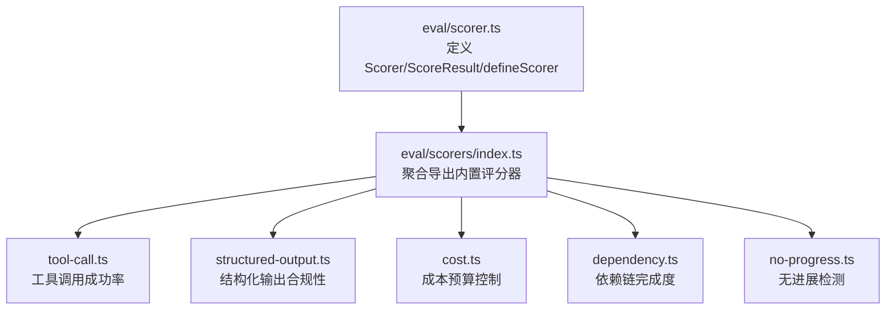
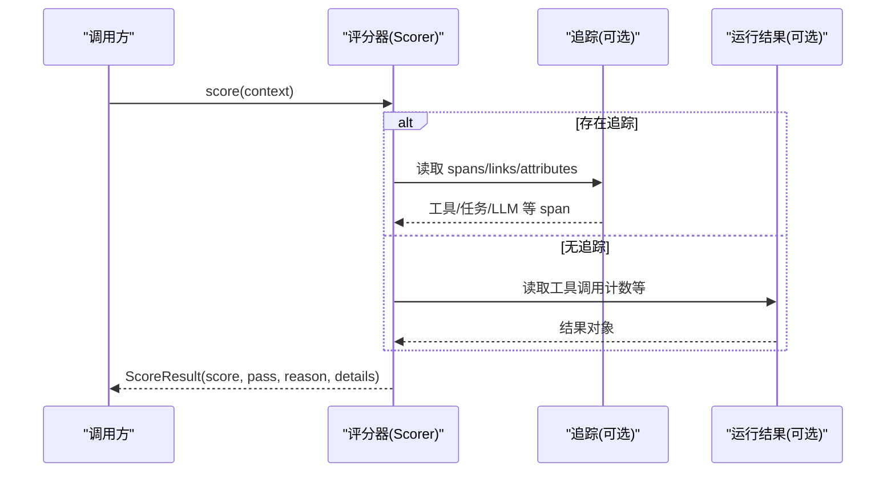
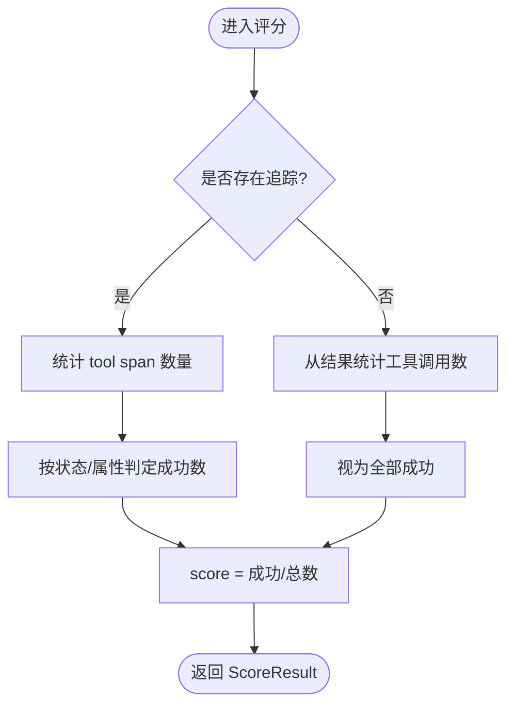
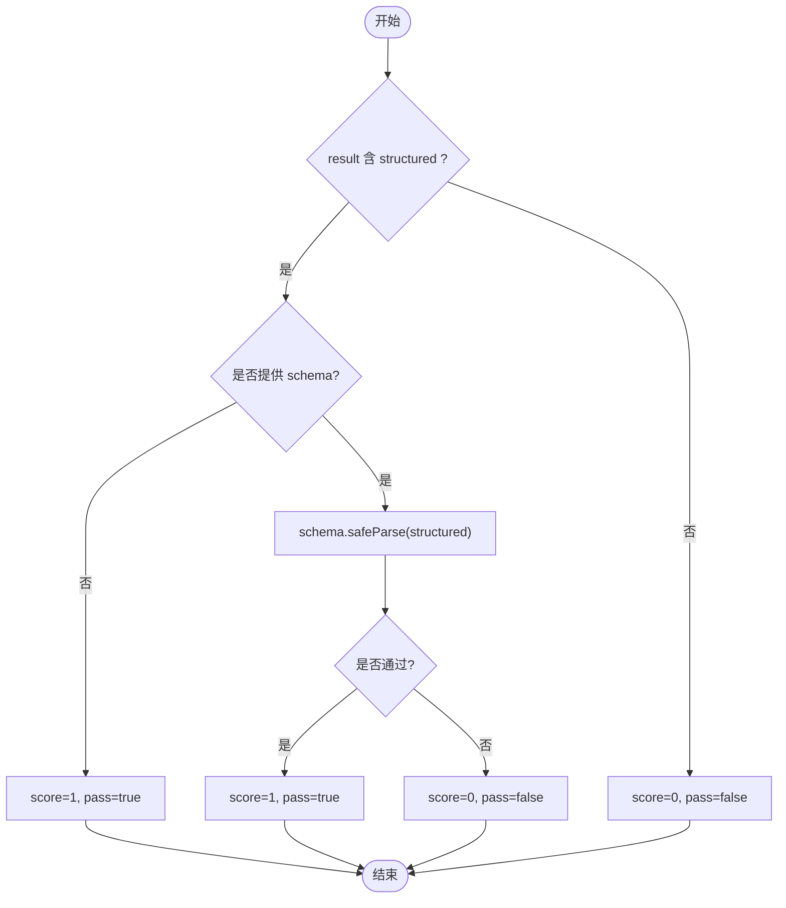
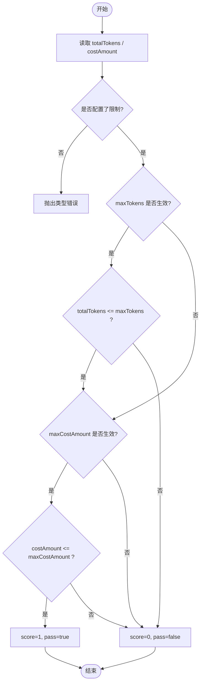
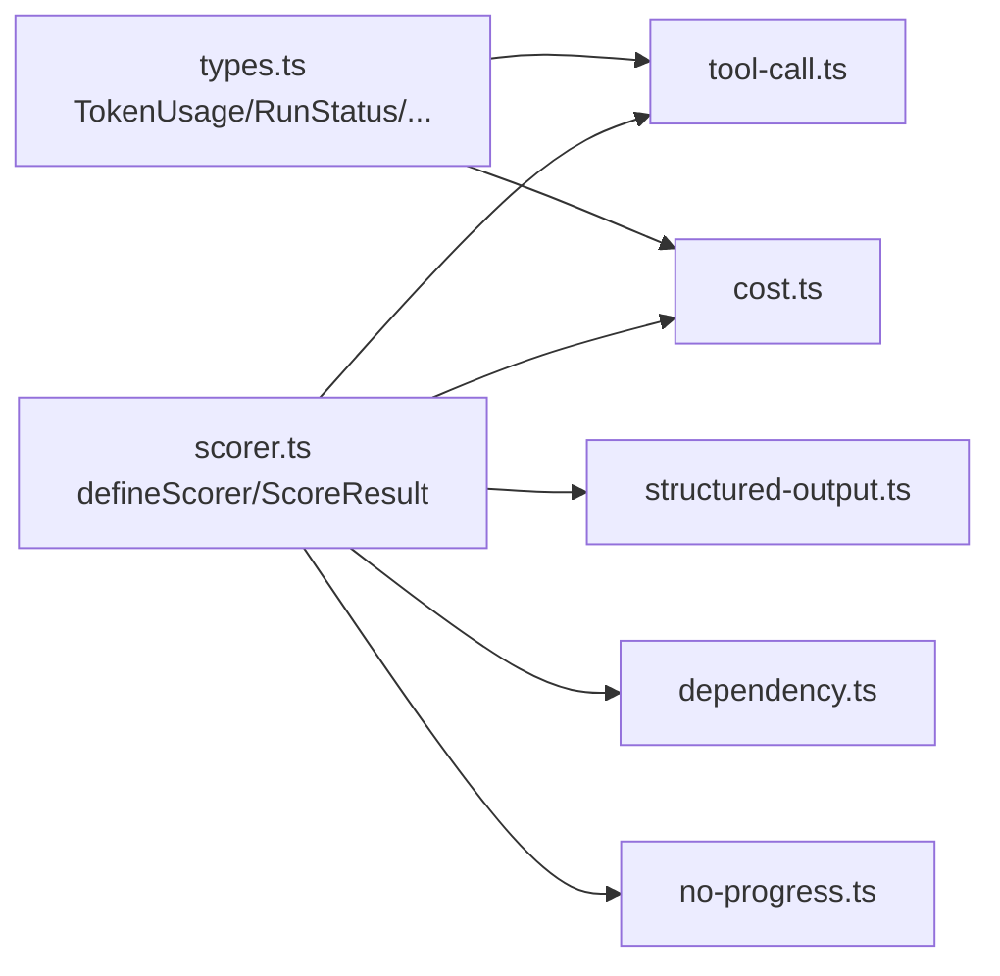

# 内置评分器

<cite>
**本文引用的文件**
- [scorer.ts](file://packages/core/src/eval/scorer.ts)
- [tool-call.ts](file://packages/core/src/eval/scorers/tool-call.ts)
- [structured-output.ts](file://packages/core/src/eval/scorers/structured-output.ts)
- [cost.ts](file://packages/core/src/eval/scorers/cost.ts)
- [dependency.ts](file://packages/core/src/eval/scorers/dependency.ts)
- [no-progress.ts](file://packages/core/src/eval/scorers/no-progress.ts)
- [index.ts](file://packages/core/src/eval/scorers/index.ts)
- [types.ts](file://packages/core/src/types.ts)
</cite>

## 目录
1. [简介](#简介)
2. [项目结构](#项目结构)
3. [核心组件](#核心组件)
4. [架构总览](#架构总览)
5. [详细组件分析](#详细组件分析)
6. [依赖关系分析](#依赖关系分析)
7. [性能考量](#性能考量)
8. [故障排查指南](#故障排查指南)
9. [结论](#结论)
10. [附录：配置与使用示例](#附录：配置与使用示例)

## 简介
本章节面向希望系统化评估多智能体运行质量与成本的读者，全面介绍框架提供的内置评分器。重点包括：
- exact-match 评分器的使用方法与适用场景（以结构化输出合规性为核心）
- toolCallSuccessScorer 如何评估工具调用的成功率与准确性
- structuredOutputComplianceScorer 对结构化输出的检查机制
- costBudgetScorer 的成本预算控制与资源管理
- 各评分器的配置项、参数说明与使用方式
- 评分器的组合使用模式与最佳实践

## 项目结构
内置评分器位于 eval 子模块中，统一通过 defineScorer 包装并暴露标准化接口；具体评分器按功能拆分到 scorers 子目录，并通过 index 聚合导出。

图表来源
- [scorer.ts:12-37](file://packages/core/src/eval/scorer.ts#L12-L37)
- [index.ts:1-12](file://packages/core/src/eval/scorers/index.ts#L1-L12)

章节来源
- [scorer.ts:12-37](file://packages/core/src/eval/scorer.ts#L12-L37)
- [index.ts:1-12](file://packages/core/src/eval/scorers/index.ts#L1-L12)

## 核心组件
- ScorerContext：评分器输入上下文，包含用例、结果、追踪数据、元数据与中止信号。
- ScoreResult：标准化评分结果，包含分数[0,1]、是否通过、原因与详情。
- defineScorer：对评分器进行校验、冻结与结果验证，确保所有评分器返回一致的契约。

这些基础能力为所有内置评分器提供统一的输入输出与错误处理保障。

章节来源
- [scorer.ts:12-37](file://packages/core/src/eval/scorer.ts#L12-L37)
- [scorer.ts:88-124](file://packages/core/src/eval/scorer.ts#L88-L124)
- [scorer.ts:133-167](file://packages/core/src/eval/scorer.ts#L133-L167)

## 架构总览
内置评分器围绕“结果 + 追踪”双源信息工作：
- 当存在追踪时，优先基于追踪中的 span/link/attributes 计算指标（更精确）
- 当无追踪时，退化为从运行结果对象中统计（如工具调用计数）

图表来源
- [tool-call.ts:23-59](file://packages/core/src/eval/scorers/tool-call.ts#L23-L59)
- [dependency.ts:12-78](file://packages/core/src/eval/scorers/dependency.ts#L12-L78)
- [no-progress.ts:20-112](file://packages/core/src/eval/scorers/no-progress.ts#L20-L112)

## 详细组件分析

### toolCallSuccessScorer：工具调用成功率与准确性
- 目标：衡量记录的工具调用中成功完成的占比。
- 数据来源：
  - 有追踪：统计 kind=tool 的 span，依据状态与属性判断是否成功。
  - 无追踪：从结果对象中统计工具调用数量，并将已记录调用视为成功。
- 关键行为：
  - 若无任何工具调用，返回不适用但分数为 1，便于流水线继续。
  - 分数 = 成功数 / 总数；pass 仅在所有调用均成功时为真。

图表来源
- [tool-call.ts:23-59](file://packages/core/src/eval/scorers/tool-call.ts#L23-L59)

章节来源
- [tool-call.ts:23-59](file://packages/core/src/eval/scorers/tool-call.ts#L23-L59)

### structuredOutputComplianceScorer：结构化输出合规性（exact-match）
- 目标：检查最终结果是否包含结构化输出，并可按给定 schema 做严格匹配。
- 工作方式：
  - 若结果对象包含 structured 字段，则视为存在结构化输出。
  - 若提供了 schema，则使用 safeParse 进行严格校验；未提供则仅检查存在性。
- 适用场景：
  - 需要模型输出符合固定 JSON 结构的下游系统对接。
  - 回归测试中要求“完全一致”的结构化答案（exact-match）。

图表来源
- [structured-output.ts:5-35](file://packages/core/src/eval/scorers/structured-output.ts#L5-L35)

章节来源
- [structured-output.ts:5-35](file://packages/core/src/eval/scorers/structured-output.ts#L5-L35)

### costBudgetScorer：成本预算控制与资源管理
- 目标：对 token 用量与观测到的费用设置硬性上限，超限时标记失败。
- 配置项：
  - maxTokens：最大允许 token 总量（input_tokens + output_tokens）
  - maxCostAmount：最大允许费用金额（单币种）
- 行为要点：
  - 至少需提供一个限制条件，否则抛出类型错误。
  - 若同时存在多种币种，无法比较金额，将抛错。
  - 若缺少 token 或费用数据，会在 details 中标明缺失项，并在 reason 中提示。
  - 分数为 0/1，pass 表示所有生效的限制均未超限。

图表来源
- [cost.ts:23-77](file://packages/core/src/eval/scorers/cost.ts#L23-L77)

章节来源
- [cost.ts:23-77](file://packages/core/src/eval/scorers/cost.ts#L23-L77)

### dependencyUtilizationScorer：依赖链完成度（补充）
- 目标：基于任务 span 的依赖链接与终态，评估依赖链是否完整且成功。
- 行为：
  - 无追踪或不适用时返回分数 1，避免阻塞流水线。
  - 统计带有 depends_on 链接的任务，检查其依赖是否均为 ok。
  - 分数 = 满足条件的任务数 / 带依赖的任务数。

章节来源
- [dependency.ts:12-78](file://packages/core/src/eval/scorers/dependency.ts#L12-L78)

### noProgressScorer：无进展检测（补充）
- 目标：检测连续多次尝试中“只调用 LLM 却未调用工具”的停滞情况。
- 配置项：
  - maxStallTurns：允许的连续停滞次数阈值（默认 2）
- 行为：
  - 无追踪或不适用时返回分数 1。
  - 根据 agent span 的子 span 与属性推断是否有工具调用。
  - 分数随最大连续停滞次数超过阈值而下降。

章节来源
- [no-progress.ts:20-112](file://packages/core/src/eval/scorers/no-progress.ts#L20-L112)

## 依赖关系分析
- 所有内置评分器均依赖 defineScorer 提供的契约校验与结果冻结。
- 部分评分器依赖追踪数据（spans/links/attributes），在无追踪时回退到结果对象统计。
- 类型定义来自 types.ts，用于约束运行结果、token 用量、错误分类等。

图表来源
- [scorer.ts:12-37](file://packages/core/src/eval/scorer.ts#L12-L37)
- [types.ts:282-321](file://packages/core/src/types.ts#L282-L321)
- [types.ts:1855-1870](file://packages/core/src/types.ts#L1855-L1870)

章节来源
- [scorer.ts:12-37](file://packages/core/src/eval/scorer.ts#L12-L37)
- [types.ts:282-321](file://packages/core/src/types.ts#L282-L321)
- [types.ts:1855-1870](file://packages/core/src/types.ts#L1855-L1870)

## 性能考量
- 评分器本身轻量，主要开销在解析追踪与遍历 span。建议在批量评测时复用追踪对象以减少重复解析。
- 对于大规模 run 的评测，建议开启必要的追踪（尤其是 tool/task/agent 级别），以获得更准确的指标。
- costBudgetScorer 在涉及多币种时会抛错，应在评测前确保费用数据单一币种，避免运行时异常。

## 故障排查指南
- 评分器返回不通过：
  - 查看 ScoreResult.reason 与 details，定位具体原因（如预算超限、结构化不匹配、无工具调用等）。
- 工具调用成功率偏低：
  - 检查追踪中 tool span 的状态与属性，确认是否存在被拒绝或错误的工具调用。
- 结构化输出不合规：
  - 确认 result.structured 是否存在，以及 schema 是否与期望一致。
- 成本预算触发：
  - 核对 maxTokens/maxCostAmount 的设置与当前 token/费用数据是否合理。
- 无进展检测频繁触发：
  - 调整 maxStallTurns，或在应用层增加工具调用以避免纯 LLM 循环。

章节来源
- [scorer.ts:88-124](file://packages/core/src/eval/scorer.ts#L88-L124)
- [tool-call.ts:23-59](file://packages/core/src/eval/scorers/tool-call.ts#L23-L59)
- [structured-output.ts:5-35](file://packages/core/src/eval/scorers/structured-output.ts#L5-L35)
- [cost.ts:23-77](file://packages/core/src/eval/scorers/cost.ts#L23-L77)
- [no-progress.ts:20-112](file://packages/core/src/eval/scorers/no-progress.ts#L20-L112)

## 结论
内置评分器覆盖了工具调用质量、结构化输出一致性、成本预算与执行效率等关键维度。通过统一的 Scorer 契约与可组合的配置，可在离线回归与在线采样评测中灵活组合，形成稳定的质量门禁与持续改进闭环。

## 附录：配置与使用示例

### exact-match 评分器（结构化输出合规性）
- 适用场景：
  - 下游系统强依赖固定 JSON 结构，要求“完全一致”的输出。
  - 回归测试中对结构化答案进行严格比对。
- 配置选项：
  - schema：ZodSchema，可选。提供后将对 structured 字段进行严格校验。
- 使用方式（概念流程）：
  - 在评测用例中，将 structuredOutputComplianceScorer(schema?) 加入评分器列表。
  - 运行评测后，检查 score 与 pass，结合 reason/details 定位问题。

章节来源
- [structured-output.ts:5-35](file://packages/core/src/eval/scorers/structured-output.ts#L5-L35)

### toolCallSuccessScorer：工具调用成功率
- 适用场景：
  - 监控工具调用稳定性，识别失败率上升。
  - 作为质量门禁，要求工具调用全部成功。
- 配置选项：无额外参数。
- 使用方式（概念流程）：
  - 将 toolCallSuccessScorer() 加入评分器列表。
  - 关注 score 与 pass，并结合 details 中的 tool_calls/successful_tool_calls/source 进行分析。

章节来源
- [tool-call.ts:23-59](file://packages/core/src/eval/scorers/tool-call.ts#L23-L59)

### costBudgetScorer：成本预算控制
- 适用场景：
  - 控制单次运行的 token 用量与费用上限，防止资源滥用。
  - 在回归评测中对比不同版本的成本变化。
- 配置选项：
  - maxTokens：最大 token 总量（正数）
  - maxCostAmount：最大费用金额（正数，单币种）
- 使用方式（概念流程）：
  - 设置至少一个限制（maxTokens 或 maxCostAmount）。
  - 运行评测后，若 score=0，检查 details 中的 total_tokens/cost_amount 与对应上限。

章节来源
- [cost.ts:23-77](file://packages/core/src/eval/scorers/cost.ts#L23-L77)

### 组合使用模式与最佳实践
- 推荐组合：
  - 结构化输出合规 + 工具调用成功率 + 成本预算：覆盖“正确性、稳定性、经济性”。
  - 无进展检测：用于发现“空转”风险，配合工具调用成功率提升整体效率。
- 最佳实践：
  - 始终启用追踪，以便评分器获得更准确的数据源。
  - 在回归评测中固定 schema 与预算阈值，确保可比性。
  - 对多币种费用数据，确保单一币种或使用合适的估算策略。
  - 将评分器纳入 CI 门禁，对关键指标设置最低通过阈值。

章节来源
- [index.ts:1-12](file://packages/core/src/eval/scorers/index.ts#L1-L12)
- [scorer.ts:12-37](file://packages/core/src/eval/scorer.ts#L12-L37)