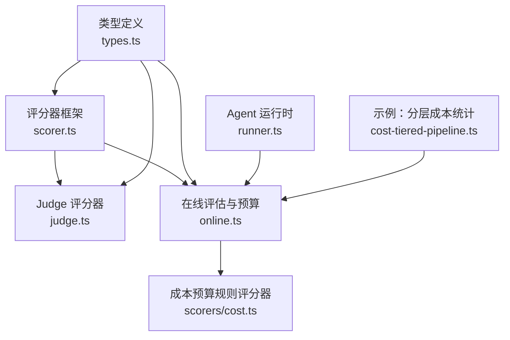
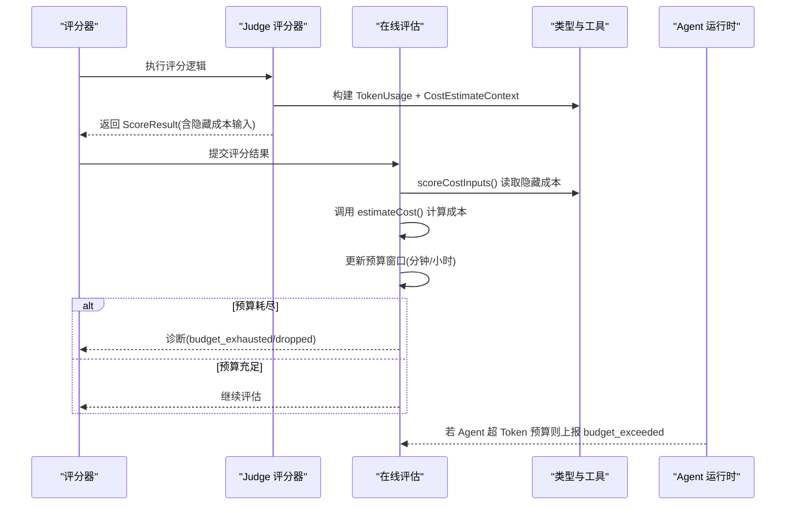
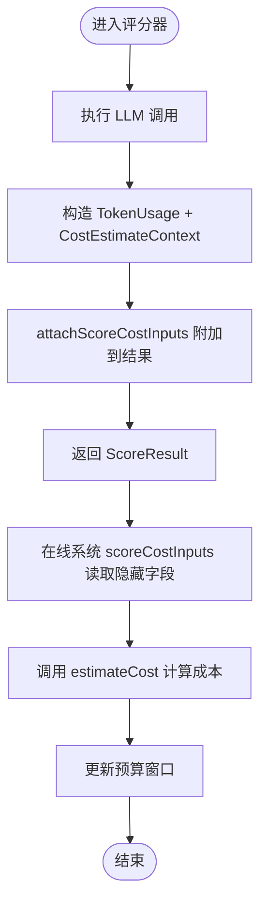
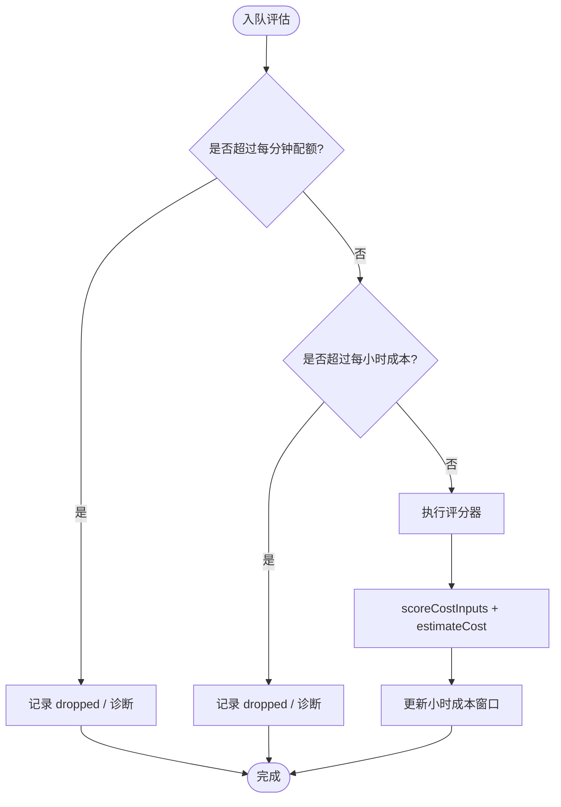
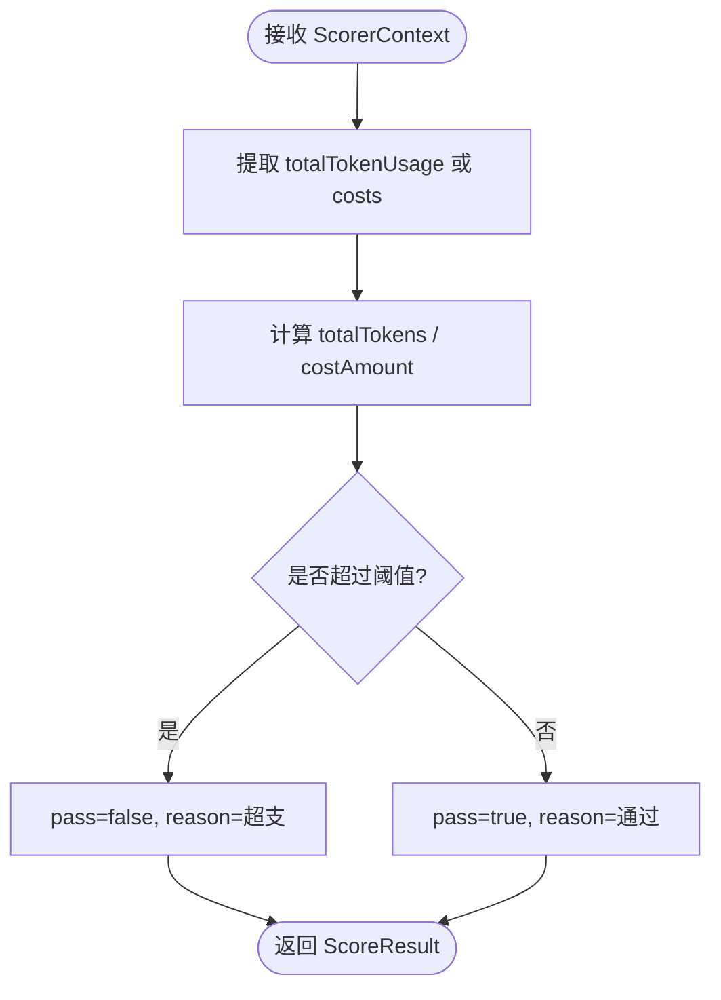
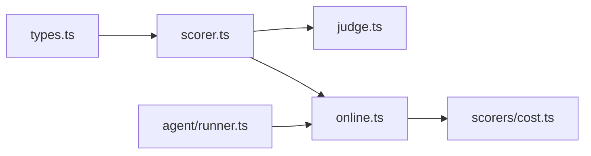

# 成本追踪与预算控制

<cite>
**本文引用的文件**
- [packages/core/src/eval/scorer.ts](file://packages/core/src/eval/scorer.ts)
- [packages/core/src/eval/judge.ts](file://packages/core/src/eval/judge.ts)
- [packages/core/src/eval/online.ts](file://packages/core/src/eval/online.ts)
- [packages/core/src/eval/scorers/cost.ts](file://packages/core/src/eval/scorers/cost.ts)
- [packages/core/src/types.ts](file://packages/core/src/types.ts)
- [packages/core/src/agent/runner.ts](file://packages/core/src/agent/runner.ts)
- [packages/core/examples/patterns/cost-tiered-pipeline.ts](file://packages/core/examples/patterns/cost-tiered-pipeline.ts)
</cite>

## 目录
1. [简介](#简介)
2. [项目结构](#项目结构)
3. [核心组件](#核心组件)
4. [架构总览](#架构总览)
5. [详细组件分析](#详细组件分析)
6. [依赖关系分析](#依赖关系分析)
7. [性能考虑](#性能考虑)
8. [故障排查指南](#故障排查指南)
9. [结论](#结论)
10. [附录](#附录)

## 简介
本文件系统性说明评分器的成本追踪与预算控制机制，重点解释 attachScoreCostInputs 与 scoreCostInputs 的工作原理、TokenUsage 与 CostEstimateContext 的数据结构与用途，并给出在评分器中收集模型使用信息（token 消耗、请求次数等）的方法。同时介绍在线成本预算控制的实现原理与配置方法，提供最佳实践、性能优化建议以及超支处理策略和告警机制。

## 项目结构
围绕成本追踪与预算控制的关键代码分布在以下模块：
- 评分器基础与成本输入封装：packages/core/src/eval/scorer.ts
- Judge 评分器集成与成本注入：packages/core/src/eval/judge.ts
- 在线评估与预算控制：packages/core/src/eval/online.ts
- 基于观测的成本预算规则评分器：packages/core/src/eval/scorers/cost.ts
- 类型定义（TokenUsage、CostEstimateContext、Orchestrator 预算配置等）：packages/core/src/types.ts
- Agent 运行时的 Token 预算检查与事件：packages/core/src/agent/runner.ts
- 示例：按模型分层统计与估算成本：packages/core/examples/patterns/cost-tiered-pipeline.ts

图表来源
- [packages/core/src/eval/scorer.ts:1-168](file://packages/core/src/eval/scorer.ts#L1-L168)
- [packages/core/src/eval/judge.ts:1-200](file://packages/core/src/eval/judge.ts#L1-L200)
- [packages/core/src/eval/online.ts:1-200](file://packages/core/src/eval/online.ts#L1-L200)
- [packages/core/src/eval/scorers/cost.ts:1-78](file://packages/core/src/eval/scorers/cost.ts#L1-L78)
- [packages/core/src/types.ts:221-478](file://packages/core/src/types.ts#L221-L478)
- [packages/core/src/agent/runner.ts:1175-1295](file://packages/core/src/agent/runner.ts#L1175-L1295)
- [packages/core/examples/patterns/cost-tiered-pipeline.ts:1-560](file://packages/core/examples/patterns/cost-tiered-pipeline.ts#L1-L560)

章节来源
- [packages/core/src/eval/scorer.ts:1-168](file://packages/core/src/eval/scorer.ts#L1-L168)
- [packages/core/src/eval/judge.ts:1-200](file://packages/core/src/eval/judge.ts#L1-L200)
- [packages/core/src/eval/online.ts:1-200](file://packages/core/src/eval/online.ts#L1-L200)
- [packages/core/src/eval/scorers/cost.ts:1-78](file://packages/core/src/eval/scorers/cost.ts#L1-L78)
- [packages/core/src/types.ts:221-478](file://packages/core/src/types.ts#L221-L478)
- [packages/core/src/agent/runner.ts:1175-1295](file://packages/core/src/agent/runner.ts#L1175-L1295)
- [packages/core/examples/patterns/cost-tiered-pipeline.ts:1-560](file://packages/core/examples/patterns/cost-tiered-pipeline.ts#L1-L560)

## 核心组件
- 评分器上下文与结果：ScorerContext、ScoreResult，用于承载评估输入、输出与元数据，并约束返回值的合法性。
- 成本输入封装：ScoreCostInput 包含单次 LLM 调用的 TokenUsage 与 CostEstimateContext；通过 attachScoreCostInputs 将成本信息非枚举地附加到评分结果对象上，避免破坏序列化契约；通过 scoreCostInputs 读取这些隐藏字段供在线预算控制消费。
- 在线评估与预算：OnlineEvaluationConfig 支持采样、并发、队列长度、存储与诊断回调；budget 子项支持“每分钟最大评估数”和“每小时最大成本”；estimateCost 可将增量 token 用量转换为自定义成本单位。
- 成本预算规则评分器：costBudgetScorer 可基于观测到的 totalTokenUsage 或 trace.costs 进行硬上限校验，并产出 pass/fail 与诊断细节。
- Agent 运行时预算：runner.ts 在每轮对话后累计 token，超过 maxTokenBudget 时发出 budget_exceeded 流事件并终止循环。
- 类型定义：TokenUsage（input_tokens/output_tokens）、CostEstimateContext（agentName/model/provider/phase/taskId）、Orchestrator 的 maxTokenBudget/maxCostBudget/estimateCost 等。

章节来源
- [packages/core/src/eval/scorer.ts:12-73](file://packages/core/src/eval/scorer.ts#L12-L73)
- [packages/core/src/eval/online.ts:56-125](file://packages/core/src/eval/online.ts#L56-L125)
- [packages/core/src/eval/scorers/cost.ts:1-78](file://packages/core/src/eval/scorers/cost.ts#L1-L78)
- [packages/core/src/agent/runner.ts:1175-1295](file://packages/core/src/agent/runner.ts#L1175-L1295)
- [packages/core/src/types.ts:221-478](file://packages/core/src/types.ts#L221-L478)

## 架构总览
评分器成本追踪与预算控制由三层协作完成：
- 采集层：各评分器（如 Judge）在执行 LLM 调用后，构造 TokenUsage 与 CostEstimateContext，并通过 attachScoreCostInputs 附着到结果对象。
- 聚合层：在线评估子系统在评分完成后，通过 scoreCostInputs 读取隐藏的成本输入，结合 estimateCost 计算本次评估成本，更新内部预算窗口（分钟/小时）。
- 控制层：当预算耗尽或达到阈值时，触发诊断与降级策略（例如跳过后续评估、记录 dropped/budget_exhausted），并在必要时通过 costBudgetScorer 对观测数据进行事后校验。

图表来源
- [packages/core/src/eval/judge.ts:152-194](file://packages/core/src/eval/judge.ts#L152-L194)
- [packages/core/src/eval/scorer.ts:52-73](file://packages/core/src/eval/scorer.ts#L52-L73)
- [packages/core/src/eval/online.ts:56-125](file://packages/core/src/eval/online.ts#L56-L125)
- [packages/core/src/agent/runner.ts:1175-1295](file://packages/core/src/agent/runner.ts#L1175-L1295)
- [packages/core/src/types.ts:221-478](file://packages/core/src/types.ts#L221-L478)

## 详细组件分析

### attachScoreCostInputs 与 scoreCostInputs
- 作用
  - attachScoreCostInputs：在不改变 ScoreResult 序列化结构的前提下，以不可枚举属性将 TokenUsage 与 CostEstimateContext 列表附加到结果对象，便于后续在线系统读取。
  - scoreCostInputs：安全地从任意值中提取隐藏的 ScoreCostInput[]，若无则返回空数组。
- 使用方式
  - 在评分器内部执行 LLM 调用后，构造 { usage, context } 并调用 attachScoreCostInputs 将其附加到返回对象或错误对象上。
  - 在线评估子系统在评分完成后调用 scoreCostInputs 获取成本输入，再结合 estimateCost 计算成本并更新预算。
- 复杂度与安全性
  - 附加与读取均为 O(k)，k 为成本输入数量；使用不可枚举属性避免 JSON 序列化泄露敏感信息。

图表来源
- [packages/core/src/eval/scorer.ts:52-73](file://packages/core/src/eval/scorer.ts#L52-L73)
- [packages/core/src/eval/judge.ts:152-194](file://packages/core/src/eval/judge.ts#L152-L194)
- [packages/core/src/eval/online.ts:56-125](file://packages/core/src/eval/online.ts#L56-L125)

章节来源
- [packages/core/src/eval/scorer.ts:52-73](file://packages/core/src/eval/scorer.ts#L52-L73)
- [packages/core/src/eval/judge.ts:152-194](file://packages/core/src/eval/judge.ts#L152-L194)

### TokenUsage 与 CostEstimateContext
- TokenUsage
  - 字段：input_tokens、output_tokens
  - 用途：表示一次 LLM 调用的 token 消耗，用于累计、估算成本与预算控制。
- CostEstimateContext
  - 字段：agentName、model、provider（可选）、phase、taskId（可选）
  - 用途：为 estimateCost 提供上下文，使其能根据模型、提供者、阶段等信息进行差异化计价。
- 相关 Orchestrator 配置
  - maxTokenBudget：每轮运行的累计 token 上限。
  - maxCostBudget：每轮运行的估计成本上限（需配合 estimateCost）。
  - estimateCost：将单次 LLM 结果的 TokenUsage 转换为成本单位。

章节来源
- [packages/core/src/types.ts:221-478](file://packages/core/src/types.ts#L221-L478)

### 在线成本预算控制
- 配置项
  - sample：采样比例或函数，决定哪些运行进入评估。
  - scorers：要执行的评分器列表。
  - budget.maxEvaluationsPerMinute：每分钟最大评估次数。
  - budget.maxCostPerHour：每小时最大成本。
  - store/storePayloads/onResult/onDiagnostic：存储与诊断回调。
- 工作原理
  - 在线评估在评分完成后，通过 scoreCostInputs 读取隐藏成本输入，调用 estimateCost 计算本次成本，累加至当前小时窗口；若超过阈值，则记录 dropped/budget_exhausted 诊断并停止新增评估。
  - 同时维护每分钟评估计数，防止突发流量压垮下游。
- 与 Agent 运行时联动
  - runner.ts 在每轮对话后检查 maxTokenBudget，若超限则发出 budget_exceeded 事件并终止循环，避免进一步消耗。

图表来源
- [packages/core/src/eval/online.ts:56-125](file://packages/core/src/eval/online.ts#L56-L125)
- [packages/core/src/eval/scorer.ts:52-73](file://packages/core/src/eval/scorer.ts#L52-L73)
- [packages/core/src/agent/runner.ts:1175-1295](file://packages/core/src/agent/runner.ts#L1175-L1295)

章节来源
- [packages/core/src/eval/online.ts:56-125](file://packages/core/src/eval/online.ts#L56-L125)
- [packages/core/src/agent/runner.ts:1175-1295](file://packages/core/src/agent/runner.ts#L1175-L1295)

### 成本预算规则评分器（costBudgetScorer）
- 功能
  - 基于观测到的 totalTokenUsage 或 trace.costs 进行硬上限校验。
  - 支持分别设置 maxTokens 与 maxCostAmount，任一不满足即判定失败。
  - 输出 pass/fail、reason 与 details（包含实际值与阈值）。
- 适用场景
  - 离线评估或回放时，验证运行是否超出预算。
  - 作为质量门禁的一部分，阻止超支结果被采纳。

图表来源
- [packages/core/src/eval/scorers/cost.ts:1-78](file://packages/core/src/eval/scorers/cost.ts#L1-L78)

章节来源
- [packages/core/src/eval/scorers/cost.ts:1-78](file://packages/core/src/eval/scorers/cost.ts#L1-L78)

### 在评分器中收集模型使用信息
- 推荐做法
  - 在评分器内部执行 LLM 调用后，从返回结果中获取 tokenUsage，并构造 CostEstimateContext（包含 agentName、model、provider、phase、taskId）。
  - 使用 attachScoreCostInputs 将 { usage, context } 附加到评分结果或错误对象上。
  - 在线评估系统通过 scoreCostInputs 读取隐藏字段，并结合 estimateCost 计算成本。
- 参考实现
  - Judge 评分器在每次 judge 调用后构造成本输入，并在失败时将成本信息附加到错误对象，确保即使失败也能计入成本。

章节来源
- [packages/core/src/eval/judge.ts:152-194](file://packages/core/src/eval/judge.ts#L152-L194)
- [packages/core/src/eval/scorer.ts:52-73](file://packages/core/src/eval/scorer.ts#L52-L73)

### 示例：按模型分层统计与估算成本
- 该示例展示了如何：
  - 通过 onTrace 收集每个模型的 token 用量。
  - 按模型定价表估算 USD 成本。
  - 对比不同模型组合的成本与效果。
- 关键点
  - 使用 TokenUsage 累加 input/output tokens。
  - 结合模型定价表进行成本换算。
  - 输出详细的成本分解与对比表格。

章节来源
- [packages/core/examples/patterns/cost-tiered-pipeline.ts:1-560](file://packages/core/examples/patterns/cost-tiered-pipeline.ts#L1-L560)

## 依赖关系分析
- scorer.ts 提供 attachScoreCostInputs/scoreCostInputs 与 defineScorer，被 judge.ts 与 online.ts 引用。
- judge.ts 在评分过程中构造 CostEstimateContext 并附加成本输入。
- online.ts 消费 scoreCostInputs，结合 estimateCost 实现在线预算控制。
- types.ts 提供 TokenUsage、CostEstimateContext 及 Orchestrator 预算配置。
- runner.ts 在 Agent 层面实施 Token 预算控制，产生 budget_exceeded 事件。
- cost.ts 提供基于观测的成本预算规则评分器。

图表来源
- [packages/core/src/types.ts:221-478](file://packages/core/src/types.ts#L221-L478)
- [packages/core/src/eval/scorer.ts:1-168](file://packages/core/src/eval/scorer.ts#L1-L168)
- [packages/core/src/eval/judge.ts:1-200](file://packages/core/src/eval/judge.ts#L1-L200)
- [packages/core/src/eval/online.ts:1-200](file://packages/core/src/eval/online.ts#L1-L200)
- [packages/core/src/eval/scorers/cost.ts:1-78](file://packages/core/src/eval/scorers/cost.ts#L1-L78)
- [packages/core/src/agent/runner.ts:1175-1295](file://packages/core/src/agent/runner.ts#L1175-L1295)

章节来源
- [packages/core/src/types.ts:221-478](file://packages/core/src/types.ts#L221-L478)
- [packages/core/src/eval/scorer.ts:1-168](file://packages/core/src/eval/scorer.ts#L1-L168)
- [packages/core/src/eval/judge.ts:1-200](file://packages/core/src/eval/judge.ts#L1-L200)
- [packages/core/src/eval/online.ts:1-200](file://packages/core/src/eval/online.ts#L1-L200)
- [packages/core/src/eval/scorers/cost.ts:1-78](file://packages/core/src/eval/scorers/cost.ts#L1-L78)
- [packages/core/src/agent/runner.ts:1175-1295](file://packages/core/src/agent/runner.ts#L1175-L1295)

## 性能考虑
- 控制并发与队列：合理设置 maxConcurrent 与 maxQueueLength，避免内存与 CPU 压力。
- 采样策略：使用 sample 比例或函数降低评估开销，优先评估高风险或高价值样本。
- 成本估算效率：estimateCost 应轻量且无 I/O，避免阻塞主流程。
- 日志与诊断：启用 onDiagnostic 捕获 queue_full、budget_exhausted 等状态，及时扩容或降载。
- 存储负载：storePayloads 选择 'redacted' 或 'none' 减少写入体积。

[本节为通用指导，无需特定文件引用]

## 故障排查指南
- 常见问题
  - 预算耗尽：检查 online.ts 的 budget 配置与 estimateCost 返回值，确认是否低估成本。
  - 评分器超时：检查 scorer.timeoutMs 与 judge 的 timeout 设置，必要时增加超时或拆分任务。
  - 队列满：提高 maxQueueLength 或降低采样率，观察 dropped 指标。
  - Agent Token 超支：调整 maxTokenBudget 或优化提示词/工具调用，关注 budget_exceeded 事件。
- 定位步骤
  - 查看 onDiagnostic 回调中的 code 与 count，快速识别瓶颈。
  - 检查 costBudgetScorer 的 details，确认 totalTokens/costAmount 与阈值的差距。
  - 在 Judge 中打印/记录 CostEstimateContext，确认 model/provider/phase 是否正确。

章节来源
- [packages/core/src/eval/online.ts:56-125](file://packages/core/src/eval/online.ts#L56-L125)
- [packages/core/src/eval/scorers/cost.ts:1-78](file://packages/core/src/eval/scorers/cost.ts#L1-L78)
- [packages/core/src/agent/runner.ts:1175-1295](file://packages/core/src/agent/runner.ts#L1175-L1295)

## 结论
通过 attachScoreCostInputs 与 scoreCostInputs，系统在评分器与在线评估之间实现了低成本、可扩展的成本追踪。结合 Orchestrator 的 maxTokenBudget/maxCostBudget 与 estimateCost，可在运行期与评估期双重保障预算控制。配合 costBudgetScorer 的事后校验与 onDiagnostic 的实时告警，能够形成完整的成本监控闭环。建议在生产环境中启用严格的预算配置与诊断回调，持续优化 estimateCost 与采样策略，确保成本可控、性能稳定。

[本节为总结性内容，无需特定文件引用]

## 附录
- 关键配置速查
  - Orchestrator：maxTokenBudget、maxCostBudget、estimateCost
  - OnlineEvaluationConfig：sample、budget.maxEvaluationsPerMinute、budget.maxCostPerHour、storePayloads、onDiagnostic
  - costBudgetScorer：maxTokens、maxCostAmount
- 最佳实践
  - 始终为评分器提供准确的 CostEstimateContext（model/provider/phase）。
  - 使用 estimateCost 统一成本口径，避免多币种混算。
  - 对长链路任务设置合理的 maxTurns 与上下文压缩策略，减少无效 token 消耗。
  - 定期审查 onDiagnostic 与 costBudgetScorer 的 details，动态调整阈值。

[本节为补充信息，无需特定文件引用]