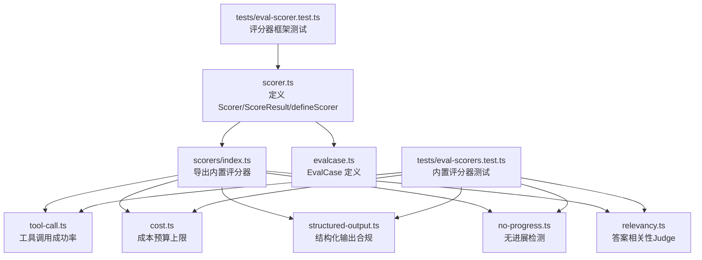
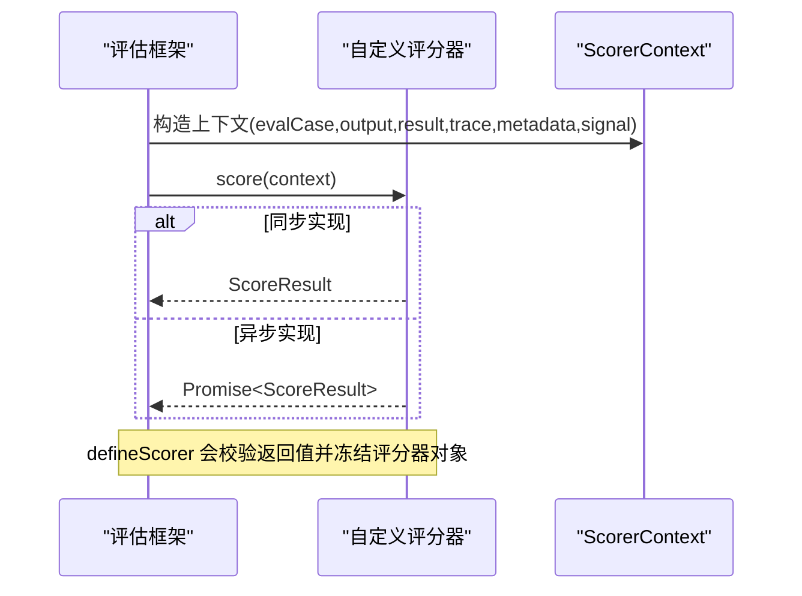
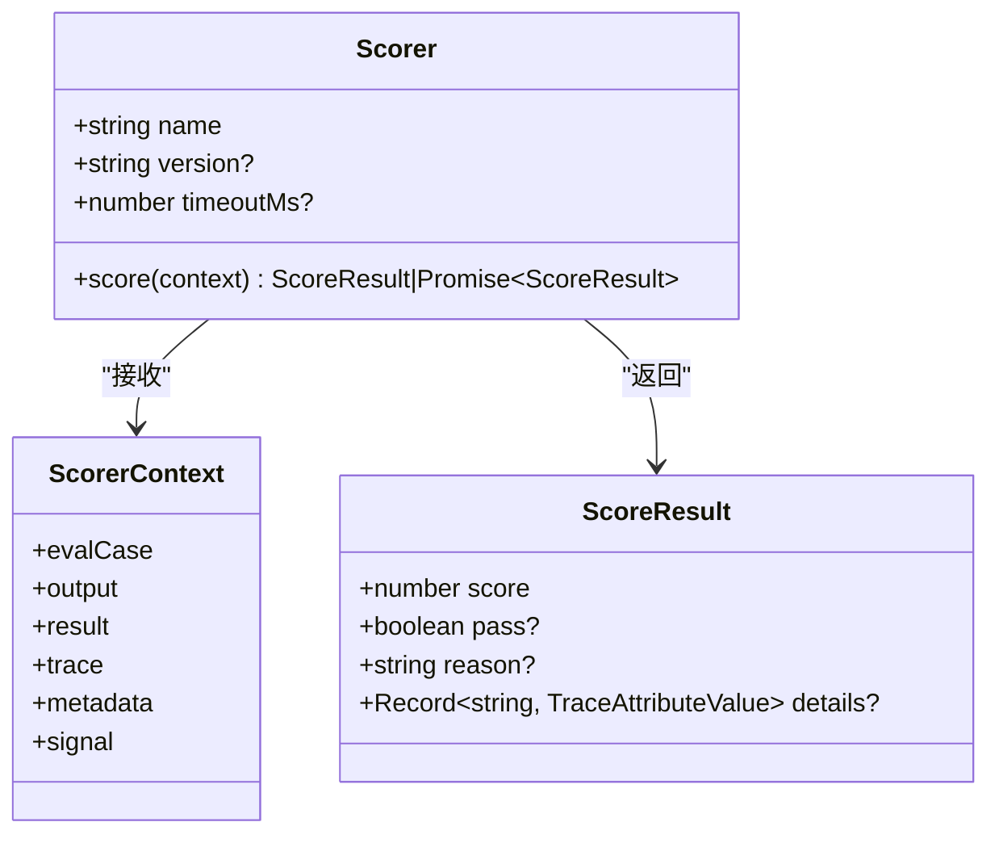
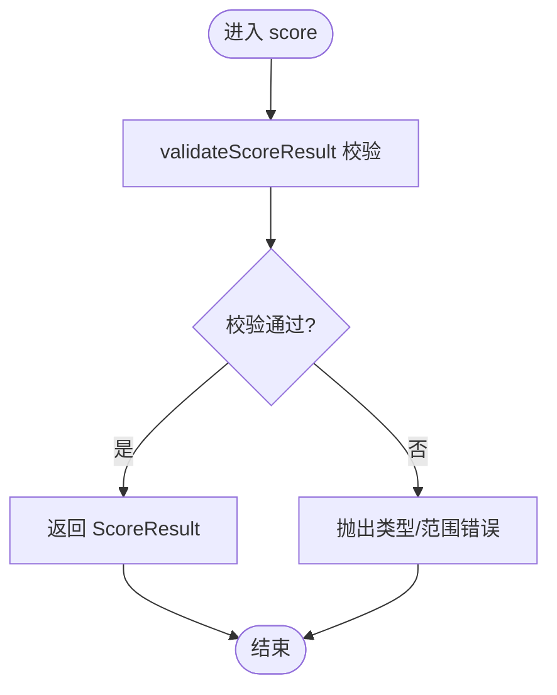
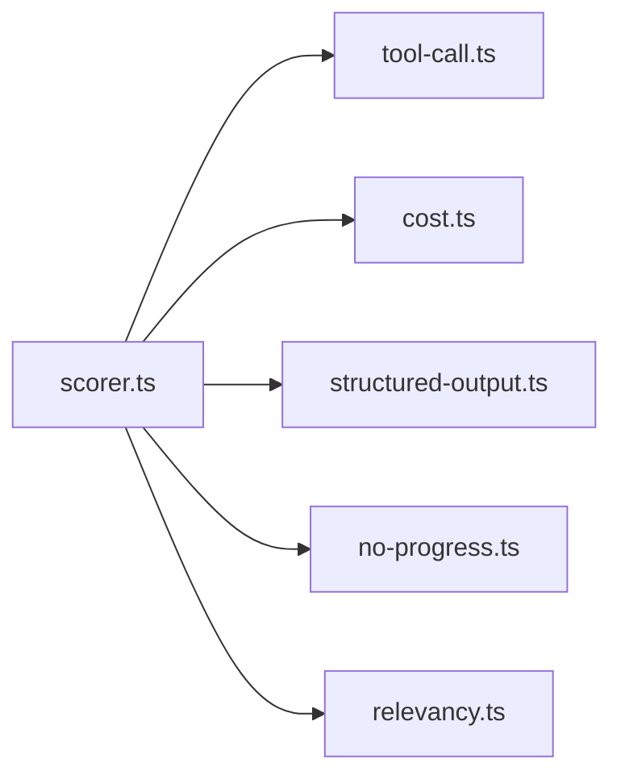

# 自定义评分器开发

<cite>
**本文引用的文件**
- [packages/core/src/eval/scorer.ts](file://packages/core/src/eval/scorer.ts)
- [packages/core/src/eval/evalcase.ts](file://packages/core/src/eval/evalcase.ts)
- [packages/core/src/eval/scorers/index.ts](file://packages/core/src/eval/scorers/index.ts)
- [packages/core/src/eval/scorers/tool-call.ts](file://packages/core/src/eval/scorers/tool-call.ts)
- [packages/core/src/eval/scorers/cost.ts](file://packages/core/src/eval/scorers/cost.ts)
- [packages/core/src/eval/scorers/structured-output.ts](file://packages/core/src/eval/scorers/structured-output.ts)
- [packages/core/src/eval/scorers/no-progress.ts](file://packages/core/src/eval/scorers/no-progress.ts)
- [packages/core/src/eval/scorers/relevancy.ts](file://packages/core/src/eval/scorers/relevancy.ts)
- [packages/core/tests/eval-scorer.test.ts](file://packages/core/tests/eval-scorer.test.ts)
- [packages/core/tests/eval-scorers.test.ts](file://packages/core/tests/eval-scorers.test.ts)
</cite>

## 目录
1. [简介](#简介)
2. [项目结构](#项目结构)
3. [核心组件](#核心组件)
4. [架构总览](#架构总览)
5. [详细组件分析](#详细组件分析)
6. [依赖关系分析](#依赖关系分析)
7. [性能考虑](#性能考虑)
8. [故障排查指南](#故障排查指南)
9. [结论](#结论)
10. [附录](#附录)

## 简介
本指南面向希望为 Open Multi Agent 评估系统编写自定义评分器的开发者。内容覆盖从需求分析、接口实现、输入验证、评分逻辑设计到错误处理与版本管理的完整流程；深入讲解 ScorerContext 的高级用法，包括如何利用 evalCase、result、trace、metadata、signal 等上下文信息完成复杂评分；详细说明 ScoreResult 的结构（score、pass、reason、details）及其约束；并提供可复用的参考实现、单元测试要点与性能优化建议。

## 项目结构
评估与评分相关代码集中在 packages/core/src/eval 目录下：
- 评分器定义与校验：scorer.ts
- 评估用例定义：evalcase.ts
- 内置评分器集合：scorers/*（工具调用成功率、结构化输出合规、成本预算、无进展检测、答案相关性等）
- 测试：tests/eval-scorer*.test.ts

图表来源
- [packages/core/src/eval/scorer.ts:1-168](file://packages/core/src/eval/scorer.ts#L1-L168)
- [packages/core/src/eval/evalcase.ts:1-11](file://packages/core/src/eval/evalcase.ts#L1-L11)
- [packages/core/src/eval/scorers/index.ts:1-12](file://packages/core/src/eval/scorers/index.ts#L1-L12)
- [packages/core/src/eval/scorers/tool-call.ts:1-60](file://packages/core/src/eval/scorers/tool-call.ts#L1-L60)
- [packages/core/src/eval/scorers/cost.ts:1-78](file://packages/core/src/eval/scorers/cost.ts#L1-L78)
- [packages/core/src/eval/scorers/structured-output.ts:1-36](file://packages/core/src/eval/scorers/structured-output.ts#L1-L36)
- [packages/core/src/eval/scorers/no-progress.ts:1-113](file://packages/core/src/eval/scorers/no-progress.ts#L1-L113)
- [packages/core/src/eval/scorers/relevancy.ts:1-32](file://packages/core/src/eval/scorers/relevancy.ts#L1-L32)
- [packages/core/tests/eval-scorer.test.ts:1-141](file://packages/core/tests/eval-scorer.test.ts#L1-L141)
- [packages/core/tests/eval-scorers.test.ts:1-341](file://packages/core/tests/eval-scorers.test.ts#L1-L341)

章节来源
- [packages/core/src/eval/scorer.ts:1-168](file://packages/core/src/eval/scorer.ts#L1-L168)
- [packages/core/src/eval/evalcase.ts:1-11](file://packages/core/src/eval/evalcase.ts#L1-L11)
- [packages/core/src/eval/scorers/index.ts:1-12](file://packages/core/src/eval/scorers/index.ts#L1-L12)

## 核心组件
- ScorerContext：评分器运行时上下文，包含 evalCase、output、result、trace、metadata、signal。
- ScoreResult：标准化评分结果，包含 score（[0,1]）、可选 pass、reason、details（TraceAttributeValue 的只读记录）。
- Scorer：命名且可选版本的评分器，提供 score(context) 同步或异步方法。
- defineScorer：对评分器进行定义校验与结果校验，冻结返回对象，并统一处理异常传播（不将错误转换为零分）。

关键要点
- 评分失败应抛出异常，而不是返回 0 分；框架会将异常记录为 scorer_error。
- details 的值必须是可序列化的 TraceAttributeValue（字符串、布尔、有限数字、同类型数组等）。
- 未设置 version 会发出一次警告，便于基线对比与漂移检测。

章节来源
- [packages/core/src/eval/scorer.ts:12-37](file://packages/core/src/eval/scorer.ts#L12-L37)
- [packages/core/src/eval/scorer.ts:88-124](file://packages/core/src/eval/scorer.ts#L88-L124)
- [packages/core/src/eval/scorer.ts:133-167](file://packages/core/src/eval/scorer.ts#L133-L167)
- [packages/core/tests/eval-scorer.test.ts:21-99](file://packages/core/tests/eval-scorer.test.ts#L21-L99)

## 架构总览
评分器通过 defineScorer 包装后，由评估框架在运行期间注入 ScorerContext 并执行。评分器可读取：
- evalCase：用例输入、期望、标签与元数据
- output：被评估的输出
- result：AgentRunResult/TeamRunResult/ConsensusResult，用于统计 token、工具调用、结构化输出等
- trace：StoredRun，包含 spans、costs、tokens 等观测数据
- metadata：额外键值对
- signal：支持中断的 AbortSignal

图表来源
- [packages/core/src/eval/scorer.ts:12-37](file://packages/core/src/eval/scorer.ts#L12-L37)
- [packages/core/src/eval/scorer.ts:133-167](file://packages/core/src/eval/scorer.ts#L133-L167)

## 详细组件分析

### 评分器接口与结果规范
- ScorerContext
  - evalCase：用例标识、输入、期望、标签与元数据
  - output：待评估输出
  - result：可为 AgentRunResult、TeamRunResult 或 ConsensusResult
  - trace：StoredRun，含 spans、costs、tokens 等
  - metadata：扩展键值
  - signal：AbortSignal，用于取消
- ScoreResult
  - score：必须为 [0,1] 的有限数
  - pass：可选布尔，表示是否“通过”
  - reason：可选字符串，解释评分原因
  - details：可选只读记录，值为 TraceAttributeValue

图表来源
- [packages/core/src/eval/scorer.ts:12-37](file://packages/core/src/eval/scorer.ts#L12-L37)

章节来源
- [packages/core/src/eval/scorer.ts:12-37](file://packages/core/src/eval/scorer.ts#L12-L37)
- [packages/core/src/eval/scorer.ts:88-124](file://packages/core/src/eval/scorer.ts#L88-L124)

### 输入验证与错误处理
- defineScorer 会校验 Scorer.name、score 函数存在性，并在缺少 version 时发出一次性警告。
- 每次 score 调用的返回值会被 validateScoreResult 严格校验：
  - score 必须在 [0,1] 且为有限数
  - pass 若提供则必须为布尔
  - reason 若提供则必须为字符串
  - details 若提供则必须为对象且所有值为合法的 TraceAttributeValue
- 任何抛出的异常都会原样传播，不会被转换为 0 分；评估框架会以 scorer_error 状态记录。

图表来源
- [packages/core/src/eval/scorer.ts:88-124](file://packages/core/src/eval/scorer.ts#L88-L124)
- [packages/core/src/eval/scorer.ts:133-167](file://packages/core/src/eval/scorer.ts#L133-L167)

章节来源
- [packages/core/src/eval/scorer.ts:88-124](file://packages/core/src/eval/scorer.ts#L88-L124)
- [packages/core/tests/eval-scorer.test.ts:63-99](file://packages/core/tests/eval-scorer.test.ts#L63-L99)

### 高级用法：利用 ScorerContext 做复杂评分
- 基于 evalCase.expected 与 output 的精确匹配或相似度判断
- 基于 result.toolCalls 或 trace.spans 中 tool 子跨度统计成功率
- 基于 result.tokenUsage 或 trace.tokens 计算总 token 并与预算比较
- 基于 trace.costs 汇总成本并检查币种一致性
- 基于 trace.spans 识别任务依赖链完整性、重复工作、无进展（连续失败且无工具调用）
- 使用 metadata 携带提示词版本、模型名等辅助信息
- 使用 signal 监听取消信号，及时退出耗时计算

示例参考路径
- 工具调用成功率：[packages/core/src/eval/scorers/tool-call.ts:22-59](file://packages/core/src/eval/scorers/tool-call.ts#L22-L59)
- 成本预算上限：[packages/core/src/eval/scorers/cost.ts:23-76](file://packages/core/src/eval/scorers/cost.ts#L23-L76)
- 结构化输出合规：[packages/core/src/eval/scorers/structured-output.ts:4-34](file://packages/core/src/eval/scorers/structured-output.ts#L4-L34)
- 无进展检测：[packages/core/src/eval/scorers/no-progress.ts:19-112](file://packages/core/src/eval/scorers/no-progress.ts#L19-L112)
- 答案相关性（Judge）：[packages/core/src/eval/scorers/relevancy.ts:23-31](file://packages/core/src/eval/scorers/relevancy.ts#L23-L31)

章节来源
- [packages/core/src/eval/scorers/tool-call.ts:1-60](file://packages/core/src/eval/scorers/tool-call.ts#L1-L60)
- [packages/core/src/eval/scorers/cost.ts:1-78](file://packages/core/src/eval/scorers/cost.ts#L1-L78)
- [packages/core/src/eval/scorers/structured-output.ts:1-36](file://packages/core/src/eval/scorers/structured-output.ts#L1-L36)
- [packages/core/src/eval/scorers/no-progress.ts:1-113](file://packages/core/src/eval/scorers/no-progress.ts#L1-L113)
- [packages/core/src/eval/scorers/relevancy.ts:1-32](file://packages/core/src/eval/scorers/relevancy.ts#L1-L32)

### 评分结果的详细结构设计
- score：必须为 [0,1] 的有限数值，用于聚合与排序
- pass：可选布尔，表达二元判定（如是否通过预算、是否成功）
- reason：可选字符串，人类可读的解释，便于调试与报告
- details：可选只读记录，用于机器可读的指标（如 total_tokens、tool_calls、applicable、data_complete 等），值需为 TraceAttributeValue

最佳实践
- 当评分器不适用时，仍返回 score=1 并在 details 中标记 applicable=false，避免误判
- 在 reason 中简明说明判断依据，在 details 中提供可量化的指标
- 使用 pass 表达硬性门槛（如预算超限），用 score 表达软性度量（如相关性）

章节来源
- [packages/core/src/eval/scorer.ts:22-29](file://packages/core/src/eval/scorer.ts#L22-L29)
- [packages/core/src/eval/scorer.ts:88-124](file://packages/core/src/eval/scorer.ts#L88-L124)
- [packages/core/tests/eval-scorers.test.ts:114-193](file://packages/core/tests/eval-scorers.test.ts#L114-L193)

### 完整自定义评分器开发示例（步骤与要点）
以下以“结构化输出合规评分器”为例，展示从零到一的开发流程（仅列步骤与参考路径，不粘贴代码）：
1. 需求分析
   - 目标：确保 Agent 输出包含结构化字段，并可按 Zod 模式校验
   - 输入：result.structured
   - 输出：score、pass、reason、details
   - 不适用场景：result 不存在 structured 时标记 applicable=false
2. 接口实现
   - 使用 defineScorer 包装，声明 name/version
   - 实现 score(context)，读取 context.result.structured
3. 输入验证
   - 若 structured 缺失，直接返回不适用结果
   - 若提供 schema，使用 safeParse 校验
4. 评分逻辑设计
   - 有且合法：score=1，pass=true
   - 缺失或不合法：score=0，pass=false
   - 在 details 中记录 structured_present、schema_checked
5. 错误处理
   - 任何异常抛出，不被捕获为 0 分
6. 单元测试
   - 覆盖：无 structured、非法结构、合法结构、不提供 schema、边界值
   - 断言：score、pass、reason、details 字段
7. 性能优化
   - 避免重复解析大对象
   - 仅在必要时执行 schema 校验
   - 合理使用 signal 提前退出

参考路径
- 实现模板：[packages/core/src/eval/scorers/structured-output.ts:4-34](file://packages/core/src/eval/scorers/structured-output.ts#L4-L34)
- 测试样例：[packages/core/tests/eval-scorers.test.ts:146-160](file://packages/core/tests/eval-scorers.test.ts#L146-L160)

章节来源
- [packages/core/src/eval/scorers/structured-output.ts:1-36](file://packages/core/src/eval/scorers/structured-output.ts#L1-L36)
- [packages/core/tests/eval-scorers.test.ts:146-160](file://packages/core/tests/eval-scorers.test.ts#L146-L160)

### 版本管理与向后兼容性
- 建议在 Scorer.version 中声明语义化版本，便于基线对比与漂移检测
- defineScorer 在未设置 version 时会发出一次性警告
- 变更策略
  - 新增 fields：保持向后兼容，旧版评分器仍可运行
  - 改变含义或阈值：升级 version 并更新文档
  - 破坏性变更：发布新版本评分器，保留旧版本供回滚
- 测试覆盖
  - 验证不同版本行为一致或符合预期差异
  - 针对缺失字段提供默认值与降级逻辑

章节来源
- [packages/core/src/eval/scorer.ts:143-149](file://packages/core/src/eval/scorer.ts#L143-L149)
- [packages/core/tests/eval-scorer.test.ts:101-133](file://packages/core/tests/eval-scorer.test.ts#L101-L133)
- [packages/core/tests/eval-scorers.test.ts:286-339](file://packages/core/tests/eval-scorers.test.ts#L286-L339)

## 依赖关系分析
- 评分器均依赖 defineScorer 提供的定义与校验能力
- 内置评分器分别依赖不同类型的上下文数据：
  - tool-call：result.toolCalls 或 trace.spans（kind='tool'）
  - cost：result.tokenUsage/totalTokenUsage 与 trace.costs
  - structured-output：result.structured 与可选 schema
  - no-progress：trace.spans（task/agent/llm/tool）及属性
  - relevancy：judge 模板与 LLM 适配器

图表来源
- [packages/core/src/eval/scorer.ts:1-168](file://packages/core/src/eval/scorer.ts#L1-L168)
- [packages/core/src/eval/scorers/tool-call.ts:1-60](file://packages/core/src/eval/scorers/tool-call.ts#L1-L60)
- [packages/core/src/eval/scorers/cost.ts:1-78](file://packages/core/src/eval/scorers/cost.ts#L1-L78)
- [packages/core/src/eval/scorers/structured-output.ts:1-36](file://packages/core/src/eval/scorers/structured-output.ts#L1-L36)
- [packages/core/src/eval/scorers/no-progress.ts:1-113](file://packages/core/src/eval/scorers/no-progress.ts#L1-L113)
- [packages/core/src/eval/scorers/relevancy.ts:1-32](file://packages/core/src/eval/scorers/relevancy.ts#L1-L32)

章节来源
- [packages/core/src/eval/scorers/index.ts:1-12](file://packages/core/src/eval/scorers/index.ts#L1-L12)

## 性能考虑
- 优先使用 result 中的轻量字段（如 toolCalls.length、tokenUsage）减少遍历
- 需要深度分析 trace 时，尽量限定 span.kind 与必要属性过滤，避免全量扫描
- 对大对象进行 schema 校验前，先做快速预检（是否存在、类型是否正确）
- 合理设置 maxStallTurns、maxTokens、maxCostAmount 等阈值，避免过度计算
- 使用 signal 在长时间计算中响应取消，防止阻塞评估流水线
- 对于 Judge 类评分器，控制并发与重试次数，避免超出预算

[本节为通用指导，无需特定文件引用]

## 故障排查指南
常见问题与定位方法
- 评分结果为 NaN 或越界：检查 score 计算逻辑，确保返回 [0,1] 的有限数
- details 校验失败：确认所有值为 TraceAttributeValue（字符串、布尔、有限数字、同类型数组）
- 评分器报错但未产生分数：查看评估记录 status 是否为 scorer_error，并检查异常堆栈
- 未生效的评分器：确认已正确导出并通过 index.ts 暴露
- 多币种成本比较失败：确保 trace.costs 中币种单一，或拆分评分维度

参考路径
- 结果校验与异常传播：[packages/core/src/eval/scorer.ts:88-124](file://packages/core/src/eval/scorer.ts#L88-L124)
- 成本预算多币种限制：[packages/core/src/eval/scorers/cost.ts:38-41](file://packages/core/src/eval/scorers/cost.ts#L38-L41)
- 测试覆盖的错误场景：[packages/core/tests/eval-scorers.test.ts:183-192](file://packages/core/tests/eval-scorers.test.ts#L183-L192)

章节来源
- [packages/core/src/eval/scorer.ts:88-124](file://packages/core/src/eval/scorer.ts#L88-L124)
- [packages/core/src/eval/scorers/cost.ts:38-41](file://packages/core/src/eval/scorers/cost.ts#L38-L41)
- [packages/core/tests/eval-scorers.test.ts:183-192](file://packages/core/tests/eval-scorers.test.ts#L183-L192)

## 结论
通过 defineScorer 与严格的 ScoreResult 校验，Open Multi Agent 提供了稳定、可追溯、可扩展的评分体系。借助 ScorerContext 的丰富上下文（evalCase、result、trace、metadata、signal），可以构建从简单规则到复杂 Judge 驱动的多样化评分器。遵循版本管理、输入验证与错误处理的最佳实践，并结合单元测试与性能优化，能够持续提升评估质量与可维护性。

[本节为总结性内容，无需特定文件引用]

## 附录
- 快速上手清单
  - 明确评分目标与适用条件
  - 选择合适的数据源（result/trace/metadata）
  - 实现 score 函数并返回标准 ScoreResult
  - 使用 defineScorer 包装并设置 name/version
  - 编写单元测试覆盖正常、异常与不适用场景
  - 加入性能与取消信号处理
  - 持续迭代版本并记录变更

[本节为补充信息，无需特定文件引用]