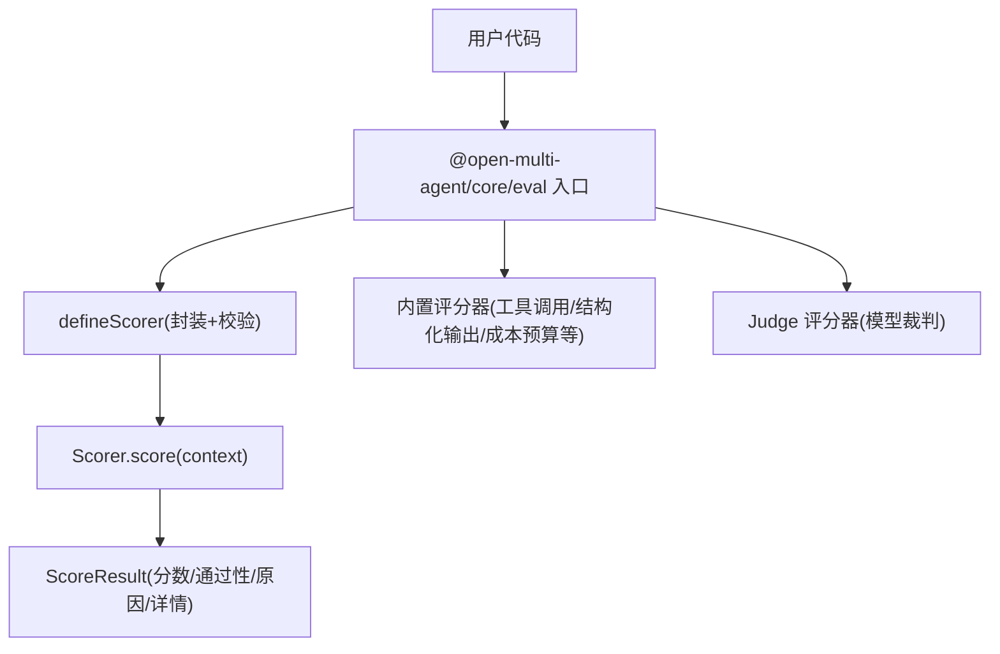
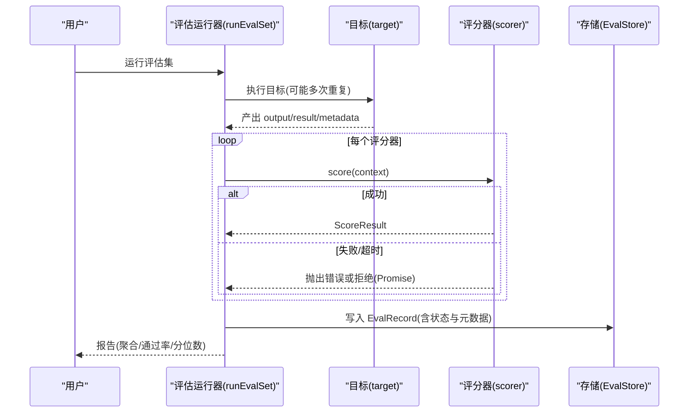
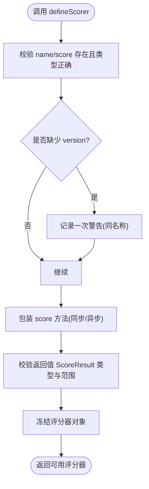
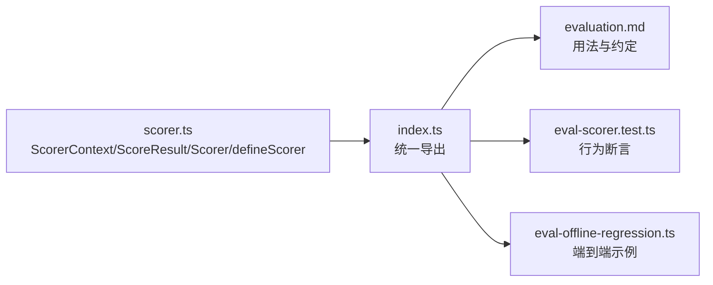

# 评分器基础概念

<cite>
**本文引用的文件**
- [scorer.ts](file://packages/core/src/eval/scorer.ts)
- [evaluation.md](file://docs/evaluation.md)
- [index.ts](file://packages/core/src/eval/index.ts)
- [eval-scorer.test.ts](file://packages/core/tests/eval-scorer.test.ts)
- [eval-offline-regression.ts](file://packages/core/examples/patterns/eval-offline-regression.ts)
</cite>

## 目录
1. [简介](#简介)
2. [项目结构](#项目结构)
3. [核心组件](#核心组件)
4. [架构总览](#架构总览)
5. [详细组件分析](#详细组件分析)
6. [依赖关系分析](#依赖关系分析)
7. [性能与超时控制](#性能与超时控制)
8. [故障排查指南](#故障排查指南)
9. [结论](#结论)
10. [附录：创建第一个自定义评分器的完整示例](#附录创建第一个自定义评分器的完整示例)

## 简介
本章节面向首次接触 OMA 评估体系的读者，系统介绍“评分器”的基础概念、核心接口与使用方式。你将了解：
- ScorerContext 的字段含义与典型使用场景
- ScoreResult 的结构、字段约束与语义
- defineScorer 的作用、验证机制与最佳实践
- 评分器的命名、版本管理与超时控制策略
- 如何从零开始实现同步与异步评分器，并集成到离线或在线评估流程中

## 项目结构
评分器相关能力集中在 core 包的 eval 子路径下，对外通过统一入口导出类型与工厂函数。关键文件职责如下：
- scorer.ts：定义 ScorerContext、ScoreResult、Scorer 以及 defineScorer 工厂
- index.ts：聚合导出评分器相关类型与工具（如 judge、内置 scorers）
- evaluation.md：官方文档，包含用法、行为约定与示例
- tests/eval-scorer.test.ts：对 defineScorer 的行为进行断言式验证
- examples/patterns/eval-offline-regression.ts：离线回归评测的端到端示例

图表来源
- [index.ts:1-13](file://packages/core/src/eval/index.ts#L1-L13)
- [scorer.ts:12-37](file://packages/core/src/eval/scorer.ts#L12-L37)

章节来源
- [index.ts:1-60](file://packages/core/src/eval/index.ts#L1-L60)
- [evaluation.md:20-45](file://docs/evaluation.md#L20-L45)

## 核心组件
- ScorerContext：评分器接收到的上下文，包含被测用例、输出、运行结果、追踪信息、元数据与取消信号
- ScoreResult：评分器返回的标准化结果，包含数值分数、可选通过标记、原因和可序列化的详情
- Scorer：一个带名称、可选版本、可选超时与 score 方法的评分器对象
- defineScorer：对评分器定义进行校验、冻结，并对每次 score 调用的返回值进行严格校验

章节来源
- [scorer.ts:12-37](file://packages/core/src/eval/scorer.ts#L12-L37)
- [scorer.ts:88-124](file://packages/core/src/eval/scorer.ts#L88-L124)
- [scorer.ts:133-167](file://packages/core/src/eval/scorer.ts#L133-L167)

## 架构总览
评分器在评估流水线中的位置如下：
- 离线评估：runEvalSet 驱动目标执行，随后串行运行一组评分器
- 在线评估：OpenMultiAgent 在业务运行完成后，按采样策略将样本入队，后台执行评分器并写入存储
- 评分器失败不会把分数归零，而是记录为 scorer_error，不影响业务结果

图表来源
- [evaluation.md:90-138](file://docs/evaluation.md#L90-L138)
- [evaluation.md:140-211](file://docs/evaluation.md#L140-L211)

## 详细组件分析

### ScorerContext：字段与作用
- evalCase：当前评测用例，包含 id、input、expected 等，用于规则比对或提示构造
- output：目标产出的主输出，供评分器直接读取
- result：完整的运行结果（AgentRunResult/TeamRunResult/ConsensusResult），可用于统计 token 用量、任务拓扑等
- trace：当提供 traceStore 时，加载对应 StoredRun，便于基于追踪数据的结构性指标（如依赖利用率、无进展检测）
- metadata：经过验证的键值对元数据，常用于标注 prompt 版本、部署环境等
- signal：AbortSignal，允许评分器响应取消/超时，避免无效计算

使用建议
- 仅读取必要字段，减少序列化与网络开销
- 在需要访问追踪信息时使用 trace，但注意在线模式下通常不加载 trace
- 利用 metadata 区分不同 prompt/配置版本，便于基线对比

章节来源
- [scorer.ts:12-20](file://packages/core/src/eval/scorer.ts#L12-L20)
- [evaluation.md:40-45](file://docs/evaluation.md#L40-L45)
- [evaluation.md:416-418](file://docs/evaluation.md#L416-L418)

### ScoreResult：结构与约束
- score：必须在 [0, 1] 范围内的有限数值；非有限数或越界会触发 RangeError
- pass：可选布尔值，表示是否“通过”，由门控阈值决定最终判定
- reason：可选字符串，解释评分原因
- details：可选的 TraceAttributeValue 记录，用于附加机器可读的详情（如计数、标签）

约束与错误处理
- 任何字段类型不符都会抛出 TypeError
- 分数越界或非有限数抛出 RangeError
- 评分器抛错/拒绝不会被转换为 0 分，而是作为 scorer_error 记录

章节来源
- [scorer.ts:22-29](file://packages/core/src/eval/scorer.ts#L22-L29)
- [scorer.ts:88-124](file://packages/core/src/eval/scorer.ts#L88-L124)
- [evaluation.md:47-52](file://docs/evaluation.md#L47-L52)

### defineScorer：工厂与验证机制
作用
- 校验评分器定义：name 必须是非空字符串，score 必须是函数
- 冻结返回的评分器对象，防止运行时被篡改
- 支持同步与异步 score 方法，统一包装 Promise 并校验返回值
- 未设置 version 时会发出一次警告（同一名称），以便门控能区分评分逻辑漂移与目标漂移

验证流程

图表来源
- [scorer.ts:133-167](file://packages/core/src/eval/scorer.ts#L133-L167)

章节来源
- [scorer.ts:133-167](file://packages/core/src/eval/scorer.ts#L133-L167)
- [eval-scorer.test.ts:21-99](file://packages/core/tests/eval-scorer.test.ts#L21-L99)

### 评分器的命名、版本管理与超时控制
- 命名：name 用于标识评分器，需唯一且具描述性
- 版本：version 用于区分评分逻辑变更（规则、提示词、裁判模型/配置），变更时应递增
- 超时：Scorer 可声明 timeoutMs；超过时限会被视为失败，记录为 scorer_error，而非 0 分
- 取消：通过 context.signal 主动中止耗时操作，避免浪费资源

章节来源
- [scorer.ts:31-37](file://packages/core/src/eval/scorer.ts#L31-L37)
- [evaluation.md:45-49](file://docs/evaluation.md#L45-L49)

## 依赖关系分析
- 类型依赖：ScorerContext 引用了 EvalCase、AgentRunResult/TeamRunResult/ConsensusResult、TraceAttributeValue、StoredRun 等
- 模块导出：eval 子路径统一从 index.ts 暴露 defineScorer、ScoreResult、Scorer、内置评分器与 Judge 评分器
- 测试覆盖：单元测试验证了 defineScorer 的输入校验、返回值校验、同步/异步支持与错误传播

图表来源
- [index.ts:1-13](file://packages/core/src/eval/index.ts#L1-L13)
- [scorer.ts:12-37](file://packages/core/src/eval/scorer.ts#L12-L37)

章节来源
- [index.ts:1-60](file://packages/core/src/eval/index.ts#L1-L60)
- [eval-scorer.test.ts:101-141](file://packages/core/tests/eval-scorer.test.ts#L101-L141)

## 性能与超时控制
- 评分器失败不计入平均分与通过率，避免污染统计口径
- 在线评估默认保守：并发低、队列有上限、负载隔离于业务结果之外
- 建议在评分器内部检查 context.signal 以快速退出长耗时任务
- 对于模型裁判评分器，可通过 timeoutMs 限制单次裁判调用时间

章节来源
- [evaluation.md:47-52](file://docs/evaluation.md#L47-L52)
- [evaluation.md:140-211](file://docs/evaluation.md#L140-L211)

## 故障排查指南
常见问题与定位要点
- 评分结果为 NaN 或超出 [0,1]：检查 score 计算逻辑，确保返回有限数值
- details 字段类型非法：确保值为 string/number/boolean 或其数组，且元素类型一致
- 评分器报错未影响业务：这是预期行为，查看报告中的 scorer_error 记录
- 未设置 version：关注控制台警告，及时升级版本号以支持基线对比

章节来源
- [scorer.ts:88-124](file://packages/core/src/eval/scorer.ts#L88-L124)
- [evaluation.md:47-52](file://docs/evaluation.md#L47-L52)

## 结论
评分器是 OMA 评估体系的核心构件，通过标准化的上下文与结果契约，使规则型与模型型评分器可以无缝协作。遵循命名与版本管理、合理设置超时与取消、严格校验返回值，能够构建稳定可追溯的质量度量体系。

## 附录：创建第一个自定义评分器的完整示例

### 同步评分器示例（精确匹配）
- 目标：比较 output 与 evalCase.expected，命中则得分为 1 并通过
- 关键点：使用 defineScorer 包装，返回 { score, pass }
- 参考路径
  - [evaluation.md:22-45](file://docs/evaluation.md#L22-L45)
  - [eval-offline-regression.ts:68-75](file://packages/core/examples/patterns/eval-offline-regression.ts#L68-L75)

### 异步评分器示例（长度评分）
- 目标：根据输出长度给出分数，并设定通过阈值
- 关键点：score 可为 async，框架自动包装 Promise 并校验返回值
- 参考路径
  - [evaluation.md:150-161](file://docs/evaluation.md#L150-L161)
  - [eval-scorer.test.ts:38-49](file://packages/core/tests/eval-scorer.test.ts#L38-L49)

### 集成到离线评估
- 步骤
  - 定义 EvalSet（cases/tags/repeats）
  - 定义目标 target（可直接用字符串或 Agent/Team/Plan 包装）
  - 注册评分器列表（规则 + 裁判）
  - 运行 runEvalSet 并生成报告
- 参考路径
  - [evaluation.md:90-138](file://docs/evaluation.md#L90-L138)
  - [eval-offline-regression.ts:59-112](file://packages/core/examples/patterns/eval-offline-regression.ts#L59-L112)

### 集成到在线评估
- 步骤
  - 在 OpenMultiAgent 配置 evaluation.scorers、sample、store 等
  - 业务运行完成后，评分器在后台执行，不阻塞业务结果
  - 使用 forceFlush/shutdown 安全收尾
- 参考路径
  - [evaluation.md:140-211](file://docs/evaluation.md#L140-L211)
  - [evaluation.md:241-285](file://docs/evaluation.md#L241-L285)