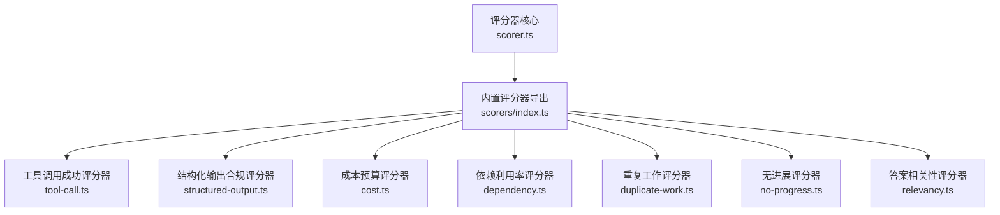
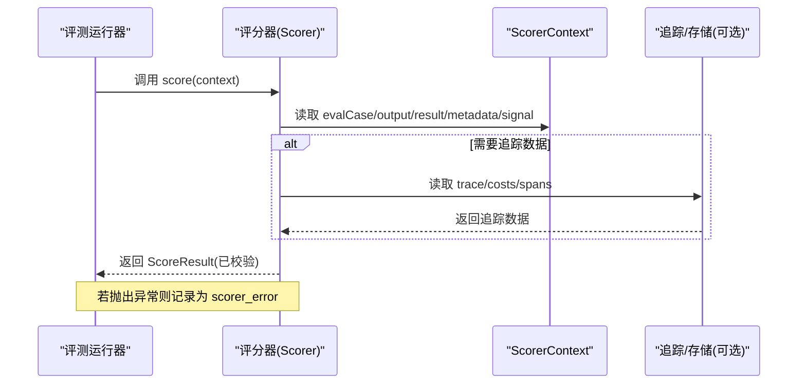
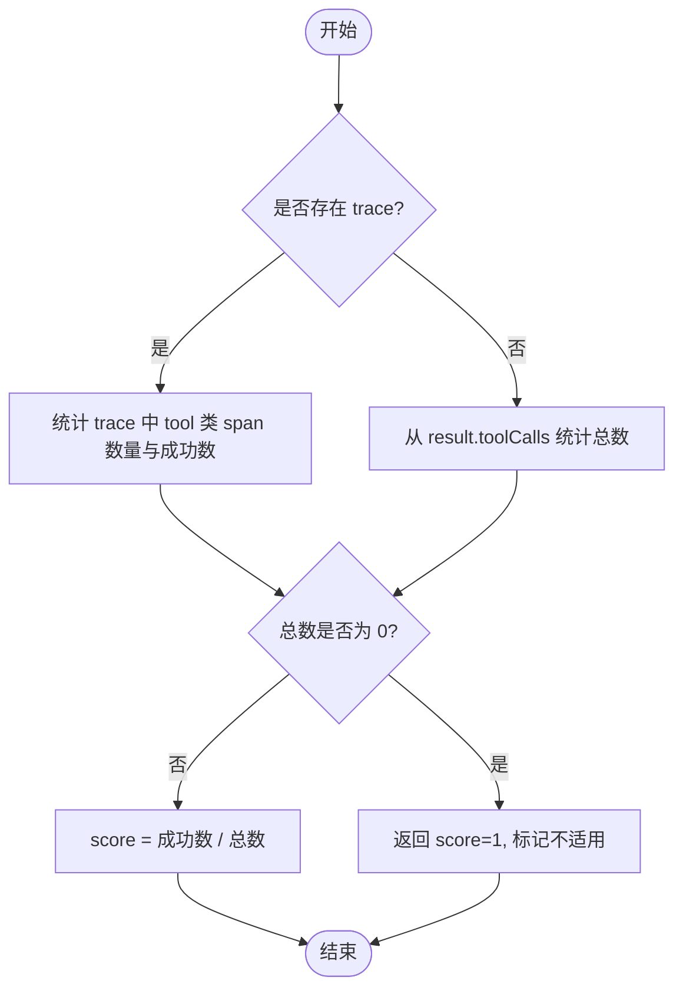
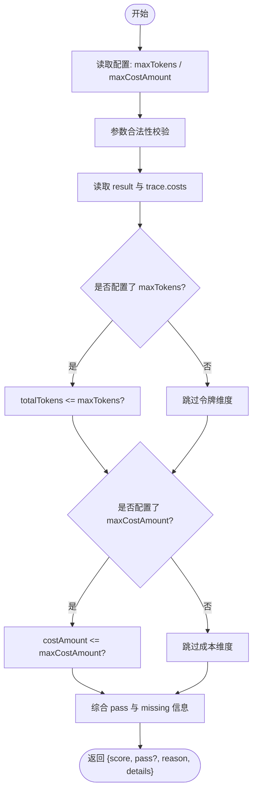
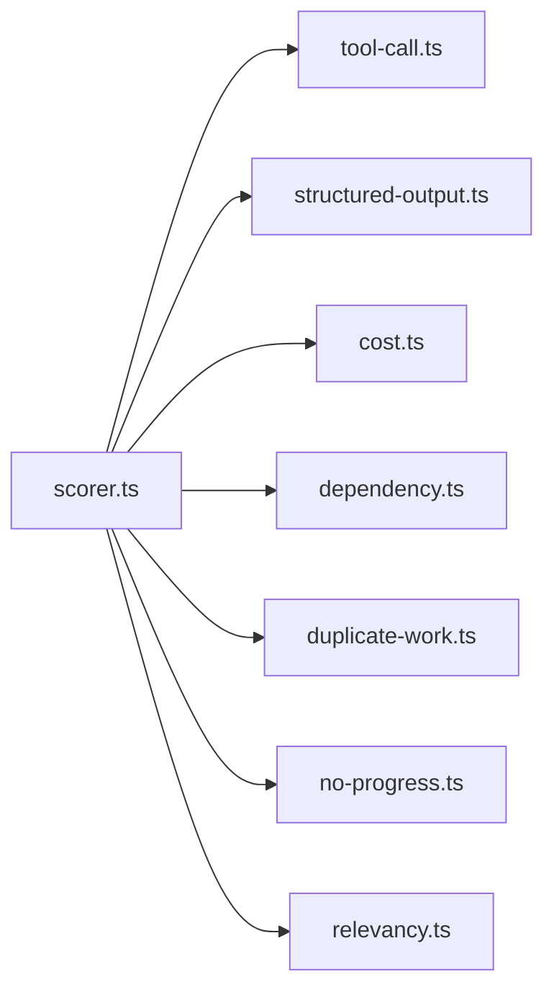

# 评分器系统

<cite>
**本文引用的文件**
- [scorer.ts](file://packages/core/src/eval/scorer.ts)
- [index.ts（内置评分器导出）](file://packages/core/src/eval/scorers/index.ts)
- [tool-call.ts](file://packages/core/src/eval/scorers/tool-call.ts)
- [structured-output.ts](file://packages/core/src/eval/scorers/structured-output.ts)
- [cost.ts](file://packages/core/src/eval/scorers/cost.ts)
- [dependency.ts](file://packages/core/src/eval/scorers/dependency.ts)
- [duplicate-work.ts](file://packages/core/src/eval/scorers/duplicate-work.ts)
- [no-progress.ts](file://packages/core/src/eval/scorers/no-progress.ts)
- [relevancy.ts](file://packages/core/src/eval/scorers/relevancy.ts)
- [evaluation.md](file://docs/evaluation.md)
- [eval-scorer.test.ts](file://packages/core/tests/eval-scorer.test.ts)
- [eval-scorers.test.ts](file://packages/core/tests/eval-scorers.test.ts)
</cite>

## 目录
1. [简介](#简介)
2. [项目结构](#项目结构)
3. [核心组件](#核心组件)
4. [架构总览](#架构总览)
5. [详细组件分析](#详细组件分析)
6. [依赖关系分析](#依赖关系分析)
7. [性能考虑](#性能考虑)
8. [故障排查指南](#故障排查指南)
9. [结论](#结论)
10. [附录](#附录)

## 简介
本文件系统性地介绍 Open Multi Agent 的评分器子系统，覆盖以下主题：
- defineScorer 的使用方法，包括同步与异步评分器的创建与结果校验
- 评分器上下文 ScorerContext 的字段含义与使用方式
- 内置参考评分器：exact-match、toolCallSuccessScorer、structuredOutputComplianceScorer、costBudgetScorer、dependencyUtilizationScorer、duplicateWorkScorer、noProgressScorer、createAnswerRelevancyScorer
- 自定义评分器的最佳实践：输入验证、评分逻辑、错误处理、版本管理
- 组合使用策略与性能优化建议

## 项目结构
评分器相关代码集中在 packages/core/src/eval 目录下：
- 核心定义与工厂：scorer.ts（defineScorer、ScoreResult、ScorerContext、工具函数）
- 内置评分器：scorers 子目录下的多个实现文件，统一通过 index.ts 导出
- 文档与测试：docs/evaluation.md 提供使用说明；tests 下包含行为断言与边界用例

**图表来源**
- [scorer.ts:12-37](file://packages/core/src/eval/scorer.ts#L12-L37)
- [index.ts（内置评分器导出）:1-12](file://packages/core/src/eval/scorers/index.ts#L1-L12)

**章节来源**
- [scorer.ts:12-37](file://packages/core/src/eval/scorer.ts#L12-L37)
- [index.ts（内置评分器导出）:1-12](file://packages/core/src/eval/scorers/index.ts#L1-L12)

## 核心组件
- ScorerContext：评分器运行时上下文，包含评估用例、目标输出、运行结果、追踪数据、元数据与中止信号。
- ScoreResult：标准化评分结果，分数为[0,1]的有限数，可选 pass、reason、details。
- Scorer：命名且可版本的评分器接口，score 方法支持同步或异步返回 ScoreResult。
- defineScorer：对评分器定义进行校验、冻结并包装 score 方法，确保返回值符合规范，同时传播异常而非降级为零分。

关键要点
- 分数必须为[0,1]的有限数值；details 的值需为可序列化的 TraceAttributeValue。
- 未提供 version 时仅警告一次，便于基线对比时区分“评分逻辑漂移”和“目标漂移”。
- 评分器失败（抛错、拒绝、超时）不会被转换为零分，而是记录为 scorer_error。

**章节来源**
- [scorer.ts:12-37](file://packages/core/src/eval/scorer.ts#L12-L37)
- [scorer.ts:88-124](file://packages/core/src/eval/scorer.ts#L88-L124)
- [scorer.ts:126-167](file://packages/core/src/eval/scorer.ts#L126-L167)
- [evaluation.md:20-49](file://docs/evaluation.md#L20-L49)
- [eval-scorer.test.ts:21-99](file://packages/core/tests/eval-scorer.test.ts#L21-L99)

## 架构总览
评分器在离线 EvalSet 或在线采样中执行，读取 ScorerContext 中的 output、result、trace、metadata 等，计算质量分数并返回 ScoreResult。框架负责：
- 校验并冻结评分器定义
- 统一同步/异步结果校验
- 将评分器异常记录为 scorer_error，不影响业务结果

**图表来源**
- [scorer.ts:12-37](file://packages/core/src/eval/scorer.ts#L12-L37)
- [evaluation.md:20-49](file://docs/evaluation.md#L20-L49)

## 详细组件分析

### defineScorer 与 ScorerContext
- 作用：定义并封装评分器，强制返回规范的 ScoreResult；支持同步与异步 score；对 details 值做严格校验。
- ScorerContext 字段：
  - evalCase：当前评估用例（id、input、expected、tags 等）
  - output：目标系统的输出（字符串或对象）
  - result：AgentRunResult/TeamRunResult/ConsensusResult，用于访问 tokenUsage、toolCalls、agentResults 等
  - trace：StoredRun，包含 spans、costs、tokens 等观测数据
  - metadata：评测元数据（如 promptVersion）
  - signal：AbortSignal，用于中断长耗时评分

最佳实践
- 始终设置 name 与 version，便于基线对比与回归检测
- 仅在必要时读取 trace，避免不必要的 I/O
- 使用 signal 及时响应取消

**章节来源**
- [scorer.ts:12-37](file://packages/core/src/eval/scorer.ts#L12-L37)
- [scorer.ts:88-124](file://packages/core/src/eval/scorer.ts#L88-L124)
- [scorer.ts:126-167](file://packages/core/src/eval/scorer.ts#L126-L167)
- [evaluation.md:20-49](file://docs/evaluation.md#L20-L49)

### 内置参考评分器

#### exact-match（示例）
- 说明：比较 output 与 evalCase.expected，命中得分为 1，否则为 0。
- 适用场景：确定性规则评测，作为基线或门禁。

**章节来源**
- [evaluation.md:22-43](file://docs/evaluation.md#L22-L43)
- [eval-scorer.test.ts:101-113](file://packages/core/tests/eval-scorer.test.ts#L101-L113)

#### toolCallSuccessScorer
- 说明：统计工具调用成功率。优先基于 trace 的工具 span 状态；若无 trace，则基于 result 中的 toolCalls 计数（已完成视为成功）。
- 无工具调用时返回不适用标记与显式 reason。

**图表来源**
- [tool-call.ts:7-15](file://packages/core/src/eval/scorers/tool-call.ts#L7-L15)
- [tool-call.ts:17-20](file://packages/core/src/eval/scorers/tool-call.ts#L17-L20)
- [tool-call.ts:22-59](file://packages/core/src/eval/scorers/tool-call.ts#L22-L59)

**章节来源**
- [tool-call.ts:22-59](file://packages/core/src/eval/scorers/tool-call.ts#L22-L59)
- [eval-scorers.test.ts:113-144](file://packages/core/tests/eval-scorers.test.ts#L113-L144)

#### structuredOutputComplianceScorer
- 说明：检查 AgentRunResult 是否包含 structured 输出；若提供 Zod schema，则进行校验。
- 缺失 structured 输出视为测量到的失败（0），并非基础设施缺失。

**章节来源**
- [structured-output.ts:4-35](file://packages/core/src/eval/scorers/structured-output.ts#L4-L35)
- [eval-scorers.test.ts:146-160](file://packages/core/tests/eval-scorers.test.ts#L146-L160)

#### costBudgetScorer
- 说明：硬上限评分器，根据 maxTokens 与/或 maxCostAmount 判定是否通过。
- 数据来源：token 来自 result 的 totalTokenUsage/tokenUsage；成本来自 StoredRun.costs。
- 多币种比较会抛错，避免错误合并；缺少维度时在 reason/details 中明确标注。

**图表来源**
- [cost.ts:4-7](file://packages/core/src/eval/scorers/cost.ts#L4-L7)
- [cost.ts:9-15](file://packages/core/src/eval/scorers/cost.ts#L9-L15)
- [cost.ts:17-20](file://packages/core/src/eval/scorers/cost.ts#L17-L20)
- [cost.ts:22-77](file://packages/core/src/eval/scorers/cost.ts#L22-L77)

**章节来源**
- [cost.ts:22-77](file://packages/core/src/eval/scorers/cost.ts#L22-L77)
- [eval-scorers.test.ts:162-192](file://packages/core/tests/eval-scorers.test.ts#L162-L192)

#### dependencyUtilizationScorer
- 说明：基于任务 span 的 depends_on 链接，判断依赖链是否完整完成。
- 注意：该评分器仅证明依赖存在且成功，不保证语义上使用了前置内容。

**章节来源**
- [dependency.ts:8-12](file://packages/core/src/eval/scorers/dependency.ts#L8-L12)
- [dependency.ts:12-78](file://packages/core/src/eval/scorers/dependency.ts#L12-L78)
- [eval-scorers.test.ts:195-226](file://packages/core/tests/eval-scorers.test.ts#L195-L226)

#### duplicateWorkScorer
- 说明：对团队运行的任务输出进行两两相似度比较，使用归一化字符三元组 shingles 的 Jaccard 相似性。
- 阈值默认 0.8；少于两个非空输出时返回不适用。

**章节来源**
- [duplicate-work.ts:5-8](file://packages/core/src/eval/scorers/duplicate-work.ts#L5-L8)
- [duplicate-work.ts:30-48](file://packages/core/src/eval/scorers/duplicate-work.ts#L30-L48)
- [duplicate-work.ts:50-121](file://packages/core/src/eval/scorers/duplicate-work.ts#L50-L121)
- [eval-scorers.test.ts:228-252](file://packages/core/tests/eval-scorers.test.ts#L228-L252)

#### noProgressScorer
- 说明：检测连续失败的“无工具调用的任务-代理尝试”，作为停滞代理指标。
- 超过允许的最大连续停滞次数时，按比例扣分。

**章节来源**
- [no-progress.ts:4-7](file://packages/core/src/eval/scorers/no-progress.ts#L4-L7)
- [no-progress.ts:19-24](file://packages/core/src/eval/scorers/no-progress.ts#L19-L24)
- [no-progress.ts:26-112](file://packages/core/src/eval/scorers/no-progress.ts#L26-L112)
- [eval-scorers.test.ts:254-283](file://packages/core/tests/eval-scorers.test.ts#L254-L283)

#### createAnswerRelevancyScorer
- 说明：基于 judge 模板的答案相关性评分器，固定 verdictSchema 为 {score, reason}。
- 适合用模型裁判评估回答与输入/期望输出的直接相关性。

**章节来源**
- [relevancy.ts:6-31](file://packages/core/src/eval/scorers/relevancy.ts#L6-L31)
- [eval-scorers.test.ts:286-329](file://packages/core/tests/eval-scorers.test.ts#L286-L329)

### 自定义评分器最佳实践
- 输入验证
  - 使用 ScorerContext 提供的字段，避免强类型假设；对 optional 字段进行防御性检查。
  - 对 details 值遵循 TraceAttributeValue 约束（string/number/boolean 及其数组）。
- 评分逻辑
  - 保持幂等与可复现；尽量基于确定性的 result/trace 字段。
  - 对于复杂逻辑，优先拆分为多个小评分器组合，便于独立版本管理与调试。
- 错误处理
  - 不要将异常转换为 score=0；让框架记录为 scorer_error。
  - 对不可用数据（如无 trace）返回明确的 reason 与 details.applicable=false。
- 版本管理
  - 为每个评分器设置 version；当规则、提示词、裁判模型或配置变更时升级版本。
  - 结合基线报告进行回归检测，避免评分逻辑漂移被误判为目标漂移。

**章节来源**
- [scorer.ts:88-124](file://packages/core/src/eval/scorer.ts#L88-L124)
- [scorer.ts:126-167](file://packages/core/src/eval/scorer.ts#L126-L167)
- [evaluation.md:20-49](file://docs/evaluation.md#L20-L49)

### 评分器组合与使用模式
- 离线评测：通过 EvalSet 组织用例与评分器，批量运行并生成报告。
- 在线采样：在 OpenMultiAgent 中启用 evaluation，对部分运行进行异步采样与存储。
- 组合策略：
  - 将规则型评分器（如 exact-match、costBudgetScorer）与模型裁判型评分器（如 answer_relevancy）组合，兼顾确定性与主观质量。
  - 对多智能体 DAG，结合 dependencyUtilizationScorer、duplicateWorkScorer、noProgressScorer 观察结构与效率问题。

**章节来源**
- [evaluation.md:90-139](file://docs/evaluation.md#L90-L139)
- [evaluation.md:140-240](file://docs/evaluation.md#L140-L240)
- [index.ts（内置评分器导出）:1-12](file://packages/core/src/eval/scorers/index.ts#L1-L12)

## 依赖关系分析
评分器之间相互独立，均依赖 defineScorer 与 ScorerContext；部分评分器依赖追踪数据（trace）与运行结果（result）。

**图表来源**
- [scorer.ts:12-37](file://packages/core/src/eval/scorer.ts#L12-L37)
- [index.ts（内置评分器导出）:1-12](file://packages/core/src/eval/scorers/index.ts#L1-L12)

**章节来源**
- [scorer.ts:12-37](file://packages/core/src/eval/scorer.ts#L12-L37)
- [index.ts（内置评分器导出）:1-12](file://packages/core/src/eval/scorers/index.ts#L1-L12)

## 性能考虑
- 优先使用规则型评分器（如 exact-match、costBudgetScorer），开销低且稳定。
- 模型裁判型评分器（如 answer_relevancy）会产生额外 LLM 调用与延迟，应控制并发与配额。
- 谨慎读取 trace：大追踪数据的过滤与聚合可能带来 CPU 与内存压力。
- 在线采样采用有界队列与速率限制，避免影响主流程。
- 合理拆分评分器，减少重复计算；对昂贵操作进行缓存或去重。

[本节为通用指导，无需特定文件引用]

## 故障排查指南
常见问题与定位思路
- 评分器报错但未影响业务结果
  - 现象：记录中出现 scorer_error，不参与平均分与通过率计算。
  - 原因：评分器抛错、拒绝或超时。
  - 处理：修复评分器内部逻辑或输入校验；确认必要数据（如 trace）可用。
- 分数不在[0,1]范围
  - 现象：defineScorer 包装后抛出 RangeError。
  - 处理：确保 score 返回有限数且在范围内。
- details 值非法
  - 现象：抛出 TypeError，提示 TraceAttributeValue 不合法。
  - 处理：仅使用 string/number/boolean 及其数组。
- 成本评分器多币种冲突
  - 现象：抛出 TypeError，提示无法跨币种比较。
  - 处理：确保 trace.costs 仅含单一币种，或调整配置。

**章节来源**
- [scorer.ts:88-124](file://packages/core/src/eval/scorer.ts#L88-L124)
- [cost.ts:22-41](file://packages/core/src/eval/scorers/cost.ts#L22-L41)
- [evaluation.md:47-51](file://docs/evaluation.md#L47-L51)
- [eval-scorers.test.ts:183-192](file://packages/core/tests/eval-scorers.test.ts#L183-L192)

## 结论
评分器系统提供了统一的评分契约与丰富的内置能力，既支持快速规则评测，也支持模型裁判驱动的复杂质量度量。通过 defineScorer 的强校验与版本管理，结合离线/在线评测流程，可在保障业务稳定的前提下持续监控与提升系统质量。建议在工程中：
- 为所有评分器设置唯一 name 与 version
- 将规则型与裁判型评分器组合使用
- 利用 trace 与 result 的结构化信息构建稳健的评估体系
- 以基线与门禁机制保障回归安全

[本节为总结性内容，无需特定文件引用]

## 附录
- 快速上手：参考文档中的离线评测五步法与在线采样配置
- 报告与门禁：使用 CLI 生成报告并通过 evaluateGate 实施门禁
- 存储：InMemoryEvalStore 与 FileEvalStore 的使用与生命周期管理

**章节来源**
- [evaluation.md:90-139](file://docs/evaluation.md#L90-L139)
- [evaluation.md:140-240](file://docs/evaluation.md#L140-L240)
- [evaluation.md:287-387](file://docs/evaluation.md#L287-L387)
- [evaluation.md:420-573](file://docs/evaluation.md#L420-L573)