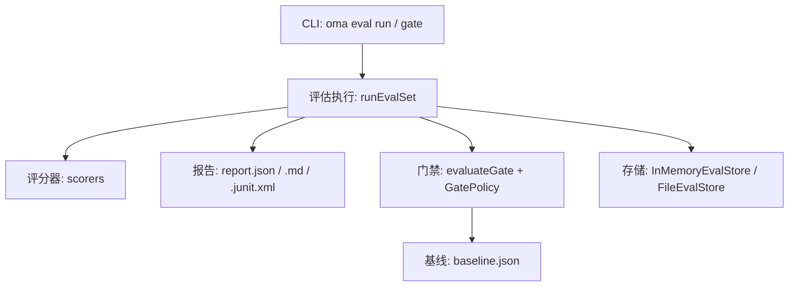
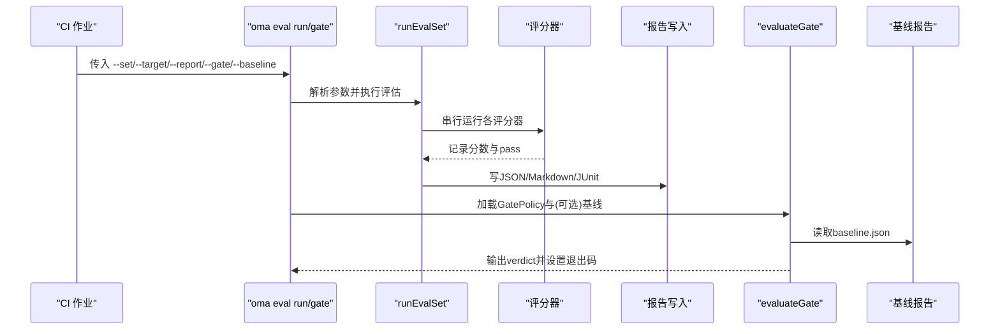
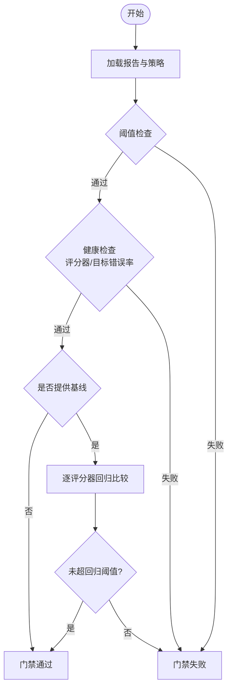
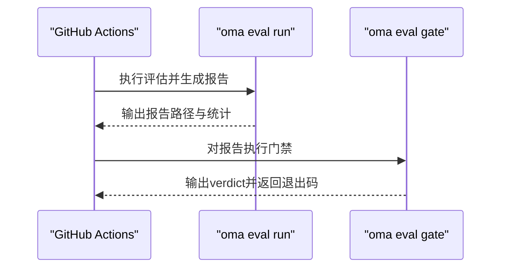
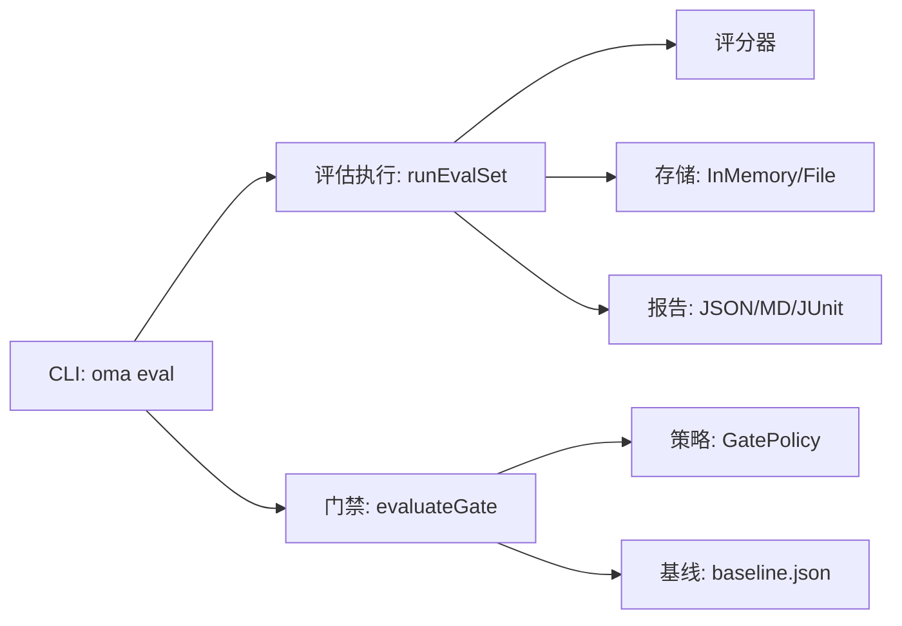

# 质量门禁

<cite>
**本文引用的文件**
- [evaluation.md](file://docs/evaluation.md)
- [cli.md](file://docs/cli.md)
- [index.ts](file://packages/core/src/index.ts)
- [eval-file-store.test.ts](file://packages/core/tests/eval-file-store.test.ts)
</cite>

## 目录
1. [简介](#简介)
2. [项目结构](#项目结构)
3. [核心组件](#核心组件)
4. [架构总览](#架构总览)
5. [详细组件分析](#详细组件分析)
6. [依赖关系分析](#依赖关系分析)
7. [性能考虑](#性能考虑)
8. [故障排查指南](#故障排查指南)
9. [结论](#结论)
10. [附录](#附录)

## 简介
本章节面向需要在 CI/CD 中落地“质量门禁”的团队，系统说明如何基于评估与门禁能力对多智能体运行结果进行离线或在线采样评测，并通过阈值、基线比较和错误率限制等策略保证质量不回归。文档重点覆盖：
- evaluateGate 函数的使用方法与配置选项（阈值、基线、错误率）
- 门禁规则定义（评分器阈值、标签过滤、百分比指标）
- 基线管理最佳实践（报告制作、版本管理、更新策略）
- 在 CI/CD 中的集成方式（命令行工具与退出码处理）
- 常见场景的门禁配置示例与故障排查

## 项目结构
质量门禁能力由“评估子系统”提供，包含评测集、评分器、报告生成、门禁判定以及 CLI 入口。关键位置如下：
- 评估与门禁 API 与 CLI：通过文档与源码子路径暴露
- 评估存储与持久化：支持内存与文件两种实现，具备幂等追加、压缩与恢复机制
- 报告与门禁：JSON 为权威格式，支持 Markdown 与 JUnit 输出；门禁判定可结合基线对比

图表来源
- [evaluation.md:420-490](file://docs/evaluation.md#L420-L490)
- [cli.md:93-174](file://docs/cli.md#L93-L174)

章节来源
- [evaluation.md:420-490](file://docs/evaluation.md#L420-L490)
- [cli.md:93-174](file://docs/cli.md#L93-L174)

## 核心组件
- 评估集与目标：定义用例、重复次数、并发度与元数据；目标封装被测对象（Agent/Team/Plan）
- 评分器：规则型或裁判型，产出 score 与可选 pass，支持按标签聚合
- 报告：权威 JSON 报告，附带 Markdown 与 JUnit 视图
- 门禁：evaluateGate 将报告与 GatePolicy 比对，并可选择与基线对比
- 存储：InMemoryEvalStore 用于短生命周期；FileEvalStore 用于本地持久化，支持压缩与恢复
- CLI：oma eval run 与 oma eval gate 提供无网络、可脚本化的执行与门禁

章节来源
- [evaluation.md:20-139](file://docs/evaluation.md#L20-L139)
- [evaluation.md:287-387](file://docs/evaluation.md#L287-L387)
- [evaluation.md:420-490](file://docs/evaluation.md#L420-L490)
- [cli.md:93-174](file://docs/cli.md#L93-L174)

## 架构总览
下图展示从 CLI 到评估执行、评分、报告与门禁的完整流程，以及与基线的对比关系。

图表来源
- [cli.md:93-174](file://docs/cli.md#L93-L174)
- [evaluation.md:420-490](file://docs/evaluation.md#L420-L490)

## 详细组件分析

### evaluateGate 函数：用法与配置
- 作用：将当前评估报告与门禁策略（阈值、健康检查、基线回归）进行比对，返回门禁裁决（pass/failures/warnings）。
- 输入：
  - 报告：权威 JSON 格式的 EvalRunReport
  - 策略：schemaVersion、thresholds、maxScorerErrorRate、maxTargetErrorRate、baseline
  - 基线（可选）：上一版本的 EvalRunReport
- 关键配置项：
  - thresholds：支持 avg/p50/p95/min/passRate，可指定 scorer 与 tag 范围
  - maxScorerErrorRate：评分器错误占比上限
  - maxTargetErrorRate：目标错误占比上限
  - baseline.maxRegression：整体回归容忍度
  - baseline.perScorer：按评分器维度设定回归容忍度
- 行为要点：
  - 缺失评分器/标签/源会视为配置失败而非静默通过
  - 评分器错误不计入平均分与通过率分母
  - 基线版本不一致时跳过该评分器的回归比较，但阈值与健康检查仍生效

图表来源
- [evaluation.md:492-566](file://docs/evaluation.md#L492-L566)

章节来源
- [evaluation.md:492-566](file://docs/evaluation.md#L492-L566)

### 门禁规则定义：评分器阈值、标签过滤、百分比指标
- 评分器阈值：针对特定评分器（如 exact、relevancy）设置 min/max 阈值
- 标签过滤：可对特定标签（如 critical）单独设置阈值，便于分层治理
- 百分比指标：使用 passRate 衡量通过率；p50/p95 衡量分布稳健性
- 健康约束：通过 maxScorerErrorRate 与 maxTargetErrorRate 控制基础设施可靠性

章节来源
- [evaluation.md:492-541](file://docs/evaluation.md#L492-L541)

### 基线管理最佳实践
- 制作基线：
  - 运行受信任的目标，输出 JSON 报告，保存为基线文件（如 evals/baseline.json）
- 版本管理：
  - 将基线与版本化的评估集、门禁策略一同纳入版本库
- 更新策略：
  - 仅在审查并接受行为变更后更新基线
  - 若评分器版本不同，跳过该评分器的回归比较，阈值与健康检查仍生效
  - 未提供基线但配置了基线规则时，仅提示并跳过回归检查

章节来源
- [evaluation.md:549-566](file://docs/evaluation.md#L549-L566)

### 在 CI/CD 中集成质量门禁
- 离线评估与门禁：
  - 使用 oma eval run 执行评估，输出 JSON/Markdown/JUnit 报告
  - 通过 --gate 启用门禁；必要时配合 --baseline 进行回归比较
- 分离阶段：
  - 先运行评估生成报告，再使用 oma eval gate 对已有报告进行门禁判定
- 退出码：
  - 0：成功（包括低分但未启用门禁的情况）
  - 1：门禁失败或所有选定目标均失败
  - 2：参数/文件/模块加载等使用或校验错误
  - 3：意外错误（如 LLM/API 异常）

图表来源
- [cli.md:93-174](file://docs/cli.md#L93-L174)
- [cli.md:405-426](file://docs/cli.md#L405-L426)

章节来源
- [cli.md:93-174](file://docs/cli.md#L93-L174)
- [cli.md:405-426](file://docs/cli.md#L405-L426)

### 常见场景的门禁配置示例
- 确定性质量门禁：对精确匹配评分器设置 passRate=1
- 相关性门槛：对相关性评分器设置 avg 与 p50 阈值，并对 critical 标签单独要求
- 严格健康：将评分器与目标错误率上限设为 0，确保基础设施可靠

章节来源
- [evaluation.md:492-541](file://docs/evaluation.md#L492-L541)

### 评估存储与持久化（FileEvalStore）
- 原子批次写入与幂等追加：以 recordId 去重
- 查询与分页：支持按运行、评分器、时间范围等过滤，默认页大小与最大页大小有明确限制
- 压缩与恢复：
  - 压缩过程安全且可回滚，避免覆盖现有数据
  - 打开损坏或不完整文件时，恢复策略会截断不完整部分并给出诊断
- 容量与保留：
  - 内存存储支持容量上限与保留策略（按时间与数量）
  - 删除与保留操作幂等

章节来源
- [evaluation.md:287-387](file://docs/evaluation.md#L287-L387)
- [eval-file-store.test.ts:107-163](file://packages/core/tests/eval-file-store.test.ts#L107-L163)
- [eval-file-store.test.ts:265-329](file://packages/core/tests/eval-file-store.test.ts#L265-L329)

## 依赖关系分析
- CLI 依赖评估执行与门禁逻辑，二者共同依赖报告与策略的 JSON 契约
- 评估执行依赖评分器与存储；门禁依赖报告与（可选）基线
- 公共入口导出评估相关能力，供应用与 CLI 复用

图表来源
- [evaluation.md:420-490](file://docs/evaluation.md#L420-L490)
- [cli.md:93-174](file://docs/cli.md#L93-L174)

章节来源
- [evaluation.md:420-490](file://docs/evaluation.md#L420-L490)
- [cli.md:93-174](file://docs/cli.md#L93-L174)

## 性能考虑
- 评估并发与重复：通过 repeats 与 concurrency 控制样本规模与并行度
- 在线采样：默认保守配置，避免影响业务响应；支持队列与预算限制
- 存储压缩：FileEvalStore 压缩后体积更小，适合长期归档与 CI 缓存
- 报告体积：JUint 与 Markdown 便于人类审阅，JSON 作为权威数据源

章节来源
- [evaluation.md:139-239](file://docs/evaluation.md#L139-L239)
- [evaluation.md:287-387](file://docs/evaluation.md#L287-L387)

## 故障排查指南
- 评分器错误不计为零分：应关注 maxScorerErrorRate 与具体错误原因
- 基线版本不一致：跳过回归比较，但仍执行阈值与健康检查；需审查变更并更新基线
- 存储问题：
  - 文件损坏或不完整：打开时会恢复并给出诊断码
  - 压缩临时文件残留：会拒绝覆盖现有目标，避免数据丢失
- CLI 退出码：
  - 0：成功
  - 1：门禁失败或全部目标失败
  - 2：参数/文件/模块加载错误
  - 3：意外错误

章节来源
- [evaluation.md:47-52](file://docs/evaluation.md#L47-L52)
- [evaluation.md:549-566](file://docs/evaluation.md#L549-L566)
- [eval-file-store.test.ts:107-163](file://packages/core/tests/eval-file-store.test.ts#L107-L163)
- [eval-file-store.test.ts:265-329](file://packages/core/tests/eval-file-store.test.ts#L265-L329)
- [cli.md:405-426](file://docs/cli.md#L405-L426)

## 结论
通过评估与门禁的组合，团队可以在 CI/CD 中以可复现、可审计的方式保障多智能体输出的质量。建议：
- 将评估集与门禁策略版本化，基线随变更审慎更新
- 使用阈值与标签过滤分层治理关键与非关键用例
- 借助 CLI 将评估与门禁固化为流水线步骤，利用退出码驱动分支合并与发布决策

## 附录
- 公开入口：评估与门禁能力通过核心包的子路径与 CLI 暴露，便于在 TypeScript 与 Shell 环境中统一使用
- 参考：评估文档与 CLI 文档提供了完整的参数、输出与退出码约定

章节来源
- [index.ts:1-477](file://packages/core/src/index.ts#L1-L477)
- [evaluation.md:420-490](file://docs/evaluation.md#L420-L490)
- [cli.md:93-174](file://docs/cli.md#L93-L174)