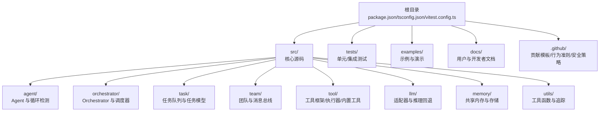
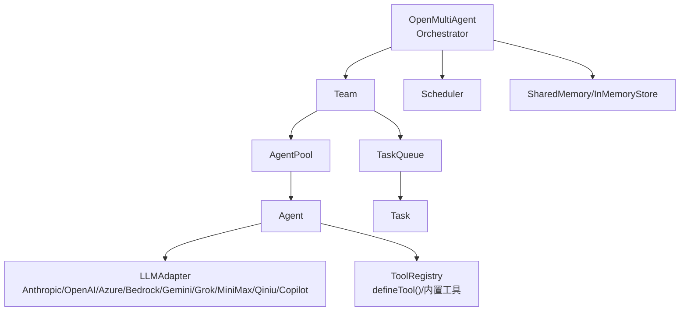
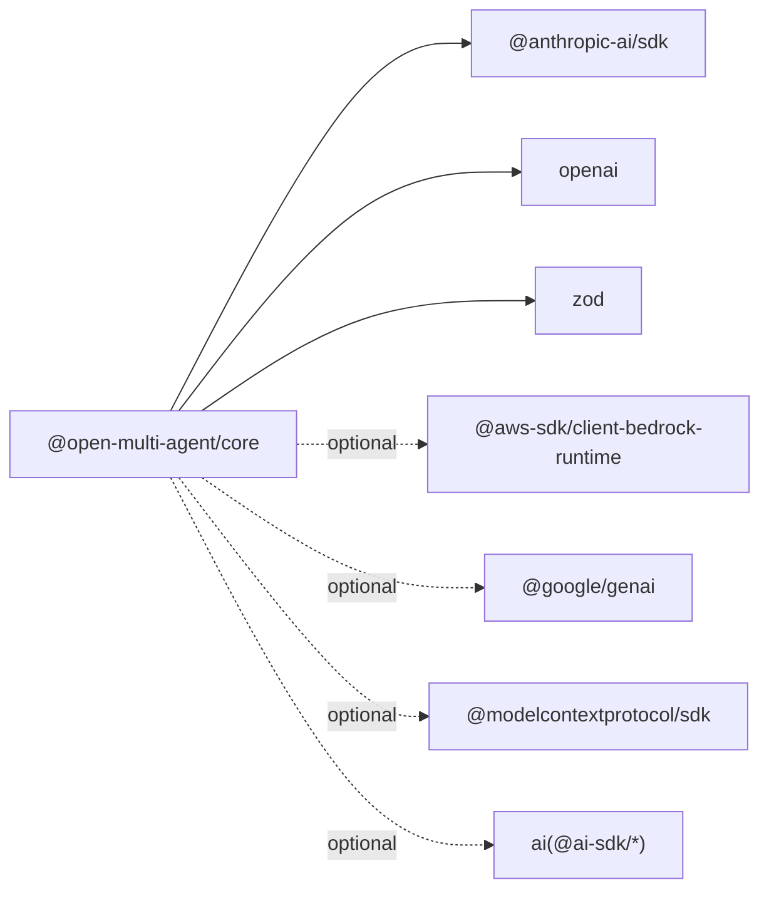

# 贡献与开发

<cite>
**本文引用的文件**
- [.github/CONTRIBUTING.md](file://.github/CONTRIBUTING.md)
- [.github/CODE_OF_CONDUCT.md](file://.github/CODE_OF_CONDUCT.md)
- [.github/SECURITY.md](file://.github/SECURITY.md)
- [.github/pull_request_template.md](file://.github/pull_request_template.md)
- [package.json](file://package.json)
- [tsconfig.json](file://tsconfig.json)
- [vitest.config.ts](file://vitest.config.ts)
- [README.md](file://README.md)
- [README_zh.md](file://README_zh.md)
- [docs/DECISIONS.md](file://docs/DECISIONS.md)
- [examples/README.md](file://examples/README.md)
- [src/index.ts](file://src/index.ts)
- [src/types.ts](file://src/types.ts)
</cite>

## 目录
1. [简介](#简介)
2. [项目结构](#项目结构)
3. [核心组件](#核心组件)
4. [架构总览](#架构总览)
5. [详细组件分析](#详细组件分析)
6. [依赖分析](#依赖分析)
7. [性能考虑](#性能考虑)
8. [故障排除指南](#故障排除指南)
9. [结论](#结论)
10. [附录](#附录)

## 简介
本文件是 Open Multi-Agent 框架的贡献与开发指南，旨在帮助新贡献者快速理解项目、搭建开发环境、遵循代码风格与测试要求，并高效完成新功能开发与缺陷修复。同时提供文档与翻译贡献方式、问题报告与功能请求流程、社区行为准则与沟通渠道等，确保贡献过程顺畅、透明、可追溯。

## 项目结构
仓库采用以“功能模块”为主的组织方式，核心源码位于 src/，测试集中于 tests/，示例与文档分别在 examples/ 与 docs/。根目录提供构建、测试、类型检查与发布脚本，以及社区治理文件。

图表来源
- [package.json:1-108](file://package.json#L1-L108)
- [src/index.ts:1-201](file://src/index.ts#L1-L201)

章节来源
- [package.json:1-108](file://package.json#L1-L108)
- [README.md:1-408](file://README.md#L1-L408)
- [README_zh.md:1-379](file://README_zh.md#L1-L379)

## 核心组件
- 公共 API 表面：通过 src/index.ts 导出 Orchestrator、Agent、Team、Task、Tool、LLM Adapter、Memory 等核心类型与方法，便于下游模块按需导入。
- 类型系统：src/types.ts 提供统一的公共类型定义，确保跨模块类型一致性与可维护性。
- 示例与文档：examples/README.md 提供示例分类与运行说明；docs/DECISIONS.md 记录架构决策背景；README/README_zh.md 提供快速上手与特性概览。

章节来源
- [src/index.ts:1-201](file://src/index.ts#L1-L201)
- [src/types.ts:1-800](file://src/types.ts#L1-L800)
- [examples/README.md:1-100](file://examples/README.md#L1-L100)
- [docs/DECISIONS.md:1-50](file://docs/DECISIONS.md#L1-L50)

## 架构总览
下图展示框架主要模块之间的关系与交互，体现从 Orchestrator 到 Team、Agent、TaskQueue、AgentPool、LLMAdapter、ToolRegistry 的调用链路。

图表来源
- [src/index.ts:57-124](file://src/index.ts#L57-L124)
- [src/types.ts:368-800](file://src/types.ts#L368-L800)

章节来源
- [README.md:217-264](file://README.md#L217-L264)
- [README_zh.md:211-258](file://README_zh.md#L211-L258)

## 详细组件分析

### 贡献流程与分支策略
- 分支与 PR
  - 从主分支 main 创建功能分支进行开发。
  - 提交 PR 至 main，遵循 PR 检查清单：本地通过类型检查与测试；新增/变更行为需补充测试；链接相关 Issue。
- 提交规范
  - 使用 PR 模板填写“做了什么/为什么做/检查清单”，保持变更聚焦、可验证。
- CI 要求
  - CI 在 Node 18/20/22 上自动运行类型检查与测试，PR 必须通过方可合并。

章节来源
- [.github/CONTRIBUTING.md:35-50](file://.github/CONTRIBUTING.md#L35-L50)
- [.github/pull_request_template.md:1-15](file://.github/pull_request_template.md#L1-L15)

### 开发环境搭建与配置
- 环境要求
  - Node.js 版本要求：>= 18（引擎字段与 README 均明确）。
- 本地安装与常用命令
  - 安装依赖、构建、开发监听、类型检查、运行测试、覆盖率统计、端到端测试等。
- TypeScript 配置
  - 目标版本、模块系统、严格模式、声明文件生成、源映射、排除规则等。
- 测试配置
  - 覆盖率包含 src/**，默认排除示例与测试；可通过 RUN_E2E 环境变量启用端到端测试。

章节来源
- [.github/CONTRIBUTING.md:5-23](file://.github/CONTRIBUTING.md#L5-L23)
- [package.json:66-43](file://package.json#L66-L43)
- [tsconfig.json:1-26](file://tsconfig.json#L1-L26)
- [vitest.config.ts:1-19](file://vitest.config.ts#L1-L19)

### 代码风格与测试要求
- 代码风格
  - TypeScript 严格模式；ES 模块；无额外 linter/formatter；保持最小依赖（当前运行时依赖仅为 3 个）。
- 测试要求
  - 所有 PR 必须通过类型检查与测试；新增/修改行为需配套测试；覆盖率报告包含文本、HTML、LCov、JSON。
  - 端到端测试需单独运行（带 RUN_E2E 环境变量），避免污染仓库测试结果。

章节来源
- [.github/CONTRIBUTING.md:50-34](file://.github/CONTRIBUTING.md#L50-L34)
- [vitest.config.ts:4-18](file://vitest.config.ts#L4-L18)

### 新功能开发指导
- 设计与实现
  - 优先参考公共 API 表面（src/index.ts）与类型定义（src/types.ts），确保新增能力与既有模块解耦。
  - 如涉及 LLM 适配器，参考现有适配器实现模式；如涉及工具系统，使用 defineTool 与 ToolRegistry。
- 示例与文档
  - 新增示例时遵循 examples/README.md 的分类与命名约定；文档更新与示例同步。
- 测试覆盖
  - 为新功能添加单元测试与集成测试；如涉及外部服务，使用端到端测试并在 CI 中谨慎启用。

章节来源
- [src/index.ts:57-124](file://src/index.ts#L57-L124)
- [src/types.ts:368-800](file://src/types.ts#L368-L800)
- [examples/README.md:83-100](file://examples/README.md#L83-L100)

### 缺陷修复指导
- 问题定位
  - 通过测试用例最小化复现问题；结合 onProgress/onTrace 事件辅助调试。
- 修复策略
  - 保持最小改动范围；补充针对性测试；如涉及公共类型，同步更新 src/types.ts。
- 验证与回归
  - 在本地运行类型检查与测试；必要时运行覆盖率统计；对相关适配器与工具执行回归测试。

章节来源
- [vitest.config.ts:4-18](file://vitest.config.ts#L4-L18)
- [src/types.ts:124-152](file://src/types.ts#L124-L152)

### 文档编写与翻译贡献
- 文档贡献
  - 更新用户文档与开发者文档；示例 README 与示例脚本保持一致；必要时补充架构决策记录。
- 翻译贡献
  - README 的中英文版本并行维护；翻译 PR 请遵循现有段落与术语风格。

章节来源
- [README.md:330-337](file://README.md#L330-L337)
- [README_zh.md:301-308](file://README_zh.md#L301-L308)
- [docs/DECISIONS.md:1-50](file://docs/DECISIONS.md#L1-L50)

### 问题报告与功能请求
- 问题报告
  - 优先在 Issues 页面搜索是否已有类似问题；提供最小可复现步骤、期望与实际结果、环境信息（Node 版本、Provider、模型）。
- 功能请求
  - 描述使用场景、期望行为与收益；可附带示例或草图；讨论通过后再进入开发流程。

章节来源
- [.github/CONTRIBUTING.md:66-69](file://.github/CONTRIBUTING.md#L66-L69)

### 社区行为准则与沟通渠道
- 行为准则
  - 遵循 Contributor Covenant，倡导包容、尊重、建设性的交流。
- 沟通渠道
  - Issues 用于问题与功能请求； Discussions 用于长篇讨论与生态集成；邮件用于安全漏洞报告。

章节来源
- [.github/CODE_OF_CONDUCT.md:1-49](file://.github/CODE_OF_CONDUCT.md#L1-L49)
- [.github/SECURITY.md:1-18](file://.github/SECURITY.md#L1-L18)

## 依赖分析
- 运行时依赖
  - 当前仅 3 个运行时依赖，保证最小化部署与跨平台兼容。
- 可选依赖（Peer）
  - AWS Bedrock、Google Gemini、MCP SDK、AI SDK 等，按需安装以扩展能力。
- 开发依赖
  - TypeScript、Vitest、AI SDK 相关包、覆盖率工具等，支撑开发与测试。

图表来源
- [package.json:69-93](file://package.json#L69-L93)

章节来源
- [package.json:69-93](file://package.json#L69-L93)

## 性能考虑
- 并发与调度
  - 使用 AgentPool 与 TaskQueue 实现任务并行与依赖自动解阻；合理设置并发度与重试策略，避免资源争用。
- 上下文与预算
  - 通过 ContextStrategy 控制对话长度与上下文增长；通过 Token 预算与工具输出上限控制成本。
- 观测与诊断
  - 使用 onProgress/onTrace 与仪表盘渲染定位瓶颈；对关键路径进行采样与压缩。

章节来源
- [src/types.ts:124-152](file://src/types.ts#L124-L152)
- [src/types.ts:758-800](file://src/types.ts#L758-L800)
- [README.md:317-329](file://README.md#L317-L329)

## 故障排除指南
- 常见问题定位
  - 环境变量缺失导致 Provider 初始化失败；模型或 API Key 不正确；网络访问受限。
- 本地调试
  - 使用 onProgress/onTrace 输出关键事件；开启计划模式（planOnly）预览任务 DAG；利用 AbortSignal 控制长耗时操作。
- 测试与覆盖率
  - 运行类型检查与测试；查看覆盖率报告定位未覆盖路径；对适配器与工具分别进行单元测试。

章节来源
- [vitest.config.ts:4-18](file://vitest.config.ts#L4-L18)
- [src/types.ts:629-657](file://src/types.ts#L629-L657)
- [README.md:79-103](file://README.md#L79-L103)

## 结论
本指南提供了从环境搭建、代码风格、测试要求到具体开发与贡献流程的完整路径。建议新贡献者先阅读 README 与 examples/README，再对照 CONTRIBUTING 与本指南逐步开展工作。对于复杂改动，优先通过 Issues 或 Discussions 讨论设计与影响，确保与项目长期演进方向一致。

## 附录

### 开发命令速查
- 安装依赖：npm install
- 构建：npm run build
- 开发监听：npm run dev
- 类型检查：npm run lint
- 运行测试：npm test
- 测试监听：npm run test:watch
- 覆盖率：npm run test:coverage
- 端到端测试：npm run test:e2e

章节来源
- [.github/CONTRIBUTING.md:15-23](file://.github/CONTRIBUTING.md#L15-L23)
- [package.json:34-42](file://package.json#L34-L42)