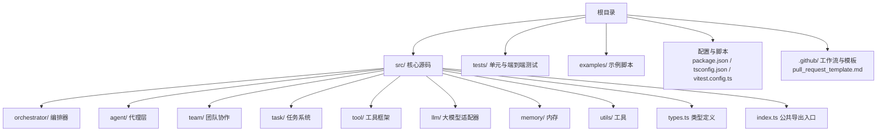
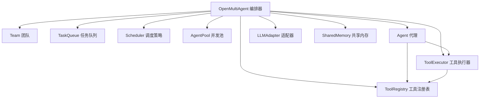
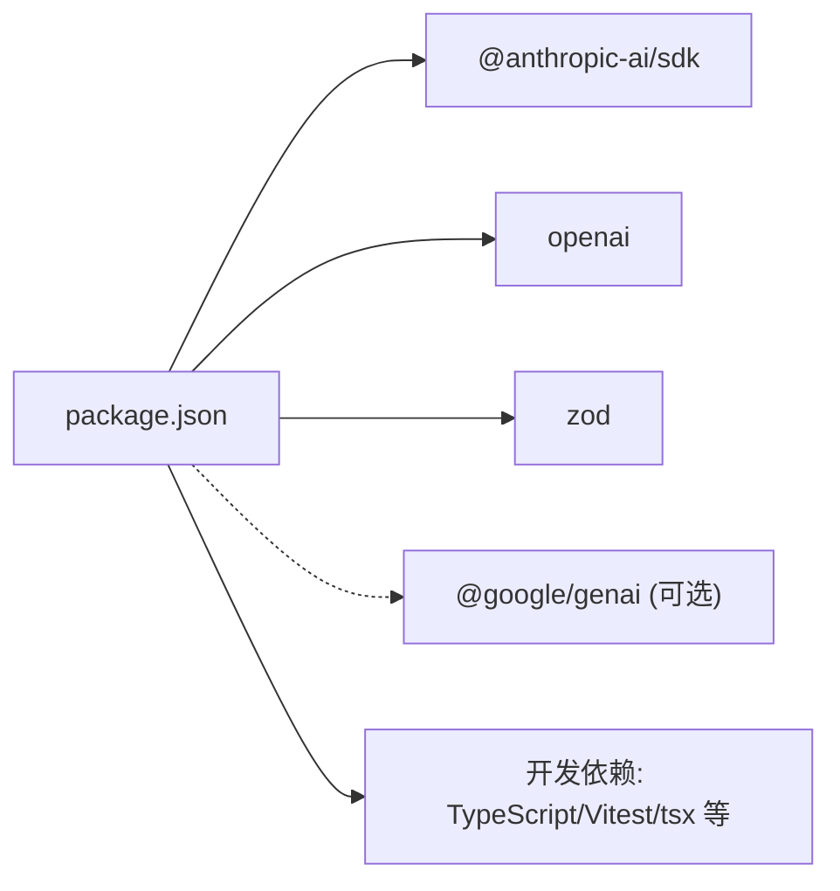

# 贡献指南

<cite>
**本文引用的文件**
- [CONTRIBUTING.md](file://CONTRIBUTING.md)
- [CODE_OF_CONDUCT.md](file://CODE_OF_CONDUCT.md)
- [DECISIONS.md](file://DECISIONS.md)
- [README.md](file://README.md)
- [SECURITY.md](file://SECURITY.md)
- [.github/pull_request_template.md](file://.github/pull_request_template.md)
- [vitest.config.ts](file://vitest.config.ts)
- [tsconfig.json](file://tsconfig.json)
- [package.json](file://package.json)
- [src/index.ts](file://src/index.ts)
- [src/orchestrator/orchestrator.ts](file://src/orchestrator/orchestrator.ts)
- [src/types.ts](file://src/types.ts)
- [examples/02-team-collaboration.ts](file://examples/02-team-collaboration.ts)
- [examples/03-task-pipeline.ts](file://examples/03-task-pipeline.ts)
- [examples/06-local-model.ts](file://examples/06-local-model.ts)
</cite>

## 目录
1. [简介](#简介)
2. [项目结构](#项目结构)
3. [核心组件](#核心组件)
4. [架构总览](#架构总览)
5. [详细组件分析](#详细组件分析)
6. [依赖分析](#依赖分析)
7. [性能考虑](#性能考虑)
8. [故障排查指南](#故障排查指南)
9. [结论](#结论)
10. [附录](#附录)

## 简介
本贡献指南面向希望参与 Open Multi-Agent 框架开发的贡献者，覆盖开发环境搭建、依赖与工具链、代码规范、提交流程、代码审查要点、决策与架构原则、新功能开发流程（含测试与示例）、社区行为准则与沟通渠道，以及常见贡献场景的操作步骤。所有内容均基于仓库现有文件整理，确保可执行性与一致性。

## 项目结构
该仓库采用按“领域/层次”组织的模块化结构，核心源码位于 src/，测试位于 tests/，示例位于 examples/。包脚本、类型配置与测试配置分别由 package.json、tsconfig.json、vitest.config.ts 提供支持。

图表来源
- [src/index.ts:1-183](file://src/index.ts#L1-L183)
- [package.json:1-67](file://package.json#L1-L67)

章节来源
- [README.md:1-281](file://README.md#L1-L281)
- [package.json:1-67](file://package.json#L1-L67)
- [tsconfig.json:1-26](file://tsconfig.json#L1-L26)
- [vitest.config.ts:1-16](file://vitest.config.ts#L1-L16)

## 核心组件
- 公共导出入口：通过 src/index.ts 统一导出编排器、团队、任务、工具、LLM 适配器、内存与公共类型，便于消费者按需导入。
- 编排器：src/orchestrator/orchestrator.ts 提供 runTeam()/runTasks()/runAgent() 等顶层 API，并协调 AgentPool、TaskQueue、Scheduler、Team、Agent 等子系统。
- 类型系统：src/types.ts 定义内容块、消息、响应、流事件、工具、代理、团队、任务、追踪等核心类型，保证跨模块类型一致性。
- 测试与覆盖率：使用 Vitest 配置 include/exclude 控制覆盖率范围与 E2E 测试开关；E2E 测试默认不纳入常规测试，需显式启用。

章节来源
- [src/index.ts:1-183](file://src/index.ts#L1-L183)
- [src/orchestrator/orchestrator.ts:1-200](file://src/orchestrator/orchestrator.ts#L1-L200)
- [src/types.ts:1-200](file://src/types.ts#L1-L200)
- [vitest.config.ts:1-16](file://vitest.config.ts#L1-L16)

## 架构总览
下图展示框架从顶层 API 到各子系统的调用关系与职责边界，体现“编排器为中心”的设计思想。

图表来源
- [src/orchestrator/orchestrator.ts:1-200](file://src/orchestrator/orchestrator.ts#L1-L200)
- [src/index.ts:56-117](file://src/index.ts#L56-L117)

## 详细组件分析

### 开发环境与工具链
- Node.js 版本要求：>= 18
- 依赖安装：使用 npm install 安装运行时与开发依赖
- 常用脚本：
  - 构建：tsc 输出至 dist/
  - 开发模式：tsc --watch 实时编译
  - 类型检查：tsc --noEmit
  - 运行测试：vitest（或 RUN_E2E=1 运行端到端）
  - 监听测试：vitest（watch 模式）

章节来源
- [CONTRIBUTING.md:5-23](file://CONTRIBUTING.md#L5-L23)
- [package.json:19-27](file://package.json#L19-L27)
- [tsconfig.json:1-26](file://tsconfig.json#L1-L26)

### 代码风格与规范
- 语言与模块：TypeScript 严格模式，ES 模块（保留 .js 扩展名以匹配打包器解析）
- 依赖最小化：当前仅 3 个运行时依赖，避免引入不必要的外部库
- 遵循现有模式：无需额外 linter/formatter，保持与既有代码一致

章节来源
- [CONTRIBUTING.md:50-54](file://CONTRIBUTING.md#L50-L54)

### 分支管理与提交流程
- 分支策略：从 main 分支派生特性分支
- 变更要求：新增或修改行为需配套测试
- 本地验证：在提交 PR 前确保本地通过 npm run lint 与 npm test
- CI 覆盖：CI 在 Node 18/20/22 上自动运行上述检查

章节来源
- [CONTRIBUTING.md:35-48](file://CONTRIBUTING.md#L35-L48)

### Pull Request 规范
- PR 检查清单：类型检查通过、测试通过、新增行为具备测试覆盖、关联相关 Issue
- PR 模板字段：简述变更目的、说明动机、勾选清单项

章节来源
- [CONTRIBUTING.md:35-48](file://CONTRIBUTING.md#L35-L48)
- [.github/pull_request_template.md:1-15](file://.github/pull_request_template.md#L1-L15)

### 代码审查要求
- 必须通过本地 lint 与 test
- 新增/变更行为必须有测试覆盖
- 保持依赖最小化，避免引入新的运行时依赖
- 关注架构一致性与可维护性

章节来源
- [CONTRIBUTING.md:35-48](file://CONTRIBUTING.md#L35-L48)
- [.github/pull_request_template.md:9-15](file://.github/pull_request_template.md#L9-L15)

### 架构原则与决策背景
- 简化优先：拒绝会增加复杂度的特性（如代理交接、状态持久化、A2A 协议、MCP 集成、内置可视化）
- 用户场景聚焦：目标用户为需要在秒级到分钟级完成工作流的 Node.js 用户
- 明确边界：暴露数据而非构建 UI；通过回调与追踪事件满足可观测性需求

章节来源
- [DECISIONS.md:1-44](file://DECISIONS.md#L1-L44)

### 测试要求与示例添加
- 单元测试：位于 tests/，覆盖核心模块（如 TaskQueue、SharedMemory、ToolExecutor、Semaphore 等），无需 API 密钥或网络访问
- 端到端测试：位于 tests/e2e/，默认不纳入常规测试，可通过 npm run test:e2e 显式运行
- 示例更新：新增功能建议配套示例脚本，放置于 examples/ 并在 README 的示例列表中补充说明

章节来源
- [CONTRIBUTING.md:25-33](file://CONTRIBUTING.md#L25-L33)
- [vitest.config.ts:1-16](file://vitest.config.ts#L1-L16)
- [README.md:113-136](file://README.md#L113-L136)

### 社区行为准则与沟通渠道
- 行为准则：遵循 Contributor Covenant 2.1 版本
- 适用范围：社区空间及代表社区公开场合
- 报告渠道：邮件 jack@yuanasi.com（安全漏洞请勿开公开 Issue）
- 执行责任：社区领袖负责澄清与执行标准，及时公正处理投诉

章节来源
- [CODE_OF_CONDUCT.md:1-49](file://CODE_OF_CONDUCT.md#L1-L49)
- [SECURITY.md:1-18](file://SECURITY.md#L1-L18)

### 常见贡献场景操作指南
- 新增 LLM 适配器：实现 chat()/stream() 接口的适配器，注册到工厂并完善类型与测试
- 新增内置工具：在 tool/built-in 下扩展，同时更新工具注册与示例
- 新增示例：在 examples/ 添加脚本，必要时更新 README 示例索引
- 修复问题：先写最小化复现测试，再修复问题并确保回归测试通过

章节来源
- [README.md:246-252](file://README.md#L246-L252)
- [src/index.ts:94-102](file://src/index.ts#L94-L102)

## 依赖分析
- 运行时依赖：@anthropic-ai/sdk、openai、zod
- 可选依赖：@google/genai（可选 peer）
- 开发依赖：TypeScript、Vitest、tsx、Node 类型等
- Node 引擎：>= 18

图表来源
- [package.json:45-65](file://package.json#L45-L65)

章节来源
- [package.json:1-67](file://package.json#L1-L67)

## 性能考虑
- 并发与重试：编排器默认最大并发与任务重试策略已在实现中体现，建议在本地模型或慢速服务上设置合理超时与退避参数
- 观测性：通过 onTrace 回调输出结构化跨度，便于定位性能瓶颈
- 本地模型：示例展示了如何通过 baseURL 与超时配置对接本地推理服务

章节来源
- [src/orchestrator/orchestrator.ts:108-194](file://src/orchestrator/orchestrator.ts#L108-L194)
- [examples/06-local-model.ts:51-68](file://examples/06-local-model.ts#L51-L68)

## 故障排查指南
- 本地模型工具调用失败
  - 确认模型在 Ollama 工具分类中；升级 Ollama 至最新版本
  - 若服务器返回文本而非结构化 tool_calls，框架会自动提取
  - 使用 no_proxy=localhost 避免代理干扰
- 代理循环检测
  - 启用 loopDetection 并根据需要选择警告、终止或自定义回调
- 任务重试与费用统计
  - 使用 maxRetries/retryDelayMs/retryBackoff；重试累计用量用于准确计费
- 进度与追踪
  - 使用 onProgress/onTrace 获取结构化事件，辅助调试与审计

章节来源
- [README.md:206-232](file://README.md#L206-L232)
- [src/orchestrator/orchestrator.ts:108-194](file://src/orchestrator/orchestrator.ts#L108-L194)
- [examples/02-team-collaboration.ts:142-167](file://examples/02-team-collaboration.ts#L142-L167)
- [examples/03-task-pipeline.ts:64-73](file://examples/03-task-pipeline.ts#L64-L73)

## 结论
本指南总结了从环境搭建到代码贡献、从测试与示例到行为准则与沟通渠道的完整流程。请在提交前确保本地通过 lint 与 test，并在 PR 中附上测试与示例说明。对于可能引入复杂度的改动，建议先开启讨论以对齐架构原则。

## 附录
- 快速开始与示例运行：参考 README 的示例章节，使用 npx tsx 运行 examples/ 下脚本
- 架构概览：README 的架构图展示了编排器与各子系统的交互关系

章节来源
- [README.md:113-136](file://README.md#L113-L136)
- [README.md:137-178](file://README.md#L137-L178)