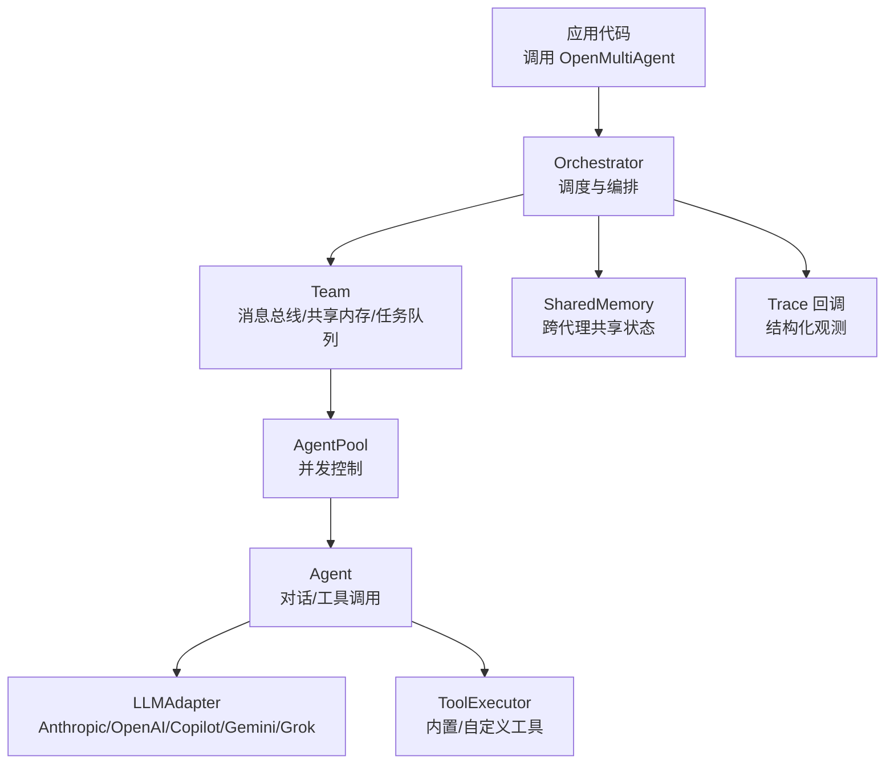
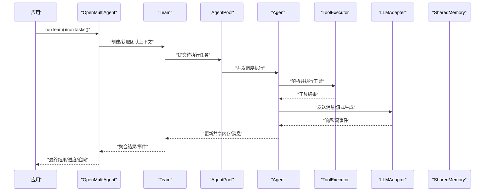
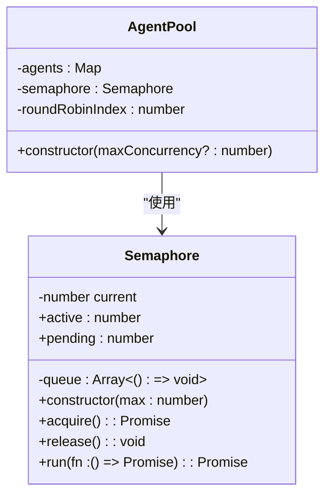
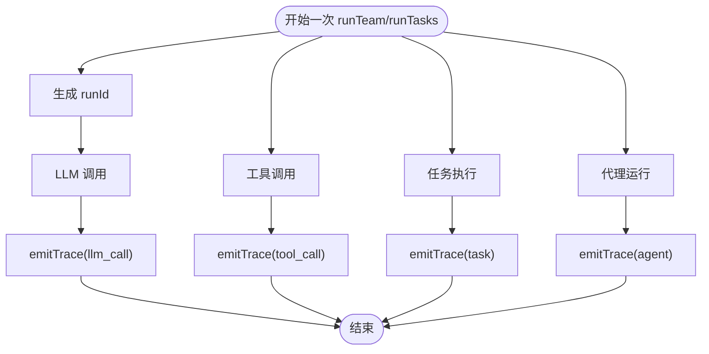
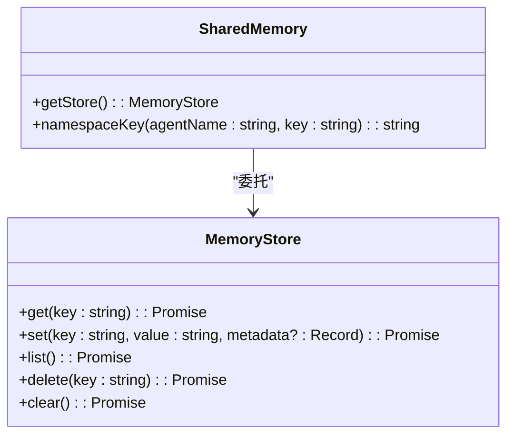
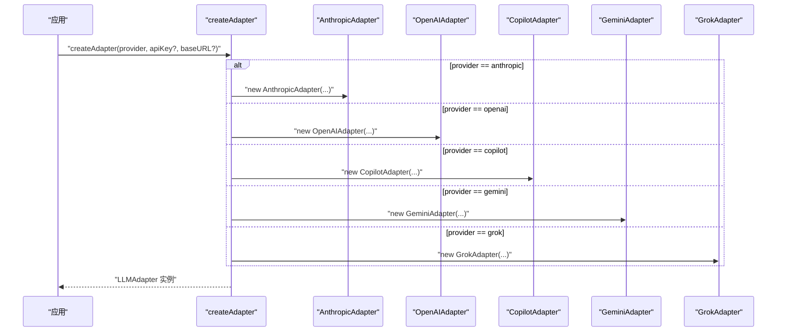
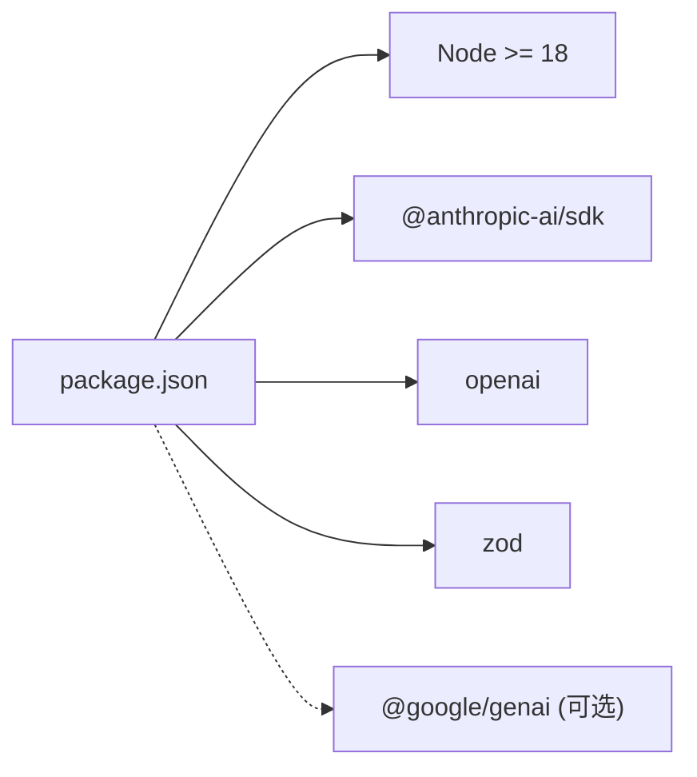

# 部署与生产

<cite>
**本文引用的文件**
- [package.json](file://package.json)
- [README.md](file://README.md)
- [SECURITY.md](file://SECURITY.md)
- [tsconfig.json](file://tsconfig.json)
- [vitest.config.ts](file://vitest.config.ts)
- [src/index.ts](file://src/index.ts)
- [src/types.ts](file://src/types.ts)
- [src/llm/adapter.ts](file://src/llm/adapter.ts)
- [src/utils/semaphore.ts](file://src/utils/semaphore.ts)
- [src/utils/trace.ts](file://src/utils/trace.ts)
- [src/memory/shared.ts](file://src/memory/shared.ts)
- [src/agent/pool.ts](file://src/agent/pool.ts)
- [examples/01-single-agent.ts](file://examples/01-single-agent.ts)
- [examples/02-team-collaboration.ts](file://examples/02-team-collaboration.ts)
</cite>

## 目录
1. [简介](#简介)
2. [项目结构](#项目结构)
3. [核心组件](#核心组件)
4. [架构总览](#架构总览)
5. [详细组件分析](#详细组件分析)
6. [依赖关系分析](#依赖关系分析)
7. [性能考量](#性能考量)
8. [故障排查指南](#故障排查指南)
9. [结论](#结论)
10. [附录](#附录)

## 简介
本指南面向在生产环境中部署与运行 Open Multi-Agent 框架的工程团队，覆盖以下主题：
- 多环境部署方式：容器化（Docker）、云平台与服务器配置要点
- 生产性能优化：并发配置、资源限制、监控与可观测性
- 安全与合规：API 密钥管理、网络与访问控制
- 故障恢复与灾难恢复策略
- 版本升级与迁移流程
- 成本优化与资源使用监控

框架特性与运行要求：
- 基于 Node.js 运行时，最低版本要求见包配置
- 支持多 LLM 提供商与本地模型（通过 OpenAI 兼容接口）
- 提供可观测性回调与结构化追踪事件，便于生产监控
- 内置并发控制与循环检测等生产级能力

章节来源
- [package.json:1-67](file://package.json#L1-L67)
- [README.md:1-281](file://README.md#L1-L281)

## 项目结构
仓库采用按功能域分层的组织方式：
- 核心导出入口位于 src/index.ts，统一暴露 Orchestrator、Agent、Team、Task、Tool、LLM Adapter、Memory 等公共 API
- 类型定义集中在 src/types.ts，作为所有公共接口的类型来源
- LLM 适配器位于 src/llm/ 下，按提供商拆分
- 并发控制与工具执行位于 src/utils/ 与 src/tool/
- 示例位于 examples/，展示单代理、团队协作等典型用法

图表来源
- [src/index.ts:57-183](file://src/index.ts#L57-L183)
- [src/types.ts:386-411](file://src/types.ts#L386-L411)
- [src/llm/adapter.ts:63-81](file://src/llm/adapter.ts#L63-L81)
- [src/utils/semaphore.ts:24-89](file://src/utils/semaphore.ts#L24-L89)
- [src/memory/shared.ts:170-181](file://src/memory/shared.ts#L170-L181)

章节来源
- [src/index.ts:57-183](file://src/index.ts#L57-L183)
- [src/types.ts:122-180](file://src/types.ts#L122-L180)
- [tsconfig.json:1-26](file://tsconfig.json#L1-L26)

## 核心组件
- Orchestrator：顶层编排器，负责事件进度回调、追踪回调、默认配置注入
- Team：团队容器，包含代理集合、消息总线、共享内存、任务队列
- AgentPool：代理池，基于计数信号量控制并发
- ToolExecutor：工具执行器，支持批量工具调用与错误隔离
- LLMAdapter：抽象适配器，屏蔽不同提供商差异
- SharedMemory：跨代理共享键值存储
- Trace：结构化追踪事件，用于生产监控

章节来源
- [src/index.ts:57-183](file://src/index.ts#L57-L183)
- [src/types.ts:386-471](file://src/types.ts#L386-L471)
- [src/llm/adapter.ts:63-81](file://src/llm/adapter.ts#L63-L81)
- [src/utils/semaphore.ts:24-89](file://src/utils/semaphore.ts#L24-L89)
- [src/utils/trace.ts:12-34](file://src/utils/trace.ts#L12-L34)
- [src/memory/shared.ts:170-181](file://src/memory/shared.ts#L170-L181)

## 架构总览
下图展示从应用到 LLM 的端到端调用链路与关键生产特性：

图表来源
- [src/index.ts:57-183](file://src/index.ts#L57-L183)
- [src/agent/pool.ts:58-73](file://src/agent/pool.ts#L58-L73)
- [src/utils/semaphore.ts:24-89](file://src/utils/semaphore.ts#L24-L89)
- [src/utils/trace.ts:12-34](file://src/utils/trace.ts#L12-L34)
- [src/memory/shared.ts:170-181](file://src/memory/shared.ts#L170-L181)

## 详细组件分析

### 组件一：并发与资源限制（AgentPool 与 Semaphore）
- AgentPool 使用 Semaphore 控制全局并发度，默认上限可配置
- 工具执行器同样受并发限制，避免资源争用
- 在高负载场景下，应结合上游 LLM 速率限制与后端服务能力调整并发

图表来源
- [src/utils/semaphore.ts:24-89](file://src/utils/semaphore.ts#L24-L89)
- [src/agent/pool.ts:58-73](file://src/agent/pool.ts#L58-L73)

章节来源
- [src/agent/pool.ts:58-73](file://src/agent/pool.ts#L58-L73)
- [src/utils/semaphore.ts:24-89](file://src/utils/semaphore.ts#L24-L89)

### 组件二：可观测性与追踪（Trace 事件）
- 框架提供结构化追踪事件（LLM 调用、工具调用、任务、代理），可用于生产监控
- onTrace 回调以“零开销”模式运行（未订阅时不产生额外负担）

图表来源
- [src/utils/trace.ts:12-34](file://src/utils/trace.ts#L12-L34)
- [src/types.ts:417-471](file://src/types.ts#L417-L471)

章节来源
- [src/utils/trace.ts:12-34](file://src/utils/trace.ts#L12-L34)
- [src/types.ts:417-471](file://src/types.ts#L417-L471)

### 组件三：共享内存（SharedMemory）
- 支持跨代理键值存储，便于团队协作与状态共享
- 提供底层存储接口，可替换为持久化实现（如 Redis、SQLite）

图表来源
- [src/types.ts:488-494](file://src/types.ts#L488-L494)
- [src/memory/shared.ts:170-181](file://src/memory/shared.ts#L170-L181)

章节来源
- [src/types.ts:488-494](file://src/types.ts#L488-L494)
- [src/memory/shared.ts:170-181](file://src/memory/shared.ts#L170-L181)

### 组件四：LLM 适配器与环境变量
- 支持 Anthropic、OpenAI、Copilot、Gemini、Grok 等提供商
- 适配器按需懒加载，减少不必要的依赖
- 环境变量用于密钥注入，部分提供商支持备用密钥名

图表来源
- [src/llm/adapter.ts:63-81](file://src/llm/adapter.ts#L63-L81)
- [README.md:38-42](file://README.md#L38-L42)

章节来源
- [src/llm/adapter.ts:63-81](file://src/llm/adapter.ts#L63-L81)
- [README.md:38-42](file://README.md#L38-L42)

## 依赖关系分析
- 运行时依赖：@anthropic-ai/sdk、openai、zod
- 可选依赖：@google/genai（通过 peerDependenciesMeta 标记为可选）
- Node.js 引擎要求：>= 18
- 构建目标：ES2022 + ESNext 模块

图表来源
- [package.json:45-65](file://package.json#L45-L65)

章节来源
- [package.json:45-65](file://package.json#L45-L65)
- [tsconfig.json:2-22](file://tsconfig.json#L2-L22)

## 性能考量
- 并发配置
  - OrchestratorConfig.maxConcurrency：顶层并发上限
  - TeamConfig.maxConcurrency：团队内并发上限
  - AgentPool 默认并发上限可通过构造函数参数调整
  - 工具执行器并发由内部信号量控制，避免工具调用造成资源争用
- 资源限制
  - 单次代理运行超时：AgentConfig.timeoutMs，防止本地推理或慢服务导致长时间占用
  - 循环检测：AgentConfig.loopDetection，避免无意义重复调用
- 监控设置
  - 使用 onTrace 回调收集结构化事件（LLM 调用、工具调用、任务、代理）
  - 使用 onProgress 回调观察任务与代理生命周期事件
- 测试与覆盖率
  - 测试配置仅在需要时启用 E2E，避免 CI 中不必要的外部调用

章节来源
- [src/types.ts:386-411](file://src/types.ts#L386-L411)
- [src/types.ts:316-322](file://src/types.ts#L316-L322)
- [src/types.ts:194-241](file://src/types.ts#L194-L241)
- [src/agent/pool.ts:58-73](file://src/agent/pool.ts#L58-L73)
- [src/utils/semaphore.ts:24-89](file://src/utils/semaphore.ts#L24-L89)
- [src/utils/trace.ts:12-34](file://src/utils/trace.ts#L12-L34)
- [vitest.config.ts:1-15](file://vitest.config.ts#L1-L15)

## 故障排查指南
- API 密钥问题
  - 确认对应提供商的环境变量已正确设置；部分提供商支持备用密钥名
  - Grok 默认使用官方 baseURL，也可自定义
- 本地模型（Ollama/vLLM/LM Studio）工具调用
  - 确保模型支持工具调用；若返回文本而非结构化 tool_calls，框架会自动提取
  - 适当设置 AgentConfig.timeoutMs 防止长时间等待
- 循环检测与超时
  - 启用 AgentConfig.loopDetection 并根据需要选择动作（告警/终止/自定义回调）
  - 对慢推理场景设置合理 timeoutMs
- 并发与资源瓶颈
  - 降低 Orchestrator/Team/AgentPool 的并发上限，观察系统指标
  - 关注工具执行器的错误隔离行为，避免单点失败影响整体
- 观测性
  - 订阅 onTrace 与 onProgress，结合 runId 进行端到端关联分析

章节来源
- [README.md:38-42](file://README.md#L38-L42)
- [README.md:214-232](file://README.md#L214-L232)
- [src/types.ts:194-241](file://src/types.ts#L194-L241)
- [src/types.ts:248-276](file://src/types.ts#L248-L276)
- [src/llm/adapter.ts:63-81](file://src/llm/adapter.ts#L63-L81)
- [src/utils/trace.ts:12-34](file://src/utils/trace.ts#L12-L34)

## 结论
Open Multi-Agent 框架以轻量、可观测、可扩展为核心设计，在生产环境中可通过合理的并发与资源限制、完善的监控与日志、严格的密钥与网络治理，实现稳定高效的多智能体协作。建议在上线前完成压测与容量规划，并建立基于追踪事件的告警与审计机制。

## 附录

### A. 多环境部署指南

- 容器化（Docker）
  - 基础镜像：选择官方 Node.js LTS 镜像（>= 18）
  - 构建步骤：安装依赖、编译 TypeScript、复制产物至只读镜像层
  - 运行参数：通过环境变量注入各提供商 API 密钥；挂载持久化卷用于共享内存（如使用 Redis/数据库）
  - 健康检查：提供最小化探针，确保 LLM 适配器可用
  - 安全：以非 root 用户运行；限制容器资源（CPU/内存/文件句柄）
- 云平台（Kubernetes/AWS/GCP/Azure）
  - 配置 Secret 管理 API 密钥；通过 ConfigMap 注入默认模型与并发参数
  - 使用 HPA/PDB 保障弹性与可用性；为长尾任务设置 Pod 重启策略
  - 日志与追踪：将 onTrace 输出对接平台日志/监控系统
- 服务器配置（裸机/VM）
  - 系统：Ubuntu/CentOS，内核开启 cgroups
  - 运行时：Node.js >= 18；PM2/Supervisor 管理进程
  - 网络：限制对外出站访问；对 LLM 提供商域名放通；必要时配置代理
  - 存储：为共享内存提供持久化后端（Redis/PostgreSQL/SQLite）

章节来源
- [package.json:42-44](file://package.json#L42-L44)
- [README.md:38-42](file://README.md#L38-L42)
- [src/llm/adapter.ts:63-81](file://src/llm/adapter.ts#L63-L81)

### B. 生产性能优化清单
- 并发与限流
  - 依据 LLM 提供商速率限制与后端服务能力，设置合适的 maxConcurrency
  - 对工具密集型任务，单独评估工具执行器并发
- 超时与重试
  - 为本地模型设置合理 timeoutMs；为任务启用最大重试次数与指数退避
- 监控与告警
  - onTrace 事件中提取关键指标（耗时、Token 使用、错误率）
  - 将 runId 作为关联键，串联日志与追踪
- 资源与成本
  - 优先使用流式输出（stream）降低首字节延迟
  - 通过共享内存减少重复计算与数据传输

章节来源
- [src/types.ts:352-358](file://src/types.ts#L352-L358)
- [src/types.ts:216-228](file://src/types.ts#L216-L228)
- [src/utils/trace.ts:12-34](file://src/utils/trace.ts#L12-L34)

### C. 安全与合规
- API 密钥管理
  - 使用平台 Secret 管理；避免硬编码；定期轮换
  - 不将密钥写入日志或追踪事件
- 网络与访问控制
  - 限制出站访问至 LLM 提供商域名；对内网服务启用防火墙
  - 如需代理，确保 no_proxy 配置正确
- 审计与合规
  - 记录 onTrace 与 onProgress；保留必要的运行元数据
  - 遵循安全政策，漏洞报告渠道见安全文档

章节来源
- [README.md:38-42](file://README.md#L38-L42)
- [README.md:228-232](file://README.md#L228-L232)
- [SECURITY.md:1-18](file://SECURITY.md#L1-L18)

### D. 故障恢复与灾难恢复
- 快速回滚
  - 采用蓝绿/金丝雀发布；变更前保留上一版本镜像与配置
- 数据备份
  - 对共享内存后端进行周期性备份；验证恢复流程
- 灾难恢复
  - 多可用区部署；使用健康检查与自动故障转移
  - 对关键路径（LLM 适配器、工具执行器）实施降级策略

### E. 版本升级与迁移
- 升级流程
  - 在预生产验证新版本；对照类型变更与 API 行为变化
  - 更新依赖版本，重新构建与测试
- 迁移建议
  - 逐步调整并发与超时参数；对比 onTrace 指标
  - 保持 onTrace/onProgress 回调兼容，避免中断监控

章节来源
- [package.json:1-67](file://package.json#L1-L67)
- [src/types.ts:122-180](file://src/types.ts#L122-L180)

### F. 成本优化与资源监控
- 成本优化
  - 优先使用低成本模型与工具；减少不必要的工具调用
  - 利用流式输出与缓存（如适用）降低延迟与调用次数
- 资源监控
  - 指标：请求量、错误率、P95/P99 延迟、Token 使用、并发度
  - 告警：针对异常波动与阈值触发；结合 runId 进行根因分析

章节来源
- [src/utils/trace.ts:12-34](file://src/utils/trace.ts#L12-L34)
- [src/types.ts:417-471](file://src/types.ts#L417-L471)