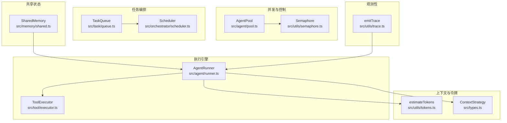
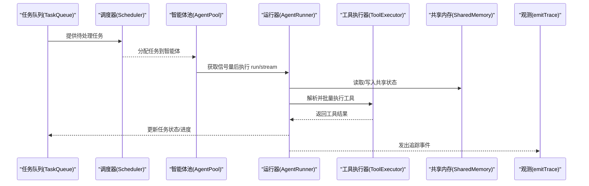
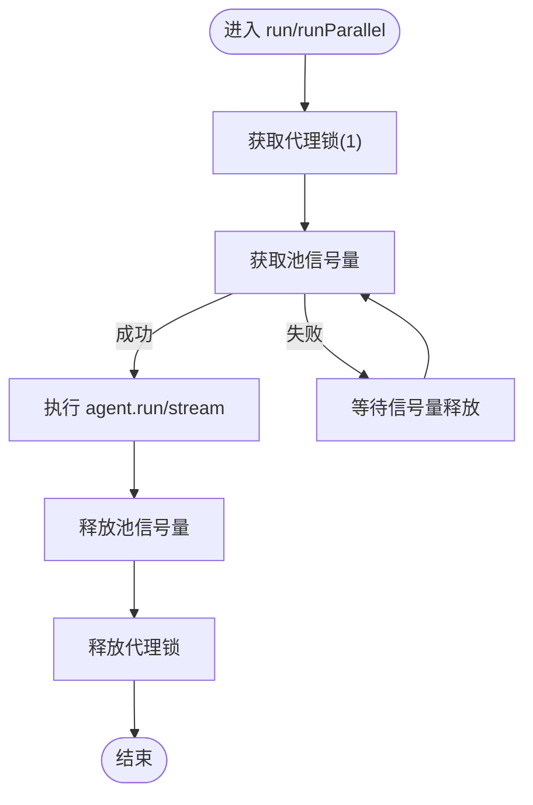
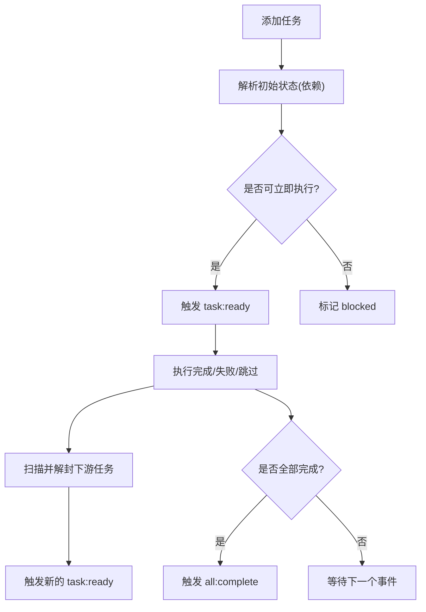
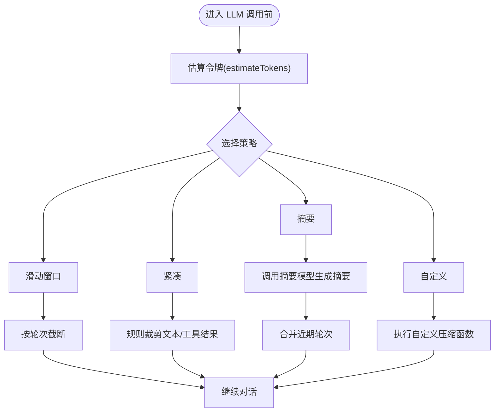
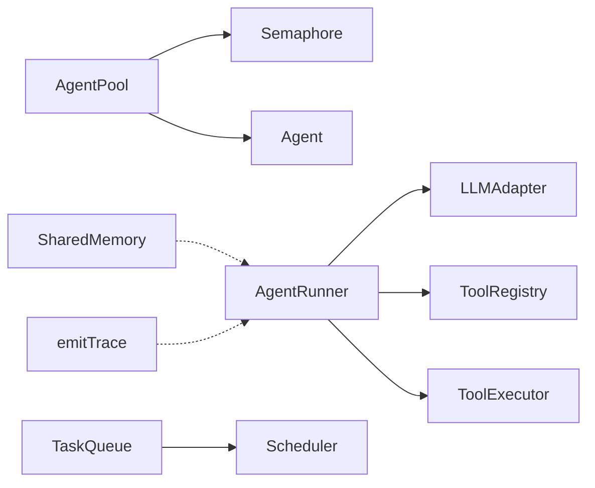

# 性能优化

<cite>
**本文引用的文件**
- [src/agent/pool.ts](file://src/agent/pool.ts)
- [src/utils/semaphore.ts](file://src/utils/semaphore.ts)
- [src/task/queue.ts](file://src/task/queue.ts)
- [src/orchestrator/scheduler.ts](file://src/orchestrator/scheduler.ts)
- [src/agent/runner.ts](file://src/agent/runner.ts)
- [src/tool/executor.ts](file://src/tool/executor.ts)
- [src/utils/tokens.ts](file://src/utils/tokens.ts)
- [src/memory/shared.ts](file://src/memory/shared.ts)
- [src/utils/trace.ts](file://src/utils/trace.ts)
- [src/types.ts](file://src/types.ts)
- [docs/context-management.md](file://docs/context-management.md)
- [docs/observability.md](file://docs/observability.md)
- [docs/shared-memory.md](file://docs/shared-memory.md)
- [package.json](file://package.json)
</cite>

## 目录
1. [简介](#简介)
2. [项目结构](#项目结构)
3. [核心组件](#核心组件)
4. [架构总览](#架构总览)
5. [详细组件分析](#详细组件分析)
6. [依赖关系分析](#依赖关系分析)
7. [性能考量与优化策略](#性能考量与优化策略)
8. [故障排查指南](#故障排查指南)
9. [结论](#结论)
10. [附录：基准测试与压测方案](#附录基准测试与压测方案)

## 简介
本文件面向 Open Multi-Agent 框架的性能优化，聚焦于高并发场景下的稳定性与响应速度提升。内容覆盖以下主题：
- 令牌预算管理与上下文压缩策略
- 智能体池化与并发控制
- 任务队列与调度策略
- 内存使用与共享存储优化
- 观测性与性能指标监控
- 负载测试与压力测试实施方案
- 基准测试结果与优化建议

## 项目结构
从性能角度，框架的关键模块包括：
- 并发与资源控制：信号量（Semaphore）、智能体池（AgentPool）
- 任务编排：任务队列（TaskQueue）、调度器（Scheduler）
- 执行引擎：智能体运行器（AgentRunner）、工具执行器（ToolExecutor）
- 上下文与令牌：令牌估算（estimateTokens）、上下文策略（sliding-window/summarize/compact/custom）
- 共享状态：共享内存（SharedMemory）
- 观测性：追踪事件（emitTrace）

**图表来源**
- [src/utils/semaphore.ts:1-95](file://src/utils/semaphore.ts#L1-L95)
- [src/agent/pool.ts:1-370](file://src/agent/pool.ts#L1-L370)
- [src/task/queue.ts:1-470](file://src/task/queue.ts#L1-L470)
- [src/orchestrator/scheduler.ts:1-322](file://src/orchestrator/scheduler.ts#L1-L322)
- [src/agent/runner.ts:1-800](file://src/agent/runner.ts#L1-L800)
- [src/tool/executor.ts:1-264](file://src/tool/executor.ts#L1-L264)
- [src/utils/tokens.ts:1-30](file://src/utils/tokens.ts#L1-L30)
- [src/types.ts:124-158](file://src/types.ts#L124-L158)
- [src/memory/shared.ts:1-335](file://src/memory/shared.ts#L1-L335)
- [src/utils/trace.ts:1-35](file://src/utils/trace.ts#L1-L35)

**章节来源**
- [src/agent/pool.ts:58-78](file://src/agent/pool.ts#L58-L78)
- [src/utils/semaphore.ts:24-94](file://src/utils/semaphore.ts#L24-L94)
- [src/task/queue.ts:55-94](file://src/task/queue.ts#L55-L94)
- [src/orchestrator/scheduler.ts:96-105](file://src/orchestrator/scheduler.ts#L96-L105)
- [src/agent/runner.ts:348-362](file://src/agent/runner.ts#L348-L362)
- [src/tool/executor.ts:54-63](file://src/tool/executor.ts#L54-L63)
- [src/utils/tokens.ts:7-29](file://src/utils/tokens.ts#L7-L29)
- [src/types.ts:124-158](file://src/types.ts#L124-L158)
- [src/memory/shared.ts:55-85](file://src/memory/shared.ts#L55-L85)
- [src/utils/trace.ts:12-34](file://src/utils/trace.ts#L12-L34)

## 核心组件
- 信号量（Semaphore）：轻量级计数信号量，用于限制并发异步操作数量，避免资源争用与死锁风险。
- 智能体池（AgentPool）：注册与调度多个智能体实例，通过信号量控制全局并发，提供并行运行与轮询派发能力，并报告池状态。
- 任务队列（TaskQueue）：拓扑依赖感知的任务队列，支持就绪/完成/失败/跳过等事件驱动的状态机，自动解封下游任务。
- 调度器（Scheduler）：四种调度策略（轮询、最少忙碌、能力匹配、关键路径优先），将待处理任务映射到可用智能体。
- 智能体运行器（AgentRunner）：对话循环引擎，负责 LLM 调用、工具解析与执行、令牌统计、上下文压缩与循环检测。
- 工具执行器（ToolExecutor）：批量工具执行，带输入/输出模式校验、并发限制与错误隔离。
- 令牌估算（estimateTokens）：基于字符启发式估算令牌数，避免模型特定分词器依赖。
- 共享内存（SharedMemory）：命名空间键值存储，支持 TTL 过期与摘要生成，便于跨智能体共享信息。
- 观测性（emitTrace）：安全发出追踪事件，避免订阅者异常影响主流程。

**章节来源**
- [src/utils/semaphore.ts:24-94](file://src/utils/semaphore.ts#L24-L94)
- [src/agent/pool.ts:58-370](file://src/agent/pool.ts#L58-L370)
- [src/task/queue.ts:55-470](file://src/task/queue.ts#L55-L470)
- [src/orchestrator/scheduler.ts:96-322](file://src/orchestrator/scheduler.ts#L96-L322)
- [src/agent/runner.ts:348-800](file://src/agent/runner.ts#L348-L800)
- [src/tool/executor.ts:54-264](file://src/tool/executor.ts#L54-L264)
- [src/utils/tokens.ts:7-29](file://src/utils/tokens.ts#L7-L29)
- [src/memory/shared.ts:55-335](file://src/memory/shared.ts#L55-L335)
- [src/utils/trace.ts:12-34](file://src/utils/trace.ts#L12-L34)

## 架构总览
下图展示高并发场景下的关键交互：任务队列驱动调度器选择智能体；智能体池控制并发；运行器进行 LLM 调用与工具执行；上下文策略与令牌估算保障上下文预算；共享内存与观测性贯穿全程。

**图表来源**
- [src/task/queue.ts:156-167](file://src/task/queue.ts#L156-L167)
- [src/orchestrator/scheduler.ts:156-167](file://src/orchestrator/scheduler.ts#L156-L167)
- [src/agent/pool.ts:147-191](file://src/agent/pool.ts#L147-L191)
- [src/agent/runner.ts:673-800](file://src/agent/runner.ts#L673-L800)
- [src/tool/executor.ts:114-130](file://src/tool/executor.ts#L114-L130)
- [src/memory/shared.ts:200-294](file://src/memory/shared.ts#L200-L294)
- [src/utils/trace.ts:12-27](file://src/utils/trace.ts#L12-L27)

## 详细组件分析

### 智能体池化与并发控制
- 设计要点
  - 全局并发上限由信号量控制，避免过度并发导致资源耗尽。
  - 每个智能体实例拥有独立的“代理锁”（信号量1），防止同一实例被并发运行导致状态竞态。
  - 支持两种派发模式：并行运行（runParallel）与轮询派发（runAny）。
  - 提供池状态快照（PoolStatus）用于可观测性与自适应调参。
- 关键实现位置
  - 信号量封装与运行：[src/utils/semaphore.ts:24-94](file://src/utils/semaphore.ts#L24-L94)
  - 池化与派发逻辑：[src/agent/pool.ts:58-370](file://src/agent/pool.ts#L58-L370)
- 性能影响
  - 合理设置最大并发可平衡吞吐与延迟；过小导致排队，过大导致资源争用。
  - 代理锁避免重复获取槽位但不释放导致的死锁风险。

**图表来源**
- [src/agent/pool.ts:147-191](file://src/agent/pool.ts#L147-L191)
- [src/utils/semaphore.ts:46-83](file://src/utils/semaphore.ts#L46-L83)

**章节来源**
- [src/agent/pool.ts:58-191](file://src/agent/pool.ts#L58-L191)
- [src/utils/semaphore.ts:24-94](file://src/utils/semaphore.ts#L24-L94)

### 任务队列与调度策略
- 设计要点
  - 任务初始状态根据依赖解析决定是否阻塞；完成时自动解封下游任务。
  - 事件驱动：任务就绪、完成、失败、跳过、全部完成，便于无轮询监听。
  - 调度策略：
    - 轮询：均匀分配。
    - 最少忙碌：按当前进行中任务数选择。
    - 能力匹配：关键词重叠评分。
    - 关键路径优先：优先解封阻塞更多下游任务的任务。
- 关键实现位置
  - 队列状态与事件：[src/task/queue.ts:55-470](file://src/task/queue.ts#L55-L470)
  - 调度策略：[src/orchestrator/scheduler.ts:96-322](file://src/orchestrator/scheduler.ts#L96-L322)

**图表来源**
- [src/task/queue.ts:74-139](file://src/task/queue.ts#L74-L139)
- [src/task/queue.ts:424-446](file://src/task/queue.ts#L424-L446)
- [src/orchestrator/scheduler.ts:126-167](file://src/orchestrator/scheduler.ts#L126-L167)

**章节来源**
- [src/task/queue.ts:55-470](file://src/task/queue.ts#L55-L470)
- [src/orchestrator/scheduler.ts:96-322](file://src/orchestrator/scheduler.ts#L96-L322)

### 令牌预算管理与上下文压缩
- 设计要点
  - 令牌估算：基于字符启发式估算，避免引入模型特定分词器依赖。
  - 上下文策略：
    - 滑动窗口：保留最后 N 轮，丢弃更早内容。
    - 摘要：将旧轮对话送入摘要模型，用摘要替换原文。
    - 紧凑：规则化裁剪大文本块与工具结果，保留近期轮次。
    - 自定义：提供压缩回调，按需实现复杂策略。
  - 工具结果压缩：在新 LLM 调用前压缩已消费的工具结果，减少历史占用。
- 关键实现位置
  - 令牌估算：[src/utils/tokens.ts:7-29](file://src/utils/tokens.ts#L7-L29)
  - 上下文策略接口：[src/types.ts:124-158](file://src/types.ts#L124-L158)
  - 运行器中的应用：[src/agent/runner.ts:525-557](file://src/agent/runner.ts#L525-L557)

**图表来源**
- [src/utils/tokens.ts:7-29](file://src/utils/tokens.ts#L7-L29)
- [src/agent/runner.ts:525-557](file://src/agent/runner.ts#L525-L557)
- [src/types.ts:124-158](file://src/types.ts#L124-L158)

**章节来源**
- [src/utils/tokens.ts:7-29](file://src/utils/tokens.ts#L7-L29)
- [src/agent/runner.ts:525-557](file://src/agent/runner.ts#L525-L557)
- [src/types.ts:124-158](file://src/types.ts#L124-L158)
- [docs/context-management.md:1-65](file://docs/context-management.md#L1-L65)

### 工具执行与并发控制
- 设计要点
  - 输入/输出 Zod 校验，错误转为工具结果而非抛出异常。
  - 并发限制通过信号量实现，批量执行保证每个调用都有结果映射。
  - 可选输出长度限制与截断策略，兼顾上下文预算与可观测性。
- 关键实现位置
  - 工具执行器与批量执行：[src/tool/executor.ts:54-264](file://src/tool/executor.ts#L54-L264)
  - 信号量复用：[src/utils/semaphore.ts:24-94](file://src/utils/semaphore.ts#L24-L94)

**章节来源**
- [src/tool/executor.ts:54-264](file://src/tool/executor.ts#L54-L264)
- [src/utils/semaphore.ts:24-94](file://src/utils/semaphore.ts#L24-L94)

### 共享内存与缓存策略
- 设计要点
  - 命名空间键值存储，跨智能体读取与写入；支持 TTL 过期与摘要生成。
  - TTL 基于回合计数推进，适合并行批处理场景的跨任务手递手语义。
  - 摘要生成用于注入到智能体上下文，减少直接携带大量数据带来的开销。
- 关键实现位置
  - 共享内存与 TTL：[src/memory/shared.ts:55-335](file://src/memory/shared.ts#L55-L335)

**章节来源**
- [src/memory/shared.ts:55-335](file://src/memory/shared.ts#L55-L335)
- [docs/shared-memory.md:1-28](file://docs/shared-memory.md#L1-L28)

### 观测性与性能指标
- 设计要点
  - 安全发出追踪事件，避免订阅者异常影响主流程。
  - 支持进度事件与结构化追踪，便于成本归因与问题定位。
- 关键实现位置
  - 追踪事件发射：[src/utils/trace.ts:12-34](file://src/utils/trace.ts#L12-L34)
  - 观测性文档：[docs/observability.md:1-57](file://docs/observability.md#L1-L57)

**章节来源**
- [src/utils/trace.ts:12-34](file://src/utils/trace.ts#L12-L34)
- [docs/observability.md:1-57](file://docs/observability.md#L1-L57)

## 依赖关系分析
- 组件耦合
  - AgentPool 依赖 Semaphore 控制并发；依赖 Agent 接口进行运行。
  - AgentRunner 依赖 LLMAdapter、ToolRegistry、ToolExecutor；受 RunnerOptions/RunOptions 影响。
  - TaskQueue 与 Scheduler 解耦，前者专注状态机，后者专注分配策略。
  - SharedMemory 与 AgentRunner 解耦，仅通过键空间约定交互。
- 外部依赖
  - Node.js 生态与类型验证（Zod）。
  - 文档与示例展示了上下文管理与可观测性的最佳实践。

**图表来源**
- [src/agent/pool.ts:23-28](file://src/agent/pool.ts#L23-L28)
- [src/agent/runner.ts:15-42](file://src/agent/runner.ts#L15-L42)
- [src/task/queue.ts:9-10](file://src/task/queue.ts#L9-L10)
- [src/orchestrator/scheduler.ts:16-18](file://src/orchestrator/scheduler.ts#L16-L18)
- [src/memory/shared.ts:10-11](file://src/memory/shared.ts#L10-L11)
- [src/utils/trace.ts:5-6](file://src/utils/trace.ts#L5-L6)

**章节来源**
- [src/agent/pool.ts:23-28](file://src/agent/pool.ts#L23-L28)
- [src/agent/runner.ts:15-42](file://src/agent/runner.ts#L15-L42)
- [src/task/queue.ts:9-10](file://src/task/queue.ts#L9-L10)
- [src/orchestrator/scheduler.ts:16-18](file://src/orchestrator/scheduler.ts#L16-L18)
- [src/memory/shared.ts:10-11](file://src/memory/shared.ts#L10-L11)
- [src/utils/trace.ts:5-6](file://src/utils/trace.ts#L5-L6)

## 性能考量与优化策略
- 令牌预算与上下文压缩
  - 使用 estimateTokens 作为预算估算入口，结合上下文策略降低历史负担。
  - 在长会话中启用工具结果压缩与上下文策略组合，最大化上下文可用空间。
  - 参考：[src/utils/tokens.ts:7-29](file://src/utils/tokens.ts#L7-L29)、[src/agent/runner.ts:525-557](file://src/agent/runner.ts#L525-L557)、[docs/context-management.md:1-65](file://docs/context-management.md#L1-L65)
- 并发与资源控制
  - 通过 AgentPool 的最大并发参数与 per-agent 锁平衡吞吐与一致性。
  - 工具执行并发由 ToolExecutor 的信号量控制，避免外部 I/O 抖动放大。
  - 参考：[src/agent/pool.ts:58-191](file://src/agent/pool.ts#L58-L191)、[src/tool/executor.ts:54-130](file://src/tool/executor.ts#L54-L130)、[src/utils/semaphore.ts:24-94](file://src/utils/semaphore.ts#L24-L94)
- 任务调度与依赖解封
  - 关键路径优先策略优先解封阻塞更多下游任务的任务，缩短整体时延。
  - 能力匹配策略提升任务与智能体适配度，减少无效往返。
  - 参考：[src/orchestrator/scheduler.ts:294-320](file://src/orchestrator/scheduler.ts#L294-L320)、[src/task/queue.ts:424-446](file://src/task/queue.ts#L424-L446)
- 共享状态与缓存
  - 使用 TTL 与回合计数推进实现跨任务短期记忆，避免持久化开销。
  - 摘要注入减少直接携带大数据的成本。
  - 参考：[src/memory/shared.ts:100-107](file://src/memory/shared.ts#L100-L107)、[src/memory/shared.ts:251-294](file://src/memory/shared.ts#L251-L294)
- 观测性与指标
  - 使用 onTrace 记录 LLM 调用、工具执行与任务生命周期，支撑成本与性能归因。
  - 参考：[src/utils/trace.ts:12-34](file://src/utils/trace.ts#L12-L34)、[docs/observability.md:19-57](file://docs/observability.md#L19-L57)

[本节为通用性能指导，无需具体文件分析]

## 故障排查指南
- 并发相关
  - 死锁/卡顿：检查是否存在同一智能体实例被同时获取代理锁与池信号量的情况；确认 runParallel 中任务目标智能体名称唯一。
  - 参考：[src/agent/pool.ts:147-191](file://src/agent/pool.ts#L147-L191)
- 令牌预算
  - 预算超限：启用 onProgress 或 onTrace 中的 budget_exceeded 事件，结合上下文策略调整。
  - 参考：[src/agent/runner.ts:673-800](file://src/agent/runner.ts#L673-L800)、[docs/observability.md:17-17](file://docs/observability.md#L17-L17)
- 工具执行
  - 输入/输出校验失败：检查工具定义的 Zod 模式与实际输入/输出结构，必要时放宽或修正模式。
  - 参考：[src/tool/executor.ts:147-204](file://src/tool/executor.ts#L147-L204)
- 任务队列
  - 任务长期阻塞：检查上游任务完成状态与依赖链，确认 cascadeFailure/cascadeSkip 是否正确触发。
  - 参考：[src/task/queue.ts:212-243](file://src/task/queue.ts#L212-L243)

**章节来源**
- [src/agent/pool.ts:147-191](file://src/agent/pool.ts#L147-L191)
- [src/agent/runner.ts:673-800](file://src/agent/runner.ts#L673-L800)
- [src/tool/executor.ts:147-204](file://src/tool/executor.ts#L147-L204)
- [src/task/queue.ts:212-243](file://src/task/queue.ts#L212-L243)
- [docs/observability.md:17-17](file://docs/observability.md#L17-L17)

## 结论
通过信号量与智能体池化控制并发，结合任务队列与调度策略优化依赖路径，配合上下文压缩与令牌估算管理预算，以及共享内存与观测性支撑跨智能体协作与成本归因，Open Multi-Agent 框架可在高并发场景下保持稳定与高效。建议在生产环境中：
- 以关键路径优先策略起步，逐步引入能力匹配与最少忙碌策略。
- 将上下文策略与工具结果压缩组合使用，动态评估阈值。
- 严格控制工具执行并发与输出长度，避免 I/O 放大。
- 借助 onTrace 与进度事件建立完善的成本与性能监控体系。

[本节为总结性内容，无需具体文件分析]

## 附录：基准测试与压测方案
- 测试目标
  - 吞吐（RPS）、P95/P99 延迟、CPU/内存占用、令牌使用与成本、失败率与超时率。
- 测试场景
  - 单智能体长会话：评估上下文策略与工具结果压缩效果。
  - 多智能体并行：评估 AgentPool 并发与 ToolExecutor 并发配置对吞吐的影响。
  - 任务 DAG：评估 TaskQueue 与 Scheduler 在不同依赖密度下的解封效率。
- 测试步骤
  - 准备脚本：构造固定规模的任务集与智能体集，设置 RunnerOptions/RunOptions 与 ToolExecutorOptions。
  - 压测工具：使用 Node.js 原生性能计数或第三方压测工具，记录 onTrace 与 onProgress。
  - 数据采集：保存 TeamRunResult.tasks、totalTokenUsage、onTrace、渲染后的仪表盘 HTML。
  - 回归对比：变更并发参数、上下文策略阈值、工具输出长度限制，观察指标变化。
- 基准建议
  - 初始并发：AgentPool 默认上限与 ToolExecutor 默认并发可作为基线。
  - 上下文策略：先用滑动窗口，再尝试摘要与紧凑，最后自定义压缩。
  - 输出长度：从默认阈值开始，逐步收紧以观察延迟与成本权衡。
- 参考文档
  - 观测性与仪表盘：[docs/observability.md:19-57](file://docs/observability.md#L19-L57)
  - 上下文管理：[docs/context-management.md:1-65](file://docs/context-management.md#L1-65)
  - 共享内存：[docs/shared-memory.md:1-28](file://docs/shared-memory.md#L1-L28)

[本节为通用实施方案，无需具体文件分析]