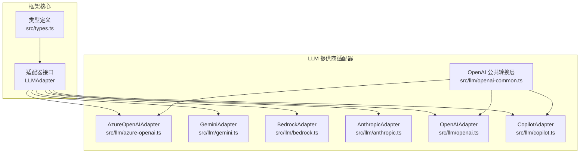
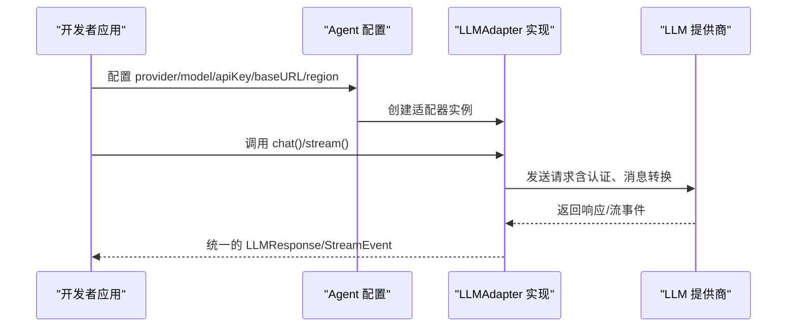
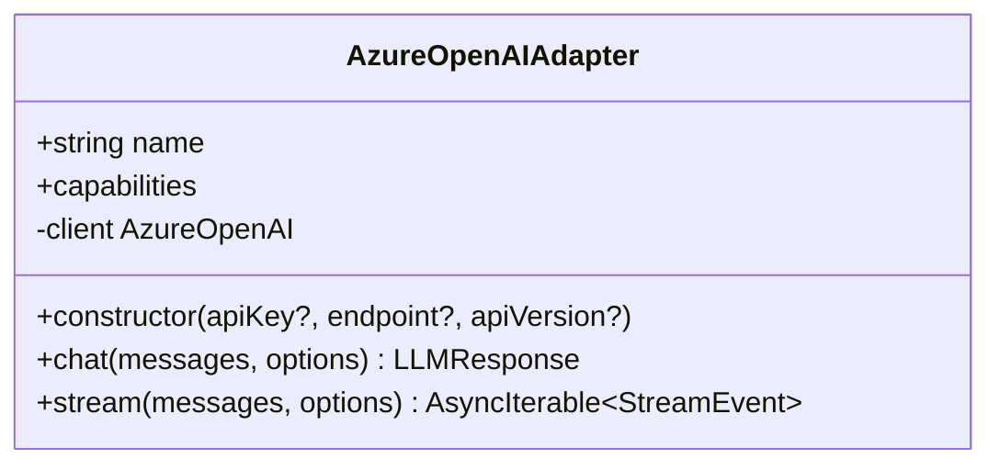
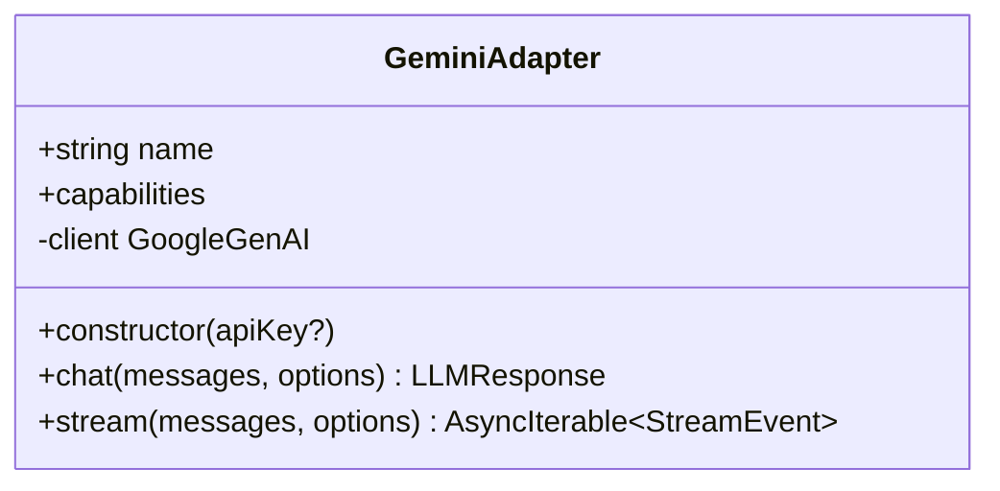
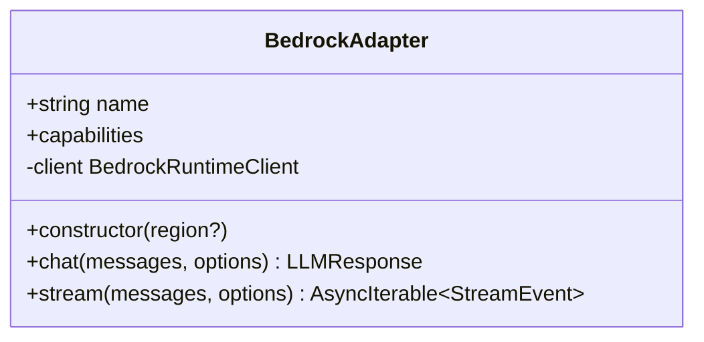
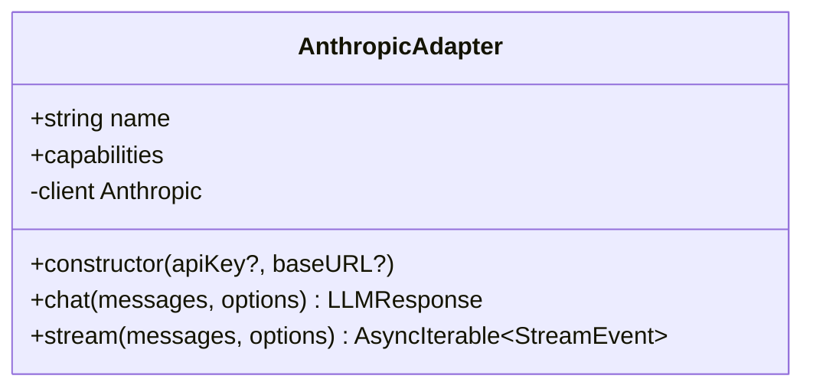
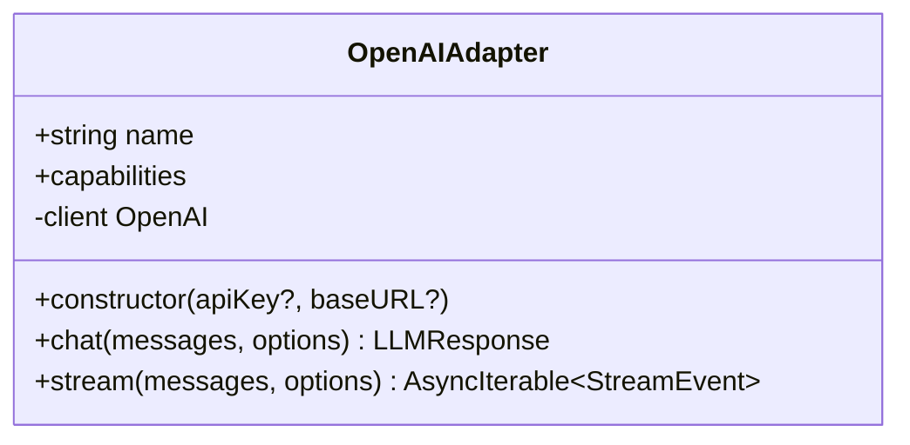
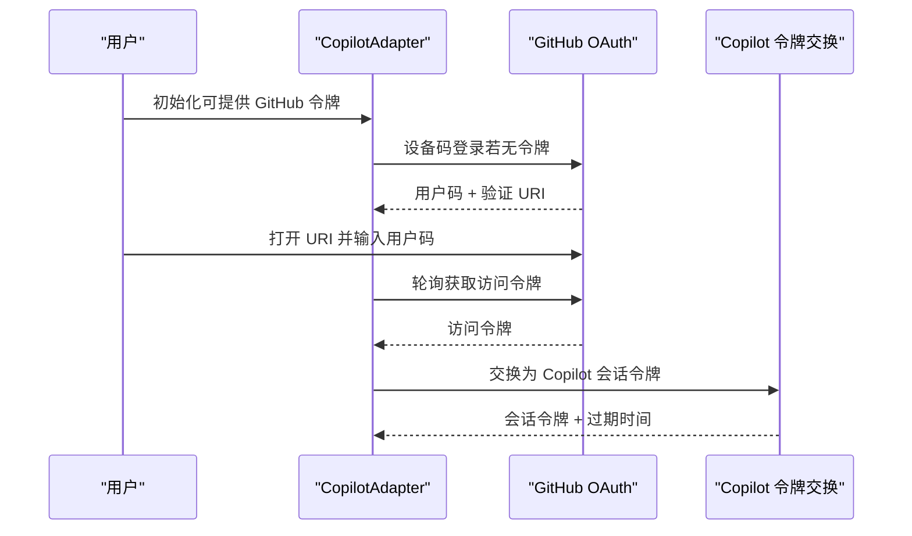
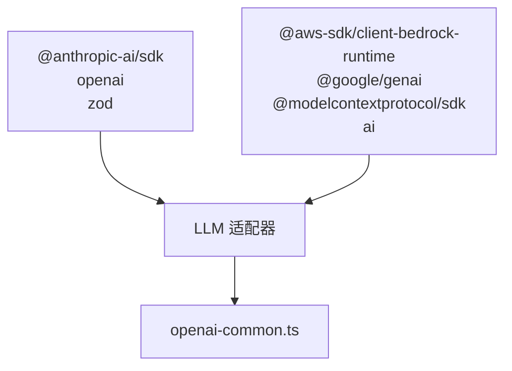

# 提供商配置

<cite>
**本文档引用的文件**
- [providers.md](file://docs/providers.md)
- [azure-openai.ts](file://src/llm/azure-openai.ts)
- [gemini.ts](file://src/llm/gemini.ts)
- [bedrock.ts](file://src/llm/bedrock.ts)
- [anthropic.ts](file://src/llm/anthropic.ts)
- [openai-common.ts](file://src/llm/openai-common.ts)
- [openai.ts](file://src/llm/openai.ts)
- [copilot.ts](file://src/llm/copilot.ts)
- [azure-openai 示例](file://examples/providers/azure-openai.ts)
- [bedrock 示例](file://examples/providers/bedrock.ts)
- [gemini 示例](file://examples/providers/gemini.ts)
- [package.json](file://package.json)
- [类型定义](file://src/types.ts)
</cite>

## 目录
1. [简介](#简介)
2. [项目结构](#项目结构)
3. [核心组件](#核心组件)
4. [架构概览](#架构概览)
5. [详细组件分析](#详细组件分析)
6. [依赖关系分析](#依赖关系分析)
7. [性能考虑](#性能考虑)
8. [故障排除指南](#故障排除指南)
9. [结论](#结论)
10. [附录](#附录)

## 简介
本指南面向使用 Open Multi-Agent 框架的开发者，系统性介绍如何在框架中配置和使用各类 LLM 提供商（Azure OpenAI、Anthropic、Google Gemini、AWS Bedrock 等）。内容涵盖认证方式、API 密钥管理、环境变量设置、配置验证与故障排除，以及生产环境下的连接池与超时设置建议。通过统一的适配器接口，框架实现了跨提供商的一致体验，开发者只需切换 provider、model 和密钥即可复用团队定义。

## 项目结构
框架采用按功能模块划分的目录结构，LLM 提供商适配器集中在 src/llm 目录下，每个适配器实现独立的类以适配特定提供商的 SDK 或 API 协议，并遵循统一的 LLMAdapter 接口规范。

**图表来源**
- [类型定义](file://src/types.ts)
- [azure-openai.ts](file://src/llm/azure-openai.ts)
- [gemini.ts](file://src/llm/gemini.ts)
- [bedrock.ts](file://src/llm/bedrock.ts)
- [anthropic.ts](file://src/llm/anthropic.ts)
- [openai-common.ts](file://src/llm/openai-common.ts)
- [openai.ts](file://src/llm/openai.ts)
- [copilot.ts](file://src/llm/copilot.ts)

**章节来源**
- [providers.md](file://docs/providers.md)
- [package.json](file://package.json)

## 核心组件
- LLMAdapter 接口：定义了所有适配器必须实现的方法（chat、stream）及能力标识（echoesReasoning），确保跨提供商行为一致。
- OpenAI 兼容层：openai-common.ts 提供统一的消息格式转换逻辑，支持工具调用、推理内容回放等。
- 提供商适配器：针对各提供商的 SDK/API 差异进行封装，处理认证、消息转换、流式输出等细节。

关键能力与特性
- 统一的 ContentBlock 类型体系：文本、推理、工具调用、工具结果、图片，保证跨提供商的数据一致性。
- 流式输出协议：统一的 StreamEvent 序列（text、reasoning、tool_use、done/error），便于前端或观察系统消费。
- 推理内容回放：通过 OpenAI 兼容层的 reasoning 文本回放机制，实现跨提供商的推理内容传递。

**章节来源**
- [类型定义](file://src/types.ts)
- [openai-common.ts](file://src/llm/openai-common.ts)

## 架构概览
下图展示了框架如何通过适配器抽象屏蔽提供商差异，统一对外提供一致的聊天与流式接口。

**图表来源**
- [anthropic.ts](file://src/llm/anthropic.ts)
- [gemini.ts](file://src/llm/gemini.ts)
- [bedrock.ts](file://src/llm/bedrock.ts)
- [azure-openai.ts](file://src/llm/azure-openai.ts)
- [openai.ts](file://src/llm/openai.ts)
- [copilot.ts](file://src/llm/copilot.ts)

## 详细组件分析

### Azure OpenAI 配置
- 认证与端点
  - 支持通过构造函数参数或环境变量 AZURE_OPENAI_API_KEY、AZURE_OPENAI_ENDPOINT、AZURE_OPENAI_API_VERSION 设置密钥与端点。
  - 当未显式传入模型名时，可使用 AZURE_OPENAI_DEPLOYMENT 作为部署名称回退。
- 模型字段
  - agent.config 中的 model 字段应填写 Azure 部署名称（如 "my-gpt4-prod"），而非底层模型名称。
- API 版本
  - 默认 API 版本为 '2024-10-21'；新版本 v1 API（标准 OpenAI 客户端 + baseURL={endpoint}/openai/v1/）暂不支持。
- 能力与限制
  - echoesReasoning: 'never'，不接受推理输入。
  - 不支持 top_k/min_p 参数（Azure OpenAI 托管端点不接受 vLLM 专用参数）。

**图表来源**
- [azure-openai.ts](file://src/llm/azure-openai.ts)

**章节来源**
- [azure-openai.ts](file://src/llm/azure-openai.ts)
- [azure-openai 示例](file://examples/providers/azure-openai.ts)

### Google Gemini 配置
- 认证与 SDK
  - 使用 @google/genai SDK，支持通过构造函数参数或环境变量 GEMINI_API_KEY、GOOGLE_API_KEY 设置密钥。
- 推理签名回环
  - 仅当推理块携带签名时才回传，以满足 Gemini 3 的严格协议要求；无签名的推理内容会被丢弃以保持上下文简洁。
- 工具调用
  - 将工具定义转换为 Gemini 的 functionDeclarations 格式；工具调用 ID 在部分旧版本响应中可能缺失，框架会生成伪随机 ID 以满足框架契约。
- 能力
  - echoesReasoning: 'own-issued'，支持自身发出的推理内容回环。

**图表来源**
- [gemini.ts](file://src/llm/gemini.ts)

**章节来源**
- [gemini.ts](file://src/llm/gemini.ts)
- [gemini 示例](file://examples/providers/gemini.ts)

### AWS Bedrock 配置
- 认证与凭据链
  - 无需 API Key；通过 AWS SDK 默认凭据链解析（环境变量、共享配置、IAM 角色等）。
  - region 解析顺序：构造函数参数 > AWS_REGION > 'us-east-1'。
- 统一 Converse API
  - 通过 Converse/ConverseStream API 统一支持 Claude、Llama、Mistral、Cohere、Titan 等模型族。
- 推理签名
  - 当前不支持推理签名回环（需双方均支持签名字段）。
- 工具调用
  - 将工具定义转换为 Bedrock 的 toolSpec 格式；工具结果以 toolResult 形式回传。

**图表来源**
- [bedrock.ts](file://src/llm/bedrock.ts)

**章节来源**
- [bedrock.ts](file://src/llm/bedrock.ts)
- [bedrock 示例](file://examples/providers/bedrock.ts)

### Anthropic 配置
- 认证与 SDK
  - 使用 @anthropic-ai/sdk，支持通过构造函数参数或环境变量 ANTHROPIC_API_KEY 设置密钥。
- 推理签名
  - 严格校验推理签名，仅回传自身发出且携带签名的推理块；跨提供商推理或无签名推理会被丢弃。
- 思维预算
  - 对 budgetTokens 进行约束检查（≥1024 且 < maxTokens），否则抛出明确错误。
- 能力
  - echoesReasoning: 'own-issued'，支持自身发出的推理内容回环。

**图表来源**
- [anthropic.ts](file://src/llm/anthropic.ts)

**章节来源**
- [anthropic.ts](file://src/llm/anthropic.ts)

### OpenAI 兼容配置
- 认证与 SDK
  - 使用 openai SDK，支持通过构造函数参数或环境变量 OPENAI_API_KEY 设置密钥。
- 推理回放
  - 通过 OpenAI 兼容层的 reasoning 文本回放机制，将推理内容以 <thinking> 格式注入请求体。
- 工具调用
  - 将工具定义转换为 OpenAI function 格式；工具结果以独立的 tool 角色消息回传。
- 能力
  - echoesReasoning: 'never'，不接受推理输入。

**图表来源**
- [openai.ts](file://src/llm/openai.ts)
- [openai-common.ts](file://src/llm/openai-common.ts)

**章节来源**
- [openai.ts](file://src/llm/openai.ts)
- [openai-common.ts](file://src/llm/openai-common.ts)

### GitHub Copilot 配置
- 认证流程
  - 支持 GitHub OAuth 令牌（优先级：构造函数参数 > GITHUB_COPILOT_TOKEN > GITHUB_TOKEN > 交互式设备码流程）。
  - 设备码流程会提示用户打开浏览器完成授权，随后轮询获取访问令牌并换取 Copilot 会话令牌。
- 会话令牌管理
  - 缓存短期会话令牌并在过期前自动刷新；并发刷新通过内部互斥串行化避免竞争。
- 能力
  - echoesReasoning: 'never'，代理 OpenAI Chat Completions，不接受推理输入。

**图表来源**
- [copilot.ts](file://src/llm/copilot.ts)

**章节来源**
- [copilot.ts](file://src/llm/copilot.ts)

## 依赖关系分析
- 运行时依赖
  - @anthropic-ai/sdk、openai、zod：核心 SDK 依赖。
- 可选依赖
  - @aws-sdk/client-bedrock-runtime、@google/genai、@modelcontextprotocol/sdk、ai：按提供商可选安装。
- 适配器与公共层
  - OpenAI 兼容适配器（OpenAI、AzureOpenAI、Copilot）共享 openai-common.ts 的消息转换逻辑。

**图表来源**
- [package.json](file://package.json)

**章节来源**
- [package.json](file://package.json)

## 性能考虑
- 本地模型推理
  - 对于本地模型（如 Ollama、vLLM、LM Studio、llama.cpp），可通过 OpenAI 兼容端点使用工具调用。
  - 建议为慢速本地推理设置合理的 timeoutMs（例如 120_000ms），并根据需要调整采样参数（topK、minP、频率惩罚等）。
- 流式输出
  - 各适配器均提供流式接口，便于实时展示文本增量、推理增量与工具调用组装过程。
- 超时与中断
  - 通过 AbortSignal 控制请求生命周期，避免长时间阻塞；AgentConfig.timeoutMs 提供端到端超时保护。

**章节来源**
- [providers.md](file://docs/providers.md)
- [类型定义](file://src/types.ts)

## 故障排除指南
- 模型未调用工具
  - 确认模型在 Ollama 的 Tools 分类中；更新 Ollama 至最新版本；若使用本地服务器，确认未被代理干扰（可设置 no_proxy=localhost）。
- Azure OpenAI 部署名称错误
  - 确保 agent.config 中的 model 填写的是 Azure 部署名称，而非底层模型名称；若为空可设置 AZURE_OPENAI_DEPLOYMENT 回退。
- Bedrock 模型 ID 前缀
  - 新版 Claude 模型在某些区域需要跨区域推断配置前缀（如 us.），请在 Bedrock 控制台查询可用模型 ID。
- Copilot 认证失败
  - 若未提供 GitHub 令牌，将触发交互式设备码流程；请确保网络可访问 GitHub 并完成授权。

**章节来源**
- [providers.md](file://docs/providers.md)
- [azure-openai.ts](file://src/llm/azure-openai.ts)
- [bedrock.ts](file://src/llm/bedrock.ts)
- [copilot.ts](file://src/llm/copilot.ts)

## 结论
通过统一的适配器抽象与公共转换层，Open Multi-Agent 框架实现了对多家 LLM 提供商的一致接入。开发者只需关注 provider、model 与密钥配置，即可在 Azure OpenAI、Anthropic、Google Gemini、AWS Bedrock 等平台上无缝运行多智能体协作任务。结合完善的流式输出协议、推理回放机制与超时控制，框架在易用性与生产稳定性之间取得了良好平衡。

## 附录

### 环境变量与配置要点
- Anthropic
  - ANTHROPIC_API_KEY：API 密钥
- Google Gemini
  - GEMINI_API_KEY 或 GOOGLE_API_KEY：API 密钥
- Azure OpenAI
  - AZURE_OPENAI_API_KEY：API 密钥
  - AZURE_OPENAI_ENDPOINT：端点 URL
  - AZURE_OPENAI_API_VERSION：API 版本（默认 2024-10-21）
  - AZURE_OPENAI_DEPLOYMENT：部署名称回退
- AWS Bedrock
  - AWS_REGION：AWS 区域（可选，默认 us-east-1）
  - AWS 凭据：通过环境变量、共享配置或 IAM 角色解析
- GitHub Copilot
  - GITHUB_COPILOT_TOKEN 或 GITHUB_TOKEN：GitHub OAuth 令牌（可选）
- OpenAI 兼容
  - OPENAI_API_KEY：API 密钥
  - OPENAI_BASE_URL：自定义基础 URL（用于本地或兼容服务）

**章节来源**
- [anthropic.ts](file://src/llm/anthropic.ts)
- [gemini.ts](file://src/llm/gemini.ts)
- [azure-openai.ts](file://src/llm/azure-openai.ts)
- [bedrock.ts](file://src/llm/bedrock.ts)
- [copilot.ts](file://src/llm/copilot.ts)
- [openai.ts](file://src/llm/openai.ts)