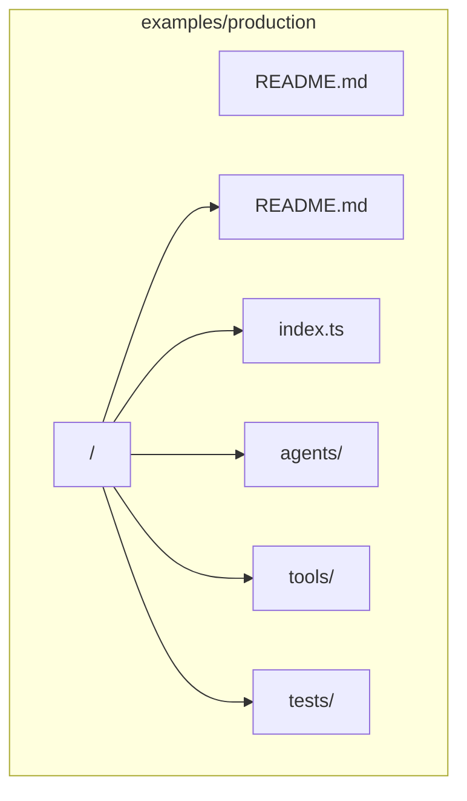
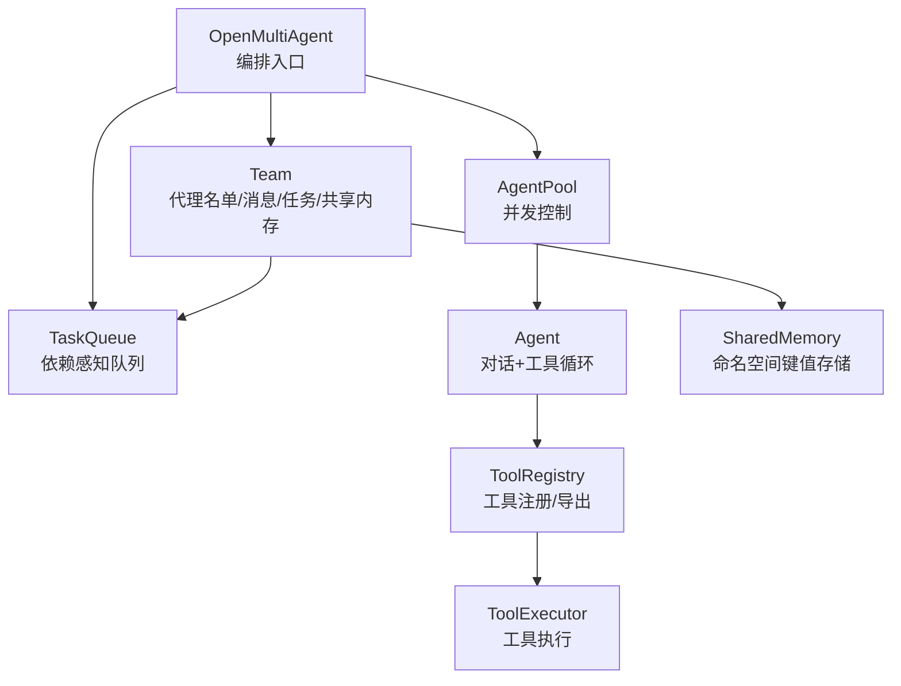
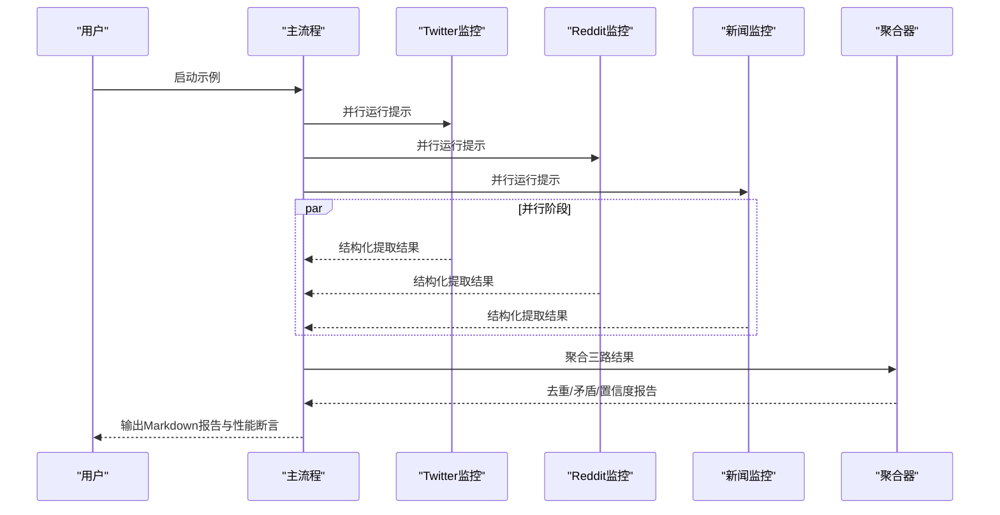
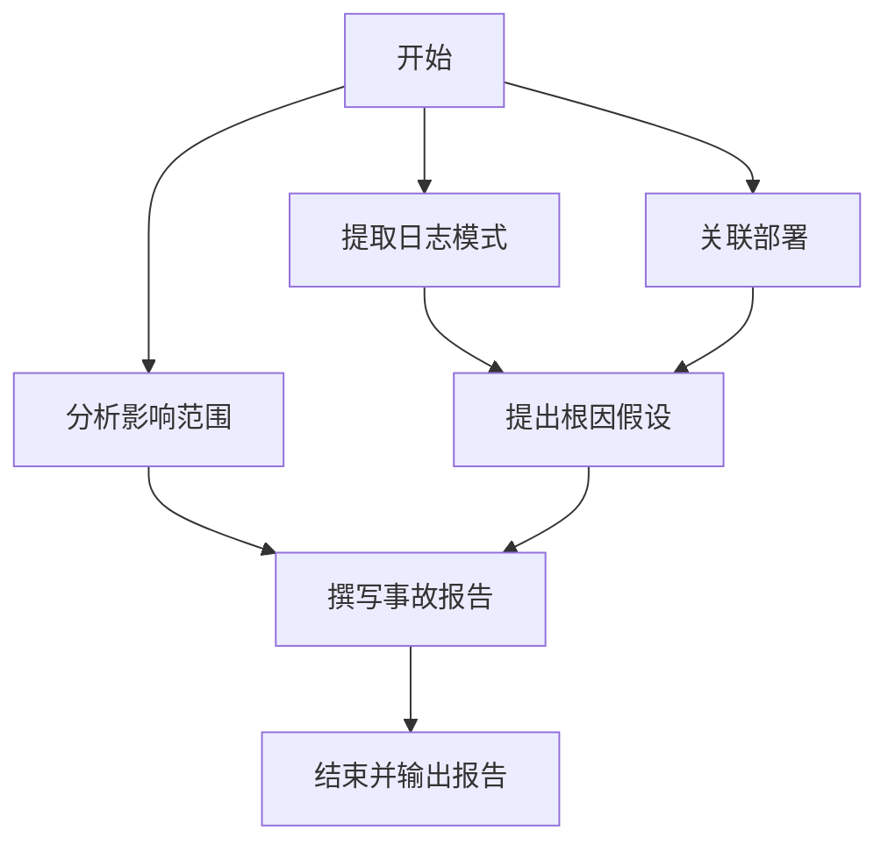
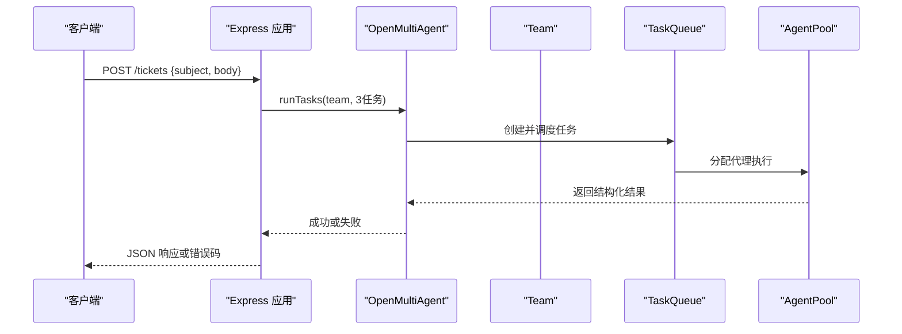
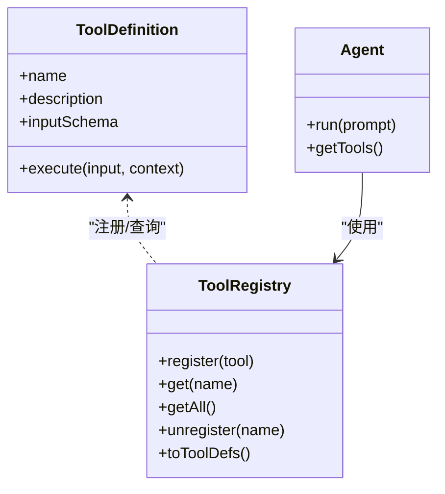
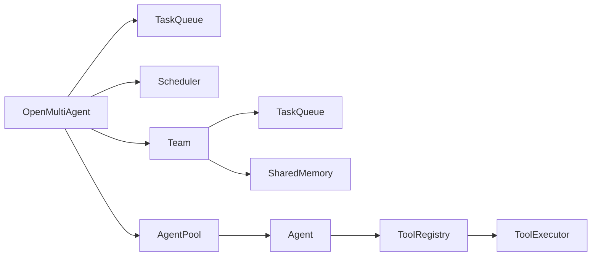

# 生产示例

<cite>
**本文引用的文件**
- [examples/production/README.md](file://examples/production/README.md)
- [examples/cookbook/competitive-monitoring.ts](file://examples/cookbook/competitive-monitoring.ts)
- [examples/cookbook/incident-postmortem-dag.ts](file://examples/cookbook/incident-postmortem-dag.ts)
- [examples/integrations/express-customer-support/index.ts](file://examples/integrations/express-customer-support/index.ts)
- [examples/integrations/express-customer-support/package.json](file://examples/integrations/express-customer-support/package.json)
- [examples/integrations/express-customer-support/smoke.ts](file://examples/integrations/express-customer-support/smoke.ts)
- [examples/basics/multi-model-team.ts](file://examples/basics/multi-model-team.ts)
- [examples/cookbook/meeting-summarizer.ts](file://examples/cookbook/meeting-summarizer.ts)
- [src/orchestrator/orchestrator.ts](file://src/orchestrator/orchestrator.ts)
- [src/team/team.ts](file://src/team/team.ts)
- [src/tool/framework.ts](file://src/tool/framework.ts)
- [src/errors.ts](file://src/errors.ts)
- [docs/shared-memory.md](file://docs/shared-memory.md)
- [docs/observability.md](file://docs/observability.md)
- [vitest.config.ts](file://vitest.config.ts)
- [examples/fixtures/competitive-monitoring/news.json](file://examples/fixtures/competitive-monitoring/news.json)
</cite>

## 目录
1. [简介](#简介)
2. [项目结构](#项目结构)
3. [核心组件](#核心组件)
4. [架构总览](#架构总览)
5. [详细组件分析](#详细组件分析)
6. [依赖关系分析](#依赖关系分析)
7. [性能考量](#性能考量)
8. [故障排查指南](#故障排查指南)
9. [结论](#结论)
10. [附录](#附录)

## 简介
本文件面向在生产环境中落地“多智能体协作”的工程团队，基于 open-multi-agent 框架的真实示例，系统化阐述如何构建健壮的多智能体应用：如何优雅处理 LLM 失败、工具失败与团队部分失败；如何设计可复现、可测试、可观测的端到端工作流；以及如何以最小改动适配不同供应商与模型。文档同时给出验收标准、项目结构模板与部署指南，帮助读者快速从 PoC 进化到生产可用。

## 项目结构
生产示例位于 examples/production/ 目录下，遵循“每个用例独立子目录 + README + 入口脚本 + agents/tools/tests”的布局，强调“真实问题、错误处理、可复现、可测试”。与 examples/basics/、examples/cookbook/、examples/integrations/ 的教学导向不同，production 示例更关注工程化落地与运维约束。



图示来源
- [examples/production/README.md:24-34](file://examples/production/README.md#L24-L34)

章节来源
- [examples/production/README.md:1-39](file://examples/production/README.md#L1-L39)

## 核心组件
- 协调器与编排：OpenMultiAgent 提供 runTeam/runTasks、任务队列、调度器、代理池、预算控制与重试机制，是生产级编排的核心。
- 团队 Team：负责代理名单、消息总线、任务队列与可选共享内存，提供事件总线用于进度回调。
- 工具框架：defineTool 定义类型安全工具，ToolRegistry 注册与导出 LLM 友好 JSON Schema，支持输出校验与最大输出长度限制。
- 错误与预算：TokenBudgetExceededError 用于预算超支场景；执行层内置指数退避重试与取消信号传播。

章节来源
- [src/orchestrator/orchestrator.ts:1-120](file://src/orchestrator/orchestrator.ts#L1-L120)
- [src/team/team.ts:88-151](file://src/team/team.ts#L88-L151)
- [src/tool/framework.ts:51-111](file://src/tool/framework.ts#L51-L111)
- [src/errors.ts:8-19](file://src/errors.ts#L8-L19)

## 架构总览
下图展示生产示例中“协调器 → 团队 → 代理池/任务队列/共享内存”的交互关系，以及典型错误处理与可观测性路径。



图示来源
- [src/orchestrator/orchestrator.ts:61-70](file://src/orchestrator/orchestrator.ts#L61-L70)
- [src/team/team.ts:98-151](file://src/team/team.ts#L98-L151)
- [src/tool/framework.ts:121-200](file://src/tool/framework.ts#L121-L200)

## 详细组件分析

### 组件A：竞争监测（多源聚合与矛盾检测）
该示例演示三路并行监控、跨源去重与矛盾识别，并通过结构化输出与并行加速断言，体现生产级质量门禁。



图示来源
- [examples/cookbook/competitive-monitoring.ts:237-350](file://examples/cookbook/competitive-monitoring.ts#L237-L350)

章节来源
- [examples/cookbook/competitive-monitoring.ts:1-448](file://examples/cookbook/competitive-monitoring.ts#L1-L448)

### 组件B：事故后评估（DAG 并行扇出）
该示例以 DAG 形式组织五个任务，三个根任务并行启动，后续任务在依赖满足后合成最终报告，包含并行窗口检查与成本估算。



图示来源
- [examples/cookbook/incident-postmortem-dag.ts:331-365](file://examples/cookbook/incident-postmortem-dag.ts#L331-L365)

章节来源
- [examples/cookbook/incident-postmortem-dag.ts:1-438](file://examples/cookbook/incident-postmortem-dag.ts#L1-L438)

### 组件C：Express 客户工单流水线（HTTP 集成）
该示例将三阶段流水线封装为 HTTP 接口，包含请求体校验、超时与取消、结构化输出与错误处理，适合生产服务集成。



图示来源
- [examples/integrations/express-customer-support/index.ts:145-226](file://examples/integrations/express-customer-support/index.ts#L145-L226)

章节来源
- [examples/integrations/express-customer-support/index.ts:1-238](file://examples/integrations/express-customer-support/index.ts#L1-L238)

### 组件D：多模型团队与自定义工具
该示例演示混合供应商模型、自定义工具注册与 AgentPool 执行，展示工具失败降级策略与结构化输出。



图示来源
- [src/tool/framework.ts:121-200](file://src/tool/framework.ts#L121-L200)
- [examples/basics/multi-model-team.ts:116-171](file://examples/basics/multi-model-team.ts#L116-L171)

章节来源
- [examples/basics/multi-model-team.ts:1-262](file://examples/basics/multi-model-team.ts#L1-L262)
- [src/tool/framework.ts:1-200](file://src/tool/framework.ts#L1-L200)

## 依赖关系分析
- 编排层依赖：OpenMultiAgent 依赖 Team、TaskQueue、Scheduler、AgentPool、Agent、ToolRegistry/Executor、SharedMemory。
- 错误与预算：执行层在任务粒度上进行重试与预算检查，失败不中断其余任务，支持取消信号传播。
- 观测性：onProgress 提供轻量事件；onTrace 提供结构化跨度；渲染仪表盘用于事后复盘。



图示来源
- [src/orchestrator/orchestrator.ts:61-70](file://src/orchestrator/orchestrator.ts#L61-L70)
- [src/team/team.ts:98-151](file://src/team/team.ts#L98-L151)

章节来源
- [src/orchestrator/orchestrator.ts:561-800](file://src/orchestrator/orchestrator.ts#L561-L800)
- [src/team/team.ts:1-346](file://src/team/team.ts#L1-L346)

## 性能考量
- 并行优先：无共享依赖的任务默认并行执行，独立任务并发上限受 maxConcurrency 控制。
- 时间断言：示例中通过并行时间与串行求和对比，验证并行收益；在竞争监测示例中要求并行耗时小于串行的 70%。
- 成本估算：示例内打印输入/输出令牌用量，并按目标模型价格估算美元成本，便于预算控制。
- 预算控制：当累计令牌用量超过阈值时触发预算超支事件，后续任务跳过，避免无限开销。

章节来源
- [examples/cookbook/competitive-monitoring.ts:414-427](file://examples/cookbook/competitive-monitoring.ts#L414-L427)
- [examples/cookbook/incident-postmortem-dag.ts:394-399](file://examples/cookbook/incident-postmortem-dag.ts#L394-L399)
- [src/orchestrator/orchestrator.ts:733-747](file://src/orchestrator/orchestrator.ts#L733-L747)

## 故障排查指南
- LLM 失败：示例普遍采用结构化输出与严格断言，一旦某阶段失败立即终止并返回错误信息；在 HTTP 集成中区分超时与通用失败。
- 工具失败：自定义工具具备降级策略（如网络失败时返回桩数据），保证流水线可继续推进；工具输出可配置最大长度与二次校验。
- 团队部分失败：任务失败仅阻断其直接下游，其他非依赖任务继续执行；可通过 onProgress 与 onTrace 定位失败点。
- 取消与超时：在 HTTP 示例中使用 AbortSignal 与竞态超时，确保长链路不会无限等待。
- 预算超支：当累计令牌用量超过预算，编排器发出事件并跳过剩余任务，避免进一步开销。

章节来源
- [examples/integrations/express-customer-support/index.ts:156-226](file://examples/integrations/express-customer-support/index.ts#L156-L226)
- [examples/basics/multi-model-team.ts:58-71](file://examples/basics/multi-model-team.ts#L58-L71)
- [src/errors.ts:8-19](file://src/errors.ts#L8-L19)
- [src/orchestrator/orchestrator.ts:668-702](file://src/orchestrator/orchestrator.ts#L668-L702)

## 结论
通过以上生产示例，可以系统掌握如何在真实业务场景中落地多智能体：以结构化输出与并行执行保障吞吐与质量；以重试、预算与可观测性保障稳定性与可维护性；以 HTTP 集成与测试用例保障可复现与可演进。建议在生产中结合共享内存与仪表盘，形成“执行—观测—复盘”的闭环。

## 附录

### 生产示例验收标准
- 真实用例：解决真实商业问题，而非演示性任务。
- 错误处理：优雅处理 LLM/工具/团队部分失败，避免裸 await 导致的单点崩溃。
- 文档规范：每个示例子目录包含 README，覆盖问题背景、架构/任务图、所需环境变量与外部服务、本地运行方式、预期运行时与近似成本。
- 可复现：固定模型版本；不依赖私有数据集或未公开 API。
- 测试验证：至少包含一次冒烟测试或端到端测试，验证框架升级后仍可运行。

章节来源
- [examples/production/README.md:7-22](file://examples/production/README.md#L7-L22)

### 项目结构模板（生产示例）
```bash
production/
└── <use-case>/
    ├── README.md          # 必填：问题描述、架构/任务图、环境变量、运行方式、成本预估
    ├── index.ts           # 入口脚本
    ├── agents/            # AgentConfig 定义
    ├── tools/             # 自定义工具（如有）
    └── tests/             # 冒烟测试或 e2e 测试
```

章节来源
- [examples/production/README.md:24-34](file://examples/production/README.md#L24-L34)

### 部署指南（以 Express 客户工单为例）
- 安装与启动
  - 在根目录执行构建后再启动示例服务。
  - 使用 tsx 直接运行入口脚本。
- 环境变量
  - 至少设置所选供应商的 API Key（例如 ANTHROPIC_API_KEY）。
  - 可通过环境变量覆盖各代理的 provider/model，实现混跑与成本优化。
- 冒烟测试
  - 提供 smoke.ts，自动向 /tickets 发起请求并校验响应结构。
- 运行方式
  - 本地开发：npm start
  - 冒烟测试：npm run smoke

章节来源
- [examples/integrations/express-customer-support/index.ts:1-16](file://examples/integrations/express-customer-support/index.ts#L1-L16)
- [examples/integrations/express-customer-support/package.json:5-9](file://examples/integrations/express-customer-support/package.json#L5-L9)
- [examples/integrations/express-customer-support/smoke.ts:1-28](file://examples/integrations/express-customer-support/smoke.ts#L1-L28)

### 最佳实践清单
- 使用结构化输出（Zod）约束 LLM 输出，失败即断言，避免“半成品”进入下游。
- 对工具失败进行降级与回退，必要时返回桩数据，保证流水线继续。
- 为关键任务配置重试与指数退避，避免瞬时抖动放大。
- 为长链路设置超时与取消信号，防止资源泄漏。
- 开启预算控制与成本估算，避免无界开销。
- 使用 onProgress/onTrace 记录可观测性数据，配合仪表盘沉淀知识。
- 将共享内存启用在需要跨阶段共享上下文的场景，注意键命名与 TTL 策略。

章节来源
- [docs/observability.md:1-57](file://docs/observability.md#L1-L57)
- [docs/shared-memory.md:1-28](file://docs/shared-memory.md#L1-L28)
- [src/orchestrator/orchestrator.ts:266-333](file://src/orchestrator/orchestrator.ts#L266-L333)

### 测试与覆盖率配置
- Vitest 配置包含覆盖率统计与排除规则，便于持续集成中的质量门禁。
- E2E 测试默认排除，需通过环境变量开启。

章节来源
- [vitest.config.ts:1-19](file://vitest.config.ts#L1-L19)

### 示例数据参考
- 竞争监测示例使用的本地 JSON 数据，包含多条声明与置信度，便于演示跨源矛盾检测。

章节来源
- [examples/fixtures/competitive-monitoring/news.json:1-63](file://examples/fixtures/competitive-monitoring/news.json#L1-L63)